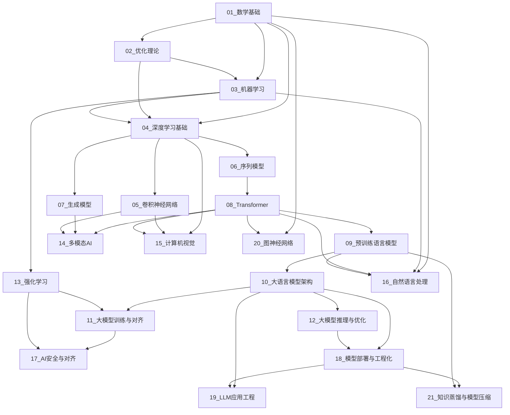

# AI学习笔记总索引

> 本索引按照**技术方向为主轴**组织AI知识体系，每个方向内部标注**历史演进**脉络，并包含**核心公式推导**以达到深度学习研究级技术深度。

---

## 21大核心技术方向

| 编号 | 方向 | 核心主题 |
|------|------|----------|
| 01 | [数学基础](../01_数学基础/00_数学基础.md) | 线性代数、微积分、概率论、信息论 |
| 02 | [优化理论与方法](../02_优化理论与方法/00_优化理论与方法.md) | 梯度下降、Adam、凸优化、KKT条件 |
| 03 | [机器学习](../03_机器学习/00_机器学习.md) | 监督/无监督学习、集成学习、SVM、EM |
| 04 | [深度学习基础](../04_深度学习基础/00_深度学习基础.md) | 反向传播、激活函数、正则化、BatchNorm |
| 05 | [卷积神经网络](../05_卷积神经网络/00_卷积神经网络.md) | CNN架构、ResNet、目标检测、深度可分离卷积 |
| 06 | [序列模型](../06_序列模型/00_序列模型.md) | RNN、LSTM、GRU、CTC、Mamba/SSM |
| 07 | [生成模型](../07_生成模型/00_生成模型.md) | GAN、VAE、扩散模型、Flow Matching |
| 08 | [Transformer与注意力机制](../08_Transformer与注意力机制/00_Transformer与注意力机制_综述.md) | Self-Attention、MHA、RoPE、FlashAttention |
| 09 | [预训练语言模型](../09_预训练语言模型/00_预训练语言模型.md) | BERT、GPT、T5、Scaling Laws |
| 10 | [大语言模型核心架构](../10_大语言模型核心架构/00_大语言模型核心架构.md) | MoE、SwiGLU、MLA、GQA、长上下文 |
| 11 | [大模型训练与对齐](../11_大模型训练与对齐/00_大模型训练与对齐.md) | SFT、RLHF、DPO、GRPO、LoRA |
| 12 | [大模型推理与优化](../12_大模型推理与优化/00_大模型推理与优化.md) | KV-Cache、量化、投机解码、vLLM |
| 13 | [强化学习](../13_强化学习/00_强化学习_综述.md) | MDP、Q-Learning、DQN、PPO、RLHF、GRPO |
| 14 | [多模态AI](../14_多模态AI/00_多模态AI.md) | CLIP、LLaVA、图像/视频生成、语音、多模态Agent、统一多模态模型 |
| 15 | [计算机视觉](../15_计算机视觉/00_计算机视觉.md) | 传统CV、CNN检测、NeRF、SAM |
| 16 | [自然语言处理](../16_自然语言处理/00_自然语言处理.md) | 分词、CRF、信息检索、机器翻译 |
| 17 | [AI安全与对齐](../17_AI安全与对齐/00_AI安全与对齐.md) | 对抗攻防、差分隐私、可解释性、价值对齐 |
| 18 | [模型部署与工程化](../18_模型部署与工程化/00_模型部署与工程化.md) | 服务化、容器化、MLOps、延迟优化 |
| 19 | [LLM应用工程](../19_LLM应用工程/00_LLM应用工程.md) | 提示工程、RAG、Agent、工具调用 |
| 20 | [图神经网络](../20_图神经网络/00_图神经网络.md) | GCN、GAT、GIN、消息传递 |
| 21 | [知识蒸馏与模型压缩](../21_知识蒸馏与模型压缩/00_知识蒸馏与模型压缩.md) | 软标签蒸馏、剪枝、低秩分解 |

---

## 笔记组织策略

### 标签体系

- **方向标签**：`#数学基础` `#优化理论` `#深度学习` `#Transformer` ...
- **阶段标签**：`#早期理论` `#符号时代` `#统计学习` `#深度复兴` `#大模型时代` `#研究前沿`
- **类型标签**：`#公式推导` `#论文精读` `#代码实践` `#理论分析` `#工程经验`

### 复习计划

- **每周**：回顾1-2个方向的公式推导
- **每月**：横向对比相关方向的演进脉络
- **每季度**：更新前沿进展，修订过时内容

---

## 技术方向依赖关系

