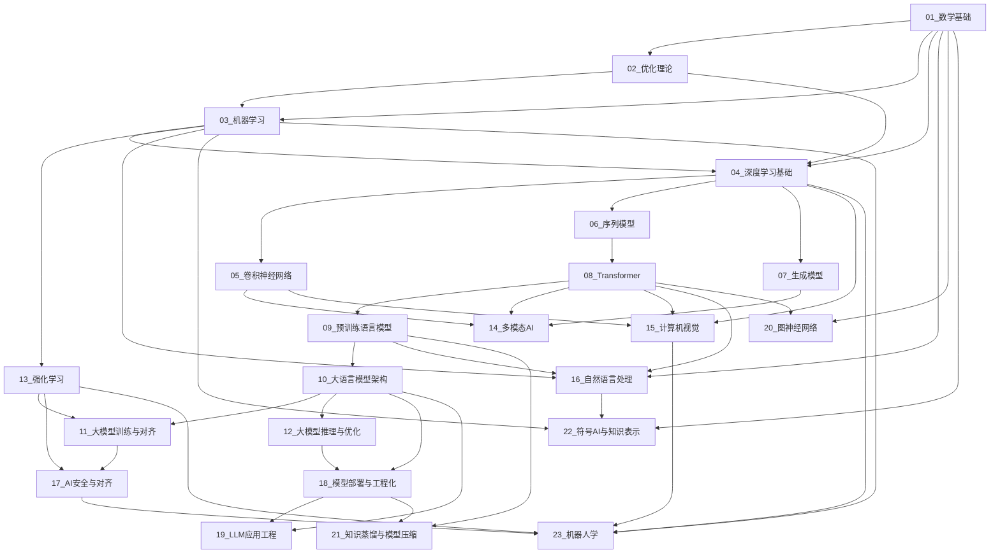

---
tags:
  - 导航
  - 索引
  - 知识体系
  - 学习路径
created: 2025-07-10
updated: 2026-07-10
---

# AI学习笔记总索引

> **角色**：结构化总目录与知识地图。按**技术方向为主轴**组织AI知识体系，提供可导航的方向表格、依赖关系图和标签体系。如需了解各方向的语义全景，请参见 [[00_总览与导航|AI全栈知识体系全景综述]]。

---

## 导航结构说明

本索引提供**结构化导航**，与 [[00_总览与导航|AI全栈知识体系全景综述]] 互补：
- **本索引**：方向表格 + Mermaid 依赖图 + 标签体系 + 复习计划 — 适合快速定位和系统性复习
- **全景综述**：AI领域发展脉络 + 知识体系架构 + 模块导航链接 — 适合理解宏观格局和领域间关系
- **历史脉络**：[[../00_AI发展史/00_AI发展史总览|AI发展史总览]] — 按时间线讲述AI发展故事，适合建立历史认知框架

---

## 23大核心技术方向

| 编号 | 方向 | 核心主题 |
|------|------|----------|
| 01 | [数学基础](../01_数学基础/00_数学基础_综述.md) | 线性代数、微积分、概率论、信息论、概率图模型 |
| 02 | [优化理论与方法](../02_优化理论与方法/00_优化理论与方法_综述.md) | 梯度下降、Adam、凸优化、KKT条件、分布式优化 |
| 03 | [机器学习](../03_机器学习/00_机器学习_综述.md) | 监督/无监督学习、集成学习、SVM、EM |
| 04 | [深度学习基础](../04_深度学习基础/00_深度学习基础_综述.md) | 反向传播、激活函数、正则化、BatchNorm |
| 05 | [卷积神经网络](../05_卷积神经网络/00_卷积神经网络_综述.md) | CNN架构、ResNet、目标检测、深度可分离卷积 |
| 06 | [序列模型](../06_序列模型/00_序列模型_综述.md) | RNN、LSTM、GRU、CTC、Mamba/SSM |
| 07 | [生成模型](../07_生成模型/00_生成模型_综述.md) | GAN、VAE、扩散模型、Flow Matching |
| 08 | [Transformer与注意力机制](../08_Transformer与注意力机制/00_Transformer与注意力机制_综述.md) | Self-Attention、MHA、RoPE、FlashAttention |
| 09 | [预训练语言模型](../09_预训练语言模型/00_预训练语言模型_综述.md) | BERT、GPT、T5、Scaling Laws |
| 10 | [大语言模型核心架构](../10_大语言模型核心架构/00_大语言模型核心架构_综述.md) | MoE、SwiGLU、MLA、GQA、长上下文 |
| 11 | [大模型训练与对齐](../11_大模型训练与对齐/00_大模型训练与对齐_综述.md) | SFT、RLHF、DPO、GRPO、LoRA |
| 12 | [大模型推理与优化](../12_大模型推理与优化/00_大模型推理与优化_综述.md) | KV-Cache、量化、投机解码、vLLM |
| 13 | [强化学习](../13_强化学习/00_强化学习_综述.md) | MDP、Q-Learning、DQN、PPO、RLHF、GRPO、博弈论 |
| 14 | [多模态AI](../14_多模态AI/00_多模态AI_综述.md) | CLIP、LLaVA、图像/视频生成、语音、多模态Agent |
| 15 | [计算机视觉](../15_计算机视觉/00_计算机视觉_综述.md) | 传统CV、CNN检测、NeRF、SAM |
| 16 | [自然语言处理](../16_自然语言处理/00_自然语言处理_综述.md) | 分词、CRF、信息检索、机器翻译 |
| 17 | [AI安全与对齐](../17_AI安全与对齐/00_AI安全与对齐_综述.md) | 对抗攻防、差分隐私、可解释性、价值对齐 |
| 18 | [模型部署与工程化](../18_模型部署与工程化/00_模型部署与工程化_综述.md) | 服务化、容器化、MLOps、硬件加速、数据工程 |
| 19 | [LLM应用工程](../19_LLM应用工程/00_LLM应用工程_综述.md) | 提示工程、RAG、Agent、工具调用 |
| 20 | [图神经网络](../20_图神经网络/00_图神经网络_综述.md) | GCN、GAT、GIN、消息传递 |
| 21 | [知识蒸馏与模型压缩](../21_知识蒸馏与模型压缩/00_知识蒸馏与模型压缩_综述.md) | 软标签蒸馏、剪枝、低秩分解 |
| 22 | [符号AI与知识表示](../22_符号AI与知识表示/00_符号AI与知识表示_综述.md) | 自动机、形式逻辑、知识图谱、专家系统、搜索与规划 |
| 23 | [机器人学](../23_机器人学/00_机器人学_综述.md) | 运动学/动力学、SLAM、运动规划、ROS |

### 辅助模块

| 模块 | 路径 | 说明 |
|------|------|------|
| [AI发展史](../00_AI发展史/00_AI发展史总览.md) | 00_AI发展史 | AI从图灵测试到大模型时代的完整历史叙事 |
| [评估与基准](./01_评估与基准.md) | 00_总览与导航 | 评估指标、基准数据集（ImageNet/GLUE/MMLU）、MLPerf、LLM-as-Judge |
| [全局公式索引](./02_AI学习笔记全局公式索引.md) | 00_总览与导航 | 按方向分类汇总全部核心数学公式，含来源链接 |
| [学习里程碑模板](./03_学习里程碑与进度模板.md) | 00_总览与导航 | 四阶段学习路径规划、验收标准与进度追踪 |

---

## 笔记组织策略

### 标签体系

- **方向标签**：`#数学基础` `#优化理论` `#深度学习` `#Transformer` ...
- **阶段标签**：`#早期理论` `#符号时代` `#统计学习` `#深度复兴` `#大模型时代` `#研究前沿`
- **类型标签**：`#公式推导` `#论文精读` `#代码实践` `#理论分析` `#工程经验`

### 复习计划

- **每周**：回顾1-2个方向的公式推导
- **每月**：横向对比相关方向的演进脉络
- **每季度**：更新前沿进展，修订过时内容

### 新增内容归类规则

- **先判断层级**：新主题优先归入已有方向，不因短期热点直接新建顶层方向。
- **先挂到 Overview**：新增主题进入方向目录后，必须同步纳入该方向的综述入口。
- **先补关系再补篇幅**：至少建立 1 个前置知识、1 个平级主题、1 个下游应用链接。
- **避免重复建树**：若已有笔记能吸收该主题，优先扩写或拆分现有笔记，而不是新增平行入口。

---

## 技术方向依赖关系

