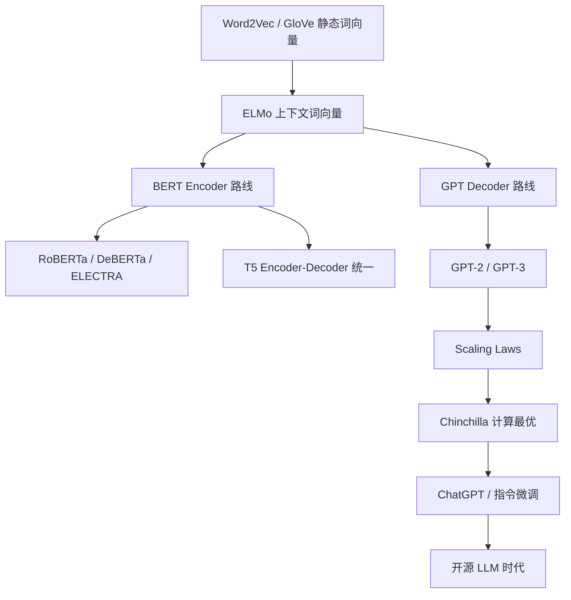

# 预训练语言模型综述

## 领域定义

预训练语言模型（Pre-trained Language Model, PLM）利用大规模无标注语料进行自监督预训练，学习通用语言表示，再通过微调或提示适配下游任务。这一"先预训练，后微调"的范式在 2018 年后彻底改变了 NLP 的研究与应用格局，是从"特定任务模型"到"通用基础模型"转变的关键里程碑，也是 [[../10_大语言模型核心架构/00_大语言模型核心架构_综述|大语言模型]] 时代的直接前驱。

## 为什么会出现

预训练语言模型的出现源于 NLP 领域的三个长期痛点：

- **标注数据稀缺**：高质量标注数据获取昂贵，而互联网无标注文本近乎无限——通过自监督预训练利用无标注数据成为自然选择。
- **任务割裂严重**：传统 NLP 为每个任务单独训练模型，无法共享知识——需要一个通用模型通过微调适配多种任务。
- **表示学习需求**：从 Word2Vec 到 ELMo，研究者持续探索更强大的文本表示——静态词向量无法处理一词多义，需要上下文相关的动态表示。

预训练语言模型本质上回答了一个问题：能否让模型先在大规模语料上学习"语言的通用规律"，然后只需少量标注数据就能快速适配任意具体任务？

## 核心问题

预训练语言模型主要围绕以下问题展开：

1. **如何设计自监督预训练目标**：MLM（Masked Language Model）、CLM（Causal Language Model）、Span Corruption 等不同目标如何影响模型能力。
2. **如何选择架构范式**：Encoder-only（BERT）、Decoder-only（GPT）、Encoder-Decoder（T5）三条路线的优劣与适用场景。
3. **如何高效微调**：从全参数微调到参数高效微调（LoRA/Adapter/Prompt Tuning）的演进。
4. **规模化如何影响能力**：Scaling Laws 揭示的参数/数据/算力的幂律关系，以及涌现能力的边界。
5. **如何从预训练过渡到大语言模型**：预训练语言模型与 LLM 的边界在哪里。

## 技术演进路线



演进脉络：静态词向量 → 上下文词向量（ELMo）→ 预训练+微调范式确立（BERT/GPT）→ 规模化探索（GPT-3/Scaling Laws）→ 计算最优训练（Chinchilla）→ 对齐与指令微调（ChatGPT）→ 开源 LLM 爆发。

## 发展历史

| 年代 | 里程碑 | 意义 |
|------|--------|------|
| 2003 | NNLM（Bengio等） | 神经网络语言模型开端 |
| 2013 | Word2Vec（Mikolov等） | 分布式词向量表示 |
| 2014 | GloVe（Pennington等） | 全局共现矩阵词向量 |
| 2015 | Skip-thought / FastText | 句子级与子词级表示 |
| 2018 | ELMo（Peters等） | 上下文相关的词向量 |
| 2018 | BERT（Devlin等） | Encoder 双向预训练 |
| 2018 | GPT-1（Radford等） | Decoder 自回归预训练 |
| 2019 | T5（Raffel等） | Encoder-Decoder 统一框架 |
| 2019 | XLNet（Yang等） | 排列语言建模 |
| 2019 | RoBERTa（Liu等） | BERT 训练优化 |
| 2020 | ELECTRA（Clark等） | 判别式预训练 |
| 2020 | GPT-3（Brown等） | 规模化涌现与上下文学习 |
| 2020 | Scaling Laws（Kaplan等） | 幂律关系发现 |
| 2021 | DeBERTa（He等） | 解耦注意力 |
| 2022 | Chinchilla（Hoffmann等） | 计算最优训练比例 |
| 2022 | ChatGPT | 指令微调 + RLHF |
| 2023+ | LLaMA / Qwen / Mistral | 开源 LLM 时代 |

## 3. 核心概念

- **词向量**：Word2Vec（CBOW/Skip-gram）、GloVe、FastText → 详见 [[01_词向量与早期表示学习]]
- **预训练目标**：MLM、CLM、Span Corruption、RTD → 详见 [[02_预训练核心原理]]
- **架构范式**：Encoder-only（BERT）、Decoder-only（GPT）、Encoder-Decoder（T5）
- **微调策略**：全参数微调、线性探针、Prompt Tuning、参数高效微调
- **Scaling Laws**：参数量、数据量、计算量的幂律关系 → 详见 [[07_Scaling_Laws与计算最优训练]]

## 重要分支

| 笔记 | 主题 | 核心内容 |
|------|------|---------|
| [[01_词向量与早期表示学习]] | 词表示基础 | Word2Vec、GloVe、FastText、ELMo |
| [[02_预训练核心原理]] | 预训练方法论 | 预训练目标、架构范式、微调策略、迁移学习理论 |
| [[03_BERT与编码器路线]] | 编码器路线 | BERT、RoBERTa、ALBERT、DeBERTa、ELECTRA |
| [[04_GPT与解码器路线]] | 解码器路线 | GPT-1/2/3 演进与核心创新 |
| [[05_T5与Encoder-Decoder路线]] | 编码器-解码器路线 | T5、BART、mT5、统一框架 |
| [[06_从零构建GPT]] | 工程实践 | nanoGPT、从 Bigram 到 Transformer |
| [[07_Scaling_Laws与计算最优训练]] | 规模化理论 | Kaplan Scaling Laws、Chinchilla、涌现能力 |

```
学习路径：词向量基础(01) → 预训练核心原理(02) → BERT/GPT/T5三条路线(03/04/05) → 工程实践(06) → Scaling Laws(07) → 进入大语言模型时代
```

## 学习路径

1. **先理解词表示基础**：[[01_词向量与早期表示学习]] — Word2Vec 到 ELMo 的演进。
2. **再掌握预训练核心范式**：[[02_预训练核心原理]] — MLM/CLM 目标与微调策略。
3. **对比三条架构路线**：[[03_BERT与编码器路线]] + [[04_GPT与解码器路线]] + [[05_T5与Encoder-Decoder路线]]。
4. **动手实践**：[[06_从零构建GPT]] — 用 nanoGPT 从零理解 GPT 实现。
5. **理解规模化规律**：[[07_Scaling_Laws与计算最优训练]] — 参数、数据、算力的幂律关系。

## 当前发展状态

- **Decoder-only 路线已占据绝对主导**：GPT 系列的成功证明了自回归生成在规模化后的通用性，BERT 路线在生成任务上的限制使其在大模型时代退居辅助角色。
- **预训练与指令微调深度融合**：ChatGPT 证明"预训练 + SFT + RLHF"的三阶段范式，预训练不再是终点而是起点。
- **开源生态蓬勃发展**：LLaMA、Qwen、Mistral 等开源模型降低了预训练语言模型的研究门槛。
- **Scaling Laws 持续指导实践**：Chinchilla 最优分配（$D^*/N^* \approx 20$）成为计算资源分配的基准参考。

## 未来趋势

- **预训练数据质量超越数据数量**：合成数据、数据课程（Data Curriculum）和数据去重将比单纯扩大数据量更重要。
- **多语言与跨语言预训练深化**：从英语中心向多语言均衡发展。
- **预训练与推理联合优化**：预训练阶段引入推理友好的架构设计。
- **领域特化预训练模型兴起**：医疗、法律、编程等垂直领域的预训练模型将更加普及。

## 核心公式速查

### Word2Vec Skip-gram

$$P(w_O | w_I) = \frac{\exp(\mathbf{v}'_{w_O}{}^T \mathbf{v}_{w_I})}{\sum_{w=1}^V \exp(\mathbf{v}'_w{}^T \mathbf{v}_{w_I})}$$

### BERT MLM 损失

$$\mathcal{L}_{MLM} = -\sum_{i \in \mathcal{M}} \log P(x_i | x_{\backslash\mathcal{M}})$$

### GPT 自回归生成

$$P(x_{1:T}) = \prod_{t=1}^T P(x_t | x_{<t})$$

### Scaling Laws

$$L(N) = \left(\frac{N_c}{N}\right)^{\alpha_N}, \quad \alpha_N \approx 0.076$$

**Chinchilla 最优分配**：$D^* / N^* \approx 20$，每个参数约需 20 个 token 训练数据。

## 6. 代表论文

| 论文 | 作者 | 年份 | 核心贡献 |
|------|------|------|---------|
| Efficient Estimation of Word Representations | Mikolov等 | 2013 | Word2Vec |
| GloVe: Global Vectors | Pennington等 | 2014 | 全局共现词向量 |
| Deep Contextualized Word Representations | Peters等 | 2018 | ELMo |
| BERT | Devlin等 | 2018 | 双向 MLM 预训练 |
| Improving Language Understanding by GPT | Radford等 | 2018 | Decoder 自回归预训练 |
| Language Models are Unsupervised Multitask Learners | Radford等 | 2019 | GPT-2 零样本 |
| Exploring the Limits of Transfer Learning with T5 | Raffel等 | 2019 | 统一文本到文本框架 |
| Language Models are Few-Shot Learners | Brown等 | 2020 | GPT-3 上下文学习 |
| Scaling Laws for Neural Language Models | Kaplan等 | 2020 | 幂律缩放 |
| ELECTRA | Clark等 | 2020 | RTD 判别式预训练 |
| Training Compute-Optimal LLMs | Hoffmann等 | 2022 | Chinchilla 最优比例 |

## 相关方向

- **Transformer与注意力机制**：是预训练语言模型的核心架构基础。参见 [[../08_Transformer与注意力机制/00_Transformer与注意力机制_综述|Transformer与注意力机制]]
- **大语言模型核心架构**：是预训练语言模型规模化和能力涌现的延伸。参见 [[../10_大语言模型核心架构/00_大语言模型核心架构_综述|大语言模型核心架构]]
- **大模型训练与对齐**：预训练流程的工程化扩展。参见 [[../11_大模型训练与对齐/00_大模型训练与对齐_综述|大模型训练与对齐]]
- **自然语言处理**：词向量技术是 NLP 的基础设施。参见 [[../16_自然语言处理/00_自然语言处理_综述|自然语言处理]]

## References

### 经典教材与课程
- Stanford CS224N (NLP with Deep Learning)
- Hugging Face NLP Course

### 核心论文
- Mikolov et al., *Efficient Estimation of Word Representations in Vector Space* (2013) — Word2Vec
- Peters et al., *Deep Contextualized Word Representations* (2018) — ELMo
- Devlin et al., *BERT: Pre-training of Deep Bidirectional Transformers* (2018)
- Radford et al., *Improving Language Understanding by Generative Pre-Training* (2018) — GPT-1
- Brown et al., *Language Models are Few-Shot Learners* (2020) — GPT-3
- Kaplan et al., *Scaling Laws for Neural Language Models* (2020)
- Hoffmann et al., *Training Compute-Optimal Large Language Models* (2022) — Chinchilla

### 实践资源
- nanoGPT（Karpathy）— 从零构建 GPT
- The Annotated Transformer / BERT / GPT（Harvard NLP）
- Hugging Face Transformers 库
