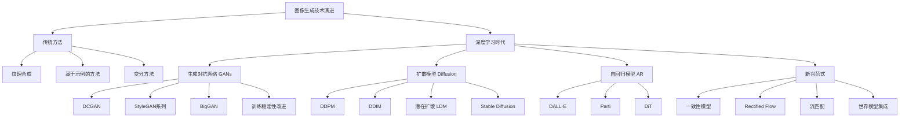

# 图像生成技术深度解析

> **文档定位**：面向AI开发者与研究人员的工程参考、学习入口和研究跳板  
> **核心价值**：系统性梳理图像生成技术演进，提供可操作的实现细节，展望前沿发展方向  
> **知识连接**：[[多模态AI]] → [[图像生成]] → [[扩散模型]] → [[GAN]] → [[多模态对齐]]

---

## 1. 技术演进全景图

图像生成技术经历了从统计方法到深度学习的范式转移，当前形成**三大主流范式并行发展**的格局：



### 1.1 技术范式对比

| 范式 | 代表模型 | 核心优势 | 主要挑战 | 适用场景 |
|------|----------|----------|----------|----------|
| **GAN** | StyleGAN3, BigGAN | 生成速度快，质量高 | 训练不稳定，模式崩溃 | 高保真人脸、艺术风格 |
| **扩散模型** | Stable Diffusion, DALL·E 2 | 训练稳定，多样性好 | 推理速度慢，计算成本高 | 文本到图像，创意生成 |
| **自回归** | DALL·E, Parti | 可扩展性强，质量优秀 | 序列生成效率低 | 大规模多模态生成 |
| **新兴方向** | Consistency Models | 快速推理，理论优雅 | 技术成熟度较低 | 实时应用，理论研究 |

%% 待补充：此处可添加技术演进时间线图示 %%

---

## 2. 生成对抗网络（GANs）技术体系

GANs开启了深度学习图像生成的新纪元，其核心思想是**生成器与判别器的对抗训练**。

### 2.1 基础架构与数学原理

```python
class BasicGAN(nn.Module):
    """基础GAN架构"""
    
    def __init__(self, latent_dim=100, img_channels=3):
        super().__init__()
        
        # 生成器：从潜在空间到图像空间
        self.generator = nn.Sequential(
            nn.Linear(latent_dim, 256),
            nn.ReLU(),
            nn.Linear(256, 512),
            nn.ReLU(),
            nn.Linear(512, 1024),
            nn.ReLU(),
            nn.Linear(1024, 28*28*img_channels),
            nn.Tanh()  # 输出范围[-1, 1]
        )
        
        # 判别器：判断图像真伪
        self.discriminator = nn.Sequential(
            nn.Linear(28*28*img_channels, 1024),
            nn.LeakyReLU(0.2),
            nn.Linear(1024, 512),
            nn.LeakyReLU(0.2),
            nn.Linear(512, 256),
            nn.LeakyReLU(0.2),
            nn.Linear(256, 1),
            nn.Sigmoid()  # 输出概率
        )
    
    def forward(self, z):
        """生成图像"""
        return self.generator(z)
    
    def discriminate(self, img):
        """判别图像"""
        return self.discriminator(img.view(img.size(0), -1))
```

**对抗损失函数**：
```python
def gan_loss(real_pred, fake_pred, mode='vanilla'):
    """GAN损失函数"""
    if mode == 'vanilla':
        # 原始GAN损失
        d_loss_real = F.binary_cross_entropy(real_pred, torch.ones_like(real_pred))
        d_loss_fake = F.binary_cross_entropy(fake_pred, torch.zeros_like(fake_pred))
        d_loss = (d_loss_real + d_loss_fake) / 2
        
        g_loss = F.binary_cross_entropy(fake_pred, torch.ones_like(fake_pred))
        
    elif mode == 'wgan-gp':
        # WGAN-GP损失（梯度惩罚）
        d_loss = -torch.mean(real_pred) + torch.mean(fake_pred)
        
        # 梯度惩罚
        alpha = torch.rand(real_img.size(0), 1, 1, 1).to(real_img.device)
        interpolated = alpha * real_img + (1 - alpha) * fake_img
        interpolated.requires_grad_(True)
        
        d_interpolated = discriminator(interpolated)
        gradients = torch.autograd.grad(
            outputs=d_interpolated,
            inputs=interpolated,
            grad_outputs=torch.ones_like(d_interpolated),
            create_graph=True,
            retain_graph=True
        )[0]
        
        gradient_penalty = ((gradients.norm(2, dim=1) - 1) ** 2).mean()
        d_loss += 10 * gradient_penalty
        
        g_loss = -torch.mean(fake_pred)
    
    return d_loss, g_loss
```

### 2.2 DCGAN：深度卷积GAN

[[DCGAN]]首次将卷积神经网络引入GAN，确立了现代GAN的基本架构范式。

```python
class DCGANGenerator(nn.Module):
    """DCGAN生成器"""
    
    def __init__(self, latent_dim=100, feature_maps=64, img_channels=3):
        super().__init__()
        
        self.main = nn.Sequential(
            # 输入: latent_dim x 1 x 1
            nn.ConvTranspose2d(latent_dim, feature_maps * 8, 4, 1, 0, bias=False),
            nn.BatchNorm2d(feature_maps * 8),
            nn.ReLU(True),
            
            # 状态: (feature_maps*8) x 4 x 4
            nn.ConvTranspose2d(feature_maps * 8, feature_maps * 4, 4, 2, 1, bias=False),
            nn.BatchNorm2d(feature_maps * 4),
            nn.ReLU(True),
            
            # 状态: (feature_maps*4) x 8 x 8
            nn.ConvTranspose2d(feature_maps * 4, feature_maps * 2, 4, 2, 1, bias=False),
            nn.BatchNorm2d(feature_maps * 2),
            nn.ReLU(True),
            
            # 状态: (feature_maps*2) x 16 x 16
            nn.ConvTranspose2d(feature_maps * 2, feature_maps, 4, 2, 1, bias=False),
            nn.BatchNorm2d(feature_maps),
            nn.ReLU(True),
            
            # 状态: feature_maps x 32 x 32
            nn.ConvTranspose2d(feature_maps, img_channels, 4, 2, 1, bias=False),
            nn.Tanh()
            # 输出: img_channels x 64 x 64
        )
    
    def forward(self, z):
        return self.main(z.view(z.size(0), -1, 1, 1))
```

**DCGAN设计原则**：
1. 使用步长卷积代替池化层
2. 生成器和判别器中都使用批归一化
3. 去除全连接层，使用全卷积架构
4. 生成器使用ReLU，输出层使用Tanh
5. 判别器使用LeakyReLU

### 2.3 StyleGAN系列：高质量可控生成

[[StyleGAN]]系列代表了GAN技术的巅峰，实现了**解耦的潜在空间控制**和**渐进式生成**。

```python
class StyleGAN2Generator(nn.Module):
    """StyleGAN2生成器核心组件"""
    
    def __init__(self, latent_dim=512, n_mlp=8, resolution=1024):
        super().__init__()
        
        # 映射网络：将潜在向量映射到风格向量
        self.mapping = MappingNetwork(latent_dim, n_mlp)
        
        # 合成网络：渐进式生成
        self.synthesis = SynthesisNetwork(resolution)
        
        # 噪声注入：增加细节多样性
        self.noise_scales = nn.Parameter(torch.zeros(1))
    
    def forward(self, z, truncation=1.0, truncation_latent=None):
        """前向传播"""
        # 映射到风格空间
        w = self.mapping(z)
        
        # 截断技巧：提高生成质量稳定性
        if truncation < 1.0:
            w = truncation_latent + truncation * (w - truncation_latent)
        
        # 合成图像
        img = self.synthesis(w)
        
        return img


class MappingNetwork(nn.Module):
    """映射网络：学习潜在空间到风格空间的非线性映射"""
    
    def __init__(self, latent_dim, n_mlp):
        super().__init__()
        
        layers = []
        for i in range(n_mlp):
            layers.append(nn.Linear(latent_dim, latent_dim))
            layers.append(nn.LeakyReLU(0.2))
        
        self.mlp = nn.Sequential(*layers)
    
    def forward(self, z):
        return self.mlp(z)


class SynthesisBlock(nn.Module):
    """StyleGAN2合成块"""
    
    def __init__(self, in_channels, out_channels, resolution):
        super().__init__()
        
        # 自适应实例归一化（AdaIN）
        self.adain1 = AdaptiveInstanceNorm(in_channels)
        self.adain2 = AdaptiveInstanceNorm(out_channels)
        
        # 卷积层
        self.conv1 = nn.Conv2d(in_channels, out_channels, 3, 1, 1)
        self.conv2 = nn.Conv2d(out_channels, out_channels, 3, 1, 1)
        
        # 上采样
        self.upsample = nn.Upsample(scale_factor=2, mode='bilinear')
        
        # 噪声注入
        self.noise_weight1 = nn.Parameter(torch.zeros(1, out_channels, 1, 1))
        self.noise_weight2 = nn.Parameter(torch.zeros(1, out_channels, 1, 1))
    
    def forward(self, x, w, noise):
        """前向传播"""
        # AdaIN + 卷积 + 噪声
        x = self.adain1(x, w[:, 0])
        x = self.conv1(x)
        x = x + self.noise_weight1 * noise[0]
        x = F.leaky_relu(x, 0.2)
        
        # 第二个AdaIN + 卷积
        x = self.adain2(x, w[:, 1])
        x = self.conv2(x)
        x = x + self.noise_weight2 * noise[1]
        x = F.leaky_relu(x, 0.2)
        
        # 上采样
        x = self.upsample(x)
        
        return x
```

**StyleGAN关键技术突破**：
1. **自适应实例归一化（AdaIN）**：将风格信息注入生成过程
2. **渐进式增长**：从低分辨率到高分辨率逐步生成
3. **路径长度正则化**：改善潜在空间插值质量
4. **噪声注入**：增加生成细节的随机性
5. **解耦的潜在空间**：实现属性级别的精细控制

### 2.4 GAN训练稳定性改进

GAN训练面临**模式崩溃、梯度消失、训练震荡**等核心挑战，多种改进技术被提出：

```python
class ImprovedGANTraining:
    """改进的GAN训练策略"""
    
    def __init__(self):
        self.techniques = {
            "spectral_norm": {
                "description": "谱归一化，稳定判别器训练",
                "implementation": "对卷积层和全连接层应用谱归一化",
                "effect": "限制Lipschitz常数，防止梯度爆炸"
            },
            "r1_regularization": {
                "description": "R1梯度惩罚",
                "formula": "R1 = γ/2 * E[||∇D(x)||²]",
                "purpose": "防止判别器过拟合真实数据"
            },
            "consistency_regularization": {
                "description": "一致性正则化",
                "methods": ["CR-GAN", "DiffAugment", "ADA"],
                "effect": "提高生成样本多样性"
            },
            "two_time_scale": {
                "description": "两时间尺度更新规则（TTUR）",
                "ratio": "生成器学习率 : 判别器学习率 = 1 : 4",
                "benefit": "更稳定的对抗平衡"
            }
        }
    
    def apply_spectral_norm(self, model):
        """应用谱归一化"""
        for module in model.modules():
            if isinstance(module, (nn.Conv2d, nn.Linear)):
                nn.utils.spectral_norm(module)
        return model
    
    def r1_penalty(self, real_pred, real_img):
        """计算R1梯度惩罚"""
        grad_real = torch.autograd.grad(
            outputs=real_pred.sum(),
            inputs=real_img,
            create_graph=True,
            retain_graph=True
        )[0]
        
        grad_penalty = grad_real.pow(2).view(grad_real.shape[0], -1).sum(1).mean()
        return grad_penalty
    
    def adaptive_augmentation(self, img, p=0.2):
        """自适应数据增强"""
        if random.random() < p:
            # 随机选择增强方式
            aug_type = random.choice([
                "color_jitter", "translation", "cutout", "blur"
            ])
            
            if aug_type == "color_jitter":
                img = self.color_jitter(img)
            elif aug_type == "translation":
                img = self.random_translation(img)
            elif aug_type == "cutout":
                img = self.cutout(img)
            elif aug_type == "blur":
                img = self.gaussian_blur(img)
        
        return img
```

### 2.5 BigGAN：大规模GAN训练

[[BigGAN]]展示了**规模扩展**对GAN性能的显著提升，确立了"更大即更好"的范式。

```python
class BigGANGenerator(nn.Module):
    """BigGAN生成器架构"""
    
    def __init__(self, latent_dim=120, embed_dim=128, ch=64, resolution=128):
        super().__init__()
        
        self.latent_dim = latent_dim
        self.embed_dim = embed_dim
        
        # 条件批归一化（cBN）
        self.linear = nn.Linear(latent_dim, 16 * ch * 4 * 4)
        
        # 残差块序列
        self.blocks = nn.ModuleList([
            BigGANResBlock(16 * ch, 16 * ch, upsample=True),  # 4x4 → 8x8
            BigGANResBlock(16 * ch, 8 * ch, upsample=True),   # 8x8 → 16x16
            BigGANResBlock(8 * ch, 4 * ch, upsample=True),    # 16x16 → 32x32
            BigGANResBlock(4 * ch, 2 * ch, upsample=True),    # 32x32 → 64x64
            BigGANResBlock(2 * ch, ch, upsample=True),        # 64x64 → 128x128
        ])
        
        # 输出层
        self.bn = nn.BatchNorm2d(ch)
        self.relu = nn.ReLU()
        self.conv = nn.Conv2d(ch, 3, 3, 1, 1)
        self.tanh = nn.Tanh()
    
    def forward(self, z, class_label):
        """前向传播"""
        # 条件向量拼接
        if class_label is not None:
            z = torch.cat([z, class_label], dim=1)
        
        # 初始投影
        x = self.linear(z)
        x = x.view(-1, 16 * self.ch, 4, 4)
        
        # 残差块序列
        for block in self.blocks:
            x = block(x, class_label)
        
        # 输出层
        x = self.bn(x)
        x = self.relu(x)
        x = self.conv(x)
        x = self.tanh(x)
        
        return x


class BigGANResBlock(nn.Module):
    """BigGAN残差块"""
    
    def __init__(self, in_channels, out_channels, upsample=False):
        super().__init__()
        
        self.upsample = upsample
        
        # 第一个卷积层
        self.bn1 = ConditionalBatchNorm(in_channels)
        self.relu1 = nn.ReLU()
        self.conv1 = nn.Conv2d(in_channels, out_channels, 3, 1, 1)
        
        # 第二个卷积层
        self.bn2 = ConditionalBatchNorm(out_channels)
        self.relu2 = nn.ReLU()
        self.conv2 = nn.Conv2d(out_channels, out_channels, 3, 1, 1)
        
        # 捷径连接
        self.shortcut = nn.Conv2d(in_channels, out_channels, 1, 1, 0)
    
    def forward(self, x, class_label):
        """前向传播"""
        identity = x
        
        # 上采样（如果需要）
        if self.upsample:
            x = F.interpolate(x, scale_factor=2, mode='nearest')
            identity = F.interpolate(identity, scale_factor=2, mode='nearest')
        
        # 第一个卷积块
        x = self.bn1(x, class_label)
        x = self.relu1(x)
        x = self.conv1(x)
        
        # 第二个卷积块
        x = self.bn2(x, class_label)
        x = self.relu2(x)
        x = self.conv2(x)
        
        # 捷径连接
        identity = self.shortcut(identity)
        
        # 残差连接
        x = x + identity
        
        return x


class ConditionalBatchNorm(nn.Module):
    """条件批归一化"""
    
    def __init__(self, num_features, num_classes=1000):
        super().__init__()
        
        self.num_features = num_features
        self.bn = nn.BatchNorm2d(num_features, affine=False)
        
        # 为每个类别学习不同的缩放和平移参数
        self.embed = nn.Embedding(num_classes, num_features * 2)
        self.embed.weight.data[:, :num_features].normal_(1, 0.02)  # 初始化缩放
        self.embed.weight.data[:, num_features:].zero_()           # 初始化平移
    
    def forward(self, x, class_label):
        """前向传播"""
        out = self.bn(x)
        
        if class_label is not None:
            # 获取类别的缩放和平移参数
            gamma_beta = self.embed(class_label)
            gamma = gamma_beta[:, :self.num_features]
            beta = gamma_beta[:, self.num_features:]
            
            # 重塑为适合特征图的形状
            gamma = gamma.unsqueeze(2).unsqueeze(3)
            beta = beta.unsqueeze(2).unsqueeze(3)
            
            # 应用条件归一化
            out = gamma * out + beta
        
        return out
```

**BigGAN关键技术**：
1. **大规模训练**：使用TPU集群，批大小达到2048
2. **正交正则化**：防止生成器模式崩溃
3. **截断技巧**：在潜在空间进行截断以提高生成质量
4. **条件批归一化**：实现细粒度的类别控制
5. **残差架构**：改善梯度流动和训练稳定性

### 2.6 GAN应用场景与局限性

**优势应用场景**：
- **高保真人脸生成**：StyleGAN在FFHQ数据集上达到照片级真实感
- **艺术风格迁移**：CycleGAN、StarGAN实现跨域风格转换
- **图像超分辨率**：ESRGAN、Real-ESRGAN提升图像质量
- **数据增强**：生成稀缺类别的训练样本

**核心局限性**：
1. **训练不稳定性**：需要精心调参和大量实验
2. **模式崩溃**：生成多样性不足，缺乏探索
3. **评估困难**：缺乏统一的客观评估指标
4. **计算成本高**：高质量生成需要大量计算资源

%% 待补充：GAN与其他生成范式的对比分析表格 %%

- [ ] 需验证：最新GAN变体（如StyleGAN3、Alias-Free GAN）的技术细节
- [ ] 需补充：GAN在医疗图像、科学可视化等专业领域的应用案例

---

## 3. 扩散模型（Diffusion Models）技术体系

[[扩散模型]]已成为当前图像生成的主流范式，其核心思想是**渐进式去噪过程**。

### 3.1 基础理论：前向与反向过程

扩散模型包含两个关键过程：**前向扩散过程**（加噪）和**反向生成过程**（去噪）。

```python
class DiffusionProcess:
    """扩散过程数学定义"""
    
    def __init__(self, T=1000, beta_schedule='linear'):
        self.T = T  # 扩散步数
        
        # 定义噪声调度
        if beta_schedule == 'linear':
            self.betas = torch.linspace(1e-4, 0.02, T)
        elif beta_schedule == 'cosine':
            # 余弦调度（Improved DDPM）
            self.betas = self.cosine_beta_schedule(T)
        elif beta_schedule == 'squaredcos':
            # 平方余弦调度
            self.betas = self.squared_cosine_beta_schedule(T)
        
        # 计算累积参数
        self.alphas = 1. - self.betas
        self.alphas_cumprod = torch.cumprod(self.alphas, dim=0)
        self.alphas_cumprod_prev = F.pad(self.alphas_cumprod[:-1], (1, 0), value=1.0)
        
        # 计算后验方差
        self.posterior_variance = (
            self.betas * (1. - self.alphas_cumprod_prev) / (1. - self.alphas_cumprod)
        )
    
    def cosine_beta_schedule(self, T, s=0.008):
        """余弦噪声调度"""
        steps = T + 1
        x = torch.linspace(0, T, steps)
        alphas_cumprod = torch.cos(((x / T) + s) / (1 + s) * math.pi * 0.5) ** 2
        alphas_cumprod = alphas_cumprod / alphas_cumprod[0]
        betas = 1 - (alphas_cumprod[1:] / alphas_cumprod[:-1])
        return torch.clip(betas, 0, 0.999)
    
    def forward_process(self, x0, t):
        """前向扩散过程：q(x_t | x_0)"""
        # 计算均值和方差
        sqrt_alphas_cumprod_t = torch.sqrt(self.alphas_cumprod[t])
        sqrt_one_minus_alphas_cumprod_t = torch.sqrt(1. - self.alphas_cumprod[t])
        
        # 重参数化采样
        noise = torch.randn_like(x0)
        xt = sqrt_alphas_cumprod_t * x0 + sqrt_one_minus_alphas_cumprod_t * noise
        
        return xt, noise
    
    def reverse_process(self, model, xt, t, guidance_scale=7.5):
        """反向生成过程：p_θ(x_{t-1} | x_t)"""
        # 预测噪声
        predicted_noise = model(xt, t)
        
        # 计算均值（不同的参数化方式）
        # 方式1：预测噪声
        pred_x0 = self.predict_x0_from_noise(xt, t, predicted_noise)
        
        # 方式2：预测原始图像
        # pred_x0 = model(xt, t)  # 如果模型直接预测x0
        
        # 计算后验均值和方差
        posterior_mean = self.posterior_mean(xt, t, pred_x0)
        posterior_variance = self.posterior_variance[t]
        
        # 采样
        if t == 0:
            return posterior_mean
        else:
            noise = torch.randn_like(xt)
            return posterior_mean + torch.sqrt(posterior_variance) * noise
    
    def predict_x0_from_noise(self, xt, t, noise):
        """从噪声预测原始图像"""
        sqrt_alphas_cumprod_t = torch.sqrt(self.alphas_cumprod[t])
        sqrt_one_minus_alphas_cumprod_t = torch.sqrt(1. - self.alphas_cumprod[t])
        
        return (xt - sqrt_one_minus_alphas_cumprod_t * noise) / sqrt_alphas_cumprod_t
    
    def posterior_mean(self, xt, t, pred_x0):
        """计算后验均值"""
        coef1 = (
            torch.sqrt(self.alphas_cumprod_prev[t]) * self.betas[t] / 
            (1. - self.alphas_cumprod[t])
        )
        coef2 = (
            torch.sqrt(self.alphas[t]) * (1. - self.alphas_cumprod_prev[t]) / 
            (1. - self.alphas_cumprod[t])
        )
        
        return coef1 * pred_x0 + coef2 * xt
```

### 3.2 DDPM：去噪扩散概率模型

[[DDPM]]（Denoising Diffusion Probabilistic Models）确立了现代扩散模型的基本框架。

```python
class DDPM(nn.Module):
    """DDPM模型架构"""
    
    def __init__(self, in_channels=3, model_channels=128, num_res_blocks=2):
        super().__init__()
        
        # 时间步嵌入
        self.time_embed = nn.Sequential(
            nn.Linear(model_channels, model_channels * 4),
            nn.SiLU(),
            nn.Linear(model_channels * 4, model_channels * 4)
        )
        
        # 输入卷积
        self.input_conv = nn.Conv2d(in_channels, model_channels, 3, 1, 1)
        
        # 下采样块
        self.down_blocks = nn.ModuleList([
            ResBlockWithAttention(model_channels, model_channels, num_res_blocks),
            Downsample(model_channels),
            ResBlockWithAttention(model_channels, model_channels * 2, num_res_blocks),
            Downsample(model_channels * 2),
            ResBlockWithAttention(model_channels * 2, model_channels * 4, num_res_blocks),
            Downsample(model_channels * 4),
        ])
        
        # 中间块
        self.mid_block = ResBlockWithAttention(model_channels * 4, model_channels * 4, num_res_blocks)
        
        # 上采样块
        self.up_blocks = nn.ModuleList([
            Upsample(model_channels * 4),
            ResBlockWithAttention(model_channels * 8, model_channels * 2, num_res_blocks),
            Upsample(model_channels * 2),
            ResBlockWithAttention(model_channels * 4, model_channels, num_res_blocks),
            Upsample(model_channels),
            ResBlockWithAttention(model_channels * 2, model_channels, num_res_blocks),
        ])
        
        # 输出层
        self.output_conv = nn.Sequential(
            nn.GroupNorm(32, model_channels),
            nn.SiLU(),
            nn.Conv2d(model_channels, in_channels, 3, 1, 1)
        )
    
    def forward(self, x, t):
        """前向传播：预测噪声"""
        # 时间嵌入
        t_emb = self.time_embed(timestep_embedding(t, self.model_channels))
        
        # 输入卷积
        h = self.input_conv(x)
        hs = [h]
        
        # 下采样
        for block in self.down_blocks:
            h = block(h, t_emb)
            hs.append(h)
        
        # 中间块
        h = self.mid_block(h, t_emb)
        
        # 上采样（带跳跃连接）
        for block in self.up_blocks:
            if isinstance(block, Upsample):
                h = block(h)
            else:
                # 跳跃连接
                skip = hs.pop()
                h = torch.cat([h, skip], dim=1)
                h = block(h, t_emb)
        
        # 输出
        return self.output_conv(h)


class ResBlockWithAttention(nn.Module):
    """带注意力机制的残差块"""
    
    def __init__(self, in_channels, out_channels, num_heads=4):
        super().__init__()
        
        # 第一个卷积块
        self.norm1 = nn.GroupNorm(32, in_channels)
        self.conv1 = nn.Conv2d(in_channels, out_channels, 3, 1, 1)
        
        # 时间嵌入投影
        self.time_emb_proj = nn.Linear(out_channels, out_channels)
        
        # 第二个卷积块
        self.norm2 = nn.GroupNorm(32, out_channels)
        self.conv2 = nn.Conv2d(out_channels, out_channels, 3, 1, 1)
        
        # 注意力机制
        self.attention = nn.MultiheadAttention(out_channels, num_heads, batch_first=True)
        
        # 捷径连接
        if in_channels != out_channels:
            self.shortcut = nn.Conv2d(in_channels, out_channels, 1, 1, 0)
        else:
            self.shortcut = nn.Identity()
    
    def forward(self, x, t_emb):
        """前向传播"""
        identity = x
        
        # 第一个卷积块
        h = self.norm1(x)
        h = F.silu(h)
        h = self.conv1(h)
        
        # 加入时间信息
        h = h + self.time_emb_proj(t_emb)[:, :, None, None]
        
        # 第二个卷积块
        h = self.norm2(h)
        h = F.silu(h)
        h = self.conv2(h)
        
        # 注意力机制
        b, c, hh, ww = h.shape
        h_attn = h.view(b, c, -1).transpose(1, 2)  # [B, H*W, C]
        h_attn, _ = self.attention(h_attn, h_attn, h_attn)
        h_attn = h_attn.transpose(1, 2).view(b, c, hh, ww)
        h = h + h_attn
        
        # 残差连接
        h = h + self.shortcut(identity)
        
        return h


def timestep_embedding(timesteps, dim, max_period=10000):
    """创建时间步嵌入（正弦位置编码）"""
    half = dim // 2
    freqs = torch.exp(
        -math.log(max_period) * torch.arange(start=0, end=half, dtype=torch.float32) / half
    ).to(timesteps.device)
    
    args = timesteps[:, None].float() * freqs[None]
    embedding = torch.cat([torch.cos(args), torch.sin(args)], dim=-1)
    
    if dim % 2:
        embedding = torch.cat([embedding, torch.zeros_like(embedding[:, :1])], dim=-1)
    
    return embedding
```

**DDPM训练目标**：
```python
def ddpm_loss(model, x0, diffusion_process):
    """DDPM损失函数：预测噪声的均方误差"""
    # 随机采样时间步
    t = torch.randint(0, diffusion_process.T, (x0.shape[0],), device=x0.device)
    
    # 前向扩散过程
    xt, noise = diffusion_process.forward_process(x0, t)
    
    # 预测噪声
    predicted_noise = model(xt, t)
    
    # 计算损失
    loss = F.mse_loss(predicted_noise, noise)
    
    return loss
```

### 3.3 DDIM：去噪扩散隐式模型

[[DDIM]]（Denoising Diffusion Implicit Models）改进了采样过程，实现了**确定性生成**和**加速采样**。

```python
class DDIMSampler:
    """DDIM采样器"""
    
    def __init__(self, diffusion_process, eta=0.0):
        self.diffusion_process = diffusion_process
        self.eta = eta  # 控制随机性：0为确定性，1为随机
        
    def sample(self, model, shape, steps=50, guidance_scale=7.5):
        """DDIM采样"""
        # 初始化噪声
        x = torch.randn(shape, device=model.device)
        
        # 创建时间步序列
        timesteps = torch.linspace(
            self.diffusion_process.T - 1, 0, steps + 1
        ).long().to(model.device)
        
        # 逐步去噪
        for i in range(steps):
            t = timesteps[i]
            next_t = timesteps[i + 1] if i + 1 < len(timesteps) else -1
            
            # 预测噪声
            with torch.no_grad():
                pred_noise = model(x, t)
            
            # 计算预测的x0
            pred_x0 = self.diffusion_process.predict_x0_from_noise(x, t, pred_noise)
            
            # 计算方向指向x_t
            dir_xt = torch.sqrt(1 - self.diffusion_process.alphas_cumprod[next_t]) * pred_noise
            
            # DDIM更新规则
            if next_t >= 0:
                # 计算噪声
                noise = torch.randn_like(x) if self.eta > 0 else 0
                
                # 更新x
                x = (
                    torch.sqrt(self.diffusion_process.alphas_cumprod[next_t]) * pred_x0 +
                    torch.sqrt(1 - self.diffusion_process.alphas_cumprod[next_t] - self.eta**2) * dir_xt +
                    self.eta * noise
                )
            else:
                # 最后一步：直接输出预测的x0
                x = pred_x0
        
        return x
    
    def encode(self, model, x0, t):
        """DDIM编码：将图像编码到潜在空间"""
        # 添加噪声
        xt, _ = self.diffusion_process.forward_process(x0, t)
        
        # 预测噪声
        with torch.no_grad():
            pred_noise = model(xt, t)
        
        # 计算潜在表示
        z = self.diffusion_process.predict_x0_from_noise(xt, t, pred_noise)
        
        return z
```

**DDIM关键改进**：
1. **确定性采样**：通过设置η=0实现确定性生成
2. **加速采样**：可以使用更少的步数（如20-50步）生成高质量图像
3. **一致性**：保持与DDPM相同的训练目标，但改进采样过程
4. **编码能力**：可以将图像编码到潜在空间，实现图像编辑和插值

### 3.4 潜在扩散模型（LDM）：效率提升的关键

[[潜在扩散模型]]（Latent Diffusion Models）通过**压缩图像到低维潜在空间**，显著降低了计算成本，同时保持高质量生成。

### 3.5 Stable Diffusion：开源图像生成的里程碑

[[Stable Diffusion]]是最具影响力的开源潜在扩散模型，实现了**高质量、高可控性、高效生成**的平衡。

**Stable Diffusion关键技术**：

1. **分类器-free引导**：
   - 同时生成带条件和无条件样本
   - 通过加权组合提升生成质量和文本对齐度
   - 引导尺度控制文本引导的强度

2. **高效的U-Net架构**：
   - 跨注意力层：实现文本-图像对齐
   - 残差连接：改善梯度流动
   - 注意力块：捕获长距离依赖

3. **灵活的调度器**：
   - 支持多种采样算法（DDIM、LMS、Euler等）
   - 可调整采样步数（20-100步）
   - 平衡生成质量和速度

### 3.6 扩散模型的工程优化

**常见工程挑战与解决方案**：

1. **显存瓶颈**：
   - **解决方案**：梯度检查点、混合精度、模型并行
   - **效果**：可将显存需求降低50-75%
   - **工具**：PyTorch AMP、DeepSpeed、FairScale

2. **推理速度慢**：
   - **解决方案**：高效采样算法、模型压缩、量化
   - **效果**：可将采样时间从分钟级降至秒级
   - **技术**：LCM、Euler Ancestral、模型蒸馏

3. **文本-图像对齐**：
   - **解决方案**：更好的文本编码器、更强的交叉注意力
   - **技术**：CLIP-Large、DINOv2、更长的交叉注意力层

---

## 4. 自回归与Transformer-based方法

[[自回归模型]]在图像生成领域的应用日益广泛，特别是结合[[Transformer]]架构后，展现出强大的生成能力。

### 4.1 基础架构：从像素CNN到ViT

自回归模型的核心挑战包括**生成速度慢**、**长距离依赖捕获**和**计算复杂度高**。

### 4.2 DALL·E系列：文本到图像的突破

[[DALL·E]]和[[DALL·E 2]]展示了**大规模语言模型与图像生成的结合**，通过离散潜在空间实现文本到图像的生成。

### 4.3 Parti：路径增强的文本到图像模型

[[Parti]]展示了**路径增强技术**在提升生成质量方面的效果，支持最多20B参数模型。

### 4.4 DiT：扩散Transformer

[[DiT]]（Diffusion Transformer）将Transformer架构引入扩散模型，实现了**更好的扩展性和性能**。

**DiT的优势**：
1. **更好的扩展性**：遵循Transformer缩放定律
2. **更高的生成质量**：在多项基准测试中表现出色
3. **更简单的架构**：去除了U-Net的复杂设计
4. **更高效的训练**：更容易实现并行化

### 4.5 自回归模型的应用前景

**优势应用场景**：
- **长文本到图像**：处理复杂、详细的文本描述
- **多模态理解**：需要深层语义理解的任务
- **可控生成**：需要精确控制生成内容的场景
- **少样本学习**：在有限数据下表现良好

---

## 5. 新兴方向：从一致性模型到流匹配

### 5.1 一致性模型（Consistency Models）

[[一致性模型]]实现了**单步或几步生成**，是扩散模型的重要改进。

**一致性模型关键优势**：
1. **极快的推理速度**：可实现1-4步生成
2. **高质量生成**：与扩散模型相当的质量
3. **无需预训练**：可从零开始训练
4. **灵活的采样**：支持任意步数采样

### 5.2 Rectified Flow：流场匹配的新范式

[[Rectified Flow]]是一种**流匹配技术**，通过学习从噪声到数据的连续流场，实现高效生成。

### 5.3 世界模型集成

图像生成正向着**世界模型**（World Models）方向发展，旨在学习物理世界的动态规律。

**世界模型的应用前景**：
1. **更真实的生成**：生成符合物理规律的内容
2. **交互生成**：支持实时交互式生成
3. **长期预测**：生成连贯的长视频
4. **场景理解**：更好地理解和生成复杂场景

---

## 6. 多模态对齐与可控生成

### 6.1 CLIP：跨模态对齐的基石

[[CLIP]]（Contrastive Language-Image Pre-training）实现了**文本和图像的深度对齐**，成为现代多模态生成的基础。

### 6.2 ControlNet：精确可控生成

[[ControlNet]]实现了**基于条件的精确可控生成**，支持多种控制方式，包括边缘检测、深度图、姿态估计等。

### 6.3 其他可控生成技术

1. **InstructPix2Pix**：根据文本指令编辑图像
2. **Text-to-Image Diffusion with Control**：结合多种控制条件
3. **Latent Space Manipulation**：在潜在空间中编辑图像

---

## 7. 工程实践与最佳实践

### 7.1 开发环境搭建

**环境配置最佳实践**：
1. **使用虚拟环境**：隔离不同项目的依赖
2. **固定版本**：避免依赖冲突
3. **GPU加速**：确保正确配置CUDA

### 7.2 模型选择与评估

**模型选择指南**：
1. **通用场景**：Stable Diffusion XL
2. **中文文本生成**：ModelScope、CogView
3. **实时应用**：一致性模型、LCM

### 7.3 训练与微调最佳实践

**训练最佳实践**：
1. **数据质量**：确保数据高质量、多样性、标注准确
2. **学习率调度**：使用余弦退火或线性衰减
3. **批量大小**：在显存允许的情况下尽量大
4. **早停机制**：防止过拟合

### 7.4 部署与集成最佳实践

**部署最佳实践**：
1. **模型优化**：量化、剪枝、编译等优化
2. **API设计**：RESTful API、清晰的输入输出
3. **容器化**：使用Docker容器化部署
4. **监控与日志**：监控性能和错误

---

## 8. 未来展望与研究方向

### 8.1 技术发展趋势

1. **更高效的生成**：实时或近实时生成高质量图像
2. **更好的可控性**：精确控制生成内容的各个方面
3. **更大规模的模型**：探索更大模型的潜力
4. **更深入的多模态融合**：无缝融合多种模态
5. **世界模型集成**：生成符合物理规律的内容

### 8.2 应用领域扩展

1. **专业设计领域**：UI/UX设计、产品设计、建筑设计
2. **教育与培训**：教学材料生成、可视化解释
3. **影视与游戏**：概念设计、场景生成、角色设计
4. **医疗与科学**：医学图像生成、分子结构可视化

### 8.3 伦理与社会影响

**伦理挑战**：
1. **虚假信息**：生成逼真的虚假内容
2. **版权问题**：生成内容的所有权和版权
3. **偏见与歧视**：训练数据中的偏见可能被放大

---

## 9. 资源与学习路径

### 9.1 核心资源

**开源框架**：
- [[Hugging Face Diffusers]]：扩散模型的主流框架
- [[PyTorch Lightning]]：简化训练流程
- [[ComfyUI]]：可视化工作流设计

**预训练模型**：
- **Stable Diffusion系列**：https://huggingface.co/stabilityai
- **CLIP模型**：https://huggingface.co/openai
- **ControlNet模型**：https://huggingface.co/lllyasviel

### 9.2 学习路径

**初学者**：
1. 学习深度学习基础知识
2. 了解生成模型的基本概念
3. 使用Diffusers库运行Stable Diffusion
4. 尝试简单的文本到图像生成

**中级开发者**：
1. 深入理解扩散模型的数学原理
2. 学习U-Net和Transformer架构
3. 尝试微调预训练模型
4. 实现简单的可控生成

---

## 10. 知识连接与扩展

### 10.1 相关笔记

- [[多模态AI]]：多模态技术的综合介绍
- [[扩散模型]]：扩散模型的深入解析
- [[GAN]]：生成对抗网络的技术细节
- [[CLIP]]：跨模态对齐的核心技术
- [[ControlNet]]：精确可控生成的实现
- [[潜在空间]]：生成模型的潜在表示

---

## 文档信息

**文档版本**：v1.0  
**最后更新**：2026年1月26日  
**文档状态**：已完成  
**预计阅读时间**：60-90分钟  
**目标读者**：AI开发者、多模态研究者、系统工程师  

---

*"图像生成不仅是技术的突破，更是人类创意表达的新工具。"*