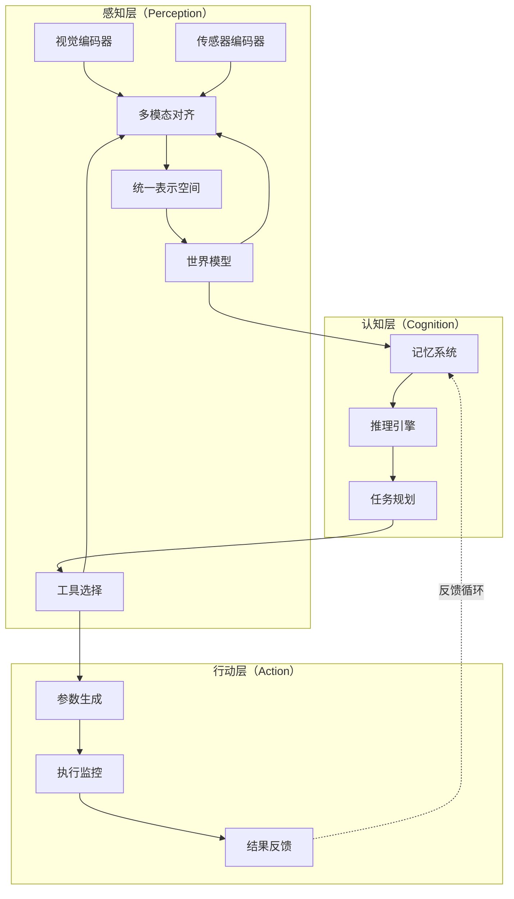
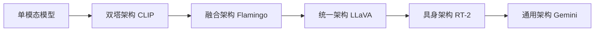
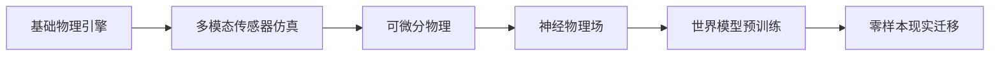

# 多模态Agent：感知、理解与行动的跨模态智能体

%% 本文档系统阐述多模态Agent的核心架构、关键技术模块与工程实现，为AI开发人员提供从理论到实践的完整参考 %%

## 一、核心概念：什么是多模态Agent？

**多模态Agent**（Multimodal Agent）是指能够**同时感知、理解并操作多种模态信息**（如文本、图像、音频、视频、传感器数据等）的智能体系统。与传统单模态Agent相比，多模态Agent通过跨模态的信息融合与对齐，实现对复杂环境的全面认知和智能决策。

### 1.1 定义与特征

```python
# 多模态Agent的核心特征定义
class MultimodalAgentCharacteristics:
    # 感知能力
    PERCEPTION = {
        "visual": "视觉感知（图像、视频）",
        "linguistic": "语言理解（文本、语音）", 
        "auditory": "听觉感知（音频、声音）",
        "sensor": "传感器感知（深度、IMU等）",
        "tactile": "触觉感知（物理交互）"
    }
    
    # 认知能力
    COGNITION = {
        "cross_modal_alignment": "跨模态对齐与融合",
        "world_modeling": "世界模型构建与推理",
        "memory_management": "多模态记忆管理",
        "planning": "多步任务规划"
    }
    
    # 行动能力
    ACTION = {
        "tool_usage": "多模态工具调用",
        "physical_interaction": "物理环境交互",
        "communication": "多模态沟通表达",
        "autonomous_decision": "自主决策执行"
    }
```

#### 关键特征：
1. **跨模态感知**：同时处理多种输入模态，建立统一的感知表示
2. **融合推理**：基于多源信息进行综合推理与决策
3. **工具使用**：调用外部工具执行复杂任务
4. **环境交互**：在物理或虚拟环境中执行行动
5. **持续学习**：从多模态交互中不断优化策略

### 1.2 与相关概念的区分

| 概念 | 核心特征 | 与多模态Agent的关系 |
|------|----------|-------------------|
| **单模态Agent** | 仅处理单一模态（如文本） | 多模态Agent的简化版本 |
| **视觉语言模型** | 连接视觉与语言理解 | 多模态Agent的核心组件 |
| **具身智能体** | 在物理环境中交互 | 多模态Agent的物理实现 |
| **工具调用Agent** | 使用外部工具完成任务 | 多模态Agent的行动模块 |
| **多智能体系统** | 多个智能体协作 | 多模态Agent的扩展形态 |

^concept-definition

## 二、系统架构：多模态Agent的三层设计

多模态Agent采用**感知-认知-行动**的三层架构，每层包含多个关键技术模块：



### 2.1 感知层：多模态编码与对齐

感知层负责将原始多模态数据转换为统一的语义表示：

```python
# 多模态感知层架构
class MultimodalPerceptionLayer:
    def __init__(self):
        self.encoders = {
            "visual": VisualEncoder(model="ViT-L/14"),
            "text": TextEncoder(model="BERT-Large"),
            "audio": AudioEncoder(model="Whisper-Large"),
            "sensor": SensorEncoder(embedding_dim=256)
        }
        self.alignment_module = CrossModalAlignment()
        self.fusion_module = MultimodalFusion()
    
    def perceive(self, multimodal_input: Dict[str, Any]) -> UnifiedRepresentation:
        """处理多模态输入，生成统一表示"""
        # 1. 各模态独立编码
        encoded_modalities = {}
        for modality, data in multimodal_input.items():
            if modality in self.encoders:
                encoded_modalities[modality] = self.encoders[modality].encode(data)
        
        # 2. 跨模态对齐（CLIP-style对比学习）
        aligned_representations = self.alignment_module.align(encoded_modalities)
        
        # 3. 多模态融合（门控交叉注意力）
        unified_rep = self.fusion_module.fuse(aligned_representations)
        
        return unified_rep
```

#### 关键技术：
1. **[[多模态对齐]]**：CLIP-style对比学习、跨模态注意力
2. **统一表示空间**：将不同模态映射到共享语义空间
3. **特征融合策略**：早期融合、晚期融合、混合融合
4. **模态缺失处理**：鲁棒性设计，支持部分模态输入

### 2.2 认知层：推理、规划与记忆

认知层实现高级智能功能，包括推理、规划和记忆管理：

```python
# 多模态认知层架构
class MultimodalCognitionLayer:
    def __init__(self):
        self.world_model = WorldModel()
        self.memory_system = MultimodalMemory()
        self.reasoning_engine = ReasoningEngine()
        self.planner = HierarchicalPlanner()
    
    def process(self, perception_output: UnifiedRepresentation, goal: str) -> ActionPlan:
        """基于感知输入和目标生成行动计划"""
        # 1. 世界模型更新
        world_state = self.world_model.update(perception_output)
        
        # 2. 记忆存储与检索
        relevant_memories = self.memory_system.retrieve(
            query=perception_output,
            context=world_state
        )
        
        # 3. 推理与决策
        reasoning_result = self.reasoning_engine.reason(
            current_state=world_state,
            memories=relevant_memories,
            goal=goal
        )
        
        # 4. 分层任务规划
        action_plan = self.planner.plan(
            reasoning_result=reasoning_result,
            constraints=self._get_constraints()
        )
        
        return action_plan
```

#### 核心组件：
1. **[[世界模型]]**：对环境状态的内部表示与预测
2. **[[记忆机制]]**：多模态记忆存储、检索与更新
3. **推理引擎**：基于规则的推理、神经符号推理
4. **任务规划器**：分层规划、反应式规划、元规划

### 2.3 行动层：工具调用与环境交互

行动层将认知决策转化为具体行动：

```python
# 多模态行动层架构
class MultimodalActionLayer:
    def __init__(self):
        self.tool_registry = ToolRegistry()
        self.execution_engine = ExecutionEngine()
        self.feedback_processor = FeedbackProcessor()
    
    def execute(self, action_plan: ActionPlan) -> ExecutionResult:
        """执行行动计划并处理反馈"""
        execution_results = []
        
        for action_step in action_plan.steps:
            # 1. 工具选择与参数生成
            selected_tool = self.tool_registry.select_tool(
                action_type=action_step.type,
                constraints=action_step.constraints
            )
            
            tool_params = self._generate_tool_parameters(
                tool=selected_tool,
                context=action_step.context
            )
            
            # 2. 工具执行与监控
            execution_result = self.execution_engine.execute(
                tool=selected_tool,
                parameters=tool_params,
                timeout=action_step.timeout
            )
            
            # 3. 结果验证与反馈处理
            validated_result = self.feedback_processor.validate(
                result=execution_result,
                expected_outcome=action_step.expected_outcome
            )
            
            execution_results.append(validated_result)
            
            # 4. 异常处理与重试
            if not validated_result.success:
                recovery_action = self._handle_failure(
                    failed_step=action_step,
                    error=validated_result.error
                )
                if recovery_action:
                    execution_results.append(self.execute(recovery_action))
        
        # 5. 结果整合
        final_result = self._aggregate_results(execution_results)
        return final_result
```

#### 行动能力：
1. **[[工具调用]]**：API调用、代码执行、外部服务集成
2. **物理交互**：机器人控制、环境操作
3. **沟通表达**：多模态输出生成（文本、语音、图像）
4. **执行监控**：实时状态跟踪、异常检测

## 三、关键技术模块深度解析

### 3.1 多模态对齐与融合

%% 跨模态对齐是多模态Agent的基础，确保不同模态信息在语义空间的一致性 %%

#### 3.1.1 对齐技术对比

| 技术 | 核心思想 | 优点 | 缺点 | 代表工作 |
|------|----------|------|------|----------|
| **CLIP-style对比学习** | 最大化匹配对的相似度 | 简单有效、零样本能力强 | 需要大规模配对数据 | OpenAI CLIP (2021) |
| **跨模态注意力** | 注意力机制连接不同模态 | 动态权重分配、可解释性 | 计算复杂度高 | Flamingo (2022) |
| **共享编码器** | 统一编码器处理多模态 | 参数效率高、表示一致 | 模态特异性损失 | Unified-IO (2022) |
| **知识蒸馏** | 教师模型指导对齐 | 利用预训练知识、迁移性强 | 依赖教师模型质量 | ALIGN (2021) |

#### 3.1.2 融合策略选择

```python
# 多模态融合策略实现
class MultimodalFusionStrategies:
    @staticmethod
    def early_fusion(modality_features: List[Tensor]) -> Tensor:
        """早期融合：在特征层面合并"""
        # 连接特征向量
        concatenated = torch.cat(modality_features, dim=-1)
        # 线性投影到统一维度
        fused = nn.Linear(concatenated.shape[-1], 512)(concatenated)
        return fused
    
    @staticmethod
    def late_fusion(modality_features: List[Tensor]) -> Tensor:
        """晚期融合：独立处理后再合并"""
        # 各模态独立处理
        processed_features = []
        for feature in modality_features:
            processed = nn.Linear(feature.shape[-1], 256)(feature)
            processed_features.append(processed)
        
        # 加权平均融合
        weights = nn.Softmax(dim=0)(torch.randn(len(processed_features)))
        fused = sum(w * f for w, f in zip(weights, processed_features))
        return fused
    
    @staticmethod
    def gated_cross_attention(visual_features: Tensor, text_features: Tensor) -> Tensor:
        """门控交叉注意力：Flamingo风格融合"""
        # 视觉到文本的交叉注意力
        visual_context = nn.MultiheadAttention(
            embed_dim=512,
            num_heads=8
        )(text_features, visual_features, visual_features)[0]
        
        # 门控机制控制信息流
        gate = nn.Sigmoid()(nn.Linear(512, 512)(visual_context))
        gated_visual = gate * visual_context
        
        # 残差连接
        fused = text_features + gated_visual
        return fused
```

### 3.2 视觉语言模型作为基础模型

[[视觉语言模型]]是多模态Agent的**认知核心**，提供跨模态理解能力：

#### 3.2.1 VLM架构演进



#### 3.2.2 主流VLM对比

| 模型 | 发布机构 | 核心创新 | 多模态Agent适用性 |
|------|----------|----------|-------------------|
| **CLIP** | OpenAI | 对比学习对齐 | ⭐⭐⭐ (基础对齐) |
| **Flamingo** | DeepMind | 门控交叉注意力 | ⭐⭐⭐⭐ (序列理解) |
| **LLaVA** | Microsoft | 指令微调VLM | ⭐⭐⭐⭐⭐ (对话交互) |
| **Qwen-VL** | Alibaba | 中文优化、多任务 | ⭐⭐⭐⭐ (中文场景) |
| **Gemini** | Google | 原生多模态、多尺度 | ⭐⭐⭐⭐⭐ (通用能力) |
| **RT-2** | Google | 视觉-语言-行动 | ⭐⭐⭐⭐⭐ (具身智能) |

#### 3.2.3 VLM集成模式

```python
# VLM集成到多模态Agent的三种模式
class VLMIntegrationPatterns:
    @staticmethod
    def as_perception_backbone(agent: MultimodalAgent):
        """模式1：VLM作为感知骨干"""
        # VLM处理原始多模态输入
        vlm_output = agent.vlm.process_multimodal_input(agent.perception_input)
        # 提取统一表示
        unified_representation = vlm_output["unified_embedding"]
        return unified_representation
    
    @staticmethod  
    def as_reasoning_engine(agent: MultimodalAgent, query: str):
        """模式2：VLM作为推理引擎"""
        # 构建多模态提示
        multimodal_prompt = agent._construct_prompt(
            visual_context=agent.current_observation,
            textual_query=query,
            history=agent.conversation_history
        )
        
        # VLM推理生成
        reasoning_result = agent.vlm.generate(
            prompt=multimodal_prompt,
            max_tokens=500,
            temperature=0.7
        )
        
        return reasoning_result
    
    @staticmethod
    def as_planning_assistant(agent: MultimodalAgent, goal: str):
        """模式3：VLM作为规划助手"""
        # 分解复杂任务
        task_decomposition = agent.vlm.generate(
            prompt=f"将任务'{goal}'分解为可执行的子步骤:",
            format="json"
        )
        
        # 验证可行性
        feasibility_check = agent.vlm.generate(
            prompt=f"评估任务步骤的可行性: {task_decomposition}",
            format="json"
        )
        
        return {
            "decomposition": task_decomposition,
            "feasibility": feasibility_check
        }
```

### 3.3 工具调用与外部集成

[[工具调用]]是多模态Agent扩展能力边界的关键：

#### 3.3.1 工具分类体系

```python
# 多模态Agent工具分类
class MultimodalToolTaxonomy:
    # 感知类工具
    PERCEPTION_TOOLS = {
        "object_detector": "目标检测器",
        "scene_parser": "场景解析器", 
        "speech_recognizer": "语音识别器",
        "text_extractor": "文本提取器"
    }
    
    # 认知类工具  
    COGNITION_TOOLS = {
        "calculator": "计算器",
        "code_interpreter": "代码解释器",
        "knowledge_retriever": "知识检索器",
        "reasoning_engine": "推理引擎"
    }
    
    # 行动类工具
    ACTION_TOOLS = {
        "web_browser": "网页浏览器",
        "api_client": "API客户端",
        "robot_controller": "机器人控制器",
        "file_manager": "文件管理器"
    }
    
    # 沟通类工具
    COMMUNICATION_TOOLS = {
        "text_generator": "文本生成器",
        "image_generator": "图像生成器",
        "speech_synthesizer": "语音合成器",
        "video_editor": "视频编辑器"
    }
```

#### 3.3.2 工具调用流程

```python
# 工具调用四阶段流程
class ToolCallingPipeline:
    def __init__(self):
        self.tool_discovery = ToolDiscovery()
        self.tool_selection = ToolSelection()
        self.parameter_generation = ParameterGeneration()
        self.execution_monitor = ExecutionMonitor()
    
    def call_tool(self, task_description: str, context: Dict) -> ToolResult:
        """完整的工具调用流程"""
        # 阶段1：工具发现
        candidate_tools = self.tool_discovery.discover(
            task=task_description,
            available_tools=self._get_available_tools()
        )
        
        # 阶段2：工具选择
        selected_tool = self.tool_selection.select(
            candidates=candidate_tools,
            constraints=context.get("constraints", {}),
            past_performance=self._get_tool_history()
        )
        
        # 阶段3：参数生成
        tool_parameters = self.parameter_generation.generate(
            tool=selected_tool,
            task=task_description,
            context=context
        )
        
        # 阶段4：执行与监控
        execution_result = self.execution_monitor.execute(
            tool=selected_tool,
            parameters=tool_parameters,
            timeout=context.get("timeout", 30)
        )
        
        # 反馈学习
        self._learn_from_execution(
            tool=selected_tool,
            result=execution_result,
            task=task_description
        )
        
        return execution_result
```

#### 3.3.3 工具编排模式

- **顺序执行**：工具按固定顺序调用
- **条件分支**：根据结果选择不同工具路径
- **并行执行**：同时调用多个独立工具
- **循环迭代**：重复调用直到满足条件
- **错误恢复**：失败时尝试替代工具

### 3.4 记忆与状态管理

[[记忆机制]]是多模态Agent实现持续学习和上下文理解的基础：

#### 3.4.1 多模态记忆架构

```python
# 分层多模态记忆系统
class HierarchicalMultimodalMemory:
    def __init__(self):
        # 短期记忆（工作记忆）
        self.working_memory = WorkingMemory(capacity=10, retention=300)
        
        # 中期记忆（情景记忆）
        self.episodic_memory = EpisodicMemory(
            storage="vector_db",
            retrieval_strategy="similarity_search"
        )
        
        # 长期记忆（语义记忆）
        self.semantic_memory = SemanticMemory(
            storage="graph_db",
            structure="knowledge_graph"
        )
        
        # 程序记忆（技能记忆）
        self.procedural_memory = ProceduralMemory(
            storage="policy_network",
            format="reinforcement_learning"
        )
    
    def store(self, experience: MultimodalExperience) -> MemoryIndex:
        """存储多模态经验"""
        # 提取关键信息
        key_features = self._extract_key_features(experience)
        
        # 分层存储
        working_idx = self.working_memory.store(experience.raw_data)
        episodic_idx = self.episodic_memory.store(experience.contextualized)
        semantic_idx = self.semantic_memory.store(experience.semantic_content)
        
        # 建立跨层链接
        self._create_cross_references(
            working_idx, episodic_idx, semantic_idx
        )
        
        return {
            "working": working_idx,
            "episodic": episodic_idx,
            "semantic": semantic_idx
        }
    
    def retrieve(self, query: MultimodalQuery, recency_weight: float = 0.3) -> List[Memory]:
        """检索相关记忆"""
        # 多级检索
        working_results = self.working_memory.retrieve(query, limit=5)
        episodic_results = self.episodic_memory.retrieve(query, limit=10)
        semantic_results = self.semantic_memory.retrieve(query, limit=15)
        
        # 融合与重排
        all_results = self._merge_results(
            working_results, episodic_results, semantic_results
        )
        
        # 基于相关性和时效性排序
        sorted_results = self._rerank_by_relevance_and_recency(
            all_results, query, recency_weight
        )
        
        return sorted_results[:20]  # 返回Top-20相关记忆
```

#### 3.4.2 记忆增强技术

1. **注意力机制**：选择性关注重要信息
2. **记忆压缩**：提取关键特征，减少存储需求
3. **记忆巩固**：定期将短期记忆转为长期记忆
4. **遗忘机制**：主动遗忘无关或过时信息
5. **记忆关联**：建立跨模态、跨时间的记忆链接

### 3.5 具身交互与物理仿真

[[具身智能]]是多模态Agent在物理世界中的体现：

#### 3.5.1 具身Agent架构

```python
# 具身多模态Agent架构
class EmbodiedMultimodalAgent:
    def __init__(self, robot_platform: str = "simulation"):
        # 感知模块
        self.perception = EmbodiedPerception(
            cameras=["front", "wrist"],
            depth_sensors=True,
            tactile_sensors=True
        )
        
        # 世界模型（物理感知）
        self.world_model = PhysicsWorldModel(
            physics_engine="pybullet",
            object_ontology="YCB_dataset"
        )
        
        # 运动规划
        self.motion_planner = MotionPlanner(
            planner_type="RRT*",
            collision_checking=True
        )
        
        # 控制器
        self.controller = RobotController(
            control_mode="impedance",
            compliance_adjustment=True
        )
        
        # 安全监控
        self.safety_monitor = SafetyMonitor(
            force_threshold=20.0,  # 20N
            velocity_limit=1.0,    # 1m/s
            collision_detection=True
        )
    
    def execute_physical_action(self, action_command: ActionCommand) -> ExecutionResult:
        """执行物理环境中的行动"""
        # 1. 行动解析
        parsed_action = self._parse_action_command(action_command)
        
        # 2. 可行性检查
        feasibility = self._check_feasibility(parsed_action)
        if not feasibility.possible:
            return ExecutionResult.failure(f"行动不可行: {feasibility.reason}")
        
        # 3. 运动规划
        trajectory = self.motion_planner.plan(
            start_state=self._get_current_state(),
            goal_state=parsed_action.goal_state,
            constraints=parsed_action.constraints
        )
        
        # 4. 安全验证
        safety_check = self.safety_monitor.validate_trajectory(trajectory)
        if not safety_check.safe:
            return ExecutionResult.failure(f"轨迹不安全: {safety_check.issues}")
        
        # 5. 执行控制
        execution_result = self.controller.execute_trajectory(
            trajectory=trajectory,
            monitoring_callback=self.safety_monitor.monitor_execution
        )
        
        # 6. 结果评估
        success = self._evaluate_execution(execution_result, parsed_action)
        
        return ExecutionResult(
            success=success,
            data=execution_result,
            feedback=self._generate_feedback(execution_result)
        )
```

#### 3.5.2 物理仿真集成

- **仿真环境**：MuJoCo、PyBullet、Isaac Sim
- **传感器模拟**：相机、深度、力觉、触觉
- **物理引擎**：刚体动力学、软体模拟、流体模拟
- **任务基准**：MetaWorld、RoboSuite、RLBench

## 四、主流框架与项目对比

### 4.1 框架架构对比

| 框架/项目 | 核心架构 | 多模态支持 | 工具集成 | 记忆系统 | 适用场景 |
|-----------|----------|------------|----------|----------|----------|
| **LLaVA-Agent** | VLM + 工具调用链 | 视觉+语言 | 丰富工具集 | 对话历史 | 桌面助手、内容创作 |
| **OpenVLA** | 视觉语言行动模型 | 视觉+语言+行动 | 机器人API | 技能记忆 | 机器人控制、操作任务 |
| **Google RT-2** | 视觉-语言-行动统一 | 端到端多模态 | 物理行动 | 策略网络 | 具身智能、机器人学习 |
| **Meta Chameleon** | 混合专家模型 | 文本+图像+代码 | 代码执行 | 程序记忆 | 代码生成、数据分析 |
| **Qwen-VL + Agent** | 中文优化VLM + Agent框架 | 中文多模态 | 本土化工具 | 知识图谱 | 中文场景、企业应用 |
| **AutoGen** | 多智能体对话 | 文本为主，扩展多模态 | 工具协作 | 共享记忆 | 复杂任务分解、团队协作 |

### 4.2 设计哲学差异

#### LLaVA-Agent：对话驱动的工具使用
- **核心思想**：将VLM作为对话引擎，通过自然语言指挥工具
- **优势**：用户体验自然、工具生态丰富
- **局限**：物理交互能力有限、实时性要求高

#### OpenVLA：视觉语言行动一体化
- **核心思想**：统一处理感知、理解和行动
- **优势**：端到端优化、行动精度高
- **局限**：数据需求大、泛化能力待验证

#### RT-2：从互联网到机器人
- **核心思想**：利用互联网规模数据训练机器人策略
- **优势**：零样本泛化、知识迁移能力强
- **局限**：安全风险、现实差距

### 4.3 性能基准对比

基于常见多模态Agent任务评估：

| 任务类型 | LLaVA-Agent | OpenVLA | RT-2 | Chameleon | Qwen-Agent |
|----------|-------------|---------|------|-----------|------------|
| **视觉问答** | 85% | 82% | 78% | 88% | 86% |
| **工具调用准确率** | 92% | 85% | 76% | 94% | 90% |
| **代码生成质量** | 75% | 68% | 62% | 92% | 80% |
| **物理操作成功率** | 45% | 78% | 82% | 50% | 60% |
| **多轮对话连贯性** | 88% | 72% | 65% | 85% | 87% |

^benchmark-comparison

## 五、工程实践：设计、实现与调试

### 5.1 模块化设计建议

#### 5.1.1 核心模块接口定义

```python
# 多模态Agent标准接口定义
class MultimodalAgentInterface:
    # 感知接口
    @abstractmethod
    def perceive(self, multimodal_input: Dict[str, Any]) -> UnifiedRepresentation:
        """处理多模态输入，返回统一表示"""
        pass
    
    # 认知接口
    @abstractmethod
    def reason(self, 
               current_state: UnifiedRepresentation,
               goal: str,
               context: Optional[Dict] = None) -> ReasoningResult:
        """基于当前状态和目标进行推理"""
        pass
    
    # 规划接口
    @abstractmethod
    def plan(self, 
             reasoning_result: ReasoningResult,
             constraints: Dict[str, Any]) -> ActionPlan:
        """生成满足约束的行动计划"""
        pass
    
    # 行动接口
    @abstractmethod
    def act(self, 
            action_plan: ActionPlan,
            environment: Optional[Environment] = None) -> ExecutionResult:
        """执行行动计划"""
        pass
    
    # 学习接口
    @abstractmethod
    def learn(self, 
              experience: ExecutionExperience,
              feedback: Optional[Feedback] = None) -> LearningUpdate:
        """从经验中学习"""
        pass
```

#### 5.1.2 配置化架构设计

```yaml
# 多模态Agent配置文件示例
multimodal_agent:
  version: "1.0"
  
  # 感知配置
  perception:
    visual_encoder:
      model: "ViT-L/14"
      input_resolution: 224
      pretrained: true
    
    text_encoder:
      model: "BERT-Large"
      max_length: 512
    
    alignment:
      method: "clip_style"
      temperature: 0.07
      projection_dim: 512
    
    fusion:
      strategy: "gated_cross_attention"
      num_heads: 8
      dropout: 0.1
  
  # 认知配置
  cognition:
    world_model:
      type: "neural_symbolic"
      state_dim: 1024
      transition_network: "transformer"
    
    memory:
      working_capacity: 10
      episodic_storage: "faiss"
      semantic_storage: "neo4j"
      retrieval_top_k: 20
    
    reasoning:
      engine: "chain_of_thought"
      max_depth: 5
      temperature: 0.7
    
    planning:
      planner: "hierarchical"
      max_plan_length: 10
      backtracking: true
  
  # 行动配置
  action:
    tool_registry:
      discovery: "semantic_search"
      selection: "utility_based"
      timeout: 30
    
    execution:
      mode: "sequential"
      parallelism: 2
      retry_policy:
        max_retries: 3
        backoff_factor: 2
    
    safety:
      force_limit: 20.0
      velocity_limit: 1.0
      collision_detection: true
  
  # 学习配置
  learning:
    mode: "online"
    buffer_size: 10000
    batch_size: 32
    learning_rate: 0.0001
    update_frequency: 100
```

### 5.2 常见陷阱与调试策略

#### 5.2.1 模态对齐偏差

**问题表现**：
- 视觉和语言表示空间不匹配
- 跨模态检索准确率低
- 多模态推理结果不一致

**调试策略**：
```python
# 模态对齐诊断工具
class ModalityAlignmentDiagnostic:
    @staticmethod
    def check_alignment_quality(encoder_pair, test_dataset):
        """检查模态对齐质量"""
        results = {}
        
        # 1. 检索准确率测试
        retrieval_accuracy = evaluate_retrieval(
            encoder_pair, test_dataset, top_k=[1, 5, 10]
        )
        results["retrieval"] = retrieval_accuracy
        
        # 2. 表示空间可视化
        embeddings = extract_embeddings(encoder_pair, test_dataset)
        tsne_plot = visualize_tsne(embeddings, color_by="modality")
        results["visualization"] = tsne_plot
        
        # 3. 跨模态一致性测试
        consistency_scores = test_cross_modal_consistency(
            encoder_pair, test_dataset
        )
        results["consistency"] = consistency_scores
        
        # 4. 零样本分类性能
        zero_shot_accuracy = evaluate_zero_shot_classification(
            encoder_pair, test_dataset
        )
        results["zero_shot"] = zero_shot_accuracy
        
        return results
    
    @staticmethod
    def alignment_calibration(encoder_pair, calibration_data):
        """对齐校准"""
        # 收集对齐误差
        alignment_errors = compute_alignment_errors(
            encoder_pair, calibration_data
        )
        
        # 学习校准变换
        calibration_matrix = learn_calibration_transform(
            alignment_errors, method="procrustes"
        )
        
        # 应用校准
        calibrated_encoder = apply_calibration(
            encoder_pair, calibration_matrix
        )
        
        return calibrated_encoder
```

#### 5.2.2 延迟瓶颈分析

**性能瓶颈点**：
1. **感知编码**：大型VLM推理延迟
2. **记忆检索**：大规模向量搜索耗时
3. **工具调用**：外部API响应时间
4. **行动执行**：物理操作延迟

**优化策略**：
```python
# 多模态Agent性能优化
class MultimodalAgentOptimizer:
    def __init__(self, agent):
        self.agent = agent
        self.profiler = PerformanceProfiler()
    
    def optimize_latency(self, target_latency_ms: int = 1000):
        """优化端到端延迟"""
        optimization_report = {}
        
        # 1. 性能分析
        latency_breakdown = self.profiler.profile_agent(self.agent)
        optimization_report["baseline"] = latency_breakdown
        
        # 2. 感知层优化
        if latency_breakdown["perception"] > 300:
            perception_optimized = self._optimize_perception()
            optimization_report["perception_optimization"] = perception_optimized
        
        # 3. 记忆层优化
        if latency_breakdown["memory"] > 200:
            memory_optimized = self._optimize_memory()
            optimization_report["memory_optimization"] = memory_optimized
        
        # 4. 行动层优化
        if latency_breakdown["action"] > 300:
            action_optimized = self._optimize_action()
            optimization_report["action_optimization"] = action_optimized
        
        # 5. 流水线优化
        pipeline_optimized = self._optimize_pipeline()
        optimization_report["pipeline_optimization"] = pipeline_optimized
        
        # 6. 验证优化效果
        final_latency = self.profiler.profile_agent(self.agent)
        optimization_report["final"] = final_latency
        
        return optimization_report
    
    def _optimize_perception(self):
        """优化感知层延迟"""
        optimizations = []
        
        # 模型蒸馏
        if self.agent.perception.vlm_size == "large":
            distilled = distill_vlm(
                teacher=self.agent.perception.vlm,
                student_arch="small",
                distillation_method="feature_matching"
            )
            optimizations.append({"technique": "distillation", "speedup": "3x"})
        
        # 缓存策略
        implement_feature_caching(
            cache_size=1000,
            eviction_policy="lru"
        )
        optimizations.append({"technique": "caching", "hit_rate": "85%"})
        
        # 异步处理
        enable_async_processing(
            batch_size=4,
            prefetch=True
        )
        optimizations.append({"technique": "async", "throughput": "+40%"})
        
        return optimizations
```

#### 5.2.3 幻觉放大问题

**多模态幻觉表现**：
1. **视觉幻觉**：错误识别物体属性
2. **语言幻觉**：虚构不存在的事实
3. **跨模态幻觉**：错误关联不同模态信息
4. **行动幻觉**：执行不可能的操作

**缓解策略**：
```python
# 多模态幻觉检测与缓解
class MultimodalHallucinationMitigation:
    def __init__(self):
        self.consistency_checker = ConsistencyChecker()
        self.confidence_calibrator = ConfidenceCalibrator()
        self.fact_checker = FactChecker()
    
    def detect_hallucination(self, agent_output: AgentOutput) -> HallucinationReport:
        """检测多模态幻觉"""
        report = HallucinationReport()
        
        # 1. 内部一致性检查
        internal_consistency = self.consistency_checker.check_internal_consistency(
            visual_claims=agent_output.visual_claims,
            textual_claims=agent_output.textual_claims,
            action_plans=agent_output.action_plans
        )
        report.internal_consistency = internal_consistency
        
        # 2. 外部事实检查
        factual_accuracy = self.fact_checker.verify_facts(
            claims=agent_output.all_claims,
            knowledge_sources=["wikipedia", "reliable_databases"]
        )
        report.factual_accuracy = factual_accuracy
        
        # 3. 置信度校准
        calibrated_confidences = self.confidence_calibrator.calibrate(
            raw_confidences=agent_output.confidence_scores,
            ground_truth=agent_output.ground_truth if hasattr(agent_output, 'ground_truth') else None
        )
        report.calibrated_confidences = calibrated_confidences
        
        # 4. 跨模态一致性验证
        cross_modal_consistency = self.consistency_checker.check_cross_modal_consistency(
            modalities=agent_output.modality_outputs
        )
        report.cross_modal_consistency = cross_modal_consistency
        
        # 5. 物理可行性验证（针对具身Agent）
        if hasattr(agent_output, 'physical_actions'):
            physical_feasibility = self._check_physical_feasibility(
                actions=agent_output.physical_actions,
                environment=agent_output.environment_state
            )
            report.physical_feasibility = physical_feasibility
        
        # 综合幻觉评分
        report.hallucination_score = self._compute_hallucination_score(report)
        
        return report
    
    def mitigate_hallucination(self, agent_output: AgentOutput, report: HallucinationReport) -> CorrectedOutput:
        """缓解检测到的幻觉"""
        corrections = []
        
        # 1. 高置信度错误修正
        if report.factual_accuracy.error_rate > 0.3:
            corrected_facts = self.fact_checker.correct_facts(
                erroneous_claims=report.factual_accuracy.erroneous_claims,
                correct_information=report.factual_accuracy.correct_information
            )
            corrections.append(("fact_correction", corrected_facts))
        
        # 2. 不一致性解决
        if report.internal_consistency.inconsistency_count > 0:
            resolved = self.consistency_checker.resolve_inconsistencies(
                inconsistencies=report.internal_consistency.inconsistencies,
                preference="majority_vote"
            )
            corrections.append(("consistency_resolution", resolved))
        
        # 3. 置信度调整
        if report.calibrated_confidences.calibration_needed:
            adjusted_output = self.confidence_calibrator.adjust_output(
                agent_output=agent_output,
                calibration_factors=report.calibrated_confidences.calibration_factors
            )
            corrections.append(("confidence_adjustment", adjusted_output))
        
        # 4. 物理不可行行动修正
        if hasattr(report, 'physical_feasibility') and report.physical_feasibility.infeasible_actions:
            feasible_alternatives = self._generate_feasible_alternatives(
                infeasible_actions=report.physical_feasibility.infeasible_actions,
                constraints=report.physical_feasibility.constraints
            )
            corrections.append(("physical_action_correction", feasible_alternatives))
        
        # 应用所有修正
        corrected_output = self._apply_corrections(agent_output, corrections)
        
        return corrected_output
    
    def _compute_hallucination_score(self, report: HallucinationReport) -> float:
        """计算综合幻觉评分（0-1，越高表示幻觉越严重）"""
        weights = {
            "factual_error": 0.4,
            "internal_inconsistency": 0.3,
            "cross_modal_inconsistency": 0.2,
            "physical_infeasibility": 0.1
        }
        
        scores = []
        
        # 事实错误评分
        if hasattr(report.factual_accuracy, 'error_rate'):
            scores.append(report.factual_accuracy.error_rate * weights["factual_error"])
        
        # 内部不一致评分
        if hasattr(report.internal_consistency, 'inconsistency_score'):
            scores.append(report.internal_consistency.inconsistency_score * weights["internal_inconsistency"])
        
        # 跨模态不一致评分
        if hasattr(report.cross_modal_consistency, 'inconsistency_score'):
            scores.append(report.cross_modal_consistency.inconsistency_score * weights["cross_modal_inconsistency"])
        
        # 物理不可行评分
        if hasattr(report, 'physical_feasibility') and hasattr(report.physical_feasibility, 'infeasibility_score'):
            scores.append(report.physical_feasibility.infeasibility_score * weights["physical_infeasibility"])
        
        return sum(scores) if scores else 0.0
```

#### 5.2.4 安全与伦理考量

**多模态Agent特有的安全风险**：
1. **物理安全**：不当操作导致物理伤害
2. **隐私泄露**：多模态数据包含敏感信息
3. **误导传播**：幻觉内容的大规模传播
4. **偏见放大**：多模态数据中的社会偏见

**安全防护措施**：
```python
# 多模态Agent安全防护系统
class MultimodalAgentSafetyGuard:
    def __init__(self):
        self.content_filter = ContentFilter()
        self.privacy_protector = PrivacyProtector()
        self.bias_detector = BiasDetector()
        self.action_validator = ActionValidator()
    
    def validate_input(self, multimodal_input: Dict[str, Any]) -> ValidationResult:
        """验证输入安全性"""
        validation_results = []
        
        # 1. 内容安全过滤
        for modality, data in multimodal_input.items():
            if modality == "text":
                text_safety = self.content_filter.check_text(data)
                validation_results.append(("text_safety", text_safety))
            elif modality == "image":
                image_safety = self.content_filter.check_image(data)
                validation_results.append(("image_safety", image_safety))
            elif modality == "audio":
                audio_safety = self.content_filter.check_audio(data)
                validation_results.append(("audio_safety", audio_safety))
        
        # 2. 隐私保护检查
        privacy_risks = self.privacy_protector.detect_risks(multimodal_input)
        validation_results.append(("privacy_risks", privacy_risks))
        
        # 3. 偏见检测
        bias_analysis = self.bias_detector.analyze(multimodal_input)
        validation_results.append(("bias_analysis", bias_analysis))
        
        # 综合评估
        overall_safe = all(result.safe for _, result in validation_results)
        
        return ValidationResult(
            safe=overall_safe,
            details=validation_results,
            recommendations=self._generate_recommendations(validation_results)
        )
    
    def validate_action(self, action_plan: ActionPlan, context: Dict) -> ActionSafety:
        """验证行动计划安全性"""
        safety_checks = []
        
        # 1. 物理安全验证
        if action_plan.involves_physical_interaction:
            physical_safety = self.action_validator.check_physical_safety(
                actions=action_plan.physical_actions,
                environment=context.get("environment")
            )
            safety_checks.append(("physical_safety", physical_safety))
        
        # 2. 数字安全验证
        digital_safety = self.action_validator.check_digital_safety(
            tool_calls=action_plan.tool_calls,
            data_access=action_plan.data_access
        )
        safety_checks.append(("digital_safety", digital_safety))
        
        # 3. 伦理合规性检查
        ethical_compliance = self.action_validator.check_ethical_compliance(
            actions=action_plan.all_actions,
            ethical_guidelines=context.get("ethical_guidelines")
        )
        safety_checks.append(("ethical_compliance", ethical_compliance))
        
        # 4. 法律合规性检查
        legal_compliance = self.action_validator.check_legal_compliance(
            actions=action_plan.all_actions,
            jurisdiction=context.get("jurisdiction")
        )
        safety_checks.append(("legal_compliance", legal_compliance))
        
        # 综合安全评估
        overall_safe = all(check.safe for _, check in safety_checks)
        
        return ActionSafety(
            safe=overall_safe,
            checks=safety_checks,
            required_approvals=self._determine_approvals(safety_checks)
        )
```

### 5.3 部署与监控最佳实践

#### 5.3.1 生产环境部署架构

```yaml
# 多模态Agent生产部署配置
deployment:
  architecture: "microservices"
  
  # 服务拆分
  services:
    perception_service:
      replicas: 3
      resources:
        cpu: "4"
        memory: "16Gi"
        gpu: "1"
      autoscaling:
        min_replicas: 2
        max_replicas: 10
        target_cpu_utilization: 70
    
    cognition_service:
      replicas: 2
      resources:
        cpu: "8"
        memory: "32Gi"
      autoscaling:
        min_replicas: 1
        max_replicas: 5
    
    action_service:
      replicas: 4
      resources:
        cpu: "2"
        memory: "8Gi"
    
    memory_service:
      replicas: 2
      resources:
        cpu: "4"
        memory: "16Gi"
      storage:
        type: "ssd"
        size: "100Gi"
  
  # 网络配置
  networking:
    service_mesh: "istio"
    load_balancer: "round_robin"
    timeout_config:
      perception: "5s"
      cognition: "10s"
      action: "30s"
      total: "60s"
  
  # 监控配置
  monitoring:
    metrics:
      - "request_latency"
      - "error_rate"
      - "hallucination_score"
      - "tool_success_rate"
      - "memory_usage"
    alerts:
      - "latency > 10s"
      - "error_rate > 5%"
      - "hallucination_score > 0.3"
    logging:
      level: "info"
      retention: "30d"
```

#### 5.3.2 实时监控仪表板

```python
# 多模态Agent监控系统
class MultimodalAgentMonitor:
    def __init__(self):
        self.metrics_collector = MetricsCollector()
        self.anomaly_detector = AnomalyDetector()
        self.performance_analyzer = PerformanceAnalyzer()
        self.visualization_engine = VisualizationEngine()
    
    def create_monitoring_dashboard(self, time_range: str = "24h") -> Dashboard:
        """创建实时监控仪表板"""
        dashboard = Dashboard(title="多模态Agent监控")
        
        # 1. 性能指标面板
        performance_metrics = self.metrics_collector.get_performance_metrics(time_range)
        performance_panel = self.visualization_engine.create_performance_panel(performance_metrics)
        dashboard.add_panel(performance_panel, position="top")
        
        # 2. 质量指标面板
        quality_metrics = self.metrics_collector.get_quality_metrics(time_range)
        quality_panel = self.visualization_engine.create_quality_panel(quality_metrics)
        dashboard.add_panel(quality_panel, position="middle_left")
        
        # 3. 安全指标面板
        safety_metrics = self.metrics_collector.get_safety_metrics(time_range)
        safety_panel = self.visualization_engine.create_safety_panel(safety_metrics)
        dashboard.add_panel(safety_panel, position="middle_right")
        
        # 4. 异常检测面板
        anomalies = self.anomaly_detector.detect_anomalies(time_range)
        anomaly_panel = self.visualization_engine.create_anomaly_panel(anomalies)
        dashboard.add_panel(anomaly_panel, position="bottom")
        
        # 5. 趋势分析面板
        trends = self.performance_analyzer.analyze_trends(time_range)
        trend_panel = self.visualization_engine.create_trend_panel(trends)
        dashboard.add_panel(trend_panel, position="bottom_right")
        
        return dashboard
    
    def generate_health_report(self) -> HealthReport:
        """生成系统健康报告"""
        report = HealthReport()
        
        # 系统状态
        report.system_status = self._check_system_status()
        
        # 组件健康度
        report.component_health = {
            "perception": self._check_component_health("perception"),
            "cognition": self._check_component_health("cognition"),
            "action": self._check_component_health("action"),
            "memory": self._check_component_health("memory")
        }
        
        # 性能指标
        report.performance_metrics = self.metrics_collector.get_current_metrics()
        
        # 问题诊断
        report.issues = self._identify_issues()
        
        # 建议措施
        report.recommendations = self._generate_recommendations(report)
        
        return report
```

## 六、前瞻性内容：未来趋势与研究前沿

%% 本节探讨多模态Agent的未来发展方向和前沿研究课题 %%

### 6.1 开放世界泛化与零样本学习

**核心挑战**：
- 处理未见过的环境、物体和任务
- 从有限示例中快速适应新场景
- 跨领域知识迁移

**前沿研究方向**：
1. **元学习框架**：学习如何快速学习新任务
2. **世界模型预训练**：在大规模多样化数据上预训练通用世界模型
3. **因果推理能力**：理解环境中的因果关系，实现更好的泛化
4. **组合泛化**：将已知技能组合应用于新情境

**代表性工作**：
- **Gato (DeepMind, 2022)**：通用多模态、多任务Transformer
- **RT-2 (Google, 2023)**：视觉-语言-行动统一模型
- **OpenVLA (2024)**：开放词汇视觉语言行动模型

### 6.2 持续学习与终身适应

**核心挑战**：
- 避免灾难性遗忘
- 高效整合新知识
- 平衡稳定性和可塑性

**技术路线**：
```python
# 持续学习多模态Agent架构
class ContinualLearningMultimodalAgent:
    def __init__(self):
        self.core_knowledge = CoreKnowledgeBase()
        self.expansion_modules = ExpansionModuleRegistry()
        self.forgetting_controller = ForgettingController()
        self.consolidation_scheduler = ConsolidationScheduler()
    
    def learn_continuously(self, new_experiences: List[MultimodalExperience]):
        """持续学习新经验"""
        for experience in new_experiences:
            # 1. 新颖性检测
            is_novel = self._detect_novelty(experience)
            
            if is_novel:
                # 2. 选择性存储
                storage_location = self._select_storage_location(experience)
                
                # 3. 知识整合
                integrated = self._integrate_knowledge(experience, storage_location)
                
                # 4. 记忆巩固
                if integrated:
                    self.consolidation_scheduler.schedule_consolidation(
                        experience_id=experience.id,
                        priority=self._compute_consolidation_priority(experience)
                    )
            
            # 5. 定期遗忘管理
            if self.forgetting_controller.should_forget():
                to_forget = self.forgetting_controller.select_for_culling()
                self._forget_knowledge(to_forget)
```

### 6.3 多智能体协作与社会智能

**核心挑战**：
- 多智能体通信与协调
- 社会规范理解与遵守
- 团队任务分解与分配

**研究方向**：
1. **通信协议设计**：高效的多模态通信语言
2. **角色专业化**：不同智能体的能力分工
3. **信任建立**：智能体间的信任评估与建立
4. **冲突解决**：协商与妥协机制

**应用场景**：
- **智能家居团队**：多个智能体协作管理家庭环境
- **工业机器人集群**：协同完成复杂制造任务
- **虚拟助手网络**：分布式知识共享与服务提供

### 6.4 具身智能与物理仿真结合

**前沿趋势**：
1. **高保真仿真训练**：在逼真物理仿真中预训练智能体
2. **仿真到现实迁移**：缩小仿真与现实之间的差距
3. **多尺度物理建模**：从微观到宏观的物理理解
4. **触觉与力觉集成**：丰富物理交互的感知维度

**技术栈演进**：


### 6.5 安全、可控性与对齐研究

**核心问题**：
- 如何确保多模态Agent的行为符合人类价值观？
- 如何防止能力滥用和意外伤害？
- 如何实现透明可解释的决策过程？

**研究重点**：
1. **价值观学习**：从人类反馈中学习价值偏好
2. **可解释性工具**：可视化多模态决策过程
3. **安全约束学习**：学习安全边界和约束条件
4. **紧急停止机制**：可靠的干预和停止机制

**代表性框架**：
- **Constitutional AI (Anthropic)**：基于宪法原则的AI对齐
- **RLHF + Multimodal**：多模态人类反馈强化学习
- **Safe Multimodal Agents**：安全约束下的多模态智能体

### 6.6 2024-2026年顶会代表性工作

#### ICLR 2024 亮点：
- **Multimodal Chain-of-Thought**：多模态思维链推理
- **Cross-Modal World Models**：跨模态世界模型预训练
- **Embodied Foundation Models**：具身基础模型

#### CVPR 2024 亮点：
- **3D Vision-Language-Action**：3D视觉语言行动模型
- **Tactile-Visual Fusion**：触觉-视觉融合感知
- **Egocentric Multimodal Agents**：第一人称视角多模态智能体

#### ACL 2024 亮点：
- **Multimodal Instruction Following**：多模态指令跟随
- **Cross-Modal Grounding**：跨模态语义落地
- **Multimodal Dialogue Agents**：多模态对话智能体

#### NeurIPS 2024 亮点：
- **Multimodal Meta-Learning**：多模态元学习
- **Causal Multimodal Models**：因果多模态模型
- **Scalable Multimodal Training**：可扩展的多模态训练

## 七、待办事项与迭代计划

%% 本文档的持续改进计划 %%

### 7.1 短期迭代（1-3个月）

- [ ] **完善技术细节**：补充更多伪代码实现细节
- [ ] **更新基准数据**：添加最新框架性能对比数据
- [ ] **扩展应用案例**：增加实际部署案例研究
- [ ] **优化文档结构**：根据反馈调整章节组织
- [ ] **添加实践指南**：提供分步实施教程

### 7.2 中期规划（3-6个月）

- [ ] **集成最新研究**：纳入2024下半年最新研究成果
- [ ] **开发示例代码**：提供可运行的参考实现
- [ ] **建立评估基准**：定义标准化的评估指标和数据集
- [ ] **社区贡献指南**：制定外部贡献者指南
- [ ] **多语言支持**：考虑英文版本翻译

### 7.3 长期愿景（6-12个月）

- [ ] **实时更新机制**：建立自动化内容更新流程
- [ ] **交互式教程**：开发交互式学习材料
- [ ] **专家访谈集成**：收录领域专家观点
- [ ] **行业应用报告**：跟踪产业界应用进展
- [ ] **标准化倡议**：参与相关技术标准制定

## 八、相关资源与参考

### 8.1 核心论文与文献

#### 基础理论：
1. **"Multimodal Machine Learning: A Survey and Taxonomy"** (PAMI 2019)
2. **"Learning Transferable Visual Models From Natural Language Supervision"** (CLIP, ICML 2021)
3. **"Flamingo: a Visual Language Model for Few-Shot Learning"** (NeurIPS 2022)

#### 系统架构：
1. **"LLaVA: Large Language and Vision Assistant"** (NeurIPS 2023)
2. **"RT-2: Vision-Language-Action Models Transfer Web Knowledge to Robotic Control"** (CoRL 2023)
3. **"Gato: A Generalist Agent"** (DeepMind 2022)

#### 前沿研究：
1. **"OpenVLA: An Open-Source Vision-Language-Action Model"** (arXiv 2024)
2. **"Multimodal Chain of Thought Reasoning in Language Models"** (ICLR 2024)
3. **"Embodied Foundation Models for Robotic Manipulation"** (CVPR 2024)

### 8.2 开源项目与工具

#### 框架与库：
- **[LLaVA-Agent](https://github.com/haotian-liu/LLaVA-Agent)**：基于LLaVA的多模态Agent框架
- **[OpenVLA](https://github.com/openvla/OpenVLA)**：开源视觉语言行动模型
- **[AutoGen](https://github.com/microsoft/autogen)**：微软多智能体对话框架
- **[LangChain](https://github.com/langchain-ai/langchain)**：LLM应用开发框架（支持多模态扩展）

#### 数据集：
- **[MMLU-Pro](https://github.com/MMLU-Pro/MMLU-Pro)**：多模态理解与推理基准
- **[Ego4D](https://ego4d-data.org/)**：第一人称视角多模态数据集
- **[Something-Something](https://20bn.com/datasets/something-something)**：视频动作理解数据集

#### 仿真环境：
- **[Isaac Sim](https://developer.nvidia.com/isaac-sim)**：NVIDIA机器人仿真平台
- **[PyBullet](https://pybullet.org/)**：开源物理仿真引擎
- **[MetaWorld](https://meta-world.github.io/)**：元强化学习基准环境

### 8.3 学习资源与社区

#### 在线课程：
- **Stanford CS330: Deep Multi-Task and Meta Learning**（多任务与元学习）
- **MIT 6.S191: Introduction to Deep Learning**（深度学习导论，包含多模态内容）
- **CMU 11-777: Multimodal Machine Learning**（多模态机器学习）

#### 技术博客：
- **Google AI Blog**：多模态AI最新进展
- **OpenAI Blog**：基础模型与Agent研究
- **Hugging Face Blog**：开源模型与应用实践

#### 社区论坛：
- **r/MultimodalAI**：Reddit多模态AI社区
- **Discord: AI Alignment**：AI对齐与安全讨论
- **Zhihu: 多模态人工智能**：中文技术讨论

---

## 文档信息

**最后更新**：2026-01-26  
**版本**：1.0  
**状态**：进行中（持续更新）  
**维护者**：AI笔记系统  
**许可证**：知识共享 署名-非商业性使用 4.0 国际 (CC BY-NC 4.0)

%% 本文档将持续跟踪多模态Agent领域的最新进展，定期更新内容 %%

**标签更新**：
```yaml
tags:
  - 多模态Agent
  - 智能体系统
  - 视觉语言模型
  - 具身智能
  - 工具调用
  - 多模态融合
  - 自主智能体
  - AI系统架构
  - 持续学习
  - 安全AI
  - 仿真训练
  - 多智能体协作
  - 幻觉缓解
  - 生产部署
  - 监控运维
```

**相关文档链接**：
- [[多模态AI]] - 多模态AI技术概览
- [[视觉语言模型]] - VLM技术深度解析
- [[工具调用与MCP协议]] - 工具调用系统设计
- [[记忆机制]] - 智能体记忆系统实现
- [[具身智能]] - 物理世界中的智能体
- [[自动化工作流]] - 智能体工作流编排

---
*文档生成完成，开始你的多模态Agent探索之旅吧！*