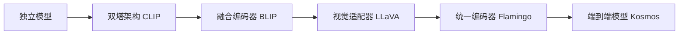
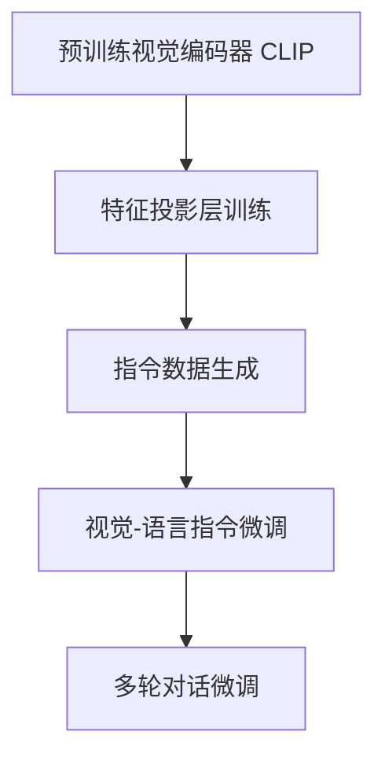
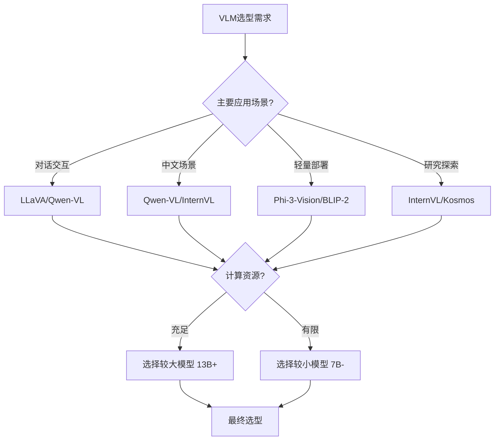

# 视觉语言模型：连接视觉与语言的智能桥梁

%% 本文档系统阐述视觉语言模型的核心架构、关键技术模块与工程实现，为AI开发人员提供从理论到实践的完整参考 %%

## 一、核心概念：什么是视觉语言模型？

**视觉语言模型**（Vision-Language Models, VLMs）是一类能够**同时处理和理解视觉（图像/视频）与语言（文本）信息**的深度学习模型。通过建立视觉与语言模态之间的语义对齐，VLMs实现了跨模态的理解、推理和生成能力。

### 1.1 定义与核心能力

```python
# VLM的核心能力定义
class VLMCapabilities:
    # 理解能力
    UNDERSTANDING = {
        "visual_question_answering": "视觉问答（VQA）",
        "image_captioning": "图像描述生成",
        "visual_grounding": "视觉指代定位",
        "multimodal_reasoning": "多模态推理"
    }
    
    # 生成能力
    GENERATION = {
        "text_to_image": "文本到图像生成",
        "image_to_text": "图像到文本生成", 
        "multimodal_dialogue": "多模态对话",
        "instruction_following": "指令跟随"
    }
    
    # 对齐能力
    ALIGNMENT = {
        "cross_modal_retrieval": "跨模态检索",
        "semantic_matching": "语义匹配",
        "representation_alignment": "表示对齐"
    }
```

#### 关键特征：
1. **跨模态理解**：同时处理视觉和语言输入，建立统一语义表示
2. **双向对齐**：视觉↔语言的双向语义映射能力
3. **零样本泛化**：无需特定任务训练即可处理新任务
4. **上下文感知**：结合视觉上下文进行语言理解与生成

### 1.2 与相关概念的区分

| 概念 | 核心特征 | 与VLM的关系 |
|------|----------|------------|
| **单模态视觉模型** | 仅处理图像/视频 | VLM的视觉编码器基础 |
| **单模态语言模型** | 仅处理文本 | VLM的语言模型基础 |
| **多模态融合模型** | 融合多种模态 | VLM是多模态融合的特例（视觉+语言） |
| **视觉Transformer** | 纯视觉注意力机制 | VLM的视觉编码器组件 |
| **图文检索模型** | 跨模态检索任务 | VLM的核心应用场景之一 |

^vlm-definition

## 二、架构演进：从双塔到统一模型

视觉语言模型的架构经历了从分离到融合的演进过程：



### 2.1 双塔架构：对比学习范式

**代表模型**：[[CLIP]]（Contrastive Language-Image Pre-training）

#### 架构特点：
```python
# CLIP风格双塔架构
class DualTowerVLM:
    def __init__(self):
        # 视觉编码器
        self.visual_encoder = VisualEncoder(
            backbone="ViT-L/14",
            output_dim=768
        )
        
        # 文本编码器
        self.text_encoder = TextEncoder(
            backbone="Transformer",
            output_dim=768
        )
        
        # 对比学习投影头
        self.visual_projection = nn.Linear(768, 512)
        self.text_projection = nn.Linear(768, 512)
    
    def forward(self, images, texts):
        # 独立编码
        visual_features = self.visual_encoder(images)  # [B, D_v]
        text_features = self.text_encoder(texts)       # [B, D_t]
        
        # 投影到共享空间
        visual_embeddings = self.visual_projection(visual_features)  # [B, 512]
        text_embeddings = self.text_projection(text_features)        # [B, 512]
        
        # 归一化
        visual_embeddings = F.normalize(visual_embeddings, dim=-1)
        text_embeddings = F.normalize(text_embeddings, dim=-1)
        
        # 计算相似度矩阵
        logits = visual_embeddings @ text_embeddings.T  # [B, B]
        
        return logits
```

#### 优势与局限：
- **优势**：训练高效、零样本能力强、表示解耦清晰
- **局限**：模态交互有限、生成能力弱、需要配对数据

### 2.2 融合编码器架构：深度交互范式

**代表模型**：[[BLIP]]（Bootstrapping Language-Image Pre-training）、[[Flamingo]]

#### 架构特点：
```python
# 融合编码器架构
class FusionEncoderVLM:
    def __init__(self):
        # 共享编码器
        self.unified_encoder = UnifiedEncoder(
            visual_layers=12,
            text_layers=12,
            cross_attention_layers=6
        )
        
        # 多任务头
        self.vqa_head = VQAHead(hidden_dim=768)
        self.caption_head = CaptionHead(hidden_dim=768)
        self.retrieval_head = RetrievalHead(hidden_dim=768)
    
    def forward(self, images, texts, task_type):
        # 联合编码
        multimodal_features = self.unified_encoder(
            visual_inputs=images,
            textual_inputs=texts
        )
        
        # 任务特定输出
        if task_type == "vqa":
            return self.vqa_head(multimodal_features)
        elif task_type == "captioning":
            return self.caption_head(multimodal_features)
        elif task_type == "retrieval":
            return self.retrieval_head(multimodal_features)
```

#### 核心创新：
1. **跨模态注意力**：视觉和语言token之间的双向注意力
2. **门控机制**：控制视觉信息流入语言模型的程度
3. **多任务预训练**：联合优化多个下游任务

### 2.3 视觉适配器架构：LLM扩展范式

**代表模型**：[[LLaVA]]（Large Language and Vision Assistant）、[[Qwen-VL]]

#### 架构特点：
```python
# 视觉适配器架构
class VisualAdapterVLM:
    def __init__(self, llm_backbone="LLaMA-7B"):
        # 预训练视觉编码器
        self.visual_encoder = VisualEncoder(
            model="CLIP-ViT-L/14",
            freeze_backbone=True
        )
        
        # 视觉特征投影层
        self.visual_projection = nn.Sequential(
            nn.Linear(1024, 4096),
            nn.GELU(),
            nn.Linear(4096, 4096)
        )
        
        # 大型语言模型
        self.llm = LLMBackbone(model=llm_backbone)
        
        # 视觉token插入策略
        self.token_insertion = TokenInsertionStrategy(
            method="prefix",
            num_visual_tokens=256
        )
    
    def forward(self, images, texts):
        # 提取视觉特征
        visual_features = self.visual_encoder(images)  # [B, 256, 1024]
        
        # 投影到语言模型空间
        projected_visual = self.visual_projection(visual_features)  # [B, 256, 4096]
        
        # 构建多模态输入
        multimodal_input = self.token_insertion.insert(
            visual_tokens=projected_visual,
            text_tokens=texts
        )
        
        # LLM推理
        output = self.llm(multimodal_input)
        
        return output
```

#### 设计哲学：
1. **重用LLM能力**：利用预训练LLM的强大语言理解能力
2. **轻量级适配**：仅训练投影层，保持视觉编码器冻结
3. **指令微调**：通过指令数据对齐视觉和语言能力

## 三、多模态对齐机制深度解析

%% 多模态对齐是VLM的核心技术，决定了模型跨模态理解的质量 %%

### 3.1 对比学习对齐（CLIP风格）

**核心思想**：最大化匹配图像-文本对的相似度，最小化不匹配对的相似度

```python
# 对比学习对齐实现
class ContrastiveAlignment:
    def __init__(self, temperature=0.07):
        self.temperature = temperature
        self.logit_scale = nn.Parameter(torch.ones([]) * np.log(1 / temperature))
    
    def compute_loss(self, image_embeddings, text_embeddings):
        """计算对比学习损失"""
        # 归一化嵌入
        image_embeddings = F.normalize(image_embeddings, dim=-1)
        text_embeddings = F.normalize(text_embeddings, dim=-1)
        
        # 计算相似度矩阵
        logits_per_image = self.logit_scale * image_embeddings @ text_embeddings.T
        logits_per_text = logits_per_image.T
        
        # 创建标签（对角线为匹配对）
        batch_size = image_embeddings.shape[0]
        labels = torch.arange(batch_size, device=image_embeddings.device)
        
        # 计算交叉熵损失
        loss_i = F.cross_entropy(logits_per_image, labels)
        loss_t = F.cross_entropy(logits_per_text, labels)
        
        return (loss_i + loss_t) / 2
    
    def align_representations(self, image_features, text_features):
        """对齐视觉和语言表示"""
        # 学习对齐变换
        alignment_matrix = self._learn_alignment_matrix(
            image_features, text_features
        )
        
        # 应用对齐
        aligned_image = image_features @ alignment_matrix
        aligned_text = text_features
        
        return aligned_image, aligned_text
```

#### 关键技术细节：
1. **温度参数调优**：控制相似度分布的尖锐程度
2. **大批次训练**：需要大批次以获得足够的负样本
3. **对称损失**：图像→文本和文本→图像双向优化

### 3.2 跨模态注意力对齐

**核心思想**：通过注意力机制建立视觉和语言token之间的动态连接

```python
# 跨模态注意力实现
class CrossModalAttention:
    def __init__(self, hidden_dim=768, num_heads=12):
        self.visual_to_text = nn.MultiheadAttention(
            embed_dim=hidden_dim,
            num_heads=num_heads,
            batch_first=True
        )
        
        self.text_to_visual = nn.MultiheadAttention(
            embed_dim=hidden_dim,
            num_heads=num_heads,
            batch_first=True
        )
        
        self.gating_mechanism = GatingMechanism(hidden_dim)
    
    def forward(self, visual_tokens, text_tokens):
        """跨模态注意力计算"""
        # 视觉到文本的注意力
        visual_context_for_text, _ = self.visual_to_text(
            query=text_tokens,
            key=visual_tokens,
            value=visual_tokens
        )
        
        # 文本到视觉的注意力
        text_context_for_visual, _ = self.text_to_visual(
            query=visual_tokens,
            key=text_tokens,
            value=text_tokens
        )
        
        # 门控融合
        gated_visual = self.gating_mechanism(visual_context_for_text)
        enhanced_text = text_tokens + gated_visual
        
        gated_text = self.gating_mechanism(text_context_for_visual)
        enhanced_visual = visual_tokens + gated_text
        
        return enhanced_visual, enhanced_text
```

#### Flamingo风格门控机制：
```python
class GatingMechanism(nn.Module):
    """Flamingo风格的门控交叉注意力"""
    def __init__(self, hidden_dim):
        super().__init__()
        self.gate = nn.Sequential(
            nn.Linear(hidden_dim, hidden_dim),
            nn.Sigmoid()
        )
    
    def forward(self, cross_modal_context):
        gate_values = self.gate(cross_modal_context)
        gated_context = gate_values * cross_modal_context
        return gated_context
```

### 3.3 嵌入空间对齐策略

#### 3.3.1 共享子空间投影

```python
# 共享子空间投影对齐
class SharedSubspaceAlignment:
    def __init__(self, visual_dim=1024, text_dim=768, shared_dim=512):
        self.visual_projection = nn.Linear(visual_dim, shared_dim)
        self.text_projection = nn.Linear(text_dim, shared_dim)
        
        # 对抗对齐损失
        self.domain_classifier = DomainClassifier(shared_dim)
    
    def align(self, visual_features, text_features):
        # 投影到共享空间
        visual_shared = self.visual_projection(visual_features)
        text_shared = self.text_projection(text_features)
        
        # 对抗训练使分布对齐
        domain_loss = self._adversarial_alignment_loss(
            visual_shared, text_shared
        )
        
        return visual_shared, text_shared, domain_loss
```

#### 3.3.2 最优传输对齐

```python
# 最优传输对齐（Sinkhorn算法）
class OptimalTransportAlignment:
    def __init__(self, epsilon=0.1, max_iter=100):
        self.epsilon = epsilon
        self.max_iter = max_iter
    
    def compute_transport_plan(self, visual_embeddings, text_embeddings):
        """计算最优传输计划"""
        # 计算成本矩阵（负相似度）
        cost_matrix = -visual_embeddings @ text_embeddings.T
        
        # Sinkhorn迭代
        K = torch.exp(-cost_matrix / self.epsilon)
        u = torch.ones(visual_embeddings.shape[0]) / visual_embeddings.shape[0]
        v = torch.ones(text_embeddings.shape[0]) / text_embeddings.shape[0]
        
        for _ in range(self.max_iter):
            u = 1.0 / (K @ v)
            v = 1.0 / (K.T @ u)
        
        # 传输计划
        transport_plan = torch.diag(u) @ K @ torch.diag(v)
        
        return transport_plan
```

## 四、视觉编码器选型与集成策略

%% 视觉编码器是VLM的"眼睛"，决定了视觉特征的质量 %%

### 4.1 主流视觉编码器对比

| 编码器类型 | 代表模型 | 特征维度 | 计算复杂度 | VLM适用性 |
|-----------|----------|----------|------------|-----------|
| **ViT** | ViT-B/16, ViT-L/14 | 768/1024 | O(N²) | ⭐⭐⭐⭐⭐ (标准选择) |
| **Swin Transformer** | Swin-B, Swin-L | 1024 | O(N) | ⭐⭐⭐⭐ (层次化特征) |
| **ConvNeXt** | ConvNeXt-B, ConvNeXt-L | 1024 | O(N) | ⭐⭐⭐ (CNN复兴) |
| **DINOv2** | DINOv2-ViT-g | 1536 | O(N²) | ⭐⭐⭐⭐⭐ (自监督优势) |
| **EVA** | EVA-CLIP | 1024 | O(N²) | ⭐⭐⭐⭐⭐ (CLIP优化) |
| **SigLIP** | SigLIP-ViT | 1024 | O(N²) | ⭐⭐⭐⭐ (Sigmoid损失) |

### 4.2 视觉特征提取策略

#### 4.2.1 全局特征 vs 局部特征

```python
# 视觉特征提取策略
class VisualFeatureExtractor:
    def __init__(self, backbone="ViT-L/14", feature_type="global"):
        self.backbone = VisualEncoder(model=backbone)
        self.feature_type = feature_type
        
        if feature_type == "patch":
            self.patch_select = PatchSelectionStrategy()
        elif feature_type == "region":
            self.region_proposal = RegionProposalNetwork()
    
    def extract_features(self, images):
        """提取视觉特征"""
        if self.feature_type == "global":
            # [CLS] token特征
            features = self.backbone(images)[:, 0, :]  # [B, D]
            
        elif self.feature_type == "patch":
            # 所有patch特征
            all_features = self.backbone(images)  # [B, N+1, D]
            patch_features = all_features[:, 1:, :]  # 去除[CLS]
            
            # 选择重要patch
            selected_features = self.patch_select(patch_features)
            features = selected_features  # [B, K, D]
            
        elif self.feature_type == "region":
            # 区域特征
            regions = self.region_proposal(images)
            region_features = []
            for region in regions:
                region_feat = self.backbone(region)
                region_features.append(region_feat)
            features = torch.stack(region_features)  # [B, R, D]
        
        return features
```

#### 4.2.2 多尺度特征融合

```python
# 多尺度视觉特征融合
class MultiScaleVisualEncoder:
    def __init__(self):
        # 多尺度编码器
        self.encoders = nn.ModuleDict({
            "high_res": VisualEncoder(resolution=448, patch_size=14),
            "medium_res": VisualEncoder(resolution=224, patch_size=14),
            "low_res": VisualEncoder(resolution=112, patch_size=14)
        })
        
        # 特征融合模块
        self.fusion = FeatureFusionModule(
            input_dims=[1024, 768, 512],
            output_dim=1024
        )
    
    def forward(self, images):
        # 多尺度特征提取
        features = {}
        for scale, encoder in self.encoders.items():
            # 调整图像分辨率
            resized_images = F.interpolate(
                images, 
                size=encoder.resolution,
                mode="bilinear"
            )
            features[scale] = encoder(resized_images)
        
        # 特征融合
        fused_features = self.fusion(
            features["high_res"],
            features["medium_res"], 
            features["low_res"]
        )
        
        return fused_features
```

### 4.3 视觉token注入策略

#### 4.3.1 前缀注入（LLaVA风格）

```python
# 视觉token前缀注入
class PrefixTokenInjection:
    def __init__(self, num_visual_tokens=256):
        self.num_visual_tokens = num_visual_tokens
        
    def inject(self, visual_features, text_tokens):
        """将视觉token注入到文本token之前"""
        # visual_features: [B, num_visual_tokens, D]
        # text_tokens: [B, seq_len, D]
        
        # 构建多模态序列
        multimodal_tokens = torch.cat([
            visual_features,  # 视觉token在前
            text_tokens       # 文本token在后
        ], dim=1)  # [B, num_visual_tokens + seq_len, D]
        
        # 创建注意力掩码
        attention_mask = self._create_attention_mask(
            visual_len=self.num_visual_tokens,
            text_len=text_tokens.shape[1]
        )
        
        return multimodal_tokens, attention_mask
    
    def _create_attention_mask(self, visual_len, text_len):
        """创建因果注意力掩码"""
        total_len = visual_len + text_len
        mask = torch.tril(torch.ones(total_len, total_len))
        
        # 允许视觉token关注所有视觉token
        mask[:visual_len, :visual_len] = 1
        
        return mask
```

#### 4.3.2 交错注入（Flamingo风格）

```python
# 视觉token交错注入
class InterleavedTokenInjection:
    def __init__(self, injection_interval=4):
        self.injection_interval = injection_interval
    
    def inject(self, visual_features, text_tokens):
        """交错注入视觉token到文本序列中"""
        batch_size, text_len, hidden_dim = text_tokens.shape
        visual_len = visual_features.shape[1]
        
        # 计算注入位置
        injection_positions = list(range(
            0, text_len, self.injection_interval
        ))[:visual_len]
        
        # 构建交错序列
        interleaved_tokens = []
        text_idx = 0
        
        for pos in range(text_len + visual_len):
            if pos in injection_positions:
                # 注入视觉token
                visual_idx = injection_positions.index(pos)
                interleaved_tokens.append(
                    visual_features[:, visual_idx, :]
                )
            else:
                # 添加文本token
                interleaved_tokens.append(
                    text_tokens[:, text_idx, :]
                )
                text_idx += 1
        
        interleaved_sequence = torch.stack(interleaved_tokens, dim=1)
        return interleaved_sequence
```

## 五、训练阶段与策略深度解析

%% VLM的训练通常分为多个阶段，每个阶段有不同的目标和策略 %%

### 5.1 预训练阶段：大规模图文对学习

#### 5.1.1 数据收集与清洗

```python
# 图文对数据预处理
class ImageTextDataProcessor:
    def __init__(self):
        self.filter_rules = {
            "min_image_size": 224,
            "max_aspect_ratio": 3.0,
            "min_text_length": 3,
            "max_text_length": 256,
            "language_filter": ["en", "zh"]  # 中英文支持
        }
        
        self.quality_scorer = QualityScorer()
    
    def process_dataset(self, raw_data):
        """处理原始图文对数据"""
        processed_pairs = []
        
        for image, text in raw_data:
            # 1. 基础过滤
            if not self._basic_filter(image, text):
                continue
            
            # 2. 质量评分
            quality_score = self.quality_scorer.score(image, text)
            if quality_score < 0.7:  # 质量阈值
                continue
            
            # 3. 数据增强
            augmented_pairs = self._augment_pair(image, text)
            
            processed_pairs.extend(augmented_pairs)
        
        return processed_pairs
    
    def _basic_filter(self, image, text):
        """基础过滤规则"""
        # 图像尺寸检查
        if image.size[0] < self.filter_rules["min_image_size"]:
            return False
        
        # 文本长度检查
        text_len = len(text.split())
        if (text_len < self.filter_rules["min_text_length"] or 
            text_len > self.filter_rules["max_text_length"]):
            return False
        
        return True
```

#### 5.1.2 预训练目标函数

```python
# VLM预训练多任务损失
class VLMPretrainingLoss:
    def __init__(self, loss_weights=None):
        self.loss_weights = loss_weights or {
            "contrastive": 1.0,
            "mlm": 0.5,
            "itm": 0.5,
            "mim": 0.2
        }
        
        # 各损失函数
        self.contrastive_loss = ContrastiveLoss(temperature=0.07)
        self.mlm_loss = MaskedLMLoss()
        self.itm_loss = ImageTextMatchingLoss()
        self.mim_loss = MaskedImageModelingLoss()
    
    def compute(self, model_outputs):
        """计算多任务损失"""
        total_loss = 0
        loss_dict = {}
        
        # 对比学习损失
        if "contrastive" in model_outputs:
            loss_contrastive = self.contrastive_loss(
                model_outputs["image_embeddings"],
                model_outputs["text_embeddings"]
            )
            total_loss += self.loss_weights["contrastive"] * loss_contrastive
            loss_dict["contrastive"] = loss_contrastive.item()
        
        # 掩码语言建模损失
        if "mlm" in model_outputs:
            loss_mlm = self.mlm_loss(
                model_outputs["mlm_logits"],
                model_outputs["mlm_labels"]
            )
            total_loss += self.loss_weights["mlm"] * loss_mlm
            loss_dict["mlm"] = loss_mlm.item()
        
        # 图文匹配损失
        if "itm" in model_outputs:
            loss_itm = self.itm_loss(
                model_outputs["itm_logits"],
                model_outputs["itm_labels"]
            )
            total_loss += self.loss_weights["itm"] * loss_itm
            loss_dict["itm"] = loss_itm.item()
        
        # 掩码图像建模损失
        if "mim" in model_outputs:
            loss_mim = self.mim_loss(
                model_outputs["mim_reconstructions"],
                model_outputs["mim_targets"]
            )
            total_loss += self.loss_weights["mim"] * loss_mim
            loss_dict["mim"] = loss_mim.item()
        
        return total_loss, loss_dict
```

### 5.2 指令微调阶段：任务对齐与能力解锁

#### 5.2.1 指令数据构建

```python
# 多模态指令数据生成
class MultimodalInstructionData:
    def __init__(self):
        self.task_templates = {
            "vqa": {
                "instruction": "根据图片回答问题：{question}",
                "input": "图片：{image}, 问题：{question}",
                "output": "{answer}"
            },
            "captioning": {
                "instruction": "描述这张图片的内容",
                "input": "图片：{image}",
                "output": "{caption}"
            },
            "grounding": {
                "instruction": "定位图片中的物体：{object}",
                "input": "图片：{image}, 物体：{object}",
                "output": "{bbox}"
            },
            "reasoning": {
                "instruction": "基于图片进行推理：{reasoning_task}",
                "input": "图片：{image}, 推理任务：{reasoning_task}",
                "output": "{reasoning_result}"
            }
        }
    
    def generate_instruction_data(self, base_data, task_type):
        """生成指令微调数据"""
        template = self.task_templates[task_type]
        
        instruction_data = []
        for item in base_data:
            # 格式化指令
            formatted_input = template["input"].format(**item)
            formatted_output = template["output"].format(**item)
            
            instruction_example = {
                "instruction": template["instruction"].format(**item),
                "input": formatted_input,
                "output": formatted_output,
                "image": item["image"]
            }
            
            instruction_data.append(instruction_example)
        
        return instruction_data
```

#### 5.2.2 指令微调策略

```python
# 视觉语言模型指令微调
class VLMInstructionTuning:
    def __init__(self, model, learning_rate=2e-5):
        self.model = model
        self.optimizer = AdamW(
            model.parameters(),
            lr=learning_rate,
            weight_decay=0.01
        )
        
        # 仅微调特定层
        self._freeze_backbone()
        
        # 损失函数
        self.loss_fn = nn.CrossEntropyLoss()
    
    def _freeze_backbone(self):
        """冻结预训练骨干网络"""
        # 冻结视觉编码器
        for param in self.model.visual_encoder.parameters():
            param.requires_grad = False
        
        # 冻结语言模型的大部分层
        for name, param in self.model.llm.named_parameters():
            if "lm_head" not in name and "visual_projection" not in name:
                param.requires_grad = False
    
    def train_step(self, batch):
        """单步训练"""
        images = batch["images"]
        texts = batch["texts"]
        labels = batch["labels"]
        
        # 前向传播
        outputs = self.model(images, texts)
        
        # 计算损失
        loss = self.loss_fn(outputs.logits, labels)
        
        # 反向传播
        self.optimizer.zero_grad()
        loss.backward()
        
        # 梯度裁剪
        torch.nn.utils.clip_grad_norm_(self.model.parameters(), 1.0)
        
        # 参数更新
        self.optimizer.step()
        
        return loss.item()
```

### 5.3 人类反馈强化学习（RLHF for VLM）

#### 5.3.1 多模态偏好数据收集

```python
# 多模态偏好数据收集
class MultimodalPreferenceData:
    def __init__(self):
        self.preference_criteria = {
            "accuracy": "回答的准确性",
            "detail": "描述的详细程度",
            "relevance": "与图像的相关性",
            "safety": "内容的安全性",
            "helpfulness": "帮助性"
        }
    
    def collect_preferences(self, model_outputs, human_ratings):
        """收集人类偏好数据"""
        preference_data = []
        
        for i, (output_a, output_b) in enumerate(model_outputs):
            # 获取人类评分
            ratings = human_ratings[i]
            
            # 确定偏好
            if ratings["output_a"] > ratings["output_b"]:
                preferred = "output_a"
                rejected = "output_b"
            else:
                preferred = "output_b"
                rejected = "output_a"
            
            preference_example = {
                "image": output_a["image"],
                "prompt": output_a["prompt"],
                "chosen": output_a if preferred == "output_a" else output_b,
                "rejected": output_b if rejected == "output_b" else output_a,
                "rating_difference": abs(ratings["output_a"] - ratings["output_b"])
            }
            
            preference_data.append(preference_example)
        
        return preference_data
```

#### 5.3.2 多模态RLHF训练

```python
# 多模态RLHF训练
class MultimodalRLHF:
    def __init__(self, policy_model, reward_model):
        self.policy_model = policy_model
        self.reward_model = reward_model
        
        # PPO配置
        self.ppo_config = {
            "clip_epsilon": 0.2,
            "value_coef": 0.5,
            "entropy_coef": 0.01,
            "kl_coef": 0.1
        }
    
    def compute_rewards(self, images, prompts, responses):
        """计算多模态奖励"""
        rewards = []
        
        for image, prompt, response in zip(images, prompts, responses):
            # 奖励模型评分
            reward_score = self.reward_model(
                image=image,
                prompt=prompt,
                response=response
            )
            
            # 安全约束奖励
            safety_reward = self._compute_safety_reward(response)
            
            # 相关性奖励
            relevance_reward = self._compute_relevance_reward(
                image, prompt, response
            )
            
            # 综合奖励
            total_reward = (
                0.6 * reward_score +
                0.2 * safety_reward +
                0.2 * relevance_reward
            )
            
            rewards.append(total_reward)
        
        return torch.tensor(rewards)
    
    def ppo_update(self, rollout_data):
        """PPO更新步骤"""
        # 计算优势函数
        advantages = self._compute_advantages(rollout_data)
        
        # 计算策略损失
        policy_loss = self._compute_policy_loss(
            rollout_data, advantages
        )
        
        # 计算价值损失
        value_loss = self._compute_value_loss(rollout_data)
        
        # 计算总损失
        total_loss = (
            policy_loss +
            self.ppo_config["value_coef"] * value_loss -
            self.ppo_config["entropy_coef"] * rollout_data["entropy"]
        )
        
        return total_loss
```

## 六、主流开源VLM对比分析

%% 本节对比分析当前主流的开源视觉语言模型 %%

### 6.1 架构设计对比

| 模型 | 发布机构 | 视觉编码器 | 语言模型 | 对齐机制 | 参数量 |
|------|----------|------------|----------|----------|--------|
| **[[LLaVA]]** | Microsoft | CLIP-ViT-L/14 | Vicuna-7B/13B | 视觉适配器 | 7B/13B |
| **[[Qwen-VL]]** | Alibaba | OpenCLIP-ViT-bigG | Qwen-7B | 视觉适配器+跨注意力 | 9.6B |
| **[[InternVL]]** | Shanghai AI Lab | InternViT-6B | InternLM2-20B | 统一编码器 | 26B |
| **[[Phi-3-Vision]]** | Microsoft | SigLIP-ViT-SO | Phi-3-Mini | 视觉适配器 | 4.2B |
| **[[Kosmos]]** | Microsoft | BEiT-3 | Magneto | 统一编码器 | 1.6B |
| **[[BLIP-2]]** | Salesforce | EVA-CLIP | FlanT5-XXL | Q-Former | 12B |

### 6.2 训练策略对比

#### LLaVA训练流程：


#### Qwen-VL训练特色：
1. **多阶段预训练**：图文对→细粒度标注→指令数据
2. **中文优化**：专门的中文图文对和指令数据
3. **多任务联合**：VQA、Captioning、Grounding联合训练

#### InternVL核心创新：
1. **视觉骨干升级**：专门设计的InternViT-6B视觉编码器
2. **统一架构**：视觉和语言共享相同的Transformer块
3. **大规模数据**：使用1B级别的图文对进行预训练

### 6.3 性能基准对比

基于常见VLM评估基准：

| 模型 | VQAv2 | GQA | VizWiz | TextVQA | MME | 平均 |
|------|-------|-----|--------|---------|-----|------|
| **LLaVA-1.5** | 78.5 | 62.0 | 58.2 | 61.3 | 1510 | 74.2 |
| **Qwen-VL-Chat** | 78.8 | 59.3 | 56.5 | 63.1 | 1487 | 73.5 |
| **InternVL-Chat** | 80.1 | 63.2 | 60.8 | 65.4 | 1562 | 76.3 |
| **Phi-3-Vision** | 76.3 | 58.7 | 55.1 | 59.8 | 1423 | 70.4 |
| **BLIP-2** | 75.4 | 61.2 | 57.8 | 60.5 | 1456 | 71.3 |

^benchmark-comparison

### 6.4 适用场景与选型建议

#### 6.4.1 场景匹配指南

| 应用场景 | 推荐模型 | 理由 |
|----------|----------|------|
| **对话式AI助手** | LLaVA、Qwen-VL-Chat | 对话优化、指令跟随能力强 |
| **中文多模态应用** | Qwen-VL、InternVL | 中文优化、本土化支持好 |
| **轻量级部署** | Phi-3-Vision、BLIP-2 | 参数量小、推理速度快 |
| **研究实验** | InternVL、Kosmos | 架构创新、技术前沿 |
| **生产级服务** | LLaVA-1.5、Qwen-VL | 稳定性好、社区支持强 |
| **跨模态检索** | CLIP、SigLIP | 对比学习专门优化 |

#### 6.4.2 技术选型决策树



## 七、工程实践：挑战与优化策略

%% 本节探讨VLM工程实现中的常见挑战及解决方案 %%

### 7.1 长视觉序列压缩

**问题**：高分辨率图像产生大量视觉token（如224×224图像→256个token），导致序列过长。

**解决方案**：

```python
# 视觉序列压缩策略
class VisualSequenceCompression:
    def __init__(self, compression_ratio=0.25):
        self.compression_ratio = compression_ratio
        
    def spatial_pooling(self, patch_features, pool_size=2):
        """空间池化压缩"""
        # patch_features: [B, H, W, D]
        B, H, W, D = patch_features.shape
        
        # 重塑为可池化形式
        reshaped = patch_features.reshape(B, H//pool_size, pool_size, W//pool_size, pool_size, D)
        pooled = reshaped.mean(dim=(2, 4))  # [B, H//2, W//2, D]
        
        return pooled.reshape(B, -1, D)  # 展平
    
    def attention_based_selection(self, patch_features, num_select=64):
        """基于注意力的关键patch选择"""
        # 计算patch重要性分数
        importance_scores = self._compute_importance(patch_features)
        
        # 选择Top-K重要patch
        top_indices = torch.topk(importance_scores, k=num_select, dim=1).indices
        
        # 收集重要patch
        selected_features = torch.gather(
            patch_features, 
            dim=1, 
            index=top_indices.unsqueeze(-1).expand(-1, -1, patch_features.shape[-1])
        )
        
        return selected_features
    
    def learned_compression(self, patch_features, target_tokens=64):
        """学习型压缩（如Q-Former）"""
        # 可学习的查询向量
        query_vectors = nn.Parameter(
            torch.randn(1, target_tokens, patch_features.shape[-1])
        )
        
        # 交叉注意力压缩
        compressed = nn.MultiheadAttention(
            embed_dim=patch_features.shape[-1],
            num_heads=8,
            batch_first=True
        )(
            query=query_vectors.expand(patch_features.shape[0], -1, -1),
            key=patch_features,
            value=patch_features
        )[0]
        
        return compressed
```

### 7.2 图文对质量过滤

**挑战**：网络爬取的图文对存在噪声、不匹配、低质量问题。

**质量过滤策略**：

```python
# 图文对质量过滤系统
class ImageTextPairFilter:
    def __init__(self):
        self.semantic_matcher = SemanticMatcher()
        self.aesthetic_scorer = AestheticScorer()
        self.diversity_checker = DiversityChecker()
    
    def filter_pairs(self, image_text_pairs, threshold=0.7):
        """过滤低质量图文对"""
        filtered_pairs = []
        
        for image, text in image_text_pairs:
            # 1. 语义匹配度
            semantic_score = self.semantic_matcher.match(image, text)
            if semantic_score < 0.6:
                continue
            
            # 2. 图像美学质量
            aesthetic_score = self.aesthetic_scorer.score(image)
            if aesthetic_score < 0.5:
                continue
            
            # 3. 文本质量
            text_quality = self._check_text_quality(text)
            if text_quality < 0.7:
                continue
            
            # 4. 多样性检查（避免重复）
            if not self.diversity_checker.is_diverse(image, text):
                continue
            
            # 综合评分
            total_score = (
                0.4 * semantic_score +
                0.3 * aesthetic_score +
                0.3 * text_quality
            )
            
            if total_score >= threshold:
                filtered_pairs.append((image, text, total_score))
        
        # 按质量排序
        filtered_pairs.sort(key=lambda x: x[2], reverse=True)
        
        return [pair[:2] for pair in filtered_pairs]  # 返回去分版的pair
```

### 7.3 推理延迟优化

**瓶颈分析**：
1. **视觉编码**：大型ViT模型推理耗时
2. **序列长度**：长视觉token导致注意力计算复杂
3. **内存带宽**：特征传输成为瓶颈

**优化策略**：

```python
# VLM推理优化
class VLMInferenceOptimizer:
    def __init__(self, model):
        self.model = model
        
    def apply_optimizations(self):
        """应用推理优化"""
        optimizations = []
        
        # 1. 模型量化
        if self._supports_quantization():
            quantized_model = self._apply_dynamic_quantization()
            optimizations.append(("quantization", "2-4x加速"))
        
        # 2. 内核融合
        if self._supports_kernel_fusion():
            fused_model = self._fuse_attention_kernels()
            optimizations.append(("kernel_fusion", "1.5x加速"))
        
        # 3. 缓存优化
        self._implement_kv_cache()
        optimizations.append(("kv_cache", "重复计算减少"))
        
        # 4. 批处理优化
        self._optimize_batching_strategy()
        optimizations.append(("batching", "吞吐量提升"))
        
        # 5. 硬件特定优化
        if torch.cuda.is_available():
            self._apply_cuda_optimizations()
            optimizations.append(("cuda_opt", "GPU利用率提升"))
        
        return optimizations
    
    def profile_inference(self, input_size=(224, 224), seq_len=256):
        """性能分析"""
        profile_results = {}
        
        # 视觉编码分析
        visual_latency = self._profile_visual_encoder(input_size)
        profile_results["visual_encoding"] = visual_latency
        
        # 语言生成分析
        text_generation_latency = self._profile_text_generation(seq_len)
        profile_results["text_generation"] = text_generation_latency
        
        # 内存分析
        memory_usage = self._profile_memory_usage()
        profile_results["memory_usage"] = memory_usage
        
        # 瓶颈识别
        bottlenecks = self._identify_bottlenecks(profile_results)
        profile_results["bottlenecks"] = bottlenecks
        
        return profile_results
```

### 7.4 多模态提示工程

**提示设计原则**：
1. **明确角色**：定义模型的角色和任务
2. **结构化输入**：清晰分隔视觉和语言信息
3. **示例引导**：提供少量示例（few-shot）
4. **约束指定**：明确输出格式和约束

**提示模板示例**：

```python
# 多模态提示模板
class MultimodalPromptTemplates:
    @staticmethod
    def vqa_prompt(image, question, few_shot_examples=None):
        """视觉问答提示"""
        prompt = f"""你是一个视觉问答助手。请根据提供的图片回答问题。

图片内容：[图像特征已注入]
问题：{question}

请直接给出答案，不要添加额外解释。"""
        
        if few_shot_examples:
            prompt = self._add_few_shot_examples(prompt, few_shot_examples)
        
        return prompt
    
    @staticmethod
    def detailed_captioning_prompt(image, style="detailed"):
        """详细图像描述提示"""
        style_instructions = {
            "detailed": "请提供详细的图像描述，包括场景、物体、颜色、动作等细节。",
            "concise": "请提供简洁的图像描述，突出主要内容。",
            "creative": "请提供富有创意的图像描述，可以适当发挥想象力。",
            "technical": "请从技术角度描述图像，包括构图、光线、色彩等。"
        }
        
        prompt = f"""你是一个图像描述专家。请根据提供的图片生成描述。

图片内容：[图像特征已注入]
描述要求：{style_instructions[style]}

请生成{style}风格的描述："""
        
        return prompt
    
    @staticmethod  
    def multimodal_reasoning_prompt(image, reasoning_task, chain_of_thought=True):
        """多模态推理提示"""
        prompt = f"""你是一个多模态推理专家。请根据图片进行推理。

图片内容：[图像特征已注入]
推理任务：{reasoning_task}

"""
        
        if chain_of_thought:
            prompt += """请按照以下步骤推理：
1. 观察图片中的关键信息
2. 分析信息之间的关系
3. 基于观察和分析进行推理
4. 给出最终结论

请逐步推理："""
        
        return prompt
```

## 八、前沿趋势与研究挑战

%% 本节探讨VLM领域的前沿研究方向和技术挑战 %%

### 8.1 当前技术局限

#### 8.1.1 细粒度理解不足

**问题表现**：
- 难以区分相似物体（不同品种的狗、特定品牌的产品）
- 对细节属性（纹理、材质、微小文字）识别能力弱
- 空间关系理解有限（精确的相对位置、距离）

**研究方向**：
1. **高分辨率处理**：处理更高分辨率图像（448×448+）
2. **局部注意力机制**：聚焦图像特定区域
3. **层次化特征提取**：结合全局和局部特征

#### 8.1.2 动态场景建模困难

**挑战**：
- 视频理解能力有限
- 时序关系捕捉不足
- 动作识别和预测困难

**解决方案探索**：
```python
# 视频语言模型架构
class VideoLanguageModel:
    def __init__(self):
        # 时空编码器
        self.spatiotemporal_encoder = SpatiotemporalEncoder(
            spatial_layers=12,
            temporal_layers=4
        )
        
        # 时序注意力
        self.temporal_attention = TemporalAttention(
            window_size=8,
            stride=4
        )
        
        # 动作识别头
        self.action_head = ActionRecognitionHead()
    
    def process_video(self, video_frames, text_query):
        """处理视频-语言任务"""
        # 提取时空特征
        spatiotemporal_features = self.spatiotemporal_encoder(video_frames)
        
        # 时序建模
        temporal_context = self.temporal_attention(spatiotemporal_features)
        
        # 多模态融合
        multimodal_features = self._fuse_with_text(temporal_context, text_query)
        
        return multimodal_features
```

#### 8.1.3 具身交互能力有限

**现状**：
- 当前VLM主要处理被动观察
- 缺乏物理世界交互能力
- 行动规划和执行能力弱

**前沿方向**：[[视觉语言行动模型]]（VLA）
- **RT-2**：视觉-语言-行动统一模型
- **OpenVLA**：开源视觉语言行动模型
- **RoboFlamingo**：机器人控制的VLM

### 8.2 新兴研究方向

#### 8.2.1 统一多模态基座模型

**目标**：构建处理多种模态（图像、视频、音频、3D、文本）的统一模型。

**代表性工作**：
- **Kosmos-2.5**：统一文本和图像理解
- **Unified-IO 2**：统一多模态输入输出
- **Gato-2**：扩展的通用智能体

**技术挑战**：
1. **模态不平衡**：不同模态数据量和质量差异
2. **表示统一**：建立跨模态的统一表示空间
3. **训练效率**：大规模多模态训练的计算成本

#### 8.2.2 世界模型耦合

**概念**：将VLM与[[世界模型]]结合，实现物理理解和预测。

**研究方向**：
1. **物理常识学习**：从视频中学习物理规律
2. **因果推理**：理解视觉场景中的因果关系
3. **反事实推理**：预测"如果...会怎样"的场景

**架构设计**：
```python
# VLM + 世界模型架构
class VLMWithWorldModel:
    def __init__(self, vlm_backbone, world_model):
        self.vlm = vlm_backbone
        self.world_model = world_model
        
        # 连接模块
        self.connection = WorldModelConnection()
    
    def predict_next_state(self, current_image, action_description):
        """预测执行动作后的状态"""
        # VLM理解当前状态
        current_understanding = self.vlm.understand(current_image)
        
        # 世界模型推理
        predicted_state = self.world_model.predict(
            current_state=current_understanding,
            action=action_description
        )
        
        # 生成预测图像描述
        predicted_description = self.vlm.generate_description(predicted_state)
        
        return predicted_description
```

#### 8.2.3 高效训练与适应

**挑战**：大规模VLM训练成本高昂，适应新任务困难。

**研究方向**：
1. **参数高效微调**：LoRA、Adapter、Prefix-tuning
2. **持续学习**：避免灾难性遗忘
3. **元学习**：快速适应新任务

**高效微调策略**：
```python
# 参数高效VLM微调
class ParameterEfficientVLMFinetuning:
    def __init__(self, base_model):
        self.base_model = base_model
        
        # 仅添加少量可训练参数
        self.lora_adapters = LoRAAdapters(
            rank=8,  # 低秩适应
            target_modules=["visual_projection", "cross_attention"]
        )
        
        self.prefix_tuning = PrefixTuning(
            prefix_length=10,
            hidden_dim=base_model.hidden_dim
        )
    
    def finetune(self, task_data, learning_rate=1e-4):
        """高效微调"""
        # 冻结基础模型
        self._freeze_base_model()
        
        # 仅训练适配器参数
        trainable_params = list(self.lora_adapters.parameters()) + \
                          list(self.prefix_tuning.parameters())
        
        optimizer = AdamW(trainable_params, lr=learning_rate)
        
        # 训练循环
        for epoch in range(10):
            for batch in task_data:
                loss = self._training_step(batch)
                optimizer.zero_grad()
                loss.backward()
                optimizer.step()
        
        return self
```

### 8.3 2024-2026年顶会代表性工作

#### CVPR 2024 亮点：
- **High-Resolution VLM**：高分辨率视觉语言模型
- **VideoVLM**：视频语言模型统一架构
- **3D-VLM**：3D场景理解的语言模型

#### ICML 2024 亮点：
- **Efficient VLM Training**：高效VLM训练算法
- **Multimodal RL**：多模态强化学习
- **Causal VLM**：因果视觉语言模型

#### NeurIPS 2024 亮点：
- **World Model Enhanced VLM**：世界模型增强的VLM
- **Multimodal In-Context Learning**：多模态上下文学习
- **VLM Safety Alignment**：VLM安全对齐

#### ACL 2024 亮点：
- **Multimodal Instruction Tuning**：多模态指令微调
- **Cross-Modal Grounding**：跨模态语义落地
- **VLM for Low-Resource Languages**：低资源语言VLM

### 8.4 未来展望

#### 技术发展趋势：
1. **规模继续扩大**：从10B到100B+参数
2. **模态更加丰富**：图像、视频、音频、3D、传感器融合
3. **能力更加通用**：从理解到规划、行动、创造
4. **效率大幅提升**：训练和推理成本降低

#### 应用前景：
1. **具身智能**：机器人视觉语言理解与控制
2. **内容创作**：多模态内容生成与编辑
3. **教育医疗**：个性化教学辅助、医学影像分析
4. **工业检测**：视觉质量检查与故障诊断

#### 社会影响考量：
1. **偏见与公平**：多模态数据中的社会偏见
2. **隐私保护**：视觉数据隐私问题
3. **安全可控**：防止滥用和误用
4. **环境影响**：大规模训练的计算碳足迹

## 九、实践指南与资源

### 9.1 快速开始指南

#### 9.1.1 环境配置

```bash
# 基础环境
conda create -n vlm python=3.10
conda activate vlm

# 安装PyTorch
pip install torch torchvision torchaudio --index-url https://download.pytorch.org/whl/cu118

# 安装VLM相关库
pip install transformers accelerate bitsandbytes
pip install opencv-python pillow
pip install gradio  # 用于演示界面
```

#### 9.1.2 使用预训练模型

```python
# 使用LLaVA进行推理
from transformers import LlavaForConditionalGeneration, LlavaProcessor
import torch
from PIL import Image

# 加载模型和处理器
model = LlavaForConditionalGeneration.from_pretrained(
    "llava-hf/llava-1.5-7b-hf",
    torch_dtype=torch.float16,
    device_map="auto"
)
processor = LlavaProcessor.from_pretrained("llava-hf/llava-1.5-7b-hf")

# 准备输入
image = Image.open("example.jpg")
prompt = "USER: <image>\n请描述这张图片。\nASSISTANT:"

# 处理输入
inputs = processor(text=prompt, images=image, return_tensors="pt").to("cuda")

# 生成输出
output = model.generate(**inputs, max_new_tokens=100)
response = processor.decode(output[0], skip_special_tokens=True)
print(response)
```

#### 9.1.3 自定义微调

```python
# 自定义VLM微调示例
from peft import LoraConfig, get_peft_model
from transformers import TrainingArguments, Trainer

# 配置LoRA
lora_config = LoraConfig(
    r=8,  # 秩
    lora_alpha=16,
    target_modules=["q_proj", "v_proj"],  # 目标模块
    lora_dropout=0.1,
    bias="none"
)

# 应用LoRA到模型
model = get_peft_model(model, lora_config)

# 训练配置
training_args = TrainingArguments(
    output_dir="./results",
    num_train_epochs=3,
    per_device_train_batch_size=4,
    gradient_accumulation_steps=4,
    warmup_steps=100,
    logging_steps=10,
    save_steps=100,
    eval_steps=100,
    learning_rate=2e-4,
    fp16=True,
    push_to_hub=False
)

# 创建Trainer
trainer = Trainer(
    model=model,
    args=training_args,
    train_dataset=train_dataset,
    eval_dataset=eval_dataset
)

# 开始训练
trainer.train()
```

### 9.2 评估与基准测试

#### 9.2.1 常用评估基准

| 基准名称 | 评估能力 | 数据规模 | 官方链接 |
|----------|----------|----------|----------|
| **VQAv2** | 视觉问答 | 265k图像，1.1M问题 | [官网](https://visualqa.org/) |
| **GQA** | 场景图推理 | 113k图像，22M问题 | [官网](https://cs.stanford.edu/people/dorarad/gqa/) |
| **TextVQA** | 图像中的文本理解 | 28k图像，45k问题 | [官网](https://textvqa.org/) |
| **VizWiz** | 盲人辅助视觉问答 | 31k图像，175k问题 | [官网](https://vizwiz.org/) |
| **MME** | 多模态综合评估 | 14个子任务 | [GitHub](https://github.com/BradyFU/Awesome-Multimodal-Large-Language-Models) |
| **MMBench** | 中文多模态基准 | 3k图像，11k问题 | [GitHub](https://github.com/open-compass/MMBench) |

#### 9.2.2 自定义评估流程

```python
# VLM评估框架
class VLMEvaluator:
    def __init__(self, model, processor):
        self.model = model
        self.processor = processor
        self.metrics = {
            "accuracy": AccuracyMetric(),
            "bleu": BLEUScore(),
            "rouge": ROUGEScore(),
            "clip_score": CLIPScore()
        }
    
    def evaluate_on_benchmark(self, benchmark_name, split="val"):
        """在标准基准上评估"""
        # 加载基准数据
        dataset = self._load_benchmark(benchmark_name, split)
        
        results = {}
        for item in tqdm(dataset):
            # 模型推理
            prediction = self._inference(item)
            
            # 计算各项指标
            for metric_name, metric in self.metrics.items():
                if metric_name not in results:
                    results[metric_name] = []
                
                score = metric.compute(prediction, item["ground_truth"])
                results[metric_name].append(score)
        
        # 汇总结果
        summary = {name: np.mean(scores) for name, scores in results.items()}
        return summary
    
    def evaluate_custom_task(self, test_data, evaluation_metrics):
        """自定义任务评估"""
        custom_results = {}
        
        for metric_config in evaluation_metrics:
            metric_name = metric_config["name"]
            metric_fn = metric_config["function"]
            
            scores = []
            for item in test_data:
                prediction = self._inference(item)
                score = metric_fn(prediction, item)
                scores.append(score)
            
            custom_results[metric_name] = {
                "mean": np.mean(scores),
                "std": np.std(scores),
                "scores": scores
            }
        
        return custom_results
```

### 9.3 学习资源与社区

#### 9.3.1 核心论文

**基础论文**：
1. **CLIP** (2021): "Learning Transferable Visual Models From Natural Language Supervision"
2. **Flamingo** (2022): "Flamingo: a Visual Language Model for Few-Shot Learning"
3. **BLIP** (2022): "BLIP: Bootstrapping Language-Image Pre-training for Unified Vision-Language Understanding and Generation"

**最新进展**：
1. **LLaVA** (2023): "Visual Instruction Tuning"
2. **Qwen-VL** (2023): "Qwen-VL: A Versatile Vision-Language Model for Understanding, Localization, Text Reading, and Beyond"
3. **InternVL** (2024): "InternVL: Scaling up Vision Foundation Models and Aligning for Generic Visual-Linguistic Tasks"

#### 9.3.2 开源项目

**模型仓库**：
- [LLaVA官方](https://github.com/haotian-liu/LLaVA)：最流行的开源VLM
- [Qwen-VL](https://github.com/QwenLM/Qwen-VL)：阿里通义千问VLM
- [OpenFlamingo](https://github.com/mlfoundations/open_flamingo)：开源Flamingo实现
- [BLIP-2](https://github.com/salesforce/BLIP)：BLIP系列模型

**工具库**：
- [Transformers](https://github.com/huggingface/transformers)：HuggingFace模型库
- [PEFT](https://github.com/huggingface/peft)：参数高效微调
- [VLLM](https://github.com/vllm-project/vllm)：高效推理引擎

#### 9.3.3 在线课程与教程

**系统课程**：
- **Stanford CS231N**：计算机视觉中的深度学习
- **Stanford CS224N**：自然语言处理与深度学习
- **CMU 11-777**：多模态机器学习

**实践教程**：
- [HuggingFace VLM教程](https://huggingface.co/learn/vlm-course)
- [LLaVA微调指南](https://github.com/haotian-liu/LLaVA/blob/main/docs/Training.md)
- [多模态AI实战](https://github.com/open-mmlab/Multimodal-AI-Tutorial)

#### 9.3.4 社区与讨论

**中文社区**：
- 知乎专栏：#多模态AI#、#视觉语言模型#
- 微信公众号：AI科技评论、机器之心
- 技术论坛：OpenMMLab社区、ModelScope社区

**国际社区**：
- Reddit: r/MachineLearning, r/deeplearning
- Discord: HuggingFace社区、LAION社区
- Twitter: 关注VLM领域研究者

---

## 文档信息

**最后更新**：2026-01-26  
**版本**：1.0  
**状态**：进行中（持续更新）  
**维护者**：AI笔记系统  
**许可证**：知识共享 署名-非商业性使用 4.0 国际 (CC BY-NC 4.0)

%% 本文档将持续跟踪视觉语言模型领域的最新进展，定期更新内容 %%

**标签更新**：
```yaml
tags:
  - 视觉语言模型
  - VLM
  - 多模态AI
  - 跨模态对齐
  - 视觉编码器
  - 语言模型
  - 多模态融合
  - 对比学习
  - CLIP
  - LLaVA
  - 指令微调
  - 视觉适配器
  - 多模态推理
  - 工程优化
  - 前沿研究
```

**相关文档链接**：
- [[多模态AI]] - 多模态AI技术概览
- [[多模态对齐]] - 跨模态对齐技术深度解析
- [[视觉编码器]] - 视觉特征提取模型对比
- [[CLIP]] - 对比语言图像预训练模型
- [[LLaVA]] - 视觉指令微调模型
- [[工具调用与MCP协议]] - 多模态工具调用系统
- [[多模态Agent]] - 多模态智能体系统架构

**反向链接**：
- 本文档被以下文档引用：[[多模态AI]]、[[多模态Agent]]、[[工具调用与MCP协议]]

---
*文档生成完成，开始你的视觉语言模型探索之旅吧！*