# 语音与音频 AI 技术全景

> *"语音是人类最自然的交互方式，音频是物理世界最丰富的感知信号。"*  
> **文档状态**：持续更新 | **最后更新**：2026-01-26 | **预计阅读时间**：90-120分钟  
> **目标读者**：AI 开发者、语音系统工程师、多模态 AI 研究者  
> **知识节点**：[[语音识别]] | [[语音合成]] | [[音频处理]] | [[多模态AI]]

---

## 1. 技术演进全景图

```mermaid
graph TD
    A[语音与音频 AI 技术演进] --> B[基础信号处理]
    A --> C[语音识别 ASR]
    A --> D[语音合成 TTS]
    A --> E[音频理解与分类]
    A --> F[语音生成与编辑]
    A --> G[多模态融合]
    
    B --> B1[采样与量化]
    B --> B2[STFT 与频谱分析]
    B --> B3[梅尔频谱与 MFCC]
    B --> B4[滤波器组与声学特征]
    
    C --> C1[传统 HMM-GMM]
    C --> C2[CTC 端到端]
    C --> C3[RNN-T 流式识别]
    C --> C4[Transformer/Conformer]
    C --> C5[Whisper 系列]
    
    D --> D1[拼接合成]
    D --> D2[WaveNet 神经声码器]
    D --> D3[Tacotron 序列到序列]
    D --> D4[FastSpeech 非自回归]
    D --> D5[VITS 变分推理]
    D --> D6[大模型驱动 TTS]
    
    E --> E1[音频事件检测]
    E --> E2[说话人识别]
    E --> E3[情感识别]
    E --> E4[音频分类]
    
    F --> F1[零样本语音克隆]
    F --> F2[风格迁移]
    F --> F3[语音修复]
    F --> F4[文本到语音 TTS]
    F --> F5[语音到语音 S2S]
    
    G --> G1[语音+文本 SLU]
    G --> G2[语音+视觉 唇读]
    G --> G3[音频 Tokenizer]
    G --> G4[统一多模态架构]
```



---

## 2. 基础信号处理

### 2.1 音频信号基础

**音频信号表示**：
- **时域表示**：原始波形 $x(t)$，采样率 $f_s$（Hz），量化位数（bit）
- **频域表示**：通过傅里叶变换得到频谱 $X(f)$
- **时频表示**：短时傅里叶变换（STFT）得到频谱图

**关键参数**：
- **采样率**：常见值 8kHz（电话）、16kHz（语音）、44.1kHz（音乐）、48kHz（专业音频）
- **量化位数**：16-bit（CD 质量）、24-bit（专业录音）
- **声道数**：单声道（Mono）、立体声（Stereo）、多声道（Surround）

### 2.2 短时傅里叶变换（STFT）

STFT 将音频信号分割为重叠的帧，对每帧进行傅里叶变换：

```python
import torch
import torchaudio
import numpy as np

class STFTProcessor:
    """STFT 处理器实现"""
    def __init__(self, n_fft=512, hop_length=160, win_length=400, window='hann'):
        self.n_fft = n_fft
        self.hop_length = hop_length
        self.win_length = win_length
        self.window = torch.hann_window(win_length) if window == 'hann' else None
    
    def compute_stft(self, waveform, sample_rate=16000):
        """计算 STFT"""
        # 转换为频谱图
        spec = torch.stft(
            waveform,
            n_fft=self.n_fft,
            hop_length=self.hop_length,
            win_length=self.win_length,
            window=self.window,
            return_complex=True
        )
        
        # 幅度谱和相位谱
        magnitude = torch.abs(spec)
        phase = torch.angle(spec)
        
        return magnitude, phase
    
    def compute_log_mel_spectrogram(self, waveform, sample_rate=16000, n_mels=80):
        """计算对数梅尔频谱"""
        # 梅尔滤波器组
        mel_filters = torchaudio.functional.melscale_fbanks(
            n_freqs=self.n_fft // 2 + 1,
            f_min=0.0,
            f_max=sample_rate // 2,
            n_mels=n_mels,
            sample_rate=sample_rate
        )
        
        magnitude, _ = self.compute_stft(waveform, sample_rate)
        mel_spec = torch.matmul(magnitude.T, mel_filters.T).T
        log_mel_spec = torch.log(mel_spec + 1e-6)
        
        return log_mel_spec
```

### 2.3 梅尔频谱与 MFCC

**梅尔频谱**（Mel Spectrogram）：
- 基于人耳听觉特性，在梅尔尺度上均匀分布滤波器
- 对低频更敏感，高频压缩
- 公式：$mel(f) = 2595 \log_{10}(1 + \frac{f}{700})$

**MFCC**（Mel-Frequency Cepstral Coefficients）：
1. 计算 STFT 得到幅度谱
2. 应用梅尔滤波器组
3. 取对数
4. 离散余弦变换（DCT）得到倒谱系数
5. 保留前 13-40 个系数作为特征

```python
class MFCCExtractor:
    """MFCC 特征提取器"""
    def __init__(self, sample_rate=16000, n_mfcc=13, n_fft=512, hop_length=160):
        self.sample_rate = sample_rate
        self.n_mfcc = n_mfcc
        self.n_fft = n_fft
        self.hop_length = hop_length
        
    def extract_mfcc(self, waveform):
        """提取 MFCC 特征"""
        # 使用 torchaudio 的 MFCC 实现
        mfcc_transform = torchaudio.transforms.MFCC(
            sample_rate=self.sample_rate,
            n_mfcc=self.n_mfcc,
            melkwargs={
                'n_fft': self.n_fft,
                'hop_length': self.hop_length,
                'n_mels': 80
            }
        )
        return mfcc_transform(waveform)
```

### 2.4 滤波器组与声学特征

**FBANK**（Filter Bank Features）：
- 梅尔滤波器组的输出，不进行 DCT
- 比 MFCC 更接近原始频谱，保留更多信息
- 常用于深度学习模型

**其他声学特征**：
- **PLP**（Perceptual Linear Prediction）：考虑听觉心理声学
- **RASTA-PLP**：对 PLP 进行相对谱处理，增强鲁棒性
- **Delta 特征**：一阶和二阶差分，捕捉动态信息

---

## 3. 语音识别（ASR）技术体系

### 3.1 传统方法：HMM-GMM

**隐马尔可夫模型-高斯混合模型**（HMM-GMM）：
- **HMM**：建模语音的时间序列特性
- **GMM**：建模声学特征的分布
- **流程**：特征提取 → 声学模型（GMM-HMM）→ 语言模型 → 解码

**局限性**：
- 需要音素对齐
- 特征工程依赖性强
- 难以建模复杂声学模式

### 3.2 深度学习革命：CTC

**连接时序分类**（Connectionist Temporal Classification）：
- 端到端训练，无需音素对齐
- 引入空白标签（blank）处理对齐问题
- 损失函数：$L_{CTC} = -\log P(y|x)$

```python
class CTCModel(nn.Module):
    """CTC 语音识别模型"""
    def __init__(self, input_dim=80, hidden_dim=512, num_classes=29):
        super().__init__()
        # 编码器：BiLSTM
        self.encoder = nn.LSTM(
            input_dim, hidden_dim, 
            num_layers=3, 
            bidirectional=True,
            batch_first=True
        )
        
        # 分类头
        self.classifier = nn.Linear(hidden_dim * 2, num_classes)
        
    def forward(self, x, x_lengths):
        # x: (B, T, D)
        packed_x = nn.utils.rnn.pack_padded_sequence(
            x, x_lengths.cpu(), batch_first=True, enforce_sorted=False
        )
        
        packed_output, _ = self.encoder(packed_x)
        output, _ = nn.utils.rnn.pad_packed_sequence(
            packed_output, batch_first=True
        )
        
        logits = self.classifier(output)  # (B, T, C)
        return logits
    
    def compute_ctc_loss(self, logits, targets, input_lengths, target_lengths):
        """计算 CTC 损失"""
        log_probs = F.log_softmax(logits, dim=-1)
        loss = F.ctc_loss(
            log_probs.transpose(0, 1),  # (T, B, C)
            targets,
            input_lengths,
            target_lengths,
            blank=0,
            zero_infinity=True
        )
        return loss
```

### 3.3 流式识别：RNN-T

**RNN-Transducer**（RNN-T）：
- 专为流式语音识别设计
- 联合建模声学和语言模型
- 预测网络（Prediction Network） + 编码网络（Encoder） + 联合网络（Joint Network）

```python
class RNNTransducer(nn.Module):
    """RNN-T 模型实现"""
    def __init__(self, audio_dim=80, vocab_size=5000, hidden_dim=512):
        super().__init__()
        
        # 编码器（声学模型）
        self.encoder = nn.LSTM(
            audio_dim, hidden_dim,
            num_layers=4, bidirectional=True,
            batch_first=True
        )
        
        # 预测网络（语言模型）
        self.predictor = nn.LSTM(
            vocab_size, hidden_dim,
            num_layers=2, batch_first=True
        )
        
        # 联合网络
        self.joint_network = nn.Sequential(
            nn.Linear(hidden_dim * 2, hidden_dim),
            nn.Tanh(),
            nn.Linear(hidden_dim, vocab_size)
        )
        
    def forward(self, audio_features, text_embeddings):
        # 编码音频特征
        encoder_out, _ = self.encoder(audio_features)  # (B, T, 2H)
        
        # 预测文本特征
        predictor_out, _ = self.predictor(text_embeddings)  # (B, U, H)
        
        # 联合计算
        B, T, H_enc = encoder_out.shape
        B, U, H_pred = predictor_out.shape
        
        # 扩展维度进行联合计算
        encoder_out_expanded = encoder_out.unsqueeze(2)  # (B, T, 1, 2H)
        predictor_out_expanded = predictor_out.unsqueeze(1)  # (B, 1, U, H)
        
        # 联合网络输入
        joint_input = torch.cat([
            encoder_out_expanded.expand(B, T, U, H_enc),
            predictor_out_expanded.expand(B, T, U, H_pred)
        ], dim=-1)
        
        logits = self.joint_network(joint_input)  # (B, T, U, V)
        return logits
```

### 3.4 Transformer/Conformer 架构

**Conformer**（Convolution-augmented Transformer）：
- 结合 Transformer 的自注意力机制和 CNN 的局部建模能力
- 模块结构：前馈网络 → 多头注意力 → 卷积模块 → 前馈网络

```python
class ConformerBlock(nn.Module):
    """Conformer 模块实现"""
    def __init__(self, d_model=512, n_heads=8, conv_kernel=31, dropout=0.1):
        super().__init__()
        
        # 第一个前馈网络
        self.ffn1 = nn.Sequential(
            nn.Linear(d_model, d_model * 4),
            nn.SiLU(),
            nn.Dropout(dropout),
            nn.Linear(d_model * 4, d_model),
            nn.Dropout(dropout)
        )
        self.norm1 = nn.LayerNorm(d_model)
        
        # 多头自注意力
        self.self_attn = nn.MultiheadAttention(
            d_model, n_heads, dropout=dropout, batch_first=True
        )
        self.norm2 = nn.LayerNorm(d_model)
        
        # 卷积模块
        self.conv_module = ConvolutionModule(d_model, conv_kernel)
        self.norm3 = nn.LayerNorm(d_model)
        
        # 第二个前馈网络
        self.ffn2 = nn.Sequential(
            nn.Linear(d_model, d_model * 4),
            nn.SiLU(),
            nn.Dropout(dropout),
            nn.Linear(d_model * 4, d_model),
            nn.Dropout(dropout)
        )
        self.norm4 = nn.LayerNorm(d_model)
        
        self.dropout = nn.Dropout(dropout)
        
    def forward(self, x, attention_mask=None):
        # 第一个前馈网络（带残差）
        residual = x
        x = self.norm1(x)
        x = self.ffn1(x)
        x = self.dropout(x)
        x = residual + x
        
        # 多头自注意力
        residual = x
        x = self.norm2(x)
        x, _ = self.self_attn(x, x, x, attn_mask=attention_mask)
        x = self.dropout(x)
        x = residual + x
        
        # 卷积模块
        residual = x
        x = self.norm3(x)
        x = self.conv_module(x)
        x = self.dropout(x)
        x = residual + x
        
        # 第二个前馈网络
        residual = x
        x = self.norm4(x)
        x = self.ffn2(x)
        x = self.dropout(x)
        x = residual + x
        
        return x

class ConvolutionModule(nn.Module):
    """Conformer 卷积模块"""
    def __init__(self, d_model, kernel_size, dropout=0.1):
        super().__init__()
        assert kernel_size % 2 == 1, "Kernel size should be odd"
        
        self.pointwise_conv1 = nn.Conv1d(d_model, d_model * 2, 1)
        self.glu = nn.GLU(dim=1)
        self.depthwise_conv = nn.Conv1d(
            d_model, d_model, kernel_size,
            padding=(kernel_size - 1) // 2,
            groups=d_model
        )
        self.batch_norm = nn.BatchNorm1d(d_model)
        self.swish = nn.SiLU()
        self.pointwise_conv2 = nn.Conv1d(d_model, d_model, 1)
        self.dropout = nn.Dropout(dropout)
        
    def forward(self, x):
        # x: (B, T, D)
        x = x.transpose(1, 2)  # (B, D, T)
        
        # 点卷积 + GLU
        x = self.pointwise_conv1(x)
        x = self.glu(x)
        
        # 深度可分离卷积
        x = self.depthwise_conv(x)
        x = self.batch_norm(x)
        x = self.swish(x)
        
        # 第二个点卷积
        x = self.pointwise_conv2(x)
        x = self.dropout(x)
        
        return x.transpose(1, 2)  # (B, T, D)
```

### 3.5 Whisper 系列模型

**OpenAI Whisper** 架构特点：
- 多任务训练：多语言 ASR + 语音翻译
- 大规模弱监督数据：68 万小时多语言音频
- 编码器-解码器 Transformer 架构
- 零样本跨语言迁移能力

**Whisper 变体**：
- **Whisper Tiny**：39M 参数，实时推理
- **Whisper Base**：74M 参数，平衡性能
- **Whisper Small**：244M 参数，生产级质量
- **Whisper Medium**：769M 参数，高精度
- **Whisper Large**：1550M 参数，SOTA 性能

**WhisperX** 增强功能：
- 语音活动检测（VAD）
- 说话人分离（Speaker Diarization）
- 词级时间戳对齐
- 批量处理优化

```python
class WhisperASR:
    """Whisper ASR 系统封装"""
    def __init__(self, model_size="base", device="cuda"):
        from transformers import WhisperProcessor, WhisperForConditionalGeneration
        
        self.processor = WhisperProcessor.from_pretrained(
            f"openai/whisper-{model_size}"
        )
        self.model = WhisperForConditionalGeneration.from_pretrained(
            f"openai/whisper-{model_size}"
        ).to(device)
        
        self.device = device
        self.model.eval()
    
    def transcribe(self, audio_path, language="zh", task="transcribe"):
        """语音转录"""
        import librosa
        
        # 加载音频
        audio, sr = librosa.load(audio_path, sr=16000)
        
        # 预处理
        inputs = self.processor(
            audio, 
            sampling_rate=sr,
            return_tensors="pt",
            language=language,
            task=task
        ).to(self.device)
        
        # 生成转录
        with torch.no_grad():
            predicted_ids = self.model.generate(
                inputs["input_features"],
                max_length=448,
                num_beams=5,
                temperature=0.0
            )
        
        # 解码文本
        transcription = self.processor.batch_decode(
            predicted_ids, skip_special_tokens=True
        )[0]
        
        return transcription
```

---

## 4. 语音合成（TTS）技术体系

### 4.1 传统方法：拼接合成

**拼接合成**（Concatenative Synthesis）：
- 从录音库中选取合适的语音单元
- 拼接形成目标语音
- **单元选择算法**：基于代价函数的最优路径搜索
- **优点**：自然度高
- **缺点**：需要大规模录音库，灵活性差

### 4.2 神经声码器：WaveNet

**WaveNet** 突破性贡献：
- 自回归生成模型，逐点预测音频样本
- 空洞卷积（Dilated Convolution）扩大感受野
- 条件生成：基于文本特征、说话人 ID 等

```python
class WaveNetBlock(nn.Module):
    """WaveNet 残差块"""
    def __init__(self, residual_channels, skip_channels, dilation):
        super().__init__()
        
        # 空洞卷积
        self.filter_conv = nn.Conv1d(
            residual_channels, residual_channels,
            kernel_size=3, padding=dilation, dilation=dilation
        )
        self.gate_conv = nn.Conv1d(
            residual_channels, residual_channels,
            kernel_size=3, padding=dilation, dilation=dilation
        )
        
        # 1x1 卷积
        self.residual_conv = nn.Conv1d(residual_channels, residual_channels, 1)
        self.skip_conv = nn.Conv1d(residual_channels, skip_channels, 1)
        
    def forward(self, x):
        # 门控机制
        filter_out = torch.tanh(self.filter_conv(x))
        gate_out = torch.sigmoid(self.gate_conv(x))
        gated = filter_out * gate_out
        
        # 残差连接
        residual = self.residual_conv(gated)
        residual = residual + x  # 残差连接
        
        # 跳跃连接
        skip = self.skip_conv(gated)
        
        return residual, skip
```

### 4.3 序列到序列：Tacotron

**Tacotron** 架构：
- 编码器：字符/音素嵌入 → CBHG 模块
- 注意力机制：位置敏感注意力（Location-Sensitive Attention）
- 解码器：自回归生成梅尔频谱
- 声码器：Griffin-Lim 或 WaveNet

**Tacotron 2 改进**：
- 引入 WaveNet 作为神经声码器
- 改进注意力机制稳定性
- 提升语音自然度

### 4.4 非自回归：FastSpeech

**FastSpeech** 核心创新：
- **非自回归生成**：并行生成所有帧，大幅提升推理速度
- **长度调节器**（Length Regulator）：对齐文本和语音长度
- **音素持续时间预测器**：预测每个音素的帧数

```python
class FastSpeechModel(nn.Module):
    """FastSpeech 模型架构"""
    def __init__(self, vocab_size, max_seq_len, d_model=256):
        super().__init__()
        
        # 音素嵌入
        self.phoneme_embedding = nn.Embedding(vocab_size, d_model)
        
        # 编码器 Transformer
        self.encoder = nn.TransformerEncoder(
            nn.TransformerEncoderLayer(d_model, nhead=4, dim_feedforward=1024),
            num_layers=4
        )
        
        # 音素持续时间预测器
        self.duration_predictor = DurationPredictor(d_model)
        
        # 长度调节器
        self.length_regulator = LengthRegulator()
        
        # 解码器 Transformer
        self.decoder = nn.TransformerEncoder(
            nn.TransformerEncoderLayer(d_model, nhead=4, dim_feedforward=1024),
            num_layers=4
        )
        
        # 梅尔频谱预测器
        self.mel_predictor = nn.Linear(d_model, 80)
        
    def forward(self, phoneme_ids, duration_targets=None):
        # 音素嵌入
        x = self.phoneme_embedding(phoneme_ids)
        
        # 编码器
        encoder_output = self.encoder(x)
        
        # 持续时间预测
        if duration_targets is None:
            predicted_durations = self.duration_predictor(encoder_output)
            # 使用预测的持续时间
            expanded_encoder_output = self.length_regulator(
                encoder_output, predicted_durations
            )
        else:
            # 使用真实的持续时间（训练时）
            expanded_encoder_output = self.length_regulator(
                encoder_output, duration_targets
            )
        
        # 解码器
        decoder_output = self.decoder(expanded_encoder_output)
        
        # 梅尔频谱预测
        mel_spec = self.mel_predictor(decoder_output)
        
        return mel_spec

class DurationPredictor(nn.Module):
    """音素持续时间预测器"""
    def __init__(self, d_model):
        super().__init__()
        self.conv1 = nn.Conv1d(d_model, 256, kernel_size=3, padding=1)
        self.conv2 = nn.Conv1d(256, 256, kernel_size=3, padding=1)
        self.linear = nn.Linear(256, 1)
        
    def forward(self, x):
        # x: (B, T, D)
        x = x.transpose(1, 2)  # (B, D, T)
        x = F.relu(self.conv1(x))
        x = F.relu(self.conv2(x))
        x = x.transpose(1, 2)  # (B, T, D)
        durations = self.linear(x).squeeze(-1)  # (B, T)
        return durations

class LengthRegulator(nn.Module):
    """长度调节器"""
    def forward(self, x, durations):
        """根据持续时间扩展序列"""
        # x: (B, T, D)
        # durations: (B, T)
        batch_size, seq_len, hidden_dim = x.shape
        
        # 扩展序列
        expanded_outputs = []
        for b in range(batch_size):
            expanded_seq = []
            for t in range(seq_len):
                # 重复每个音素特征 duration 次
                repeat_count = int(durations[b, t].item())
                expanded_seq.append(x[b, t:t+1].repeat(repeat_count, 1))
            
            if expanded_seq:
                expanded_outputs.append(torch.cat(expanded_seq, dim=0))
            else:
                expanded_outputs.append(torch.zeros(0, hidden_dim))
        
        # 填充到相同长度
        max_len = max([seq.shape[0] for seq in expanded_outputs])
        padded_outputs = []
        for seq in expanded_outputs:
            if seq.shape[0] < max_len:
                pad_len = max_len - seq.shape[0]
                padding = torch.zeros(pad_len, hidden_dim, device=seq.device)
                seq = torch.cat([seq, padding], dim=0)
            padded_outputs.append(seq)
        
        return torch.stack(padded_outputs, dim=0)  # (B, max_len, D)
```

### 4.5 变分推理：VITS

**VITS**（Variational Inference with adversarial learning for end-to-end Text-to-Speech）：
- **端到端训练**：文本 → 波形，无需中间特征
- **变分自编码器**（VAE）：学习潜在表示
- **归一化流**（Normalizing Flow）：增强表达能力
- **对抗训练**：提升语音质量

**VITS 核心组件**：
1. **后验编码器**：将线性频谱映射到潜在变量
2. **先验编码器**：从文本生成潜在变量的先验分布
3. **解码器**：从潜在变量生成波形
4. **判别器**：对抗训练提升真实性

```python
class VITSModel(nn.Module):
    """VITS 端到端 TTS 模型"""
    def __init__(self, vocab_size, hidden_dim=192):
        super().__init__()
        
        # 文本编码器
        self.text_encoder = TextEncoder(vocab_size, hidden_dim)
        
        # 后验编码器（从频谱到潜在变量）
        self.posterior_encoder = PosteriorEncoder(hidden_dim)
        
        # 先验编码器（从文本到潜在变量）
        self.prior_encoder = PriorEncoder(hidden_dim)
        
        # 流模型（增强先验分布）
        self.flow = ResidualCouplingBlock(hidden_dim)
        
        # 解码器（从潜在变量到波形）
        self.decoder = HiFiGANDecoder(hidden_dim)
        
        # 持续时间预测器
        self.duration_predictor = DurationPredictor(hidden_dim)
        
        # 判别器（对抗训练）
        self.discriminator = MultiPeriodDiscriminator()
        
    def forward(self, text, text_lengths, mel_spec=None, mel_lengths=None):
        # 文本编码
        text_embeddings, text_mask = self.text_encoder(text, text_lengths)
        
        if self.training and mel_spec is not None:
            # 训练模式：使用真实梅尔频谱
            # 后验编码
            z_posterior, posterior_mean, posterior_log_var = self.posterior_encoder(
                mel_spec, mel_lengths
            )
            
            # 先验编码 + 流模型
            prior_mean, prior_log_var = self.prior_encoder(text_embeddings, text_mask)
            z_prior = self.flow(z_posterior, text_mask, reverse=False)
            
            # 持续时间预测
            log_durations = self.duration_predictor(text_embeddings, text_mask)
            
            # KL 散度损失
            kl_loss = self.compute_kl_loss(
                posterior_mean, posterior_log_var,
                prior_mean, prior_log_var, text_mask
            )
            
            # 重建损失（从潜在变量重建梅尔频谱）
            reconstructed_mel = self.decoder(z_posterior)
            reconstruction_loss = F.l1_loss(reconstructed_mel, mel_spec)
            
            # 对抗损失
            real_waveform = self.spec_to_waveform(mel_spec)
            fake_waveform = self.decoder(z_posterior)
            adv_loss = self.compute_adversarial_loss(real_waveform, fake_waveform)
            
            return {
                'kl_loss': kl_loss,
                'reconstruction_loss': reconstruction_loss,
                'adv_loss': adv_loss,
                'log_durations': log_durations
            }
        else:
            # 推理模式：从文本生成语音
            # 先验编码
            prior_mean, prior_log_var = self.prior_encoder(text_embeddings, text_mask)
            
            # 采样潜在变量
            z_prior = torch.randn_like(prior_mean) * torch.exp(0.5 * prior_log_var) + prior_mean
            
            # 通过流模型
            z = self.flow(z_prior, text_mask, reverse=True)
            
            # 生成波形
            waveform = self.decoder(z)
            
            return waveform
```

### 4.6 大语言模型驱动的 TTS

**SpeechLM**、**MetaVoice** 等新兴架构：
- **统一建模**：将语音视为离散 token 序列
- **LLM 赋能**：利用大语言模型的强大生成能力
- **少样本/零样本**：适应新说话人、新语言

**关键技术**：
- **音频 Tokenizer**：如 EnCodec、SoundStream
- **语音语言模型**：在离散 token 上训练的自回归模型
- **条件生成**：基于文本、说话人、情感等条件

---

## 5. 音频理解与分类

### 5.1 音频事件检测（AED）

**任务定义**：检测音频流中的特定事件（如枪声、玻璃破碎、婴儿哭声等）

**常用方法**：
- **基于频谱图**：CNN 特征提取 + RNN 时序建模
- **基于 Transformer**：Audio Spectrogram Transformer（AST）
- **弱监督学习**：多实例学习（MIL）

**数据集**：
- **AudioSet**：200 万段 10 秒音频，527 个事件类别
- **DCASE**：检测与分类声学场景和事件挑战赛

```python
class AudioEventDetector(nn.Module):
    """音频事件检测模型"""
    def __init__(self, num_classes=527, input_dim=128):
        super().__init__()
        
        # 频谱图编码器
        self.spectrogram_encoder = nn.Sequential(
            nn.Conv2d(1, 64, kernel_size=3, stride=2, padding=1),
            nn.BatchNorm2d(64),
            nn.ReLU(),
            nn.Conv2d(64, 128, kernel_size=3, stride=2, padding=1),
            nn.BatchNorm2d(128),
            nn.ReLU(),
            nn.Conv2d(128, 256, kernel_size=3, stride=2, padding=1),
            nn.BatchNorm2d(256),
            nn.ReLU(),
            nn.AdaptiveAvgPool2d((1, 1))
        )
        
        # 时序建模（BiLSTM）
        self.temporal_model = nn.LSTM(
            input_size=256,
            hidden_size=128,
            num_layers=2,
            bidirectional=True,
            batch_first=True
        )
        
        # 分类头
        self.classifier = nn.Sequential(
            nn.Linear(256, 128),
            nn.ReLU(),
            nn.Dropout(0.3),
            nn.Linear(128, num_classes),
            nn.Sigmoid()  # 多标签分类
        )
        
    def forward(self, spectrograms):
        # spectrograms: (B, T, F) -> (B, 1, T, F)
        batch_size, time_steps, freq_bins = spectrograms.shape
        x = spectrograms.unsqueeze(1)  # (B, 1, T, F)
        
        # 频谱图编码
        x = self.spectrogram_encoder(x)  # (B, 256, 1, 1)
        x = x.squeeze(-1).squeeze(-1)  # (B, 256)
        
        # 重塑为时序特征（假设每个时间步一个特征向量）
        x = x.view(batch_size, time_steps // 8, -1)  # 下采样 8 倍
        
        # 时序建模
        x, _ = self.temporal_model(x)  # (B, T', 256)
        
        # 分类
        logits = self.classifier(x)  # (B, T', num_classes)
        
        # 时间维度平均池化
        predictions = logits.mean(dim=1)  # (B, num_classes)
        
        return predictions
```

### 5.2 说话人识别（Speaker Verification）

**任务定义**：
- **说话人验证**：判断两段语音是否来自同一说话人
- **说话人识别**：识别语音来自哪个已知说话人

**关键技术**：
- **i-vector**：传统统计方法
- **x-vector**：基于 DNN 的说话人嵌入
- **ECAPA-TDNN**：当前 SOTA 架构

**损失函数**：
- **Softmax**：多分类
- **Triplet Loss**：学习判别性嵌入
- **ArcFace/Additive Margin Softmax**：增强类间距离

```python
class ECAPA_TDNN(nn.Module):
    """ECAPA-TDNN 说话人识别模型"""
    def __init__(self, input_dim=80, channels=512, emb_dim=192):
        super().__init__()
        
        # 帧级特征提取
        self.frame1 = nn.Conv1d(input_dim, channels, kernel_size=5, dilation=1, padding=2)
        self.frame2 = nn.Conv1d(channels, channels, kernel_size=3, dilation=2, padding=2)
        self.frame3 = nn.Conv1d(channels, channels, kernel_size=3, dilation=3, padding=3)
        
        # SE-Res2Block
        self.se_res2blocks = nn.ModuleList([
            SE_Res2Block(channels, scale=8) for _ in range(3)
        ])
        
        # 注意力统计池化
        self.attention = nn.Sequential(
            nn.Conv1d(channels * 3, 1536, kernel_size=1),
            nn.ReLU(),
            nn.BatchNorm1d(1536),
            nn.Conv1d(1536, channels, kernel_size=1),
            nn.Softmax(dim=2)
        )
        
        # 说话人嵌入层
        self.embedding = nn.Sequential(
            nn.Conv1d(channels * 3, 1536, kernel_size=1),
            nn.ReLU(),
            nn.BatchNorm1d(1536),
            nn.Conv1d(1536, emb_dim, kernel_size=1)
        )
        
    def forward(self, x):
        # x: (B, T, D) -> (B, D, T)
        x = x.transpose(1, 2)
        
        # 帧级特征
        x1 = F.relu(self.frame1(x))
        x2 = F.relu(self.frame2(x1))
        x3 = F.relu(self.frame3(x2))
        
        # 多尺度特征拼接
        x = torch.cat([x1, x2, x3], dim=1)
        
        # SE-Res2Block
        for se_res2block in self.se_res2blocks:
            x = se_res2block(x)
        
        # 注意力统计池化
        w = self.attention(x)
        mu = torch.sum(x * w, dim=2)
        sg = torch.sqrt((torch.sum((x**2) * w, dim=2) - mu**2).clamp(min=1e-5))
        
        # 拼接统计量
        x = torch.cat([mu, sg], dim=1)
        
        # 说话人嵌入
        embeddings = self.embedding(x)
        
        return embeddings

class SE_Res2Block(nn.Module):
    """SE-Res2Block 模块"""
    def __init__(self, channels, scale=8):
        super().__init__()
        self.scale = scale
        self.conv1 = nn.Conv1d(channels, channels, kernel_size=1)
        self.bn1 = nn.BatchNorm1d(channels)
        self.conv2 = nn.Conv1d(channels, channels, kernel_size=3, padding=1)
        self.bn2 = nn.BatchNorm1d(channels)
        self.conv3 = nn.Conv1d(channels, channels, kernel_size=1)
        self.bn3 = nn.BatchNorm1d(channels)
        self.se = SEBlock(channels)
        
    def forward(self, x):
        residual = x
        x = F.relu(self.bn1(self.conv1(x)))
        x = F.relu(self.bn2(self.conv2(x)))
        x = F.relu(self.bn3(self.conv3(x)))
        x = self.se(x)
        return x + residual

class SEBlock(nn.Module):
    """Squeeze-and-Excitation 模块"""
    def __init__(self, channels, reduction=8):
        super().__init__()
        self.fc1 = nn.Linear(channels, channels // reduction)
        self.fc2 = nn.Linear(channels // reduction, channels)
        
    def forward(self, x):
        # x: (B, C, T)
        se = F.adaptive_avg_pool1d(x, 1).squeeze(-1)  # (B, C)
        se = F.relu(self.fc1(se))
        se = torch.sigmoid(self.fc2(se))
        return x * se.unsqueeze(-1)
```

### 5.3 情感识别（Speech Emotion Recognition）

**任务定义**：识别语音中的情感状态（如愤怒、快乐、悲伤、中性等）

**常用方法**：
- **基于声学特征**：MFCC、韵律特征（音高、能量、时长）
- **深度学习**：CNN + LSTM、Transformer
- **多模态融合**：语音 + 文本 + 视觉

**数据集**：
- **IEMOCAP**：交互式情感二元动作数据集
- **RAVDESS**：语音和歌曲情感数据集
- **EMO-DB**：德语情感语音数据库

### 5.4 音频分类

**任务类型**：
- **音乐分类**：流派、乐器、情绪分类
- **环境音分类**：场景识别（街道、办公室、自然）
- **语音质量评估**：MOS 预测

**模型架构**：
- **PANNs**（Pre-trained Audio Neural Networks）：大规模音频预训练模型
- **AST**（Audio Spectrogram Transformer）：基于 Transformer 的音频分类
- **BEATs**（Audio Pre-training with Acoustic Tokenizers）：音频 Token 预训练

---

## 6. 语音生成与编辑

### 6.1 零样本语音克隆

**技术原理**：
- **说话人嵌入**：从参考音频提取说话人特征
- **条件生成**：基于文本 + 说话人嵌入生成语音
- **少样本学习**：仅需几秒参考音频

**代表性工作**：
- **YourTTS**：多语言零样本 TTS
- **VALL-E**：基于音频语言模型的语音合成
- **OpenVoice**：零样本语音克隆与风格迁移

```python
class ZeroShotVoiceCloner(nn.Module):
    """零样本语音克隆模型"""
    def __init__(self, vocab_size, speaker_dim=256):
        super().__init__()
        
        # 文本编码器
        self.text_encoder = TextEncoder(vocab_size)
        
        # 说话人编码器
        self.speaker_encoder = SpeakerEncoder(speaker_dim)
        
        # 说话人自适应网络
        self.speaker_adaptation = SpeakerAdaptation(speaker_dim)
        
        # 语音生成器
        self.generator = VITSGenerator()
        
    def forward(self, text, reference_audio, text_lengths=None):
        # 文本编码
        text_features = self.text_encoder(text, text_lengths)
        
        # 说话人嵌入提取
        speaker_embedding = self.speaker_encoder(reference_audio)
        
        # 说话人自适应
        adapted_features = self.speaker_adaptation(text_features, speaker_embedding)
        
        # 生成语音
        waveform = self.generator(adapted_features)
        
        return waveform

class SpeakerEncoder(nn.Module):
    """说话人编码器"""
    def __init__(self, embedding_dim=256):
        super().__init__()
        
        # 频谱图编码
        self.conv_layers = nn.Sequential(
            nn.Conv2d(1, 32, kernel_size=3, stride=2, padding=1),
            nn.ReLU(),
            nn.Conv2d(32, 64, kernel_size=3, stride=2, padding=1),
            nn.ReLU(),
            nn.Conv2d(64, 128, kernel_size=3, stride=2, padding=1),
            nn.ReLU(),
            nn.Conv2d(128, 256, kernel_size=3, stride=2, padding=1),
            nn.ReLU(),
        )
        
        # 时序建模
        self.lstm = nn.LSTM(256, 128, num_layers=2, batch_first=True)
        
        # 嵌入层
        self.embedding = nn.Linear(128, embedding_dim)
        
    def forward(self, audio):
        # 计算频谱图
        spec = torchaudio.transforms.MelSpectrogram()(audio)
        spec = spec.unsqueeze(1)  # (B, 1, F, T)
        
        # 卷积编码
        x = self.conv_layers(spec)  # (B, 256, F', T')
        x = x.mean(dim=[2, 3])  # 全局平均池化
        
        # LSTM 编码
        x = x.unsqueeze(1)  # (B, 1, 256)
        x, _ = self.lstm(x)
        
        # 说话人嵌入
        embedding = self.embedding(x.squeeze(1))
        
        return embedding
```

### 6.2 风格迁移

**任务定义**：将源语音的风格（情感、语调、口音）迁移到目标语音

**技术方法**：
- **基于 CycleGAN**：无监督风格迁移
- **基于内容-风格解耦**：分离语音内容和风格
- **基于语音转换**（Voice Conversion）：保持内容，改变说话人

**应用场景**：
- 情感转换：中性 → 愤怒/快乐/悲伤
- 口音转换：标准普通话 → 方言
- 语调转换：平淡 → 生动

### 6.3 语音修复

**任务类型**：
- **去噪**：去除背景噪声
- **去混响**：去除房间混响
- **语音增强**：提升语音清晰度
- **缺失修复**：修复损坏的音频片段

**技术方法**：
- **基于 CNN**：U-Net 架构
- **基于 Transformer**：时序建模
- **基于扩散模型**：高质量修复

**数据集**：
- **VoiceBank-DEMAND**：语音增强数据集
- **DNS Challenge**：深度噪声抑制挑战赛

### 6.4 文本到语音（TTS）

**完整流程**：
1. **文本预处理**：分词、音素转换、韵律标注
2. **声学模型**：文本 → 声学特征（梅尔频谱）
3. **声码器**：声学特征 → 波形

**性能指标**：
- **自然度**：MOS（Mean Opinion Score）
- **相似度**：与目标说话人的相似度
- **推理速度**：RTF（Real-Time Factor）

### 6.5 语音到语音（S2S）

**任务定义**：将源语音转换为目标语音，保持语义内容

**应用场景**：
- **语音翻译**：跨语言语音转换
- **语音修复**：低质量 → 高质量
- **语音风格化**：改变说话人、情感、语调

**技术架构**：
- **级联方法**：ASR → 文本翻译 → TTS
- **端到端方法**：直接语音到语音转换
- **基于离散 token**：语音 → Token → 语音

---

## 7. 多模态融合与最新趋势

### 7.1 语音+文本：SLU（Spoken Language Understanding）

**任务定义**：理解语音的语义意图，超越简单的转录

**核心组件**：
- **ASR 模块**：语音转文本
- **NLU 模块**：意图识别、槽位填充
- **联合优化**：端到端训练

**架构类型**：
- **级联架构**：ASR → NLU（独立训练）
- **联合架构**：共享编码器，联合优化
- **端到端架构**：直接语音 → 意图

```python
class SLUModel(nn.Module):
    """语音语言理解模型"""
    def __init__(self, num_intents, num_slots, vocab_size):
        super().__init__()
        
        # 共享编码器
        self.audio_encoder = AudioEncoder()
        self.text_encoder = TextEncoder(vocab_size)
        
        # 意图分类器
        self.intent_classifier = nn.Sequential(
            nn.Linear(512, 256),
            nn.ReLU(),
            nn.Dropout(0.3),
            nn.Linear(256, num_intents)
        )
        
        # 槽位填充器
        self.slot_filler = nn.Sequential(
            nn.Linear(512, 256),
            nn.ReLU(),
            nn.Dropout(0.3),
            nn.Linear(256, num_slots)
        )
        
    def forward(self, audio=None, text=None, audio_lengths=None, text_lengths=None):
        # 多模态编码
        if audio is not None:
            audio_features = self.audio_encoder(audio, audio_lengths)
        
        if text is not None:
            text_features = self.text_encoder(text, text_lengths)
        
        # 特征融合
        if audio is not None and text is not None:
            features = (audio_features + text_features) / 2
        elif audio is not None:
            features = audio_features
        else:
            features = text_features
        
        # 意图分类
        intent_logits = self.intent_classifier(features.mean(dim=1))
        
        # 槽位填充
        slot_logits = self.slot_filler(features)
        
        return intent_logits, slot_logits
```

### 7.2 语音+视觉：唇读与音视频对齐

**唇读**（Lip Reading）：
- **任务定义**：从视频唇部运动识别语音内容
- **应用场景**：噪声环境、辅助听障人士
- **数据集**：LRW（Lip Reading in the Wild）、LRS2、LRS3

**音视频对齐**：
- **任务定义**：对齐音频和视频的时间戳
- **应用场景**：视频编辑、多模态检索
- **技术方法**：基于注意力机制、对比学习

### 7.3 音频 Tokenizer

**技术目标**：将连续音频信号离散化为 token 序列

**代表性工作**：
- **EnCodec**：Meta 的音频编解码器
- **SoundStream**：Google 的神经音频编解码器
- **DAC**（Descript Audio Codec）：高质量音频编解码

**应用价值**：
- **音频压缩**：高效存储和传输
- **语音生成**：基于 token 的语音合成
- **音频理解**：将音频视为语言序列

```python
class AudioTokenizer(nn.Module):
    """音频 Tokenizer"""
    def __init__(self, sample_rate=24000, bandwidth=6.0, codebook_size=1024):
        super().__init__()
        
        # 编码器
        self.encoder = nn.Sequential(
            nn.Conv1d(1, 32, kernel_size=7, stride=1, padding=3),
            nn.ReLU(),
            nn.Conv1d(32, 32, kernel_size=7, stride=1, padding=3),
            nn.ReLU(),
            ResidualBlock(32, 3),
            ResidualBlock(32, 3),
            nn.Conv1d(32, 64, kernel_size=7, stride=2, padding=3),
            nn.ReLU(),
            ResidualBlock(64, 3),
            ResidualBlock(64, 3),
            nn.Conv1d(64, 128, kernel_size=7, stride=2, padding=3),
            nn.ReLU(),
            ResidualBlock(128, 3),
            ResidualBlock(128, 3),
            nn.Conv1d(128, 256, kernel_size=7, stride=2, padding=3),
            nn.ReLU(),
            ResidualBlock(256, 3),
            ResidualBlock(256, 3),
        )
        
        # 向量量化层
        self.quantizer = VectorQuantizer(codebook_size, 256)
        
        # 解码器
        self.decoder = nn.Sequential(
            nn.Conv1d(256, 128, kernel_size=7, stride=1, padding=3),
            nn.ReLU(),
            ResidualBlock(128, 3),
            ResidualBlock(128, 3),
            nn.ConvTranspose1d(128, 64, kernel_size=7, stride=2, padding=3),
            nn.ReLU(),
            ResidualBlock(64, 3),
            ResidualBlock(64, 3),
            nn.ConvTranspose1d(64, 32, kernel_size=7, stride=2, padding=3),
            nn.ReLU(),
            ResidualBlock(32, 3),
            ResidualBlock(32, 3),
            nn.ConvTranspose1d(32, 1, kernel_size=7, stride=1, padding=3),
            nn.Tanh()
        )
        
    def forward(self, audio):
        # 编码
        encoded = self.encoder(audio)
        
        # 量化
        quantized, codes, commitment_loss = self.quantizer(encoded)
        
        # 解码
        decoded = self.decoder(quantized)
        
        return decoded, codes, commitment_loss

class VectorQuantizer(nn.Module):
    """向量量化层"""
    def __init__(self, num_embeddings, embedding_dim):
        super().__init__()
        self.embedding_dim = embedding_dim
        self.num_embeddings = num_embeddings
        
        # 代码本
        self.embedding = nn.Embedding(num_embeddings, embedding_dim)
        self.embedding.weight.data.uniform_(-1.0 / num_embeddings, 1.0 / num_embeddings)
        
    def forward(self, inputs):
        # inputs: (B, D, T)
        input_shape = inputs.shape
        
        # 转置为 (B, T, D)
        flat_input = inputs.transpose(1, 2).contiguous()
        flat_input = flat_input.view(-1, self.embedding_dim)
        
        # 计算距离
        distances = (
            torch.sum(flat_input**2, dim=1, keepdim=True)
            + torch.sum(self.embedding.weight**2, dim=1)
            - 2 * torch.matmul(flat_input, self.embedding.weight.t())
        )
        
        # 找到最近的代码本向量
        encoding_indices = torch.argmin(distances, dim=1).unsqueeze(1)
        quantized = self.embedding(encoding_indices).view(input_shape[0], input_shape[2], self.embedding_dim)
        quantized = quantized.transpose(1, 2).contiguous()
        
        # 计算承诺损失
        e_latent_loss = F.mse_loss(quantized.detach(), inputs)
        q_latent_loss = F.mse_loss(quantized, inputs.detach())
        commitment_loss = q_latent_loss + e_latent_loss
        
        # 直通估计器
        quantized = inputs + (quantized - inputs).detach()
        
        return quantized, encoding_indices, commitment_loss
```

### 7.4 统一多模态架构

**AudioPaLM**：
- **架构**：将音频 token 与文本 token 统一建模
- **能力**：语音识别、语音翻译、语音生成
- **优势**：跨模态迁移学习

**CosyVoice**：
- **零样本语音合成**：适应新说话人
- **多语言支持**：跨语言语音生成
- **风格控制**：情感、语调、语速

**统一音频基础模型**：
- **目标**：学习通用的音频表示
- **任务**：ASR、TTS、音频分类、事件检测
- **预训练**：大规模音频数据自监督学习

---

## 8. 工程实践与最佳实践

### 8.1 开发环境搭建

**核心依赖**：
```bash
# 音频处理
pip install torchaudio librosa soundfile

# 深度学习框架
pip install torch torchvision

# 语音工具
pip install pyannote.audio  # 说话人分离
pip install whisper-openai  # Whisper 模型
pip install transformers   # Hugging Face 模型

# 音频增强
pip install pedalboard  # 音频效果处理
```

**硬件要求**：
- **GPU**：NVIDIA GPU（推荐 RTX 3090/4090）
- **内存**：至少 32GB RAM
- **存储**：SSD，至少 500GB 用于数据集

### 8.2 数据集与资源

**语音识别数据集**：
- **LibriSpeech**：1000 小时英语朗读语音
- **Common Voice**：多语言众包语音数据集
- **AISHELL**：中文语音识别数据集
- **GigaSpeech**：10000 小时多领域英语语音

**语音合成数据集**：
- **LJSpeech**：13 小时英语单人朗读
- **VCTK**：44 小时多说话人英语语音
- **AISHELL-3**：中文多说话人语音合成数据集
- **LibriTTS**：多说话人英语语音合成

**音频理解数据集**：
- **AudioSet**：200 万段音频，527 个事件类别
- **ESC-50**：环境音分类数据集
- **UrbanSound8K**：城市环境音分类

### 8.3 开源工具与框架

**ESPnet**：
- **特点**：端到端语音处理工具包
- **支持**：ASR、TTS、语音翻译
- **优势**：丰富的预训练模型

**NVIDIA NeMo**：
- **特点**：GPU 优化的语音 AI 工具包
- **支持**：ASR、TTS、NLP
- **优势**：生产级部署

**Fairseq**：
- **特点**：Facebook 的序列建模工具包
- **支持**：语音识别、语音合成
- **优势**：灵活的模型架构

**Hugging Face Transformers**：
- **特点**：统一的模型接口
- **支持**：Whisper、Wav2Vec2、SpeechT5
- **优势**：易用性强，社区活跃

### 8.4 模型选择指南

**ASR 模型选择**：
| 场景 | 推荐模型 | 特点 |
|------|---------|------|
| 实时转录 | Whisper Tiny/Base | 低延迟，平衡性能 |
| 高精度 | Whisper Large | 最高准确率 |
| 流式识别 | RNN-T、Conformer | 低延迟，适合实时 |
| 多语言 | Whisper、MMS | 跨语言支持 |

**TTS 模型选择**：
| 场景 | 推荐模型 | 特点 |
|------|---------|------|
| 高质量 | VITS | 自然度高 |
| 快速推理 | FastSpeech | 非自回归，速度快 |
| 零样本 | YourTTS、OpenVoice | 适应新说话人 |
| 多语言 | SpeechLM、CosyVoice | 跨语言支持 |

### 8.5 训练与微调

**数据准备**：
```python
def prepare_audio_dataset(audio_dir, sample_rate=16000):
    """准备音频数据集"""
    import os
    import librosa
    
    audio_files = []
    for root, dirs, files in os.walk(audio_dir):
        for file in files:
            if file.endswith('.wav') or file.endswith('.mp3'):
                audio_files.append(os.path.join(root, file))
    
    # 加载和预处理
    audio_data = []
    for audio_file in audio_files:
        audio, sr = librosa.load(audio_file, sr=sample_rate)
        audio_data.append(audio)
    
    return audio_data
```

**训练技巧**：
- **数据增强**：添加噪声、混响、音高变化
- **混合精度训练**：使用 FP16 加速训练
- **梯度累积**：处理大批量数据
- **学习率调度**：Warmup + Cosine Decay

**微调策略**：
```python
def fine_tune_whisper(model, train_dataset, num_epochs=3):
    """微调 Whisper 模型"""
    from transformers import get_linear_schedule_with_warmup
    
    # 冻结编码器（可选）
    for param in model.model.encoder.parameters():
        param.requires_grad = False
    
    # 优化器
    optimizer = torch.optim.AdamW(model.parameters(), lr=1e-5)
    
    # 学习率调度器
    scheduler = get_linear_schedule_with_warmup(
        optimizer,
        num_warmup_steps=100,
        num_training_steps=len(train_dataset) * num_epochs
    )
    
    # 训练循环
    for epoch in range(num_epochs):
        for batch in train_dataset:
            optimizer.zero_grad()
            
            # 前向传播
            outputs = model(**batch)
            loss = outputs.loss
            
            # 反向传播
            loss.backward()
            optimizer.step()
            scheduler.step()
    
    return model
```

### 8.6 部署与优化

**模型量化**：
```python
def quantize_model(model):
    """量化模型以减少内存和加速推理"""
    from torch.quantization import quantize_dynamic
    
    # 动态量化
    quantized_model = quantize_dynamic(
        model,
        {nn.Linear, nn.LSTM, nn.Conv1d},
        dtype=torch.qint8
    )
    
    return quantized_model
```

**ONNX 导出**：
```python
def export_to_onnx(model, output_path):
    """导出模型到 ONNX 格式"""
    import torch.onnx
    
    # 创建示例输入
    dummy_input = torch.randn(1, 80, 1000)
    
    # 导出
    torch.onnx.export(
        model,
        dummy_input,
        output_path,
        input_names=['audio_features'],
        output_names=['logits'],
        dynamic_axes={
            'audio_features': {0: 'batch_size', 2: 'time_steps'},
            'logits': {0: 'batch_size', 1: 'time_steps'}
        }
    )
```

**实时推理优化**：
- **流式处理**：分块处理音频，降低延迟
- **GPU 加速**：使用 CUDA 优化
- **批处理**：批量处理多个音频
- **缓存**：缓存常用计算结果

### 8.7 常见挑战与解决方案

**低资源语言支持**：
- **挑战**：数据稀缺，模型性能差
- **解决方案**：
  - 跨语言迁移学习
  - 数据增强
  - 自监督预训练

**实时性约束**：
- **挑战**：低延迟要求
- **解决方案**：
  - 流式模型（RNN-T、Streaming Conformer）
  - 模型压缩（量化、剪枝）
  - 硬件加速（GPU、TPU）

**噪声鲁棒性**：
- **挑战**：噪声环境性能下降
- **解决方案**：
  - 语音增强预处理
  - 多风格训练
  - 抗噪损失函数

**说话人适应性**：
- **挑战**：适应新说话人
- **解决方案**：
  - 零样本语音克隆
  - 少样本学习
  - 说话人自适应训练

---

## 9. 未来展望与研究方向

### 9.1 技术趋势

**音频基础模型**：
- **目标**：学习通用的音频表示
- **方向**：统一建模语音、音乐、环境音
- **挑战**：跨模态对齐、零样本泛化

**高效生成**：
- **目标**：降低计算成本，提升生成速度
- **方向**：非自回归模型、蒸馏、量化
- **挑战**：保持生成质量

**多模态融合**：
- **目标**：深度融合语音、文本、视觉
- **方向**：统一架构、跨模态注意力
- **挑战**：模态对齐、数据稀缺

### 9.2 应用扩展

**语音交互 Agent**：
- **实时语音推理**：语音 → 思考 → 语音
- **多轮对话**：上下文感知的语音交互
- **个性化**：适应不同用户偏好

**世界音频模型**：
- **环境理解**：理解物理世界的音频信号
- **音频生成**：生成逼真的环境音
- **音频编辑**：精确编辑音频内容

**医疗健康**：
- **语音诊断**：通过语音检测疾病
- **语音治疗**：辅助语言障碍治疗
- **心理健康**：语音情感分析

### 9.3 伦理与安全

**隐私保护**：
- **语音匿名化**：去除说话人身份信息
- **联邦学习**：保护用户数据隐私
- **差分隐私**：添加噪声保护隐私

**安全防护**：
- **语音伪造检测**：检测深度伪造语音
- **水印技术**：为生成语音添加水印
- **认证机制**：验证语音真实性

**公平性**：
- **偏见消除**：减少模型对特定群体的偏见
- **多样性**：确保模型支持多种语言和口音
- **可解释性**：提高模型决策的透明度

### 9.4 研究前沿（2024-2026）

**顶会突破性工作**：
- **ICASSP 2024**：高效语音识别、多模态语音理解
- **Interspeech 2024**：语音合成、语音转换
- **NeurIPS 2024**：音频生成、音频理解
- **ACL 2024**：语音语言理解、多模态 NLP

**新兴方向**：
- **神经符号融合**：结合符号推理和神经网络
- **因果推理**：理解语音的因果关系
- **元学习**：快速适应新任务和领域
- **自监督学习**：利用无标注数据学习

---

## 10. 资源与学习路径

### 10.1 核心资源

**论文与综述**：
- **Speech Processing**：Jurafsky & Martin，《Speech and Language Processing》
- **Deep Learning for Audio**：综述论文，涵盖 ASR、TTS、音频理解
- **Audio Deep Learning**：音频深度学习教程

**开源项目**：
- **ESPnet**：https://github.com/espnet/espnet
- **NVIDIA NeMo**：https://github.com/NVIDIA/NeMo
- **Hugging Face Transformers**：https://github.com/huggingface/transformers
- **OpenAI Whisper**：https://github.com/openai/whisper

**数据集**：
- **OpenSLR**：语音数据集集合
- **Kaggle Audio**：音频竞赛数据集
- **Hugging Face Datasets**：音频数据集库

### 10.2 学习路径

**入门阶段**：
1. **基础理论**：信号处理、概率论、机器学习
2. **工具使用**：librosa、torchaudio、PyTorch
3. **简单任务**：音频分类、语音识别基础

**进阶阶段**：
1. **深度学习**：CNN、RNN、Transformer
2. **核心任务**：ASR、TTS、音频理解
3. **项目实践**：复现论文、参与竞赛

**高级阶段**：
1. **前沿研究**：阅读顶会论文
2. **创新研究**：提出新方法、新架构
3. **工程落地**：部署优化、产品化

### 10.3 社区与活动

**学术会议**：
- **ICASSP**：国际声学、语音与信号处理会议
- **Interspeech**：国际语音通信会议
- **NeurIPS**：神经信息处理系统会议
- **ACL**：计算语言学协会年会

**竞赛平台**：
- **Kaggle**：音频竞赛
- **DCASE**：声学场景和事件检测挑战赛
- **Voice Conversion Challenge**：语音转换挑战赛

**在线社区**：
- **Discord**：语音 AI 社区
- **Reddit**：r/MachineLearning、r/SpeechSynthesis
- **GitHub**：开源项目协作

---

## 11. 知识连接与扩展

### 11.1 相关笔记

**语音识别**：
- [[Whisper]]：OpenAI 的多语言语音识别模型
- [[RNN-T]]：流式语音识别架构
- [[Conformer]]：卷积增强的 Transformer

**语音合成**：
- [[VITS]]：端到端语音合成模型
- [[FastSpeech]]：非自回归语音合成
- [[WaveNet]]：神经声码器

**音频处理**：
- [[梅尔频谱]]：音频特征表示
- [[音频Tokenizer]]：音频离散化技术
- [[音频增强]]：语音去噪和增强

**多模态AI**：
- [[多模态AI]]：多模态学习综述
- [[CLIP]]：视觉-语言预训练
- [[多模态融合]]：多模态信息融合

### 11.2 扩展阅读

**技术博客**：
- **Google AI Blog**：语音 AI 最新进展
- **Meta AI Blog**：音频研究动态
- **OpenAI Blog**：Whisper 等模型介绍

**在线课程**：
- **Coursera**：Audio Signal Processing
- **edX**：Deep Learning for Audio
- **Udacity**：AI for Audio

**书籍推荐**：
- 《Speech and Language Processing》
- 《Deep Learning》
- 《Pattern Recognition and Machine Learning》

### 11.3 未来扩展方向

**技术深度**：
- 扩展每个技术点的详细实现
- 添加更多代码示例和实战案例
- 深入探讨数学原理和算法细节

**应用广度**：
- 添加更多应用场景和案例研究
- 覆盖更多语言和领域
- 探讨跨学科应用

**前沿追踪**：
- 定期更新最新研究成果
- 添加新兴技术和方法
- 跟踪产业界动态

---

## 12. 总结与要点

### 12.1 核心要点

**技术演进**：
- 从传统方法（HMM-GMM）到深度学习（CTC、RNN-T）
- 从自回归模型（WaveNet）到非自回归模型（FastSpeech）
- 从单一任务到统一多模态架构

**关键技术**：
- **信号处理**：STFT、梅尔频谱、MFCC
- **语音识别**：CTC、RNN-T、Conformer、Whisper
- **语音合成**：WaveNet、Tacotron、FastSpeech、VITS
- **音频理解**：事件检测、说话人识别、情感识别
- **多模态融合**：SLU、唇读、音频 Tokenizer

**工程实践**：
- 数据准备和预处理
- 模型训练和微调
- 部署优化和性能调优
- 常见挑战和解决方案

### 12.2 学习建议

**循序渐进**：
1. 掌握基础信号处理和机器学习理论
2. 学习深度学习基础（CNN、RNN、Transformer）
3. 深入语音 AI 核心任务（ASR、TTS）
4. 探索前沿研究和多模态融合

**实践导向**：
- 动手实现经典模型
- 参与开源项目和竞赛
- 关注产业界应用和需求
- 持续学习和更新知识

**社区参与**：
- 阅读顶会论文和技术博客
- 参与学术会议和竞赛
- 贡献开源项目
- 与同行交流和合作

### 12.3 未来展望

语音与音频 AI 正在快速发展，未来将呈现以下趋势：

1. **统一基础模型**：音频、语音、音乐的统一建模
2. **高效生成**：更低成本、更高质量的语音生成
3. **多模态融合**：深度融合语音、文本、视觉
4. **个性化适配**：零样本适应新用户、新场景
5. **安全可信**：隐私保护、安全防护、公平性

---

> *"语音与音频 AI 不仅是技术的突破，更是人机交互方式的革命。"*  
> **持续更新中...** | **欢迎贡献和反馈**