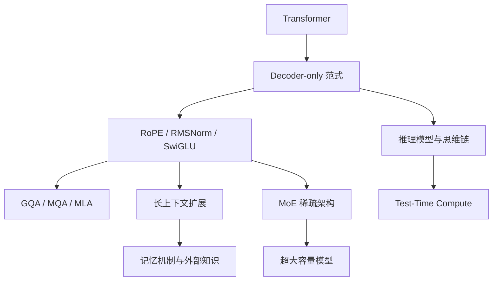

---
tags:
  - 大语言模型
  - LLM
  - 架构
  - 综述
  - 大模型时代
created: 2025-07-10
updated: 2026-07-10
---

# 大语言模型核心架构综述

## 领域定义

大语言模型核心架构关注的是：一个现代 LLM 为什么能工作、由哪些关键模块构成、这些模块为何会演化成今天的主流设计。它讨论的是模型内部的结构范式，而不是训练流程、推理部署或应用编排。

当前主流 LLM 多以 Transformer 为基础，在此之上逐步形成了相对稳定的技术栈：Decoder-only 主干、RoPE 位置编码、RMSNorm、SwiGLU、GQA/MQA/MLA 等注意力变体，以及面向容量扩展的 MoE 架构。

## 为什么会出现

大语言模型核心架构的形成，来自三个长期问题的叠加：

- **序列建模效率不足**：RNN/LSTM 的串行依赖限制了训练并行度。
- **长程依赖建模困难**：传统序列模型在长上下文下容易出现信息衰减。
- **规模扩展需求上升**：参数、数据和算力快速增长后，模型设计必须同时考虑表达能力、训练效率和推理成本。

因此，LLM 架构演进的本质，是在“表达能力、扩展性、训练稳定性、推理效率”之间不断寻找新的平衡点。

## 发展历史

| 年代 | 里程碑 | 意义 |
|------|--------|------|
| 2017 | Transformer | 以自注意力取代递归结构，奠定 LLM 架构基础 |
| 2018 | GPT-1 | Decoder-only + 自回归预训练路线确立 |
| 2020 | GPT-3 | 规模化训练证明大模型能力随规模显著提升 |
| 2021 | RoPE / Switch Transformer | 位置编码与稀疏 MoE 开始进入主流视野 |
| 2022 | Chinchilla / FlashAttention | 计算最优训练与高效注意力成为关键议题 |
| 2023 | LLaMA / Mixtral / Mamba | 开源技术栈成熟，MoE 与替代架构探索加速 |
| 2024 | Llama 3 / Qwen 2 / DeepSeek-V2/V3 / o1 | 长上下文、MLA、细粒度 MoE、推理模型快速发展 |
| 2025 | DeepSeek-R1 等 | 推理模型与测试时计算成为新的能力扩展方向 |

## 核心问题

LLM 核心架构主要围绕以下问题展开：

1. **如何表示输入**：分词、Tokenization、Embedding 如何影响信息密度与跨语言能力。
2. **如何建模依赖**：注意力机制与位置编码如何共同决定上下文建模能力。
3. **如何稳定训练**：归一化、激活函数、残差结构如何支持大规模训练。
4. **如何扩展容量**：MoE、长上下文、外部记忆如何扩展模型能力边界。
5. **如何提升推理能力**：推理模型、思维链、测试时计算如何改变能力来源。
6. **如何降低推理成本**：GQA、MLA、KV-Cache 友好设计如何服务部署现实。

## 技术演进路线

从整体上看，这条演进路线可概括为：

- **第一阶段**：以 Transformer 和 Decoder-only 为中心，建立统一的语言建模范式。
- **第二阶段**：以 RoPE、RMSNorm、SwiGLU、GQA 为代表，形成高效稳定的标准技术栈。
- **第三阶段**：以 MoE、长上下文、外部记忆为代表，扩展模型容量与上下文边界。
- **第四阶段**：以 o1、R1 一类推理模型为代表，开始把“推理过程”本身纳入架构能力设计。

## 重要分支

### 1. 模型主干
- [[01_LLM整体架构]]：理解 Decoder-only、扩展规律、主流 LLM 共同设计模式的入口。

### 2. 注意力与位置编码
- [[02_注意力机制]]：从缩放点积注意力到 GQA/MLA 的核心机制。
- [[03_位置编码]]：从绝对位置、相对位置到 RoPE、ALiBi 与外推方法。

### 3. 输入表示
- [[04_分词与Tokenization]]：决定 token 效率、多语言表现和上下文利用率。
- [[05_向量表示与Embedding]]：决定模型如何组织语义空间与表示层信息。

### 4. 容量扩展与记忆
- [[06_混合专家模型]]：通过稀疏激活提高容量/计算比。
- [[07_长上下文与记忆机制]]：解决长序列理解、长期记忆和外部知识接入问题。

### 5. 架构经验与前沿能力
- [[08_大模型设计模式]]：总结大模型设计上的稳定模式与工程取舍。
- [[09_推理模型与思维链]]：理解推理模型、CoT、ReAct、PRM 与测试时计算。

## 学习路径

1. **先看整体**：[[01_LLM整体架构]] → 建立主干认识。
2. **再看核心模块**：[[02_注意力机制]] + [[03_位置编码]] + [[04_分词与Tokenization]]。
3. **补足表示与容量扩展**：[[05_向量表示与Embedding]] + [[06_混合专家模型]]。
4. **进入能力边界问题**：[[07_长上下文与记忆机制]] + [[09_推理模型与思维链]]。
5. **最后回到抽象总结**：[[08_大模型设计模式]]，形成对架构选择的整体判断。

## 当前发展状态

当前 LLM 核心架构呈现出几个稳定趋势：

- **Decoder-only 仍是主流**：在通用生成任务上仍具有最强生态与实践基础。
- **标准技术栈趋于收敛**：RoPE、RMSNorm、SwiGLU、GQA 已成为主流开源模型常见组合。
- **MoE 成为重要扩展路线**：在保持推理成本相对可控的同时显著提高模型容量。
- **长上下文与记忆机制持续演化**：从简单位置外推走向 KV 压缩、分离式推理和外部记忆协同。
- **推理模型抬升架构讨论层级**：能力不再只来自“更大模型”，也来自“更长、更有效的推理过程”。

## 未来趋势

- **架构与推理过程耦合更深**：推理模型会推动“结构设计 + 后训练 + 测试时计算”一体化。
- **稀疏化进一步普及**：MoE、选择性激活、专家路由将持续优化容量/成本比。
- **长上下文从外推转向系统协同**：架构、缓存、记忆、检索会联合设计。
- **多模态原生化**：语言主干将不再只处理文本，而是逐渐演化为统一 token 架构。
- **替代架构继续存在但短期难替代主流**：Mamba/Jamba/混合架构会在特定场景形成补充路线。

## 相关方向

- [[../08_Transformer与注意力机制/00_Transformer与注意力机制_综述|Transformer与注意力机制]]：提供架构理论基础。
- [[../09_预训练语言模型/00_预训练语言模型_综述|预训练语言模型]]：是 LLM 的直接范式前身。
- [[../11_大模型训练与对齐/00_大模型训练与对齐_综述|大模型训练与对齐]]：展开训练、微调与对齐流程。
- [[../12_大模型推理与优化/00_大模型推理与优化|大模型推理与优化]]：展开量化、KV-Cache、加速与部署优化。
- [[../14_多模态AI/00_多模态AI|多模态AI]]：讨论语言主干如何向统一多模态模型扩展。
- [[../19_LLM应用工程/00_LLM应用工程|LLM应用工程]]：讨论 Prompt、RAG、Agent 等上层应用范式。
- [[../17_AI安全与对齐/00_AI安全与对齐_综述|AI安全与对齐]]：讨论能力提升后的安全与价值问题。

## 笔记导航

- [[01_LLM整体架构]]
- [[02_注意力机制]]
- [[03_位置编码]]
- [[04_分词与Tokenization]]
- [[05_向量表示与Embedding]]
- [[06_混合专家模型]]
- [[07_长上下文与记忆机制]]
- [[08_大模型设计模式]]
- [[09_推理模型与思维链]]

## References

- Vaswani et al., *Attention Is All You Need* (2017)
- Brown et al., *Language Models are Few-Shot Learners* (2020)
- Su et al., *RoFormer: Enhanced Transformer with Rotary Position Embedding* (2021)
- Fedus et al., *Switch Transformers* (2022)
- Hoffmann et al., *Training Compute-Optimal Large Language Models* (2022)
- Dao et al., *FlashAttention* (2022)
- Touvron et al., *LLaMA* / *Llama 2* / *Llama 3* 技术报告
- DeepSeek-AI, *DeepSeek-V2* / *DeepSeek-V3* / *DeepSeek-R1* 技术报告
- Qwen 技术报告
- Mistral / Mixtral 技术报告
