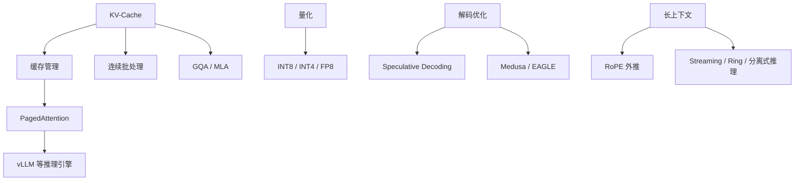

---
tags:
  - 大模型推理
  - 推理优化
  - LLM
  - 综述
  - 工程系统
created: 2025-07-10
updated: 2026-07-10
---

# 大模型推理与优化综述

## 领域定义

大模型推理与优化关注的是：一个已经训练完成的大语言模型，如何在真实系统中以更低延迟、更高吞吐、更少显存和更低成本完成推理。它讨论的是模型从“能用”走向“可部署、可扩展、可服务”的全过程。

这不是训练问题，也不只是部署问题，而是连接模型架构、硬件特性、推理引擎和应用体验的交叉层。

## 为什么会出现

LLM 在进入生产后会立刻暴露出三类约束：

- **计算受限**：自回归生成逐 token 输出，天然串行。
- **显存受限**：模型参数和 KV-Cache 同时争夺内存资源。
- **带宽受限**：解码阶段往往是 memory-bound，而不是 compute-bound。

因此，推理优化的目标不是单纯“让模型更快”，而是在质量、延迟、吞吐、稳定性和成本之间建立可用平衡。

## 发展历史

| 年代 | 里程碑 | 意义 |
|------|--------|------|
| 2019 | MQA | 通过减少 KV 头数改善推理效率 |
| 2020 | KV-Cache 普及 | 成为自回归推理的基础优化 |
| 2022 | FlashAttention | 从 IO 角度重写注意力计算效率问题 |
| 2022 | LLM.int8() | 大模型量化进入工程主流 |
| 2023 | GPTQ / AWQ | 高质量低比特量化成为实用方案 |
| 2023 | PagedAttention / vLLM | KV-Cache 管理进入系统级优化阶段 |
| 2023 | Speculative Decoding | 通过草稿模型加速解码 |
| 2023 | StreamingLLM / GQA / YaRN | 长上下文与推理友好架构快速发展 |
| 2024 | MLA / Medusa / EAGLE / FP8 | KV 压缩、多 token 预测与硬件协同进一步增强 |

## 核心问题

推理优化主要围绕六类问题展开：

1. **如何降低首 token 延迟**：Prefill 阶段如何更高效。
2. **如何降低每 token 成本**：Decode 阶段如何减少带宽瓶颈。
3. **如何控制显存占用**：参数、KV-Cache 和 batch 如何共存。
4. **如何提升吞吐**：连续批处理、并行调度和请求复用如何设计。
5. **如何扩展上下文**：长上下文如何不把缓存与延迟拖垮。
6. **如何让引擎真正可服务**：从单机推理到 API 服务与大规模部署。

## 技术演进路线

整体上，这条路线可理解为：

- **先做基础缓存**：KV-Cache 是所有高效自回归推理的起点。
- **再做模型压缩**：量化和稀疏化降低资源占用。
- **再做系统调度**：连续批处理、分页缓存、推理引擎提升整体吞吐。
- **最后做能力边界扩展**：长上下文、多 token 预测、分离式推理进一步推动部署能力。

## 重要分支

- [[01_KV-Cache机制]]：理解推理显存结构与缓存复用的核心入口。
- [[02_量化技术]]：理解 INT8、INT4、FP8 等低比特表示如何影响质量与成本。
- [[03_剪枝与稀疏化]]：理解参数冗余如何被结构化利用。
- [[04_推理加速与并行]]：理解并行、调度、连续批处理和系统加速。
- [[05_解码与采样策略]]：理解生成质量、解码速度与输出控制的关系。
- [[06_长上下文扩展]]：理解长上下文的结构扩展与系统代价。
- [[07_成本与延迟权衡]]：理解真实部署中的取舍逻辑。

## 学习路径

1. **先建立缓存视角**：[[01_KV-Cache机制]]。
2. **再理解压缩手段**：[[02_量化技术]] + [[03_剪枝与稀疏化]]。
3. **进入系统优化**：[[04_推理加速与并行]]。
4. **理解输出行为与体验**：[[05_解码与采样策略]]。
5. **最后讨论边界问题**：[[06_长上下文扩展]] + [[07_成本与延迟权衡]]。

## 当前发展状态

当前大模型推理优化已经从“算子级优化”升级为“系统级优化”：

- **缓存管理是主线**：KV-Cache 决定了长上下文和高并发的现实上限。
- **量化成为默认议题**：不是可选项，而是部署大模型的常规手段。
- **推理引擎正在平台化**：vLLM、TensorRT-LLM、SGLang 等已经不只是库，而是基础设施。
- **架构与推理开始协同设计**：如 GQA、MLA 这类结构本身就是为推理友好而生。

## 未来趋势

- **分离式推理更普及**：Prefill/Decode 将进一步解耦。
- **多 token 预测继续发展**：突破逐 token 解码上限。
- **FP8 与新硬件协同增强**：推理优化越来越依赖硬件原生支持。
- **缓存外部化与网络化**：KV-Cache 不再只局限于单机显存。
- **多模态与推理优化融合**：未来推理系统需要同时处理文本、图像、音频与结构化输出。

## 相关方向

- [[../10_大语言模型核心架构/00_大语言模型核心架构_综述|大语言模型核心架构]]：决定哪些结构天然更适合推理。
- [[../08_Transformer与注意力机制/00_Transformer与注意力机制_综述|Transformer与注意力机制]]：解释注意力计算为何成为核心瓶颈。
- [[../18_模型部署与工程化/00_模型部署与工程化_综述|模型部署与工程化]]：把推理优化纳入完整服务系统。
- [[../19_LLM应用工程/00_LLM应用工程_综述|LLM应用工程]]：决定推理延迟和吞吐如何影响上层应用体验。

## 笔记导航

- [[01_KV-Cache机制]]
- [[02_量化技术]]
- [[03_剪枝与稀疏化]]
- [[04_推理加速与并行]]
- [[05_解码与采样策略]]
- [[06_长上下文扩展]]
- [[07_成本与延迟权衡]]

## References

- Dao et al., *FlashAttention* (2022)
- Dettmers et al., *LLM.int8()* (2022)
- Frantar et al., *GPTQ* (2023)
- Lin et al., *AWQ* (2024)
- Kwon et al., *PagedAttention / vLLM* (2023)
- Leviathan et al., *Speculative Decoding* (2023)
- Xiao et al., *StreamingLLM* (2023)
- [vLLM 官方文档](https://docs.vllm.ai/)
- [TensorRT-LLM 官方仓库](https://github.com/NVIDIA/TensorRT-LLM)
