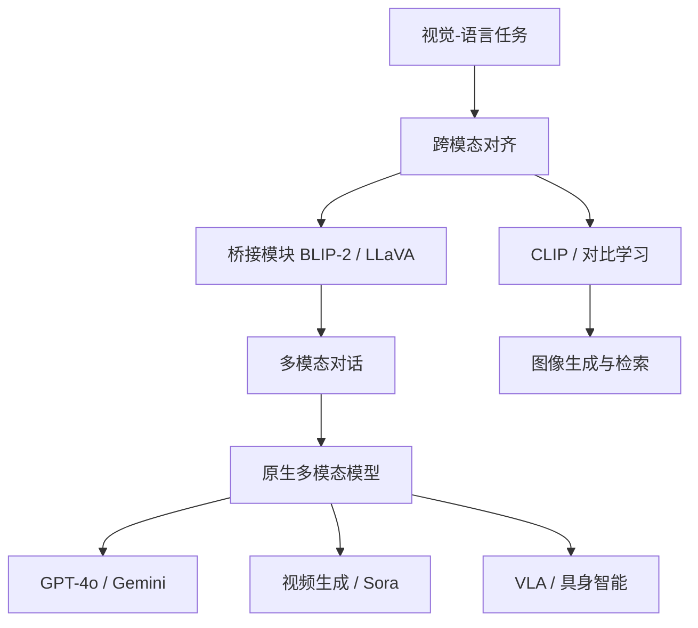

---
tags:
  - 多模态AI
  - 综述
  - 大模型时代
  - 生成模型
  - 具身智能
created: 2025-07-10
updated: 2026-07-10
---

# 多模态AI综述

## 领域定义

多模态 AI 研究的是：如何让模型同时理解、对齐、融合并生成多种信息模态，例如文本、图像、音频、视频，乃至动作。它试图把不同感知通道映射到统一语义空间，使模型不只“会说”，还能够“看、听、理解并联动生成”。

从知识体系上看，多模态 AI 处在大语言模型、计算机视觉、语音技术和生成模型的交叉位置，是通向更通用智能的重要桥梁。

## 为什么会出现

单模态模型存在明显边界：

- 语言模型擅长符号推理，但缺少真实视觉与听觉 grounding。
- 视觉模型擅长图像理解，但难以承担复杂语言推理。
- 语音和视频任务天然具有时序性和跨模态约束。

多模态 AI 的出现，本质上是在回答：如何把多种感知能力组织为统一系统，并让它们在表示、推理和生成中协同工作。

## 发展历史

| 年代 | 里程碑 | 意义 |
|------|--------|------|
| 2014 | Show and Tell / VQA | 图像描述与视觉问答奠定早期视觉-语言任务形态 |
| 2019 | ViLBERT / LXMERT | 视觉语言预训练模型兴起 |
| 2021 | CLIP / ALIGN | 对比学习成为跨模态对齐主流范式 |
| 2022 | Flamingo / BLIP / Stable Diffusion / Whisper | 理解、生成与语音方向同时突破 |
| 2023 | BLIP-2 / LLaVA / GPT-4V / Gemini | 桥接式与原生式多模态模型并进 |
| 2024 | Sora / Gemini 1.5 / GPT-4o / Chameleon / Qwen2-VL | 视频、长上下文与原生统一多模态快速发展 |

## 核心问题

多模态 AI 主要围绕以下问题展开：

1. **如何对齐不同模态**：文本、图像、音频如何映射到共享语义空间。
2. **如何融合不同模态**：是早期融合、晚期融合，还是交叉注意力融合。
3. **如何统一推理**：模型如何在视觉、语言和语音之间传递上下文。
4. **如何做条件生成**：一种模态如何驱动另一种模态的生成。
5. **如何扩展到真实系统**：如何支持实时交互、长视频理解和具身智能。

## 技术演进路线

其演进脉络可概括为：

- **先做任务拼接**：早期系统往往是 CNN/RNN/Transformer 的任务级组合。
- **再做共享表示**：CLIP 让“对齐”成为多模态建模的核心。
- **再做桥接式架构**：BLIP-2、LLaVA 让视觉特征接入 LLM。
- **最后走向原生统一模型**：GPT-4o、Gemini 一类模型开始用统一主干处理多模态输入输出。

## 重要分支

- [[01_视觉语言模型]]：图文理解、多模态对话与视觉推理的核心入口。
- [[02_图像生成]]：文生图、条件控制、采样与编辑。
- [[03_视频生成]]：时空建模、文生视频与世界模型趋势。
- [[04_语音与音频]]：ASR、TTS、实时语音交互与音频生成。
- [[05_多模态Agent]]：感知—认知—行动闭环与具身智能接口。
- [[06_统一多模态模型]]：从桥接式向原生统一模型的演进总结。

## 学习路径

1. **先理解图文对齐**：[[01_视觉语言模型]]。
2. **再分开学习生成方向**：[[02_图像生成]] + [[03_视频生成]]。
3. **补足语音链路**：[[04_语音与音频]]。
4. **进入系统层与前沿方向**：[[05_多模态Agent]] + [[06_统一多模态模型]]。

## 当前发展状态

当前多模态 AI 已经从“多模型拼装”走向“统一模型系统”：

- **桥接式架构仍然实用**：LLaVA 类架构仍是开源社区高性价比方案。
- **原生多模态模型正在成为前沿主线**：统一主干逐渐替代管线式系统。
- **视频与实时交互拉高技术门槛**：时空一致性、延迟控制和安全问题同时出现。
- **多模态开始进入具身智能**：视觉、语言与动作建模逐渐连接起来。

## 未来趋势

- **Any-to-Any 更普及**：任意模态到任意模态的统一转换会更常见。
- **实时交互成为重点**：低延迟语音、视觉和视频理解将更重要。
- **世界模型地位提升**：视频生成与物理环境模拟进一步结合。
- **多模态安全成为刚需**：Deepfake、越狱攻击和版权风险会长期存在。
- **VLA 与机器人融合加深**：多模态模型将更多走向真实环境行动系统。

## 相关方向

- [[../10_大语言模型核心架构/00_大语言模型核心架构_综述|大语言模型核心架构]]：提供语言主干与统一 token 处理能力。
- [[../08_Transformer与注意力机制/00_Transformer与注意力机制_综述|Transformer与注意力机制]]：提供跨模态融合的统一结构基础。
- [[../07_生成模型/00_生成模型_综述|生成模型]]：提供图像和视频生成的主要范式。
- [[../15_计算机视觉/00_计算机视觉_综述|计算机视觉]]：提供视觉编码、理解与空间表示能力。
- [[../16_自然语言处理/00_自然语言处理_综述|自然语言处理]]：提供语言建模与指令对齐能力。
- [[../19_LLM应用工程/04_Agent系统/00_Agent系统|Agent系统]]：让多模态感知进入任务执行闭环。

## 笔记导航

- [[01_视觉语言模型]]
- [[02_图像生成]]
- [[03_视频生成]]
- [[04_语音与音频]]
- [[05_多模态Agent]]
- [[06_统一多模态模型]]

## References

- Radford et al., *CLIP* (2021)
- Li et al., *BLIP-2* (2023)
- Liu et al., *Visual Instruction Tuning / LLaVA* (2023)
- Alayrac et al., *Flamingo* (2022)
- Rombach et al., *Stable Diffusion* (2022)
- OpenAI, *Hello GPT-4o* (2024)
- Google, Gemini 官方发布资料
- [OpenAI GPT-4o 官方页面](https://openai.com/index/hello-gpt-4o/)
