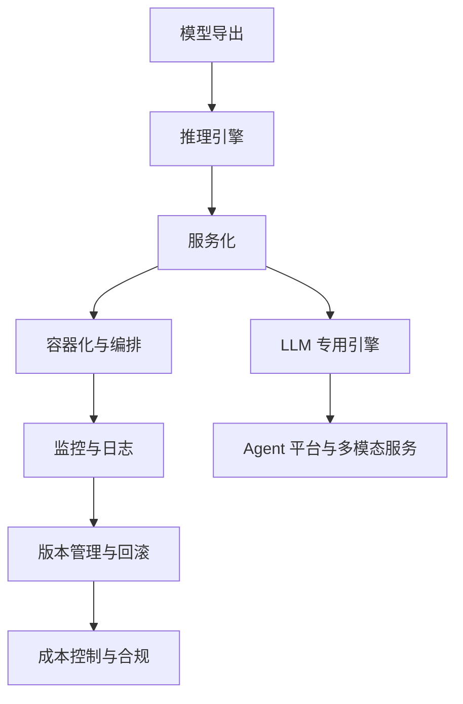

---
tags:
  - 模型部署
  - 工程化
  - MLOps
  - 综述
  - 系统工程
created: 2025-07-10
updated: 2026-07-10
---

# 模型部署与工程化综述

## 领域定义

模型部署与工程化研究的是：如何把训练完成的模型，从实验环境稳定地迁移到真实生产环境，并在可靠性、成本、性能、安全和可维护性之间建立可持续的系统能力。

它涵盖的不只是“把模型跑起来”，而是模型服务化、容器化、资源调度、监控观测、版本回滚、合规治理和数据链路等完整系统问题。

## 为什么会出现

模型从 notebook 到生产环境，会遇到一系列研究阶段很少暴露的问题：

- 模型可用，不代表系统可用。
- 离线精度高，不代表在线延迟可接受。
- 单次推理成功，不代表高并发下稳定。
- 功能可交付，不代表版本可回滚、日志可审计、成本可控制。

因此，模型部署与工程化的核心目标，是把“一个模型”变成“一个可长期运行的系统”。

## 发展历史

| 年代 | 里程碑 | 意义 |
|------|--------|------|
| 2015 | TensorFlow Serving | 通用模型服务框架开始成熟 |
| 2016 | Kubeflow | 容器化机器学习工作流进入主流 |
| 2017 | ONNX | 训练框架与部署引擎开始解耦 |
| 2018 | MLflow | 模型生命周期管理系统化 |
| 2020 | Triton / ONNX Runtime | 跨框架推理服务能力增强 |
| 2022 | vLLM / TGI | LLM 服务化基础设施快速发展 |
| 2023 | TensorRT-LLM / SGLang / Ollama | 大模型部署从研究走向工程平台 |
| 2024+ | 端侧大模型 / Agent 工程化 / Serverless LLM | 部署形态更加多样化 |

## 核心问题

模型部署与工程化主要回答以下问题：

1. **模型如何服务化**：模型如何作为 API、批处理任务或流式服务提供能力。
2. **系统如何扩展**：高并发、多模型路由、弹性扩缩容如何实现。
3. **性能如何优化**：延迟、吞吐、显存、GPU 利用率如何平衡。
4. **风险如何控制**：日志、监控、审计、回滚和合规如何建立。
5. **生命周期如何管理**：从模型导出到版本升级再到退役如何形成闭环。

## 技术演进路线

整体可分为四层：

- **模型层**：导出、优化、格式转换。
- **推理层**：引擎选择、并行策略、硬件适配。
- **服务层**：API、流式输出、负载均衡、网关。
- **运维层**：观测、回滚、成本、安全、治理。

## 重要分支

- [[01_模型服务化]]：如何把模型能力暴露为稳定服务。
- [[02_API设计与治理]]：接口、限流、鉴权、版本治理。
- [[03_云端与本地部署]]：不同部署环境的权衡。
- [[04_容器化与Docker]]：环境标准化与基础镜像管理。
- [[05_监控与日志]]：系统可观测性与故障诊断。
- [[06_版本管理与回滚]]：模型生命周期管理。
- [[07_成本控制与配额]]：预算、资源利用与服务配额。
- [[08_数据隐私与合规]]：法规、安全与治理问题。
- [[09_ONNX模型导出/00_ONNX模型导出|ONNX模型导出]]：跨框架模型交换与部署衔接。
- [[10_硬件加速]]：GPU/TPU/NPU 和 Kernel 优化。
- [[11_数据工程]]：为模型提供稳定的数据链路与特征支持。

## 学习路径

1. **先理解服务入口**：[[01_模型服务化]] + [[02_API设计与治理]]。
2. **再理解环境承载**：[[03_云端与本地部署]] + [[04_容器化与Docker]]。
3. **进入系统运维闭环**：[[05_监控与日志]] + [[06_版本管理与回滚]]。
4. **最后看现实约束**：[[07_成本控制与配额]] + [[08_数据隐私与合规]] + [[10_硬件加速]]。

## 当前发展状态

当前工程化趋势非常明确：

- **大模型让部署问题系统化升级**：推理引擎、缓存、GPU 调度成为一等公民。
- **服务化平台越来越专用化**：LLM 已经不再适合完全套用传统 Web 服务思维。
- **观测与成本管理比“能跑起来”更重要**：生产环境真正的瓶颈往往不在模型，而在系统治理。
- **端侧与云侧双线发展**：一边是高并发 API 服务，一边是本地与边缘部署。

## 未来趋势

- **Serverless LLM 会更普及**：按请求弹性伸缩成为常见形态。
- **部署与推理优化深度融合**：服务平台会原生理解 KV-Cache、量化和并行策略。
- **多模态部署需求上升**：文本、图像、音频统一服务将更常见。
- **Agent 平台化更明显**：部署对象不再只是模型，也包括工作流与工具生态。
- **绿色 AI 与合规约束加强**：能耗、隐私和审计会越来越重要。

## 相关方向

- [[../12_大模型推理与优化/00_大模型推理与优化_综述|大模型推理与优化]]：是部署性能优化的技术基础。
- [[../11_大模型训练与对齐/00_大模型训练与对齐_综述|大模型训练与对齐]]：决定可部署模型的训练与微调来源。
- [[../19_LLM应用工程/00_LLM应用工程_综述|LLM应用工程]]：决定上层产品如何消费推理服务。
- [[../17_AI安全与对齐/00_AI安全与对齐_综述|AI安全与对齐]]：决定部署后的审计、风控与合规约束。
- [[09_ONNX模型导出/00_ONNX模型导出|ONNX模型导出]]：是训练到部署的中间桥梁之一。

## 笔记导航

- [[01_模型服务化]]
- [[02_API设计与治理]]
- [[03_云端与本地部署]]
- [[04_容器化与Docker]]
- [[05_监控与日志]]
- [[06_版本管理与回滚]]
- [[07_成本控制与配额]]
- [[08_数据隐私与合规]]
- [[09_ONNX模型导出/00_ONNX模型导出|ONNX模型导出]]
- [[10_硬件加速]]
- [[11_数据工程]]

## References

- [vLLM 官方文档](https://docs.vllm.ai/)
- [ONNX 官方文档](https://onnx.ai/)
- [ONNX Runtime 官方文档](https://onnxruntime.ai/)
- [Kubeflow 官方文档](https://www.kubeflow.org/)
- [MLflow 官方文档](https://mlflow.org/)
- Chip Huyen, *Designing Machine Learning Systems*
- Google SRE Book
