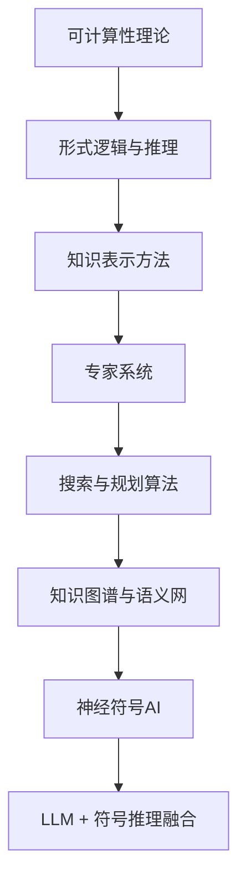

---
tags:
  - 符号AI
  - 知识表示
  - 早期理论
  - 综述
created: 2025-07-14
updated: 2025-07-14
---

# 符号AI与知识表示综述

## 领域定义

符号AI（Symbolic AI）是人工智能最早的研究范式，也被称为"老派AI"（GOFAI, Good Old-Fashioned AI）。其核心思想是：**智能可以通过对符号的操纵和推理来实现**——将世界知识表示为符号结构，通过形式化规则进行逻辑推理、搜索和规划。

符号AI涵盖了从计算理论基础（可计算性、自动机）、形式逻辑与推理、知识表示方法（本体、框架、语义网络）、专家系统、搜索算法到规划算法的完整知识体系。这些内容是理解AI发展历史的根基，也是现代知识图谱、自动推理和神经符号AI的基础。

## 为什么会出现

符号AI的出现源于一个根本假设：人类智能的本质是对符号的操作，因此机器智能也可以通过符号处理来实现。

在AI诞生之初，研究者面临的核心问题是：如何将人类知识形式化为机器可处理的结构，并在此基础上进行自动推理和决策。符号AI提供了可解释、可验证的推理框架，这在早期计算资源极度有限的时代是最可行的路线。

在深度学习时代，符号方法与神经网络的融合（神经符号AI）重新成为重要趋势——因为纯神经网络在逻辑推理、因果推断和可解释性方面仍存在明显短板。

## 核心问题

符号AI主要围绕以下问题展开：

1. **如何形式化表示知识**：用逻辑、框架、本体等方法将世界知识编码为机器可操作的结构。
2. **如何进行自动推理**：在形式化知识的基础上，实现可靠的演绎、归纳和溯因推理。
3. **如何高效搜索解空间**：在组合爆炸的搜索空间中，利用启发式方法找到可行解。
4. **如何规划行动序列**：给定初始状态、目标和操作约束，自动生成可行的行动方案。
5. **如何与神经网络融合**：在深度学习中注入符号推理能力，弥补神经网络的推理短板。

## 发展历史

| 年代 | 里程碑 | 作者 | 核心意义 |
|:---|:---|:---|:---|
| 1936 | 图灵机 | Turing | 可计算性理论的数学基础 |
| 1936 | λ演算 | Church | 与图灵机等价的计算模型 |
| 1931 | 哥德尔不完全性定理 | Gödel | 形式系统的根本局限 |
| 1943 | McCulloch-Pitts神经元 | McCulloch & Pitts | 将逻辑引入神经元模型 |
| 1956 | 达特茅斯会议 | McCarthy等 | AI学科诞生 |
| 1958 | Advice Taker | McCarthy | 自动推理的早期构想 |
| 1965 | DENDRAL | Feigenbaum等 | 首个专家系统 |
| 1968 | A*算法 | Hart, Nilsson & Raphael | 启发式搜索里程碑 |
| 1969 | SHAKEY机器人 | Nilsson | 集成感知与规划 |
| 1971 | STRIPS | Fikes & Nilsson | 规划语言奠基 |
| 1977 | MYCIN | Shortliffe | 医疗诊断专家系统 |
| 1980s | 专家系统黄金时代 | 多家 | XCON等商业应用 |
| 1993 | 本体定义 | Gruber | 知识工程形式化 |
| 2001 | 语义网愿景 | Berners-Lee | Web上的知识表示 |
| 2012 | Knowledge Graph | Google | 大规模知识图谱应用 |
| 2020s | 神经符号AI | 多家 | 深度学习与符号推理融合 |

## 核心概念

### 3.1 可计算性与计算复杂度

图灵机是计算的理论模型，**可计算性理论**界定了"什么是可计算的"。停机问题（Halting Problem）证明了存在不可计算的问题。计算复杂度理论（P/NP/NP-hard/NP-complete）刻画了问题的求解难度，是算法设计与分析的基础。参见 [[01_自动机与可计算性]]。

### 3.2 形式逻辑

形式逻辑是符号AI的推理基础，包括：
- **命题逻辑**（Propositional Logic）：最简单的逻辑系统，处理真值
- **谓词逻辑**（Predicate Logic / 一阶逻辑 FOL）：引入量词和谓词，表达能力更强
- **归结原理**（Resolution）：机械化的推理方法，是Prolog等语言的基础

参见 [[02_形式逻辑与推理]]。

### 3.3 知识表示

将世界知识编码为机器可操作的结构，主要方法包括：
- **逻辑表示**：一阶逻辑、描述逻辑
- **框架**（Frames）：面向对象的知识表示
- **语义网络**（Semantic Networks）：图结构的知识表示
- **本体**（Ontology）：形式化的概念体系

参见 [[03_知识表示方法]]。

### 3.4 专家系统

利用预先编码的规则（IF-THEN）和知识库进行特定领域推理的系统。专家系统由知识库、推理引擎和用户接口组成，是符号AI的标志性应用。参见 [[04_专家系统]]。

### 3.5 搜索

在状态空间中寻找从初始状态到目标状态的解路径。核心算法包括无信息搜索（BFS/DFS）和启发式搜索（A*/IDA*）。搜索是AI通用的问题求解框架。参见 [[05_搜索算法]]。

### 3.6 规划

给定初始状态、目标状态和一组操作，自动生成行动序列。规划是搜索的特化——状态空间由操作的前件和效果定义。参见 [[06_规划算法]]。

### 3.7 知识图谱

将实体、关系和属性组织为大规模图结构的知识库，是符号AI在工业界最成功的应用之一。现代知识图谱构建涉及信息抽取、实体对齐、知识推理等技术。参见 [[07_知识图谱与语义网]]。

## 技术演进路线

符号AI的演进脉络：从计算理论奠基（图灵机/自动机）→ 形式推理系统建立 → 知识工程与专家系统产业化 → 因知识获取瓶颈陷入低谷 → 以知识图谱形式在工业界重新崛起 → 当前与深度学习融合形成神经符号AI新方向。

## 重要分支

本方向的知识体系按以下主线组织：计算理论 → 形式逻辑与推理 → 知识表示方法 → 专家系统 → 搜索算法 → 规划算法 → 知识图谱与语义网。每条主线对应一个核心笔记。

## 当前发展状态

- **知识图谱已进入工业主流**：Google Knowledge Graph、Wikidata、企业知识图谱在搜索、推荐、问答等场景广泛应用。
- **神经符号AI成为活跃研究方向**：将LLM的语言理解能力与符号系统的精确推理结合，是当前最受关注的前沿。
- **规划与搜索在Agent系统中复苏**：ReAct、Tree-of-Thoughts等LLM推理范式本质上借鉴了符号AI的搜索与规划思想。
- **形式化验证在AI安全中需求上升**：随着LLM部署范围扩大，可解释、可验证的推理方法愈发重要。

## 未来趋势

- **神经符号融合加深**：LLM作为"系统1"直觉，符号推理作为"系统2"精确验证，双系统协同。
- **知识图谱与大模型双向增强**：知识图谱提供事实性基础，LLM提供语义理解与知识补全。
- **可微分推理**：将逻辑推理过程可微分化，使符号推理能参与端到端训练。
- **Agent推理内核**：搜索、规划、逻辑推理成为Agent系统的底层推理基础设施。

## 学习路径

1. **先建立理论基础**：[[01_自动机与可计算性]] — 理解"什么是可计算的"。
2. **再掌握推理工具**：[[02_形式逻辑与推理]] — 命题逻辑、谓词逻辑、归结原理。
3. **理解知识如何表示**：[[03_知识表示方法]] + [[07_知识图谱与语义网]]。
4. **学习问题求解方法**：[[05_搜索算法]] + [[06_规划算法]]。
5. **了解经典应用**：[[04_专家系统]] — 理解符号AI的工程实践与局限。

## 相关方向

- **数学基础**：形式逻辑是数学基础中数理逻辑的延伸；计算复杂度理论依赖离散数学。参见 [[../01_数学基础/00_数学基础_综述|数学基础]]。
- **强化学习**：搜索与规划是强化学习的理论基础——MDP可视为带不确定性的规划问题；MCTS是搜索与RL的结合。参见 [[../13_强化学习/00_强化学习_综述|强化学习]]。
- **自然语言处理**：知识图谱与NLP深度交叉——信息抽取构建知识图谱，知识图谱增强NLP推理。参见 [[../16_自然语言处理/00_自然语言处理_综述|自然语言处理]]。
- **大语言模型核心架构**：LLM的推理能力与符号推理互补；神经符号AI将LLM的语言理解与符号系统的精确推理结合。参见 [[../10_大语言模型核心架构/00_大语言模型核心架构_综述|大语言模型核心架构]]。
- **AI安全与对齐**：形式化验证和可解释推理是安全AI的重要工具。参见 [[../17_AI安全与对齐/00_AI安全与对齐_综述|AI安全与对齐]]。

## 笔记导航

- [[01_自动机与可计算性]] — 图灵机、可计算性、停机问题、复杂度类P/NP
- [[02_形式逻辑与推理]] — 命题逻辑、谓词逻辑、一阶逻辑、归结原理
- [[03_知识表示方法]] — 框架、语义网络、本体、产生式规则
- [[04_专家系统]] — 知识获取、规则引擎、推理机制、MYCIN/DENDRAL
- [[05_搜索算法]] — DFS/BFS、A*、IDA*、启发式函数
- [[06_规划算法]] — STRIPS、PDDL、部分顺序规划、MCTS
- [[07_知识图谱与语义网]] — RDF/OWL、SPARQL、知识抽取、Google Knowledge Graph

## References

### 经典教材
- Russell & Norvig, *Artificial Intelligence: A Modern Approach* (AIMA) — AI 圣经，第3/7章覆盖搜索与知识表示
- Hopcroft, Motwani & Ullman, *Introduction to Automata Theory, Languages, and Computation* — 自动机理论经典
- Genesereth & Nilsson, *Logical Foundations of Artificial Intelligence* — 逻辑AI基础

### 核心论文
- McCarthy et al., *A Proposal for the Dartmouth Summer Research Project on Artificial Intelligence* (1955)
- Newell & Simon, *The Logic Theory Machine* (1956)
- Hart, Nilsson & Raphael, *A Formal Basis for the Heuristic Determination of Minimum Cost Paths* (1968) — A* 算法
- Fikes & Nilsson, *STRIPS: A New Approach to the Application of Theorem Proving to Problem Solving* (1971)

### 实践任务
1. 实现A*算法解决八数码/迷宫问题
2. 用Prolog构建简单推理引擎
3. 使用Protégé构建领域本体
4. 用PDDL描述Block World问题并调用FastDownward规划器
