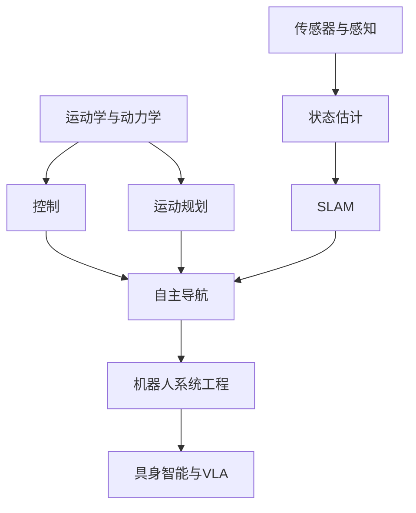

---
tags:
  - 机器人学
  - 具身智能
  - 综述
  - 工程系统
created: 2025-07-14
updated: 2026-07-10
---

# 机器人学综述

## 领域定义

机器人学（Robotics）研究的是：如何让机器在物理世界中感知环境、理解状态、规划行为并执行动作。它不是单一学科，而是人工智能、控制理论、机械工程、计算机视觉、传感器系统和软件工程的交叉系统。

与只处理数字信息的 AI 系统不同，机器人必须面对真实世界中的噪声、不确定性、延迟、碰撞约束和硬件限制，因此机器人学天然强调“感知—决策—行动”的闭环。

## 为什么会出现

机器人学之所以重要，是因为它试图回答一个更具现实约束的问题：

- 模型不只要“会想”，还要“能动”。
- 系统不只要“会预测”，还要“能在物理世界中安全执行”。
- 智能不只体现在语言和图像上，还体现在与环境持续交互的能力上。

因此，机器人学是 AI 从虚拟任务走向具身智能（Embodied Intelligence）的关键桥梁。

## 发展历史

| 年代 | 里程碑 | 核心意义 |
|------|--------|----------|
| 1948 | 早期行为机器人 | 机器人控制与反馈思想萌芽 |
| 1961 | Unimate | 工业机器人进入真实生产场景 |
| 1966 | SHAKEY | 感知、搜索、规划首次系统集成 |
| 1969 | 斯坦福机械臂 | 机械臂研究成为经典范式 |
| 1980s | 行为主义机器人学 | 强调实时反应与分层控制 |
| 1990s-2000s | SLAM、移动机器人、自主导航快速发展 | 感知与定位能力成为核心 |
| 2005 | DARPA Grand Challenge | 自动驾驶与复杂系统集成里程碑 |
| 2010s | 深度学习进入机器人感知 | 视觉理解和策略学习能力增强 |
| 2020s | VLA / 具身智能 | 大模型、多模态模型与机器人控制开始深度结合 |

## 核心问题

机器人学围绕五类问题展开：

1. **机器人怎么表示自身与环境**：状态估计、坐标系、地图、传感器建模。
2. **机器人怎么运动**：正逆运动学、动力学建模、执行器控制。
3. **机器人怎么感知**：视觉、激光雷达、IMU、触觉及多传感器融合。
4. **机器人怎么规划**：路径规划、轨迹优化、任务规划、避障。
5. **机器人怎么闭环运行**：控制器、ROS、中间件、仿真、现实部署与安全。

## 技术演进路线

机器人技术主线可以概括为：

- **第一层**：理解机器人如何运动，即运动学与动力学。
- **第二层**：理解机器人如何感知世界，即传感器、估计与 SLAM。
- **第三层**：理解机器人如何完成任务，即路径规划、轨迹规划与控制。
- **第四层**：理解机器人如何作为系统运行，即 ROS、仿真、部署与调试。
- **第五层**：理解机器人如何获得更通用的智能，即强化学习、多模态模型与具身智能。

## 重要分支

### 1. 运动学与动力学
- [[01_运动学与动力学]]：回答“机器人身体怎么动”，是机械臂、移动机器人和控制的基础。

### 2. 传感器与感知
- [[02_传感器与感知]]：回答“机器人怎么看、怎么测、怎么估计状态”。

### 3. 运动规划
- [[03_运动规划]]：回答“机器人如何在约束下找到从起点到目标的可执行路径/轨迹”。

### 4. SLAM
- [[04_SLAM同步定位与地图构建]]：回答“机器人如何一边定位自己、一边理解环境”。

### 5. 控制与系统工程
- [[05_机器人控制与ROS]]：回答“机器人如何形成稳定、可调试、可扩展的执行系统”。

## 学习路径

1. **先打身体基础**：[[01_运动学与动力学]]。
2. **再建立环境感知能力**：[[02_传感器与感知]]。
3. **进入行动规划**：[[03_运动规划]]。
4. **补全空间理解闭环**：[[04_SLAM同步定位与地图构建]]。
5. **最后落到控制与工程系统**：[[05_机器人控制与ROS]]。

如果未来转向具身智能，可以在此基础上继续连接：
- [[../13_强化学习/00_强化学习_综述|强化学习]]
- [[../14_多模态AI/00_多模态AI|多模态AI]]
- [[../19_LLM应用工程/04_Agent系统/00_Agent系统|Agent系统]]

## 当前发展状态

当前机器人学呈现出三个显著特征：

- **传统机器人学仍是主干**：运动学、规划、控制、SLAM 仍是工程可落地系统的基础。
- **深度学习显著增强感知模块**：视觉感知、语义建图、学习控制能力持续提升。
- **具身智能成为新前沿**：机器人开始从“专用控制系统”走向“感知—语言—行动”统一系统。

换句话说，机器人学并没有被大模型替代，而是在被重新组织：底层仍是经典建模与控制，上层则开始接入学习型、多模态、Agent 化能力。

## 未来趋势

- **VLA（Vision-Language-Action）成为关键方向**：语言、多模态感知和动作策略逐步统一。
- **仿真到现实迁移更重要**：如何缩小 sim-to-real gap 仍是核心难点。
- **多机器人协作增强**：单体智能逐渐扩展到群体系统与任务协同。
- **世界模型与长期规划结合**：机器人不只要即时反应，还要具备长期任务理解能力。
- **安全与可解释控制更重要**：机器人进入现实环境后，可靠性与可审计性比离线指标更关键。

## 相关方向

- [[../13_强化学习/00_强化学习_综述|强化学习]]：策略学习、探索与控制的重要理论基础。
- [[../22_符号AI与知识表示/05_搜索算法|搜索算法]] 与 [[../22_符号AI与知识表示/06_规划算法|规划算法]]：为任务规划与路径搜索提供经典方法。
- [[../15_计算机视觉/00_计算机视觉_综述|计算机视觉]]：为机器人感知、识别和视觉 SLAM 提供基础能力。
- [[../14_多模态AI/00_多模态AI|多模态AI]]：推动机器人从单纯感知系统走向具身智能系统。
- [[../17_AI安全与对齐/00_AI安全与对齐_综述|AI安全与对齐]]：与机器人安全执行、可解释决策和价值约束高度相关。

## 笔记导航

- [[01_运动学与动力学]]
- [[02_传感器与感知]]
- [[03_运动规划]]
- [[04_SLAM同步定位与地图构建]]
- [[05_机器人控制与ROS]]

## References

- Craig, *Introduction to Robotics: Mechanics and Control*
- Siciliano et al., *Robotics: Modelling, Planning and Control*
- Thrun, Burgard, Fox, *Probabilistic Robotics*
- Lynch, Park, *Modern Robotics*
- Brooks, *A Robust Layered Control System for a Mobile Robot*
- Mur-Artal et al., *ORB-SLAM*
- Google DeepMind / RT-2 相关论文
- OpenVLA 相关技术报告
