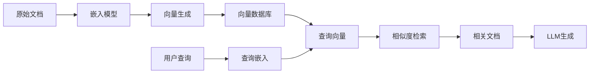

# 向量数据库：RAG系统的核心存储引擎

## 概述与核心价值

**向量数据库（Vector Database）** 是专门为存储、索引和检索高维向量数据而设计的数据库系统。在[[RAG系统]]中，向量数据库承担着**语义知识库**的核心角色，将文档的语义表示（向量嵌入）高效存储并提供相似度检索能力。

### 向量数据库在RAG中的定位

> [!note] 为什么RAG需要向量数据库？
> 传统数据库无法有效处理高维向量相似度检索，而向量数据库提供了：
> 1. **语义检索能力**：基于向量相似度的语义匹配
> 2. **高效索引结构**：支持大规模向量快速检索
> 3. **混合查询支持**：向量+元数据+关键词的联合查询
> 4. **实时更新能力**：支持增量索引和动态更新

### RAG中的数据流与向量数据库角色



## 核心功能模块

### 1. 向量索引算法

向量索引是向量数据库性能的核心，决定了检索的速度和精度。

#### 主流索引算法对比

| 算法 | 原理 | 优点 | 缺点 | 适用场景 |
|------|------|------|------|----------|
| **[[HNSW]]**（Hierarchical Navigable Small World） | 分层可导航小世界图 | 高召回率，速度快 | 内存占用高 | 高精度检索，中小规模 |
| **IVF**（Inverted File） | 倒排索引 + 聚类 | 内存效率高 | 需要训练聚类中心 | 大规模数据，批量检索 |
| **PQ**（Product Quantization） | 向量量化压缩 | 内存占用极低 | 精度有损失 | 超大规模，内存受限 |
| **LSH**（Locality Sensitive Hashing） | 局部敏感哈希 | 速度快，可扩展 | 精度较低 | 近似检索，去重任务 |
| **Flat**（暴力搜索） | 全量计算相似度 | 100%召回率 | 速度慢 | 小规模数据，精度优先 |

#### HNSW索引参数调优
```python
# HNSW索引配置示例
hnsw_config = {
    "M": 16,           # 每个节点的最大连接数（影响精度和内存）
    "efConstruction": 200,  # 构建时的动态候选列表大小
    "efSearch": 100,   # 搜索时的动态候选列表大小
    "metric": "cosine", # 相似度度量：cosine/L2/ip
    "max_elements": 1000000  # 最大元素数量
}

# 参数选择建议：
# - 数据量 < 100万：M=16, efConstruction=200
# - 数据量 100万-1000万：M=32, efConstruction=400  
# - 数据量 > 1000万：考虑IVF_PQ组合索引
```

#### IVF索引配置
```python
# IVF索引配置示例
ivf_config = {
    "nlist": 1024,     # 聚类中心数量（通常为sqrt(N)）
    "nprobe": 16,      # 搜索时探查的聚类数量
    "metric": "L2",    # 相似度度量
    "quantizer": "Flat"  # 量化器类型
}

# IVF_PQ组合索引（内存优化）
ivf_pq_config = {
    "nlist": 4096,
    "m": 8,            # 子向量数量（通常为维度/4）
    "nbits": 8,        # 每个子向量的编码位数
    "nprobe": 32
}
```

### 2. 相似度度量（Similarity Metrics）

相似度度量决定了向量间"距离"的计算方式，直接影响检索结果的相关性。

#### 常用度量方法

| 度量 | 公式 | 特点 | 适用场景 |
|------|------|------|----------|
| **余弦相似度** | cos(θ) = A·B / (‖A‖‖B‖) | 方向敏感，长度不变 | 文本嵌入，语义相似度 |
| **L2距离（欧氏）** | d = √Σ(Aᵢ - Bᵢ)² | 绝对距离，各向同性 | 图像特征，物理距离 |
| **内积（点积）** | A·B = ΣAᵢBᵢ | 计算简单，未归一化 | 快速检索，预归一化向量 |
| **曼哈顿距离** | d = Σ\|Aᵢ - Bᵢ\| | 网格距离，稳健 | 分类特征，异常检测 |

#### 度量选择指南
```python
def select_similarity_metric(embedding_type: str, use_case: str) -> str:
    """根据嵌入类型和用例选择相似度度量"""
    if embedding_type == "text":
        # 文本嵌入通常使用余弦相似度
        if use_case == "semantic_search":
            return "cosine"
        elif use_case == "fast_retrieval":
            return "ip"  # 内积（如果向量已归一化）
    elif embedding_type == "image":
        # 图像特征通常使用L2距离
        return "L2"
    elif embedding_type == "multimodal":
        # 多模态嵌入需要实验确定
        return "cosine"  # 默认选择
    
    return "cosine"  # 默认选择
```

### 3. 元数据过滤（Metadata Filtering）

元数据过滤允许在向量检索的基础上添加结构化查询条件，实现混合搜索。

#### 过滤操作类型
```python
# 元数据过滤操作示例
filter_conditions = {
    # 等值过滤
    "category": {"$eq": "technology"},
    
    # 范围过滤
    "created_at": {"$gte": "2024-01-01", "$lte": "2024-12-31"},
    
    # 包含过滤
    "tags": {"$contains": "AI"},
    
    # 多条件组合
    "$and": [
        {"category": {"$eq": "technology"}},
        {"views": {"$gt": 1000}},
        {"language": {"$in": ["zh", "en"]}}
    ],
    
    # 地理空间过滤
    "location": {
        "$within": {
            "center": [116.4074, 39.9042],  # 北京坐标
            "radius": 10000  # 10公里半径
        }
    }
}
```

#### 混合搜索实现
```python
def hybrid_search(query_vector, filter_conditions, top_k=10):
    """混合搜索：向量相似度 + 元数据过滤"""
    # 1. 基于向量相似度的初步检索
    candidate_results = vector_index.similarity_search(
        query_vector, 
        k=top_k * 5  # 检索更多候选结果
    )
    
    # 2. 应用元数据过滤
    filtered_results = []
    for result in candidate_results:
        if evaluate_filter_conditions(result.metadata, filter_conditions):
            filtered_results.append(result)
    
    # 3. 重新排序（基于原始相似度分数）
    filtered_results.sort(key=lambda x: x.score, reverse=True)
    
    return filtered_results[:top_k]
```

### 4. 持久化与分布式架构

#### 数据持久化策略
```python
# 向量数据库持久化配置
persistence_config = {
    "storage_type": "local_disk",  # 或 "cloud_object_storage"
    "data_path": "/data/vector_db",
    "wal_enabled": True,           # 预写日志，保证数据安全
    "flush_interval": 60,          # 刷盘间隔（秒）
    "snapshot_interval": 3600,     # 快照间隔（秒）
    "backup_strategy": {
        "type": "incremental",
        "schedule": "daily",
        "retention_days": 30
    }
}
```

#### 分布式架构模式
```python
# 分布式向量数据库架构
distributed_config = {
    "cluster_mode": "sharding",  # 分片模式
    "sharding_strategy": "modulo",  # 取模分片
    "replication_factor": 3,     # 副本因子
    "consistency_level": "quorum",  # 一致性级别
    
    # 节点配置
    "nodes": [
        {"id": "node1", "role": "coordinator", "shards": [0, 1]},
        {"id": "node2", "role": "worker", "shards": [2, 3]},
        {"id": "node3", "role": "worker", "shards": [4, 5]}
    ],
    
    # 负载均衡
    "load_balancer": {
        "strategy": "round_robin",
        "health_check_interval": 30
    }
}
```

## 主流方案对比

### 开源方案

#### 1. [[Milvus]]
**架构特点**：云原生，组件化设计，支持多种索引算法

```python
# Milvus集合（Collection）配置示例
from pymilvus import CollectionSchema, FieldSchema, DataType

# 定义字段
fields = [
    FieldSchema(name="id", dtype=DataType.INT64, is_primary=True),
    FieldSchema(name="embedding", dtype=DataType.FLOAT_VECTOR, dim=768),
    FieldSchema(name="title", dtype=DataType.VARCHAR, max_length=256),
    FieldSchema(name="content", dtype=DataType.VARCHAR, max_length=65535),
    FieldSchema(name="category", dtype=DataType.VARCHAR, max_length=64),
    FieldSchema(name="created_at", dtype=DataType.INT64),
]

# 创建集合schema
schema = CollectionSchema(fields, description="RAG文档集合")

# 索引配置
index_params = {
    "metric_type": "COSINE",
    "index_type": "IVF_FLAT",
    "params": {"nlist": 1024}
}
```

**适用场景**：
- 大规模生产环境（千万级以上向量）
- 需要高可用和水平扩展
- 复杂查询需求（混合搜索、时间旅行）

**性能特点**：
- 吞吐量：10K-100K QPS（取决于配置）
- 延迟：<10ms（内存索引）
- 最大数据量：PB级

#### 2. [[Weaviate]]
**架构特点**：图数据库集成，模块化设计，支持多模态

```python
# Weaviate模式定义
weaviate_schema = {
    "classes": [{
        "class": "Document",
        "properties": [
            {"name": "title", "dataType": ["text"]},
            {"name": "content", "dataType": ["text"]},
            {"name": "embedding", "dataType": ["number[]"]},
            {"name": "category", "dataType": ["text"]},
            {"name": "relatedTo", "dataType": ["Document"]}  # 图关系
        ],
        "vectorizer": "text2vec-openai",  # 或自定义
        "moduleConfig": {
            "text2vec-openai": {
                "model": "text-embedding-ada-002",
                "type": "text"
            }
        }
    }]
}
```

**适用场景**：
- 知识图谱与向量检索结合
- 多模态数据（文本、图像、音频）
- 需要复杂关系查询

#### 3. [[Qdrant]]
**架构特点**：Rust实现，性能优秀，API友好

```python
# Qdrant集合配置
qdrant_config = {
    "vectors": {
        "size": 768,
        "distance": "Cosine"
    },
    "shard_number": 3,  # 分片数量
    "replication_factor": 2,
    "write_consistency_factor": 1,
    
    # 优化配置
    "optimizers_config": {
        "default_segment_number": 2,
        "max_segment_size": 50000,
        "memmap_threshold": 20000
    }
}

# 带过滤的搜索
search_params = {
    "vector": query_vector,
    "limit": 10,
    "filter": {
        "must": [
            {"key": "category", "match": {"value": "technology"}},
            {"key": "language", "match": {"value": "zh"}}
        ]
    }
}
```

**适用场景**：
- 高性能要求的生产环境
- 需要精细控制内存和磁盘使用
- 实时更新和流式处理

#### 4. [[Chroma]]
**架构特点**：轻量级，易用性好，Python原生

```python
# Chroma快速入门
import chromadb

# 创建客户端
client = chromadb.Client()

# 创建集合
collection = client.create_collection(
    name="rag_documents",
    metadata={"hnsw:space": "cosine"}  # 使用HNSW索引
)

# 添加文档
collection.add(
    documents=["文档内容1", "文档内容2"],
    metadatas=[{"source": "doc1"}, {"source": "doc2"}],
    embeddings=[[0.1, 0.2, ...], [0.3, 0.4, ...]],
    ids=["id1", "id2"]
)
```

**适用场景**：
- 快速原型开发
- 小到中等规模数据（<100万向量）
- 开发测试环境

#### 5. [[FAISS]]（Facebook AI Similarity Search）
**架构特点**：算法库而非数据库，灵活性强

```python
# FAISS索引构建
import faiss

# 创建索引
dimension = 768
index = faiss.IndexFlatIP(dimension)  # 内积索引

# 或使用更高级的索引
quantizer = faiss.IndexFlatL2(dimension)
index = faiss.IndexIVFFlat(quantizer, dimension, 100)  # 100个聚类中心
index.train(vectors)  # 需要训练

# 添加向量
index.add(vectors)

# 搜索
distances, indices = index.search(query_vector, k=10)
```

**适用场景**：
- 研究项目，需要最大灵活性
- 已有存储系统，仅需检索功能
- 需要定制化索引算法

### 商业方案

#### [[Pinecone]]
**特点**：全托管服务，易用性高，自动扩缩容

**优势**：
- 零运维，自动管理索引和基础设施
- 实时更新，支持流式写入
- 内置缓存和CDN优化

**适用场景**：
- 快速产品上线，无运维团队
- 需要弹性伸缩的业务
- 对延迟和可用性要求高

**定价模型**：基于存储量、查询次数和Pod规格

### 方案选择矩阵

| 需求维度 | 推荐方案 | 理由 |
|----------|----------|------|
| **大规模生产** | Milvus/Qdrant | 分布式架构，高可用 |
| **快速原型** | Chroma | 易用性好，快速上手 |
| **知识图谱** | Weaviate | 图数据库集成 |
| **全托管服务** | Pinecone | 零运维，自动管理 |
| **研究定制** | FAISS | 算法灵活，可定制 |
| **高性能要求** | Qdrant | Rust实现，性能优秀 |
| **多模态支持** | Weaviate/Milvus | 多模态向量支持 |

## RAG场景下的集成模式

### 典型集成流程

```python
# RAG中向量数据库的完整集成流程
class RAGVectorDBIntegration:
    def __init__(self, embedding_model, vector_db):
        self.embedding_model = embedding_model
        self.vector_db = vector_db
    
    def index_documents(self, documents: List[Dict]):
        """文档索引流程"""
        indexed_docs = []
        
        for doc in documents:
            # 1. 生成嵌入
            embedding = self.embedding_model.encode(doc["content"])
            
            # 2. 准备元数据
            metadata = {
                "title": doc.get("title", ""),
                "source": doc.get("source", ""),
                "chunk_id": doc.get("chunk_id", 0),
                "created_at": int(time.time()),
                "language": self.detect_language(doc["content"])
            }
            
            # 3. 插入向量数据库
            vector_id = self.vector_db.insert(
                vector=embedding,
                metadata=metadata,
                id=doc["id"]
            )
            
            indexed_docs.append({
                "id": vector_id,
                "metadata": metadata
            })
        
        return indexed_docs
    
    def retrieve_for_rag(self, query: str, top_k: int = 5, filters: Dict = None):
        """RAG检索流程"""
        # 1. 查询嵌入
        query_embedding = self.embedding_model.encode(query)
        
        # 2. 向量检索（带过滤）
        results = self.vector_db.search(
            query_vector=query_embedding,
            top_k=top_k * 2,  # 检索更多用于重排
            filter_conditions=filters
        )
        
        # 3. 重排序（可选）
        if self.reranker:
            results = self.reranker.rerank(query, results)
        
        # 4. 返回top-k结果
        return results[:top_k]
```

### 批量vs流式写入

#### 批量写入优化
```python
def batch_insert_optimized(vectors, batch_size=1000):
    """批量写入优化"""
    total = len(vectors)
    inserted = 0
    
    for i in range(0, total, batch_size):
        batch = vectors[i:i+batch_size]
        
        # 批量插入
        self.vector_db.insert_batch(batch)
        
        # 定期刷新索引
        if (i // batch_size) % 10 == 0:
            self.vector_db.flush_index()
        
        inserted += len(batch)
        print(f"已插入 {inserted}/{total} 个向量")
    
    # 最终索引构建
    self.vector_db.build_index()
```

#### 流式写入处理
```python
class StreamingVectorWriter:
    def __init__(self, vector_db, buffer_size=100):
        self.vector_db = vector_db
        self.buffer = []
        self.buffer_size = buffer_size
    
    def write_stream(self, vector_stream):
        """处理流式向量写入"""
        for vector_data in vector_stream:
            self.buffer.append(vector_data)
            
            # 缓冲区满时批量写入
            if len(self.buffer) >= self.buffer_size:
                self.flush_buffer()
        
        # 处理剩余数据
        if self.buffer:
            self.flush_buffer()
    
    def flush_buffer(self):
        """刷新缓冲区到向量数据库"""
        if not self.buffer:
            return
        
        # 批量插入
        self.vector_db.insert_batch(self.buffer)
        
        # 异步索引更新
        self.vector_db.async_refresh_index()
        
        # 清空缓冲区
        self.buffer.clear()
```

## 性能关键点分析

### 1. 延迟（Latency）

**影响因素**：
- 索引算法复杂度
- 向量维度
- 查询并发数
- 网络延迟（分布式部署）

**优化策略**：
```python
# 延迟优化配置
latency_optimization = {
    "index_type": "HNSW",  # 低延迟首选
    "efSearch": 64,        # 平衡精度和速度
    "prefetch_queries": True,  # 查询预取
    "cache_size": 10000,   # 结果缓存
    "batch_queries": True, # 批量查询
}
```

### 2. 吞吐量（Throughput）

**影响因素**：
- 硬件资源（CPU/内存/GPU）
- 索引结构
- 批量处理能力
- 并发控制机制

**优化策略**：
```python
# 吞吐量优化
throughput_optimization = {
    "concurrent_workers": 8,      # 并发工作线程
    "batch_size": 1024,           # 批量大小
    "pipeline_depth": 4,          # 流水线深度
    "compression_level": "medium", # 数据压缩级别
}
```

### 3. 召回率（Recall）

**影响因素**：
- 索引算法精度
- 相似度度量选择
- 查询参数（如efSearch）
- 数据分布特性

**召回率测试**：
```python
def evaluate_recall(query_vectors, ground_truth, retrieved_results, k=10):
    """评估召回率"""
    total_recall = 0
    
    for i, (query_vec, true_ids) in enumerate(zip(query_vectors, ground_truth)):
        retrieved_ids = [r.id for r in retrieved_results[i][:k]]
        
        # 计算召回率
        relevant_retrieved = len(set(retrieved_ids) & set(true_ids))
        recall = relevant_retrieved / len(true_ids) if true_ids else 0
        
        total_recall += recall
    
    return total_recall / len(query_vectors)
```

### 4. 内存与磁盘占用

**内存优化策略**：
```python
memory_optimization = {
    "use_pq": True,           # 使用乘积量化压缩
    "compression_ratio": 0.25, # 压缩比例
    "mmap_enabled": True,     # 内存映射文件
    "cache_strategy": "lru",  # LRU缓存策略
    "max_memory_usage": "8GB" # 最大内存限制
}
```

**磁盘优化策略**：
```python
disk_optimization = {
    "compression_algorithm": "zstd",
    "compression_level": 3,
    "data_deduplication": True,
    "incremental_backup": True,
    "storage_tiering": {
        "hot_data": "ssd",
        "warm_data": "hdd",
        "cold_data": "object_storage"
    }
}
```

## 常见陷阱与调优建议

### 1. 维度诅咒（Curse of Dimensionality）

**问题**：高维空间中向量距离失去区分度，检索效果下降。

**缓解策略**：
```python
def mitigate_dimensionality_curse(vectors, target_dim=256):
    """缓解维度诅咒"""
    # 1. 降维（PCA/t-SNE/UMAP）
    if vectors.shape[1] > 512:
        reduced_vectors = apply_pca(vectors, n_components=target_dim)
    else:
        reduced_vectors = vectors
    
    # 2. 向量归一化
    normalized_vectors = normalize_vectors(reduced_vectors)
    
    # 3. 使用合适的相似度度量
    # 高维空间优先使用余弦相似度
    
    return normalized_vectors
```

### 2. 索引参数选择

**调优指南**：
```python
# 索引参数调优建议
index_tuning_guide = {
    "HNSW": {
        "small_dataset": {"M": 16, "efConstruction": 200, "efSearch": 100},
        "medium_dataset": {"M": 32, "efConstruction": 400, "efSearch": 200},
        "large_dataset": {"M": 48, "efConstruction": 800, "efSearch": 400},
    },
    "IVF": {
        "nlist_rule": "sqrt(N)",  # 聚类中心数 ≈ √数据量
        "nprobe_rule": "nlist/64", # 探查聚类数
        "training_samples": "min(256*N, 1e6)"  # 训练样本数
    },
    "PQ": {
        "m_selection": "dimension/4",  # 子向量数
        "nbits_selection": 8,          # 编码位数
        "train_ratio": 0.1             # 训练数据比例
    }
}
```

### 3. 冷启动问题

**问题**：初始数据量少时，索引效果不佳。

**解决方案**：
```python
def handle_cold_start(initial_vectors, synthetic_data_ratio=0.3):
    """处理冷启动问题"""
    if len(initial_vectors) < 1000:
        # 1. 生成合成数据
        synthetic_vectors = generate_synthetic_vectors(
            initial_vectors, 
            ratio=synthetic_data_ratio
        )
        
        # 2. 合并数据
        all_vectors = np.vstack([initial_vectors, synthetic_vectors])
        
        # 3. 使用更简单的索引（如Flat）
        index = faiss.IndexFlatIP(all_vectors.shape[1])
        index.add(all_vectors)
        
        return index
    else:
        # 数据量足够，使用高级索引
        return build_advanced_index(initial_vectors)
```

### 4. 多租户隔离

**需求**：不同用户/应用的数据需要隔离。

**实现方案**：
```python
class MultiTenantVectorDB:
    def __init__(self):
        self.tenants = {}  # 租户映射
    
    def create_tenant(self, tenant_id, config=None):
        """创建租户空间"""
        tenant_config = config or self.default_config()
        
        # 为每个租户创建独立的集合/索引
        self.tenants[tenant_id] = {
            "collection": self.create_collection(f"tenant_{tenant_id}"),
            "config": tenant_config,
            "quota": self.set_quota(tenant_id)
        }
    
    def search_for_tenant(self, tenant_id, query_vector, top_k=10):
        """租户隔离的搜索"""
        if tenant_id not in self.tenants:
            raise ValueError(f"租户 {tenant_id} 不存在")
        
        tenant_data = self.tenants[tenant_id]
        return tenant_data["collection"].search(query_vector, top_k)
    
    def enforce_quota(self, tenant_id):
        """强制执行配额限制"""
        tenant = self.tenants[tenant_id]
        usage = self.get_usage(tenant_id)
        
        if usage["vectors"] > tenant["quota"]["max_vectors"]:
            raise QuotaExceededError(f"租户 {tenant_id} 向量数量超出限制")
        
        if usage["queries"] > tenant["quota"]["max_queries_per_day"]:
            raise QuotaExceededError(f"租户 {tenant_id} 查询次数超出限制")
```

## 新兴趋势与前沿方向（2024-2026）

### 1. GPU加速索引

**技术方向**：利用GPU并行计算能力加速向量索引和检索。

**实现方案**：
```python
# GPU加速向量检索
class GPUAcceleratedIndex:
    def __init__(self, gpu_id=0):
        self.gpu_id = gpu_id
        self.init_gpu_environment()
    
    def build_gpu_index(self, vectors):
        """在GPU上构建索引"""
        # 使用RAPIDS cuML或FAISS GPU版本
        gpu_index = faiss.GpuIndexFlatL2(
            faiss.StandardGpuResources(),
            vectors.shape[1],
            faiss.GpuIndexFlatConfig()
        )
        
        gpu_index.add(vectors)
        return gpu_index
    
    def gpu_search(self, query_vectors, k=10):
        """GPU加速搜索"""
        # 批量查询以获得最佳性能
        batch_size = 1024
        all_results = []
        
        for i in range(0, len(query_vectors), batch_size):
            batch = query_vectors[i:i+batch_size]
            distances, indices = self.gpu_index.search(batch, k)
            all_results.append((distances, indices))
        
        return all_results
```

**性能提升**：10-100倍速度提升（取决于数据规模和硬件）。

### 2. 稀疏+稠密混合检索

**技术方向**：结合稀疏表示（如BM25、SPLADE）和稠密嵌入的优势。

**实现架构**：
```python
class SparseDenseHybridRetriever:
    def __init__(self, sparse_retriever, dense_retriever):
        self.sparse = sparse_retriever  # 稀疏检索（关键词）
        self.dense = dense_retriever    # 稠密检索（向量）
    
    def hybrid_retrieve(self, query: str, alpha=0.5, top_k=10):
        """混合检索"""
        # 并行执行两种检索
        sparse_results = self.sparse.retrieve(query, top_k=top_k*2)
        dense_results = self.dense.retrieve(query, top_k=top_k*2)
        
        # 分数归一化
        sparse_scores = self.normalize_scores(sparse_results)
        dense_scores = self.normalize_scores(dense_results)
        
        # 分数融合
        fused_scores = {}
        for doc_id in set(sparse_scores.keys()) | set(dense_scores.keys()):
            sparse_score = sparse_scores.get(doc_id, 0)
            dense_score = dense_scores.get(doc_id, 0)
            fused_scores[doc_id] = alpha * sparse_score + (1-alpha) * dense_score
        
        # 按融合分数排序
        sorted_docs = sorted(fused_scores.items(), key=lambda x: x[1], reverse=True)
        
        return [doc_id for doc_id, _ in sorted_docs[:top_k]]
```

### 3. 向量数据库与LLM原生集成

**技术方向**：向量数据库深度集成到LLM框架中，提供更自然的API。

**集成模式**：
```python
# LangChain与向量数据库深度集成
from langchain.vectorstores import VectorStore
from langchain.embeddings import OpenAIEmbeddings
from langchain.retrievers import VectorStoreRetriever

class EnhancedVectorStore(VectorStore):
    def __init__(self, vector_db, embedding_model):
        self.vector_db = vector_db
        self.embedding_model = embedding_model
    
    def similarity_search_with_score(
        self, query: str, k: int = 4, filter: Dict = None
    ):
        """增强的相似度搜索"""
        # 查询嵌入
        query_embedding = self.embedding_model.embed_query(query)
        
        # 向量检索
        results = self.vector_db.search(
            query_embedding, 
            k=k,
            filter_conditions=filter
        )
        
        # 格式化为LangChain格式
        documents = []
        for result in results:
            doc = Document(
                page_content=result.metadata.get("content", ""),
                metadata=result.metadata
            )
            documents.append((doc, result.score))
        
        return documents
    
    def as_retriever(self, search_kwargs: Dict = None):
        """创建检索器"""
        return EnhancedVectorStoreRetriever(
            vectorstore=self,
            search_kwargs=search_kwargs or {"k": 4}
        )
```

### 4. 向量+图+文本的多模态存储

**技术方向**：统一存储向量、图关系和原始文本，支持复杂查询。

**架构设计**：
```python
class MultimodalKnowledgeStore:
    def __init__(self):
        self.vector_store = VectorStore()      # 向量存储
        self.graph_store = GraphDatabase()     # 图数据库
        self.document_store = DocumentStore()  # 文档存储
    
    def store_document(self, document: Dict):
        """存储多模态文档"""
        # 1. 存储原始文档
        doc_id = self.document_store.insert(document)
        
        # 2. 生成向量并存储
        embedding = self.embedding_model.encode(document["content"])
        self.vector_store.insert(doc_id, embedding, document["metadata"])
        
        # 3. 提取实体和关系，构建知识图谱
        entities = self.entity_extractor.extract(document["content"])
        for entity in entities:
            self.graph_store.add_entity(entity)
            self.graph_store.add_relation(doc_id, "mentions", entity.id)
        
        return doc_id
    
    def multimodal_query(self, query: str, modality: str = "hybrid"):
        """多模态查询"""
        if modality == "vector":
            # 向量相似度查询
            return self.vector_store.search(query)
        elif modality == "graph":
            # 图关系查询
            return self.graph_store.query(query)
        elif modality == "hybrid":
            # 混合查询
            vector_results = self.vector_store.search(query, top_k=10)
            graph_results = self.graph_store.query(query, limit=10)
            
            # 结果融合
            return self.fuse_results(vector_results, graph_results)
```

### 5. 可学习索引（Learned Indexes）

**技术方向**：使用机器学习模型替代传统索引结构。

**研究进展**：
- **Learned IVF**：使用神经网络预测聚类分配
- **Neural HNSW**：学习图连接策略
- **Differentiable Index**：端到端可训练索引

```python
# 可学习索引概念实现
class LearnedIndex:
    def __init__(self, model_path=None):
        self.model = self.load_model(model_path)  # 神经网络模型
    
    def train_index(self, vectors, queries):
        """训练索引模型"""
        # 准备训练数据
        X_train = vectors
        y_train = self.generate_training_labels(vectors, queries)
        
        # 训练模型
        self.model.fit(X_train, y_train)
        
        # 保存模型
        self.save_model("learned_index_model.pkl")
    
    def search(self, query_vector, k=10):
        """使用学习模型进行搜索"""
        # 模型预测相关向量
        relevance_scores = self.model.predict(query_vector.reshape(1, -1))
        
        # 获取top-k结果
        top_indices = np.argsort(relevance_scores[0])[-k:][::-1]
        
        return top_indices, relevance_scores[0][top_indices]
```

### 6. 端到端检索训练

**技术方向**：联合训练嵌入模型和检索索引，优化最终检索目标。

**训练框架**：
```python
class EndToEndRetrievalTrainer:
    def __init__(self, embedding_model, retriever):
        self.embedding_model = embedding_model
        self.retriever = retriever
    
    def train_jointly(self, training_data):
        """端到端联合训练"""
        for epoch in range(self.num_epochs):
            total_loss = 0
            
            for batch in training_data:
                # 前向传播
                query_embeddings = self.embedding_model(batch["queries"])
                doc_embeddings = self.embedding_model(batch["documents"])
                
                # 检索分数计算
                scores = self.retriever.compute_scores(query_embeddings, doc_embeddings)
                
                # 计算损失（对比学习损失 + 检索任务损失）
                loss = self.compute_joint_loss(
                    scores, 
                    batch["relevance_labels"]
                )
                
                # 反向传播
                loss.backward()
                self.optimizer.step()
                self.optimizer.zero_grad()
                
                total_loss += loss.item()
            
            print(f"Epoch {epoch+1}, Loss: {total_loss/len(training_data)}")
```

## 实施建议与最佳实践

### 选型决策框架

```python
def select_vector_database(requirements: Dict) -> str:
    """向量数据库选型决策"""
    decision_factors = {
        "data_scale": requirements.get("data_scale", "medium"),
        "performance_needs": requirements.get("performance", "balanced"),
        "budget": requirements.get("budget", "open_source"),
        "team_expertise": requirements.get("expertise", "medium"),
        "deployment_env": requirements.get("deployment_env", "cloud")
    }
    
    # 决策逻辑
    if decision_factors["budget"] == "commercial":
        return "Pinecone"  # 商业方案首选
    
    if decision_factors["data_scale"] == "large":
        if decision_factors["performance_needs"] == "high":
            return "Qdrant"  # 高性能大规模
        else:
            return "Milvus"  # 功能全面大规模
    
    if decision_factors["team_expertise"] == "beginner":
        return "Chroma"  # 新手友好
    
    if requirements.get("need_graph_capabilities"):
        return "Weaviate"  # 需要图数据库功能
    
    if requirements.get("need_max_flexibility"):
        return "FAISS"  # 最大灵活性
    
    # 默认选择
    return "Qdrant"  # 平衡性能、功能和易用性
```

### 部署与运维最佳实践

#### 1. 容量规划
```python
# 容量估算工具
def estimate_capacity(num_vectors: int, vector_dim: int, index_type: str) -> Dict:
    """估算存储和内存需求"""
    base_estimates = {
        "flat": {
            "memory_per_vector": vector_dim * 4,  # 4字节每维度
            "disk_per_vector": vector_dim * 4 + 100  # 额外元数据
        },
        "hnsw": {
            "memory_per_vector": vector_dim * 4 * 2,  # 2倍内存
            "disk_per_vector": vector_dim * 4 * 1.5
        },
        "ivf_pq": {
            "memory_per_vector": vector_dim * 1,  # 压缩后
            "disk_per_vector": vector_dim * 1 + 50
        }
    }
    
    estimate = base_estimates.get(index_type, base_estimates["hnsw"])
    
    return {
        "total_memory_gb": (num_vectors * estimate["memory_per_vector"]) / (1024**3),
        "total_disk_gb": (num_vectors * estimate["disk_per_vector"]) / (1024**3),
        "recommended_ram": f"{max(8, int(num_vectors / 1000000) * 16)}GB",
        "recommended_cpu": f"{max(4, int(num_vectors / 500000) * 8)} cores"
    }
```

#### 2. 监控与告警
```python
# 关键监控指标
monitoring_metrics = {
    "performance": [
        "query_latency_p95",
        "query_throughput_qps",
        "index_build_time",
        "vector_insert_rate"
    ],
    "resource": [
        "memory_usage_percent",
        "cpu_utilization",
        "disk_io_throughput",
        "network_bandwidth"
    ],
    "quality": [
        "recall_at_10",
        "precision_at_10",
        "query_success_rate",
        "error_rate"
    ],
    "business": [
        "active_tenants",
        "queries_per_tenant",
        "storage_growth_rate",
        "cost_per_query"
    ]
}

# 告警阈值配置
alert_thresholds = {
    "critical": {
        "query_latency_p95": 1000,  # 1秒
        "memory_usage_percent": 90,
        "error_rate": 5,  # 5%
        "recall_at_10": 70  # 70%
    },
    "warning": {
        "query_latency_p95": 500,   # 500ms
        "memory_usage_percent": 80,
        "error_rate": 2,   # 2%
        "recall_at_10": 85  # 85%
    }
}
```

#### 3. 备份与恢复策略
```python
class VectorDBBackupManager:
    def __init__(self, vector_db, backup_storage):
        self.vector_db = vector_db
        self.backup_storage = backup_storage
    
    def create_backup(self, backup_type="full"):
        """创建备份"""
        if backup_type == "full":
            # 全量备份
            backup_data = self.vector_db.export_all()
            backup_id = f"full_{int(time.time())}"
        elif backup_type == "incremental":
            # 增量备份
            backup_data = self.vector_db.export_changes_since_last_backup()
            backup_id = f"inc_{int(time.time())}"
        
        # 存储备份
        self.backup_storage.store(backup_id, backup_data)
        
        # 更新备份元数据
        self.update_backup_metadata(backup_id, backup_type)
        
        return backup_id
    
    def restore_backup(self, backup_id, restore_mode="full"):
        """恢复备份"""
        # 获取备份数据
        backup_data = self.backup_storage.retrieve(backup_id)
        
        if restore_mode == "full":
            # 全量恢复
            self.vector_db.import_all(backup_data)
        elif restore_mode == "partial":
            # 部分恢复（如特定租户）
            self.vector_db.import_partial(backup_data)
        
        # 验证恢复结果
        self.validate_restore()
        
        return True
```

### 性能测试与基准

#### 基准测试框架
```python
class VectorDBBenchmark:
    def __init__(self, vector_db, test_datasets):
        self.vector_db = vector_db
        self.test_datasets = test_datasets
    
    def run_benchmark(self, test_scenarios: List[str]):
        """运行基准测试"""
        results = {}
        
        for scenario in test_scenarios:
            if scenario == "insert_performance":
                results[scenario] = self.test_insert_performance()
            elif scenario == "query_performance":
                results[scenario] = self.test_query_performance()
            elif scenario == "recall_accuracy":
                results[scenario] = self.test_recall_accuracy()
            elif scenario == "concurrent_workload":
                results[scenario] = self.test_concurrent_workload()
        
        return results
    
    def test_insert_performance(self):
        """测试插入性能"""
        vectors = self.test_datasets["insert_vectors"]
        
        start_time = time.time()
        for i in range(0, len(vectors), 1000):
            batch = vectors[i:i+1000]
            self.vector_db.insert_batch(batch)
        
        total_time = time.time() - start_time
        throughput = len(vectors) / total_time
        
        return {
            "total_vectors": len(vectors),
            "total_time_seconds": total_time,
            "throughput_vectors_per_second": throughput,
            "latency_per_vector_ms": (total_time * 1000) / len(vectors)
        }
    
    def test_query_performance(self):
        """测试查询性能"""
        query_vectors = self.test_datasets["query_vectors"]
        
        latencies = []
        for query_vec in query_vectors:
            start_time = time.time()
            self.vector_db.search(query_vec, k=10)
            latency = (time.time() - start_time) * 1000  # 转换为毫秒
            latencies.append(latency)
        
        return {
            "p50_latency_ms": np.percentile(latencies, 50),
            "p95_latency_ms": np.percentile(latencies, 95),
            "p99_latency_ms": np.percentile(latencies, 99),
            "avg_latency_ms": np.mean(latencies),
            "qps": len(query_vectors) / (sum(latencies) / 1000)
        }
```

## 待办事项与迭代计划

### 短期待办
- [ ] 补充各向量数据库的详细性能对比数据
- [ ] 添加实际部署案例（如电商搜索、文档问答）
- [ ] 编写自动化部署脚本（Docker/K8s）
- [ ] 收集公开向量数据集用于测试

### 中期计划
- [ ] 实验GPU加速索引的性能提升
- [ ] 实现稀疏+稠密混合检索的完整示例
- [ ] 建立向量数据库性能监控仪表板
- [ ] 开发向量数据库迁移工具

### 长期研究
- [ ] 探索可学习索引的实际应用效果
- [ ] 研究端到端检索训练的工业落地
- [ ] 实验多模态存储架构的性能基准
- [ ] 参与向量数据库开源社区贡献

## 相关资源与参考

### 开源项目
- [Milvus Documentation](https://milvus.io/docs)：官方文档和教程
- [Qdrant GitHub](https://github.com/qdrant/qdrant)：源码和示例
- [Weaviate Examples](https://github.com/weaviate/weaviate-examples)：使用示例
- [FAISS Wiki](https://github.com/facebookresearch/faiss/wiki)：算法文档

### 学术论文
- **Billion-scale similarity search with GPUs** (Johnson et al., 2019)
- **Efficient and robust approximate nearest neighbor search using Hierarchical Navigable Small World graphs** (Malkov & Yashunin, 2018)
- **Product Quantization for Nearest Neighbor Search** (Jégou et al., 2011)

### 行业报告
- **Vector Database Market Analysis 2024** (Gartner)
- **Benchmarking Vector Databases for AI Applications** (2024)
- **The Future of Semantic Search** (2025预测)

### 学习资源
- [Vector Databases 101](https://www.pinecone.io/learn/vector-database-101/)
- [Building Scalable Vector Search](https://www.weaviate.io/blog/building-scalable-vector-search)
- [Production Vector Search Patterns](https://qdrant.tech/articles/production-vector-search-patterns/)

---
*最后更新：{{date}}*
*标签：[[向量数据库]] [[RAG系统]] [[HNSW]] [[Milvus]] [[Qdrant]] [[Weaviate]] [[Chroma]] [[FAISS]] [[Pinecone]] [[嵌入模型]] [[检索优化]]*