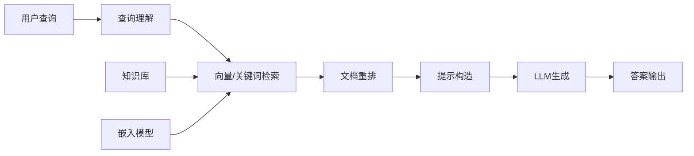

# 基础RAG系统：原理、流程与实现

## 概述与核心架构

**检索增强生成（Retrieval-Augmented Generation，RAG）** 是一种将信息检索与大型语言模型相结合的技术范式。其核心思想是通过从外部知识库中检索相关信息来增强LLM的生成能力，从而提高回答的准确性、时效性和可追溯性。

### RAG在LLM应用中的定位

> [!note] RAG的价值定位
> RAG解决了纯LLM的三大核心限制：
> 1. **知识时效性**：LLM训练数据存在时间滞后
> 2. **事实准确性**：减少幻觉（hallucination）现象
> 3. **可追溯性**：回答可追溯到具体来源文档

### 基础RAG架构图



### 核心组件概览

| 组件 | 功能 | 典型实现 |
|------|------|----------|
| **检索器（Retriever）** | 从知识库中查找相关文档 | 向量检索、关键词检索 |
| **生成器（Generator）** | 基于检索结果生成答案 | GPT、Claude、Llama等LLM |
| **知识库（Knowledge Base）** | 存储待检索的文档 | [[向量数据库]]、文档存储 |
| **嵌入模型（Embedding Model）** | 将文本转换为向量表示 | [[BGE]]、text-embedding-ada |

## 标准RAG流程详解

### 阶段1：查询理解（Query Understanding）

查询理解是RAG流程的第一步，旨在准确理解用户意图并优化查询表示。

```python
# 伪代码：查询理解模块
class QueryUnderstanding:
    def process_query(self, raw_query: str) -> Dict:
        """处理原始查询，生成优化后的查询表示"""
        
        # 1. 查询清洗
        cleaned_query = self.clean_query(raw_query)
        
        # 2. 查询扩展（可选）
        expanded_query = self.query_expansion(cleaned_query)
        
        # 3. 查询重写（可选）
        rewritten_query = self.query_rewriting(expanded_query)
        
        # 4. 查询向量化
        query_embedding = self.embedding_model.encode(rewritten_query)
        
        return {
            "original_query": raw_query,
            "processed_query": rewritten_query,
            "embedding": query_embedding,
            "query_type": self.classify_query_type(cleaned_query)
        }
```

#### 查询优化技术
- **查询扩展**：添加同义词、相关术语
- **查询重写**：将自然语言转换为更适合检索的形式
- **意图分类**：识别查询类型（事实性、解释性、比较性等）

### 阶段2：向量/关键词检索（Retrieval）

检索阶段从知识库中查找与查询最相关的文档片段。

#### 检索策略对比

| 策略 | 原理 | 优点 | 缺点 |
|------|------|------|------|
| **向量检索** | 基于语义相似度的向量匹配 | 语义理解能力强 | 计算成本较高 |
| **关键词检索** | 基于词频和逆文档频率 | 速度快，实现简单 | 语义理解有限 |
| **混合检索** | 结合向量和关键词检索 | 兼顾速度与精度 | 需要权重调优 |

#### 向量检索实现
```python
# 伪代码：向量检索器
class VectorRetriever:
    def __init__(self, vector_db, embedding_model):
        self.vector_db = vector_db  # [[向量数据库]]实例
        self.embedding_model = embedding_model
        
    def retrieve(self, query_embedding, top_k=5):
        """执行向量检索"""
        # 1. 相似度搜索
        results = self.vector_db.similarity_search(
            query_embedding, 
            k=top_k * 2  # 检索更多结果用于后续重排
        )
        
        # 2. 相关性过滤
        filtered_results = self.filter_by_relevance(results, threshold=0.7)
        
        return filtered_results[:top_k]
```

#### 关键词检索实现
```python
# 伪代码：关键词检索器
class KeywordRetriever:
    def __init__(self, inverted_index):
        self.inverted_index = inverted_index
        
    def retrieve(self, query_text, top_k=5):
        """执行关键词检索"""
        # 1. 分词与停用词过滤
        tokens = self.tokenize_and_filter(query_text)
        
        # 2. TF-IDF计算
        scores = self.calculate_tfidf_scores(tokens)
        
        # 3. 文档排序
        ranked_docs = self.rank_documents(scores)
        
        return ranked_docs[:top_k]
```

### 阶段3：文档重排（Reranking，可选）

文档重排是对初步检索结果进行精细化排序的过程，通常使用更复杂的模型来评估文档与查询的相关性。

```python
# 伪代码：文档重排器
class DocumentReranker:
    def __init__(self, rerank_model="bge-reranker"):
        self.rerank_model = self.load_rerank_model(rerank_model)
    
    def rerank(self, query: str, documents: List[Dict]) -> List[Dict]:
        """对检索结果进行重排"""
        # 1. 计算重排分数
        scores = []
        for doc in documents:
            score = self.rerank_model.score(query, doc["content"])
            scores.append(score)
        
        # 2. 按分数排序
        sorted_indices = np.argsort(scores)[::-1]  # 降序排列
        reranked_docs = [documents[i] for i in sorted_indices]
        
        # 3. 添加重排分数
        for i, doc in enumerate(reranked_docs):
            doc["rerank_score"] = scores[sorted_indices[i]]
        
        return reranked_docs
```

> [!tip] 重排模型选择
> - **BGE-Reranker**：中文优化，性能优秀
> - **Cohere Rerank**：商业API，精度高
> - **Cross-Encoder**：基于BERT的双塔模型

### 阶段4：提示构造（Prompt Construction）

提示构造是将检索到的文档整合到LLM提示中的关键步骤。

#### 基础提示模板
```python
# RAG标准提示模板
RAG_PROMPT_TEMPLATE = """
请基于以下上下文信息回答问题。如果上下文信息不足以回答问题，请说明"根据提供的信息无法回答"。

上下文信息：
{context}

问题：{question}

请给出准确、简洁的回答：
"""
```

#### 上下文窗口管理
```python
# 伪代码：上下文构建器
class ContextBuilder:
    def __init__(self, max_tokens=4000):
        self.max_tokens = max_tokens
        
    def build_context(self, retrieved_docs: List[Dict]) -> str:
        """构建适合LLM上下文的文本"""
        context_parts = []
        current_length = 0
        
        for doc in retrieved_docs:
            doc_text = self.format_document(doc)
            doc_length = self.count_tokens(doc_text)
            
            # 检查是否超出上下文限制
            if current_length + doc_length > self.max_tokens:
                break
                
            context_parts.append(doc_text)
            current_length += doc_length
            
        return "\n\n".join(context_parts)
    
    def format_document(self, doc: Dict) -> str:
        """格式化文档片段"""
        return f"来源：{doc.get('source', '未知')}\n内容：{doc['content']}\n相关性：{doc.get('score', 0.0):.3f}"
```

### 阶段5：生成答案（Answer Generation）

生成阶段使用LLM基于构造的提示生成最终答案。

```python
# 伪代码：RAG生成器
class RAGGenerator:
    def __init__(self, llm_model):
        self.llm = llm_model
        
    def generate_answer(self, prompt: str) -> Dict:
        """生成答案"""
        try:
            # 1. 调用LLM生成
            response = self.llm.generate(prompt)
            
            # 2. 解析响应
            answer = self.extract_answer(response)
            
            # 3. 添加元数据
            result = {
                "answer": answer,
                "raw_response": response,
                "generation_time": time.time(),
                "model_used": self.llm.model_name
            }
            
            return result
            
        except Exception as e:
            return {
                "answer": f"生成失败：{str(e)}",
                "error": True
            }
```

## 关键组件详解

### 嵌入模型（Embedding Models）

嵌入模型是将文本转换为向量表示的核心组件。

#### 主流嵌入模型对比

| 模型 | 维度 | 特点 | 适用场景 |
|------|------|------|----------|
| **text-embedding-ada-002** | 1536 | OpenAI官方，性能稳定 | 通用场景，英文优先 |
| **BGE（BAAI）** | 768/1024 | 中文优化，开源免费 | 中文应用，开源部署 |
| **E5** | 1024 | 微软出品，指令感知 | 检索优化场景 |
| **Instructor** | 768 | 支持任务指令 | 特定任务微调 |

#### 嵌入模型选择建议
```python
# 伪代码：嵌入模型选择器
class EmbeddingModelSelector:
    def select_model(self, requirements: Dict) -> str:
        """根据需求选择合适的嵌入模型"""
        if requirements["language"] == "zh":
            if requirements["open_source"]:
                return "BGE-large-zh"  # 中文开源首选
            else:
                return "text-embedding-ada-002"  # 英文或混合
        elif requirements["performance"] == "high":
            return "text-embedding-3-large"  # 高性能版本
        elif requirements["latency"] == "low":
            return "BGE-small-zh"  # 轻量级版本
        else:
            return "text-embedding-ada-002"  # 默认选择
```

### 向量数据库（Vector Databases）

向量数据库是存储和检索向量表示的专业数据库。

#### 主流向量数据库对比

| 数据库 | 特点 | 适用场景 | 学习曲线 |
|--------|------|----------|----------|
| **FAISS** | Facebook开源，性能优秀 | 研究、小规模部署 | 中等 |
| **Chroma** | 易用性好，Python原生 | 快速原型、开发测试 | 简单 |
| **Milvus** | 功能全面，支持分布式 | 生产环境、大规模数据 | 较陡 |
| **Pinecone** | 全托管服务，易用性高 | 商业应用、快速上线 | 简单 |
| **Weaviate** | 图数据库集成，模块化 | 复杂关系查询 | 中等 |

#### 向量数据库schema设计
```python
# 伪代码：向量数据库schema
rag_schema = {
    "id": "string",           # 文档唯一标识
    "content": "text",        # 文档内容
    "embedding": "vector",    # 向量表示
    "metadata": {             # 元数据
        "source": "string",   # 来源
        "chunk_id": "int",    # 分块ID
        "timestamp": "datetime",  # 时间戳
        "keywords": "list"    # 关键词
    },
    "index_config": {         # 索引配置
        "index_type": "IVF_FLAT",  # 索引类型
        "metric_type": "IP"        # 相似度度量
    }
}
```

### 检索策略（Retrieval Strategies）

#### Top-K检索
```python
def top_k_retrieval(query_embedding, vector_db, k=5):
    """基础的top-k检索"""
    # 计算与所有文档的相似度
    similarities = vector_db.calculate_similarities(query_embedding)
    
    # 获取top-k结果
    top_k_indices = np.argsort(similarities)[-k:][::-1]
    top_k_docs = [vector_db.get_document(i) for i in top_k_indices]
    
    return top_k_docs
```

#### 混合检索（Hybrid Search）
```python
def hybrid_retrieval(query, vector_db, keyword_index, alpha=0.5):
    """混合检索：结合向量和关键词检索"""
    # 向量检索
    vector_results = vector_retrieval(query, vector_db)
    
    # 关键词检索
    keyword_results = keyword_retrieval(query, keyword_index)
    
    # 结果融合（加权平均）
    combined_results = []
    for vec_doc in vector_results:
        for key_doc in keyword_results:
            if vec_doc["id"] == key_doc["id"]:
                combined_score = alpha * vec_doc["score"] + (1-alpha) * key_doc["score"]
                combined_results.append({
                    **vec_doc,
                    "hybrid_score": combined_score
                })
    
    # 按混合分数排序
    combined_results.sort(key=lambda x: x["hybrid_score"], reverse=True)
    
    return combined_results
```

## 主流开源框架实现对比

### LangChain实现
```python
# LangChain基础RAG实现
from langchain.embeddings import OpenAIEmbeddings
from langchain.vectorstores import Chroma
from langchain.chains import RetrievalQA
from langchain.llms import OpenAI

# 1. 创建向量存储
embeddings = OpenAIEmbeddings()
vectorstore = Chroma.from_documents(documents, embeddings)

# 2. 创建检索器
retriever = vectorstore.as_retriever(search_kwargs={"k": 4})

# 3. 创建RAG链
qa_chain = RetrievalQA.from_chain_type(
    llm=OpenAI(),
    chain_type="stuff",
    retriever=retriever,
    return_source_documents=True
)

# 4. 执行查询
result = qa_chain({"query": "你的问题"})
```

### LlamaIndex实现
```python
# LlamaIndex基础RAG实现
from llama_index import VectorStoreIndex, SimpleDirectoryReader
from llama_index.llms import OpenAI

# 1. 加载文档
documents = SimpleDirectoryReader("data").load_data()

# 2. 创建索引
index = VectorStoreIndex.from_documents(documents)

# 3. 创建查询引擎
query_engine = index.as_query_engine(
    similarity_top_k=3,
    llm=OpenAI()
)

# 4. 执行查询
response = query_engine.query("你的问题")
```

### Haystack实现
```python
# Haystack基础RAG实现
from haystack.document_stores import InMemoryDocumentStore
from haystack.nodes import EmbeddingRetriever, PromptNode
from haystack.pipelines import Pipeline

# 1. 初始化组件
document_store = InMemoryDocumentStore(embedding_dim=768)
retriever = EmbeddingRetriever(
    document_store=document_store,
    embedding_model="sentence-transformers/all-mpnet-base-v2"
)
prompt_node = PromptNode(model_name_or_path="gpt-3.5-turbo")

# 2. 构建管道
pipeline = Pipeline()
pipeline.add_node(component=retriever, name="Retriever", inputs=["Query"])
pipeline.add_node(component=prompt_node, name="PromptNode", inputs=["Retriever"])

# 3. 执行查询
result = pipeline.run(query="你的问题")
```

### 框架对比总结

| 框架 | 优点 | 缺点 | 适用场景 |
|------|------|------|----------|
| **LangChain** | 生态丰富，组件齐全 | 学习曲线较陡 | 复杂应用，需要高度定制 |
| **LlamaIndex** | 文档处理能力强 | 相对较新，社区较小 | 文档密集型应用 |
| **Haystack** | 管道设计清晰 | 性能优化有限 | 快速原型，研究项目 |

## 常见问题与缓解策略

### 问题1：检索噪声（Retrieval Noise）

**现象**：检索到的文档包含不相关信息，干扰LLM生成。

**缓解策略**：
1. **提高检索精度**：
   - 使用更高质量的[[嵌入模型]]
   - 调整检索参数（top-k、相似度阈值）
   - 实现多阶段检索（粗排 + 精排）

2. **结果过滤**：
   ```python
   def filter_noisy_documents(documents, similarity_threshold=0.7):
       """过滤低相关性文档"""
       return [doc for doc in documents if doc["score"] >= similarity_threshold]
   ```

3. **查询优化**：
   - 实现查询扩展和重写
   - 使用查询分类指导检索策略

### 问题2：上下文截断（Context Truncation）

**现象**：检索到的文档过多，超出LLM上下文窗口限制。

**缓解策略**：
1. **智能分块**：
   ```python
   def smart_chunking(text, max_chunk_size=500, overlap=50):
       """智能文档分块"""
       # 按语义边界分块（段落、句子）
       chunks = []
       sentences = text.split('. ')
       
       current_chunk = ""
       for sentence in sentences:
           if len(current_chunk) + len(sentence) <= max_chunk_size:
               current_chunk += sentence + ". "
           else:
               chunks.append(current_chunk.strip())
               # 保留重叠部分
               current_chunk = sentence + ". "
       
       if current_chunk:
           chunks.append(current_chunk.strip())
       
       return chunks
   ```

2. **上下文选择**：
   - 基于相关性分数选择最重要的文档
   - 实现文档摘要或压缩

3. **滑动窗口检索**：
   - 对长文档实现滑动窗口检索
   - 合并相邻的相关片段

### 问题3：幻觉加剧（Hallucination Amplification）

**现象**：RAG可能放大LLM的幻觉问题。

**缓解策略**：
1. **来源标注**：
   ```python
   def add_source_citations(answer, source_docs):
       """在答案中添加来源引用"""
       citations = []
       for i, doc in enumerate(source_docs):
           citations.append(f"[{i+1}] {doc.get('source', '未知来源')}")
       
       return f"{answer}\n\n**来源：**\n" + "\n".join(citations)
   ```

2. **置信度评估**：
   - 实现答案置信度评分
   - 对低置信度答案添加警告

3. **事实核查**：
   - 实现后处理事实核查
   - 使用多模型交叉验证

### 问题4：检索延迟（Retrieval Latency）

**现象**：检索过程耗时过长，影响用户体验。

**缓解策略**：
1. **索引优化**：
   - 使用高效的索引结构（IVF、HNSW）
   - 实现向量量化减少存储和计算

2. **缓存策略**：
   ```python
   class QueryCache:
       def __init__(self, max_size=1000):
           self.cache = {}
           self.max_size = max_size
       
       def get(self, query_hash):
           return self.cache.get(query_hash)
       
       def set(self, query_hash, results):
           if len(self.cache) >= self.max_size:
               # LRU淘汰策略
               self.cache.pop(next(iter(self.cache)))
           self.cache[query_hash] = results
   ```

3. **异步处理**：
   - 实现异步检索和生成
   - 使用流式响应逐步返回结果

## 基础RAG的局限性

### 核心限制分析

> [!warning] 基础RAG的主要局限性
> 1. **静态检索**：检索过程与生成过程分离，缺乏动态调整
> 2. **缺乏反馈闭环**：无法根据生成结果优化检索策略
> 3. **上下文利用不足**：简单拼接文档，缺乏深度理解
> 4. **多跳推理困难**：难以处理需要多步推理的复杂问题

### 演进方向：高级RAG模式

基础RAG的局限性催生了多种高级RAG模式：

1. **[[Advanced RAG]]**：引入查询重写、文档重排、递归检索等高级技术
2. **[[Self-RAG]]**：让LLM自我评估检索需求和生成质量
3. **[[FLARE]]**：主动检索与生成的动态交互
4. **[[多模态RAG]]**：支持图像、视频等多模态内容检索

## 工业界最佳实践（2024-2026）

### 趋势1：多跳检索（Multi-hop Retrieval）

**技术要点**：
- 实现迭代式检索，逐步细化查询
- 使用思维链（Chain-of-Thought）指导检索过程
- 构建检索推理图（Retrieval Reasoning Graph）

```python
# 伪代码：多跳检索
def multi_hop_retrieval(initial_query, max_hops=3):
    """多跳检索实现"""
    current_query = initial_query
    collected_docs = []
    
    for hop in range(max_hops):
        # 检索当前查询的相关文档
        docs = retrieve(current_query)
        collected_docs.extend(docs)
        
        # 判断是否需要继续检索
        if should_stop_retrieval(collected_docs, current_query):
            break
            
        # 生成下一跳查询
        current_query = generate_next_query(current_query, collected_docs)
    
    return collected_docs
```

### 趋势2：查询重写优化

**技术要点**：
- 使用LLM进行查询重写和扩展
- 基于对话历史的上下文感知重写
- 多版本查询并行检索

```python
# 伪代码：LLM驱动的查询重写
def llm_query_rewriting(original_query, conversation_history=None):
    """使用LLM优化查询"""
    prompt = f"""
    原始查询：{original_query}
    
    请生成3个更有利于文档检索的查询变体：
    1. 扩展版本（添加相关术语）
    2. 简化版本（核心关键词）
    3. 问题分解版本（如果适用）
    """
    
    if conversation_history:
        prompt += f"\n对话历史：{conversation_history}"
    
    rewritten_queries = llm.generate(prompt)
    return [original_query] + rewritten_queries
```

### 趋势3：重排模型微调

**技术要点**：
- 使用领域数据微调重排模型
- 实现个性化重排（用户偏好学习）
- 多目标优化（相关性、多样性、新颖性）

```python
# 伪代码：重排模型微调
def fine_tune_reranker(training_data, base_model="bge-reranker"):
    """微调重排模型"""
    # 准备训练数据（查询-文档对 + 相关性标签）
    train_dataset = prepare_reranker_dataset(training_data)
    
    # 微调配置
    training_args = {
        "learning_rate": 2e-5,
        "num_train_epochs": 3,
        "per_device_train_batch_size": 8,
        "warmup_steps": 100,
    }
    
    # 微调过程
    fine_tuned_model = train_reranker(
        base_model=base_model,
        dataset=train_dataset,
        args=training_args
    )
    
    return fine_tuned_model
```

### 趋势4：实时知识更新

**技术要点**：
- 实现增量索引更新
- 流式数据处理管道
- 版本化知识库管理

```python
# 伪代码：实时知识更新
class RealTimeKnowledgeUpdater:
    def __init__(self, vector_db, update_interval=300):
        self.vector_db = vector_db
        self.update_interval = update_interval  # 5分钟
    
    def start_update_loop(self):
        """启动实时更新循环"""
        while True:
            # 检查新数据
            new_documents = self.fetch_new_documents()
            
            if new_documents:
                # 处理并索引新文档
                processed_docs = self.process_documents(new_documents)
                self.vector_db.add_documents(processed_docs)
                
                # 更新索引统计
                self.update_index_stats()
            
            time.sleep(self.update_interval)
```

## 实施建议与最佳实践

### 开发阶段建议

1. **原型快速验证**：
   - 使用Chroma + LangChain快速搭建原型
   - 准备小型测试数据集验证流程
   - 建立基础评估指标（检索召回率、生成准确性）

2. **渐进式优化**：
   - 从基础RAG开始，逐步引入高级功能
   - 优先优化检索质量，再优化生成质量
   - 建立A/B测试框架评估改进效果

3. **监控与可观测性**：
   ```python
   # 伪代码：RAG系统监控
   class RAGMonitor:
       def track_metrics(self, query, retrieved_docs, generated_answer):
           """跟踪关键指标"""
           metrics = {
               "retrieval_latency": self.calculate_retrieval_time(),
               "retrieval_recall": self.calculate_recall(retrieved_docs),
               "answer_quality": self.evaluate_answer_quality(generated_answer),
               "user_feedback": self.collect_feedback()
           }
           
           # 记录到监控系统
           self.log_metrics(metrics)
           return metrics
   ```

### 生产部署建议

1. **性能优化**：
   - 实现向量索引优化（IVF、HNSW参数调优）
   - 部署多级缓存（内存缓存、分布式缓存）
   - 使用模型量化减少推理延迟

2. **可扩展性设计**：
   - 采用微服务架构分离检索和生成服务
   - 实现负载均衡和自动扩缩容
   - 设计容错和降级机制

3. **安全与合规**：
   - 实现查询过滤和内容审核
   - 确保数据隐私和合规性
   - 建立访问控制和审计日志

## 待办事项与迭代计划

### 短期待办
- [ ] 补充RAGAS评估指标实现
- [ ] 添加完整Mermaid架构流程图
- [ ] 编写基础RAG的Docker部署配置
- [ ] 收集公开RAG评估数据集

### 中期计划
- [ ] 实现多跳检索的完整示例
- [ ] 添加重排模型微调教程
- [ ] 编写性能基准测试脚本
- [ ] 开发RAG可视化调试工具

### 长期研究
- [ ] 探索[[Self-RAG]]的实现与优化
- [ ] 研究[[FLARE]]在复杂任务中的应用
- [ ] 实验实时知识更新策略
- [ ] 参与RAG开源社区贡献

## 相关资源与参考

### 开源项目
- [LangChain RAG Tutorial](https://github.com/langchain-ai/langchain)：官方RAG教程
- [LlamaIndex Examples](https://github.com/run-llama/llama_index)：LlamaIndex示例代码
- [RAGatouille](https://github.com/bclavie/RAGatouille)：RAG工具集合

### 学术论文
- **Retrieval-Augmented Generation for Knowledge-Intensive NLP Tasks** (Lewis et al., 2020)
- **Improving Language Models by Retrieving from Trillions of Tokens** (Borgeaud et al., 2022)
- **RAG vs Fine-tuning: Pipelines, Tradeoffs, and a Case Study on Agriculture** (2023)

### 评估工具
- **RAGAS**：RAG系统评估框架
- **TruLens**：LLM应用评估工具
- **LangSmith**：LangChain应用监控平台

### 学习资源
- [RAG 101: From Theory to Practice](https://www.pinecone.io/learn/rag-101/)
- [Advanced RAG Techniques](https://www.llamaindex.ai/blog/advanced-rag-techniques)
- [Building Production RAG Systems](https://www.anyscale.com/blog/building-production-rag-systems)

---
*最后更新：{{date}}*
*标签：[[基础RAG]] [[检索增强生成]] [[向量数据库]] [[嵌入模型]] [[提示工程]] [[Advanced RAG]] [[Self-RAG]] [[FLARE]] [[RAG评估]]*