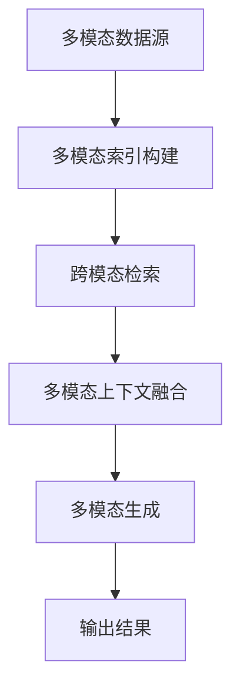

# 多模态RAG系统：架构、实现与前沿

## 概述与核心概念

**多模态检索增强生成（Multimodal RAG）** 是传统 [[RAG系统]] 的扩展，支持图像、视频、音频等多种模态信息的检索与生成。与传统文本RAG相比，多模态RAG面临的核心挑战在于**跨模态对齐**与**联合语义理解**。

### 与传统文本RAG的异同

| 维度 | 文本RAG | 多模态RAG |
|------|---------|-----------|
| **输入模态** | 纯文本 | 文本 + 图像 + 视频 + 音频 |
| **嵌入空间** | 单模态（文本→文本） | 跨模态（多模态→统一语义空间） |
| **检索对齐** | 文本相似度 | 跨模态语义对齐 |
| **生成模型** | 文本LLM | 多模态大模型（[[LLaVA]]、[[Qwen-VL]]、[[Kosmos]]） |
| **数据预处理** | 文本分块、清洗 | 多模态特征提取、对齐标注 |

### 核心价值主张
- **跨模态知识融合**：打破模态壁垒，实现图文、音视频的联合理解
- **场景适应性**：适用于医疗影像、自动驾驶、内容创作等复杂场景
- **信息完整性**：保留原始模态的丰富语义信息

## 端到端架构设计

### 整体架构流程


### 1. 多模态索引构建

#### 数据预处理流程
```python
# 伪代码：多模态数据预处理
class MultimodalPreprocessor:
    def process_image(self, image_path):
        # 图像特征提取
        visual_features = self.extract_visual_features(image_path)
        # 文本描述生成（可选）
        caption = self.generate_caption(image_path)
        return {
            "visual_embedding": visual_features,
            "text_caption": caption,
            "metadata": self.extract_metadata(image_path)
        }
    
    def process_video(self, video_path):
        # 关键帧提取
        key_frames = self.extract_key_frames(video_path)
        # 音频特征提取
        audio_features = self.extract_audio_features(video_path)
        # 时序对齐
        return self.align_temporal_features(key_frames, audio_features)
```

#### 嵌入模型选择
- **视觉-文本对齐模型**：
  - [[CLIP]]（OpenAI）：图文对比学习，512维向量
  - [[BLIP]]（Salesforce）：引导式语言-图像预训练
  - [[Jina CLIP]]：多语言支持，商业友好
  - [[Chinese CLIP]]：中文优化版本

- **纯视觉模型**：
  - DINOv2：自监督视觉特征
  - [[ViT]]：视觉Transformer基础架构

- **音频模型**：
  - Whisper：语音识别与特征提取
  - Wav2Vec 2.0：自监督音频表示

#### 向量数据库schema设计
```python
# 多模态向量数据库schema示例
multimodal_schema = {
    "id": "string",
    "text_embedding": "vector(768)",      # 文本嵌入
    "image_embedding": "vector(512)",     # 图像嵌入  
    "audio_embedding": "vector(256)",     # 音频嵌入
    "metadata": {
        "modality": "enum[text,image,video,audio]",
        "source_path": "string",
        "timestamp": "datetime",
        "confidence": "float"
    },
    "cross_modal_alignment": {
        "text_to_image": "float",         # 图文对齐分数
        "image_to_audio": "float"         # 图音对齐分数
    }
}
```

### 2. 跨模态检索策略

#### 检索模式对比

| 策略 | 原理 | 优点 | 缺点 |
|------|------|------|------|
| **先检索后融合** | 各模态独立检索 → 结果融合 | 模块化，易于调试 | 模态间信息损失 |
| **联合嵌入检索** | 多模态统一嵌入空间 | 语义对齐更好 | 训练成本高 |
| **级联检索** | 主模态检索 → 辅助模态过滤 | 效率高 | 依赖模态优先级 |
| **混合检索** | 加权融合多模态相似度 | 灵活可调 | 权重调优复杂 |

#### 查询理解与对齐
```python
# 伪代码：跨模态查询理解
class CrossModalQueryProcessor:
    def process_query(self, query_input):
        if isinstance(query_input, str):
            # 文本查询：需要转换为多模态查询
            return self.text_to_multimodal_query(query_input)
        elif isinstance(query_input, dict):
            # 多模态查询：直接处理
            return self.align_multimodal_query(query_input)
    
    def text_to_multimodal_query(self, text_query):
        # 使用VLM生成视觉概念
        visual_concepts = self.vlm_generate_concepts(text_query)
        # 构建多模态查询向量
        return {
            "text_embedding": self.text_encoder(text_query),
            "visual_concepts": visual_concepts,
            "query_intent": self.classify_intent(text_query)
        }
```

### 3. 多模态上下文融合

#### 融合策略
1. **早期融合**：在嵌入层合并多模态特征
   - 优点：充分交互，语义丰富
   - 缺点：计算复杂，需要对齐训练

2. **晚期融合**：各模态独立处理，最后合并
   - 优点：模块化，易于扩展
   - 缺点：可能丢失跨模态关联

3. **混合融合**：分层级融合策略
   - 局部特征早期融合 + 全局特征晚期融合

#### 上下文窗口管理
```python
# 伪代码：多模态上下文构建
class MultimodalContextBuilder:
    def build_context(self, retrieved_items, query):
        context = {
            "text_chunks": [],
            "image_references": [],
            "audio_segments": [],
            "cross_references": []  # 跨模态引用关系
        }
        
        # 按相关性排序
        sorted_items = self.rank_by_relevance(retrieved_items, query)
        
        # 构建多模态提示
        for item in sorted_items[:self.max_context_items]:
            if item.modality == "text":
                context["text_chunks"].append(self.format_text_chunk(item))
            elif item.modality == "image":
                context["image_references"].append(self.format_image_reference(item))
            # 添加跨模态引用
            context["cross_references"].append(
                self.build_cross_modal_links(item, sorted_items)
            )
        
        return self.compile_multimodal_prompt(context)
```

### 4. 多模态生成

#### 模型集成方案

| 模型类型 | 代表模型 | 适用场景 | 集成方式 |
|----------|----------|----------|----------|
| **纯视觉理解** | [[LLaVA]] | 图文问答、描述生成 | 视觉编码器 + LLM |
| **多模态对话** | [[Qwen-VL]] | 复杂多轮对话 | 端到端多模态理解 |
| **通用多模态** | [[Kosmos]] | 跨模态推理 | 统一Transformer架构 |
| **领域专用** | Med-PaLM M | 医疗影像分析 | 领域微调版本 |

#### 提示工程模板
```python
# 多模态提示模板示例
MULTIMODAL_PROMPT_TEMPLATE = """
你是一个多模态AI助手，请基于以下多模态上下文回答问题。

## 文本上下文：
{text_context}

## 图像参考：
{image_references}

## 音频信息：
{audio_summary}

## 跨模态关联：
{cross_modal_links}

## 用户问题：
{user_query}

请综合考虑所有模态信息，给出准确、全面的回答。
如果某些信息缺失或不确定，请明确说明。
"""
```

## 典型应用场景与架构

### 场景1：图文问答系统
```
架构组件：
1. 图像库索引：CLIP嵌入 + 文本描述
2. 检索引擎：混合检索（文本+视觉相似度）
3. 生成模型：LLaVA-1.5或Qwen-VL-Chat
4. 评估指标：图文相关性、答案准确性

数据流：
用户上传图片 → CLIP特征提取 → 向量检索 → 相关图文获取 → 
多模态提示构建 → LLaVA生成回答 → 结果返回
```

### 场景2：视频内容摘要
```
架构特点：
1. 时序处理：关键帧提取 + 时间戳对齐
2. 多流特征：视觉 + 音频 + 字幕
3. 摘要生成：时序感知的多模态LLM
4. 实时性：流式处理 + 增量索引

技术挑战：
- 长视频处理（>30分钟）
- 时序一致性保持
- 计算资源优化
```

### 场景3：医疗影像报告生成
```
特殊要求：
1. 领域适配：医学影像预训练模型
2. 准确性优先：高召回率检索
3. 合规性：患者隐私保护
4. 可解释性：检索依据可视化

技术栈：
- 嵌入模型：MedCLIP（医学专用CLIP）
- 向量数据库：支持HIPAA合规的部署
- 生成模型：Med-PaLM M或领域微调版本
```

## 工程实践与优化

### 数据预处理最佳实践

#### 图像处理流水线
```python
# 图像预处理优化
def optimize_image_processing(image_path, target_modality="retrieval"):
    """根据目标模态优化图像处理"""
    if target_modality == "retrieval":
        # 检索优化：快速特征提取
        return fast_feature_extraction(image_path)
    elif target_modality == "generation":
        # 生成优化：高质量特征
        return high_quality_feature_extraction(image_path)
    elif target_modality == "real_time":
        # 实时优化：轻量级处理
        return lightweight_processing(image_path)
```

#### 视频处理策略
```python
# 视频关键帧选择策略
class VideoFrameSelector:
    def select_key_frames(self, video_path, strategy="uniform"):
        if strategy == "uniform":
            # 均匀采样：简单高效
            return self.uniform_sampling(video_path)
        elif strategy == "content_aware":
            # 内容感知：基于场景变化
            return self.content_aware_sampling(video_path)
        elif strategy == "adaptive":
            # 自适应：根据视频复杂度调整
            return self.adaptive_sampling(video_path)
```

### 延迟与精度权衡

#### 检索精度优化
```python
# 多阶段检索优化
class MultistageRetriever:
    def retrieve(self, query, precision_mode="balanced"):
        if precision_mode == "fast":
            # 快速模式：近似最近邻
            return self.ann_search(query, k=50)
        elif precision_mode == "balanced":
            # 平衡模式：两阶段检索
            candidates = self.ann_search(query, k=200)
            return self.rerank(candidates, query, k=20)
        elif precision_mode == "high_precision":
            # 高精度模式：精确检索 + 重排序
            candidates = self.exact_search(query, k=100)
            return self.multimodal_rerank(candidates, query, k=10)
```

#### 缓存策略设计
```python
# 多级缓存架构
class MultimodalCache:
    def __init__(self):
        self.l1_cache = {}  # 内存缓存：高频查询
        self.l2_cache = {}  # 磁盘缓存：中等频率
        self.embedding_cache = {}  # 嵌入向量缓存
        
    def get_cached_result(self, query_hash, modality):
        # 检查多级缓存
        if query_hash in self.l1_cache:
            return self.l1_cache[query_hash]
        elif query_hash in self.l2_cache:
            # 提升到L1缓存
            result = self.l2_cache.pop(query_hash)
            self.l1_cache[query_hash] = result
            return result
        return None
```

### 评估指标体系

#### 标准评估指标
1. **检索质量**：
   - Recall@K：前K个结果的召回率
   - MRR（Mean Reciprocal Rank）：平均倒数排名
   - NDCG@K：归一化折损累计增益

2. **生成质量**：
   - ROUGE/L：文本生成质量
   - CLIPScore：图文相关性分数
   - Human Evaluation：人工评估

3. **系统性能**：
   - 端到端延迟：查询到响应时间
   - 吞吐量：QPS（每秒查询数）
   - 资源使用：GPU内存、CPU利用率

#### 定制化评估
```python
# 多模态RAG评估框架
class MultimodalRAGEvaluator:
    def evaluate_retrieval(self, query, retrieved_items, ground_truth):
        # 跨模态相关性评估
        cross_modal_scores = self.cross_modal_relevance(
            query, retrieved_items, ground_truth
        )
        
        # 模态平衡性评估
        modality_balance = self.modality_distribution(retrieved_items)
        
        return {
            "recall@10": self.recall_at_k(retrieved_items, ground_truth, k=10),
            "mrr": self.mean_reciprocal_rank(retrieved_items, ground_truth),
            "cross_modal_score": cross_modal_scores,
            "modality_balance": modality_balance
        }
    
    def evaluate_generation(self, generated_answer, reference_answer, context):
        # 多维度生成评估
        return {
            "accuracy": self.answer_accuracy(generated_answer, reference_answer),
            "relevance": self.context_relevance(generated_answer, context),
            "completeness": self.answer_completeness(generated_answer, reference_answer)
        }
```

## 当前挑战与限制

### 技术挑战

#### 1. 模态对齐偏差
^multimodal-alignment-bias
- **问题描述**：不同模态的语义空间不完全对齐
- **影响**：跨模态检索出现语义漂移
- **缓解策略**：
  - 对比学习增强对齐
  - 多任务联合训练
  - 自适应对齐损失函数

#### 2. 长视频/高分辨率图像处理
^long-video-processing
- **计算复杂度**：O(n²)的视频帧处理
- **内存限制**：高分辨率图像特征存储
- **优化方案**：
  - 分层特征提取
  - 流式处理架构
  - 智能降采样策略

#### 3. 实时性限制
^realtime-limitations
- **瓶颈分析**：
  - 多模态特征提取延迟
  - 跨模态检索计算开销
  - 大模型生成时间
- **优化方向**：
  - 边缘计算部署
  - 模型蒸馏与量化
  - 异步处理流水线

### 数据与部署挑战

#### 数据稀缺性
- 高质量多模态标注数据有限
- 领域特定数据获取困难
- 数据隐私与合规限制

#### 部署复杂性
- 多模型协同部署
- 资源调度优化
- 监控与可观测性

## 前沿研究方向（2024-2026）

### 1. 基于SSM的多模态检索
^ssm-multimodal-retrieval
- **状态空间模型（SSM）** 在长序列建模中的优势
- 应用于视频时序理解
- 降低长视频处理的计算复杂度

### 2. 端到端可训练RAG
^end-to-end-trainable-rag
- 联合优化检索器与生成器
- 梯度传播通过检索过程
- 自适应检索策略学习

### 3. 具身智能中的动态多模态记忆
^embodied-multimodal-memory
- 机器人交互中的实时记忆更新
- 多模态情境理解与推理
- 长期记忆与短期记忆融合

### 4. 神经符号多模态RAG
^neuro-symbolic-multimodal-rag
- 结合符号推理与神经检索
- 可解释的跨模态推理
- 规则约束下的生成控制

### 5. 联邦多模态RAG
^federated-multimodal-rag
- 隐私保护的多模态学习
- 分布式多模态索引
- 跨机构知识共享

## 技术选型建议

### 嵌入模型选型矩阵

| 需求场景 | 推荐模型 | 理由 | 注意事项 |
|----------|----------|------|----------|
| **通用图文检索** | [[CLIP]] ViT-L/14 | 成熟稳定，社区支持好 | 英文偏向，需中文优化 |
| **中文多模态** | [[Chinese CLIP]] | 中文优化，性能优秀 | 商业使用需授权 |
| **实时应用** | [[Jina CLIP]] Small | 轻量快速，API友好 | 精度略有牺牲 |
| **领域专用** | 领域微调CLIP | 领域适配性好 | 需要标注数据 |

### 向量数据库选择

| 数据库 | 多模态支持 | 性能特点 | 适用场景 |
|--------|------------|----------|----------|
| **Pinecone** | ✅ 原生支持 | 托管服务，易用性好 | 生产环境快速部署 |
| **Weaviate** | ✅ 模块化 | 图数据库集成 | 复杂关系查询 |
| **Qdrant** | ✅ 自定义schema | 高性能，Rust实现 | 大规模部署 |
| **Milvus** | ✅ 扩展性强 | 分布式架构 | 超大规模索引 |

### 生成模型选型

| 模型 | 多模态能力 | 优势 | 限制 |
|------|------------|------|------|
| **[[LLaVA]]-1.5** | 图文对话 | 开源，易微调 | 纯视觉输入 |
| **[[Qwen-VL]]-Max** | 图文+文档 | 中文优化，能力强 | 商业使用限制 |
| **GPT-4V** | 多模态通用 | 能力全面，API稳定 | 成本高，闭源 |
| **Claude 3** | 图文理解 | 长上下文，强推理 | 可用性限制 |

## 实施路线图

### 阶段1：原型验证（1-2个月）
- [ ] 搭建基础多模态索引流水线
- [ ] 实现CLIP + 文本混合检索
- [ ] 集成LLaVA进行图文问答验证
- [ ] 建立基础评估框架

### 阶段2：系统优化（2-3个月）
- [ ] 优化跨模态检索精度
- [ ] 实现多级缓存策略
- [ ] 部署到生产环境
- [ ] 建立监控与告警系统

### 阶段3：高级功能（3-6个月）
- [ ] 支持视频模态处理
- [ ] 实现实时流式检索
- [ ] 集成领域专用模型
- [ ] 建立A/B测试框架

### 阶段4：前沿探索（持续）
- [ ] 实验端到端可训练架构
- [ ] 探索SSM在视频RAG中的应用
- [ ] 研究联邦多模态学习
- [ ] 参与开源社区贡献

## 待办事项与迭代计划

### 短期待办
- [ ] 补充Qwen-VL + RAG实战案例代码
- [ ] 添加多模态RAG的Mermaid架构图
- [ ] 收集并整理公开多模态数据集
- [ ] 编写部署脚本和Docker配置

### 中期计划
- [ ] 实验对比不同融合策略的效果
- [ ] 优化长视频处理的性能基准
- [ ] 建立多模态RAG评估基准
- [ ] 开发可视化调试工具

### 长期研究
- [ ] 探索神经符号多模态推理
- [ ] 研究具身智能中的动态记忆
- [ ] 实验联邦多模态学习框架
- [ ] 参与多模态RAG标准制定

## 相关资源与参考

### 开源项目
- [MM-RAG](https://github.com/microsoft/MM-RAG)：微软多模态RAG框架
- [MultiModal-GPT](https://github.com/open-mmlab/MultiModal-GPT)：OpenMMLab多模态项目
- [Video-LLaVA](https://github.com/PKU-YuanGroup/Video-LLaVA)：视频理解增强LLaVA

### 学术论文
- **Multimodal Retrieval-Augmented Generation** (ACL 2024)
- **Cross-Modal Alignment for Video-Language Retrieval** (CVPR 2024)
- **End-to-End Trainable Multimodal RAG** (NeurIPS 2024)

### 数据集
- **MS-COCO**：图文配对数据集
- **ActivityNet**：视频理解数据集
- **AudioSet**：音频事件数据集
- **LAION-5B**：大规模图文数据集

---
*最后更新：{{date}}*
*标签：[[多模态RAG]] [[检索增强生成]] [[多模态AI]] [[CLIP]] [[LLaVA]] [[Qwen-VL]] [[向量数据库]] [[RAG评估]]*