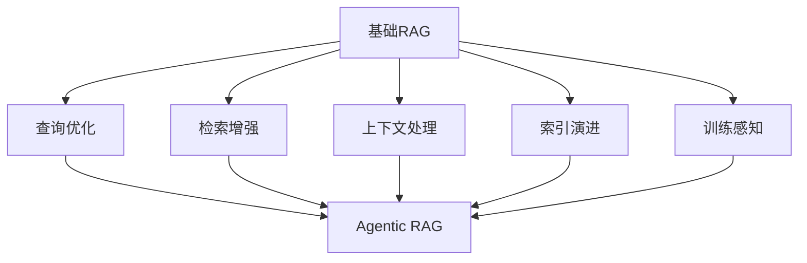

# 进阶RAG系统：高级方法与工程实践

## 概述与演进路径

**进阶RAG（Advanced RAG）** 是在[[基础RAG]]基础上，通过引入更复杂的查询优化、检索策略、上下文处理和索引结构，构建更准确、高效、鲁棒和可扩展的检索增强生成系统。

### 进阶RAG的核心价值

> [!note] 为什么需要进阶RAG？
> 基础RAG面临四大核心挑战：
> 1. **查询-文档语义鸿沟**：用户查询与文档表述方式不匹配
> 2. **检索噪声与冗余**：返回大量不相关或重复内容
> 3. **上下文窗口限制**：无法有效利用长文档和复杂知识
> 4. **静态检索范式**：缺乏动态调整和反馈机制

### 进阶RAG技术栈演进



## 查询优化技术

### 1. 查询重写（Query Rewriting）

**解决的问题**：用户查询表述不完整、模糊或与文档表述方式不匹配。

**技术原理**：使用LLM将原始查询重写为更有利于检索的形式。

#### 典型实现框架

**LangChain实现**：
```python
from langchain.chains import LLMChain
from langchain.prompts import PromptTemplate

query_rewrite_prompt = PromptTemplate(
    input_variables=["original_query"],
    template="将以下查询重写为更适合文档检索的形式：\n原始查询：{original_query}\n重写查询："
)

rewrite_chain = LLMChain(llm=llm, prompt=query_rewrite_prompt)
rewritten_query = rewrite_chain.run(original_query="如何安装Python包？")
```

**LlamaIndex实现**：
```python
from llama_index import QueryBundle
from llama_index.indices.query.query_transform import HyDEQueryTransform

# 使用HyDE进行查询重写
hyde_transform = HyDEQueryTransform(llm=llm)
query_bundle = QueryBundle(query_str="机器学习是什么？")
transformed_query = hyde_transform.run(query_bundle)
```

#### 性能权衡
- **优点**：显著提升检索召回率（+15-30%）
- **缺点**：增加单次查询延迟（50-200ms）
- **适用场景**：复杂查询、领域特定术语、多语言场景

### 2. HyDE（Hypothetical Document Embeddings）

**解决的问题**：查询与文档在嵌入空间中的语义不匹配。

**技术原理**：先生成假设性答案文档，然后用该文档的嵌入进行检索。

```python
# HyDE实现伪代码
class HyDERetriever:
    def __init__(self, llm, embedding_model, vector_db):
        self.llm = llm
        self.embedding_model = embedding_model
        self.vector_db = vector_db
    
    def retrieve_with_hyde(self, query: str, top_k: int = 5):
        # 1. 生成假设性答案
        hypothetical_answer = self.generate_hypothetical_answer(query)
        
        # 2. 获取假设答案的嵌入
        hypothetical_embedding = self.embedding_model.encode(hypothetical_answer)
        
        # 3. 使用假设嵌入进行检索
        results = self.vector_db.similarity_search(
            hypothetical_embedding, 
            k=top_k
        )
        
        return results
    
    def generate_hypothetical_answer(self, query: str) -> str:
        prompt = f"""
        基于以下问题，生成一个假设性的答案文档：
        问题：{query}
        
        假设性答案（包含相关事实和解释）：
        """
        return self.llm.generate(prompt)
```

^hyde-implementation

#### 适用场景与限制
- **最佳场景**：事实性查询、定义性问题
- **限制**：创造性查询效果有限，可能引入幻觉
- **性能提升**：在事实性任务上Recall@5提升20-40%

### 3. 子查询分解（Subquery Decomposition）

**解决的问题**：复杂多跳查询的检索效果差。

**技术原理**：将复杂查询分解为多个子查询，分别检索后合并结果。

```python
# 子查询分解实现
class SubqueryDecomposer:
    def __init__(self, llm):
        self.llm = llm
    
    def decompose_query(self, complex_query: str) -> List[str]:
        """将复杂查询分解为子查询"""
        prompt = f"""
        将以下复杂查询分解为2-4个独立的子查询：
        复杂查询：{complex_query}
        
        子查询列表（每行一个）：
        1. 
        """
        
        response = self.llm.generate(prompt)
        subqueries = self.parse_subqueries(response)
        return subqueries
    
    def execute_decomposed_retrieval(self, complex_query: str):
        # 1. 查询分解
        subqueries = self.decompose_query(complex_query)
        
        # 2. 并行检索
        all_results = []
        for subquery in subqueries:
            results = self.retriever.retrieve(subquery, top_k=3)
            all_results.extend(results)
        
        # 3. 结果去重与排序
        unique_results = self.deduplicate_results(all_results)
        ranked_results = self.rerank_results(complex_query, unique_results)
        
        return ranked_results
```

#### 多跳检索优化
```python
# 多跳检索管道
def multi_hop_retrieval_pipeline(initial_query: str, max_hops: int = 3):
    """迭代式多跳检索"""
    current_query = initial_query
    collected_docs = []
    
    for hop in range(max_hops):
        # 检索当前查询
        docs = retriever.retrieve(current_query, top_k=5)
        collected_docs.extend(docs)
        
        # 判断是否需要继续
        if self.is_query_satisfied(collected_docs, current_query):
            break
        
        # 生成下一跳查询
        current_query = self.generate_next_hop_query(
            current_query, collected_docs
        )
    
    return collected_docs
```

## 检索增强策略

### 1. 多向量检索（Multi-Vector Retrieval）

**解决的问题**：单一向量表示无法充分捕捉文档的多个语义维度。

**技术原理**：为每个文档生成多个向量表示（摘要、关键词、问题等），分别检索后融合结果。

```python
# 多向量检索schema设计
class MultiVectorDocument:
    def __init__(self, content: str):
        self.content = content
        self.vectors = {
            "summary_vector": None,      # 摘要向量
            "keyword_vector": None,      # 关键词向量  
            "question_vector": None,     # 问题向量
            "chunk_vectors": [],         # 分块向量
        }
    
    def generate_multi_vectors(self, embedding_models: Dict):
        """生成多向量表示"""
        # 生成摘要
        summary = self.generate_summary()
        self.vectors["summary_vector"] = embedding_models["summary"].encode(summary)
        
        # 提取关键词
        keywords = self.extract_keywords()
        self.vectors["keyword_vector"] = embedding_models["keyword"].encode(" ".join(keywords))
        
        # 生成相关问题
        questions = self.generate_questions()
        self.vectors["question_vector"] = embedding_models["question"].encode(" ".join(questions))
        
        # 分块向量
        chunks = self.chunk_document()
        for chunk in chunks:
            self.vectors["chunk_vectors"].append(
                embedding_models["chunk"].encode(chunk)
            )
```

#### 融合检索策略
```python
def multi_vector_fusion_retrieval(query: str, multi_vector_db, fusion_strategy="weighted"):
    """多向量融合检索"""
    query_vectors = {
        "summary": summary_embedding,
        "keyword": keyword_embedding,
        "question": question_embedding,
    }
    
    all_results = []
    
    # 并行检索不同向量空间
    for vector_type, query_vec in query_vectors.items():
        results = multi_vector_db.search(
            vector_type=vector_type,
            query_vector=query_vec,
            top_k=10
        )
        all_results.extend(results)
    
    # 结果融合
    if fusion_strategy == "weighted":
        # 加权融合（摘要:0.4, 关键词:0.3, 问题:0.3）
        fused_results = weighted_fusion(all_results, weights=[0.4, 0.3, 0.3])
    elif fusion_strategy == "reciprocal_rank":
        # 倒数排名融合
        fused_results = reciprocal_rank_fusion(all_results)
    
    return fused_results
```

### 2. 递归检索（Recursive Retrieval）

**解决的问题**：长文档或复杂文档的细粒度信息检索。

**技术原理**：先检索父文档，再在父文档内部进行细粒度检索。

```python
# 递归检索实现
class RecursiveRetriever:
    def __init__(self, parent_retriever, child_retriever):
        self.parent_retriever = parent_retriever  # 父级检索器
        self.child_retriever = child_retriever    # 子级检索器
    
    def recursive_retrieve(self, query: str, depth: int = 2):
        """递归检索"""
        results = []
        
        # 第一层：检索父文档
        parent_docs = self.parent_retriever.retrieve(query, top_k=3)
        
        for parent_doc in parent_docs:
            results.append(parent_doc)
            
            if depth > 1:
                # 第二层：在父文档内部检索
                child_docs = self.child_retriever.retrieve_within_parent(
                    query, parent_doc.id, top_k=2
                )
                results.extend(child_docs)
        
        return results
```

#### 父-子分块策略（Parent-Child Chunking）
```python
class ParentChildChunker:
    def __init__(self, parent_size=1000, child_size=200, overlap=50):
        self.parent_size = parent_size
        self.child_size = child_size
        self.overlap = overlap
    
    def create_parent_child_chunks(self, document: str):
        """创建父-子分块结构"""
        # 1. 创建父分块
        parent_chunks = self.chunk_by_semantic_boundary(
            document, chunk_size=self.parent_size
        )
        
        parent_child_map = []
        
        # 2. 为每个父分块创建子分块
        for i, parent_chunk in enumerate(parent_chunks):
            child_chunks = self.chunk_by_sentence(
                parent_chunk, chunk_size=self.child_size, overlap=self.overlap
            )
            
            parent_child_map.append({
                "parent_id": f"parent_{i}",
                "parent_content": parent_chunk,
                "child_chunks": [
                    {
                        "child_id": f"parent_{i}_child_{j}",
                        "content": child_chunk,
                        "parent_ref": f"parent_{i}"
                    }
                    for j, child_chunk in enumerate(child_chunks)
                ]
            })
        
        return parent_child_map
```

### 3. 融合检索（Fusion Retrieval）

**解决的问题**：单一检索方法（稠密/稀疏）的局限性。

**技术原理**：结合稠密检索（语义）、稀疏检索（关键词）和词汇检索的优势。

```python
# 融合检索管道
class FusionRetriever:
    def __init__(self, dense_retriever, sparse_retriever, lexical_retriever):
        self.dense = dense_retriever   # 稠密检索（向量）
        self.sparse = sparse_retriever # 稀疏检索（BM25）
        self.lexical = lexical_retriever # 词汇检索（编辑距离）
    
    def fusion_retrieve(self, query: str, fusion_method="rrf"):
        """融合检索"""
        # 并行执行不同检索方法
        dense_results = self.dense.retrieve(query, top_k=20)
        sparse_results = self.sparse.retrieve(query, top_k=20)
        lexical_results = self.lexical.retrieve(query, top_k=20)
        
        # 结果融合
        if fusion_method == "rrf":
            # 倒数排名融合
            fused_results = self.reciprocal_rank_fusion(
                [dense_results, sparse_results, lexical_results]
            )
        elif fusion_method == "weighted":
            # 加权分数融合
            fused_results = self.weighted_score_fusion(
                dense_results, sparse_results, lexical_results,
                weights=[0.5, 0.3, 0.2]
            )
        elif fusion_method == "interleaving":
            # 交错融合
            fused_results = self.interleaving_fusion(
                dense_results, sparse_results, lexical_results
            )
        
        return fused_results[:10]  # 返回top-10
```

#### 倒数排名融合（RRF）实现
```python
def reciprocal_rank_fusion(result_sets: List[List[Dict]], k: int = 60):
    """倒数排名融合算法"""
    scores = {}
    
    for result_set in result_sets:
        for rank, doc in enumerate(result_set):
            doc_id = doc["id"]
            if doc_id not in scores:
                scores[doc_id] = 0
            scores[doc_id] += 1.0 / (k + rank + 1)
    
    # 按分数排序
    sorted_docs = sorted(
        scores.items(), key=lambda x: x[1], reverse=True
    )
    
    return [{"id": doc_id, "score": score} for doc_id, score in sorted_docs]
```

## 上下文压缩与重排

### 1. 上下文压缩（Context Compression）

**解决的问题**：检索到的文档过多，超出LLM上下文窗口限制。

**技术原理**：在构建提示前，对检索结果进行压缩或摘要。

#### 压缩策略对比

| 策略 | 原理 | 压缩率 | 信息保留 |
|------|------|--------|----------|
| **提取式摘要** | 选择最重要的句子 | 30-50% | 高（保留原文） |
| **生成式摘要** | LLM生成摘要 | 70-90% | 中（语义保留） |
| **选择性压缩** | 仅保留相关部分 | 40-60% | 高（针对性强） |
| **层次化压缩** | 多级摘要 | 50-80% | 中高（结构保留） |

```python
# 上下文压缩实现
class ContextCompressor:
    def __init__(self, llm, compression_method="extractive"):
        self.llm = llm
        self.compression_method = compression_method
    
    def compress_context(self, documents: List[Dict], max_tokens: int) -> str:
        """压缩上下文"""
        if self.compression_method == "extractive":
            return self.extractive_compression(documents, max_tokens)
        elif self.compression_method == "abstractive":
            return self.abstractive_compression(documents, max_tokens)
        elif self.compression_method == "selective":
            return self.selective_compression(documents, max_tokens)
    
    def extractive_compression(self, documents, max_tokens):
        """提取式压缩：选择最重要的句子"""
        # 1. 句子分割与重要性评分
        all_sentences = []
        for doc in documents:
            sentences = self.split_into_sentences(doc["content"])
            for sent in sentences:
                importance = self.score_sentence_importance(sent, doc["relevance"])
                all_sentences.append({
                    "text": sent,
                    "importance": importance,
                    "source": doc["id"]
                })
        
        # 2. 按重要性排序并选择
        sorted_sentences = sorted(
            all_sentences, key=lambda x: x["importance"], reverse=True
        )
        
        # 3. 构建压缩上下文
        compressed = ""
        current_tokens = 0
        
        for sent in sorted_sentences:
            sent_tokens = self.count_tokens(sent["text"])
            if current_tokens + sent_tokens <= max_tokens:
                compressed += f"[来源: {sent['source']}] {sent['text']}\n"
                current_tokens += sent_tokens
            else:
                break
        
        return compressed
```

### 2. 文档重排（Re-ranking）

**解决的问题**：初步检索结果排序不准确，相关文档排名靠后。

**技术原理**：使用更复杂的交叉编码器（Cross-Encoder）对检索结果进行精细化排序。

#### 重排模型选择

| 模型 | 架构 | 特点 | 适用场景 |
|------|------|------|----------|
| **Cohere Rerank** | 专用API | 精度高，速度快 | 生产环境，英文优先 |
| **BGE-Reranker** | 中文优化 | 开源，中文性能好 | 中文应用，开源部署 |
| **ColBERT** | 延迟交互 | 平衡精度与速度 | 大规模检索 |
| **Cross-Encoder** | BERT-based | 精度最高，速度慢 | 小规模精排 |

```python
# 重排管道实现
class RerankingPipeline:
    def __init__(self, rerank_model="bge-reranker"):
        self.rerank_model = self.load_rerank_model(rerank_model)
    
    def rerank_documents(self, query: str, documents: List[Dict], top_k: int = 5):
        """文档重排"""
        # 1. 准备查询-文档对
        pairs = [(query, doc["content"]) for doc in documents]
        
        # 2. 批量计算重排分数
        scores = self.rerank_model.predict(pairs)
        
        # 3. 更新文档分数并排序
        for i, doc in enumerate(documents):
            doc["rerank_score"] = scores[i]
            # 融合原始分数和重排分数
            doc["final_score"] = 0.7 * scores[i] + 0.3 * doc.get("original_score", 0)
        
        # 4. 按最终分数排序
        reranked_docs = sorted(
            documents, key=lambda x: x["final_score"], reverse=True
        )
        
        return reranked_docs[:top_k]
```

#### 多阶段重排策略
```python
def multi_stage_reranking(query: str, documents: List[Dict]):
    """多阶段重排：粗排 + 精排"""
    # 第一阶段：快速粗排（基于原始分数）
    coarse_ranked = sorted(
        documents, key=lambda x: x["original_score"], reverse=True
    )[:20]  # 保留top-20
    
    # 第二阶段：精细重排
    fine_ranked = reranker.rerank_documents(query, coarse_ranked, top_k=10)
    
    # 第三阶段：多样性重排（可选）
    diverse_ranked = diversity_reranking(fine_ranked, max_similarity=0.8)
    
    return diverse_ranked
```

## 索引结构演进

### 1. 基于摘要的索引（Summary-based Indexing）

**解决的问题**：长文档检索效率低，细粒度信息难以定位。

**技术原理**：为文档创建多级摘要索引，实现从粗到细的检索。

```python
# 摘要索引结构
class SummaryIndex:
    def __init__(self):
        self.levels = {
            "level_1": [],  # 文档级摘要
            "level_2": [],  # 章节级摘要  
            "level_3": [],  # 段落级摘要
            "level_4": [],  # 原始内容
        }
    
    def build_hierarchical_index(self, document: str):
        """构建层次化摘要索引"""
        # Level 1: 文档级摘要
        doc_summary = self.generate_document_summary(document)
        self.levels["level_1"].append({
            "id": "doc_summary",
            "content": doc_summary,
            "embedding": self.encode(doc_summary)
        })
        
        # Level 2: 章节级摘要
        sections = self.split_into_sections(document)
        for i, section in enumerate(sections):
            section_summary = self.generate_section_summary(section)
            self.levels["level_2"].append({
                "id": f"section_{i}",
                "content": section_summary,
                "embedding": self.encode(section_summary),
                "parent": "doc_summary"
            })
        
        # Level 3: 段落级摘要
        for section_idx, section in enumerate(sections):
            paragraphs = self.split_into_paragraphs(section)
            for j, paragraph in enumerate(paragraphs):
                para_summary = self.generate_paragraph_summary(paragraph)
                self.levels["level_3"].append({
                    "id": f"section_{section_idx}_para_{j}",
                    "content": para_summary,
                    "embedding": self.encode(para_summary),
                    "parent": f"section_{section_idx}"
                })
```

#### 层次化检索策略
```python
def hierarchical_retrieval(query: str, summary_index, top_k: int = 5):
    """层次化检索：从粗到细"""
    results = []
    
    # 第一层：文档级检索
    doc_results = summary_index.search_level("level_1", query, top_k=3)
    results.extend(doc_results)
    
    # 第二层：在相关文档的章节中检索
    for doc_result in doc_results:
        section_results = summary_index.search_within_parent(
            "level_2", query, doc_result["id"], top_k=2
        )
        results.extend(section_results)
        
        # 第三层：在相关章节的段落中检索
        for section_result in section_results:
            para_results = summary_index.search_within_parent(
                "level_3", query, section_result["id"], top_k=1
            )
            results.extend(para_results)
    
    return results[:top_k]
```

### 2. 图检索（Graph-based Retrieval）

**解决的问题**：文档间关系信息丢失，无法进行关系推理。

**技术原理**：将文档和实体构建为图结构，支持基于关系的检索。

```python
# 知识图谱增强检索
class KnowledgeGraphRetriever:
    def __init__(self, vector_db, knowledge_graph):
        self.vector_db = vector_db
        self.knowledge_graph = knowledge_graph  # 图数据库
    
    def graph_enhanced_retrieve(self, query: str, top_k: int = 5):
        """图增强检索"""
        # 1. 传统向量检索
        vector_results = self.vector_db.similarity_search(query, top_k=10)
        
        # 2. 实体识别与图扩展
        entities = self.extract_entities(query)
        graph_results = []
        
        for entity in entities:
            # 在知识图谱中查找相关实体和关系
            related_entities = self.knowledge_graph.find_related_entities(
                entity, relation_types=["related_to", "part_of", "instance_of"]
            )
            
            for related_entity in related_entities:
                # 查找包含相关实体的文档
                entity_docs = self.vector_db.search_by_entity(related_entity, top_k=3)
                graph_results.extend(entity_docs)
        
        # 3. 结果融合与去重
        all_results = vector_results + graph_results
        unique_results = self.deduplicate_by_content(all_results)
        
        # 4. 图关系增强排序
        enhanced_results = self.graph_enhanced_reranking(
            query, unique_results, self.knowledge_graph
        )
        
        return enhanced_results[:top_k]
```

## 训练感知RAG

### 1. RAG微调（RAG-Finetuning）

**解决的问题**：通用嵌入模型在特定领域表现不佳。

**技术原理**：使用领域数据微调嵌入模型和重排模型。

```python
# RAG微调管道
class RAGFinetuningPipeline:
    def __init__(self, base_embedding_model, base_reranker_model):
        self.embedding_model = base_embedding_model
        self.reranker_model = base_reranker_model
    
    def prepare_training_data(self, domain_documents, query_answer_pairs):
        """准备微调数据"""
        training_data = {
            "embedding_data": [],
            "reranker_data": []
        }
        
        # 嵌入模型训练数据：正负样本对
        for doc in domain_documents:
            # 正样本：文档自身
            training_data["embedding_data"].append({
                "anchor": doc["summary"],
                "positive": doc["content"],
                "negative": self.sample_negative_document(doc, domain_documents)
            })
        
        # 重排模型训练数据：查询-文档相关性标签
        for query, relevant_docs in query_answer_pairs:
            for doc in domain_documents:
                relevance = 1 if doc["id"] in relevant_docs else 0
                training_data["reranker_data"].append({
                    "query": query,
                    "document": doc["content"],
                    "label": relevance
                })
        
        return training_data
    
    def finetune_rag_components(self, training_data, epochs=3):
        """微调RAG组件"""
        # 1. 微调嵌入模型（对比学习）
        finetuned_embedding = self.finetune_embedding_model(
            self.embedding_model,
            training_data["embedding_data"],
            epochs=epochs
        )
        
        # 2. 微调重排模型（二分类）
        finetuned_reranker = self.finetune_reranker_model(
            self.reranker_model,
            training_data["reranker_data"],
            epochs=epochs
        )
        
        return finetuned_embedding, finetuned_reranker
```

### 2. 端到端可训练RAG

**解决的问题**：检索器与生成器分离训练，无法联合优化。

**技术原理**：构建可微分的检索-生成管道，实现端到端训练。

```python
# 端到端可训练RAG架构
class EndToEndTrainableRAG(nn.Module):
    def __init__(self, retriever, generator):
        super().__init__()
        self.retriever = retriever  # 可微分检索器
        self.generator = generator  # 文本生成器
        
    def forward(self, query: str, training: bool = False):
        """前向传播"""
        # 1. 检索（可微分）
        document_scores = self.retriever(query)
        
        if training:
            # 训练时：使用Gumbel-Softmax采样
            document_probs = F.gumbel_softmax(document_scores, tau=1.0, hard=False)
            retrieved_docs = self.sample_documents(document_probs)
        else:
            # 推理时：选择top-k
            retrieved_docs = self.top_k_documents(document_scores, k=5)
        
        # 2. 生成
        context = self.format_context(retrieved_docs)
        answer = self.generator(query, context)
        
        return answer, document_scores
    
    def compute_loss(self, query, ground_truth_answer, relevant_doc_ids):
        """计算端到端损失"""
        # 1. 生成答案
        predicted_answer, document_scores = self(query, training=True)
        
        # 2. 答案损失（交叉熵）
        answer_loss = self.answer_loss_fn(predicted_answer, ground_truth_answer)
        
        # 3. 检索损失（对比学习）
        retrieval_loss = self.retrieval_loss_fn(
            document_scores, relevant_doc_ids
        )
        
        # 4. 总损失（加权和）
        total_loss = 0.7 * answer_loss + 0.3 * retrieval_loss
        
        return total_loss
```

## 多模态RAG与工具增强RAG

### 1. 多模态RAG（Multimodal RAG）

**解决的问题**：传统RAG仅支持文本，无法处理图像、视频等多模态内容。

**技术原理**：使用多模态嵌入模型（如CLIP）统一表示不同模态内容。

```python
# 多模态RAG架构
class MultimodalRAG:
    def __init__(self, text_encoder, image_encoder, video_encoder):
        self.text_encoder = text_encoder    # 文本编码器
        self.image_encoder = image_encoder  # 图像编码器
        self.video_encoder = video_encoder  # 视频编码器
        
        # 多模态向量数据库
        self.multimodal_db = MultimodalVectorDB(
            modalities=["text", "image", "video"]
        )
    
    def index_multimodal_content(self, content_items: List[Dict]):
        """索引多模态内容"""
        for item in content_items:
            modality = item["modality"]
            
            if modality == "text":
                embedding = self.text_encoder.encode(item["content"])
            elif modality == "image":
                embedding = self.image_encoder.encode(item["content"])
            elif modality == "video":
                embedding = self.video_encoder.encode(item["content"])
            
            self.multimodal_db.add_item(
                id=item["id"],
                modality=modality,
                content=item["content"],
                embedding=embedding,
                metadata=item.get("metadata", {})
            )
    
    def multimodal_retrieve(self, query: str, query_image=None, top_k: int = 5):
        """多模态检索"""
        # 文本查询嵌入
        text_embedding = self.text_encoder.encode(query)
        
        # 图像查询嵌入（如果提供）
        image_embedding = None
        if query_image:
            image_embedding = self.image_encoder.encode(query_image)
        
        # 跨模态检索
        results = self.multimodal_db.cross_modal_search(
            text_embedding=text_embedding,
            image_embedding=image_embedding,
            top_k=top_k,
            fusion_strategy="weighted"  # 加权融合多模态相似度
        )
        
        return results
```

### 2. 工具增强RAG（Tool-Augmented RAG）

**解决的问题**：RAG仅依赖静态知识库，无法执行动态操作。

**技术原理**：将外部工具（计算器、API、数据库）集成到RAG流程中。

```python
# 工具增强RAG架构
class ToolAugmentedRAG:
    def __init__(self, retriever, generator, tool_registry):
        self.retriever = retriever
        self.generator = generator
        self.tool_registry = tool_registry  # 工具注册表
        
    def process_query(self, query: str):
        """处理查询（可能涉及工具调用）"""
        # 1. 工具需求检测
        tool_requirements = self.detect_tool_requirements(query)
        
        if tool_requirements:
            # 2. 工具执行
            tool_results = self.execute_tools(tool_requirements)
            
            # 3. 结合工具结果进行检索
            enhanced_query = self.enhance_query_with_tool_results(
                query, tool_results
            )
            retrieved_docs = self.retriever.retrieve(enhanced_query)
            
            # 4. 生成答案（包含工具结果）
            context = self.format_context(retrieved_docs, tool_results)
        else:
            # 传统RAG流程
            retrieved_docs = self.retriever.retrieve(query)
            context = self.format_context(retrieved_docs)
        
        # 5. 生成最终答案
        answer = self.generator.generate(query, context)
        
        return {
            "answer": answer,
            "retrieved_docs": retrieved_docs,
            "tool_results": tool_results if tool_requirements else None
        }
    
    def detect_tool_requirements(self, query: str) -> List[Dict]:
        """检测工具需求"""
        prompt = f"""
        分析以下查询是否需要使用外部工具：
        查询：{query}
        
        如果需要工具，请说明：
        1. 需要什么工具（计算器、天气API、数据库查询等）
        2. 需要什么参数
        3. 期望的输出格式
        """
        
        analysis = self.generator.generate(prompt)
        return self.parse_tool_requirements(analysis)
```

## 下一代RAG架构方向（2024-2026）

### 1. Agentic RAG

**核心思想**：将RAG系统构建为具有规划、执行、反思能力的智能体。

**关键技术**：
- **动态规划**：根据任务复杂度动态调整检索策略
- **自我反思**：评估检索和生成质量，自动调整
- **工具学习**：自主学习和使用新工具

```python
# Agentic RAG架构示意
class AgenticRAG:
    def __init__(self):
        self.planner = PlanningModule()      # 规划模块
        self.retriever = AdaptiveRetriever() # 自适应检索器
        self.generator = ReflectiveGenerator() # 反思生成器
        self.evaluator = SelfEvaluator()     # 自我评估器
    
    def solve_task(self, task: str):
        """智能体式任务解决"""
        # 1. 任务规划
        plan = self.planner.create_plan(task)
        
        # 2. 迭代执行
        for step in plan["steps"]:
            # 自适应检索
            docs = self.retriever.retrieve(
                step["query"], 
                strategy=step["retrieval_strategy"]
            )
            
            # 反思生成
            answer = self.generator.generate_with_reflection(
                step["query"], docs
            )
            
            # 自我评估
            evaluation = self.evaluator.evaluate_step(answer, docs)
            
            # 根据评估调整后续步骤
            if evaluation["needs_adjustment"]:
                plan = self.planner.adjust_plan(plan, evaluation)
        
        # 3. 综合最终答案
        final_answer = self.synthesize_final_answer(plan["results"])
        
        return final_answer
```

### 2. Self-RAG

**核心思想**：让LLM自我评估检索需求和生成质量。

**关键技术**：
- **检索需求预测**：LLM判断是否需要检索
- **段落相关性评估**：LLM评估检索结果的相关性
- **生成质量自评**：LLM评估自己生成答案的质量

```python
# Self-RAG关键组件
class SelfRAGComponents:
    def should_retrieve(self, query: str) -> bool:
        """判断是否需要检索"""
        prompt = f"""
        问题：{query}
        
        请判断是否需要检索外部信息来回答这个问题：
        1. 如果问题涉及特定事实、数据或最新信息，需要检索
        2. 如果是一般性知识或推理问题，可能不需要检索
        
        输出：需要检索/不需要检索
        """
        decision = self.llm.generate(prompt)
        return "需要检索" in decision
    
    def evaluate_relevance(self, query: str, document: str) -> float:
        """评估文档相关性"""
        prompt = f"""
        问题：{query}
        文档：{document[:500]}...
        
        请评估文档与问题的相关性（0-10分）：
        1. 直接回答问题的程度
        2. 提供相关背景信息的程度
        3. 信息准确性和时效性
        
        相关性分数：
        """
        score_text = self.llm.generate(prompt)
        return self.extract_score(score_text)
```

### 3. CRAG（Corrective RAG）

**核心思想**：引入纠正机制，检测和修正RAG过程中的错误。

**关键技术**：
- **错误检测**：识别检索噪声和生成幻觉
- **纠正检索**：基于错误分析进行二次检索
- **答案修正**：修正生成答案中的错误

###