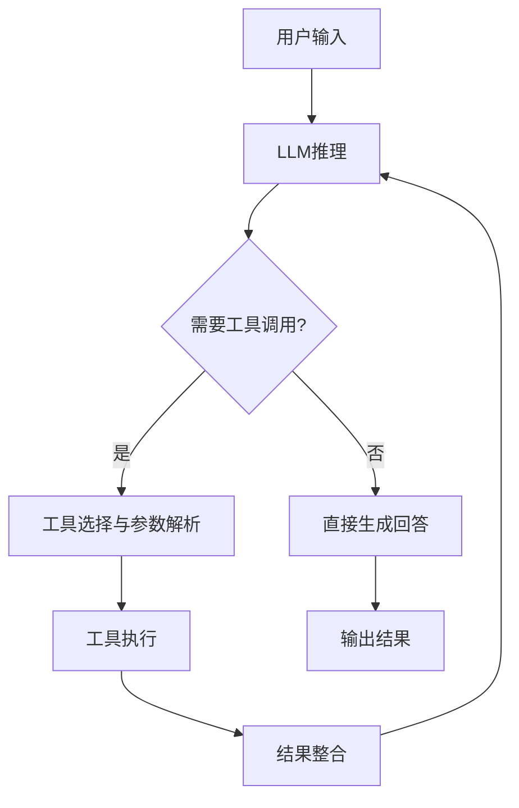

# 工具调用与MCP协议：LLM与外部世界的桥梁

## 概述与核心价值

**工具调用（Tool Calling / Function Calling）** 是大语言模型与外部世界交互的核心机制，使LLM能够执行超出其训练数据范围的操作，如查询数据库、调用API、执行计算等。**MCP（Model Context Protocol）** 是Anthropic提出的标准化协议，旨在统一LLM与工具之间的交互方式。

### 工具调用的演进历程

> [!note] 为什么需要工具调用？
> 纯LLM存在三大核心限制：
> 1. **知识时效性**：训练数据存在时间滞后
> 2. **计算能力限制**：无法执行复杂计算或实时查询
> 3. **操作能力缺失**：无法直接操作外部系统
> 
> 工具调用通过"思考-行动-观察"循环，赋予LLM动态扩展能力。

### 工具调用在LLM应用中的定位



## 工具调用基础

### 核心概念定义

**工具调用（Tool Calling）**：LLM识别用户意图，选择合适的外部工具，解析必要参数，执行工具并整合结果的过程。

**函数调用（Function Calling）**：特指通过结构化函数定义（名称、描述、参数schema）进行的工具调用。

### 典型工具调用流程

#### 四阶段流程模型

```python
# 工具调用四阶段流程伪代码
class ToolCallingPipeline:
    def __init__(self, llm, tool_registry):
        self.llm = llm
        self.tool_registry = tool_registry
    
    def execute_tool_calling(self, user_input: str) -> str:
        """执行完整的工具调用流程"""
        # 阶段1：意图识别
        intent = self.identify_intent(user_input)
        
        # 阶段2：工具选择与参数解析
        tool_call = self.select_tool_and_parse_params(intent)
        
        # 阶段3：工具执行
        tool_result = self.execute_tool(tool_call)
        
        # 阶段4：结果整合与生成
        final_response = self.integrate_result(tool_result, user_input)
        
        return final_response
    
    def identify_intent(self, user_input: str) -> Dict:
        """识别用户意图"""
        prompt = f"""
        分析用户输入的意图：
        用户输入：{user_input}
        
        请判断是否需要调用外部工具，以及需要什么类型的工具。
        """
        return self.llm.analyze_intent(prompt)
    
    def select_tool_and_parse_params(self, intent: Dict) -> Dict:
        """选择工具并解析参数"""
        # 获取可用工具列表
        available_tools = self.tool_registry.get_available_tools(intent)
        
        # 使用LLM选择最合适的工具
        selected_tool = self.llm.select_tool(available_tools, intent)
        
        # 解析工具参数
        parsed_params = self.llm.parse_tool_parameters(selected_tool, intent)
        
        return {
            "tool_name": selected_tool.name,
            "tool_params": parsed_params,
            "tool_schema": selected_tool.schema
        }
```

### 工具定义与注册

#### 工具Schema定义
```json
{
  "name": "get_weather",
  "description": "获取指定城市的天气信息",
  "parameters": {
    "type": "object",
    "properties": {
      "city": {
        "type": "string",
        "description": "城市名称，如'北京'、'上海'"
      },
      "date": {
        "type": "string",
        "description": "日期，格式为'YYYY-MM-DD'，默认为今天",
        "default": "today"
      },
      "unit": {
        "type": "string",
        "enum": ["celsius", "fahrenheit"],
        "description": "温度单位",
        "default": "celsius"
      }
    },
    "required": ["city"]
  },
  "returns": {
    "type": "object",
    "properties": {
      "temperature": {"type": "number"},
      "condition": {"type": "string"},
      "humidity": {"type": "number"},
      "wind_speed": {"type": "number"}
    }
  }
}
```

#### 工具注册机制
```python
class ToolRegistry:
    def __init__(self):
        self.tools = {}
        self.categories = {}
    
    def register_tool(self, tool: Tool):
        """注册工具"""
        # 验证工具schema
        self.validate_tool_schema(tool.schema)
        
        # 添加到注册表
        self.tools[tool.name] = tool
        
        # 按类别组织
        for category in tool.categories:
            if category not in self.categories:
                self.categories[category] = []
            self.categories[category].append(tool.name)
        
        return tool.name
    
    def get_tool_by_name(self, name: str) -> Tool:
        """按名称获取工具"""
        if name not in self.tools:
            raise ToolNotFoundError(f"工具 '{name}' 未注册")
        return self.tools[name]
    
    def get_tools_by_category(self, category: str) -> List[Tool]:
        """按类别获取工具"""
        if category not in self.categories:
            return []
        return [self.tools[name] for name in self.categories[category]]
```

## 主流工具调用范式对比

### 1. OpenAI Function Calling

**特点**：最早普及的函数调用标准，与GPT模型深度集成。

#### 实现模式
```python
# OpenAI函数调用示例
import openai

# 定义函数
functions = [
    {
        "name": "get_current_weather",
        "description": "获取当前天气",
        "parameters": {
            "type": "object",
            "properties": {
                "location": {
                    "type": "string",
                    "description": "城市和地区，例如：北京"
                },
                "unit": {"type": "string", "enum": ["celsius", "fahrenheit"]}
            },
            "required": ["location"]
        }
    }
]

# 调用GPT
response = openai.ChatCompletion.create(
    model="gpt-3.5-turbo",
    messages=[{"role": "user", "content": "北京今天天气怎么样？"}],
    functions=functions,
    function_call="auto"  # 自动决定是否调用函数
)

# 处理函数调用
if response.choices[0].message.get("function_call"):
    function_call = response.choices[0].message["function_call"]
    function_name = function_call["name"]
    function_args = json.loads(function_call["arguments"])
    
    # 执行函数
    result = execute_function(function_name, function_args)
    
    # 将结果返回给GPT
    second_response = openai.ChatCompletion.create(
        model="gpt-3.5-turbo",
        messages=[
            {"role": "user", "content": "北京今天天气怎么样？"},
            response.choices[0].message,
            {"role": "function", "name": function_name, "content": json.dumps(result)}
        ]
    )
```

**优势**：
- 与GPT模型原生集成
- 开发者生态成熟
- 文档和示例丰富

**局限**：
- 厂商锁定（仅限OpenAI）
- 协议扩展性有限
- 缺乏标准化工具发现机制

### 2. [[LangChain]] Tools

**特点**：框架级工具抽象，支持多种LLM后端。

#### LangChain工具定义
```python
from langchain.tools import BaseTool
from langchain.agents import initialize_agent
from langchain.llms import OpenAI

# 自定义工具
class WeatherTool(BaseTool):
    name = "get_weather"
    description = "获取指定城市的天气信息"
    
    def _run(self, city: str, unit: str = "celsius") -> str:
        """执行工具"""
        # 调用天气API
        weather_data = call_weather_api(city, unit)
        return f"{city}的天气：{weather_data['temperature']}°{unit}, {weather_data['condition']}"
    
    def _arun(self, city: str, unit: str = "celsius"):
        """异步执行"""
        raise NotImplementedError("此工具不支持异步执行")

# 创建代理
llm = OpenAI(temperature=0)
tools = [WeatherTool()]
agent = initialize_agent(
    tools, 
    llm, 
    agent="zero-shot-react-description",
    verbose=True
)

# 执行
result = agent.run("北京今天天气怎么样？")
```

**优势**：
- 框架无关性（支持多种LLM）
- 工具链和代理模式丰富
- 社区生态活跃

**局限**：
- 学习曲线较陡
- 性能开销较大
- 协议标准化程度有限

### 3. Ollama Tool Protocol

**特点**：专为本地LLM设计的轻量级工具协议。

#### Ollama工具配置
```json
{
  "tools": [
    {
      "type": "function",
      "function": {
        "name": "calculator",
        "description": "执行数学计算",
        "parameters": {
          "type": "object",
          "properties": {
            "expression": {
              "type": "string",
              "description": "数学表达式，如'2 + 3 * 4'"
            }
          },
          "required": ["expression"]
        }
      }
    }
  ]
}
```

**优势**：
- 轻量级，适合本地部署
- 与Ollama生态深度集成
- 配置简单

**局限**：
- 功能相对基础
- 生态系统较小
- 企业级特性有限

### 4. **MCP（Model Context Protocol）**

**特点**：标准化、可扩展、厂商中立的工具协议。

#### MCP核心设计原则
1. **标准化**：统一的工具描述和调用格式
2. **可扩展**：支持动态工具发现和注册
3. **安全性**：内置权限控制和沙箱执行
4. **互操作性**：跨平台、跨厂商兼容

## MCP协议详解

### 设计动机与核心价值

> [!note] MCP解决的核心问题
> 1. **碎片化问题**：不同厂商、不同框架的工具调用方式各异
> 2. **安全挑战**：缺乏统一的权限控制和执行隔离
> 3. **发现困难**：工具难以被LLM动态发现和理解
> 4. **组合复杂**：工具间难以协同工作

### 核心组件架构

#### 1. Context（上下文）
```json
{
  "context": {
    "id": "session-12345",
    "model": "claude-3-opus",
    "capabilities": ["tools", "files", "search"],
    "metadata": {
      "user_id": "user-001",
      "environment": "production",
      "permissions": ["read:weather", "write:notes"]
    }
  }
}
```

#### 2. Capabilities（能力）
```json
{
  "capabilities": {
    "tools": {
      "supported": true,
      "max_concurrent": 5,
      "timeout_ms": 30000
    },
    "files": {
      "supported": true,
      "max_size_mb": 10,
      "allowed_types": ["txt", "pdf", "json"]
    },
    "search": {
      "supported": true,
      "providers": ["google", "duckduckgo"]
    }
  }
}
```

#### 3. Tool Schema（工具模式）
```json
{
  "tool": {
    "name": "database_query",
    "version": "1.0.0",
    "description": "执行数据库查询",
    "input_schema": {
      "type": "object",
      "properties": {
        "query": {"type": "string"},
        "database": {"type": "string", "enum": ["users", "products"]},
        "limit": {"type": "integer", "minimum": 1, "maximum": 100}
      },
      "required": ["query", "database"]
    },
    "output_schema": {
      "type": "array",
      "items": {"type": "object"}
    },
    "security": {
      "required_permissions": ["read:database"],
      "rate_limit": "10/minute",
      "sandboxed": true
    }
  }
}
```

#### 4. Invocation（调用）
```json
{
  "invocation": {
    "id": "invoke-001",
    "tool": "database_query",
    "arguments": {
      "query": "SELECT * FROM users WHERE age > 18",
      "database": "users",
      "limit": 10
    },
    "context": {
      "session_id": "session-12345",
      "request_id": "req-67890"
    }
  }
}
```

### 通信机制

#### 请求-响应模式
```python
# MCP客户端实现
class MCPClient:
    def __init__(self, server_url, api_key=None):
        self.server_url = server_url
        self.api_key = api_key
        self.session_id = self.create_session()
    
    def create_session(self) -> str:
        """创建MCP会话"""
        request = {
            "action": "create_session",
            "model": "claude-3-opus",
            "capabilities": ["tools", "files"]
        }
        
        response = self._send_request("sessions", request)
        return response["session_id"]
    
    def list_tools(self) -> List[Dict]:
        """列出可用工具"""
        request = {
            "action": "list_tools",
            "session_id": self.session_id
        }
        
        response = self._send_request("tools", request)
        return response["tools"]
    
    def invoke_tool(self, tool_name: str, arguments: Dict) -> Dict:
        """调用工具"""
        request = {
            "action": "invoke",
            "session_id": self.session_id,
            "tool": tool_name,
            "arguments": arguments
        }
        
        response = self._send_request("invocations", request)
        return response["result"]
    
    def _send_request(self, endpoint: str, data: Dict) -> Dict:
        """发送HTTP请求"""
        headers = {"Content-Type": "application/json"}
        if self.api_key:
            headers["Authorization"] = f"Bearer {self.api_key}"
        
        response = requests.post(
            f"{self.server_url}/{endpoint}",
            json=data,
            headers=headers
        )
        
        if response.status_code != 200:
            raise MCPError(f"MCP请求失败: {response.text}")
        
        return response.json()
```

#### 流式响应支持
```python
# MCP流式响应处理
def stream_tool_invocation(tool_name: str, arguments: Dict):
    """处理流式工具调用"""
    request = {
        "action": "invoke_stream",
        "tool": tool_name,
        "arguments": arguments,
        "stream": True
    }
    
    with requests.post(f"{self.server_url}/invocations/stream", 
                      json=request, 
                      stream=True) as response:
        
        for line in response.iter_lines():
            if line:
                chunk = json.loads(line.decode('utf-8'))
                
                if chunk.get("type") == "progress":
                    # 处理进度更新
                    yield {"type": "progress", "data": chunk["data"]}
                elif chunk.get("type") == "result":
                    # 处理最终结果
                    yield {"type": "result", "data": chunk["data"]}
                elif chunk.get("type") == "error":
                    # 处理错误
                    raise MCPError(chunk["message"])
```

### 安全模型

#### 权限控制
```python
# MCP权限管理系统
class MCPSecurityManager:
    def __init__(self):
        self.permission_matrix = self.load_permission_matrix()
        self.audit_logger = AuditLogger()
    
    def check_permission(self, session: Dict, tool: Dict, action: str) -> bool:
        """检查权限"""
        # 1. 检查会话权限
        session_permissions = session.get("metadata", {}).get("permissions", [])
        required_permissions = tool.get("security", {}).get("required_permissions", [])
        
        for perm in required_permissions:
            if perm not in session_permissions:
                self.audit_logger.log_denied(session["id"], tool["name"], perm)
                return False
        
        # 2. 检查速率限制
        if not self.check_rate_limit(session["id"], tool["name"]):
            self.audit_logger.log_rate_limit(session["id"], tool["name"])
            return False
        
        # 3. 检查资源配额
        if not self.check_resource_quota(session["id"], tool["name"]):
            self.audit_logger.log_quota_exceeded(session["id"], tool["name"])
            return False
        
        return True
    
    def execute_in_sandbox(self, tool_name: str, code: str, timeout: int = 30):
        """在沙箱中执行工具代码"""
        sandbox_config = {
            "timeout": timeout,
            "memory_limit": "256MB",
            "network_access": False,
            "filesystem_access": "readonly",
            "allowed_imports": ["math", "datetime", "json"]
        }
        
        return SandboxExecutor.execute(code, sandbox_config)
```

## 工程实现与最佳实践

### 工具注册与发现

#### 动态工具注册
```python
# MCP工具服务器实现
class MCPServer:
    def __init__(self):
        self.tools = {}
        self.sessions = {}
    
    def register_tool(self, tool: Dict):
        """注册工具"""
        # 验证工具schema
        self.validate_tool_schema(tool)
        
        # 生成工具ID
        tool_id = f"{tool['name']}-{tool.get('version', '1.0.0')}"
        
        # 添加到注册表
        self.tools[tool_id] = {
            **tool,
            "id": tool_id,
            "registered_at": datetime.now().isoformat(),
            "invocation_count": 0
        }
        
        # 广播工具更新
        self.broadcast_tool_update(tool_id, "registered")
        
        return tool_id
    
    def discover_tools(self, session_id: str, filters: Dict = None) -> List[Dict]:
        """发现可用工具"""
        session = self.sessions.get(session_id)
        if not session:
            raise SessionNotFoundError(f"会话 {session_id} 不存在")
        
        available_tools = []
        
        for tool_id, tool in self.tools.items():
            # 检查权限
            if not self.check_tool_access(session, tool):
                continue
            
            # 应用过滤器
            if filters and not self.apply_filters(tool, filters):
                continue
            
            available_tools.append({
                "id": tool_id,
                "name": tool["name"],
                "description": tool["description"],
                "categories": tool.get("categories", []),
                "input_schema": tool["input_schema"],
                "output_schema": tool["output_schema"]
            })
        
        return available_tools
```

### 参数验证与错误处理

#### 参数验证框架
```python
class ParameterValidator:
    def __init__(self):
        self.validators = {
            "string": self.validate_string,
            "number": self.validate_number,
            "integer": self.validate_integer,
            "boolean": self.validate_boolean,
            "array": self.validate_array,
            "object": self.validate_object
        }
    
    def validate_parameters(self, schema: Dict, parameters: Dict) -> Dict:
        """验证参数"""
        errors = []
        validated_params = {}
        
        # 检查必需参数
        required_params = schema.get("required", [])
        for param in required_params:
            if param not in parameters:
                errors.append(f"必需参数 '{param}' 缺失")
        
        # 验证每个参数
        properties = schema.get("properties", {})
        for param_name, param_value in parameters.items():
            if param_name not in properties:
                # 允许额外参数（根据additionalProperties配置）
                if not schema.get("additionalProperties", False):
                    errors.append(f"未知参数 '{param_name}'")
                continue
            
            param_schema = properties[param_name]
            param_type = param_schema.get("type")
            
            if param_type in self.validators:
                try:
                    validated_value = self.validators[param_type](
                        param_value, param_schema
                    )
                    validated_params[param_name] = validated_value
                except ValidationError as e:
                    errors.append(f"参数 '{param_name}' 验证失败: {str(e)}")
            else:
                errors.append(f"参数 '{param_name}' 类型 '{param_type}' 不支持")
        
        if errors:
            raise ValidationError(f"参数验证失败: {', '.join(errors)}")
        
        return validated_params
    
    def validate_string(self, value, schema: Dict):
        """验证字符串参数"""
        if not isinstance(value, str):
            raise ValidationError(f"期望字符串，得到 {type(value).__name__}")
        
        # 检查枚举值
        enum_values = schema.get("enum")
        if enum_values and value not in enum_values:
            raise ValidationError(f"值 '{value}' 不在允许的枚举值中: {enum_values}")
        
        # 检查最小/最大长度
        min_length = schema.get("minLength")
        max_length = schema.get("maxLength")
        
        if min_length is not None and len(value) < min_length:
            raise ValidationError(f"字符串长度必须至少为 {min_length}")
        
        if max_length is not None and len(value) > max_length:
            raise ValidationError(f"字符串长度不能超过 {max_length}")
        
        # 检查正则表达式模式
        pattern = schema.get("pattern")
        if pattern and not re.match(pattern, value):
            raise ValidationError(f"字符串不匹配模式: {pattern}")
        
        return value
```

#### 错误处理策略
```python
class ToolErrorHandler:
    def __init__(self):
        self.error_mapping = {
            "validation_error": {"code": 400, "message": "参数验证失败"},
            "permission_denied": {"code": 403, "message": "权限不足"},
            "rate_limit_exceeded": {"code": 429, "message": "请求过于频繁"},
            "tool_not_found": {"code": 404, "message": "工具不存在"},
            "execution_timeout": {"code": 408, "message": "工具执行超时"},
            "internal_error": {"code": 500, "message": "内部服务器错误"}
        }
    
    def handle_error(self, error_type: str, details: Dict = None) -> Dict:
        """处理错误"""
        error_info = self.error_mapping.get(
            error_type, 
            self.error_mapping["internal_error"]
        )
        
        response = {
            "error": {
                "code": error_info["code"],
                "type": error_type,
                "message": error_info["message"]
            }
        }
        
        if details:
            response["error"]["details"] = details
        
        # 记录错误日志
        self.log_error(error_type, details)
        
        return response
    
    def wrap_tool_execution(self, tool_func, *args, **kwargs):
        """包装工具执行，提供错误处理"""
        try:
            # 执行前检查
            self.pre_execution_checks()
            
            # 执行工具
            result = tool_func(*args, **kwargs)
            
            # 执行后处理
            self.post_execution_checks(result)
            
            return {
                "success": True,
                "result": result,
                "execution_time": self.get_execution_time()
            }
            
        except ValidationError as e:
            return self.handle_error("validation_error", {"details": str(e)})
        except PermissionError as e:
            return self.handle_error("permission_denied", {"details": str(e)})
        except TimeoutError as e:
            return self.handle_error("execution_timeout", {"details": str(e)})
        except Exception as e:
            return self.handle_error("internal_error", {"details": str(e)})
```

### 生产环境最佳实践

#### 1. 沙箱执行环境
```python
class ToolSandbox:
    def __init__(self):
        self.isolation_levels = {
            "low": self.low_isolation,
            "medium": self.medium_isolation,
            "high": self.high_isolation
        }
    
    def execute_with_isolation(self, tool_code: str, isolation_level: str = "medium"):
        """在隔离环境中执行工具代码"""
        isolation_func = self.isolation_levels.get(isolation_level, self.medium_isolation)
        
        # 创建隔离环境
        with isolation_func():
            # 执行工具代码
            result = self.execute_code(tool_code)
            
            # 清理资源
            self.cleanup_resources()
            
            return result
    
    def high_isolation(self):
        """高级隔离：完全沙箱"""
        # 使用Docker容器或虚拟机
        return DockerSandbox(
            memory_limit="512MB",
            cpu_limit="0.5",
            network_access=False,
            read_only_filesystem=True
        )
    
    def medium_isolation(self):
        """中级隔离：进程隔离"""
        # 使用subprocess或multiprocessing
        return ProcessSandbox(
            timeout=30,
            memory_limit="256MB",
            allowed_syscalls=["read", "write", "open", "close"]
        )
    
    def low_isolation(self):
        """低级隔离：线程隔离"""
        # 使用线程和资源限制
        return ThreadSandbox(
            timeout=10,
            memory_monitor=True
        )
```

#### 2. 监控与可观测性
```python
class ToolMonitoring:
    def __init__(self):
        self.metrics = {
            "invocation_count": Counter("tool_invocations_total"),
            "invocation_duration": Histogram("tool_invocation_duration_seconds"),
            "error_count": Counter("tool_errors_total"),
            "concurrent_invocations": Gauge("tool_concurrent_invocations")
        }
        
        self.tracing = OpenTelemetryTracer()
    
    def instrument_tool(self, tool_func):
        """为工具添加监控"""
        @wraps(tool_func)
        def instrumented_func(*args, **kwargs):
            # 开始跟踪
            with self.tracing.start_span(f"tool.{tool_func.__name__}"):
                # 记录指标
                self.metrics["concurrent_invocations"].inc()
                start_time = time.time()
                
                try:
                    # 执行工具
                    result = tool_func(*args, **kwargs)
                    
                    # 记录成功指标
                    duration = time.time() - start_time
                    self.metrics["invocation_count"].inc()
                    self.metrics["invocation_duration"].observe(duration)
                    
                    return result
                    
                except Exception as e:
                    # 记录错误指标
                    self.metrics["error_count"].inc()
                    self.tracing.record_exception(e)
                    raise
                    
                finally:
                    # 清理
                    self.metrics["concurrent_invocations"].dec()
        
        return instrumented_func
    
    def create_dashboard(self):
        """创建监控仪表板"""
        return {
            "metrics": [
                {
                    "name": "工具调用QPS",
                    "query": "rate(tool_invocations_total[5m])",
                    "panel_type": "graph"
                },
                {
                    "name": "平均响应时间",
                    "query": "rate(tool_invocation_duration_seconds_sum[5m]) / rate(tool_invocation_duration_seconds_count[5m])",
                    "panel_type": "graph"
                },
                {
                    "name": "错误率",
                    "query": "rate(tool_errors_total[5m]) / rate(tool_invocations_total[5m])",
                    "panel_type": "gauge"
                }
            ],
            "alerts": [
                {
                    "name": "高错误率",
                    "condition": "tool_errors_total / tool_invocations_total > 0.05",
                    "severity": "critical"
                },
                {
                    "name": "响应时间过长",
                    "condition": "tool_invocation_duration_seconds > 10",
                    "severity": "warning"
                }
            ]
        }
```

#### 3. 缓存与性能优化
```python
class ToolCache:
    def __init__(self, max_size=1000, ttl=300):
        self.cache = LRUCache(max_size=max_size)
        self.ttl = ttl  # 缓存存活时间（秒）
    
    def get_cache_key(self, tool_name: str, arguments: Dict) -> str:
        """生成缓存键"""
        # 规范化参数（排序、移除None值等）
        normalized_args = self.normalize_arguments(arguments)
        
        # 生成哈希
        args_hash = hashlib.md5(
            json.dumps(normalized_args, sort_keys=True).encode()
        ).hexdigest()
        
        return f"{tool_name}:{args_hash}"
    
    def execute_with_cache(self, tool_func, tool_name: str, arguments: Dict):
        """带缓存的工具执行"""
        cache_key = self.get_cache_key(tool_name, arguments)
        
        # 检查缓存
        cached_result = self.cache.get(cache_key)
        if cached_result:
            return {
                "cached": True,
                "result": cached_result["result"],
                "cached_at": cached_result["cached_at"]
            }
        
        # 执行工具
        start_time = time.time()
        result = tool_func(**arguments)
        execution_time = time.time() - start_time
        
        # 缓存结果（如果适合缓存）
        if self.should_cache_result(tool_name, result, execution_time):
            self.cache.set(
                cache_key,
                {
                    "result": result,
                    "cached_at": datetime.now().isoformat(),
                    "execution_time": execution_time
                },
                ttl=self.ttl
            )
        
        return {
            "cached": False,
            "result": result,
            "execution_time": execution_time
        }
    
    def should_cache_result(self, tool_name: str, result: Any, execution_time: float) -> bool:
        """判断是否应该缓存结果"""
        # 基于工具类型、执行时间、结果大小等因素决定
        cacheable_tools = ["weather", "calculator", "unit_converter"]
        
        if tool_name not in cacheable_tools:
            return False
        
        # 执行时间超过阈值才缓存
        if execution_time < 0.1:  # 100ms
            return False
        
        # 结果大小限制
        result_size = len(str(result))
        if result_size > 1024 * 1024:  # 1MB
            return False
        
        return True
```

## 常见工程挑战与应对策略

### 1. 参数幻觉（Parameter Hallucination）

**问题**：LLM生成不存在或错误的工具参数。

**缓解策略**：
```python
def mitigate_parameter_hallucination(tool_schema: Dict, llm_output: Dict):
    """缓解参数幻觉"""
    # 1. Schema验证
    validated_params = validate_against_schema(tool_schema, llm_output)
    
    # 2. 默认值填充
    filled_params = fill_default_values(tool_schema, validated_params)
    
    # 3. 参数合理性检查
    if not check_parameter_sanity(filled_params):
        # 使用更保守的参数或请求用户澄清
        return get_safe_default_parameters(tool_schema)
    
    # 4. 执行前确认（可选）
    if requires_confirmation(filled_params):
        return request_user_confirmation(filled_params)
    
    return filled_params
```

### 2. 类型校验失败

**问题**：LLM生成的参数类型与schema不匹配。

**解决方案**：
```python
class TypeCoercion:
    def coerce_parameter(self, param_name: str, param_value: Any, expected_type: str):
        """类型强制转换"""
        try:
            if expected_type == "string":
                return str(param_value)
            elif expected_type == "integer":
                return int(float(param_value))  # 处理"3.0" -> 3
            elif expected_type == "number":
                return float(param_value)
            elif expected_type == "boolean":
                return self.coerce_to_boolean(param_value)
            elif expected_type == "array":
                return self.coerce_to_array(param_value)
            elif expected_type == "object":
                return self.coerce_to_object(param_value)
        except (ValueError, TypeError):
            raise TypeCoercionError(
                f"无法将参数 '{param_name}' 的值 '{param_value}' 转换为类型 '{expected_type}'"
            )
    
    def coerce_to_boolean(self, value: Any) -> bool:
        """强制转换为布尔值"""
        if isinstance(value, bool):
            return value
        elif isinstance(value, str):
            lower_val = value.lower()
            if lower_val in ["true", "yes", "1", "on"]:
                return True
            elif lower_val in ["false", "no", "0", "off"]:
                return False
        elif isinstance(value, (int, float)):
            return bool(value)
        
        raise TypeCoercionError(f"无法将值 '{value}' 转换为布尔值")
```

### 3. 工具执行超时

**问题**：工具执行时间过长，影响用户体验。

**处理策略**：
```python
class TimeoutManager:
    def __init__(self, default_timeout=30):
        self.default_timeout = default_timeout
        self.timeout_configs = {
            "weather": 5,
            "calculator": 2,
            "database_query": 10,
            "web_search": 15
        }
    
    def execute_with_timeout(self, tool_func, tool_name: str, *args, **kwargs):
        """带超时的工具执行"""
        timeout = self.timeout_configs.get(tool_name, self.default_timeout)
        
        # 使用线程或进程实现超时
        with ThreadPoolExecutor(max_workers=1) as executor:
            future = executor.submit(tool_func, *args, **kwargs)
            
            try:
                result = future.result(timeout=timeout)
                return {"success": True, "result": result}
                
            except TimeoutError:
                # 取消任务
                future.cancel()
                
                # 记录超时
                self.log_timeout(tool_name, timeout)
                
                return {
                    "success": False,
                    "error": "timeout",
                    "message": f"工具 '{tool_name}' 执行超时（{timeout}秒）"
                }
                
            except Exception as e:
                return {
                    "success": False,
                    "error": "execution_error",
                    "message": str(e)
                }
    
    def adaptive_timeout(self, tool_name: str, historical_data: List[float]):
        """自适应超时设置"""
        if not historical_data:
            return self.timeout_configs.get(tool_name, self.default_timeout)
        
        # 基于历史执行时间计算超时
        avg_time = np.mean(historical_data)
        std_time = np.std(historical_data)
        
        # 设置超时为平均值 + 3倍标准差，但不超过最大值
        calculated_timeout = avg_time + 3 * std_time
        max_timeout = self.timeout_configs.get(tool_name, self.default_timeout) * 2
        
        return min(calculated_timeout, max_timeout)
```

### 4. 工具组合与编排

**问题**：多个工具需要协同工作完成复杂任务。

**解决方案**：
```python
class ToolOrchestrator:
    def __init__(self, tool_registry):
        self.tool_registry = tool_registry
        self.workflow_engine = WorkflowEngine()
    
    def execute_workflow(self, workflow_def: Dict, initial_input: Dict):
        """执行工具工作流