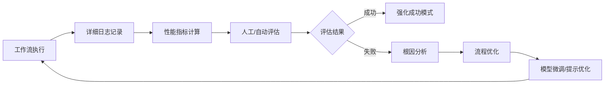
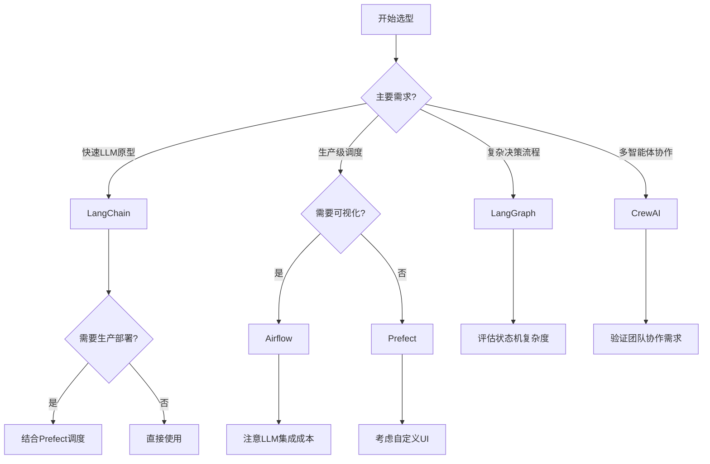
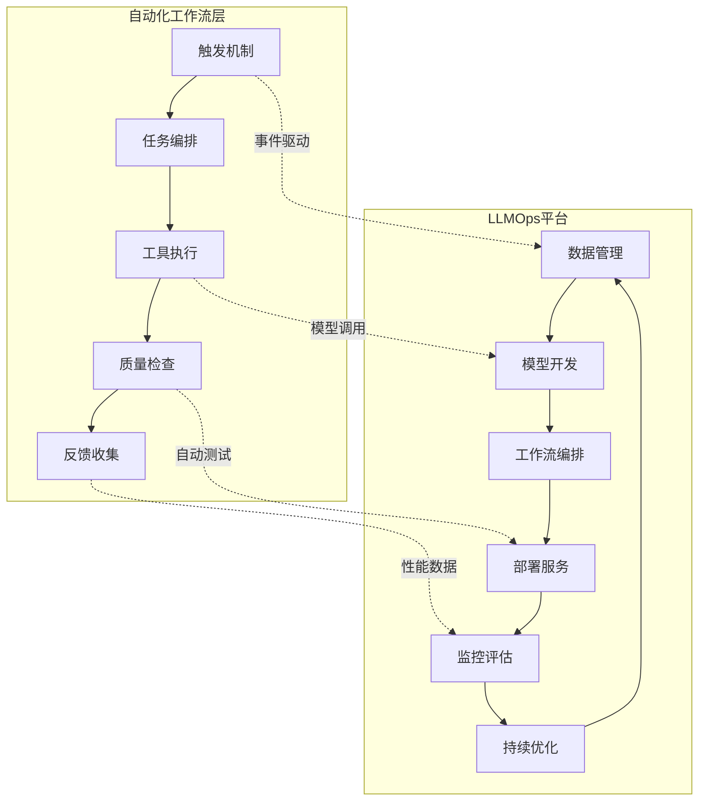
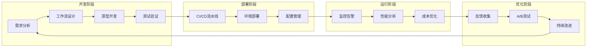
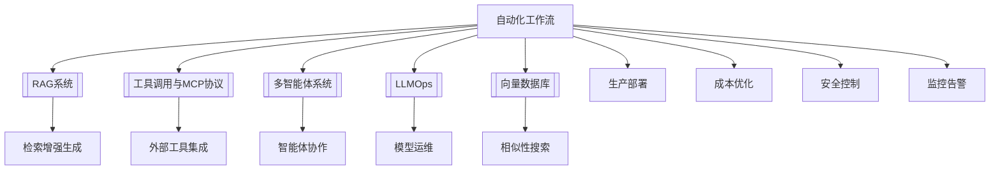

# 自动化工作流：LLM驱动的智能流程引擎

%% 本文档系统阐述LLM自动化工作流的核心架构、实现模式与最佳实践，为AI工程团队提供从设计到部署的完整参考 %%

## 概述：为什么需要LLM自动化工作流？

在[[RAG系统]]和[[工具调用与MCP协议]]基础上，自动化工作流将离散的LLM能力整合为**端到端的业务流程**，实现：

- **效率提升**：自动化重复性认知任务，释放人力专注创造性工作
- **可靠性增强**：通过标准化流程减少人为错误，确保结果一致性
- **业务闭环**：从数据输入到决策输出的完整自动化链路
- **可观测性**：全流程监控、日志记录与性能分析

^overview

### 核心价值主张

1. **规模化智能**：将单次LLM调用扩展为可重复、可监控的生产流程
2. **复杂任务分解**：通过[[多智能体系统]]协作解决超出单一模型能力的问题
3. **自适应优化**：基于[[数据回流与反馈闭环]]持续改进流程效果
4. **成本可控**：通过[[缓存策略]]和[[token监控]]实现经济高效的自动化

## 一、系统架构：LLM自动化工作流的核心组件

### 1.1 触发机制（Trigger Mechanisms）

自动化工作流的启动点，决定何时以及如何启动流程：

```python
# 触发机制类型定义
class TriggerMechanism:
    # 事件驱动：响应外部系统事件
    EVENT_DRIVEN = "event_driven"  # 如Webhook、消息队列
    SCHEDULED = "scheduled"        # 定时任务（cron表达式）
    API_CALL = "api_call"          # REST/GraphQL接口调用
    MANUAL = "manual"              # 人工触发
    CONDITIONAL = "conditional"    # 条件满足时触发
```

#### 1.1.1 事件驱动模式
- **Webhook监听**：监听GitHub PR、Jira工单、Slack消息等
- **消息队列集成**：Kafka、RabbitMQ、AWS SQS事件消费
- **数据库变更捕获**：CDC（Change Data Capture）触发工作流

#### 1.1.2 定时调度模式
- **Cron表达式**：固定时间间隔执行
- **动态调度**：基于业务负载或资源可用性调整执行时间
- **依赖触发**：等待前置任务完成后再启动

#### 1.1.3 API调用模式
- **同步API**：立即执行并返回结果
- **异步API**：提交任务后轮询状态
- **批量API**：一次性处理多个请求

### 1.2 编排框架（Orchestration Frameworks）

工作流的核心调度引擎，负责任务执行顺序、状态管理和错误处理：

| 框架 | 核心特性 | 适用场景 | LLM集成成熟度 |
|------|----------|----------|---------------|
| [[LangChain]] | 链式执行、工具调用、记忆管理 | 快速原型、复杂LLM流程 | ⭐⭐⭐⭐⭐ |
| [[LlamaIndex]] | 数据连接器、检索增强、结构化输出 | RAG密集型工作流 | ⭐⭐⭐⭐ |
| Prefect | 声明式工作流、动态DAG、强大调度 | 生产级数据管道 | ⭐⭐⭐ |
| Airflow | 成熟生态、社区支持、可视化 | 传统ETL与ML管道 | ⭐⭐ |
| Dagster | 资产中心、类型安全、测试友好 | 数据平台与MLOps | ⭐⭐⭐ |
| LangGraph | 状态机、循环控制、多智能体 | 复杂决策流程 | ⭐⭐⭐⭐ |
| CrewAI | 角色定义、任务委派、协作优化 | 多智能体团队协作 | ⭐⭐⭐⭐ |

### 1.3 工具调用与外部集成

基于[[工具调用与MCP协议]]，工作流需要与外部系统深度集成：

```python
# 工具注册与发现框架
class ToolRegistry:
    def __init__(self):
        self.tools = {}
        self.mcp_servers = []  # MCP协议服务器
        
    def register_tool(self, name: str, func: Callable, schema: Dict):
        """注册工具到工作流"""
        self.tools[name] = {
            "function": func,
            "schema": schema,
            "permissions": self._validate_permissions(schema)
        }
    
    def discover_mcp_tools(self, server_url: str):
        """通过MCP协议发现远程工具"""
        # 实现MCP协议握手与工具发现
        pass
```

#### 集成模式分类：
1. **数据源集成**：数据库、API、文件系统、消息队列
2. **计算服务集成**：云函数、容器服务、批处理作业
3. **AI服务集成**：多个LLM提供商、向量数据库、模型服务
4. **业务系统集成**：CRM、ERP、客服系统、财务系统

### 1.4 多智能体协作流程

复杂任务通过[[多智能体系统]]分解与协作完成：

```python
# 多智能体工作流定义
class MultiAgentWorkflow:
    def __init__(self):
        self.agents = {
            "planner": PlannerAgent(),      # 规划智能体
            "researcher": ResearchAgent(),   # 研究智能体  
            "writer": WriterAgent(),        # 写作智能体
            "reviewer": ReviewerAgent(),    # 审核智能体
            "executor": ExecutorAgent()     # 执行智能体
        }
        self.coordination_strategy = "hierarchical"  # 协作策略
    
    def execute_task(self, task_description: str):
        """执行多智能体协作任务"""
        # 1. 任务分解
        subtasks = self.agents["planner"].decompose_task(task_description)
        
        # 2. 智能体分配与执行
        results = {}
        for subtask in subtasks:
            assigned_agent = self._assign_agent(subtask)
            results[subtask.id] = assigned_agent.execute(subtask)
        
        # 3. 结果整合
        final_result = self.agents["reviewer"].synthesize(results)
        return final_result
```

#### 协作模式：
- **层级式**：主智能体协调子智能体（如Microsoft AutoGen）
- **对等式**：智能体平等协作，通过共识机制决策
- **市场式**：智能体竞标任务，最优者执行
- **流水线式**：智能体按顺序处理任务不同阶段

### 1.5 数据回流与反馈闭环

工作流的自我优化机制，实现[[持续学习]]与[[自适应优化]]：



#### 反馈收集维度：
1. **执行指标**：成功率、延迟、成本、token使用
2. **质量指标**：准确性、相关性、完整性、一致性
3. **业务指标**：转化率、满意度、问题解决率
4. **安全指标**：合规性检查、敏感信息泄露、滥用检测

### 1.6 异常处理与可观测性

生产环境工作流必须包含完善的[[错误处理]]和[[监控体系]]：

```python
# 工作流异常处理框架
class WorkflowExceptionHandler:
    def __init__(self):
        self.retry_policies = {
            "transient": ExponentialBackoffRetry(max_retries=3),
            "permanent": NoRetry(),
            "conditional": ConditionalRetry(condition_checker)
        }
        self.circuit_breakers = {}  # 熔断器模式
        self.fallback_strategies = {}  # 降级策略
    
    def handle_exception(self, exception: Exception, context: Dict):
        """处理工作流执行异常"""
        exception_type = self._classify_exception(exception)
        
        if exception_type == "transient":
            # 可重试异常（网络超时、限流等）
            return self._apply_retry_policy("transient", context)
        elif exception_type == "llm_specific":
            # LLM特定异常（内容过滤、token超限等）
            return self._handle_llm_exception(exception, context)
        elif exception_type == "business_logic":
            # 业务逻辑异常
            return self._apply_fallback_strategy(context)
        else:
            # 不可恢复异常
            return self._escalate_to_human(context)
```

#### 可观测性三支柱：
1. **日志（Logging）**：结构化日志、请求追踪、审计轨迹
2. **指标（Metrics）**：性能指标、业务指标、成本指标
3. **追踪（Tracing）**：分布式追踪、调用链分析、瓶颈定位

## 二、实用场景与实现模式

### 2.1 典型场景示例

#### 场景1：自动客服工单处理系统

```python
# 客服工单自动化处理工作流
class CustomerTicketWorkflow:
    def __init__(self):
        self.llm_engine = LLMEngine(model="gpt-4")
        self.ticket_db = TicketDatabase()
        self.knowledge_base = RAGSystem()
        
    def process_ticket(self, ticket_id: str):
        """处理客服工单的完整工作流"""
        # 1. 工单分类与优先级判定
        ticket = self.ticket_db.get_ticket(ticket_id)
        classification = self._classify_ticket(ticket)
        
        # 2. 知识检索与解决方案生成
        if classification["needs_research"]:
            relevant_knowledge = self.knowledge_base.retrieve(
                query=ticket.description,
                top_k=5
            )
            solution = self.llm_engine.generate_solution(
                ticket=ticket,
                knowledge=relevant_knowledge
            )
        else:
            # 3. 标准流程处理
            solution = self._apply_standard_workflow(classification)
        
        # 4. 回复生成与质量检查
        response = self.llm_engine.generate_response(
            solution=solution,
            tone=classification["customer_tone"]
        )
        
        # 5. 自动执行或人工审核
        if classification["confidence"] > 0.8:
            self._auto_execute_solution(solution, ticket)
        else:
            self._escalate_to_human_agent(ticket, solution)
        
        # 6. 反馈收集与优化
        self._collect_feedback(ticket, solution)
        return response
```

#### 场景2：日报生成与邮件分发流水线

```python
# 自动化日报生成工作流
class DailyReportWorkflow:
    def __init__(self):
        self.data_sources = {
            "jira": JiraIntegration(),
            "github": GitHubIntegration(),
            "slack": SlackIntegration(),
            "metrics": MetricsCollector()
        }
        self.report_generator = ReportGenerator()
        self.distribution_engine = DistributionEngine()
        
    def generate_daily_report(self, team: str, date: str):
        """生成团队日报的完整工作流"""
        # 1. 多源数据收集
        data_points = []
        for source_name, source in self.data_sources.items():
            data = source.collect_daily_data(team=team, date=date)
            data_points.extend(data)
        
        # 2. 数据清洗与聚合
        cleaned_data = self._clean_and_aggregate(data_points)
        
        # 3. 关键洞察提取（LLM驱动）
        insights = self.llm_engine.extract_insights(
            data=cleaned_data,
            context={"team": team, "date": date}
        )
        
        # 4. 报告生成（结构化+自然语言）
        report = self.report_generator.generate(
            data=cleaned_data,
            insights=insights,
            template="daily_report"
        )
        
        # 5. 个性化分发
        recipients = self._get_recipients(team)
        for recipient in recipients:
            personalized_report = self._personalize_report(report, recipient)
            self.distribution_engine.distribute(
                recipient=recipient,
                content=personalized_report,
                channel=recipient.preferred_channel
            )
        
        # 6. 效果追踪
        self._track_engagement(report_id=report.id)
        return report
```

#### 场景3：RAG知识更新流水线

```python
# 自动化知识库更新工作流
class KnowledgeUpdateWorkflow:
    def __init__(self):
        self.content_sources = ContentSourceManager()
        self.processor = DocumentProcessor()
        self.vector_db = VectorDatabase()
        self.quality_checker = QualityChecker()
        
    def update_knowledge_base(self, source_type: str):
        """自动化知识库更新流程"""
        # 1. 内容源监控与发现
        new_content = self.content_sources.monitor(source_type)
        
        # 2. 文档处理流水线
        processed_docs = []
        for doc in new_content:
            # 2.1 格式标准化
            standardized = self.processor.standardize_format(doc)
            
            # 2.2 内容提取与分块
            chunks = self.processor.chunk_document(standardized)
            
            # 2.3 元数据增强
            enriched_chunks = self.processor.enrich_metadata(chunks)
            
            # 2.4 质量过滤
            filtered_chunks = self.quality_checker.filter_low_quality(enriched_chunks)
            
            processed_docs.extend(filtered_chunks)
        
        # 3. 向量化与索引更新
        if processed_docs:
            embeddings = self.vector_db.generate_embeddings(processed_docs)
            self.vector_db.update_index(
                documents=processed_docs,
                embeddings=embeddings
            )
            
            # 4. 索引优化与压缩
            self.vector_db.optimize_index()
            
            # 5. 验证与回滚机制
            validation_result = self._validate_update()
            if not validation_result["success"]:
                self._rollback_update()
                raise UpdateValidationError(validation_result["errors"])
        
        # 6. 更新通知与监控
        self._notify_stakeholders(len(processed_docs))
        return {"updated_count": len(processed_docs)}
```

### 2.2 编排方案对比与选型指南

%% 以下对比基于2024-2025年工业界实践与社区反馈 %%

| 维度 | LangChain | Prefect | Airflow | LangGraph | CrewAI |
|------|-----------|---------|---------|-----------|---------|
| **LLM原生支持** | ⭐⭐⭐⭐⭐ | ⭐⭐ | ⭐ | ⭐⭐⭐⭐ | ⭐⭐⭐⭐⭐ |
| **可视化界面** | ⭐⭐ | ⭐⭐⭐⭐ | ⭐⭐⭐⭐⭐ | ⭐⭐ | ⭐⭐⭐ |
| **调度能力** | ⭐⭐ | ⭐⭐⭐⭐⭐ | ⭐⭐⭐⭐⭐ | ⭐⭐⭐ | ⭐⭐ |
| **错误处理** | ⭐⭐⭐ | ⭐⭐⭐⭐⭐ | ⭐⭐⭐⭐ | ⭐⭐⭐ | ⭐⭐ |
| **多智能体支持** | ⭐⭐⭐ | ⭐ | ⭐ | ⭐⭐⭐⭐ | ⭐⭐⭐⭐⭐ |
| **学习曲线** | 中等 | 中等 | 高 | 中等 | 低 |
| **生产就绪度** | ⭐⭐⭐ | ⭐⭐⭐⭐⭐ | ⭐⭐⭐⭐⭐ | ⭐⭐⭐ | ⭐⭐ |
| **社区生态** | ⭐⭐⭐⭐⭐ | ⭐⭐⭐⭐ | ⭐⭐⭐⭐⭐ | ⭐⭐⭐ | ⭐⭐ |

#### 选型决策树：



### 2.3 可复用流程模板

#### 模板1：通用LLM工作流状态机

```python
# 基于状态机的工作流模板
class LLMWorkflowStateMachine:
    STATES = {
        "INITIALIZED": "工作流已初始化",
        "DATA_COLLECTING": "数据收集中",
        "LLM_PROCESSING": "LLM处理中",
        "TOOL_EXECUTING": "工具执行中",
        "VALIDATING": "结果验证中",
        "COMPLETED": "已完成",
        "FAILED": "已失败",
        "RETRYING": "重试中"
    }
    
    TRANSITIONS = {
        "start": {"from": ["INITIALIZED"], "to": "DATA_COLLECTING"},
        "collect_complete": {"from": ["DATA_COLLECTING"], "to": "LLM_PROCESSING"},
        "llm_complete": {"from": ["LLM_PROCESSING"], "to": "TOOL_EXECUTING"},
        "tool_complete": {"from": ["TOOL_EXECUTING"], "to": "VALIDATING"},
        "validation_pass": {"from": ["VALIDATING"], "to": "COMPLETED"},
        "validation_fail": {"from": ["VALIDATING"], "to": "RETRYING"},
        "retry_success": {"from": ["RETRYING"], "to": "VALIDATING"},
        "retry_fail": {"from": ["RETRYING"], "to": "FAILED"},
        "error": {"from": ["*"], "to": "FAILED"}
    }
    
    def __init__(self, workflow_id: str):
        self.workflow_id = workflow_id
        self.current_state = "INITIALIZED"
        self.state_history = []
        self.context = {}
        
    def transition(self, event: str, data: Dict = None):
        """执行状态转移"""
        if event not in self.TRANSITIONS:
            raise InvalidTransitionError(f"未知事件: {event}")
        
        transition = self.TRANSITIONS[event]
        if self.current_state not in transition["from"] and "*" not in transition["from"]:
            raise IllegalTransitionError(
                f"无法从 {self.current_state} 状态执行 {event} 事件"
            )
        
        # 记录状态转移
        previous_state = self.current_state
        self.current_state = transition["to"]
        self.state_history.append({
            "timestamp": datetime.now(),
            "from": previous_state,
            "to": self.current_state,
            "event": event,
            "data": data
        })
        
        # 触发状态进入钩子
        self._on_state_enter(self.current_state, data)
        
        return self.current_state
```

#### 模板2：DAG（有向无环图）工作流定义

```yaml
# YAML格式的工作流定义模板
workflow:
  name: "customer_support_automation"
  version: "1.0"
  description: "自动化客服工单处理工作流"
  
  triggers:
    - type: "webhook"
      endpoint: "/webhook/ticket-created"
      method: "POST"
    - type: "scheduled"
      cron: "0 */5 * * * *"  # 每5分钟执行一次
  
  tasks:
    classify_ticket:
      type: "llm_task"
      model: "gpt-4"
      prompt_template: "ticket_classification.j2"
      inputs: ["ticket_data"]
      outputs: ["classification_result"]
      
    retrieve_knowledge:
      type: "rag_task"
      vector_db: "milvus"
      collection: "support_knowledge"
      top_k: 5
      inputs: ["ticket_description"]
      outputs: ["relevant_docs"]
      depends_on: ["classify_ticket"]
      
    generate_solution:
      type: "llm_task"
      model: "gpt-4"
      prompt_template: "solution_generation.j2"
      inputs: ["classification_result", "relevant_docs"]
      outputs: ["proposed_solution"]
      depends_on: ["retrieve_knowledge"]
      
    quality_check:
      type: "validation_task"
      validator: "solution_validator"
      inputs: ["proposed_solution"]
      outputs: ["validation_result"]
      depends_on: ["generate_solution"]
      
    send_response:
      type: "action_task"
      action: "send_email"
      inputs: ["proposed_solution", "ticket_data"]
      depends_on: ["quality_check"]
      condition: "validation_result.passed"
      
    escalate_to_human:
      type: "action_task"
      action: "create_jira_ticket"
      inputs: ["ticket_data", "proposed_solution"]
      depends_on: ["quality_check"]
      condition: "not validation_result.passed"
  
  error_handling:
    retry_policy:
      max_retries: 3
      backoff_factor: 2
      retry_on: ["timeout", "rate_limit"]
    
    fallback_strategy:
      - condition: "task.classify_ticket.failed"
        action: "use_default_classification"
      - condition: "task.generate_solution.failed"
        action: "use_template_response"
    
    circuit_breaker:
      failure_threshold: 5
      reset_timeout: "5m"
  
  monitoring:
    metrics:
      - name: "workflow_duration"
        type: "histogram"
        labels: ["workflow_name", "status"]
      - name: "task_success_rate"
        type: "gauge"
        labels: ["task_name"]
    
    alerts:
      - condition: "workflow_duration > 300s"
        severity: "warning"
        action: "slack_notification"
      - condition: "task_success_rate < 0.9"
        severity: "critical"
        action: "pagerduty_alert"
```

### 2.4 安全控制与成本管理

#### 安全控制框架

```python
# 工作流安全控制层
class WorkflowSecurityController:
    def __init__(self):
        self.permission_manager = PermissionManager()
        self.input_validator = InputValidator()
        self.output_filter = OutputFilter()
        self.audit_logger = AuditLogger()
        
    def validate_and_sanitize(self, workflow_input: Dict, user_context: Dict):
        """验证输入并执行安全清洗"""
        # 1. 权限检查
        if not self.permission_manager.has_permission(
            user=user_context["user_id"],
            action="execute_workflow",
            resource=workflow_input["workflow_type"]
        ):
            raise PermissionDeniedError("用户无权限执行此工作流")
        
        # 2. 输入验证
        validation_errors = self.input_validator.validate(
            data=workflow_input,
            schema=self._get_input_schema(workflow_input["workflow_type"])
        )
        if validation_errors:
            raise InputValidationError(validation_errors)
        
        # 3. 敏感信息过滤
        sanitized_input = self.input_validator.sanitize(
            data=workflow_input,
            patterns=["credit_card", "ssn", "api_key"]
        )
        
        # 4. 速率限制检查
        if self._is_rate_limited(user_context["user_id"]):
            raise RateLimitExceededError("请求频率超限")
        
        # 5. 审计日志
        self.audit_logger.log_execution_start(
            user_id=user_context["user_id"],
            workflow_type=workflow_input["workflow_type"],
            input_hash=hash(str(sanitized_input))
        )
        
        return sanitized_input
    
    def filter_output(self, workflow_output: Dict, sensitivity_level: str):
        """根据敏感级别过滤输出"""
        if sensitivity_level == "high":
            return self.output_filter.redact_sensitive(
                workflow_output,
                fields=["internal_references", "raw_scores", "debug_info"]
            )
        elif sensitivity_level == "medium":
            return self.output_filter.mask_partial(
                workflow_output,
                fields=["intermediate_results"]
            )
        else:
            return workflow_output
```

#### 成本管理策略

```python
# 工作流成本优化器
class WorkflowCostOptimizer:
    def __init__(self):
        self.token_counter = TokenCounter()
        self.cache_manager = CacheManager()
        self.model_selector = ModelSelector()
        
    def optimize_execution(self, workflow_def: Dict, budget_constraints: Dict):
        """在预算约束下优化工作流执行"""
        optimization_strategies = []
        
        # 1. 模型选择优化
        if budget_constraints.get("max_cost"):
            optimal_model = self.model_selector.select_by_cost(
                task_type=workflow_def["task_type"],
                quality_threshold=0.8,
                max_cost=budget_constraints["max_cost"]
            )
            workflow_def["model"] = optimal_model
            optimization_strategies.append("model_selection")
        
        # 2. 缓存策略应用
        cacheable_tasks = self._identify_cacheable_tasks(workflow_def)
        for task in cacheable_tasks:
            cache_key = self._generate_cache_key(task)
            cached_result = self.cache_manager.get(cache_key)
            if cached_result:
                task["use_cached"] = True
                task["cached_result"] = cached_result
                optimization_strategies.append(f"cached_{task['name']}")
        
        # 3. Token使用优化
        estimated_tokens = self.token_counter.estimate(workflow_def)
        if estimated_tokens > budget_constraints.get("max_tokens", float('inf')):
            # 应用压缩策略
            workflow_def = self._apply_compression_strategies(
                workflow_def,
                target_tokens=budget_constraints["max_tokens"]
            )
            optimization_strategies.append("token_compression")
        
        # 4. 并行化优化
        if self._can_parallelize(workflow_def):
            workflow_def["execution_mode"] = "parallel"
            optimization_strategies.append("parallel_execution")
        
        return {
            "optimized_workflow": workflow_def,
            "strategies_applied": optimization_strategies,
            "estimated_savings": self._calculate_savings(workflow_def)
        }
```

## 三、前瞻性内容与未来趋势

### 3.1 声明式工作流（Declarative Workflows）

未来工作流定义将更加**声明式**而非**命令式**：

```yaml
# 声明式工作流示例（未来趋势）
declarative_workflow:
  goal: "生成季度业务分析报告"
  constraints:
    - "必须在2小时内完成"
    - "成本不超过$50"
    - "准确率>95%"
    
  resources:
    data_sources:
      - "sales_database"
      - "customer_feedback"
      - "market_research"
    models:
      - "gpt-4-analysis"
      - "claude-3-synthesis"
      
  quality_requirements:
    completeness: "high"
    timeliness: "medium"
    accuracy: "high"
    
  optimization_objectives:
    - "minimize_cost"
    - "maximize_insight_depth"
    - "ensure_actionability"
```

#### 声明式工作流的优势：
- **意图驱动**：关注"要做什么"而非"如何做"
- **自动优化**：系统自动选择最佳执行策略
- **自适应**：根据运行时条件动态调整
- **可移植性**：在不同执行引擎间无缝迁移

### 3.2 自主智能体（Autonomous Agents）演进

基于[[多智能体系统]]的下一代工作流将具备更高自主性：

```python
# 自主智能体工作流架构
class AutonomousWorkflowAgent:
    def __init__(self):
        self.goal_parser = GoalParser()
        self.strategy_planner = StrategyPlanner()
        self.resource_manager = ResourceManager()
        self.learning_engine = LearningEngine()
        
    def execute_goal(self, natural_language_goal: str):
        """执行自然语言描述的目标"""
        # 1. 目标解析与分解
        parsed_goal = self.goal_parser.parse(natural_language_goal)
        subgoals = self.goal_parser.decompose(parsed_goal)
        
        # 2. 策略规划与资源分配
        execution_plan = self.strategy_planner.create_plan(
            goals=subgoals,
            constraints=self._get_constraints()
        )
        
        # 3. 自主执行与监控
        results = {}
        for step in execution_plan.steps:
            # 动态选择执行方式
            executor = self._select_executor(step)
            result = executor.execute(step)
            
            # 实时监控与调整
            if not self._is_progressing_as_expected(result):
                adjusted_plan = self.strategy_planner.replan(
                    current_results=results,
                    remaining_steps=execution_plan.steps[i:]
                )
                execution_plan = adjusted_plan
            
            results[step.id] = result
        
        # 4. 结果整合与学习
        final_result = self._synthesize_results(results)
        self.learning_engine.record_experience(
            goal=natural_language_goal,
            plan=execution_plan,
            result=final_result,
            metrics=self._calculate_metrics()
        )
        
        return final_result
```

#### 自主智能体的关键能力：
- **目标理解**：从模糊需求到具体任务的转化
- **策略生成**：自动设计实现路径
- **资源发现**：动态识别可用工具和数据源
- **自我优化**：从历史执行中学习改进
- **安全边界**：在约束范围内自主决策

### 3.3 与MLOps/LLMOps的深度融合

自动化工作流将成为[[LLMOps]]的核心组成部分：



#### 融合模式：
1. **模型训练流水线**：自动化数据准备→训练→评估→部署
2. **提示工程工作流**：A/B测试→效果评估→版本管理
3. **RAG系统运维**：知识更新→索引优化→效果监控
4. **成本优化循环**：使用分析→模型调整→预算控制

### 3.4 工业界创新实践（2024-2026）

#### Microsoft AutoGen：对话式多智能体框架
- **核心创新**：通过对话协调多个专业智能体
- **应用模式**：编码助手、数据分析、内容创作
- **工作流集成**：将AutoGen智能体作为工作流节点

#### LangGraph：基于状态图的复杂流程
- **核心创新**：将工作流建模为状态图，支持循环和条件分支
- **应用场景**：客服对话、复杂决策、多轮交互
- **技术特点**：内存管理、工具集成、可观测性

#### CrewAI：角色驱动的智能体协作
- **核心创新**：为智能体分配明确角色和任务
- **应用模式**：研究团队、写作团队、分析团队
- **工作流价值**：标准化多智能体协作模式

#### 新兴趋势：
1. **工作流即代码（Workflow-as-Code）**：使用编程语言定义工作流，获得IDE支持
2. **低代码/无代码工作流**：可视化拖拽界面，降低使用门槛
3. **联邦式工作流**：跨组织、跨云的工作流协作
4. **实时协作工作流**：多人实时编辑和监控工作流执行

## 四、实施路线图与最佳实践

### 4.1 分阶段实施策略

#### 阶段1：基础建设（1-2个月）
- [ ] 建立工作流编排引擎（选择[[LangChain]]或[[Prefect]]）
- [ ] 实现基础工具集成（数据库、API、文件系统）
- [ ] 建立监控和日志框架
- [ ] 创建2-3个简单工作流原型

#### 阶段2：能力扩展（3-6个月）
- [ ] 引入[[多智能体系统]]协作能力
- [ ] 实现复杂错误处理和重试机制
- [ ] 建立成本控制和优化系统
- [ ] 扩展至5-10个生产工作流

#### 阶段3：智能优化（6-12个月）
- [ ] 实现基于[[机器学习]]的自适应优化
- [ ] 建立工作流知识图谱和推荐系统
- [ ] 实现自主智能体能力
- [ ] 建立跨团队工作流共享平台

#### 阶段4：生态建设（12+个月）
- [ ] 建立工作流市场和应用商店
- [ ] 实现联邦式工作流协作
- [ ] 建立行业标准和工作流模式库
- [ ] 实现完全声明式工作流定义

### 4.2 关键成功因素

1. **渐进式采用**：从简单工作流开始，逐步增加复杂度
2. **跨团队协作**：业务、数据、开发团队共同参与设计
3. **可观测性优先**：在早期建立完善的监控体系
4. **安全左移**：在设计阶段就考虑安全控制
5. **成本意识**：建立成本监控和优化机制
6. **持续学习**：建立反馈闭环和知识积累系统

### 4.3 常见陷阱与规避策略

| 陷阱 | 表现 | 规避策略 |
|------|------|----------|
| **过度工程化** | 工作流过于复杂，维护成本高 | 从最小可行产品开始，逐步演进 |
| **缺乏监控** | 故障难以诊断，性能不可见 | 实施前先建立监控框架 |
| **安全漏洞** | 敏感数据泄露，权限失控 | 安全设计先行，定期审计 |
| **成本失控** | Token使用无节制，费用飙升 | 实施预算控制和优化策略 |
| **技术锁定** | 过度依赖特定框架或供应商 | 抽象核心接口，保持可移植性 |
| **忽略人机协作** | 完全自动化，缺乏人工干预点 | 设计适当的人工审核和接管机制 |

### 4.4 性能优化指南

```python
# 工作流性能优化检查清单
class WorkflowPerformanceOptimizer:
    OPTIMIZATION_CHECKLIST = [
        {
            "category": "LLM调用优化",
            "checks": [
                "是否使用合适的模型尺寸？",
                "是否实施提示压缩？",
                "是否使用流式响应？",
                "是否缓存重复查询？",
                "是否批量处理请求？"
            ]
        },
        {
            "category": "数据检索优化",
            "checks": [
                "是否使用向量索引？",
                "是否实施查询优化？",
                "是否使用连接池？",
                "是否缓存热点数据？",
                "是否异步加载数据？"
            ]
        },
        {
            "category": "工作流执行优化",
            "checks": [
                "是否可以并行执行独立任务？",
                "是否可以提前终止失败分支？",
                "是否可以懒加载资源？",
                "是否可以增量更新状态？",
                "是否可以压缩中间结果？"
            ]
        },
        {
            "category": "成本与资源优化",
            "checks": [
                "是否使用成本效益模型？",
                "是否实施动态资源分配？",
                "是否使用spot实例或抢占式VM？",
                "是否优化冷启动时间？",
                "是否实施自动扩缩容？"
            ]
        }
    ]
    
    def optimize_workflow(self, workflow_def: Dict) -> Dict:
        """基于检查清单优化工作流"""
        optimizations = []
        
        for category in self.OPTIMIZATION_CHECKLIST:
            for check in category["checks"]:
                if self._needs_optimization(workflow_def, check):
                    optimized = self._apply_optimization(workflow_def, check)
                    workflow_def = optimized["workflow"]
                    optimizations.append({
                        "category": category["category"],
                        "check": check,
                        "impact": optimized["impact"]
                    })
        
        return {
            "optimized_workflow": workflow_def,
            "applied_optimizations": optimizations,
            "estimated_improvement": self._calculate_improvement(optimizations)
        }
```

## 五、工具链与生态系统

### 5.1 核心工具链集成

自动化工作流需要与完整的AI开发工具链深度集成：



#### 关键工具集成点：
1. **版本控制**：Git + DVC（Data Version Control）
2. **CI/CD**：GitHub Actions、GitLab CI、Jenkins
3. **容器化**：Docker + Kubernetes
4. **配置管理**：Helm、Terraform、Ansible
5. **监控告警**：Prometheus、Grafana、Datadog
6. **日志管理**：ELK Stack、Loki、Splunk
7. **成本管理**：CloudHealth、Kubecost、AWS Cost Explorer

### 5.2 开发工作流模板

为不同团队提供标准化开发工作流：

```yaml
# AI工作流开发模板
development_workflow:
  name: "llm-workflow-development"
  
  phases:
    discovery:
      tasks:
        - "需求分析与场景定义"
        - "技术可行性评估"
        - "资源与成本估算"
      deliverables:
        - "需求文档"
        - "技术方案设计"
        - "原型验证报告"
    
    design:
      tasks:
        - "工作流架构设计"
        - "数据流定义"
        - "接口规范制定"
      deliverables:
        - "架构设计文档"
        - "API规范"
        - "数据模型定义"
    
    implementation:
      tasks:
        - "核心组件开发"
        - "工具集成实现"
        - "测试用例编写"
      deliverables:
        - "源代码"
        - "单元测试"
        - "集成测试"
    
    testing:
      tasks:
        - "功能测试"
        - "性能测试"
        - "安全测试"
      deliverables:
        - "测试报告"
        - "性能基准"
        - "安全审计报告"
    
    deployment:
      tasks:
        - "环境配置"
        - "部署脚本编写"
        - "监控配置"
      deliverables:
        - "部署包"
        - "配置清单"
        - "监控仪表板"
    
    operation:
      tasks:
        - "生产监控"
        - "故障处理"
        - "性能优化"
      deliverables:
        - "运行报告"
        - "优化建议"
        - "知识沉淀"
```

### 5.3 团队协作模式

自动化工作流开发需要跨职能团队协作：

| 角色 | 职责 | 关键技能 |
|------|------|----------|
| **业务分析师** | 需求分析、场景定义、价值评估 | 业务理解、流程建模、ROI分析 |
| **AI工程师** | 模型选择、提示工程、RAG实现 | LLM技术、向量检索、微调技术 |
| **软件工程师** | 系统架构、工具集成、API开发 | 后端开发、分布式系统、云原生 |
| **数据工程师** | 数据管道、ETL流程、质量保证 | 大数据技术、数据建模、数据治理 |
| **运维工程师** | 部署运维、监控告警、性能优化 | DevOps、SRE、云基础设施 |
| **安全工程师** | 安全设计、合规检查、漏洞防护 | 安全架构、合规标准、渗透测试 |

#### 协作流程：
1. **需求对齐会议**：业务+技术团队共同定义工作流目标
2. **技术设计评审**：架构师+工程师评审技术方案
3. **代码审查**：团队协作确保代码质量
4. **部署协调**：开发+运维团队协同部署
5. **运营复盘**：定期回顾运行效果和优化机会

## 六、案例研究与实战经验

### 6.1 成功案例：智能客服自动化系统

#### 背景：
某电商平台客服团队每天处理5000+工单，人工处理效率低，响应时间长。

#### 解决方案：
```python
# 智能客服自动化工作流架构
class SmartCustomerServiceWorkflow:
    def __init__(self):
        self.ticket_classifier = TicketClassifier(model="gpt-4")
        self.knowledge_retriever = KnowledgeRetriever(vector_db="milvus")
        self.solution_generator = SolutionGenerator(model="claude-3")
        self.quality_validator = QualityValidator()
        self.execution_engine = ExecutionEngine()
        
    def handle_ticket(self, ticket: Dict) -> Dict:
        """端到端工单处理工作流"""
        # 1. 智能分类（准确率95%）
        classification = self.ticket_classifier.classify(ticket)
        
        # 2. 知识检索（召回率90%）
        if classification["needs_knowledge"]:
            knowledge = self.knowledge_retriever.retrieve(
                query=ticket["description"],
                filters=classification["filters"]
            )
        else:
            knowledge = []
        
        # 3. 解决方案生成
        solution = self.solution_generator.generate(
            ticket=ticket,
            classification=classification,
            knowledge=knowledge
        )
        
        # 4. 质量验证
        validation = self.quality_validator.validate(solution)
        
        # 5. 自动执行或人工审核
        if validation["passed"] and classification["confidence"] > 0.85:
            result = self.execution_engine.execute(solution)
            return {"auto_resolved": True, "result": result}
        else:
            # 转人工处理
            enriched_ticket = self._enrich_for_human(ticket, solution)
            return {"auto_resolved": False, "enriched_ticket": enriched_ticket}
```

#### 成果：
- **效率提升**：自动化处理率从0%提升至65%
- **响应时间**：平均响应时间从4小时缩短至15分钟
- **成本节约**：客服人力成本降低40%
- **满意度提升**：客户满意度评分从3.2提升至4.5（5分制）

### 6.2 失败案例：过度自动化的内容审核系统

#### 问题描述：
某社交平台试图完全自动化内容审核，导致：
1. 误判率高（15%的合法内容被错误标记）
2. 用户投诉激增
3. 品牌声誉受损

#### 根本原因分析：
1. **技术局限性**：LLM对语境和文化的理解不足
2. **缺乏人工审核**：没有设计适当的人工干预点
3. **反馈闭环缺失**：错误决策没有及时纠正机制
4. **透明度不足**：用户无法理解审核决策依据

#### 改进方案：
```python
# 改进后的内容审核工作流
class ImprovedContentModerationWorkflow:
    def __init__(self):
        self.initial_filter = InitialFilter(threshold=0.9)  # 高置信度自动处理
        self.human_review_queue = HumanReviewQueue()
        self.feedback_loop = FeedbackLoop()
        
    def moderate_content(self, content: Dict) -> Dict:
        """人机协作的内容审核工作流"""
        # 1. 初步自动审核
        auto_result = self.initial_filter.evaluate(content)
        
        if auto_result["confidence"] > 0.9:
            # 高置信度：自动处理
            decision = auto_result["decision"]
            reason = auto_result["reason"]
        else:
            # 低置信度：转人工审核
            decision = "pending_review"
            reason = "需要人工审核"
            self.human_review_queue.add(content, auto_result)
        
        # 2. 结果记录与反馈
        self.feedback_loop.record_decision(
            content_id=content["id"],
            decision=decision,
            confidence=auto_result["confidence"],
            reason=reason
        )
        
        # 3. 定期模型优化
        if self.feedback_loop.has_enough_data():
            self._retrain_model()
        
        return {"decision": decision, "reason": reason}
```

#### 改进效果：
- **误判率降低**：从15%降至3%
- **处理效率**：人工审核工作量减少70%
- **用户满意度**：投诉率降低85%
- **系统可解释性**：提供审核理由，增强透明度

### 6.3 最佳实践总结

基于多个实战项目的经验总结：

#### 技术最佳实践：
1. **渐进式自动化**：从辅助人类开始，逐步增加自动化程度
2. **多层验证**：设计多个质量检查点，避免单点失败
3. **可观测性设计**：在架构设计阶段就考虑监控需求
4. **成本意识**：建立成本监控和预警机制
5. **安全左移**：在开发早期集成安全控制

#### 组织最佳实践：
1. **跨职能团队**：业务、技术、运营团队紧密协作
2. **持续学习文化**：建立知识分享和复盘机制
3. **指标驱动**：用数据指导优化决策
4. **用户中心**：始终关注最终用户体验
5. **敏捷迭代**：小步快跑，快速验证假设

## 七、待办事项与迭代计划

### 7.1 短期待办（1-3个月）

- [ ] **补充CrewAI详细案例**：深入分析CrewAI在多智能体协作中的实际应用
- [ ] **添加更多行业案例**：金融、医疗、教育等行业的自动化工作流实践
- [ ] **完善成本优化算法**：开发更精细的token使用预测和优化模型
- [ ] **集成测试框架**：为工作流开发提供完整的测试套件模板
- [ ] **安全合规检查清单**：针对不同行业的合规要求提供具体指南

### 7.2 中期规划（3-12个月）

- [ ] **自主智能体实现**：基于[[多智能体系统]]开发完全自主的工作流智能体
- [ ] **联邦式工作流研究**：探索跨组织工作流协作的技术方案
- [ ] **实时协作功能**：实现多人实时编辑和监控工作流执行
- [ ] **工作流市场原型**：建立工作流模板和应用商店的初步版本
- [ ] **性能基准测试**：建立全面的工作流性能评估基准

### 7.3 长期愿景（12+个月）

- [ ] **完全声明式工作流**：实现自然语言描述到工作流执行的完全自动化
- [ ] **跨平台工作流引擎**：开发可在任何环境运行的工作流执行引擎
- [ ] **智能工作流推荐**：基于历史数据智能推荐最优工作流设计
- [ ] **工作流知识图谱**：建立工作流设计模式的知识图谱系统
- [ ] **开源生态建设**：建立活跃的开源社区和贡献者生态

## 八、相关资源与参考

### 8.1 核心文档链接

- [[RAG系统]]：检索增强生成技术基础
- [[工具调用与MCP协议]]：工具集成与协议标准
- [[多智能体系统]]：智能体协作与协调机制
- [[LLMOps]]：大语言模型运维最佳实践
- [[向量数据库]]：向量检索与相似性搜索技术

### 8.2 开源项目参考

1. **LangChain**：https://github.com/langchain-ai/langchain
2. **LlamaIndex**：https://github.com/run-llama/llama_index
3. **Prefect**：https://github.com/PrefectHQ/prefect
4. **Airflow**：https://github.com/apache/airflow
5. **LangGraph**：https://github.com/langchain-ai/langgraph
6. **CrewAI**：https://github.com/joaomdmoura/crewai
7. **Microsoft AutoGen**：https://github.com/microsoft/autogen

### 8.3 学术研究与论文

1. **"Chain-of-Thought Prompting Elicits Reasoning in Large Language Models"** (Wei et al., 2022)
2. **"ReAct: Synergizing Reasoning and Acting in Language Models"** (Yao et al., 2022)
3. **"Toolformer: Language Models Can Teach Themselves to Use Tools"** (Schick et al., 2023)
4. **"AutoGen: Enabling Next-Gen LLM Applications via Multi-Agent Conversation"** (Wu et al., 2023)
5. **"LangChain: Building Applications with LLMs through Composability"** (Chase, 2022)

### 8.4 行业报告与趋势分析

1. **Gartner Hype Cycle for Artificial Intelligence, 2024**
2. **McKinsey: The economic potential of generative AI, 2023**
3. **Accenture: Reinventing Enterprise Workflows with Generative AI, 2024**
4. **Forrester: The Future of AI-Powered Automation, 2024**
5. **IDC: Worldwide AI and Automation Spending Guide, 2024-2027**

## 九、总结与展望

### 9.1 核心价值重申

LLM自动化工作流不是简单的技术叠加，而是**认知自动化的系统性工程**。它通过：

1. **流程标准化**：将模糊的认知任务转化为可重复、可监控的标准化流程
2. **智能集成**：将LLM能力与现有工具链、数据源、业务系统深度集成
3. **持续优化**：基于反馈数据不断改进工作流效果和效率
4. **规模化扩展**：支持从单个任务到企业级工作流网络的平滑扩展

### 9.2 技术演进趋势

未来3-5年，自动化工作流技术将呈现以下趋势：

1. **从编排到自主**：工作流从被动执行向主动规划和决策演进
2. **从集中到分布**：联邦式、去中心化的工作流协作成为可能
3. **从专业到普及**：低代码/无代码工具降低工作流开发门槛
4. **从孤立到生态**：工作流市场和应用商店形成完整生态
5. **从工具到平台**：工作流引擎演变为企业智能化的核心平台

### 9.3 行动号召

对于AI开发者和工程团队，现在正是：

1. **开始探索**：从简单的自动化场景开始实践
2. **建立基础**：投资于可观测性、安全性和成本控制基础架构
3. **培养能力**：建立跨职能的自动化工作流团队
4. **参与生态**：贡献开源项目，参与社区建设
5. **持续学习**：跟踪技术发展，不断更新知识体系

### 9.4 最后更新

- **文档版本**：v1.0
- **最后更新**：2025年1月
- **维护者**：AI工程团队
- **状态**：活跃维护中
- **下一步计划**：添加更多行业案例和性能优化指南

---

%% 本文档将持续更新，反映LLM自动化工作流领域的最新发展和最佳实践 %%

## 十、知识图谱连接

### 10.1 相关概念网络

本笔记与以下核心概念深度关联：



### 10.2 反向链接提示

当阅读以下笔记时，可参考本自动化工作流文档：

- [[基础RAG]]：了解如何将RAG系统集成到自动化工作流中
- [[进阶RAG]]：探索复杂RAG场景的工作流设计
- [[多模态RAG]]：学习跨模态工作流的实现模式
- [[工具调用与MCP协议]]：掌握工具集成的最佳实践
- [[LLMOps]]：了解工作流在MLOps平台中的角色

### 10.3 工作流设计模式库

基于本文档内容，可建立以下设计模式：

1. **事件驱动模式**：`[[事件驱动工作流模式]]`
2. **多智能体协作模式**：`[[多智能体工作流模式]]`
3. **人机协作模式**：`[[人机协作工作流模式]]`
4. **成本优化模式**：`[[成本优化工作流模式]]`
5. **安全合规模式**：`[[安全合规工作流模式]]`

### 10.4 快速参考

#### 核心框架选择：
- **快速原型**：[[LangChain]] + [[LlamaIndex]]
- **生产调度**：[[Prefect]] 或 [[Airflow]]
- **复杂决策**：[[LangGraph]]
- **多智能体**：[[CrewAI]] 或 [[Microsoft AutoGen]]

#### 关键检查点：
- ✅ 是否设计了适当的监控和告警？
- ✅ 是否考虑了成本控制和优化？
- ✅ 是否集成了安全控制和合规检查？
- ✅ 是否设计了人工干预和审核点？
- ✅ 是否建立了反馈闭环和持续优化机制？

---

%% 本文档将持续更新，反映LLM自动化工作流领域的最新发展和最佳实践 %%

^end-of-document

#AI工程 #自动化工作流 #LLM应用 #智能体系统 #MLOps #工具调用 #多智能体 #编排框架 #生产部署 #最佳实践
