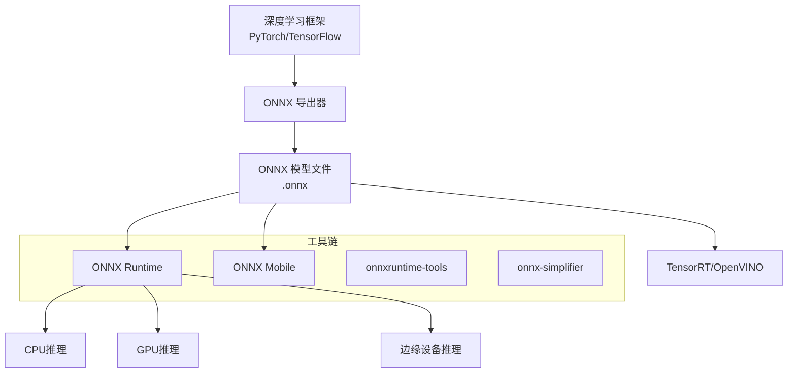
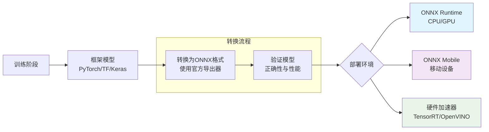

# ONNX格式简介

## 什么是 ONNX？

**ONNX** (Open Neural Network Exchange) 是一个开放的深度学习模型表示格式，旨在解决不同深度学习框架之间的互操作性问题。它提供了一种标准化的模型描述格式，使模型可以在不同的框架和平台之间无缝转换和部署。

### 核心特性

- **框架无关性**: 模型可以在 PyTorch、TensorFlow、MXNet 等框架之间转换
- **开放标准**: 由微软和Facebook于2017年发起，现由Linux基金会维护
- **跨平台支持**: 支持Windows、Linux、macOS以及移动设备
- **优化推理**: ONNX Runtime提供高性能的推理引擎

```python
# 示例：PyTorch模型导出为ONNX格式
import torch
import torch.nn as nn

class SimpleModel(nn.Module):
    def __init__(self):
        super().__init__()
        self.fc = nn.Linear(10, 5)

    def forward(self, x):
        return self.fc(x)

model = SimpleModel()
dummy_input = torch.randn(1, 10)

# 导出为ONNX格式
torch.onnx.export(
    model,
    dummy_input,
    "model.onnx",
    export_params=True,
    opset_version=14,
    do_constant_folding=True,
    input_names=['input'],
    output_names=['output']
)
print("模型已成功导出为 ONNX 格式")
```

## ONNX 在模型部署中的作用

在深度学习工作流中，ONNX 主要扮演以下角色：

1. **训练-部署分离**: 研究人员可以使用熟悉的框架训练，部署团队使用优化引擎
2. **硬件适配**: 一次转换，可在多种硬件上运行（CPU、GPU、专用加速器）
3. **版本管理**: 标准化模型格式简化了版本控制和回滚
4. **性能优化**: ONNX Runtime自动执行图优化和算子融合

## 相比框架特定格式的优势

| 对比维度 | 框架特定格式 | ONNX 格式 |
|---------|-------------|-----------|
| **跨框架兼容** | ❌ 仅限本框架 | ✅ 支持多框架 |
| **部署灵活性** | 有限 | 极高 |
| **性能优化** | 框架依赖 | ONNX Runtime统一优化 |
| **模型压缩** | 各框架独立实现 | 标准化的量化、剪枝支持 |
| **边缘部署** | 需框架运行时 | 轻量级运行时 |

```python
# ONNX Runtime推理示例 - 展示跨平台优势
import onnxruntime as ort
import numpy as np

# 加载ONNX模型（无需原始框架）
session = ort.InferenceSession("model.onnx")

# 准备输入数据
input_data = np.random.randn(1, 10).astype(np.float32)
outputs = session.run(
    None,
    {"input": input_data}
)

print(f"推理输出形状: {outputs[0].shape}")
print(f"推理成功完成！")
```

## ONNX 生态系统

### 主要组件



### 核心工具

- **onnxruntime**: 高性能跨平台推理引擎
- **onnxruntime-tools**: 模型优化和量化工具
- **onnx-simplifier**: 简化ONNX图结构
- **Netron**: 模型可视化工具
- **tf2onnx**: TensorFlow转ONNX
- **pytorch-onnx**: PyTorch内置支持

### 社区资源

- **官方文档**: https://onnx.ai/
- **GitHub仓库**: https://github.com/onnx/onnx
- **模型库**: https://github.com/onnx/models
- **社区论坛**: GitHub Discussions

## ONNX 工作流程



## 与相关模块的联系

ONNX格式作为整个转换工作流的基础，与以下模块密切相关：

- **[[02-非流式模型转换/PyTorch转换完整步骤]]** - 学习具体转换实现细节
- **[[06-验证与评估/正确性验证方法]]** - 验证转换后模型的正确性
- **[[04-模型优化与量化/量化技术详解]]** - ONNX格式支持的高级优化

## 相关链接

### 本模块其他文件
- [[环境搭建指南]] - 安装和配置ONNX开发环境
- [[硬件软件要求]] - 系统要求和兼容性

### 其他模块
- [[02-非流式模型转换/README]] - 框架特定的转换教程
- [[05-常见问题解决/转换错误排查]] - 问题排查和解决方案
- [[07-性能调优/推理加速策略]] - 性能优化最佳实践
- [[附录/工具链汇总]] - 完整的工具和资源列表

### 外部资源
- [ONNX官方文档](https://onnx.ai/)
- [ONNX Runtime文档](https://onnxruntime.ai/)
- [ONNX模型库](https://github.com/onnx/models)
