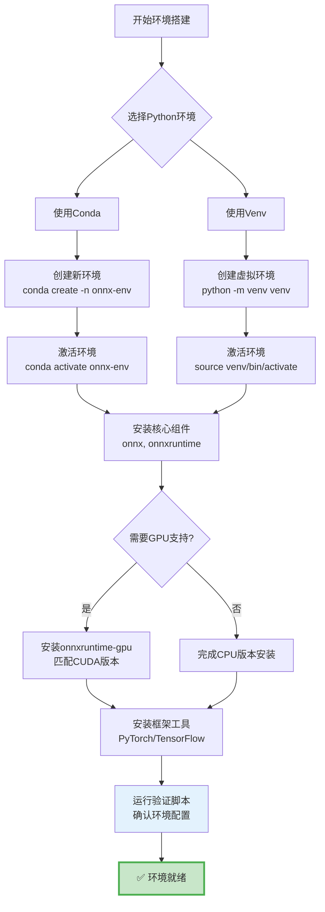

# 环境搭建指南

本指南将帮助您快速搭建ONNX开发和部署环境，包括ONNX Runtime安装、框架转换工具配置以及虚拟环境管理。

## 目录

- [ONNX Runtime 安装](#onnx-runtime-安装)
- [框架转换工具](#框架转换工具)
- [虚拟环境配置](#虚拟环境配置)
- [环境验证](#环境验证)

## ONNX Runtime 安装

ONNX Runtime是ONNX模型的官方推理引擎，支持CPU和GPU加速。

### CPU 版本安装

对于CPU推理，推荐安装CPU版本，它适用于大多数场景且易于配置。

```bash
# 使用 pip 安装（推荐）
pip install onnxruntime

# 或者指定版本
pip install onnxruntime==1.16.0

# 验证安装
python -c "import onnxruntime as ort; print(f'ONNX Runtime版本: {ort.__version__}')"
```

对于生产环境，可以考虑：

```bash
# 安装带性能优化的CPU版本
pip install onnxruntime-gpu  # 如果同时支持GPU
# 或者从官网下载预编译的whl包
```

### GPU 版本安装（CUDA）

如果需要GPU加速，需要根据CUDA版本选择合适的包：

```bash
# 查看CUDA版本
nvcc --version  # 或 nvidia-smi

# 根据CUDA版本安装对应版本
# CUDA 11.8
pip install onnxruntime-gpu==1.16.0

# CUDA 12.x
pip install onnxruntime-gpu

# 验证GPU是否可用
python -c "import onnxruntime as ort; print(f'可用的执行提供商: {ort.get_available_providers()}')"
```

**重要提示**：
- GPU版本需要匹配CUDA和cuDNN版本
- 查看[官方文档](https://onnxruntime.ai/docs/installation/)获取最新的版本对应关系
- Windows用户需要确保Visual C++ Redistributable已安装

### 平台特定安装

**Linux (Ubuntu/Debian)**:
```bash
# 更新包管理器
sudo apt-get update

# 安装依赖
sudo apt-get install -y python3-dev build-essential

# 安装onnxruntime
pip3 install onnxruntime

# 对于GPU版本，还需要安装CUDA toolkit
```

**macOS**:
```bash
# macOS仅支持CPU版本
pip3 install onnxruntime

# Apple Silicon (M1/M2/M3) 优化版本
pip3 install onnxruntime  # 自动选择最佳版本
```

**Windows**:
```powershell
# 安装CPU版本
pip install onnxruntime

# 安装GPU版本（需要先安装CUDA toolkit）
pip install onnxruntime-gpu

# 验证安装
python -c "import onnxruntime; print(onnxruntime.__version__)"
```

## 框架转换工具

根据您的训练框架，需要安装相应的ONNX导出工具。

### PyTorch 转换工具

PyTorch通过内置的`torch.onnx`模块支持ONNX导出：

```bash
# 安装PyTorch（以CUDA 11.8为例）
pip install torch torchvision torchaudio --index-url https://download.pytorch.org/whl/cu118

# CPU版本
pip install torch torchvision torchaudio

# 验证安装
python -c "import torch; print(f'PyTorch版本: {torch.__version__}'); print(f'CUDA可用: {torch.cuda.is_available()}')"
```

PyTorch导出示例：
```python
import torch
import torch.nn as nn

# 定义模型
model = nn.Sequential(
    nn.Linear(784, 256),
    nn.ReLU(),
    nn.Linear(256, 10)
)

# 导出为ONNX
dummy_input = torch.randn(1, 784)
torch.onnx.export(
    model,
    dummy_input,
    "mnist_model.onnx",
    export_params=True,
    opset_version=14,
    do_constant_folding=True,
    input_names=['input'],
    output_names=['output']
)
```

### TensorFlow/Keras 转换工具

TensorFlow使用`tf2onnx`工具进行转换：

```bash
# 安装TensorFlow
pip install tensorflow==2.13.0  # 选择合适版本

# 安装tf2onnx
pip install tf2onnx

# 或者从源码安装最新版本
pip install git+https://github.com/onnx/tensorflow-onnx.git
```

转换示例：
```python
import tensorflow as tf
import tf2onnx

# 加载或创建模型
model = tf.keras.models.load_model('my_model.h5')

# 转换为ONNX
spec = (tf.TensorSpec((None, 224, 224, 3), tf.float32, name="input"),)
output_path = model.onnx(spec)

print(f"模型已导出到: {output_path}")
```

### 其他框架工具

**MXNet**:
```bash
pip install mxnet
# MXNet内置ONNX支持
```

**ONNX运算符扩展**:
```bash
# 如果模型包含自定义算子
pip install onnxruntime-tools
```

## 虚拟环境配置

使用虚拟环境可以避免依赖冲突，推荐使用conda或venv。

### Conda 环境配置

```bash
# 创建新环境
conda create -n onnx-env python=3.9

# 激活环境
conda activate onnx-env

# 在环境中安装所需包
pip install onnxruntime torch torchvision tf2onnx

# 导出环境配置
conda env export > environment.yml

# 从配置文件恢复环境
conda env create -f environment.yml
```

### Venv 环境配置

```bash
# 创建虚拟环境
python -m venv venv-onnx

# 激活环境
# Linux/macOS
source venv-onnx/bin/activate

# Windows
venv-onnx\Scripts\activate

# 安装依赖
pip install --upgrade pip
pip install onnxruntime torch==2.0.0 tf2onnx

# 生成requirements.txt
pip freeze > requirements.txt
```

### 多环境管理示例

```json
// requirements-dev.txt - 开发环境
onnx>=1.14.0
onnxruntime>=1.16.0
torch>=2.0.0
torchvision>=0.15.0
tensorflow>=2.13.0
tf2onnx>=1.14.0
onnxruntime-tools>=0.2.0
numpy>=1.24.0
protobuf>=3.20.0

# 可选 - 性能分析工具
ort-nightly  # 获取最新功能
```

## 环境验证

完成安装后，运行验证脚本来确认所有组件正常工作。

### 完整验证脚本

```python
#!/usr/bin/env python3
"""
ONNX环境验证脚本
检查所有必要组件是否安装正确
"""

import sys
import platform

def check_package(package_name, import_name=None):
    """检查Python包是否可用"""
    try:
        if import_name:
            module = __import__(import_name)
        else:
            module = __import__(package_name.split('-')[0])
        version = getattr(module, '__version__', 'unknown')
        print(f"✓ {package_name}: {version}")
        return True
    except ImportError as e:
        print(f"✗ {package_name}: 未安装 - {e}")
        return False

def check_onnxruntime():
    """检查ONNX Runtime功能"""
    try:
        import onnxruntime as ort
        print(f"\nONNX Runtime 配置:")
        print(f"  版本: {ort.__version__}")
        print(f"  执行提供商: {ort.get_available_providers()}")

        # 检查GPU支持
        providers = ort.get_available_providers()
        if 'CUDAExecutionProvider' in providers:
            print(f"  ✓ GPU加速已启用 (CUDA)")
        elif 'CoreMLExecutionProvider' in providers:
            print(f"  ✓ Apple Silicon 加速已启用")
        else:
            print(f"  ℹ CPU模式 (安装GPU版本以获得加速)")

        return True
    except Exception as e:
        print(f"✗ ONNX Runtime检查失败: {e}")
        return False

def main():
    print("=" * 60)
    print("ONNX 环境验证")
    print("=" * 60)
    print(f"Python版本: {sys.version}")
    print(f"操作系统: {platform.system()} {platform.release()}")
    print(f"处理器: {platform.processor()}")
    print("=" * 60)

    results = []

    print("\n[核心依赖]")
    results.append(check_package('onnx'))
    results.append(check_package('onnxruntime', 'onnxruntime'))
    results.append(check_package('numpy'))

    print("\n[框架支持]")
    results.append(check_package('torch', 'torch'))
    results.append(check_package('torchvision'))
    results.append(check_package('tensorflow'))
    results.append(check_package('tf2onnx'))

    print("\n[可选工具]")
    try:
        import onnxruntime.tools
        print("✓ onnxruntime-tools: 可用")
        results.append(True)
    except:
        print("✗ onnxruntime-tools: 未安装")
        results.append(False)

    # 详细检查ONNX Runtime
    print()
    check_onnxruntime()

    print("\n" + "=" * 60)
    passed = sum(results)
    total = len(results)
    print(f"检查完成: {passed}/{total} 通过")

    if passed == total:
        print("✅ 环境配置正确，可以开始转换工作！")
        return 0
    else:
        print("⚠️  部分组件缺失或配置有误")
        return 1

if __name__ == "__main__":
    sys.exit(main())
```

### 快速验证命令

```bash
# 单个命令检查所有包
python -c "
import sys
packages = ['onnx', 'onnxruntime', 'torch', 'tensorflow', 'tf2onnx']
for pkg in packages:
    try:
        mod = __import__(pkg)
        print(f'✓ {pkg}: {mod.__version__}')
    except ImportError:
        print(f'✗ {pkg}: 未安装')
"

# 检查GPU支持
python -c "import onnxruntime as ort; print('GPU支持:', 'CUDAExecutionProvider' in ort.get_available_providers())"
```

## 环境配置流程图



## 常见配置问题

### Python版本兼容性

```bash
# 检查Python版本要求
# ONNX Runtime 支持 Python 3.7-3.11
# PyTorch 对Python版本有特定要求
python --version

# 如有冲突，使用conda管理多个Python版本
conda create -n onnx-py39 python=3.9
```

### CUDA版本不匹配

```bash
# 查看CUDA版本
nvcc --version

# 查看GPU驱动版本
nvidia-smi

# 根据版本选择onnxruntime-gpu
# 详细对应关系: https://onnxruntime.ai/docs/installation/
```

### Windows权限问题

```powershell
# 以管理员身份运行PowerShell安装
pip install --user onnxruntime

# 或使用虚拟环境避免权限问题
python -m venv onnx-env
.\onnx-env\Scripts\activate
pip install onnxruntime
```

## 性能优化配置

### ONNX Runtime配置

```python
import onnxruntime as ort

# 创建带优化的会话
session_options = ort.SessionOptions()
session_options.graph_optimization_level = ort.GraphOptimizationLevel.ORT_ENABLE_ALL
session_options.intra_op_num_threads = 4  # 设置线程数
session_options.inter_op_num_threads = 2

# 指定执行提供商
providers = ['CUDAExecutionProvider', 'CPUExecutionProvider']
session = ort.InferenceSession(
    "model.onnx",
    sess_options=session_options,
    providers=providers
)
```

### 环境变量配置

```bash
# Linux/macOS - 设置CUDA设备
export CUDA_VISIBLE_DEVICES=0

# Windows PowerShell
$env:CUDA_VISIBLE_DEVICES="0"

# 设置ONNX Runtime日志级别
export ORT_DEBUG=1  # 详细日志
export ORT_LOGGING_LEVEL=warning  # 仅警告
```

## 相关链接

### 本模块其他文件
- [[ONNX格式简介]] - 了解ONNX核心概念
- [[硬件软件要求]] - 系统要求和兼容性

### 其他模块
- [[05-常见问题解决/数据类型匹配问题]] - 解决类型不匹配问题
- [[06-验证与评估/模型正确性验证]] - 验证安装和模型正确性
- [[附录/工具链汇总]] - 完整工具列表

### 外部资源
- [ONNX Runtime安装指南](https://onnxruntime.ai/docs/installation/)
- [PyTorch与ONNX](https://pytorch.org/docs/stable/onnx.html)
- [TensorFlow ONNX转换](https://github.com/onnx/tensorflow-onnx)
- [CUDA版本兼容性表](https://developer.nvidia.com/cuda-toolkit-archive)
