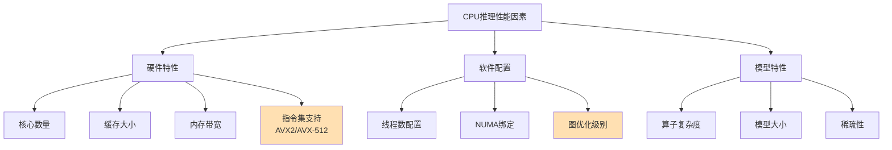

# 硬件软件要求

本文档详细说明ONNX转换和部署所需的硬件和软件要求，包括各平台的兼容性矩阵、配置建议和性能考虑。

## 目录

- [操作系统兼容性](#操作系统兼容性)
- [硬件要求](#硬件要求)
- [软件依赖要求](#软件依赖要求)
- [性能考虑](#性能考虑)
- [配置示例](#配置示例)

## 操作系统兼容性

ONNX Runtime支持主流操作系统，但不同平台的 capabilities 有所差异。

### 兼容性矩阵

| 操作系统 | CPU支持 | GPU支持 | ARM支持 | 推荐用途 |
|---------|---------|---------|---------|---------|
| **Windows 10/11** | ✅ 完全支持 | ✅ CUDA 11-12 | ✅ WSL2 | 开发和生产 |
| **Ubuntu 18.04+** | ✅ 完全支持 | ✅ CUDA 11-12 | ✅ 原生支持 | 服务器部署 |
| **CentOS 7/8** | ✅ 完全支持 | ✅ CUDA 11-12 | ⚠️ 有限 | 企业服务器 |
| **macOS 10.15+** | ✅ 完全支持 | ❌ 不支持 | ✅ Apple Silicon | 开发和测试 |
| **Raspberry Pi** | ✅ 支持 | ❌ 不支持 | ✅ ARMv7/8 | 边缘设备 |

### 平台特定要求

**Windows**:
```powershell
# 系统要求
- Windows 10版本1809或更高
- Visual C++ Redistributable 2015-2022
- .NET Framework 4.7.2（可选）

# GPU要求（如果需要）
- NVIDIA驱动版本 >= 450.80.02
- CUDA Toolkit 11.8 或 12.x
- cuDNN 8.x
```

**Linux**:
```bash
# 系统要求
- Ubuntu 18.04+, CentOS 7+, RHEL 7.8+
- GLIBC 2.23+
- GCC 5.4+（用于编译自定义算子）

# GPU驱动
- NVIDIA驱动版本 >= 470
- CUDA Toolkit 11.8 / 12.x
- cuDNN 8.1+
```

**macOS**:
```bash
# 系统要求
- macOS 10.15 (Catalina) 或更高
- Xcode Command Line Tools
- Homebrew（可选，用于安装包管理）

# Apple Silicon (M1/M2/M3)
- 原生ARM64支持
- 自动使用CoreML加速（macOS 12+）
```

## 硬件要求

### CPU环境

**最低配置**:
- x86-64处理器（Intel/AMD）
- 4GB RAM
- SSE4.2指令集支持

**推荐配置**:
- 多核CPU（8+核心）
- 16GB+ RAM
- AVX2/AVX-512指令集支持
- SSD存储

**ARM设备**:
- Raspberry Pi 4（4GB RAM）
- NVIDIA Jetson Nano/TX2/Orin
- Apple Silicon Mac（M1/M2/M3）
- 支持ARMv8-A或更高

### GPU环境

**NVIDIA GPU支持**:

| GPU系列 | 最低要求 | 推荐配置 | 最大batch size |
|---------|---------|---------|----------------|
| Tesla V100 | 16GB VRAM | 32GB+ | 64 |
| A100 | 40GB/80GB | 80GB | 256 |
| RTX 3090/4090 | 24GB VRAM | - | 128 |
| RTX 3080/4080 | 10-16GB VRAM | - | 64 |
| GTX 1080 Ti | 11GB VRAM | - | 32 |
| Jetson系列 | 4-32GB VRAM | - | 8-64 |

**其他加速器**:
- **Intel GPU**: OpenVINO支持
- **AMD GPU**: ROCm支持（Linux）
- **Apple Silicon**: CoreML后端（macOS/iOS）
- **AWS Inferentia**: 通过onnxruntime-ansible

### 内存和存储

```python
# 估算内存需求的脚本
def estimate_memory(model_path, batch_size=1, input_shape=(3, 224, 224)):
    """
    估算模型推理内存需求
    """
    import os
    from onnx import numpy_helper

    # 模型文件大小
    model_size_mb = os.path.getsize(model_path) / (1024 * 1024)

    # 粗略估算激活内存（需根据具体模型调整）
    # 通常激活内存 = 模型参数的2-5倍
    activation_multiplier = 3
    estimated_ram = model_size_mb * activation_multiplier * batch_size / 1024  # GB

    print(f"模型大小: {model_size_mb:.2f} MB")
    print(f"预计RAM需求 (batch={batch_size}): {estimated_ram:.2f} GB")
    print(f"建议总内存: {estimated_ram * 1.5:.2f} GB")

estimate_memory("model.onnx", batch_size=32)
```

## 软件依赖要求

### 核心依赖版本

| 软件包 | 最低版本 | 推荐版本 | 用途 |
|--------|---------|---------|------|
| Python | 3.7 | 3.9-3.11 | 运行时环境 |
| ONNX | 1.8.0 | 1.14.0+ | 模型格式 |
| ONNX Runtime | 1.8.0 | 1.16.0+ | 推理引擎 |
| PyTorch | 1.8.0 | 2.0.0+ | 模型训练/导出 |
| TensorFlow | 2.5.0 | 2.13.0+ | 模型训练/导出 |
| NumPy | 1.19.0 | 1.24.0+ | 数值计算 |
| Protobuf | 3.20.0 | 4.24.0+ | 模型序列化 |

### 框架特定依赖

**PyTorch导出依赖**:
```bash
# torch.onnx要求
torch>=1.8.0
onnx>=1.8.0

# 可选 - 模型检查
onnxruntime>=1.8.0
```

**TensorFlow导出依赖**:
```bash
tensorflow>=2.5.0
tf2onnx>=1.8.0
onnx>=1.8.0
```

**ONNX Runtime依赖**（自动安装）:
- CPU: 无额外系统依赖
- GPU (CUDA): CUDA Toolkit, cuDNN
- GPU (DirectML): Windows 10+, DirectX 12

### 编译依赖（可选）

如果从源码编译或开发自定义算子：

```bash
# 通用编译工具
- CMake 3.13+
- GCC 5.4+ 或 Clang 3.9+
- Python开发头文件

# ONNX源码编译
git clone https://github.com/onnx/onnx
cd onnx
git submodule update --init --recursive
pip install -r requirements-dev.txt
python setup.py install
```

## 性能考虑

### CPU优化



**关键优化点**:
1. **启用AVX-512**: 确保CPU支持并启用
2. **线程配置**: 匹配CPU核心数
3. **内存对齐**: 优化数据布局
4. **图优化**: 使用`ORT_ENABLE_ALL`

### GPU优化

```python
import onnxruntime as ort

# GPU优化配置示例
session_options = ort.SessionOptions()
session_options.graph_optimization_level = ort.GraphOptimizationLevel.ORT_ENABLE_ALL

# 配置CUDA提供商选项
providers = [
    (
        'CUDAExecutionProvider', {
            'device_id': 0,  # GPU设备ID
            'cudnn_conv_algo_search': 'DEFAULT',  # 或 'HEURISTIC', 'EXHAUSTIVE'
            'do_copy_in_default_stream': True,
            'cudnn_conv_use_max_workspace': '1',
            'gpu_mem_limit': 2 * 1024 * 1024 * 1024,  # 2GB限制
        }
    ),
    'CPUExecutionProvider'
]

session = ort.InferenceSession(
    "model.onnx",
    sess_options=session_options,
    providers=providers
)
```

**GPU性能调优参数**:

| 参数 | 说明 | 推荐值 |
|------|------|--------|
| `device_id` | GPU设备索引 | 0 |
| `cudnn_conv_algo_search` | 卷积算法搜索策略 | DEFAULT |
| `gpu_mem_limit` | GPU内存限制 | 80% VRAM |
| `arena_extend_strategy` | 内存分配策略 | kNextPowerOfTwo |
| `enable_cuda_graph` | 启用CUDA图 | False（批量固定时True） |

### 内存管理

```python
# 内存使用监控
import psutil
import onnxruntime as ort

def monitor_memory_usage():
    """监控推理内存使用"""
    process = psutil.Process()

    # 推理前内存
    mem_before = process.memory_info().rss / 1024**2  # MB

    # 运行推理
    session = ort.InferenceSession("model.onnx")
    outputs = session.run(None, {"input": input_data})

    # 推理后内存
    mem_after = process.memory_info().rss / 1024**2  # MB

    print(f"推理前内存: {mem_before:.2f} MB")
    print(f"推理后内存: {mem_after:.2f} MB")
    print(f"内存增长: {mem_after - mem_before:.2f} MB")

monitor_memory_usage()
```

### 批处理大小选择

```python
def optimize_batch_size(model_path, device='cpu'):
    """
    根据硬件自动优化批处理大小
    """
    import onnxruntime as ort
    import numpy as np

    session = ort.InferenceSession(model_path)

    # 测试不同批处理大小
    batch_sizes = [1, 2, 4, 8, 16, 32, 64]
    input_name = session.get_inputs()[0].name
    input_shape = session.get_inputs()[0].shape
    feature_dim = input_shape[1] if len(input_shape) > 1 else 1

    results = []
    for batch_size in batch_sizes:
        try:
            dummy_input = np.random.randn(batch_size, feature_dim).astype(np.float32)

            # 多次运行取平均
            import time
            times = []
            for _ in range(10):
                start = time.perf_counter()
                session.run(None, {input_name: dummy_input})
                times.append(time.perf_counter() - start)

            avg_time = np.mean(times)
            throughput = batch_size / avg_time

            results.append({
                'batch_size': batch_size,
                'avg_latency_ms': avg_time * 1000,
                'throughput_fps': throughput
            })

            print(f"Batch {batch_size}: {avg_time*1000:.2f}ms, {throughput:.1f} FPS")

        except Exception as e:
            print(f"Batch {batch_size}: 失败 - {e}")
            break

    return results

# 使用示例
optimize_batch_size("model.onnx")
```

## 配置示例

### 1. 开发工作站（CPU）

```
配置:
- CPU: Intel i9-13900K 或 AMD Ryzen 9 7950X
- RAM: 32GB DDR5
- OS: Ubuntu 22.04 LTS
- Python: 3.10
- ONNX Runtime: CPU版本

适用场景:
- 模型开发和调试
- 小批量推理测试
- 离线批处理任务
```

**环境配置脚本**:
```bash
#!/bin/bash
# dev-workstation-cpu.sh

# 创建虚拟环境
python3.10 -m venv ~/venv/onnx-dev
source ~/venv/onnx-dev/bin/activate

# 安装依赖
pip install --upgrade pip
pip install onnx>=1.14.0 onnxruntime>=1.16.0
pip install torch>=2.0.0 torchvision torchaudio
pip install numpy pandas matplotlib

# 安装开发工具
pip install onnxruntime-tools onnx-simplifier netron

echo "开发环境配置完成！"
```

### 2. 生产服务器（GPU）

```
配置:
- GPU: 4x NVIDIA A100 80GB
- CPU: AMD EPYC 7763 (64核)
- RAM: 512GB DDR4
- OS: Ubuntu 20.04 LTS
- CUDA: 11.8
- cuDNN: 8.6

适用场景:
- 高并发在线服务
- 大批量推理
- 模型性能压测
```

**环境配置脚本**:
```bash
#!/bin/bash
# production-server-gpu.sh

# 安装CUDA 11.8（如未安装）
# 参考: https://developer.nvidia.com/cuda-11-8-0-download-archive

# 创建环境
conda create -n onnx-prod python=3.9 -y
conda activate onnx-prod

# 安装ONNX Runtime GPU版本
pip install onnxruntime-gpu==1.16.0

# 安装框架
pip install torch==2.0.1+cu118 torchvision==0.15.2+cu118 --index-url https://download.pytorch.org/whl/cu118
pip install tensorflow==2.13.0

# 优化配置
cat > ort_config.py << 'EOF'
import onnxruntime as ort

# 会话配置
sess_options = ort.SessionOptions()
sess_options.graph_optimization_level = ort.GraphOptimizationLevel.ORT_ENABLE_ALL
sess_options.intra_op_num_threads = 8
sess_options.inter_op_num_threads = 4

# GPU提供商配置
providers = [
    ('CUDAExecutionProvider', {
        'device_id': 0,
        'cudnn_conv_algo_search': 'DEFAULT',
        'gpu_mem_limit': 80 * 1024 * 1024 * 1024,  # 80GB
    }),
    'CPUExecutionProvider'
]

session = ort.InferenceSession(
    "model.onnx",
    sess_options=sess_options,
    providers=providers
)
EOF

echo "生产环境配置完成！"
```

### 3. 边缘设备（ARM）

```
配置:
- 设备: NVIDIA Jetson Orin NX
- RAM: 8GB LPDDR5
- 存储: 64GB eMMC
- OS: Ubuntu 20.04 (JetPack 5.1.2)
- CUDA: 11.4
- TensorRT: 8.5

适用场景:
- 边缘AI推理
- IoT设备部署
- 实时视频分析
```

**环境配置脚本**:
```bash
#!/bin/bash
# edge-device-arm.sh

# Jetson设备特定安装
sudo apt-get update
sudo apt-get install -y python3-pip python3-dev

# 安装ONNX Runtime（ARM64版本）
pip3 install onnxruntime  # 自动选择ARM64版本

# 安装TensorRT后端支持
pip3 install onnxruntime-gpu  # Jetson包

# 验证安装
python3 -c "
import onnxruntime as ort
print(f'ONNX Runtime: {ort.__version__}')
print(f'提供商: {ort.get_available_providers()}')
print(f'TensorRT支持: {\"TensorrtExecutionProvider\" in ort.get_available_providers()}')
"

echo "边缘设备环境配置完成！"
```

### 4. macOS（Apple Silicon）

```
配置:
- 设备: MacBook Pro M3 Pro
- RAM: 18GB 统一内存
- OS: macOS 14.0 (Sonoma)
- Python: 3.11
- ONNX Runtime: 原生arm64版本

适用场景:
- 本地开发和测试
- 移动端预处理
- CoreML集成
```

**环境配置脚本**:
```bash
#!/bin/bash
# macos-apple-silicon.sh

# 确保使用原生arm64 Python
# 推荐使用Homebrew安装
brew install python@3.11

# 创建虚拟环境
python3.11 -m venv ~/venv/onnx-macos
source ~/venv/onnx-macos/bin/activate

# 安装ONNX Runtime
pip install onnxruntime

# 测试CoreML加速（macOS 12+）
python -c "
import onnxruntime as ort
providers = ort.get_available_providers()
if 'CoreMLExecutionProvider' in providers:
    print('✅ CoreML加速可用')
else:
    print('ℹ️  CPU模式（macOS版本可能不支持CoreML）')
"

echo "macOS环境配置完成！"
```

## 相关链接

### 本模块其他文件
- [[ONNX格式简介]] - ONNX格式核心概念
- [[环境搭建指南]] - 详细的安装步骤

### 其他模块
- [[02-非流式模型转换/环境准备检查清单]] - 转换前的环境检查
- [[04-模型优化与量化/硬件加速配置]] - GPU/CPU优化配置
- [[05-常见问题解决/兼容性问题排查]] - 平台特定问题

### 外部资源
- [ONNX Runtime平台支持](https://onnxruntime.ai/docs/execution-providers/)
- [CUDA工具包文档](https://docs.nvidia.com/cuda/)
- [ jetson.ai开发者文档](https://developer.nvidia.com/embedded/jetson)
- [Apple Silicon机器学习](https://developer.apple.com/metal/ml/)
