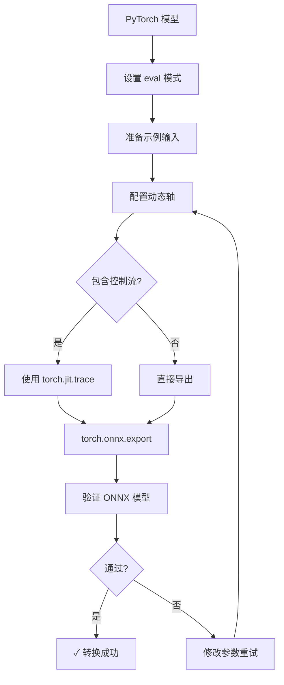

# PyTorch 转换完整步骤

> **标签**: #pytorch #onnx-export #conversion
> **相关链接**: [[01-基础概念与环境准备/环境搭建指南]], [[03-流式模型转换/动态轴设置技巧]]

## 概述

PyTorch 提供了 `torch.onnx.export()` 函数，将 PyTorch 模型导出为 ONNX 格式。这是最常用且功能最完整的转换方式，支持动态轴、自定义算子等高级特性。

## torch.onnx.export 完整参数详解

### 函数签名

```python
torch.onnx.export(
    model,                    # 待转换的 PyTorch Model
    args,                     # 模型输入（tuple 或 tensor）
    f,                        # 输出文件路径或文件对象
    export_params=True,       # 是否导出模型参数
    verbose=False,            # 是否输出详细日志
    training=TrainingMode.EVAL,  # 训练模式
    input_names=None,         # 输入张量名称列表
    output_names=None,        # 输出张量名称列表
    dynamic_axes=None,        # 动态轴配置
    opset_version=None,      # ONNX opset 版本
    do_constant_folding=True, # 是否进行常量折叠优化
    example_outputs=None,     # 示例输出（自动推断时使用）
    strip_doc_string=True,   # 是否移除文档字符串
    custom_opsets=None,      # 自定义 opset 配置
    enable_onnx_checker=True,# 启用 ONNX 检查器
    _use_jit=True,           # 使用 JIT 追踪
    **kwargs                 # 其他传递给导出的参数
)
```

### 核心参数详解

#### 1. `model` - 模型对象
```python
# 支持任意 nn.Module 子类
model = MyModel()
model.load_state_dict(torch.load('model.pth'))
model.eval()  # 推理前务必设置为 eval 模式
```

**关键注意事项**:
- 模型必须在 `eval()` 模式下进行导出，避免 dropout/batchnorm 的随机性
- 自定义模型需要实现 `forward()` 方法
- 如果使用 TorchScript，需先用 `torch.jit.script()` 或 `torch.jit.trace()`

#### 2. `args` - 输入张量
```python
# 方式1: 单个张量
dummy_input = torch.randn(1, 3, 224, 224)

# 方式2: 多个输入（tuple）
dummy_input = (
    torch.randn(1, 3, 224, 224),  # 图像
    torch.randn(1)                 # 额外参数
)

# 方式3: 字典（通过包装处理）
class ModelWrapper(torch.nn.Module):
    def __init__(self, model):
        super().__init__()
        self.model = model

    def forward(self, inputs):
        return self.model(**inputs)
```

#### 3. `dynamic_axes` - 动态轴配置

动态轴允许 ONNX 模型接受不同尺寸的输入，是部署中的关键配置。

**基础知识**: ONNX 图形中的每个张量都有固定形状（rank 固定，维度可设为变量）。使用 `dynamic_axes` 指定哪些维度是动态的。

```python
# 基本语法
dynamic_axes = {
    'input_name': {0: 'batch_size', 1: 'sequence_length'},
    'output_name': {0: 'batch_size'}
}

# 示例1: BERT 模型（动态 batch 和序列长度）
dynamic_axes = {
    'input_ids': {0: 'batch', 1: 'sequence'},
    'attention_mask': {0: 'batch', 1: 'sequence'},
    'token_type_ids': {0: 'batch', 1: 'sequence'},
    'output': {0: 'batch'}
}

# 示例2: CNN 图像分类（动态 batch、高度、宽度）
dynamic_axes = {
    'input': {
        0: 'batch_size',
        2: 'height',
        3: 'width'
    },
    'output': {0: 'batch_size'}
}

# 示例3: 多输入模型
dynamic_axes = {
    # 第一个输入：动态 batch 和 channel
    'image': {0: 'batch', 1: 'channel'},
    # 第二个输入：仅动态 batch
    'text': {0: 'batch', 1: 'seq_len'}
}

# 使用字符串名称（推荐）
dummy_input = torch.randn(2, 3, 224, 224)
torch.onnx.export(
    model,
    dummy_input,
    'model.onnx',
    input_names=['input'],
    output_names=['output'],
    dynamic_axes={
        'input': {0: 'batch_size', 2: 'height', 3: 'width'},
        'output': {0: 'batch_size'}
    }
)
```

**维度索引说明**:
- 0: batch 维度
- 1: channel 维度
- 2: height 维度
- 3: width 维度

对于 NLP 模型:
- 0: batch
- 1: sequence_length
- 2: hidden_dim

#### 4. `opset_version` - opset 版本选择

ONNX opset 定义了算子集合的版本，影响兼容性和功能支持。

| opset 版本 | 发布时间 | 新增特性 | 推荐场景 |
|-----------|---------|---------|---------|
| 10 | 2019-12 | 基础算子 | PyTorch 1.4+ 默认 |
| 11 | 2020-06 | Bool 类型支持 | 通用场景 |
| 12 | 2020-09 | 稀疏张量 | 稀疏模型 |
| 13 | 2020-12 | Quantization | 量化模型 |
| 14 | 2021-03 | Faster R-CNN 改进 | 目标检测 |
| 15 | 2021-06 | 新数学函数 | 最新功能 |

**选择策略**:
```python
# 保持默认（PyTorch 自动选择）
torch.onnx.export(model, dummy_input, 'model.onnx')

# 指定版本（确保推理端兼容）
torch.onnx.export(
    model,
    dummy_input,
    'model.onnx',
    opset_version=11  # 根据目标推理引擎选择
)
```

#### 5. `input_names` 和 `output_names`

```python
torch.onnx.export(
    model,
    dummy_input,
    'model.onnx',
    input_names=['input_image'],      # 清晰命名便于调试
    output_names=['prediction', 'logits']
)
```

**命名建议**:
- 使用描述性名称（避免 'input_0', 'output_0'）
- 避免特殊字符，使用下划线分隔
- 保持命名与动态轴配置一致

#### 6. `do_constant_folding`

常量折叠将计算图中的常量预计算，减少推理时的计算量。

```python
torch.onnx.export(
    model,
    dummy_input,
    'model.onnx',
    do_constant_folding=True,  # 默认开启，通常保持
)
```

**何时关闭**:
- 模型包含需要运行时计算的参数
- 导出失败时用于调试

## 完整代码示例

### 示例1: BERT 文本分类

```python
import torch
import torch.nn as nn
from transformers import BertModel, BertTokenizer

# 1. 加载预训练模型
model = BertModel.from_pretrained('bert-base-uncased')
model.eval()

# 2. 准备 tokenizer（仅用于示例，不参与导出）
tokenizer = BertTokenizer.from_pretrained('bert-base-uncased')

# 3. 创建示例输入
# BERT 需要三个输入：input_ids, attention_mask, token_type_ids
batch_size = 2
seq_length = 128

dummy_input = {
    'input_ids': torch.randint(0, 30522, (batch_size, seq_length)),
    'attention_mask': torch.ones(batch_size, seq_length),
    'token_type_ids': torch.zeros(batch_size, seq_length)
}

# 4. 包装模型为字典输入
class BertWrapper(torch.nn.Module):
    def __init__(self, model):
        super().__init__()
        self.model = model

    def forward(self, input_ids, attention_mask, token_type_ids):
        return self.model(
            input_ids=input_ids,
            attention_mask=attention_mask,
            token_type_ids=token_type_ids
        )[0]  # 返回 last_hidden_state

wrapped_model = BertWrapper(model)

# 5. 导出为 ONNX
torch.onnx.export(
    wrapped_model,
    (
        dummy_input['input_ids'],
        dummy_input['attention_mask'],
        dummy_input['token_type_ids']
    ),
    'bert_model.onnx',
    input_names=['input_ids', 'attention_mask', 'token_type_ids'],
    output_names=['last_hidden_state'],
    dynamic_axes={
        'input_ids': {0: 'batch_size', 1: 'seq_length'},
        'attention_mask': {0: 'batch_size', 1: 'seq_length'},
        'token_type_ids': {0: 'batch_size', 1: 'seq_length'},
        'last_hidden_state': {0: 'batch_size'}
    },
    opset_version=13,
    do_constant_folding=True
)

print("BERT 模型导出完成: bert_model.onnx")
```

### 示例2: ResNet50 图像分类

```python
import torch
import torchvision.models as models

# 1. 加载模型
model = models.resnet50(pretrained=True)
model.eval()

# 2. 动态 batch 示例（支持 1-32 的 batch size）
batch_size = 4
dummy_input = torch.randn(batch_size, 3, 224, 224)

# 3. 导出
torch.onnx.export(
    model,
    dummy_input,
    'resnet50.onnx',
    input_names=['image'],
    output_names=['class_probs'],
    dynamic_axes={
        'image': {
            0: 'batch_size',
            2: 'height',
            3: 'width'
        },
        'class_probs': {0: 'batch_size'}
    },
    opset_version=13,
    do_constant_folding=True,
    verbose=False
)

print("ResNet50 导出完成: resnet50.onnx")
```

### 示例3: 自定义 CNN（多输出）

```python
import torch
import torch.nn as nn

class CustomCNN(nn.Module):
    """自定义卷积神经网络，有两个输出"""
    def __init__(self, num_classes=10):
        super().__init__()
        self.features = nn.Sequential(
            nn.Conv2d(3, 64, kernel_size=3, padding=1),
            nn.ReLU(inplace=True),
            nn.MaxPool2d(kernel_size=2, stride=2),
            nn.Conv2d(64, 128, kernel_size=3, padding=1),
            nn.ReLU(inplace=True),
            nn.MaxPool2d(kernel_size=2, stride=2)
        )
        self.classifier = nn.Linear(128 * 56 * 56, num_classes)
        self.feature_embedding = nn.Linear(128 * 56 * 56, 256)

    def forward(self, x):
        features = self.features(x)
        flattened = features.view(features.size(0), -1)
        class_out = self.classifier(flattened)
        feature_out = self.feature_embedding(flattened)
        return class_out, feature_out

# 创建模型
model = CustomCNN(num_classes=10)
model.eval()

# 示例输入（支持动态图像尺寸）
dummy_input = torch.randn(2, 3, 224, 224)

# 导出（多输出）
torch.onnx.export(
    model,
    dummy_input,
    'custom_cnn.onnx',
    input_names=['input_image'],
    output_names=['class_scores', 'feature_embedding'],
    dynamic_axes={
        'input_image': {0: 'batch_size', 2: 'height', 3: 'width'},
        'class_scores': {0: 'batch_size'},
        'feature_embedding': {0: 'batch_size'}
    },
    opset_version=13
)

print("自定义 CNN 导出完成: custom_cnn.onnx")
```

### 示例4: 控制流模型（使用 torch.jit.trace）

对于包含 if/for 等控制流的模型，需要使用 JIT tracing：

```python
import torch
import torch.nn as nn

class ModelWithControlFlow(nn.Module):
    def forward(self, x, threshold=0.5):
        result = []
        for i in range(x.size(0)):
            if x[i].mean() > threshold:
                result.append(x[i] * 2)
            else:
                result.append(x[i])
        return torch.stack(result)

model = ModelWithControlFlow()
model.eval()

dummy_input = torch.randn(3, 10)

# 使用 trace 导出（控制流会被"固化"到图中）
traced_model = torch.jit.trace(model, dummy_input)

torch.onnx.export(
    traced_model,
    dummy_input,
    'control_flow_model.onnx',
    input_names=['input'],
    output_names=['output'],
    dynamic_axes={
        'input': {0: 'batch_size'},
        'output': {0: 'batch_size'}
    }
)

print("控制流模型导出完成")
```

**注意**: tracing 会记录具体执行路径，如果输入不同可能导致图不同。对于需要导出所有分支的模型，考虑使用 `torch.jit.script`。

## 自定义算子处理

当 PyTorch 算子没有对应 ONNX 实现时，需要自定义算子映射。

### 方案1: 注册自定义 Symbolic 函数

```python
import torch
import torch.autograd
from torch.onnx import symbolic_helper

# 定义自定义算子（假设 MyOp 在 PyTorch 中不存在 ONNX 映射）
class MyOp(torch.autograd.Function):
    @staticmethod
    def forward(ctx, x, y):
        return x * y + x

    @staticmethod
    def symbolic(g, x, y):
        # 使用现有的 ONNX 算子组合实现
        return g.op('Mul', x, y)  # 使用 Mul 算子

# 注册 symbolic
from torch.onnx import register_custom_op_symbolic

register_custom_op_symbolic('::my_op', MyOp.symbolic, 9)

# 现在可以使用
class MyModel(torch.nn.Module):
    def forward(self, x, y):
        return MyOp.apply(x, y)
```

### 方案2: 使用自定义 opset

```python
# 在导出时指定自定义 opset 域
torch.onnx.export(
    model,
    dummy_input,
    'model_custom.onnx',
    custom_opsets={
        'com.example': 1  # 自定义 opset 域
    }
)
```

## 转换流程 Mermaid 图



## 验证导出的 ONNX 模型

```python
import onnx
import onnxruntime as ort

# 1. 检查模型有效性
onnx_model = onnx.load('model.onnx')
onnx.checker.check_model(onnx_model)
print("✓ ONNX 模型格式正确")

# 2. 使用 ONNX Runtime 推理测试
session = ort.InferenceSession('model.onnx')

# 准备输入
input_name = session.get_inputs()[0].name
input_shape = session.get_inputs()[0].shape
print(f"输入名称: {input_name}, 形状: {input_shape}")

# 运行推理
dummy_input = torch.randn(1, 3, 224, 224).numpy()
outputs = session.run(None, {input_name: dummy_input})
print(f"输出数量: {len(outputs)}")
print(f"输出形状: {[o.shape for o in outputs]}")
```

## 常见问题排查

### 问题1: "Unsupported operator"

**错误信息**: `RuntimeError: ONNX export failed: Couldn't export operator`

**解决方案**:
```python
# 方案A: 使用算子分解（operator decomposition）
torch.onnx.export(
    model,
    dummy_input,
    'model.onnx',
    operator_export_type=torch.onnx.OperatorExportTypes.ONNX_ATEN_FALLBACK
)

# 方案B: 自定义 symbolic 函数（见上文）
```

### 问题2: 动态轴不生效

**错误表现**: 导出的模型只能接受固定尺寸输入

**解决方案**:
```python
# 检查点1: 确保输入名称匹配
torch.onnx.export(
    model,
    dummy_input,
    'model.onnx',
    input_names=['input'],  # 必须与 dynamic_axes 中的键一致
    output_names=['output'],
    dynamic_axes={'input': {0: 'batch'}, 'output': {0: 'batch'}}
)

# 检查点2: 使用真实输入验证
import onnxruntime as ort
session = ort.InferenceSession('model.onnx')
print(session.get_inputs()[0].shape)  # 应该显示动态维度，如 ['batch', 3, 224, 224]
```

### 问题3: 推理结果不一致

```python
# 使用 float64 精度对比
torch.onnx.export(
    model,
    dummy_input,
    'model.onnx',
    **_export_kwargs
)

# 验证时确保精度一致
model.eval()
with torch.no_grad():
    torch_output = model(dummy_input)

sess = ort.InferenceSession('model.onnx')
onnx_output = sess.run(None, {'input': dummy_input.numpy()})

# 计算误差
import numpy as np
diff = np.abs(torch_output.numpy() - onnx_output[0])
print(f"最大误差: {diff.max():.2e}")
print(f"均方误差: {np.mean(diff**2):.2e}")
```

## 生产环境最佳实践

### 1. 版本管理

```python
# 记录导出环境
import torch
import onnx

export_info = {
    'torch_version': torch.__version__,
    'onnx_version': onnx.__version__,
    'opset_version': 13,
    'dynamic_axes': dynamic_axes,
    'input_shapes': {name: shape for name, shape in zip(input_names, dummy_input.shape)}
}

import json
with open('model_metadata.json', 'w') as f:
    json.dump(export_info, f, indent=2)
```

### 2. 批量导出

```python
def export_model(model, dummy_input, output_path, **kwargs):
    """通用导出函数"""
    model.eval()
    try:
        torch.onnx.export(
            model,
            dummy_input,
            output_path,
            **_export_kwargs
        )
        # 验证
        onnx.checker.check_model(output_path)
        print(f"✓ {output_path} 导出成功")
        return True
    except Exception as e:
        print(f"✗ {output_path} 导出失败: {e}")
        return False

# 批量处理
models = [
    ('resnet50', models.resnet50(pretrained=True)),
    ('vgg16', models.vgg16(pretrained=True))
]

for name, model in models:
    export_model(
        model,
        torch.randn(1, 3, 224, 224),
        f'{name}.onnx',
        input_names=['image'],
        output_names=['output']
    )
```

## 参考资源

- [PyTorch ONNX 导出官方文档](https://pytorch.org/docs/stable/onnx.html)
- [ONNX 动态形状文档](https://github.com/onnx/onnx/blob/main/docs/DynamicShapes.md)
- [[03-流式模型转换/动态轴设置技巧]] - 动态轴的进阶配置
- [[04-跨框架转换/框架对比分析]] - 框架间转换对比

---

**下一步**: 完成导出后，阅读 [[05-常见问题解决/算子不兼容方案]] 了解如何处理算子兼容性问题，或 [[06-性能优化/量化与加速]] 进行模型优化。
