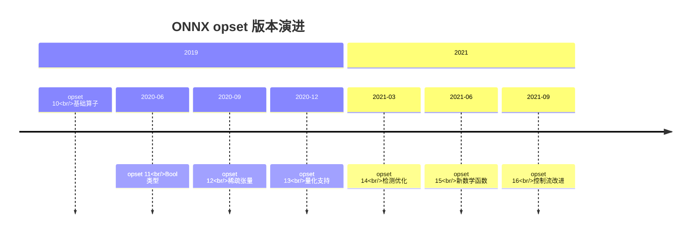

# 参数设置最佳实践

> **标签**: #best-practices #opset #configuration
> **相关链接**: [[05-常见问题解决/算子不兼容方案]]

## 概述

本文介绍了 ONNX 转换过程中的关键参数配置，包括 opset 版本选择、训练/推理模式区别、动态形状最佳实践、性能调优参数，以及生产环境转换检查清单。

## opset 版本选择指南

### opset 版本演进



### 详细选择策略

| 场景 | 推荐 opset | 理由 | 最低要求 |
|------|-----------|------|---------|
| 通用 CPU 推理（ONNX Runtime 1.8+） | 12-13 | 兼容性好，功能完整 | 10 |
| 移动端部署（TensorRT/TVM） | 11 | 轻量级推理引擎支持最佳 | 10 |
| 服务器端 GPU（TensorRT 8.x） | 13-14 | 充分利用 TensorRT 优化 | 11 |
| 量化模型 | 13 | 包含量化算子定义 | 13 |
| 需要最新算子（如 Cos, Sin） | 15+ | 新算子在旧版本不存在 | - |
| 与老系统兼容（工业环境） | 10 | 最广泛支持 | 10 |

### 检查兼容性

```python
def check_opset_compatibility(target_engine):
    """检查推理引擎支持的最高 opset"""
    compatibility = {
        'onnxruntime': {'min': 10, 'max': 16, 'recommended': 13},
        'tensorrt': {'min': 10, 'max': 15, 'recommended': 13},
        'openvino': {'min': 10, 'max': 15, 'recommended': 12},
        'tvm': {'min': 10, 'max': 16, 'recommended': 14},
        'ncnn': {'min': 9, 'max': 12, 'recommended': 10},
    }

    if target_engine in compatibility:
        return compatibility[target_engine]
    else:
        return {'min': 10, 'max': 16, 'recommended': 13}

# 使用示例
engine_info = check_opset_compatibility('tensorrt')
print(f"TensorRT 推荐 opset: {engine_info['recommended']}")
```

## 训练模式 vs 推理模式

### 关键区别

| 参数 | `torch.onnx.TrainingMode.TRAINING` | `torch.onnx.TrainingMode.EVAL` |
|------|----------------------------------|-------------------------------|
| Dropout | 保留（随机性） | 禁用 |
| BatchNorm | 使用批次统计量 | 使用训练好的均值和方差 |
| 结果一致性 | ✗ 多次导出结果不同 | ✓ 确定性输出 |
| 文件大小 | 可能包含运行统计量 | 精简 |

### 正确用法

```python
import torch

# ❌ 错误：未设置模型模式
model = MyModel()  # 默认在 training 模式
torch.onnx.export(model, dummy_input, 'model.onnx')  # 可能包含随机性

# ✅ 正确：导出前切换到 eval 模式
model = MyModel()
model.eval()  # 关键步骤！
torch.onnx.export(
    model,
    dummy_input,
    'model.onnx',
    training=torch.onnx.TrainingMode.EVAL
)

# ✅ 另一种方式：通过参数指定
torch.onnx.export(
    model,
    dummy_input,
    'model.onnx',
    training=torch.onnx.TrainingMode.EVAL  # 强制 eval
)
```

### BatchNorm 注意事项

```python
class CustomModel(torch.nn.Module):
    def __init__(self):
        super().__init__()
        self.conv = torch.nn.Conv2d(3, 64, 3)
        self.bn = torch.nn.BatchNorm2d(64)  # BatchNorm 层
        self.fc = torch.nn.Linear(64, 10)

    def forward(self, x):
        x = self.conv(x)
        x = self.bn(x)  # 在 eval 模式下使用 running_mean/running_var
        x = self.fc(x)
        return x

model = CustomModel()
model.eval()  # 确保 bn 层切换到 eval 模式

# 验证 BatchNorm 状态
for name, module in model.named_modules():
    if isinstance(module, torch.nn.BatchNorm2d):
        print(f"{name}: training={module.training}, "
              f"running_mean shape={module.running_mean.shape}")
```

### Dropout 处理

```python
class ModelWithDropout(torch.nn.Module):
    def __init__(self, dropout_rate=0.5):
        super().__init__()
        self.dropout = torch.nn.Dropout(dropout_rate)  # Dropout 层

    def forward(self, x):
        return self.dropout(x)

model = ModelWithDropout()
model.eval()  # Dropout 会自动禁用

# 验证 Dropout 状态
print(model.dropout.training)  # 应该输出 False（eval 模式下）
```

## 动态形状最佳实践

### DO's ✅

#### 1. 将 batch 维度设为动态

```python
# ✅ 推荐：允许任意 batch size
dynamic_axes = {
    'input': {0: 'batch_size'},
    'output': {0: 'batch_size'}
}
```

**理由**: 推理时可通过批处理提高吞吐量，无需为每个 batch size 准备单独模型。

#### 2. 对可变长度序列使用动态轴

```python
# ✅ NLP 模型支持变长序列
dynamic_axes = {
    'input_ids': {0: 'batch', 1: 'seq_len'},
    'attention_mask': {0: 'batch', 1: 'seq_len'},
    'output': {0: 'batch'}
}
```

#### 3. 提供典型输入样本

```python
# ✅ 使用中等 batch size 的示例
dummy_input = torch.randn(4, 3, 224, 224)  # batch=4 而非 batch=1
torch.onnx.export(model, dummy_input, 'model.onnx', ...)
```

**理由**: 有助于 ONNX 导出正确的形状推断。

#### 4. 明确的输入输出命名

```python
# ✅ 清晰的命名
torch.onnx.export(
    model,
    dummy_input,
    'model.onnx',
    input_names=['batch_images'],
    output_names=['classification_scores'],
    dynamic_axes={
        'batch_images': {0: 'batch'},
        'classification_scores': {0: 'batch'}
    }
)
```

#### 5. 验证动态形状

```python
# ✅ 验证可接受动态输入
import onnxruntime as ort

sess = ort.InferenceSession('model.onnx')
print("元数据:")
for inp in sess.get_inputs():
    print(f"  {inp.name}: shape={inp.shape}, type={inp.type}")

# 测试不同 batch size
for batch_size in [1, 4, 8]:
    test_input = np.random.randn(batch_size, 3, 224, 224).astype(np.float32)
    outputs = sess.run(None, {'batch_images': test_input})
    print(f"batch={batch_size}, output_shape={outputs[0].shape}")
```

### DON'TS ❌

#### 1. 不要忘记命名与动态轴的一致性

```python
# ❌ 错误：input_names 与 dynamic_axes 键不匹配
torch.onnx.export(
    model,
    dummy_input,
    'model.onnx',
    input_names=['input'],  # 名称是 "input"
    dynamic_axes={'x': {0: 'batch'}}  # 但 dynamic_axes 用的是 'x'
)

# ✅ 正确：
torch.onnx.export(
    model,
    dummy_input,
    'model.onnx',
    input_names=['input'],
    dynamic_axes={'input': {0: 'batch'}}  # 名称一致
)
```

#### 2. 不要仅使用 batch=1 导出

```python
# ❌ 问题：可能导致某些层形状推断问题
dummy_input = torch.randn(1, 3, 224, 224)

# ✅ 改进：使用较大 batch 确保形状稳定
dummy_input = torch.randn(4, 3, 224, 224)
```

#### 3. 不要让非 batch 维度全部动态化

```python
# ❌ 过度动态：可能导致某些推理引擎优化困难
dynamic_axes = {
    'input': {0: 'batch', 1: 'channel', 2: 'height', 3: 'width'},
    'output': {0: 'batch', 1: 'channel'}
}

# ✅ 只动态化可变维度
dynamic_axes = {
    'input': {0: 'batch', 2: 'height', 3: 'width'},
    'output': {0: 'batch'}
}
# 固定 channel（大多数模型 channel 数固定）
```

#### 4. 不要忽略 opset 与动态形状的兼容性

```python
# ❌ opset 10 对动态形状支持有限
torch.onnx.export(..., opset_version=10)

# ✅ 使用 opset 11+ 获得完整的动态形状支持
torch.onnx.export(..., opset_version=13)
```

## 性能调优参数

### do_constant_folding

```python
# 启用常量折叠（默认 True）
torch.onnx.export(
    model,
    dummy_input,
    'model.onnx',
    do_constant_folding=True  # 预计算常量操作，减少推理计算
)
```

**何时关闭**:
- 模型包含需要运行时确定值的参数（如位置编码）
- 导出失败时用于调试

**验证折叠效果**:

```python
import onnx

model = onnx.load('model.onnx')
# 统计节点数量（折叠后会减少）
original_nodes = len(model.graph.node)
print(f"节点数: {original_nodes}")

# 比较推理速度
import onnxruntime as ort
import time

sess = ort.InferenceSession('model.onnx')
input_name = sess.get_inputs()[0].name

# 预热
_ = sess.run(None, {input_name: np.random.randn(4, 3, 224, 224).astype(np.float32)})

# 测试推理时间
start = time.time()
for _ in range(100):
    _ = sess.run(None, {input_name: np.random.randn(4, 3, 224, 224).astype(np.float32)})
elapsed = time.time() - start
print(f"平均推理时间: {elapsed/100*1000:.2f} ms")
```

### 算子分解（Operator Decomposition）

```python
# 启用 ATen fallback（将不受支持的 PyTorch 算子分解为 ONNX 算子组合）
torch.onnx.export(
    model,
    dummy_input,
    'model.onnx',
    operator_export_type=torch.onnx.OperatorExportTypes.ONNX_ATEN_FALLBACK
)

# 或更激进的全分解
torch.onnx.export(
    model,
    dummy_input,
    'model.onnx',
    operator_export_type=torch.onnx.OperatorExportTypes.ONNX
)
```

**影响**:
- ✓ 提高 ONNX 兼容性
- ✗ 可能降低性能（分解增加节点数）
- ✗ 增加模型大小

### 启用/禁用检查器

```python
# 导出时禁用检查器（加速导出，但可能有隐藏问题）
torch.onnx.export(
    model,
    dummy_input,
    'model.onnx',
    enable_onnx_checker=False  # 不推荐生产环境使用
)

# 或使用自定义验证
import onnx
model = onnx.load('model.onnx')
onnx.checker.check_model(model)  # 单独验证
```

## 常见陷阱与解决方案

### 陷阱1: 控制流导出不正确

**问题**: 包含 if/for 的模型导出后行为异常

```python
# ❌ 直接用 export（控制流会被固化）
class ModelWithIf(torch.nn.Module):
    def forward(self, x):
        if x.sum() > 0:
            return x * 2
        return x / 2

model = ModelWithIf()
model.eval()
dummy_input = torch.randn(1, 10)
torch.onnx.export(model, dummy_input, 'model.onnx')  # 只导出一条分支

# ✅ 解决方案：使用 torch.jit.trace
traced = torch.jit.trace(model, dummy_input)
torch.onnx.export(traced, dummy_input, 'model.onnx')

# ✅ 或使用 torch.jit.script（更好）
scripted = torch.jit.script(model)
torch.onnx.export(scripted, dummy_input, 'model.onnx', ...)
```

### 陷阱2: 数据类型的隐式转换

```python
# ❌ PyTorch 中 float64 可能被错误地转成 float32
dummy_input = torch.randn(1, 3, 224, 224, dtype=torch.float64)

# ✅ 显式指定数据类型
dummy_input = torch.randn(1, 3, 224, 224, dtype=torch.float32)
torch.onnx.export(..., opset_version=13)  # opset 13+ 更好地支持双精度
```

### 陷阱3: 非张量输入/输出

**问题**: 模型返回字典或列表，而非张量

```python
# ❌ 多输出需返回 tuple，不能返回 dict
class MultiOutputModel(torch.nn.Module):
    def forward(self, x):
        return {'out1': x, 'out2': x * 2}  # 字典 ❌

# ✅ 返回 tuple 或显式指定 output_names
class MultiOutputModel(torch.nn.Module):
    def forward(self, x):
        return x, x * 2  # tuple ✅

torch.onnx.export(
    model,
    dummy_input,
    'model.onnx',
    output_names=['primary', 'secondary']
)
```

### 陷阱4: 未处理的设备问题

```python
# ❌ GPU 模型使用 CPU 输入
model = model.cuda()
dummy_input = torch.randn(1, 3, 224, 224)  # CPU tensor ❌
torch.onnx.export(model, dummy_input, 'model.onnx')  # 错误！

# ✅ 张量与模型设备一致
device = next(model.parameters()).device
dummy_input = torch.randn(1, 3, 224, 224).to(device)
```

### 陷阱5: 前向传播未执行导致的符号注册失败

```python
# ❌ 错误：模型未构建
class ModelWithLazyInit(torch.nn.Module):
    def __init__(self):
        super().__init__()
        self.fc = torch.nn.Linear(10, 5)  # LazyModule

    def forward(self, x):
        return self.fc(x)

model = ModelWithLazyInit()
model.eval()
# 未执行前向传播，Linear 参数未初始化 ❌
torch.onnx.export(model, torch.randn(1, 10), 'model.onnx')

# ✅ 先执行一次前向传播
model = ModelWithLazyInit()
model.eval()
_ = model(torch.randn(1, 10))  # 触发初始化 ✅
torch.onnx.export(model, torch.randn(1, 10), 'model.onnx')
```

## 生产环境转换检查清单

### 转换前

- [ ] 模型已调用 `.eval()`（推理模式）
- [ ] 所有 BatchNorm/Dropout 处于推理模式
- [ ] 模型参数已加载（权重正确）
- [ ] ONNX opset 版本与目标推理引擎兼容
- [ ] 示例输入 shape 典型（非极端值）
- [ ] 动态轴配置已测试（如需要）

### 转换中

- [ ] `enable_onnx_checker=True`
- [ ] 输入/输出命名语义化
- [ ] `do_constant_folding=True`（除非有特殊理由关闭）
- [ ] 日志输出记录到文件（`verbose=True` 若需调试）

### 转换后

- [ ] ONNX 模型通过 `onnx.checker.check_model()`
- [ ] 使用 ONNX Runtime 验证推理结果（与 PyTorch/TF 对比）
- [ ] 检查输出形状是否匹配预期
- [ ] 验证动态形状（如配置）
- [ ] 性能测试（吞吐量、延迟）
- [ ] 记录元数据（opset、输入输出 shape、框架版本）

### 自动化验证脚本

```python
import onnx
import onnxruntime as ort
import torch
import numpy as np

def validate_conversion(onnx_path, torch_model, torch_input, rtol=1e-3, atol=1e-4):
    """完整验证流程"""

    print(f"=== 验证: {onnx_path} ===\n")

    # 1. ONNX 格式检查
    print("1. ONNX 格式检查...")
    try:
        model = onnx.load(onnx_path)
        onnx.checker.check_model(model)
        print("   ✓ 格式正确")
    except Exception as e:
        print(f"   ✗ 格式错误: {e}")
        return False

    # 2. PyTorch 推理
    print("\n2. PyTorch 推理...")
    torch_model.eval()
    with torch.no_grad():
        torch_output = torch_model(torch_input)

    # 3. ONNX 推理
    print("\n3. ONNX 推理...")
    sess = ort.InferenceSession(onnx_path)
    input_name = sess.get_inputs()[0].name
    onnx_input = torch_input.numpy() if hasattr(torch_input, 'numpy') else torch_input
    onnx_output = sess.run(None, {input_name: onnx_input})[0]

    # 4. 对比
    print("\n4. 输出对比...")
    if isinstance(torch_output, (list, tuple)):
        torch_np = torch_output[0].numpy()
    else:
        torch_np = torch_output.numpy()

    max_diff = np.abs(torch_np - onnx_output).max()
    mse = np.mean((torch_np - onnx_output) ** 2)

    print(f"   最大误差: {max_diff:.2e}")
    print(f"   均方误差: {mse:.2e}")
    print(f"   Torch shape: {torch_np.shape}")
    print(f"   ONNX shape: {onnx_output.shape}")

    # 5. 动态形状测试（如配置）
    print("\n5. 动态形状测试...")
    for bs in [1, 2, 4]:
        if len(torch_input.shape) > 0:
            new_input = torch.randn(bs, *torch_input.shape[1:])
            try:
                new_onnx_input = new_input.numpy()
                _ = sess.run(None, {input_name: new_onnx_input})
                print(f"   ✓ batch={bs} 测试通过")
            except Exception as e:
                print(f"   ✗ batch={bs} 测试失败: {e}")
                return False

    print("\n✅ 所有检查通过")
    return True

# 使用示例
validate_conversion(
    'model.onnx',
    my_torch_model,
    torch.randn(2, 3, 224, 224)
)
```

## 高级参数组合示例

### 场景1: 移动端部署（TensorFlow Lite 生态）

```python
# TensorFlow → ONNX → TensorFlow Lite
import tf2onnx
import tensorflow as tf

# TensorFlow 模型
model = tf.keras.applications.MobileNetV2()

# 转换为 ONNX（使用 opset 12，TFLite 兼容性最佳）
model_proto, _ = tf2onnx.convert.from_keras(
    model,
    input_signature=[tf.TensorSpec([1, 224, 224, 3], tf.float32)],
    opset=12  # 兼容 TensorFlow Lite ONNX 导入（如果使用）
)

with open('mobilenetv2.onnx', 'wb') as f:
    f.write(model_proto)

print("✓ 移动端模型导出完成")
```

### 场景2: 高性能服务器推理（TensorRT）

```python
import torch
import torchvision.models as models

model = models.resnet50(pretrained=True)
model.eval()

# TensorRT 推荐 opset 13，配置优化
torch.onnx.export(
    model,
    torch.randn(8, 3, 224, 224),  # 大 batch
    'resnet50_trt.onnx',
    input_names=['image'],
    output_names=['probs'],
    dynamic_axes={
        'image': {0: 'batch_size'},
        'probs': {0: 'batch_size'}
    },
    opset_version=13,  # TensorRT 8.x 支持良好
    do_constant_folding=True,
    # 自定义参数可用于 TensorRT 校准
    metadata={'optimized_for': 'tensorrt', 'calibration': 'dynamic'}
)

# 验证 TensorRT 兼容性
import subprocess
result = subprocess.run(
    ['trtexec', '--onnx=resnet50_trt.onnx', '--buildOnly', '--verbose'],
    capture_output=True
)
print(result.stdout.decode())
```

### 场景3: 量化感知导出

```python
import torch
import torch.nn as nn
from torch.quantization import quantize_dynamic

# 动态量化模型
model = MyModel()
quantized_model = quantize_dynamic(
    model,
    {torch.nn.Linear, torch.nn.Conv2d},
    dtype=torch.qint8
)

# 导出（opset 13 支持量化）
dummy_input = torch.randn(1, 3, 224, 224)
torch.onnx.export(
    quantized_model,
    dummy_input,
    'quantized_model.onnx',
    opset_version=13,
    input_names=['input'],
    output_names=['output']
)

print("✓ 量化模型导出完成")
```

## 快速参考表

### 参数速查

| 参数 | 建议值 | 适用场景 |
|------|-------|---------|
| `training` | `torch.onnx.TrainingMode.EVAL` | 几乎总是 |
| `opset_version` | 13 | 通用 |
| `do_constant_folding` | `True` | 除有特殊需求 |
| `verbose` | `False`（生产） / `True`（调试） | 视情况 |
| `dynamic_axes` | batch 维度动态 | 批处理场景 |

### 常见错误与修复

```python
# 错误1: "RuntimeError: ONNX export failed"
# 原因: 算子不支持
solution = {
    '方案A': '升级到更高 opset',
    '方案B': '使用 operator_export_type=ONNX_ATEN_FALLBACK',
    '方案C': '实现自定义 symbolic 函数'
}

# 错误2: "ValueError: Incorrect dynamic shape"
# 原因: dynamic_axes 配置错误
solution = {
    '检查1': 'input_names 与 dynamic_axes 键是否一致',
    '检查2': 'dummy_input shape 是否与配置匹配',
    '检查3': '维度索引是否正确（0-based）'
}

# 错误3: 推理结果误差大
solution = {
    '检查1': '确保 model.eval()',
    '检查2': '验证 dummy_input dtype 与模型一致',
    '检查3': '检查 BatchNorm 统计量是否正确加载',
    '检查4': '使用 float32，避免 float64 精度问题'
}
```

## 参考资源

- [ONNX opset 版本说明](https://github.com/onnx/onnx/blob/main/docs/Versioning.md)
- [PyTorch ONNX 导出最佳实践](https://pytorch.org/docs/stable/onnx.html#best-practices)
- [[05-常见问题解决/算子不兼容方案]] - 算子问题解决方案
- [[03-流式模型转换/动态轴设置技巧]] - 动态形状进阶技巧

---

**下一步**: 转换完成后，参考 [[06-性能优化/量化与加速]] 进行模型优化，或 [[07-部署指南/推理引擎集成]] 了解部署细节。
