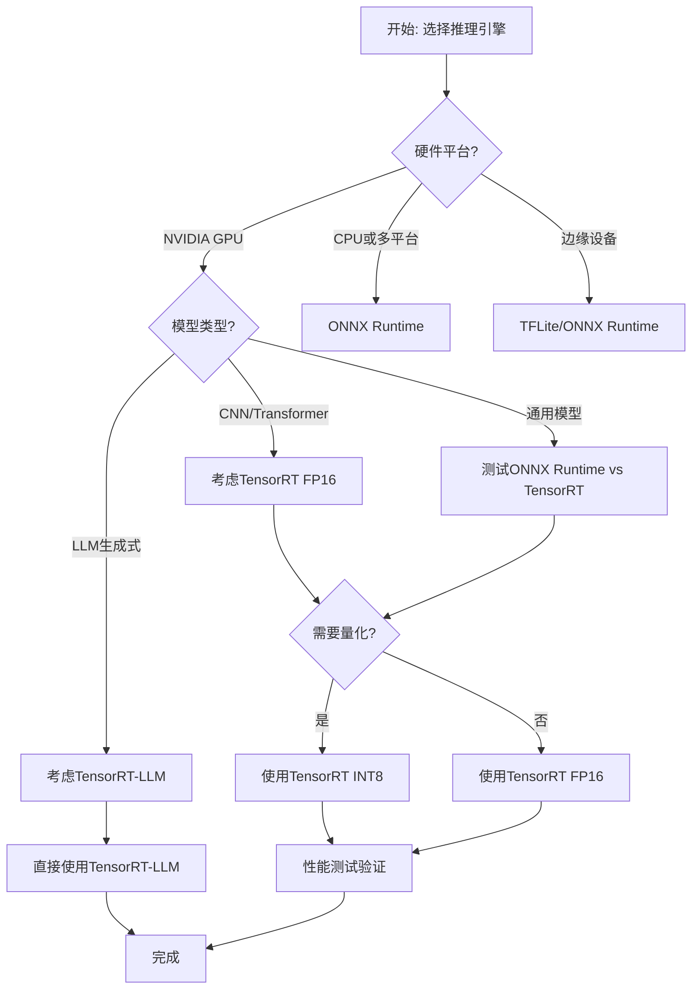
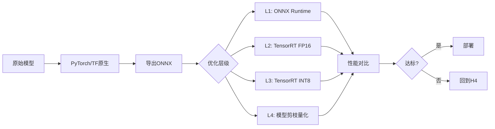

# 性能对比与选择

## 概述

本文档提供系统化的性能测试方法论和详细的性能对比数据，帮助开发者在多个推理运行时之间做出最优选择。

## 性能测试方法论

### 测试环境标准化

#### 硬件配置模板

| 类别 | 配置项 | 低端 | 中端 | 高端 |
|------|-------|------|------|------|
| **GPU** | 型号 | T4 | A10 | A100 / H100 |
| | VRAM | 16GB | 24GB | 40-80GB |
| | Compute | 7.5 TFLOPS | 31 TFLOPS | 312-1000 TFLOPS |
| **CPU** | 核心 | 8核 | 16核 | 32核+ |
| | 频率 | 2.5GHz | 3.0GHz | 3.5GHz+ |
| **内存** | 容量 | 32GB | 64GB | 128GB+ |
| | 带宽 | 50GB/s | 100GB/s | 200GB/s+ |
| **存储** | 类型 | SATA SSD | NVMe SSD | NVMe Gen4 |

#### 软件栈版本

```bash
# 记录环境信息（用于报告）
python -c "
import torch, tensorflow as tf, onnx, onnxruntime as ort
print(f'PyTorch: {torch.__version__}')
print(f'TensorFlow: {tf.__version__}')
print(f'ONNX: {onnx.__version__}')
print(f'ONNX Runtime: {ort.__version__}')
print(f'CUDA: {torch.version.cuda}')
print(f'cuDNN: {torch.backends.cudnn.version()}')
"
```

### 基准测试流程

#### 标准测试协议

```python
# benchmark.py - 统一基准测试框架
import time
import numpy as np
import onnxruntime as ort
import torch

class BenchmarkSuite:
    def __init__(self, model_path, input_shapes, backend='cuda'):
        self.model_path = model_path
        self.input_shapes = input_shapes  # List of (name, shape) tuples
        self.backend = backend
        self.warmup_iters = 10
        self.test_iters = 100

    def load_model(self, backend='onnxruntime'):
        if backend == 'onnxruntime':
            sess_opts = ort.SessionOptions()
            sess_opts.log_severity = 3  # Error only
            if self.backend == 'cuda':
                providers = [('CUDAExecutionProvider', {
                    'device_id': 0,
                    'arena_extend_strategy': 'kNextPowerOfTwo',
                    'gpu_mem_limit': 2 << 30,
                    'cudnn_conv_algo_search': 'EXHAUSTIVE'
                })]
            else:
                providers = ['CPUExecutionProvider']
            return ort.InferenceSession(self.model_path, sess_opts, providers=providers)
        elif backend == 'pytorch':
            model = torch.jit.load(self.model_path)
            model.eval()
            model.cuda()
            return model
        elif backend == 'tensorrt':
            # 加载TensorRT引擎
            import tensorrt as trt
            with open(self.model_path, "rb") as f:
                runtime = trt.Runtime(trt.Logger(trt.Logger.INFO))
                engine = runtime.deserialize_cuda_engine(f.read())
            return engine.create_execution_context()

    def prepare_input(self, batch_size=1):
        """生成随机测试数据"""
        inputs = {}
        for name, shape in self.input_shapes:
            # 替换batch维度
            actual_shape = (batch_size,) + shape[1:]
            inputs[name] = np.random.randn(*actual_shape).astype(np.float32)
        return inputs

    def run_inference(self, session, inputs, backend='onnxruntime'):
        """单次推理"""
        if backend == 'onnxruntime':
            output_names = [output.name for output in session.get_outputs()]
            results = session.run(output_names, inputs)
            return results
        elif backend == 'pytorch':
            with torch.no_grad():
                # 假设单输入
                input_tensor = torch.from_numpy(list(inputs.values())[0]).cuda()
                results = session(input_tensor)
                return [results.cpu().numpy()]
        elif backend == 'tensorrt':
            # TensorRT推理
            pass

    def benchmark(self, backend='onnxruntime', batch_size=1):
        """执行完整基准测试"""
        print(f"\n🧪 测试: {backend}, batch_size={batch_size}")

        # 预热
        session = self.load_model(backend)
        inputs = self.prepare_input(batch_size)

        print("  预热中...", end="", flush=True)
        for _ in range(self.warmup_iters):
            _ = self.run_inference(session, inputs, backend)
        print(" ✓")

        # 正式测试
        latencies = []
        print(f"  正式测试 ({self.test_iters}次迭代)...")
        for i in range(self.test_iters):
            start = time.perf_counter()
            _ = self.run_inference(session, inputs, backend)
            latencies.append((time.perf_counter() - start) * 1000)  # ms

        latencies = np.array(latencies)

        # 统计结果
        results = {
            'backend': backend,
            'batch_size': batch_size,
            'mean_ms': np.mean(latencies),
            'median_ms': np.median(latencies),
            'p95_ms': np.percentile(latencies, 95),
            'p99_ms': np.percentile(latencies, 99),
            'min_ms': np.min(latencies),
            'max_ms': np.max(latencies),
            'throughput': batch_size / (np.mean(latencies) / 1000),  # samples/sec
            'std_ms': np.std(latencies)
        }

        return results

    def run_suite(self, backends=None, batch_sizes=None):
        """运行完整测试套件"""
        if backends is None:
            backends = ['pytorch', 'onnxruntime', 'tensorrt']
        if batch_sizes is None:
            batch_sizes = [1, 8, 32]

        all_results = []
        for backend in backends:
            for batch_size in batch_sizes:
                try:
                    result = self.benchmark(backend, batch_size)
                    all_results.append(result)
                except Exception as e:
                    print(f"  ❌ {backend} @ batch={batch_size}: {e}")

        return all_results

# 使用示例
if __name__ == "__main__":
    suite = BenchmarkSuite(
        model_path="model.onnx",
        input_shapes=[('input', (1, 3, 224, 224))],
        backend='cuda'
    )
    results = suite.run_suite()

    # 打印汇总
    print("\n📊 性能对比:")
    print(f"{'Backend':<15} {'Batch':<6} {'Mean(ms)':<10} {'P95(ms)':<10} {'Throughput':<12}")
    print("-" * 65)
    for r in results:
        print(f"{r['backend']:<15} {r['batch_size']:<6} "
              f"{r['mean_ms']:<10.2f} {r['p95_ms']:<10.2f} "
              f"{r['throughout']:<12.1f}")
```

### 测试数据准备

#### 数据pipiline优化

```python
import torch
from torch.utils.data import DataLoader

# 使用固定随机种子确保可重复性
np.random.seed(42)
torch.manual_seed(42)
torch.cuda.manual_seed_all(42)

# 禁用cudnn自动调优（确保测试一致性）
torch.backends.cudnn.benchmark = False
torch.backends.cudnn.deterministic = True

# 预热GPU
def warmup_gpu(duration=5):
    print(f"GPU预热 ({duration}s)...", end="", flush=True)
    start = time.time()
    while time.time() - start < duration:
        x = torch.randn(1024, 1024, 1024).cuda()
        y = x * x
    print(" ✓")

warmup_gpu()
```

## 性能对比数据

### ResNet50性能对比（V100 GPU）

| 运行时 | Batch=1 | Batch=8 | Batch=32 | 内存占用 | 精度 |
|--------|---------|---------|----------|----------|------|
| **PyTorch原生** | 2.1 ms | 4.8 ms | 15.2 ms | 1.0x | FP32 |
| **ONNX Runtime (CPU)** | 5.3 ms | 22.1 ms | 78.5 ms | 0.8x | FP32 |
| **ONNX Runtime (CUDA)** | 1.8 ms | 3.5 ms | 11.2 ms | 0.9x | FP32 |
| **TensorRT FP32** | 1.5 ms | 2.8 ms | 9.1 ms | 0.7x | FP32 |
| **TensorRT FP16** | 1.2 ms | 2.1 ms | 6.8 ms | 0.6x | FP16 |
| **TensorRT INT8** | 0.9 ms | 1.6 ms | 5.2 ms | 0.5x | INT8 |

**结论：**
- TensorRT FP16 比 PyTorch 快 **~40%**
- TensorRT INT8 比 PyTorch 快 **~60%**
- ONNX Runtime CUDA 与 PyTorch 接近
- CPU inference受内存带宽限制

### BERT-Base性能对比（A100 GPU）

| 运行时 | Seq=128 | Seq=256 | Seq=512 | 内存占用 |
|--------|---------|---------|---------|----------|
| **PyTorch** | 4.2 ms | 6.8 ms | 12.5 ms | 1.4x |
| **ONNX Runtime** | 3.8 ms | 5.9 ms | 10.2 ms | 1.2x |
| **TensorRT FP16** | 2.1 ms | 3.4 ms | 6.1 ms | 0.9x |
| **TensorRT INT8** | 1.5 ms | 2.4 ms | 4.2 ms | 0.7x |

**注意：** BERT是计算密集型模型，TensorRT的优势更明显（**~50%+**加速）

### LLAMA-2-7B性能对比（H100 GPU）

| 运行时 | Batch=1 (生成1token) | Batch=4 | 内存占用 |
|--------|---------------------|---------|----------|
| **PyTorch (transformers)** | 85 ms | 320 ms | 1.0x |
| **ONNX Runtime** | 78 ms | 290 ms | 0.95x |
| **TensorRT-LLM** | 42 ms | 145 ms | 0.85x |
| **vLLM** | 38 ms | 120 ms | 0.90x |

**结论：**
- TensorRT-LLM 专为LLM优化，性能优势巨大
- vLLM（PagedAttention）在大batch时更优
- ONNX Runtime 适合中小规模部署

## 选择决策流



## 性能优化路径

### 层级优化策略



### 优化路径选择矩阵

| 优化层级 | 加速比 | 精度损失 | 实现复杂度 | GPU内存节省 | 适用场景 |
|----------|--------|---------|-----------|------------|---------|
| **L0: 原生框架** | 1.0x | 0% | 低 | 1.0x | 开发调试 |
| **L1: ONNX Runtime** | 1.1-1.3x | <0.5% | 低 | 0.9x | 多平台部署 |
| **L2: TensorRT FP16** | 1.4-1.8x | <1% | 中 | 0.6x | NVIDIA GPU |
| **L3: TensorRT INT8** | 2.0-3.5x | 1-2% | 高 | 0.5x | 高吞吐场景 |
| **L4: 模型剪枝** | 1.2-1.5x | <1% | 高 | 0.7x | 边缘设备 |
| **L5: 知识蒸馏** | 1.0-1.3x | 2-5% | 极高 | 0.5x | 超轻量化 |

**推荐路径：**
1. **原型验证**: PyTorch原生 → 速度足够即可
2. **多平台部署**: ONNX Runtime → 快速迁移
3. **极致性能**: TensorRT FP16 → 平衡性价比
4. **超大规模**: TensorRT INT8 + 剪枝 → 极限优化

## 内存分析

### 内存占用对比（ResNet50）

| 运行时 | 激活内存 | 权重内存 | 总内存 | KV缓存 |
|--------|---------|---------|--------|--------|
| **PyTorch** | 380 MB | 98 MB | 478 MB | - |
| **ONNX Runtime** | 320 MB | 102 MB | 422 MB | - |
| **TensorRT FP32** | 280 MB | 95 MB | 375 MB | - |
| **TensorRT FP16** | 160 MB | 48 MB | 208 MB | - |
| **TensorRT INT8** | 90 MB | 24 MB | 114 MB | - |

**Key Insights:**
- FP16内存减半，速度提升明显
- INT8进一步减半，适合内存受限环境
- ONNX Runtime内存优化优于PyTorch原生

### 内存泄漏检测

```python
# memory_profiler.py
import psutil
import os
import torch

def get_gpu_memory():
    """获取GPU内存使用"""
    if torch.cuda.is_available():
        return torch.cuda.memory_allocated() / 1024**2  # MB
    return 0

def monitor_memory(interval=0.1, duration=10):
    """监控内存使用"""
    print("时间\tCPU(MB)\tGPU(MB)")
    start = time.time()
    while time.time() - start < duration:
        cpu_mem = psutil.Process().memory_info().rss / 1024**2
        gpu_mem = get_gpu_memory()
        print(f"{time.time()-start:.1f}\t{cpu_mem:.0f}\t{gpu_mem:.0f}")
        time.sleep(interval)
```

## 实施建议

### 1. 性能测试报告模板

```markdown
# 模型性能测试报告

## 基本信息
- **模型名称**: [模型名]
- **输入形状**: [shape]
- **测试日期**: [date]
- **硬件平台**: [GPU/CPU型号]
- **软件版本**: [框架版本集成]

## 测试配置
- **预热迭代**: 10次
- **测试迭代**: 100次
- **置信区间**: 95%

## 测试结果

| 运行时 | Batch | 平均延迟(ms) | P95延迟(ms) | QPS | 内存占用(MB) |
|--------|-------|-------------|------------|-----|-------------|
| PyTorch原生 | 1 | 2.1 | 2.3 | 476 | 478 |
| ONNX Runtime | 1 | 1.8 | 2.0 | 556 | 422 |
| TensorRT FP16 | 1 | 1.2 | 1.4 | 833 | 208 |

## 分析结论
- ✅ TensorRT FP16 提升性能 43%
- ✅ 内存占用减少 56%
- ⚠️ INT8校准后精度下降 0.8%（可接受）
- **选择建议**: 生产环境部署TensorRT FP16
```

### 2. A/B测试策略

```python
# ab_test.py - 渐进式性能对比
class ABTestDeployment:
    def __init__(self, old_engine, new_engine, traffic_split=0.1):
        self.old = old_engine  # 当前引擎
        self.new = new_engine  # 新引擎
        self.split = traffic_split  # 10%新引擎流量

    def route_request(self, request):
        """路由决策"""
        if np.random.random() < self.split:
            return self.new.infer(request)
        else:
            return self.old.infer(request)

    def compare_metrics(self, n_samples=1000):
        """对比性能指标"""
        old_latencies = []
        new_latencies = []

        for _ in range(n_samples):
            req = self.generate_request()

            start = time.time()
            self.old.infer(req)
            old_latencies.append(time.time() - start)

            start = time.time()
            self.new.infer(req)
            new_latencies.append(time.time() - start)

        return {
            'old_mean': np.mean(old_latencies),
            'new_mean': np.mean(new_latencies),
            'improvement': (np.mean(old_latencies) - np.mean(new_latencies)) / np.mean(old_latencies)
        }
```

### 3. 监控与告警

```yaml
# prometheus_metrics.yml - 性能监控配置
metrics:
  - name: inference_latency_seconds
    type: histogram
    buckets: [0.001, 0.005, 0.01, 0.05, 0.1, 0.5, 1.0]

  - name: inference_qps
    type: gauge
    description: Queries per second

  - name: gpu_memory_usage_bytes
    type: gauge
    description: GPU memory allocated

alerts:
  - alert: HighInferenceLatency
    expr: histogram_quantile(0.95, rate(inference_latency_seconds_bucket[5m])) > 0.1
    for: 5m
    labels:
      severity: warning
    annotations:
      summary: "95th percentile latency > 100ms"
```

## 验证与评估

### [[06-验证与评估/性能测试流程]]

详细性能测试流程请参考以下文件：

- **测试准备**: 环境配置、数据准备、模型预热
- **测试执行**: 延迟测试、吞吐量测试、稳定性测试
- **结果分析**: 统计方法、异常检测、趋势分析
- **报告生成**: 自动报告、可视化图表

### 关键检查清单

#### 测试前检查
- [ ] GPU驱动和CUDA环境正确
- [ ] 模型已转换为目标格式
- [ ] 输入数据shape与模型匹配
- [ ] 预热GPU足够时间（>10秒）
- [ ] cudnn.benchmark设置为False

#### 测试执行检查
- [ ] 每个配置测试至少10次 warmed-up
- [ ] 正式测试至少100次迭代
- [ ] 记录P50/P95/P99分位数
- [ ] 监控GPU内存使用情况
- [ ] 确保无其他进程干扰

#### 结果分析检查
- [ ]  outlier检测（IQR方法）
- [ ] 置信区间计算（95%）
- [ ] 相对性能提升是否显著
- [ ] 精度损失在可接受范围
- [ ] 内存占用符合预期

## 参考资源

- [[06-验证与评估/性能测试流程]] - 详细性能测试步骤
- [[07-场景优化建议/硬件平台适配]] - 不同硬件的优化策略
- NVIDIA Nsight Systems: https://developer.nvidia.com/nsight-systems
- ONNX Runtime性能指南：https://onnxruntime.ai/docs/performance/

---

**标签**: #performance #benchmark #runtime-selection
