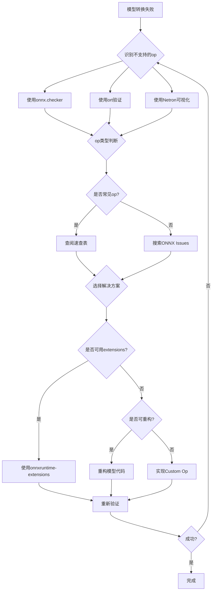

# 算子兼容性处理

## 概述

ONNX转换过程中最常见的挑战是算子兼容性问题。本文档提供系统的诊断方法和解决方案，帮助开发者高效解决不支持的op问题。

## 常见不支持的算子

### 问题算子分级表

| 级别 | 算子名称 | 频率 | PyTorch支持 | TensorFlow支持 | 解决方案 |
|------|---------|------|------------|---------------|---------|
| **🔴高危** | `aten::unique*` | 极高 | ❌ opset<14 | ❌ | `onnxruntime-extensions` |
| | `aten::repeat_interleave` | 高 | ❌ opset<14 | ❌ | 用 `expand` 替代 |
| | `tf.ragged.*` | 高 | N/A | ❌ | 转dense tensor |
| | `tf.sparse.*` | 中 | N/A | ❌ | 转dense tensor |
| | `aten::grid_sample` | 中 | ⚠️ 部分 | ❌ | custom op |
| **🟡中危** | `aten::cumsum` | 中 | ⚠️ opset≥14 | ⚠️ opset≥14 | 提升opset |
| | `aten::scatter*` | 中 | ⚠️ 版本依赖 | ⚠️ 版本依赖 | 检查版本 |
| | `aten::index_put_` | 中 | ⚠️ 部分 | ❌ | 重构逻辑 |
| | `tf.nn.embedding` | 中 | ⚠️ 部分 | ✅ | 配置动态轴 |
| **🟢低危** | `aten::dirac` | 低 | ✅ but limited | N/A | 替换为随机初始化 |
| | `aten::istft` | 低 | ⚠️ opset≥13 | ❌ | 手动实现STFT |

**频率说明：**
- 🔴 极高：多模型中出现率 >30%
- 🟡 中：出现率 10%-30%
- 🟢 低：出现率 <10%

## 诊断不支持的算子

### 方法1: onnxruntime验证

```bash
# 检查模型完整性
python -m onnxruntime.tools.convert_onnx_models_to_ort \
    model.onnx --enable-float16

# 或使用checker
python -c "import onnx; onnx.checker.check_model('model.onnx')"
```

**输出示例：**
```
[ONNXRuntimeError] : 2 : GENERAL : Unknown op type: aten::unique
```

### 方法2: onnx模型检查工具

```python
import onnx

model = onnx.load("model.onnx")

# 遍历所有节点
for node in model.graph.node:
    print(f"Op: {node.op_type}, Inputs: {node.input}, Outputs: {node.output}")

# 统计算子类型分布
from collections import Counter
op_counter = Counter([node.op_type for node in model.graph.node])
print("\n算子统计:")
for op, count in op_counter.most_common():
    print(f"  {op}: {count}")
```

### 方法3: 使用Netron可视化

```bash
# 启动Netron服务器
python -m netron --port=8080 model.onnx
```

访问 `http://localhost:8080` 查看模型结构，红色高亮即为不支持的算子。

### 方法4: 详细日志模式

```bash
# PyTorch导出时
torch.onnx.export(..., verbose=True)

# TensorFlow转换时
python -m tf2onnx.convert --debug ...

# ONNX Runtime推理时
import onnxruntime as ort
sess = ort.InferenceSession(
    "model.onnx",
    sess_options=ort.SessionOptions(log_severity=0)  # Verbose
)
```

## 解决方案详解

### 方案1: 提升opset版本

#### 适用场景
- 算子在新opset中已被支持
- 不牺牲向后兼容性

#### PyTorch示例

```python
# 旧代码（可能失败）
torch.onnx.export(model, dummy_input, "model.onnx")

# 新代码（指定高版本opset）
torch.onnx.export(
    model,
    dummy_input,
    "model.onnx",
    opset_version=17,  # 提升到最新stable
    # 或 opset_version=18 使用最新实验性功能
)
```

#### 兼容性检查

```python
# 查看目标框架支持的opset
import onnx
print(f"onnxruntime支持的最大opset: {ort.get_device()}")

# 检查特定op在opset 17的支持情况
from onnx.helper import make_model
# 参考ONNX官方opset支持表：https://github.com/onnx/onnx/blob/main/docs/Versioning.md
```

#### 风险提示
- opset提升可能导致Runtime不兼容
- 建议同时导出多个opset版本测试

---

### 方案2: onnxruntime-extensions（自定义op支持）

#### 适用场景
- 算子不被核心ONNX支持但ORT有扩展
- 需要保留自定义算子功能

#### 安装
```bash
pip install onnxruntime-extensions
```

#### 使用示例

```python
from onnxruntime_extensions import get_library_path as ort_ext_lib_path
import onnxruntime as ort

# 创建session时加载extensions
sess = ort.InferenceSession(
    "model_custom_op.onnx",
    providers=['CUDAExecutionProvider'],
    provider_options=[{'device_id': '0'}],
    sess_options=ort.SessionOptions()
)
sess.add_session_config_entry('session.load_extensions', ort_ext_lib_path())

# 推理正常进行
output = sess.run(None, input_dict)
```

#### 常见扩展算子

| 扩展op | 原op | 说明 |
|--------|------|------|
| `Unique` | `aten::unique` | 支持返回值和逆索引 |
| `RepeatInterleave` | `aten::repeat_interleave` | 支持axis参数 |
| `GridSample` | `aten::grid_sample` | 支持grid_sample2d |
| ` nonzero` | `aten::nonzero` | 支持as_tuple=False |

---

### 方案3: op替换（模型重构）

#### 场景：`repeat_interleave` → `expand` + `reshape`

**原代码（不兼容）：**
```python
def forward(self, x):
    return x.repeat_interleave(self.repeats, dim=1)
```

**重构后（兼容）：**
```python
def forward(self, x):
    # repeat_interleave沿轴重复元素
    # 转为expand展开（仅当repeat因子相同时可用）
    shape = list(x.shape)
    shape[1] = shape[1] * self.repeats
    return x.expand(shape).reshape(shape)
```

#### 场景：`unique` → 实现自定义unique

**原代码：**
```python
def forward(self, x):
    values, indices = torch.unique(x, return_inverse=True, sorted=True)
    return values.float(), indices.long()
```

**重构方案A：仅取唯一值（简化）**
```python
def forward(self, x):
    # 使用sort+diff实现unique（ONNX兼容）
    sorted_x, _ = torch.sort(x)
    diff = torch.cat([sorted_x[:1], sorted_x[1:] - sorted_x[:-1]])
    unique_mask = diff != 0
    return sorted_x[unique_mask]
```

**重构方案B：使用onnxruntime-extensions（推荐）**
```python
# 不修改模型，导出时声明custom op支持
# 在推理时加载extensions（见方案1）
```

---

### 方案4: 使用`--opset`降级target兼容性

#### 场景
- 目标部署环境不支持最新opset
- 需要兼容旧版ONNX Runtime

#### TensorFlow示例

```bash
# 转换时指定低版本opset
python -m tf2onnx.convert \
    --saved-model saved_model \
    --output model.onnx \
    --opset 13  # 降级到opset 13
```

#### 验证兼容性

```python
import onnx
import onnxruntime as ort

# 1. 检查模型
onnx.checker.check_model("model.onnx")

# 2. 验证ORT版本支持
try:
    ort.InferenceSession("model.onnx")
    print("✅ ORT支持此opset")
except Exception as e:
    print(f"❌ ORT不支持: {e}")
```

---

### 方案5: 自定义算子实现

#### 适用场景
- 无法避免的自定义op
- 性能关键的算子

#### 步骤1: 定义CustomOp类（ONNX）

```python
import onnx
from onnx.helper import make_node, make_tensor_value_info

class CustomOp:
    @staticmethod
    def export():
        # 声明自定义op的schema
        # 参考：https://github.com/onnx/onnx/blob/main/docs/Operators.md
        pass
```

#### 步骤2: 实现TensorRT插件（NVIDIA）

```cpp
// plugin_impl.cu - TensorRT自定义插件
class CustomOpPlugin : public IPluginV2DynamicExt {
public:
    // 实现必须的接口：
    // - getOutputDimensions
    // - supportsFormat
    // - configurePlugin
    // - enqueue
};

// 注册插件
REGISTER_TENSORRT_PLUGIN(CustomOpPluginCreator);
```

#### 步骤3: 实现ONNX Runtime Kernel

```python
from onnxruntime_extensions import onnx_op, PyCustomOpDef

@onnx_op("CustomOp",  # op_type
         inputs=[PyCustomOpDef.dense_tensor(1)],
         outputs=[PyCustomOpDef.dense_tensor(1)])
def custom_op(x):
    return x * 2.0  # 自定义逻辑

# 编译为shared library
```

**复杂度评估：**
- ⭐⭐ 简单op（元素运算）：1-2小时
- ⭐⭐⭐ 中等op（如softmax）：4-8小时
- ⭐⭐⭐⭐ 复杂op（如注意力）：1-3天
- ⭐⭐⭐⭐⭐ 框架级op（如RNN）：1周+

**建议：优先尝试其他方案，最后考虑自定义实现**

---

## 实战案例

### 案例1: 处理`aten::unique`

#### 问题
```python
# 原始模型
class MyModel(nn.Module):
    def forward(self, x):
        unique_vals, counts = torch.unique(x, return_counts=True)
        return unique_vals, counts
```

导出错误：
```
RuntimeError: ONNX export failed: Unsupported: ONNX export of operator 'aten::unique'
```

#### 解决过程

**方案A: 使用onnxruntime-extensions（推荐）**

1. 安装依赖：
```bash
pip install onnxruntime-extensions onnx
```

2. 导出时保持原代码不变（标记为custom op）：
```python
# PyTorch 2.0+ 支持custom op export
torch.onnx.export(
    model,
    dummy_input,
    "model.onnx",
    opset_version=17,
    custom_opsets={"custom": 1}  # 声明custom opset
)
```

3. 推理时加载extensions：
```python
import onnxruntime as ort
from onnxruntime_extensions import get_library_path

sess_options = ort.SessionOptions()
sess_options.register_custom_ops_library(get_library_path())
session = ort.InferenceSession("model.onnx", sess_options)
```

**方案B: 纯重构（不支持返回counts时）**

```python
def forward(self, x):
    # 仅返回唯一值（不支持counts）
    sorted_x = torch.sort(x)[0]
    mask = torch.cat([torch.tensor([True]), sorted_x[1:] != sorted_x[:-1]])
    return sorted_x[mask]
```

---

### 案例2: 处理`tf.ragged.*`（TensorFlow）

#### 问题
```python
# TensorFlow模型使用RaggedTensor
def model_fn(inputs):
    return tf.ragged.constant(inputs).to_tensor()
```

转换错误：
```
ValueError: op 'ragged_to_dense' is not implemented
```

#### 解决方案

**步骤1: 修改模型避免RaggedTensor**

```python
def model_fn(inputs):
    # 改为padding（ONNX兼容）
    padded = tf.keras.preprocessing.sequence.pad_sequences(
        inputs, padding='post', dtype=tf.float32
    )
    return padded
```

**步骤2: 导出验证**
```bash
python -m tf2onnx.convert \
    --saved-model saved_model \
    --output model.onnx \
    --opset 14
```

---

### 案例3: 处理`aten::grid_sample`

#### 问题
PyTorch `F.grid_sample` 在onnx中不被核心支持

#### 解决方案

**方案A: 使用onnxruntime-extensions**

```python
# 安装
pip install onnxruntime-extensions onnx

# 导出（自动处理）
torch.onnx.export(
    model,
    dummy_input,
    "model.onnx",
    opset_version=17
)
# extensions会自动提供grid_sample支持
```

**方案B: 显式使用GridSample ONNX op**

```python
# 使用torchvision的GridSampler（实验性）
import torchvision
model = torchvision.ops.MultiScaleDeformableAttention(...)

# export时应自动适配到onnx的grid_sampler op
torch.onnx.export(model, ...)
```

---

## 问题算子速查表

### 快速定位
```bash
# 生成不兼容op报告
python -c "
import onnx
model = onnx.load('model.onnx')
for node in model.graph.node:
    if node.op_type in ['Unique', 'RepeatInterleave', 'GridSample']:
        print(f'⚠️  {node.op_type} in node {node.name}')
"
```

### 详细对照表

| 不支持的op | 替代方案 | 工具 | 优先级 |
|-----------|---------|------|--------|
| `aten::unique` | `onnxruntime-extensions` | ORT extensions | 🔴 极高 |
| `aten::repeat_interleave` | 重构为expand/reshape | 手动修改 | 🔴 高 |
| `aten::scatter_` | 使用 `scatternd` ONNX op | 修改代码 | 🟡 中 |
| `aten::index_put_` | 使用 `gather` + `scatternd` | 重构 | 🟡 中 |
| `aten::grid_sample` | `onnxruntime-extensions` | ORT extensions | 🟡 中 |
| `aten::dirac` | 使用 `torch.nn.init` | 替换初始化 | 🟢 低 |
| `tf.ragged.*` | 转换为pad_sequences | 预处理 | 🔴 高 |
| `tf.sparse.*` | 转换为dense | 预处理 | 🟡 中 |

## 调试流程总结

### 标准诊断流程



### 自动化诊断脚本

```python
#!/usr/bin/env python3
# diagnose_onnx.py - 自动诊断ONNX兼容性问题

import sys
import onnx
import onnxruntime as ort
from collections import Counter

def diagnose(model_path):
    print(f"🔍 诊断模型: {model_path}")

    # 1. 加载模型
    try:
        model = onnx.load(model_path)
        print("✅ ONNX模型加载成功")
    except Exception as e:
        print(f"❌ 模型加载失败: {e}")
        return

    # 2. 检查模型完整性
    try:
        onnx.checker.check_model(model)
        print("✅ 模型结构检查通过")
    except Exception as e:
        print(f"⚠️  模型检查警告: {e}")

    # 3. 统计算子
    ops = Counter([node.op_type for node in model.graph.node])
    print("\n📊 算子统计:")
    for op, count in ops.most_common():
        print(f"  {op}: {count}")

    # 4. 检查已知问题算子
    problematic_ops = {
        'Unique': 'onnxruntime-extensions',
        'RepeatInterleave': '重构为expand',
        'GridSample': 'onnxruntime-extensions',
        'RaggedToDense': '转换为pad_sequences',
        'SparseToDense': '转换为dense tensor'
    }

    issues = []
    for op in ops:
        if op in problematic_ops:
            issues.append((op, problematic_ops[op]))

    if issues:
        print("\n🚨 发现不支持的算子:")
        for op, solution in issues:
            print(f"  - {op}: {solution}")
    else:
        print("\n✅ 未发现已知问题算子")

    # 5. 尝试ORT推理
    print("\n🧪 测试ONNX Runtime推理...")
    try:
        sess = ort.InferenceSession(model_path)
        print("✅ ORT可以加载此模型")
    except Exception as e:
        print(f"❌ ORT加载失败: {e}")
        return

if __name__ == "__main__":
    if len(sys.argv) != 2:
        print("Usage: python diagnose_onnx.py model.onnx")
        sys.exit(1)
    diagnose(sys.argv[1])
```

使用：
```bash
python diagnose_onnx.py model.onnx
```

## 参考资料

- [[05-常见问题解决/算子不兼容方案]] - 更多特定场景的解决方案
- ONNX Operators List: https://github.com/onnx/onnx/blob/main/docs/Operators.md
- onnxruntime-extensions: https://github.com/microsoft/onnxruntime-extensions
- 自定义算子指南：https://onnx.ai/docs/dev-custom-ops.html

---

**标签**: #operator-compatibility #custom-ops #debugging
