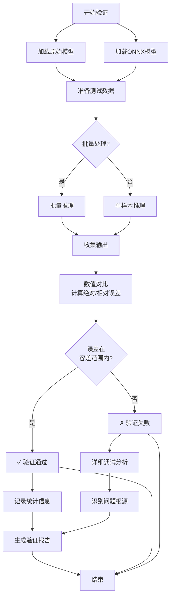

# 正确性验证方法

## 概述

ONNX模型转换后，必须进行严格的功能验证，确保转换前后模型的输出一致性。本指南提供标准化的验证流程和自动化脚本。

## 输出一致性检查

### 核心验证指标

```python
import numpy as np
from onnxruntime import InferenceSession

def validate_outputs(reference_output, onnx_output, rtol=1e-3, atol=1e-5):
    """
    验证ONNX输出与参考模型输出的一致性

    参数:
    - reference_output: 原始框架(PyTorch/TF)的输出
    - onnx_output: ONNX Runtime的输出
    - rtol: 相对容差阈值
    - atol: 绝对容差阈值

    返回:
    - is_valid: 布尔值，表示验证是否通过
    - max_abs_diff: 最大绝对误差
    - max_rel_diff: 最大相对误差
    """
    ref_array = np.asarray(reference_output)
    onnx_array = np.asarray(onnx_output)

    # 计算绝对误差和相对误差
    abs_diff = np.abs(ref_array - onnx_array)
    max_abs_diff = np.max(abs_diff)

    # 避免除零，使用参考值的绝对值作为分母
    denominator = np.abs(ref_array) + 1e-12
    rel_diff = abs_diff / (denominator + atol)
    max_rel_diff = np.max(rel_diff)

    # 检查是否在容差范围内
    is_valid = np.allclose(
        ref_array,
        onnx_array,
        rtol=rtol,
        atol=atol
    )

    return is_valid, max_abs_diff, max_rel_diff
```

### 数值容差阈值设置建议

| 数据类型 | 推荐rtol | 推荐atol | 说明 |
|---------|---------|---------|------|
| FP32 | 1e-3 | 1e-5 | 标准配置，适用于大多数模型 |
| FP16 | 1e-2 | 1e-3 | 较低精度，容差适当放宽 |
| INT8量化 | 1e-1 | 1e-2 | 显著精度损失可接受 |
| 分类任务输出 | 5e-3 | 1e-4 | 需要更高精度保持类别一致性 |
| 目标检测边界框 | 1e-3 | 1e-3 | IoU计算对精度较敏感 |

## 自动化验证脚本模板

### 完整验证框架

```python
#!/usr/bin/env python3
"""
ONNX模型验证自动化脚本
支持多框架对比、批量测试、详细报告生成
"""

import numpy as np
import torch
import tensorflow as tf
import onnxruntime as ort
from pathlib import Path
import json
import time
from typing import Dict, List, Tuple, Any
import sys

class ONNXValidator:
    def __init__(
        self,
        reference_model,
        onnx_path: str,
        framework: str = 'pytorch',
        rtol: float = 1e-3,
        atol: float = 1e-5
    ):
        """
        初始化验证器

        参数:
        - reference_model: 原始模型对象(PyTorch/TensorFlow)
        - onnx_path: ONNX模型文件路径
        - framework: 框架类型 'pytorch' 或 'tensorflow'
        - rtol/atol: 容差阈值
        """
        self.reference_model = reference_model
        self.onnx_path = onnx_path
        self.framework = framework
        self.rtol = rtol
        self.atol = atol

        # 初始化ONNX Runtime会话
        self.ort_session = ort.InferenceSession(
            onnx_path,
            providers=['CPUExecutionProvider']
        )
        self.input_names = [inp.name for inp in self.ort_session.get_inputs()]
        self.output_names = [out.name for out in self.ort_session.get_outputs()]

        # 验证结果存储
        self.results = {
            'model_path': onnx_path,
            'framework': framework,
            'test_cases': [],
            'summary': {}
        }

    def prepare_input(self, input_data: np.ndarray) -> Dict[str, np.ndarray]:
        """准备ONNX Runtime输入"""
        if len(self.input_names) == 1:
            return {self.input_names[0]: input_data}
        else:
            # 多输入处理
            return {name: input_data for name in self.input_names}

    def run_reference(self, input_data: np.ndarray) -> Tuple[np.ndarray, float]:
        """运行原始模型获取参考输出"""
        start = time.time()

        if self.framework == 'pytorch':
            if isinstance(input_data, np.ndarray):
                input_tensor = torch.from_numpy(input_data)
            else:
                input_tensor = input_data

            with torch.no_grad():
                if isinstance(input_tensor, dict):
                    outputs = self.reference_model(**input_tensor)
                else:
                    outputs = self.reference_model(input_tensor)

            if isinstance(outputs, (list, tuple)):
                outputs = [o.numpy() if isinstance(o, torch.Tensor) else o
                          for o in outputs]
            else:
                outputs = outputs.numpy() if isinstance(outputs, torch.Tensor) else outputs

        elif self.framework == 'tensorflow':
            # TensorFlow模型执行逻辑
            if isinstance(input_data, np.ndarray):
                input_data = tf.convert_to_tensor(input_data)

            outputs = self.reference_model(input_data, training=False)
            outputs = outputs.numpy() if hasattr(outputs, 'numpy') else outputs

        elapsed = time.time() - start
        return outputs, elapsed

    def run_onnx(self, input_data: np.ndarray) -> Tuple[np.ndarray, float]:
        """运行ONNX模型"""
        # 准备输入字典
        if isinstance(input_data, dict):
            ort_inputs = input_data
        else:
            ort_inputs = self.prepare_input(input_data)

        start = time.time()
        ort_outputs = self.ort_session.run(
            self.output_names,
            ort_inputs
        )
        elapsed = time.time() - start

        # 单输出直接返回数组，多输出返回列表
        if len(ort_outputs) == 1:
            return ort_outputs[0], elapsed
        return ort_outputs, elapsed

    def validate_case(
        self,
        input_data: np.ndarray,
        case_name: str = "default"
    ) -> Dict[str, Any]:
        """
        验证单个测试用例

        返回详细验证结果
        """
        print(f"  测试用例: {case_name}")

        # 运行两个模型
        ref_output, ref_time = self.run_reference(input_data)
        onnx_output, onnx_time = self.run_onnx(input_data)

        # 处理多输出情况
        if isinstance(ref_output, (list, tuple)) and isinstance(onnx_output, list):
            num_outputs = len(ref_output)
            case_results = []
            overall_valid = True

            for i in range(num_outputs):
                is_valid, max_abs, max_rel = validate_outputs(
                    ref_output[i], onnx_output[i],
                    self.rtol, self.atol
                )
                case_results.append({
                    'output_idx': i,
                    'is_valid': is_valid,
                    'max_abs_diff': float(max_abs),
                    'max_rel_diff': float(max_rel),
                    'shape': ref_output[i].shape
                })
                overall_valid = overall_valid and is_valid

        else:
            # 单输出
            is_valid, max_abs, max_rel = validate_outputs(
                ref_output, onnx_output,
                self.rtol, self.atol
            )
            case_results = [{
                'output_idx': 0,
                'is_valid': is_valid,
                'max_abs_diff': float(max_abs),
                'max_rel_diff': float(max_rel),
                'shape': ref_output.shape if hasattr(ref_output, 'shape') else 'N/A'
            }]
            overall_valid = is_valid

        case_result = {
            'case_name': case_name,
            'reference_time_ms': ref_time * 1000,
            'onnx_time_ms': onnx_time * 1000,
            'speedup': ref_time / onnx_time if onnx_time > 0 else 0,
            'overall_valid': overall_valid,
            'output_details': case_results
        }

        self.results['test_cases'].append(case_result)
        return case_result

    def print_summary(self):
        """打印验证结果摘要"""
        total_cases = len(self.results['test_cases'])
        passed_cases = sum(1 for tc in self.results['test_cases']
                          if tc['overall_valid'])

        avg_ref_time = np.mean([tc['reference_time_ms']
                               for tc in self.results['test_cases']])
        avg_onnx_time = np.mean([tc['onnx_time_ms']
                                for tc in self.results['test_cases']])
        avg_speedup = avg_ref_time / avg_onnx_time if avg_onnx_time > 0 else 0

        self.results['summary'] = {
            'total_cases': total_cases,
            'passed_cases': passed_cases,
            'failed_cases': total_cases - passed_cases,
            'pass_rate': passed_cases / total_cases if total_cases > 0 else 0,
            'avg_reference_time_ms': float(avg_ref_time),
            'avg_onnx_time_ms': float(avg_onnx_time),
            'avg_speedup': float(avg_speedup)
        }

        print("\n" + "="*60)
        print("验证结果摘要")
        print("="*60)
        print(f"测试用例总数: {total_cases}")
        print(f"通过用例数: {passed_cases}")
        print(f"失败用例数: {total_cases - passed_cases}")
        print(f"通过率: {passed_cases/total_cases*100:.1f}%" if total_cases > 0 else "N/A")
        print(f"\n平均推理时间:")
        print(f"  原始模型: {avg_ref_time:.2f} ms")
        print(f"  ONNX Runtime: {avg_onnx_time:.2f} ms")
        print(f"  加速比: {avg_speedup:.2f}x")
        print("="*60)

    def save_report(self, output_path: str):
        """保存详细验证报告为JSON"""
        with open(output_path, 'w') as f:
            json.dump(self.results, f, indent=2)
        print(f"\n详细报告已保存至: {output_path}")

# ============================================================
# 示例：ResNet-50 端到端验证
# ============================================================

def validate_resnet50_conversion(
    pytorch_model_path: str,
    onnx_model_path: str,
    test_images_path: str = None,
    num_samples: int = 100
):
    """
    ResNet-50转换验证完整流程

    使用ImageNet样例数据进行端到端验证
    """
    import torchvision.models as models
    from torchvision import transforms
    from PIL import Image
    import glob

    print("开始ResNet-50 ONNX模型验证")
    print(f"原始模型: {pytorch_model_path}")
    print(f"ONNX模型: {onnx_model_path}")

    # 1. 加载模型
    print("\n[1/4] 加载模型...")
    pytorch_model = models.resnet50(weights=None)
    pytorch_model.load_state_dict(torch.load(pytorch_model_path))
    pytorch_model.eval()

    # 2. 准备测试数据
    print("[2/4] 准备测试数据...")
    preprocess = transforms.Compose([
        transforms.Resize(256),
        transforms.CenterCrop(224),
        transforms.ToTensor(),
        transforms.Normalize(
            mean=[0.485, 0.456, 0.406],
            std=[0.229, 0.224, 0.225]
        )
    ])

    def load_test_images(num_samples):
        """加载测试图像"""
        images = []
        labels = []

        # 从本地目录或使用随机数据
        if test_images_path and Path(test_images_path).exists():
            image_files = list(Path(test_images_path).glob("*.jpg"))[:num_samples]
            for img_file in image_files:
                img = Image.open(img_file).convert('RGB')
                tensor = preprocess(img).unsqueeze(0)
                images.append(tensor.numpy())
        else:
            # 生成随机数据作为fallback
            print("  (未指定图像目录，使用随机数据)")
            for _ in range(num_samples):
                images.append(np.random.randn(1, 3, 224, 224).astype(np.float32))

        return np.vstack(images) if len(images) > 0 else None

    test_data = load_test_images(num_samples)

    # 3. 运行验证
    print(f"[3/4] 执行验证 ({num_samples} 个样本)...")
    validator = ONNXValidator(
        reference_model=pytorch_model,
        onnx_path=onnx_model_path,
        framework='pytorch',
        rtol=1e-3,
        atol=1e-5
    )

    for i in range(min(num_samples, len(test_data))):
        case_result = validator.validate_case(
            test_data[i:i+1],
            case_name=f"sample_{i:04d}"
        )
        status = "✓" if case_result['overall_valid'] else "✗"
        print(f"  {status} 样本 {i+1}/{min(num_samples, len(test_data))} "
              f"- speedup: {case_result['speedup']:.2f}x")

    # 4. 输出总结
    validator.print_summary()

    # 5. 保存报告
    report_path = Path("validation_report_resnet50.json")
    validator.save_report(str(report_path))

    return validator.results

# ============================================================
# 多输出模型验证示例
# ============================================================

def validate_multi_output_model(
    pytorch_model,
    onnx_path: str,
    sample_batches: List[np.ndarray]
):
    """
    验证多输出模型（如分割、检测模型）

    适用于U-Net、YOLO、Mask R-CNN等多输出场景
    """
    validator = ONNXValidator(
        reference_model=pytorch_model,
        onnx_path=onnx_path,
        framework='pytorch'
    )

    for idx, batch in enumerate(sample_batches):
        result = validator.validate_case(
            batch,
            case_name=f"batch_{idx}"
        )

        # 输出每个output的详细对比
        for output_detail in result['output_details']:
            out_idx = output_detail['output_idx']
            status = "通过" if output_detail['is_valid'] else "失败"
            print(f"  Output {out_idx}: {status}, "
                  f"max_abs={output_detail['max_abs_diff']:.2e}, "
                  f"shape={output_detail['shape']}")

    validator.print_summary()
    return validator.results

# ============================================================
# 批量自动化测试脚本
# ============================================================

def run_automated_validation_suite(
    model_list: List[Dict[str, str]],
    test_data_path: str,
    output_dir: str = "./validation_reports"
):
    """
    批量验证多个模型

    参数:
    - model_list: 模型配置列表, 每个元素包含:
        {
            'name': 'model_name',
            'framework': 'pytorch/tensorflow',
            'original_path': 'path/to/original',
            'onnx_path': 'path/to/onnx',
            'rtol': 1e-3,
            'atol': 1e-5
        }
    - test_data_path: 测试数据文件(.npy或目录)
    - output_dir: 报告输出目录
    """
    Path(output_dir).mkdir(exist_ok=True)

    # 加载测试数据
    if test_data_path.endswith('.npy'):
        test_data = np.load(test_data_path)
    else:
        # 从图像目录加载
        test_data = load_images_from_dir(test_data_path)

    summary = {
        'timestamp': time.strftime('%Y-%m-%d %H:%M:%S'),
        'num_models': len(model_list),
        'models': []
    }

    for model_config in model_list:
        print(f"\n{'='*60}")
        print(f"验证模型: {model_config['name']}")
        print(f"{'='*60}")

        try:
            # 加载原始模型
            if model_config['framework'] == 'pytorch':
                import torch
                model = torch.load(model_config['original_path'], map_location='cpu')
                model.eval()
            # 可扩展TensorFlow加载逻辑

            # 创建验证器
            validator = ONNXValidator(
                reference_model=model,
                onnx_path=model_config['onnx_path'],
                framework=model_config['framework'],
                rtol=model_config.get('rtol', 1e-3),
                atol=model_config.get('atol', 1e-5)
            )

            # 执行验证
            for i in range(min(10, len(test_data))):
                validator.validate_case(
                    test_data[i],
                    case_name=f"test_{i:03d}"
                )

            validator.print_summary()

            # 保存报告
            report_file = Path(output_dir) / f"validation_{model_config['name']}.json"
            validator.save_report(str(report_file))

            summary['models'].append({
                'name': model_config['name'],
                'status': 'completed',
                'report': str(report_file),
                'results_summary': validator.results['summary']
            })

        except Exception as e:
            print(f"验证失败: {str(e)}")
            summary['models'].append({
                'name': model_config['name'],
                'status': 'failed',
                'error': str(e)
            })

    # 保存总览报告
    summary_file = Path(output_dir) / "validation_summary.json"
    with open(summary_file, 'w') as f:
        json.dump(summary, f, indent=2)

    print(f"\n批量验证完成, 总览报告: {summary_file}")
    return summary

if __name__ == "__main__":
    # 使用示例
    if len(sys.argv) > 1:
        config_file = sys.argv[1]
        with open(config_file) as f:
            configs = json.load(f)
        run_automated_validation_suite(
            configs['models'],
            configs['test_data_path'],
            configs['output_dir']
        )
    else:
        print("用法: python validate.py <config.json>")
```

## 处理浮点数差异

### 常见差异来源

| 差异类型 | 原因 | 解决方案 |
|---------|------|---------|
| 算子实现差异 | 不同框架使用不同算法实现相同算子 | 调整容差阈值，可接受的范围内 |
| 运算顺序不同 | FP32加法和乘法的结合律不严格成立 | 使用`np.allclose`而不是`np.array_equal` |
| 随机数种子 | Dropout等随机操作 | 固定随机种子：`torch.manual_seed(0)` |
| 常量折叠 | ONNX优化可能改变某些计算 | 关闭优化器：`ort.InferenceSession(..., providers=..., sess_options=...)` |

### 固定随机种子的最佳实践

```python
def set_random_seeds(seed: int = 0):
    """统一设置所有框架的随机种子"""
    import random
    random.seed(seed)

    np.random.seed(seed)

    import torch
    torch.manual_seed(seed)
    torch.cuda.manual_seed(seed)
    torch.cuda.manual_seed_all(seed)
    torch.backends.cudnn.deterministic = True
    torch.backends.cudnn.benchmark = False

    import tensorflow as tf
    tf.random.set_seed(seed)

    os.environ['PYTHONHASHSEED'] = str(seed)
```

### 调试失败案例

```python
def debug_validation_failure(
    ref_output: np.ndarray,
    onnx_output: np.ndarray,
    input_data: np.ndarray,
    case_name: str
):
    """
    详细分析验证失败的原因
    """
    print(f"\n调试案例: {case_name}")
    print(f"参考输出形状: {ref_output.shape}")
    print(f"ONNX输出形状: {onnx_output.shape}")

    # 1. 检查形状是否一致
    if ref_output.shape != onnx_output.shape:
        print("❌ 形状不匹配!")
        return {
            'issue': 'shape_mismatch',
            'ref_shape': ref_output.shape,
            'onnx_shape': onnx_output.shape
        }

    # 2. 统计误差分布
    abs_diff = np.abs(ref_output - onnx_output)
    rel_diff = abs_diff / (np.abs(ref_output) + 1e-12)

    print(f"\n误差统计:")
    print(f"  最小绝对误差: {abs_diff.min():.2e}")
    print(f"  最大绝对误差: {abs_diff.max():.2e}")
    print(f"  平均绝对误差: {abs_diff.mean():.2e}")
    print(f"  相对误差中位数: {np.median(rel_diff):.2e}")

    # 3. 识别问题区域
    threshold = 1e-3
    problematic_indices = np.where(abs_diff > threshold)

    if len(problematic_indices[0]) > 0:
        print(f"\n超过阈值 {threshold} 的样本数: {len(problematic_indices[0])}")
        print(f"占总元素的比例: {len(problematic_indices[0]) / ref_output.size * 100:.2f}%")

        # 输出前5个问题位置的详细信息
        for i in range(min(5, len(problematic_indices[0]))):
            idx = tuple(dim[i] for dim in problematic_indices)
            print(f"  位置 {idx}: ref={ref_output[idx]:.6f}, "
                  f"onnx={onnx_output[idx]:.6f}, "
                  f"abs_diff={abs_diff[idx]:.2e}")

    # 4. 检查是否为NaN或Inf
    if np.any(np.isnan(ref_output)) or np.any(np.isnan(onnx_output)):
        print("❌ 检测到NaN值!")
    if np.any(np.isinf(ref_output)) or np.any(np.isinf(onnx_output)):
        print("❌ 检测到Inf值!")

    # 5. 误差分布可视化数据
    return {
        'issue': 'tolerance_exceeded',
        'statistics': {
            'max_abs': float(abs_diff.max()),
            'mean_abs': float(abs_diff.mean()),
            'p99_abs': float(np.percentile(abs_diff, 99)),
            'exceed_count': int(len(problematic_indices[0])),
            'exceed_ratio': float(len(problematic_indices[0]) / ref_output.size)
        }
    }
```

## Mermaid: 验证工作流



## 实践建议

### 验证覆盖率

- **基础覆盖**: 至少使用10-20个代表性样本
- **边界测试**: 包含异常输入（全零、最大/最小值、随机噪声）
- **数据分布**: 确保测试集与真实使用场景数据分布一致
- **类别平衡**: 分类任务中各类别样本平均覆盖

### CI/CD集成示例

```yaml
# .github/workflows/onnx-validation.yml
name: ONNX Model Validation

on:
  pull_request:
    paths:
      - 'models/**/*.onnx'
      - 'scripts/**/*.py'

jobs:
  validate:
    runs-on: ubuntu-latest
    steps:
      - uses: actions/checkout@v2

      - name: Setup Python
        uses: actions/setup-python@v2
        with:
          python-version: '3.9'

      - name: Install dependencies
        run: |
          pip install torch torchvision onnx onnxruntime numpy

      - name: Run validation suite
        run: |
          python scripts/validate_all_models.py \
            --config configs/validation_suite.json \
            --output reports/

      - name: Upload validation reports
        uses: actions/upload-artifact@v2
        with:
          name: validation-reports
          path: reports/
```

---

## 相关链接

- [[02-非流式模型转换/PyTorch转换完整步骤]] - 转换完成后执行验证
- [[04-跨框架转换/性能对比与选择]] - 验证与性能测试结合
- [[05-常见问题解决/数据类型匹配问题]] - 验证失败的常见原因

## 标签

#validation #correctness #testing
