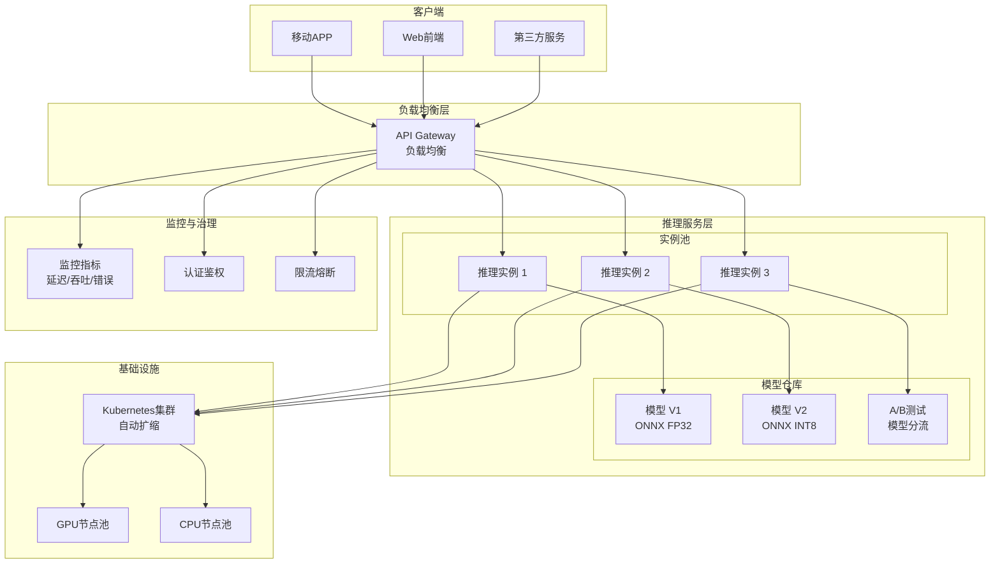

# 模块7：应用场景优化建议

## 云端推理优化

云端推理服务面临的挑战主要是高并发请求、低延迟响应和成本控制。ONNX Runtime提供多种部署方式满足云端需求。

---

### ONNX Runtime服务器部署

#### 1. REST API方式

使用FastAPI或Flask构建RESTful服务是最常见的云端部署方案。

**FastAPI示例**

```python
from fastapi import FastAPI, HTTPException
from fastapi.middleware.cors import CORSMiddleware
import numpy as np
import onnxruntime as ort
from pydantic import BaseModel
from typing import List
import uvicorn

app = FastAPI(title="ONNX inference service",
              description="云端模型推理API",
              version="1.0.0")

# CORS配置
app.add_middleware(
    CORSMiddleware,
    allow_origins=["*"],
    allow_methods=["*"],
    allow_headers=["*"],
)

# 模型管理类
class ModelManager:
    def __init__(self):
        self.sessions = {}
        self.default_model = "model_v1"

    def load_model(self, model_name: str, model_path: str):
        """加载ONNX模型"""
        session = ort.InferenceSession(model_path,
            providers=['CUDAExecutionProvider', 'CPUExecutionProvider'])
        self.sessions[model_name] = {
            'session': session,
            'path': model_path,
            'loaded_at': ort.__version__
        }
        return session

    def get_session(self, model_name: str = None):
        if model_name is None:
            model_name = self.default_model
        if model_name not in self.sessions:
            raise HTTPException(status_code=404,
                               detail=f"Model '{model_name}' not found")
        return self.sessions[model_name]['session']

model_manager = ModelManager()

# 数据模型
class InferenceRequest(BaseModel):
    model_name: str = None
    input_data: List[float]  # 根据实际模型调整
    batch_size: int = 1

class InferenceResponse(BaseModel):
    model_name: str
    predictions: List[float]
    inference_time_ms: float
    device: str

@app.post("/inference", response_model=InferenceResponse)
async def inference(request: InferenceRequest):
    """执行模型推理"""
    import time

    try:
        session = model_manager.get_session(request.model_name)

        # 准备输入张量
        input_name = session.get_inputs()[0].name
        input_shape = session.get_inputs()[0].shape
        # 转换输入数据为numpy数组
        input_array = np.array(request.input_data,
                              dtype=np.float32).reshape(input_shape)

        # 执行推理
        start_time = time.time()
        outputs = session.run(None, {input_name: input_array})
        inference_time = (time.time() - start_time) * 1000  # ms

        return InferenceResponse(
            model_name=request.model_name or model_manager.default_model,
            predictions=outputs[0].flatten().tolist(),
            inference_time_ms=inference_time,
            device=session.get_providers()[0]
        )
    except Exception as e:
        raise HTTPException(status_code=500, detail=str(e))

@app.get("/models")
async def list_models():
    """列出所有可用模型"""
    return {
        "models": list(model_manager.sessions.keys()),
        "default": model_manager.default_model
    }

@app.get("/health")
async def health_check():
    """健康检查端点"""
    return {"status": "healthy", "onnxruntime_version": ort.__version__}

if __name__ == "__main__":
    # 启动服务
    uvicorn.run(app, host="0.0.0.0", port=8000)
```

**Docker化部署**

```dockerfile
# Dockerfile
FROM python:3.9-slim

WORKDIR /app

# 安装ONNX Runtime
RUN pip install --no-cache-dir \
    onnxruntime \
    fastapi uvicorn[standard] \
    numpy pydantic

# 复制应用代码
COPY app.py .
COPY models/ ./models/

# 预加载模型（可选）
RUN python -c "import onnxruntime as ort; ort.InferenceSession('models/model_v1.onnx')"

EXPOSE 8000

CMD ["uvicorn", "app:app", "--host", "0.0.0.0", "--port", "8000"]
```

#### 2. gRPC方式

gRPC适合高性能、低延迟的微服务通信。

**Protocol Buffers定义**

```protobuf
// inference.proto
syntax = "proto3";

package inference;

service Inferencer {
    rpc Predict (PredictRequest) returns (PredictResponse);
}

message PredictRequest {
    string model_name = 1;
    repeated float input_data = 2;
    map<string, int64> shape = 3;
}

message PredictResponse {
    repeated float output_data = 1;
    float inference_time_ms = 2;
    string device = 3;
}
```

**gRPC服务器实现**

```python
import grpc
from concurrent import futures
import inference_pb2
import inference_pb2_grpc
import onnxruntime as ort
import numpy as np
import time

class InferenceServicer(inference_pb2_grpc.InferencerServicer):
    def __init__(self):
        self.sessions = {}
        self.default_model = "model_v1"

    def load_model(self, model_name, model_path):
        self.sessions[model_name] = ort.InferenceSession(model_path)

    def Predict(self, request, context):
        start_time = time.time()
        session = self.sessions.get(request.model_name,
                                   self.sessions[self.default_model])

        # 构造输入
        input_shape = [request.shape.get(k, 1)
                      for k in sorted(request.shape.keys())]
        input_array = np.array(request.input_data,
                              dtype=np.float32).reshape(input_shape)

        input_name = session.get_inputs()[0].name
        outputs = session.run(None, {input_name: input_array})

        inference_time = (time.time() - start_time) * 1000

        return inference_pb2.PredictResponse(
            output_data=outputs[0].flatten().tolist(),
            inference_time_ms=inference_time,
            device=session.get_providers()[0]
        )

def serve():
    server = grpc.server(futures.ThreadPoolExecutor(max_workers=10))
    servicer = InferenceServicer()
    servicer.load_model('model_v1', 'models/model_v1.onnx')
    inference_pb2_grpc.add_InferencerServicer_to_server(servicer, server)
    server.add_insecure_port('[::]:50051')
    server.start()
    server.wait_for_termination()
```

---

### 请求批处理策略

批处理是提高吞吐量的关键手段，但会增加延迟。需要根据场景选择合适的策略。

#### 1. 静态批处理

服务端强制将多个请求合并为一个batch。

```python
from typing import List
import asyncio
from concurrent.futures import ThreadPoolExecutor

class BatchingInference:
    def __init__(self, session, max_batch_size=32, timeout_ms=50):
        self.session = session
        self.max_batch_size = max_batch_size
        self.timeout_ms = timeout_ms / 1000.0
        self.request_queue = asyncio.Queue()
        self.is_running = False

    async def start(self):
        """启动批处理循环"""
        self.is_running = True
        asyncio.create_task(self._batch_loop())

    async def _batch_loop(self):
        """批处理主循环"""
        while self.is_running:
            batch = []
            start_time = asyncio.get_event_loop().time()

            # 收集请求直到超时或batch满
            while len(batch) < self.max_batch_size:
                timeout = self.timeout_ms - (asyncio.get_event_loop().time() - start_time)
                if timeout <= 0:
                    break
                try:
                    request = await asyncio.wait_for(
                        self.request_queue.get(),
                        timeout=timeout
                    )
                    batch.append(request)
                except asyncio.TimeoutError:
                    break

            if batch:
                await self._process_batch(batch)

    async def infer(self, input_data):
        """提交推理请求"""
        future = asyncio.Future()
        await self.request_queue.put((input_data, future))
        return await future

    async def _process_batch(self, batch):
        """执行批量推理"""
        inputs = [item[0] for item in batch]
        # 合并为单个batch
        batch_input = np.stack(inputs, axis=0)

        outputs = self.session.run(None, {'input': batch_input})

        # 分散结果
        for i, (_, future) in enumerate(batch):
            future.set_result(outputs[0][i])
```

#### 2. 动态批处理

根据请求时序自动合并，平衡吞吐和延迟。

**使用ONNX Runtime的Batch API**

```python
import onnxruntime as ort
import numpy as np

class DynamicBatcher:
    def __init__(self, model_path, max_batch_size=16):
        self.session = ort.InferenceSession(model_path)
        self.max_batch_size = max_batch_size

    def predict_batch(self, inputs: List[np.ndarray]) -> List[np.ndarray]:
        """动态批处理推理"""
        # 合并请求
        batch = np.concatenate(inputs, axis=0)
        if batch.shape[0] > self.max_batch_size:
            # 如果batch太大，分片处理
            results = []
            for i in range(0, len(inputs), self.max_batch_size):
                chunk = batch[i:i+self.max_batch_size]
                outputs = self.session.run(None, {'input': chunk})
                results.extend(outputs[0])
            return results

        outputs = self.session.run(None, {'input': batch})
        return list(outputs[0])
```

#### 3. 批处理优化技巧

```python
# 通过padding统一batch大小（适合变长输入）
def pad_to_fixed_batch(inputs, target_batch_size):
    """padding填充"""
    actual_batch = len(inputs)
    if actual_batch < target_batch_size:
        padding = [np.zeros_like(inputs[0]) for _ in range(target_batch_size - actual_batch)]
        batch = np.stack(inputs + padding, axis=0)
    else:
        batch = np.stack(inputs, axis=0)
    return batch, actual_batch
```

**批处理效果对比**

| 批量大小 | 吞吐量(QPS) | 平均延迟(P99) | GPU内存占用 |
|---------|------------|--------------|------------|
| 1 | 150 | 6.5ms | 1.2GB |
| 4 | 520 | 15ms | 1.5GB |
| 8 | 920 | 22ms | 1.8GB |
| 16 | 1450 | 35ms | 2.5GB |
| 32 | 1600 | 60ms | 4.2GB |

---

### 扩展性考虑（Scaling）

#### 水平扩展（Horizontal Scaling）

基于负载自动扩展实例数量。

**Kubernetes HPA配置示例**

```yaml
apiVersion: apps/v1
kind: Deployment
metadata:
  name: onnx-inference-service
spec:
  replicas: 3
  selector:
    matchLabels:
      app: onnx-inference
  template:
    metadata:
      labels:
        app: onnx-inference
    spec:
      containers:
      - name: inference
        image: onnx-inference:latest
        ports:
        - containerPort: 8000
        resources:
          requests:
            cpu: "2"
            memory: "4Gi"
            nvidia.com/gpu: 1
          limits:
            cpu: "4"
            memory: "8Gi"
            nvidia.com/gpu: 1
        env:
        - name: OMP_NUM_THREADS
          value: "4"
---
apiVersion: autoscaling/v2
kind: HorizontalPodAutoscaler
metadata:
  name: onnx-inference-hpa
spec:
  scaleTargetRef:
    apiVersion: apps/v1
    kind: Deployment
    name: onnx-inference-service
  minReplicas: 2
  maxReplicas: 20
  metrics:
  - type: Resource
    resource:
      name: cpu
      target:
        type: Utilization
        averageUtilization: 70
  - type: Resource
    resource:
      name: memory
      target:
        type: Utilization
        averageUtilization: 80
  behavior:
    scaleUp:
      stabilizationWindowSeconds: 60
      policies:
      - type: Percent
        value: 50
        periodSeconds: 60
    scaleDown:
      stabilizationWindowSeconds: 300
      policies:
      - type: Percent
        value: 10
        periodSeconds: 60
```

#### 垂直扩展（Vertical Scaling）

调整单个实例的资源配额。

```yaml
# 垂直自动扩展（VPA）
apiVersion: autoscaling.k8s.io/v1
kind: VerticalPodAutoscaler
metadata:
  name: onnx-inference-vpa
spec:
  targetRef:
    apiVersion: "apps/v1"
    kind: Deployment
    name: onnx-inference-service
  updatePolicy:
    updateMode: "Auto"  # 自动或Off
  resourcePolicy:
    containerPolicy:
      minAllowed:
        cpu: "1"
        memory: "2Gi"
      maxAllowed:
        cpu: "8"
        memory: "16Gi"
```

---

### 云平台集成

#### AWS SageMaker

```python
# model.tar.gz结构
# model/
# ├── model.onnx
# └── code/
#     ├── inference.py
#     └── requirements.txt

# inference.py
def model_fn(model_dir):
    """加载模型"""
    import onnxruntime as ort
    model_path = f"{model_dir}/model.onnx"
    session = ort.InferenceSession(model_path)
    return session

def input_fn(request_body, request_content_type):
    """解析输入"""
    import json
    if request_content_type == 'application/json':
        data = json.loads(request_body)
        return np.array(data['input'], dtype=np.float32)
    raise ValueError(f"Unsupported content type: {request_content_type}")

def predict_fn(input_data, model):
    """执行推理"""
    outputs = model.run(None, {'input': input_data})
    return outputs[0]

# 创建模型
import boto3
client = boto3.client('sagemaker')

client.create_model(
    ModelName='onnx-inference-model',
    PrimaryContainer={
        'Image': '763104351884.dkr.ecr.us-east-1.amazonaws.com/onnxruntime:1.16-cpu-py39',
        'ModelDataUrl': 's3://bucket/model.tar.gz',
        'Environment': {
            'OMP_NUM_THREADS': '4',
            'ORT_NUM_THREADS': '4'
        }
    },
    ExecutionRoleArn='arn:aws:iam::account:role/sagemaker-role'
)
```

#### Azure Machine Learning

```python
from azureml.core import Workspace, Model, Environment
from azureml.core.webservice import AciWebservice

ws = Workspace.from_config()

# 注册模型
model = Model.register(workspace=ws,
                       model_path='models/model.onnx',
                       model_name='onnx-inference',
                       description='ONNX model for inference')

# 定义推理环境
env = Environment.from_conda_specification(
    name='onnx-runtime-env',
    file_path='environment.yml'  # 包含onnxruntime、fastapi等
)

# 部署为ACI（Azure Container Instance）
deployment_config = AciWebservice.deploy_configuration(
    cpu_cores=2,
    memory_gb=4,
    tags={'framework': 'onnx'},
    description='ONNX inference service'
)

service = Model.deploy(ws, 'onnx-service', [model],
                       env, deployment_config)
service.wait_for_deployment(True)
print(service.scoring_uri)
```

#### Google Cloud AI Platform

```python
from google.cloud import aiplatform

# 创建模型
model = aiplatform.Model.upload(
    display_name='onnx-model',
    artifact_uri='gs://bucket/model.onnx',
    serving_container_image_uri='us-docker.pkg.dev/vertex-ai/prediction/onnxruntime-cpu:latest'
)

# 部署为端点
endpoint = model.deploy(
    machine_type='n1-standard-4',
    min_replica_count=1,
    max_replica_count=10
)
```

---

### 云端推理架构图



**架构说明**

1. **客户端**: 移动端、Web、第三方服务通过HTTP/gRPC调用
2. **负载均衡层**: API Gateway处理认证、限流、路由
3. **推理服务层**: 无状态实例池，共享模型仓库
4. **监控与治理**: Prometheus监控，Jaeger链路追踪
5. **基础设施**: Kubernetes自动扩缩容，GPU/CPU节点分离

---

### 性能优化最佳实践

1. **模型缓存**
```python
# 多个请求复用同一个session（线程安全）
from threading import Lock

session_lock = Lock()
sessions = {}

def get_or_create_session(model_path):
    with session_lock:
        if model_path not in sessions:
            sessions[model_path] = ort.InferenceSession(model_path)
        return sessions[model_path]
```

2. **预热模型**
```bash
# 启动时执行一次推理，触发CUDA内核编译
onnxruntime_test --model models/model.onnx --warmup
```

3. **设置正确的线程数**
```python
import os
# 根据vCPU数量设置
num_cores = os.cpu_count()
session_options = ort.SessionOptions()
session_options.intra_op_num_threads = max(1, num_cores - 1)
session_options.inter_op_num_threads = 2
```

4. **启用GPU内存池**
```python
session_options.use_deterministic_compute = False
session_options.enable_mem_pattern = True
session_options.enable_cpu_mem_arena = False  # GPU推荐禁用
```

---

### 监控与日志

**Prometheus指标暴露**

```python
from prometheus_client import Counter, Histogram, Gauge, generate_latest

REQUEST_COUNT = Counter('inference_requests_total',
                       'Total inference requests', ['model', 'status'])
REQUEST_LATENCY = Histogram('inference_latency_seconds',
                           'Inference latency', ['model'])
MODEL_LOADED = Gauge('model_loaded', 'Model loaded flag', ['model'])

@app.middleware("http")
async def monitor_requests(request, call_next):
    start_time = time.time()
    response = await call_next(request)
    latency = time.time() - start_time

    REQUEST_COUNT.labels(
        model=request.query_params.get('model', 'default'),
        status=response.status_code
    ).inc()
    REQUEST_LATENCY.labels(
        model=request.query_params.get('model', 'default')
    ).observe(latency)

    return response

@app.get("/metrics")
async def metrics():
    return Response(generate_latest(), media_type="text/plain")
```

---

### 成本优化建议

1. **模型分层存储**: 热模型内存，冷模型磁盘
2. **自动缩容**: 低负载时缩容到最小实例数
3. **竞价实例**: 用于非关键批处理任务
4. **区域选择**: 靠近用户的地理区域
5. **混合精度**: GPU上使用FP16降低显存占用

---

**相关链接**
- [[04-跨框架转换/ONNX到TensorRT优化]]
- [[07-场景优化建议/边缘设备优化]]

**标签**: #cloud #server #api #scaling
