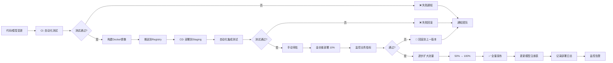

# 模块7：应用场景优化建议

## 大规模部署实践

大规模ML模型部署涉及版本管理、自动化流水线、监控、安全等多维度考量。本章介绍企业级部署的最佳实践。

---

### 模型版本管理

#### 命名约定

```bash
# 推荐命名格式
model_name__framework__quantization__version__timestamp.onnx

# 示例
bert-base-uncased__pytorch__int8__v2.1__20260224.onnx
resnet50__tensorflow__fp32__v1.0__20260220.onnx
```

#### 模型注册表

使用MLflow或DVC管理模型生命周期。

**MLflow示例**

```python
import mlflow
import mlflow.onnx
import onnx

# 记录模型
with mlflow.start_run(run_name="quantized-bert") as run:
    # 日志参数
    mlflow.log_params({
        "framework": "pytorch",
        "quantization": "int8_static",
        "accuracy": 0.932,
        "model_size_mb": 220,
        "avg_latency_ms": 15.2
    })

    # 记录模型
    mlflow.onnx.log_model(
        onnx_model="bert_int8.onnx",
        artifact_path="model",
        signature=mlflow.models.infer_signature(
            np.zeros((1, 128), dtype=np.int64),
            np.zeros((1, 2), dtype=np.float32)
        ),
        registered_model_name="bert-sentiment"
    )

# 列出所有版本
from mlflow.tracking import MlflowClient
client = MlflowClient()
model_versions = client.search_model_versions("name='bert-sentiment'")
for v in model_versions:
    print(f"Version {v.version}: {v.run_id}, stage={v.current_stage}")
```

**模型元数据**

```json
{
  "model_id": "bert-sentiment-v2.1",
  "framework": "pytorch",
  "quantization": "int8_static",
  "accuracy": {
    "metric": "f1_score",
    "value": 0.932,
    "validation_dataset": "sst2_test"
  },
  "performance": {
    "batch_1_latency_ms": 15.2,
    "batch_8_latency_ms": 18.5,
    "qps_throughput": 520,
    "memory_mb": 450
  },
  "compatibility": {
    "onnx_opset": 13,
    "providers": ["CUDAExecutionProvider", "CPUExecutionProvider"],
    "min_onnxruntime_version": "1.16.0"
  },
  "training": {
    "base_model": "bert-base-uncased",
    "dataset": "sst2",
    "timestamp": "2026-02-24T10:30:00Z",
    "git_commit": "a1b2c3d"
  }
}
```

---

### A/B测试与金丝雀发布

#### 金丝雀发布策略

```python
from typing import Dict, Any
import random

class CanaryRouter:
    """金丝雀流量路由"""

    def __init__(self, model_configs: Dict[str, Dict[str, Any]]):
        """
        model_configs: {
            'v1': {'weight': 90, 'model_path': '...'},
            'v2': {'weight': 10, 'model_path': '...'}
        }
        """
        self.models = model_configs
        self._build_routing_table()

    def _build_routing_table(self):
        """构建路由表"""
        self.routing = []
        total_weight = sum(m['weight'] for m in self.models.values())

        cumulative = 0
        for name, config in self.models.items():
            weight = config['weight'] / total_weight
            self.routing.append((cumulative, cumulative + weight, name))
            cumulative += weight

    def route(self, request_id: str = None) -> str:
        """路由到模型版本"""
        if request_id:
            # 基于请求ID保持一致（hash路由）
            hash_val = hash(request_id) % 10000 / 10000.0
        else:
            # 随机路由
            hash_val = random.random()

        for start, end, name in self.routing:
            if start <= hash_val < end:
                return name
        return list(self.models.keys())[0]

    def update_weights(self, weights: Dict[str, int]):
        """动态调整权重（监控对齐）"""
        for name, weight in weights.items():
            if name in self.models:
                self.models[name]['weight'] = weight
        self._build_routing_table()

# 使用示例
router = CanaryRouter({
    'v1': {'weight': 80, 'model_path': 'models/bert_v1.onnx'},
    'v2': {'weight': 20, 'model_path': 'models/bert_v2.onnx'},
})

model_name = router.route(request_id="user_123")
session = sessions[model_name]
```

**并行A/B测试**

```python
class ABTestManager:
    """A/B测试管理器"""

    def __init__(self):
        self.experiments = {}
        self.metrics = {}  # {(model_a, model_b): {'wins_a': 0, 'wins_b': 0}}

    def create_experiment(self, name: str, models: list, split_ratio: list):
        """创建实验"""
        self.experiments[name] = {
            'models': models,
            'split': split_ratio,
            'start_time': datetime.now()
        }

    def get_model_for_request(self, experiment_name: str, user_id: str) -> str:
        """获取实验模型"""
        exp = self.experiments[experiment_name]
        hash_val = hash(user_id) % 100

        cumulative = 0
        for model, ratio in zip(exp['models'], exp['split']):
            cumulative += ratio
            if hash_val < cumulative:
                return model
        return exp['models'][-1]

    def record_metric(self, experiment_name: str, model_a: str, model_b: str,
                      winner: str):
        """记录比较结果（如人类评估打分）"""
        key = tuple(sorted([model_a, model_b]))
        if key not in self.metrics:
            self.metrics[key] = {'wins_a': 0, 'wins_b': 0, 'ties': 0}

        if winner == model_a:
            self.metrics[key]['wins_a'] += 1
        elif winner == model_b:
            self.metrics[key]['wins_b'] += 1
        else:
            self.metrics[key]['ties'] += 1
```

---

### CI/CD流水线

#### GitHub Actions完整示例

```yaml
# .github/workflows/model-deployment.yml
name: Model Deployment Pipeline

on:
  push:
    branches: [main]
    paths: ['models/**', 'src/**']
  pull_request:
    branches: [main]

env:
  REGISTRY: ghcr.io
  IMAGE_NAME: ${{ github.repository }}

jobs:
  # 1. 模型验证
  validate:
    runs-on: ubuntu-latest
    steps:
      - name: Checkout
        uses: actions/checkout@v4

      - name: Setup Python
        uses: actions/setup-python@v4
        with:
          python-version: '3.9'

      - name: Install dependencies
        run: |
          pip install onnx>=1.14.0 onnxruntime>=1.16.0
          pip install pytest onnxconverter-common

      - name: Validate ONNX model
        run: |
          python scripts/validate_model.py models/bert_base_fp32.onnx

      - name: Check model metadata
        run: |
          python scripts/check_metadata.py models/bert_base_fp32.onnx

      - name: Run accuracy tests
        run: |
          python tests/test_accuracy.py --model models/bert_base_fp32.onnx

  # 2. 模型量化（可选）
  quantize:
    needs: validate
    runs-on: ubuntu-latest
    if: github.ref == 'refs/heads/main'
    steps:
      - name: Checkout
        uses: actions/checkout@v4

      - name: Setup Python
        uses: actions/setup-python@v4
        with:
          python-version: '3.9'

      - name: Quantize model
        run: |
          python scripts/quantize.py \
            --input models/bert_base_fp32.onnx \
            --output models/bert_base_int8.onnx \
            --method static

      - name: Verify quantized model
        run: |
          python scripts/validate_model.py models/bert_base_int8.onnx

      - name: Upload artifact
        uses: actions/upload-artifact@v4
        with:
          name: quantized-models
          path: models/

  # 3. 构建Docker镜像
  build:
    needs: [validate, quantize]
    runs-on: ubuntu-latest
    if: github.ref == 'refs/heads/main'
    steps:
      - name: Checkout
        uses: actions/checkout@v4

      - name: Download artifacts
        uses: actions/download-artifact@v4
        with:
          name: quantized-models
          path: models/

      - name: Set up Docker Buildx
        uses: docker/setup-buildx-action@v3

      - name: Log in to registry
        uses: docker/login-action@v3
        with:
          registry: ${{ env.REGISTRY }}
          username: ${{ github.actor }}
          password: ${{ secrets.GITHUB_TOKEN }}

      - name: Build and push
        uses: docker/build-push-action@v5
        with:
          context: .
          file: Dockerfile
          push: true
          tags: |
            ${{ env.REGISTRY }}/${{ env.IMAGE_NAME }}:latest
            ${{ env.REGISTRY }}/${{ env.IMAGE_NAME }}:${{ github.sha }}
          cache-from: type=registry,ref=${{ env.REGISTRY }}/${{ env.IMAGE_NAME }}:latest
          cache-to: type=inline

  # 4. 部署到Staging环境
  deploy-staging:
    needs: build
    runs-on: ubuntu-latest
    environment: staging
    steps:
      - name: Checkout
        uses: actions/checkout@v4

      - name: Deploy to Kubernetes
        uses: azure/k8s-deploy@v4
        with:
          namespace: staging
          manifests: |
            k8s/deployment.yaml
            k8s/service.yaml
          images: |
            ${{ env.REGISTRY }}/${{ env.IMAGE_NAME }}:${{ github.sha }}
          container_name: inference-api

      - name: Wait for deployment
        run: |
          kubectl rollout status deployment/inference-api -n staging --timeout=300s

      - name: Run integration tests
        run: |
          python tests/test_inference_api.py --endpoint http://staging.example.com

  # 5. 金丝雀部署（手动审批）
  deploy-canary:
    needs: deploy-staging
    runs-on: ubuntu-latest
    environment:
      name: production
      url: https://example.com
    steps:
      - name: Approve deployment
        uses: peter-evans/slash-command-dispatch@v2
        with:
          token: ${{ secrets.PERSONAL_ACCESS_TOKEN }}
          reaction-token: ${{ secrets.PERSONAL_ACCESS_TOKEN }}

      - name: Deploy canary (10% traffic)
        if: success()
        run: |
          kubectl apply -f k8s/canary-deployment.yaml

      - name: Monitor canary metrics
        run: |
          python scripts/monitor_canary.py --duration 600 --error_threshold 0.1

      - name: Promote canary to full
        if: success()
        run: |
          kubectl apply -f k8s/full-deployment.yaml

      - name: Rollback on failure
        if: failure()
        run: |
          kubectl rollout undo deployment/inference-api -n production
```

**GitLab CI示例**

```yaml
stages:
  - validate
  - quantize
  - test
  - build
  - deploy

validate_model:
  stage: validate
  image: python:3.9
  script:
    - pip install onnx onnxruntime
    - python -m pytest tests/test_model_validation.py

quantize_model:
  stage: quantize
  only:
    - main
  script:
    - python scripts/quantize.py --input model.onnx --output model_int8.onnx
  artifacts:
    paths:
      - model_int8.onnx

build_image:
  stage: build
  only:
    - main
  script:
    - docker build -t $CI_REGISTRY_IMAGE:$CI_COMMIT_SHA .
    - docker push $CI_REGISTRY_IMAGE:$CI_COMMIT_SHA
```

---

### 监控指标

#### 关键指标分类

| 类别 | 指标名称 | 描述 | 告警阈值 | 工具 |
|-----|---------|------|---------|------|
| **延迟** | P50/P95/P99 | 百分位延迟 | P99 > 500ms | Prometheus, Jaeger |
| **吞吐量** | QPS/RPS | 每秒请求数 | - | Prometheus |
| **错误率** | Error Rate | 失败请求占比 | > 0.1% | Prometheus |
| **资源** | CPU/内存 | 容器资源使用 | CPU > 80% | Node Exporter |
| **业务** | 准确率漂移 | 模型预测分布变化 | KL散度 > 0.5 | Evidently AI |

#### Prometheus指标暴露

```python
from prometheus_client import Counter, Histogram, Gauge, Summary, start_http_server

# 定义指标
REQUESTS = Counter('inference_requests_total',
                   'Total inference requests', ['model', 'endpoint', 'status'])
LATENCY = Histogram('inference_latency_seconds',
                    'Inference latency', ['model', 'quantization'])
THROUGHPUT = Summary('inference_batch_size',
                     'Batch size distribution', ['model'])
ACCURACY = Gauge('model_accuracy', 'Model accuracy metric', ['model', 'dataset'])
MEMORY_USAGE = Gauge('model_memory_bytes', 'Memory usage in bytes', ['model'])

class MonitoredInference:
    def __init__(self, session, model_name):
        self.session = session
        self.model_name = model_name

    def predict(self, input_data):
        import time

        # 记录请求
        REQUESTS.labels(
            model=self.model_name,
            endpoint='/inference',
            status='started'
        ).inc()

        start_time = time.time()
        try:
            outputs = self.session.run(None, {'input': input_data})
            latency = time.time() - start_time

            # 记录指标
            LATENCY.labels(
                model=self.model_name,
                quantization='int8' if 'int8' in self.model_name else 'fp32'
            ).observe(latency)

            REQUESTS.labels(
                model=self.model_name,
                endpoint='/inference',
                status='success'
            ).inc()

            return outputs[0]

        except Exception as e:
            REQUESTS.labels(
                model=self.model_name,
                endpoint='/inference',
                status='error'
            ).inc()
            raise e

# 启动HTTP服务器暴露指标
start_http_server(8000)
```

#### Evidently AI监控漂移

```python
from evidently.report import Report
from evidently.metric_preset import DataDriftPreset
import pandas as pd

def check_data_drift(reference_data: pd.DataFrame,
                     current_data: pd.DataFrame):
    """检测数据漂移"""
    report = Report(metrics=[DataDriftPreset()])
    report.run(reference_data=reference_data,
               current_data=current_data)

    # 保存报告
    report.save_html('drift_report.html')

    # 获取统计信息
    result = report.as_dict()
    drift_detected = result['metrics'][0]['result']['dataset_drift']
    return drift_detected
```

---

### 滚动更新与金丝雀部署

#### Kubernetes滚动更新策略

```yaml
apiVersion: apps/v1
kind: Deployment
metadata:
  name: inference-service
spec:
  replicas: 5
  strategy:
    type: RollingUpdate
    rollingUpdate:
      maxSurge: 1        # 滚动时最大Pod数 = replicas + maxSurge
      maxUnavailable: 0  # 滚动时最小可用Pod数
  selector:
    matchLabels:
      app: inference
  template:
    metadata:
      labels:
        app: inference
        version: v2.1
    spec:
      containers:
      - name: inference
        image: inference-api:v2.1
        ports:
        - containerPort: 8000
        readinessProbe:
          httpGet:
            path: /health
            port: 8000
          initialDelaySeconds: 10
          periodSeconds: 5
          successThreshold: 1
          failureThreshold: 3
        livenessProbe:
          httpGet:
            path: /health
            port: 8000
          initialDelaySeconds: 30
          periodSeconds: 10
```

**使用Argo Rollouts进行高级部署**

```yaml
# argo-rollouts.yaml
apiVersion: argoproj.io/v1alpha1
kind: Rollout
metadata:
  name: inference-service
spec:
  replicas: 5
  strategy:
    canary:
      canaryService: inference-service-canary
      stableService: inference-service-stable
      trafficRouting:
        istio:
          virtualService:
            name: inference-service
            routes:
            - port:
                number: 8000
      steps:
      - setWeight: 10  # 10%流量到金丝雀
      - pause: {duration: 5m}  # 暂停5分钟观察
      - analyze: {timeout: 2m, args: ["python", "scripts/canary_check.py"]}
      - setWeight: 50
      - pause: {duration: 10m}
      - setWeight: 100
  selector:
    matchLabels:
      app: inference
  template:
    metadata:
      labels:
        app: inference
    spec:
      containers:
      - name: inference
        image: inference-api:v2.1
```

---

### 安全考虑

#### 模型签名与验证

```python
import hashlib
import hmac
import json
from cryptography.hazmat.primitives import hashes, serialization
from cryptography.hazmat.primitives.asymmetric import padding

class ModelSigner:
    """模型签名验证"""

    def __init__(self, private_key_path: str, public_key_path: str):
        with open(private_key_path, 'rb') as f:
            self.private_key = serialization.load_pem_private_key(
                f.read(),
                password=None
            )
        with open(public_key_path, 'rb') as f:
            self.public_key = serialization.load_pem_public_key(f.read())

    def sign_model(self, model_path: str, metadata: dict) -> bytes:
        """对模型签名"""
        # 计算模型hash
        with open(model_path, 'rb') as f:
            model_hash = hashlib.sha256(f.read()).digest()

        # 合并元数据
        metadata_bytes = json.dumps(metadata, sort_keys=True).encode()
        combined = model_hash + metadata_bytes

        # 签名
        signature = self.private_key.sign(
            combined,
            padding.PSS(
                mgf=padding.MGF1(hashes.SHA256()),
                salt_length=padding.PSS.MAX_LENGTH
            ),
            hashes.SHA256()
        )
        return signature

    def verify_model(self, model_path: str, metadata: dict,
                     signature: bytes) -> bool:
        """验证模型签名"""
        with open(model_path, 'rb') as f:
            model_hash = haslib.sha256(f.read()).digest()

        metadata_bytes = json.dumps(metadata, sort_keys=True).encode()
        combined = model_hash + metadata_bytes

        try:
            self.public_key.verify(
                signature,
                combined,
                padding.PSS(
                    mgf=padding.MGF1(hashes.SHA256()),
                    salt_length=padding.PSS.MAX_LENGTH
                ),
                hashes.SHA256()
            )
            return True
        except Exception:
            return False
```

#### 沙箱隔离

```python
from security import restricted_python

# 使用受限执行环境运行模型
def run_sandboxed_inference(model_path: str, input_data: bytes):
    """沙箱环境下的推理"""
    with restricted_python.RestrictedPython() as sandbox:
        code = f"""
import onnxruntime as ort
session = ort.InferenceSession('{model_path}')
outputs = session.run(None, {{'input': input_data}})
result = outputs[0].tolist()
"""
        result = sandbox.execute(code, input_data=input_data)
        return result
```

**容器安全最佳实践**

```dockerfile
# 非root用户运行
FROM onnxruntime:1.16.0-cpu

RUN useradd -m -u 1000 inference
USER inference

# 只读文件系统
RUN chmod -R 555 /app

# 禁用危险的capabilities
# docker run --cap-drop=ALL --security-opt=no-new-privileges
```

---

### 生产就绪检查清单

#### 部署前检查

- [ ] 模型通过ONNX验证 (`onnx.checker.check_model`)
- [ ] 性能基准测试完成（延迟、吞吐、内存）
- [ ] 精度验证达到业务要求（对比基线）
- [ ] 模型版本和元数据完整（作者、日期、指标）
- [ ] CI/CD流水线测试通过
- [ ] 安全扫描无高危漏洞
- [ ] Docker镜像扫描无安全问题
- [ ] Kubernetes资源配置合理（requests/limits）
- [ ] 健康检查端点 `/health` 实现
- [ ] Prometheus监控指标暴露 `/metrics`
- [ ] 结构化日志JSON输出
- [ ] 资源限制与请求设置平衡

#### 运行时检查

- [ ] 健康检查连续3次通过
- [ ] 自动扩缩容（HPA）配置
- [ ] 告警规则配置（延迟、错误率、资源）
- [ ] 日志聚合（ELK/Loki）已连接
- [ ] 链路追踪（Jaeger/Zipkin）已启用
- [ ] 备份策略（模型、配置）
- [ ] 灾难恢复（DR）演练完成
- [ ] 容量规划文档（QPS目标，实例数）
- [ ] 模型回滚方案验证

#### 监控运营检查

- [ ] 准确率漂移告警已设置
- [ ] 数据质量监控（输入分布）
- [ ] 模型性能基线文档化
- [ ] 容量预测机制（基于流量增长）
- [ ] 变更管理流程（版本升级审批）
- [ ] SLO/SLA定义与文档
- [ ] 应急响应手册（On-call负责）
- [ ] 应急演练（故障注入测试）

---

### 部署流水线（Mermaid）



**流水线说明**

1. **CI阶段**：代码检查、模型验证、单元测试、性能基准
2. **构建阶段**：Docker镜像构建、安全扫描、标签管理
3. **CD阶段**：Staging部署、集成测试、人工审批
4. **金丝雀阶段**：10%流量灰度发布，监控关键指标
5. **全量阶段**：逐步放量，完成蓝绿/滚动更新
6. **运营阶段**：监控告警、日志归档、性能追踪

---

### 成本优化

#### 资源利用率优化

```python
# 自动扩缩容策略
apiVersion: autoscaling/v2
kind: HorizontalPodAutoscaler
metadata:
  name: inference-api-hpa
spec:
  scaleTargetRef:
    apiVersion: apps/v1
    kind: Deployment
    name: inference-api
  minReplicas: 2
  maxReplicas: 20
  metrics:
  - type: Resource
    resource:
      name: cpu
      target:
        type: Utilization
        averageUtilization: 70
  - type: Resource
    resource:
      name: memory
      target:
        type: Utilization
        averageUtilization: 80
  - type: Pods
    pods:
      metric:
        name: inference_requests_per_second
      target:
        type: AverageValue
        averageValue: 100
  behavior:
    scaleUp:
      stabilizationWindowSeconds: 60
      policies:
      - type: Percent
        value: 50
        periodSeconds: 60
    scaleDown:
      stabilizationWindowSeconds: 300
      policies:
      - type: Percent
        value: 10
        periodSeconds: 60
```

#### 多区域部署成本对比

| 区域 | 实例类型 | 成本/小时（按需） | 成本/小时（预留1年） | 推荐用途 |
|------|---------|------------------|---------------------|---------|
| us-east-1 | g4dn.xlarge (T4) | $0.526 | $0.316 | 主力推理区 |
| us-west-2 | g4dn.xlarge | $0.526 | $0.316 | 故障转移 |
| eu-west-1 | g5.xlarge (A10G) | $1.006 | $0.604 | 欧洲合规需求 |
| ap-northeast-1 | g4dn.xlarge | $0.748 | $0.449 | 亚洲低延迟 |

---

### 最佳实践总结

1. **版本管理标准化**: 使用语义化版本，保留所有历史版本
2. **自动化测试**: 模型验证、精度测试、性能基准缺一不可
3. **金丝雀发布**: 小流量验证，防止全量故障
4. **监控全覆盖**: 业务指标、基础设施、模型性能三位一体
5. **安全优先**: 模型签名、容器隔离、网络策略
6. **成本控制**: 自动扩缩容、竞价实例、多区域策略
7. **灾备演练**: 定期测试回滚与跨区域切换
8. **文档即代码**: 所有配置、脚本、流程代码化并版本控制

---

### 生产部署自检清单

**模型交付物检查**

```bash
# 1. 文件完整性
ls -lh model*.onnx
# -rw-r--r-- 1 user 220M Feb 24 model_bert_int8.onnx

# 2. ONNX验证
python -c "import onnx; onnx.checker.check_model('model.onnx')"

# 3. 元数据检查
python -c "import onnx; m = onnx.load('model.onnx'); print(m.metadata_props)"

# 4. 推理测试
python tests/test_single_inference.py --model model.onnx
```

**K8s部署检查**

```bash
# 查看Pod状态
kubectl get pods -n inference
kubectl describe pod inference-api-xxxx

# 查看日志
kubectl logs -f deployment/inference-api -n inference

# 查看资源使用
kubectl top pods -n inference
kubectl describe hpa inference-api-hpa -n inference

# 查看指标
curl http://prometheus:9090/api/v1/query?query=inference_latency_seconds
```

---

**相关链接**
- [[附录/参考资料]]
- [[07-场景优化建议/云端推理优化]]

**标签**: #deployment #ci-cd #production #monitoring
