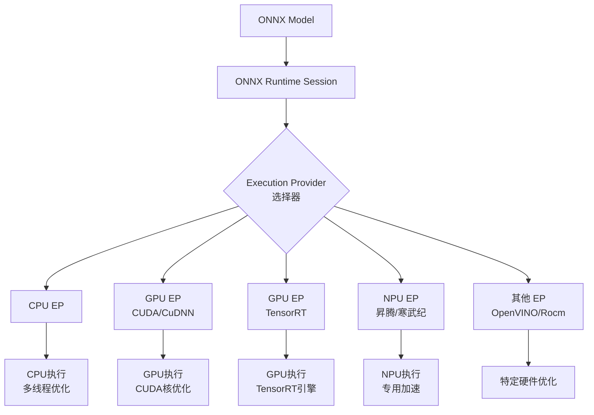

# 模块7：应用场景优化建议

## 硬件平台适配

ONNX Runtime支持多种硬件加速器，通过Execution Provider（EP）机制实现硬件特定的优化。选择合适的EP是最大化推理性能的关键。

---

### Execution Provider架构



**EP选择优先级原则**

1. **最佳性能优先**: ONNX Runtime按提供列表顺序尝试，首个支持的EP被使用
2. **设备兼容性**: 确保EP与硬件Driver版本匹配
3. **模型兼容性**: 某些OP可能仅在特定EP实现，需要检查

---

### CPU优化

#### 线程配置

ONNX Runtime使用OpenMP进行多线程并行。

```python
import onnxruntime as ort

# 方法1：SessionOptions配置
session_options = ort.SessionOptions()

# 设置线程数（建议设置为物理核心数或核心数-1）
import os
num_cores = os.cpu_count()
session_options.intra_op_num_threads = max(1, num_cores - 1)
session_options.inter_op_num_threads = 2  # 通常设为主线程数的一半

# 方法2：环境变量（全局设置）
import os
os.environ['OMP_NUM_THREADS'] = str(num_cores)  # OpenMP线程数
os.environ['ORT_NUM_THREADS'] = str(num_cores)  # ONNX Runtime专用
os.environ['KMP_BLOCKTIME'] = '0'  # Intel MKL线程空闲时间
os.environ['KMP_AFFINITY'] = 'granularity=fine,compact,1,0'  # 线程亲和性

# 创建session
session = ort.InferenceSession('model.onnx',
                               sess_options=session_options,
                               providers=['CPUExecutionProvider'])
```

#### 内存模式优化

```python
session_options = ort.SessionOptions()

# 启用内存模式优化（减少内存分配）
session_options.enable_mem_pattern = True  # 启用内存模式
session_options.memory_pattern_optimization = True

# 设置 Arena 配置（预分配内存块）
session_options.use_deterministic_compute = False  # 允许非确定性计算，可能更快
session_options.enable_cpu_mem_arena = True  # CPU内存池（默认启用）
session_options.arena_extend_strategy = 1  # 1=渐进式扩展，0=固定大小
```

#### 架构特定优化

**Intel CPU (MKL-DNN)**

```python
# MKL自动启用，无需额外配置
# 但可通过环境变量调优
os.environ['MKL_DYNAMIC'] = 'FALSE'  # 固定MKL线程数
os.environ['MKL_NUM_THREADS'] = str(num_cores)
os.environ['MKL_DOMAIN_NUM_THREADS'] = str(num_cores)

# 启用线性代数包优化
session_options.use_deterministic_compute = False  # 使用MKL的非确定性算法
```

**ARM CPU (NEON)**

ONNX Runtime自动检测ARM NEON SIMD指令集。

```bash
# 检查NEON支持
cat /proc/cpuinfo | grep -i neon

# 启用ARM计算库（arm_compute）
# 需要编译ONNX Runtime时启用ARM Compute Library
```

**CPU EP最佳实践**

- **batch size**: CPU上较大的batch size（16-32）可以更好地利用多核
- **模型并行**: 对于超大模型，可能需要跨多CPU推理
- **锁页内存**: 使用`pin_memory=True`加速数据传输（PyTorch）

---

### GPU优化

#### CUDA Execution Provider

CUDA EP使用cuDNN进行深度学习推理加速。

```python
import onnxruntime as ort

session_options = ort.SessionOptions()

# CUDA EP配置
cuda_provider_options = {
    'device_id': 0,  # GPU设备ID
    'cudnn_conv_algo_search': 'EXHAUSTIVE',  # 或 DETERMINISTIC, HEURISTIC
    'do_copy_in_default_stream': True,  # 使用默认流复制数据
    'cudnn_conv_use_max_workspace': '1',  # 为卷积分配最大工作空间
    'gpu_mem_limit': 2 * 1024 * 1024 * 1024,  # 限制GPU内存（2GB）
}

session = ort.InferenceSession(
    'model.onnx',
    sess_options=session_options,
    providers=[
        ('CUDAExecutionProvider', cuda_provider_options),
        'CPUExecutionProvider'  # Fallback
    ]
)
```

**CUDA EP性能调优参数**

| 参数 | 说明 | 推荐值 |
|-----|------|--------|
| `device_id` | GPU设备索引 | 0（单卡）或多卡区分 |
| `cudnn_conv_algo_search` | 卷积算法搜索策略 | HEURISTICE（默认），DETERMINISTIC（确定性） |
| `do_copy_in_default_stream` | 是否使用默认流 | True（异步性能更好） |
| `arena_prefetch` | 内存预取 | True（减少延迟） |
| `gpu_mem_limit` | 显存限制 | 根据设备设置，0=无限制 |
| `cudnn_conv_use_max_workspace` | 最大工作空间 | 1（自动），0=手动指定 |

#### TensorRT Execution Provider

TensorRT EP提供NVIDIA GPU上的极致性能，支持层融合、精度校准、内核自动调整。

```python
import onnxruntime as ort

session_options = ort.SessionOptions()

# TensorRT EP配置
trt_provider_options = {
    'device_id': 0,
    'trt_engine_cache_enable': True,  # 缓存TRT引擎，加速下次加载
    'trt_engine_cache_path': './trt_cache',  # 缓存目录
    'trt_dla_enable': False,  # 启用DLA（仅Jetson平台）
    'trt_force_sequential_engine_build': False,  # 并行构建引擎（更快）
    'trt_builder_optimization_level': 3,  # 优化级别 0-5
    'trt_workspace_size': 2 * 1024 * 1024 * 1024,  # 工作空间2GB
    'trt_min_shapes': 'input:1x3x224x224',  # 最小shape（动态shape时必需）
    'trt_max_shapes': 'input:32x3x224x224',  # 最大shape
    'trt_opt_shapes': 'input:16x3x224x224',  # 优化shape
    'trt_fp16_enable': True,  # 启用FP16加速（精度损失小）
}

session = ort.InferenceSession(
    'model.onnx',
    sess_options=session_options,
    providers=[
        ('TensorrtExecutionProvider', trt_provider_options),
        ('CUDAExecutionProvider', {}),  # Fallback
        'CPUExecutionProvider'
    ]
)
```

**TensorRT性能调优**

```python
# 使用trtexec命令行工具预构建引擎（可选）
# !trtexec --onnx=model.onnx --saveEngine=model.engine --fp16

# 加载预构建引擎
session = ort.InferenceSession('model.onnx',
    providers=[('TensorrtExecutionProvider',
                {'trt_engine_cache_path': './trt_cache'})])
```

**TensorRT vs CUDA EP对比**

| 特性 | CUDA EP | TensorRT EP |
|-----|---------|-------------|
| 启动时间 | 快（~1s） | 慢（优化构建~10-30s，缓存后~1s） |
| 延迟 | 中等 | 低（层融合+内核优化） |
| 吞吐量 | 中等 | 高 |
| 精度支持 | FP32/FP16 | FP32/FP16/INT8（需要校准） |
| 动态shape | 支持 | 支持（需配置min/opt/max） |
| 适用场景 | 开发、测试 | 生产环境 |

---

### NPU支持

#### 华为昇腾（Ascend）NPU

华为Atlas系列AI处理器支持ONNX模型在NPU上运行。

```python
# 安装华为ONNX Runtime（需要从华为镜像获取）
# pip install onnxruntime-ascend

import onnxruntime as ort

session = ort.InferenceSession(
    'model.onnx',
    providers=['AscendExecutionProvider'],
    provider_options=[{
        'device_id': '0',  # NPU设备ID
        'auto_memory': '1',  # 自动内存管理
    }]
)
```

**昇腾NPU优化示例**

```python
provider_options = {
    'device_id': '0',
    'input_format': 'ND',  # NCHW或NHWC
    'output_format': 'ND',
    'precision': 'FP16',  # 或 'INT8', 'FP32'
    'graph_run_mode': '0',  # 0=动态图，1=静态图（性能更好）
    'op_select_impl_mode': 'high_performance',  # 或 'high_precision'
}

session = ort.InferenceSession(
    'model.onnx',
    providers=[('AscendExecutionProvider', provider_options)],
    provider_options=[provider_options]
)
```

**使用ascend-toolkit转换工具（如果需要）**

```bash
# 转换ONNX为昇腾OM模型（针对不支持的OP）
atc --framework=5 \
    --model=model.onnx \
    --input_format=NCHW \
    --input_shape="input:1,3,224,224" \
    --output=model \
    --log=debug \
    --soc_version=Ascend910
```

#### 寒武纪（Cambricon）MLU

寒武纪MLU处理器使用MLU-TRTC推理引擎。

```python
# 安装寒武纪ONNX Runtime
# pip install onnxruntime-mlu

import onnxruntime as ort

session = ort.InferenceSession(
    'model.onnx',
    providers=['MLUExecutionProvider'],
    provider_options=[{
        ' device_id': 0,  # MLU设备ID
        'precision': 'FP32',  # FP32/FP16/INT8
        'core_num': 4,  # 使用核心数
    }]
)
```

**寒武纪性能优化**

```python
options = ort.SessionOptions()
options.intra_op_num_threads = 4  # MLU核心数
options.inter_op_num_threads = 1

session = ort.InferenceSession(
    'model.onnx',
    sess_options=options,
    providers=[
        ('MLUExecutionProvider', {
            'precision': 'FP16',
            'core_num': 4,
            'mem_reuse': True
        }),
        'CPUExecutionProvider'
    ]
)
```

#### 地平线（Horizon） Sunrise

地平线BPU专为边缘AI优化。

```python
# 地平线提供ONNX Runtime移植版本
# 需要地平线工具链转换模型

provider_options = {
    'model_dir': './model_bpu',  # BPU模型路径
    'core_id': 0,  # BPU核心
    'precision': 'INT8',  # 通常只支持INT8
}

session = ort.InferenceSession(
    'model.onnx',
    providers=[('HorizonExecutionProvider', provider_options)]
)
```

---

### Execution Provider选择指南

#### 自动检测与选择

```python
def get_best_provider():
    """自动选择最佳EP"""
    import onnxruntime as ort

    available_providers = ort.get_available_providers()
    print(f"Available providers: {available_providers}")

    # 优先级顺序
    priority = [
        'TensorrtExecutionProvider',  # NVIDIA GPU
        'CUDAExecutionProvider',
        'DmlExecutionProvider',  # Windows DirectML
        'OpenVINOExecutionProvider',  # Intel CPU/GPU
        'CoreMLExecutionProvider',  # macOS/iOS
        'AscendExecutionProvider',  # 华为NPU
        'MLUExecutionProvider',  # 寒武纪
        'CPUExecutionProvider'  # 通用
    ]

    for provider in priority:
        if provider in available_providers:
            return [provider, 'CPUExecutionProvider']

    return ['CPUExecutionProvider']

# 使用
providers = get_best_provider()
session = ort.InferenceSession('model.onnx', providers=providers)
```

#### 按场景推荐

| 场景 | 推荐EP | 配置要点 |
|-----|--------|----------|
| **NVIDIA GPU推理** | TensorRT > CUDA | TensorRT for prod, CUDA for dev |
| **Intel CPU** | OpenVINO | 启用MKL-DNN |
| **AMD GPU** | ROCm | ROCm支持逐步完善中 |
| **华为NPU** | Ascend | 需要转OM格式 |
| **寒武纪MLU** | MLU | 优先使用INT8 |
| **边缘ARM** | CPU | NEON自动优化 |
| **macOS** | CoreML | Apple Silicon原生加速 |
| ** Windows通用** | DirectML | DirectML支持较新Windows |

---

### EP配置代码总览

```python
import onnxruntime as ort
import os

def create_optimized_session(model_path: str):
    """创建针对硬件优化的session"""

    # 1. 环境配置
    cpu_cores = os.cpu_count()
    os.environ['OMP_NUM_THREADS'] = str(cpu_cores - 1)
    os.environ['ORT_NUM_THREADS'] = str(cpu_cores - 1)

    # 2. Session选项
    session_options = ort.SessionOptions()
    session_options.intra_op_num_threads = max(1, cpu_cores - 1)
    session_options.inter_op_num_threads = 2
    session_options.enable_mem_pattern = True
    session_options.use_deterministic_compute = False

    # 3. 选择提供者
    available = ort.get_available_providers()
    print(f"Available providers: {available}")

    if 'TensorrtExecutionProvider' in available:
        # NVIDIA GPU - 使用TensorRT
        providers = [
            ('TensorrtExecutionProvider', {
                'trt_engine_cache_enable': True,
                'trt_engine_cache_path': './trt_cache',
                'trt_fp16_enable': True,
            }),
            ('CUDAExecutionProvider', {}),
            'CPUExecutionProvider'
        ]
    elif 'CUDAExecutionProvider' in available:
        # NVIDIA GPU - 仅CUDA
        providers = [
            ('CUDAExecutionProvider', {
                'device_id': 0,
                'cudnn_conv_algo_search': 'HEURISTIC',
            }),
            'CPUExecutionProvider'
        ]
    elif 'AscendExecutionProvider' in available:
        # 华为NPU
        providers = [
            ('AscendExecutionProvider', {
                'device_id': '0',
                'precision': 'FP16',
            }),
            'CPUExecutionProvider'
        ]
    else:
        # CPU fallback
        providers = ['CPUExecutionProvider']

    # 4. 创建session
    session = ort.InferenceSession(
        model_path,
        sess_options=session_options,
        providers=providers
    )

    # 5. 打印配置信息
    print(f"Using providers: {session.get_providers()}")
    print(f"Input: {session.get_inputs()[0].name}, shape: {session.get_inputs()[0].shape}")
    print(f"Output: {session.get_outputs()[0].name}, shape: {session.get_outputs()[0].shape}")

    return session
```

---

### 硬件推荐表

| 硬件平台 | 推荐EP | 环境配置 | 性能提示 |
|---------|--------|---------|---------|
| **NVIDIA T4/A100/H100** | TensorRT | `trt_fp16_enable=True` | 使用动态batch，FP16加速效果显著 |
| **NVIDIA Jetoson系列** | TensorRT | `trt_dla_enable=True` | DLA专用，低功耗 |
| **Intel Xeon CPU** | OpenVINO/CPU | `OMP_NUM_THREADS=核心数` | 启用MKL-DNN，考虑INT8量化 |
| **AMD EPYC CPU** | ROCm/CPU | `ROCM_PATH`设置 | ROCm GPU支持仍在演进 |
| **华为Atlas 300** | Ascend | `device_id`设置 | 可能需要转OM格式（ATC工具） |
| **寒武纪MLU370** | MLU | `core_num`匹配 | 优先INT8，FP16次之 |
| **Apple M1/M2/M3** | CoreML | 自动 | 使用ANE，CoreML自动优化 |
| **ARM Cortex-A系列** | CPU | NEON自动 | 使用INT8，优化内存布局 |

**EP兼容性检查脚本**

```python
def check_provider_compatibility():
    """检查各EP可用性和版本"""
    import onnxruntime as ort

    print("=" * 60)
    print("ONNX Runtime System Information")
    print("=" * 60)
    print(f"ONNX Runtime Version: {ort.__version__}")

    # 可用Providers
    available = ort.get_available_providers()
    print(f"\nAvailable Execution Providers:")
    for p in available:
        print(f"  ✓ {p}")

    # 检查缺失的重要EP
    expected = ['CUDAExecutionProvider', 'TensorrtExecutionProvider',
                'OpenVINOExecutionProvider', 'CoreMLExecutionProvider']
    missing = [p for p in expected if p not in available]
    if missing:
        print(f"\nMissing providers (build without these):")
        for p in missing:
            print(f"  ✗ {p}")

    # GPU检查
    from onnxruntime import get_device
    print(f"\nDevice: {get_device()}")

    return available

# 运行检查
check_provider_compatibility()
```

---

### 多设备推理

```python
class MultiDeviceInference:
    """多设备分布式推理"""

    def __init__(self, model_paths: dict):
        """
        model_paths: {'gpu0': path, 'gpu1': path, 'cpu': path}
        """
        self.sessions = {}

        for device, path in model_paths.items():
            if 'gpu' in device:
                # GPU模型
                session = ort.InferenceSession(
                    path,
                    providers=[
                        ('CUDAExecutionProvider', {'device_id': int(device[-1])}),
                        'CPUExecutionProvider'
                    ]
                )
            else:
                session = ort.InferenceSession(path)

            self.sessions[device] = session

    def infer(self, input_data, device='auto'):
        if device == 'auto':
            device = self._select_device()
        session = self.sessions[device]
        return session.run(None, {'input': input_data})[0]

    def _select_device(self):
        # 简单轮询负载均衡
        import random
        return random.choice(list(self.sessions.keys()))
```

---

### 故障排除

#### 常见问题与解决方案

| 问题 | 症状 | 解决方案 |
|-----|------|---------|
| **EP初始化失败** | `Invalid argument`错误 | 检查驱动版本、ONNX Runtime编译选项 |
| **GPU内存不足** | `OOM`或运行缓慢 | 减小batch size，启用`gpu_mem_limit` |
| **CPU性能差** | 延迟高，线程未充分利用 | 调优`OMP_NUM_THREADS`，启用`mem_pattern` |
| **TensorRT构建慢** | 首次推理耗时很长 | 启用`trt_engine_cache_enable` |
| **NPU不支持OP** | 某些节点运行失败 | 使用CPU fallback或转换模型 |
| **精度损失** | 推理结果偏差大 | 检查FP16/INT8配置，考虑使用更高精度 |

#### 调试技巧

```python
import onnxruntime as ort

# 启用详细日志
ort.set_default_logger_severity(0)  # 0=VERBOSE, 1=INFO, 2=WARNING, 3=ERROR

# 设置SessionOptions日志
options = ort.SessionOptions()
options.log_severity_level = 0  # 详细日志
options.log_verbosity_level = 0

# 获取执行提供者信息
session = ort.InferenceSession('model.onnx', sess_options=options)
print("Session providers:", session.get_providers())
print("Execution mode:", session.get_session_options().execution_mode)
```

---

### 关键要点

1. **EP列表顺序决定调度**: 首个可用的EP会被使用
2. **TensorRT for NVIDIA GPU**: 生产环境首选，但首次构建较慢
3. **CPU调优很重要**: 线程数、内存模式可以提升30%+性能
4. **NPU需要厂商支持**: 检查OP兼容性和模型转换工具
5. **始终有CPU fallback**: 确保在其他EP失败时降级运行

---

**相关链接**
- [[01-基础概念与环境准备/硬件软件要求]]
- [[04-跨框架转换/ONNX到TensorRT优化]]

**标签**: #hardware #cpu #gpu #npu #execution-provider
