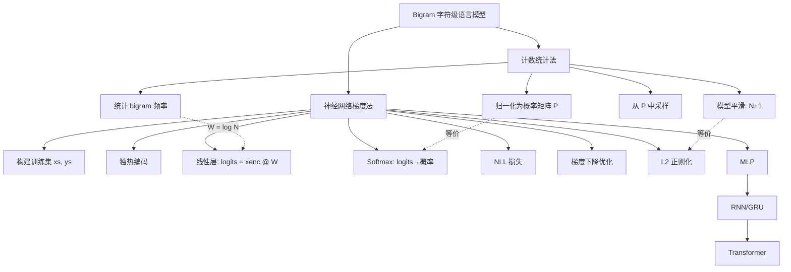

# makemore - 字符级语言模型与二元语法模型

## 核心概述

本笔记整理自 Andrej Karpathy 的 makemore 系列课程第一讲。makemore 是一个字符级语言模型项目——给定一个数据集（如 32000 个人名），训练模型生成"看起来像但并不真实存在"的更多名字。

**为什么重要**：本讲从最简单的 Bigram（二元语法）模型出发，用**计数统计**和**神经网络**两种截然不同的方法实现同一个语言模型，并证明两者数学等价。这种"从统计到梯度"的视角转换，是理解后续 MLP、RNN 直至 Transformer 的基础。

**解决什么问题**：
- 理解字符级语言模型的基本原理
- 掌握似然、对数似然、负对数似然（NLL）作为损失函数的推导
- 理解 softmax 函数如何将神经网络输出转化为概率
- 理解模型平滑与 L2 正则化的等价关系
- 掌握 PyTorch 张量广播（broadcasting）的原理与陷阱

> [!note] 核心论点
> 计数统计法和神经网络梯度法在 Bigram 模型上是**完全等价**的——它们得到相同的参数和相同的损失。但神经网络方法具有可扩展性，可以逐步演化为 MLP、RNN、Transformer，而计数表格方法无法处理多字符上下文。

---

## 知识体系

### 1. makemore 项目与字符级语言模型

#### 1.1 什么是 makemore

makemore（make more）顾名思义：给定一些数据，生成更多类似的数据。

- **数据集**：`names.txt`，包含约 32000 个人名，每行一个
- **任务**：学习人名中字符的统计规律，生成新的"似名非名"的独特名字
- **本质**：字符级语言模型（character-level language model）

#### 1.2 字符级语言模型

字符级语言模型将每条数据视为一个**字符序列**，核心任务是**根据已有字符预测下一个字符**。

以 `isabella` 为例，它蕴含了多条预测信息：

| 上下文 | 预测目标 |
|--------|---------|
| `<START>` | `i`（i 常作为首字母） |
| `i` | `s` |
| `s` | `a` |
| ... | ... |
| `a` | `<END>`（词结束） |

#### 1.3 模型演进路线

makemore 系列将逐步实现以下模型，复杂度递增：

```
Bigram → Bag of Words → MLP → RNN → GRU → Transformer (GPT-2)
```

> [!info] 所有模型共享同一框架
> 无论神经网络多么复杂，输出始终是 **logits**，经 softmax 转化为概率，用**负对数似然**作为损失，通过**梯度下降**优化。变化的只是前向传播中计算 logits 的方式。

---

### 2. Bigram 模型：计数统计法

#### 2.1 Bigram 的核心思想

Bigram（二元语法）模型**只看前一个字符来预测下一个字符**，忽略更长的上下文。

- 这是一个非常弱的模型，但作为起点非常合适
- 每个单词被拆解为多个连续的字符对（bigram）

#### 2.2 构建训练数据

为每个单词添加特殊的首尾标记。课程中使用单一特殊字符 `.` 同时表示起始和结束标记（编号为 0），避免浪费数组空间：

```python
words = open('names.txt', 'r').read().splitlines()

# 字符到整数的映射
chars = sorted(list(set(''.join(words))))
stoi = {s: i+1 for i, s in enumerate(chars)}  # a=1, b=2, ..., z=26
stoi['.'] = 0                                    # 特殊标记 = 0
itos = {i: s for s, i in stoi.items()}
```

> [!tip] 为什么要统一首尾标记
> 原始方案用 `<S>` 和 `<E>` 两个标记，导致 28×28 数组中有一整行和一整列全为零（`<E>` 不可能作为 bigram 首字符，`<S>` 不可能作为 bigram 第二个字符）。使用单一 `.` 标记可将数组缩减为 27×27，消除浪费。

#### 2.3 统计二元组频率

用 PyTorch 张量存储所有 bigram 的出现次数：

```python
import torch

N = torch.zeros((27, 27), dtype=torch.int32)

for w in words:
    chs = ['.'] + list(w) + ['.']
    for ch1, ch2 in zip(chs, chs[1:]):
        ix1 = stoi[ch1]
        ix2 = stoi[ch2]
        N[ix1, ix2] += 1
```

- `N[i, j]` 表示字符 `i` 后面跟着字符 `j` 的次数
- 第 0 行（`.` 开头）统计的是各字符作为**名字首字母**的频率
- 对角线等位置反映字符接续关系

#### 2.4 从计数到概率

将计数矩阵归一化为概率矩阵：

```python
P = N.float()
P /= P.sum(1, keepdim=True)  # 每行归一化，使得每行概率之和为1
```

- `P[i, j]` 表示在字符 `i` 之后出现字符 `j` 的**概率**
- 每行之和为 1，构成一个合法的概率分布

#### 2.5 从模型中采样生成

```python
g = torch.Generator().manual_seed(2147483647)

for _ in range(10):
    out = []
    ix = 0  # 从起始标记开始
    while True:
        p = P[ix]                    # 取当前字符对应的概率分布行
        ix = torch.multinomial(p, num_samples=1, replacement=True, generator=g).item()
        if ix == 0:                  # 遇到结束标记，停止
            break
        out.append(itos[ix])
    print(''.join(out))
```

> [!warning] torch.multinomial 的 replacement 参数
> `replacement` 默认为 `False`，表示不放回抽样。在语言模型采样中必须设为 `True`（放回抽样），否则采样次数超过词表大小会报错。

> [!note] 采样结果分析
> 生成的名字（如 `mor`, `axx` 等）"有点像名字但不太对"。原因是 Bigram 模型非常弱——它不知道当前字符是首字母还是中间字符。例如，当模型看到 `h` 时，它不知道 `h` 是名字开头还是末尾，因此可能把 `h` 当作名字结尾直接结束生成。

---

### 3. PyTorch 广播机制：原理与陷阱

#### 3.1 广播规则

PyTorch（以及 NumPy）的广播规则允许对不同形状的张量进行逐元素运算。规则如下：

1. **每个张量至少有一个维度**
2. **从最右侧维度开始向左对齐**
3. 每个维度必须满足以下条件之一：
   - 两个维度**相等**
   - 其中一个维度为 **1**
   - 其中一个维度**不存在**（视为 1）

#### 3.2 keepdim 的致命陷阱

归一化计数矩阵时，`keepdim` 参数至关重要：

```python
# ✅ 正确：keepdim=True，P_sum 形状为 [27, 1]（列向量）
P_sum = P.sum(1, keepdim=True)   # shape: [27, 1]
P = P / P_sum                     # [27, 27] / [27, 1] → 按行归一化 ✓

# ❌ 错误：keepdim=False，P_sum 形状为 [27]（一维向量）
P_sum = P.sum(1, keepdim=False)  # shape: [27]
P = P / P_sum                     # [27, 27] / [27] → 按列归一化 ✗
```

> [!danger] 隐蔽 Bug
> 当 `keepdim=False` 时，形状为 `[27]` 的一维向量在广播时会被**隐式**在最左侧补 1，变成 `[1, 27]`（行向量），然后被**垂直复制** 27 次。结果是每一**列**被归一化，而非每一**行**。这不会报错，但结果是**完全错误**的。
>
> 这种 bug 极其隐蔽，因为代码能正常运行，只是逻辑错误。务必仔细检查广播方向。

#### 3.3 广播规则验证

以 `P` 形状 `[27, 27]` 除以 `P_sum` 形状 `[27, 1]` 为例：

```
对齐:  [27, 27]
       [27,  1]
       ↑   ↑
     相等  其中一个为1 → 复制扩展到27

结果:  [27, 27] → 逐元素除法 ✓
```

---

### 4. 模型评估：似然与负对数似然

#### 4.1 似然（Likelihood）

模型对整个训练集分配的概率（所有 bigram 概率的**乘积**）即为似然：

$$\text{Likelihood} = \prod_{i=1}^{n} P(\text{next\_char}_i \mid \text{current\_char}_i)$$

- 似然越高，模型越好
- 似然的最大值为 1（所有预测概率均为 1）

> [!warning] 字幕翻译错误
> 字幕中将"似然"（likelihood）误译为"自然"。正确的统计学术语是"似然值"和"对数似然"。

#### 4.2 对数似然（Log-Likelihood）

由于大量 0~1 之间的概率相乘会得到极小的数值（数值下溢），实践中使用对数似然：

$$\log \text{Likelihood} = \sum_{i=1}^{n} \log P(\text{next\_char}_i \mid \text{current\_char}_i)$$

利用对数性质 $\log(a \times b) = \log a + \log b$，将乘积转化为求和。

- 对数函数是**单调递增**的，最大化似然等价于最大化对数似然
- 概率为 1 时，$\log(1) = 0$
- 概率趋近 0 时，$\log(p) \to -\infty$

#### 4.3 负对数似然（Negative Log-Likelihood, NLL）

损失函数要求"越低越好"，因此对对数似然取负：

$$\text{NLL} = -\sum_{i=1}^{n} \log P(\text{next\_char}_i \mid \text{current\_char}_i)$$

| 概率 $p$ | $\log p$ | $-\log p$（NLL） |
|-----------|----------|-------------------|
| 1.0 | 0.0 | 0.0 |
| 0.5 | -0.693 | 0.693 |
| 0.1 | -2.303 | 2.303 |
| 0.01 | -4.605 | 4.605 |
| 0.0 | $-\infty$ | $+\infty$ |

- NLL 最小值为 0（完美预测）
- NLL 越大，预测越差

#### 4.4 平均负对数似然（作为损失函数）

为方便比较不同规模的数据集，通常使用**平均值**而非总和：

$$\text{Loss} = -\frac{1}{n} \sum_{i=1}^{n} \log P(\text{next\_char}_i \mid \text{current\_char}_i)$$

训练集上的平均 NLL 约为 **2.45**。

> [!tip] 优化目标等价性
> 最大化似然 = 最大化对数似然 = 最小化负对数似然 = 最小化平均负对数似然。这四个优化问题完全等价，因为对数是单调函数，取负和归一化不改变最优解的位置。

#### 4.5 模型平滑（Model Smoothing）

未平滑的模型存在严重问题：训练集中未出现过的 bigram 组合概率为 0，导致对数似然为 $-\infty$。

**拉普拉斯平滑（Laplace Smoothing / Add-k Smoothing）**：

```python
P = (N + 1).float()    # 给所有计数加1（伪计数）
P /= P.sum(1, keepdim=True)
```

- 加 1 确保所有概率均大于 0
- 添加的伪计数越多，分布越均匀（越平滑）
> [!info] 平滑与正则化的联系
> 后文将展示，神经网络框架中的 **L2 正则化**在数学上等价于此处的模型平滑。

---

### 5. Bigram 模型：神经网络梯度法

#### 5.1 从计数到神经网络

核心思想：将 bigram 语言建模问题映射到神经网络框架中。

| 对比项 | 计数统计法 | 神经网络法 |
|--------|-----------|-----------|
| 输入 | 当前字符索引 | 当前字符的 one-hot 编码 |
| 参数 | 计数矩阵 N（经归一化得 P） | 权重矩阵 W |
| 训练 | 统计频率 + 归一化 | 梯度下降优化 W |
| 输出 | 概率分布 P 的某一行 | 经 softmax 的概率分布 |
| 损失 | 平均 NLL | 平均 NLL |

#### 5.2 构建训练集

```python
xs, ys = [], []

for w in words:
    chs = ['.'] + list(w) + ['.']
    for ch1, ch2 in zip(chs, chs[1:]):
        ix1 = stoi[ch1]
        ix2 = stoi[ch2]
        xs.append(ix1)
        ys.append(ix2)

xs = torch.tensor(xs)   # 使用小写 tensor，自动推断 dtype 为 int64
ys = torch.tensor(ys)
```

> [!warning] torch.tensor vs torch.Tensor
> - `torch.tensor`（小写 t）：自动推断数据类型，整数输入 → `int64`
> - `torch.Tensor`（大写 T）：总是返回 `float32`
> 
> 建议使用小写 `torch.tensor`，行为更符合直觉。

#### 5.3 独热编码（One-Hot Encoding）

神经网络无法直接接收整数索引作为输入，需要将其编码为向量：

```python
import torch.nn.functional as F

xenc = F.one_hot(xs, num_classes=27).float()  # 必须转为 float
```

- one-hot 编码：将整数 $k$ 转换为长度为 $V$ 的向量，仅第 $k$ 位为 1，其余为 0
- `num_classes=27` 必须显式指定，否则 PyTorch 可能推断出错误的大小
- `F.one_hot` 不接受 `dtype` 参数，返回值默认为 `int64`，**必须手动转为 `float32`** 才能输入神经网络

#### 5.4 线性层与 Logits

创建一个 27×27 的权重矩阵 W（27 个输入 × 27 个神经元）：

```python
W = torch.randn((27, 27), generator=g, requires_grad=True)
logits = xenc @ W  # 矩阵乘法: [n, 27] @ [27, 27] → [n, 27]
```

> [!note] one-hot × W 的本质
> 当 one-hot 向量的第 $k$ 位为 1 时，`onehot(k) @ W` 实际上就是**提取 W 的第 $k$ 行**。这与计数法中用字符索引查找概率矩阵的某一行**完全相同**。
>
> 因此，权重矩阵 W 本质上就是**对数计数（log-counts）**，经过指数运算后即为计数矩阵 N。

#### 5.5 Softmax：从 Logits 到概率

神经网络输出的是任意实数（logits，即对数计数），需要通过 softmax 转化为概率分布：

$$\text{Softmax}(z)_i = \frac{e^{z_i}}{\sum_{j} e^{z_j}}$$

```python
# 前向传播（手动实现 softmax）
logits = xenc @ W           # 对数计数 (logits)
counts = logits.exp()       # 指数化 → 伪计数（等价于 N 矩阵）
probs = counts / counts.sum(1, keepdim=True)  # 归一化 → 概率
```

Softmax 的关键性质：
- 输出全为**正数**（指数运算的结果）
- 输出**总和为 1**（归一化的结果）
- 所有操作**可微**，支持反向传播

> [!info] Softmax 的通用性
> Softmax 是神经网络中极其常用的层，可以放在任何线性层之上，使神经网络输出概率分布。在后续的 MLP、RNN、Transformer 中都会用到。

#### 5.6 完整前向传播与损失计算

```python
# 前向传播
xenc = F.one_hot(xs, num_classes=27).float()
logits = xenc @ W
counts = logits.exp()
probs = counts / counts.sum(1, keepdim=True)

# 损失：平均负对数似然
loss = -probs[torch.arange(len(xs)), ys].log().mean()
```

> [!tip] 向量化索引技巧
> `probs[torch.arange(n), ys]` 可以高效地提取每个样本对应正确字符的预测概率。这等价于：
> ```python
> # 等价的展开写法
> probs[0, ys[0]], probs[1, ys[1]], ..., probs[n-1, ys[n-1]]
> ```

#### 5.7 反向传播与参数更新

```python
# 反向传播
W.grad = None  # 梯度清零（None 比 0 更高效）
loss.backward()

# 参数更新（梯度下降）
W.data += -0.1 * W.grad
```

- PyTorch 在前向传播时自动构建计算图
- `loss.backward()` 从损失节点开始反向传播，计算所有中间变量的梯度
- `W.grad` 的每个元素表示对应权重对损失的影响方向和大小
- 梯度为正 → 增加该权重会增加损失 → 应减小该权重
- 梯度为负 → 增加该权重会减少损失 → 应增大该权重

#### 5.8 完整训练循环

```python
# 构建完整训练集（所有单词，约 22.8 万个 bigram）
xs, ys = [], []
for w in words:
    chs = ['.'] + list(w) + ['.']
    for ch1, ch2 in zip(chs, chs[1:]):
        xs.append(stoi[ch1])
        ys.append(stoi[ch2])
xs = torch.tensor(xs)
ys = torch.tensor(ys)

# 初始化权重
g = torch.Generator().manual_seed(2147483647)
W = torch.randn((27, 27), generator=g, requires_grad=True)

# 梯度下降
for k in range(100):
    # 前向传播
    xenc = F.one_hot(xs, num_classes=27).float()
    logits = xenc @ W
    counts = logits.exp()
    probs = counts / counts.sum(1, keepdim=True)
    loss = -probs[torch.arange(len(xs)), ys].log().mean()

    # 反向传播
    W.grad = None
    loss.backward()

    # 参数更新
    W.data += -50 * W.grad  # 学习率 50（简单模型可用较大学习率）

print(loss.item())  # ≈ 2.46
```

> [!success] 两种方法结果一致
> 神经网络法最终损失约 **2.46**，与计数统计法的 **2.45** 基本一致。这证明两种方法在 Bigram 模型上是等价的。

---

### 6. 两种方法的等价性证明

#### 6.1 为什么结果相同

| 步骤 | 计数法 | 神经网络法 |
|------|--------|-----------|
| 存储 | 计数矩阵 N | 权重矩阵 W（= log N） |
| 查找 | 用字符索引取 N 的某行 | one-hot × W = 取 W 的某行 |
| 转概率 | N 归一化 | W → exp → 归一化（softmax） |
| 平滑 | N + 1 | L2 正则化（见下节） |

权重矩阵 W 经过指数运算后即为计数矩阵 N：$\text{exp}(W) \approx N$。

#### 6.2 为什么神经网络法更优

计数法的致命缺陷是**不可扩展**：
- 只看 1 个前序字符 → 需要 27×27 的表
- 看 10 个前序字符 → 需要 $27^{10}$ 的表，完全不可行

神经网络法的优势在于**可扩展性**：
- 可以接收任意长度的上下文
- 可以堆叠更多层、引入非线性
- 最终演化为 Transformer

---

### 7. 正则化：神经网络中的模型平滑

#### 7.1 L2 正则化

在损失函数中加入正则化项，促使权重 W 趋向于零：

```python
# 正则化损失
regularization_loss = (W**2).mean()

# 总损失
loss = nll_loss + 0.01 * regularization_loss
```

#### 7.2 正则化 = 模型平滑

| 现象 | 计数法 | 神经网络法 |
|------|--------|-----------|
| 促使平滑 | 给 N 加伪计数 | 促使 W 趋近 0 |
| 极端情况 | N + ∞ → 均匀分布 | W = 0 → logits = 0 → 均匀分布 |
| 效果 | 概率分布更均匀 | 概率分布更均匀 |

> [!important] 正则化与平滑的等价性
> 当 W = 0 时，logits 全为 0，exp(0) = 1，归一化后所有概率均为 $\frac{1}{27}$（均匀分布）。因此：
> - **促使 W → 0** 等价于**促使概率分布趋向均匀**
> - 这正是计数法中**添加伪计数**的效果
> - 正则化强度（如 0.01）对应伪计数的数量

#### 7.3 正则化的物理直觉

可以把正则化项想象成一个**弹簧力**或**重力**，持续将 W 拉向零。这个力与数据驱动的梯度力相互竞争：

- **正则化弱**：W 主要由数据驱动，分布更尖锐
- **正则化强**：W 被拉向零，分布趋于均匀
- **正则化极强**：W ≈ 0，所有预测趋于一致（均匀分布）

#### 7.4 从神经网络采样

训练完成后，采样方式与计数法完全相同，只是概率来自神经网络而非查表：

```python
g = torch.Generator().manual_seed(2147483647)

for _ in range(5):
    out = []
    ix = 0
    while True:
        # 从神经网络获取概率（而非查表）
        xenc = F.one_hot(torch.tensor([ix]), num_classes=27).float()
        logits = xenc @ W
        counts = logits.exp()
        p = counts / counts.sum(1, keepdim=True)

        ix = torch.multinomial(p, num_samples=1, replacement=True, generator=g).item()
        if ix == 0:
            break
        out.append(itos[ix])
    print(''.join(out))
```

采样结果与计数法**完全一致**——因为两者本质上是同一个模型。

---

### 8. 工程实践要点

#### 8.1 torch.tensor 的 API 陷阱

```python
# 推荐：小写，自动推断 dtype
x = torch.tensor([1, 2, 3])        # dtype: int64

# 不推荐：大写，总是 float32
x = torch.Tensor([1, 2, 3])        # dtype: float32
```

> [!warning] PyTorch API 文档不完善
> Karpathy 特别提醒要养成阅读文档和社区讨论的习惯。`torch.tensor` 与 `torch.Tensor` 的差异在官方文档中描述不清，需要通过实践和社区讨论才能理解。

#### 8.2 梯度清零的最佳实践

```python
# ✅ 推荐：设为 None（更高效）
W.grad = None

# 也可以：设为 0
W.grad = torch.zeros_like(W.grad)
# 或
model.zero_grad(set_to_none=True)
```

PyTorch 将 `None` 解释为"缺少梯度"，效果与设为 0 相同，但更高效。

#### 8.3 原地操作

```python
# ✅ 推荐：原地操作，不创建新张量
P /= P.sum(1, keepdim=True)

# ❌ 不推荐：创建新张量，浪费内存
P = P / P.sum(1, keepdim=True)
```

#### 8.4 从张量中取标量

```python
# torch 张量取值后仍是张量
val = N[1, 2]        # tensor(441)，不是整数 441
val = N[1, 2].item() # 441，用 .item() 取出 Python 标量
```

---

### 9. makemore.py 代码架构

Karpathy 的 `makemore.py` 实现了从 Bigram 到 Transformer 的完整模型族，所有模型共享统一的接口。

#### 9.1 模型类型

```python
# 支持的模型类型
if args.type == 'transformer':
    model = Transformer(config)
elif args.type == 'bigram':
    model = Bigram(config)
elif args.type == 'mlp':
    model = MLP(config)
elif args.type == 'rnn':
    model = RNN(config, cell_type='rnn')
elif args.type == 'gru':
    model = RNN(config, cell_type='gru')
elif args.type == 'bow':
    model = BoW(config)
```

#### 9.2 Bigram 模型实现

`makemore.py` 中的 Bigram 模型本质是一个查找表：

```399:423:makemore.py
class Bigram(nn.Module):
    """
    Bigram Language Model 'neural net', simply a lookup table of logits for the
    next character given a previous character.
    """

    def __init__(self, config):
        super().__init__()
        n = config.vocab_size
        self.logits = nn.Parameter(torch.zeros((n, n)))

    def get_block_size(self):
        return 1 # this model only needs one previous character to predict the next

    def forward(self, idx, targets=None):

         # 'forward pass', lol
        logits = self.logits[idx]

        # if we are given some desired targets also calculate the loss
        loss = None
        if targets is not None:
            loss = F.cross_entropy(logits.view(-1, logits.size(-1)), targets.view(-1), ignore_index=-1)

        return logits, loss
```

> [!note] 课程中的 Bigram 实现 vs makemore.py
> 课程视频中用 `xenc @ W` 实现前向传播（one-hot × 权重矩阵），而 `makemore.py` 中直接用 `self.logits[idx]` 索引。两者数学等价（one-hot × W = 取 W 的某行），但后者更简洁高效。

#### 9.3 统一训练循环

所有模型共享相同的训练流程：

```670:718:makemore.py
    while True:

        t0 = time.time()

        # get the next batch, ship to device, and unpack it to input and target
        batch = batch_loader.next()
        batch = [t.to(args.device) for t in batch]
        X, Y = batch

        # feed into the model
        logits, loss = model(X, Y)

        # calculate the gradient, update the weights
        model.zero_grad(set_to_none=True)
        loss.backward()
        optimizer.step()
```

#### 9.4 采样与生成

```428:457:makemore.py
@torch.no_grad()
def generate(model, idx, max_new_tokens, temperature=1.0, do_sample=False, top_k=None):
    """
    Take a conditioning sequence of indices idx (LongTensor of shape (b,t)) and complete
    the sequence max_new_tokens times, feeding the predictions back into the model each time.
    """
    block_size = model.get_block_size()
    for _ in range(max_new_tokens):
        # if the sequence context is growing too long we must crop it at block_size
        idx_cond = idx if idx.size(1) <= block_size else idx[:, -block_size:]
        # forward the model to get the logits for the index in the sequence
        logits, _ = model(idx_cond)
        # pluck the logits at the final step and scale by desired temperature
        logits = logits[:, -1, :] / temperature
        # optionally crop the logits to only the top k options
        if top_k is not None:
            v, _ = torch.topk(logits, top_k)
            logits[logits < v[:, [-1]]] = -float('Inf')
        # apply softmax to convert logits to (normalized) probabilities
        probs = F.softmax(logits, dim=-1)
        # either sample from the distribution or take the most likely element
        if do_sample:
            idx_next = torch.multinomial(probs, num_samples=1)
        else:
            _, idx_next = torch.topk(probs, k=1, dim=-1)
        # append sampled index to the running sequence and continue
        idx = torch.cat((idx, idx_next), dim=1)

    return idx
```

> [!info] Temperature 参数
> `temperature` 控制采样的随机性：
> - `temperature < 1`：分布更尖锐，生成更保守
> - `temperature = 1`：原始概率分布
> - `temperature > 1`：分布更平坦，生成更多样

---

## 知识图谱



---

## 关键公式速查

| 概念 | 公式 | 说明 |
|------|------|------|
| 似然 | $L = \prod P(y_i \mid x_i)$ | 所有预测概率的乘积 |
| 对数似然 | $\log L = \sum \log P(y_i \mid x_i)$ | 乘积转求和，避免下溢 |
| 负对数似然 | $\text{NLL} = -\sum \log P(y_i \mid x_i)$ | 越小越好，最小为 0 |
| 平均 NLL | $\text{Loss} = -\frac{1}{n}\sum \log P(y_i \mid x_i)$ | 标准化，可比较不同数据集 |
| Softmax | $p_i = \frac{e^{z_i}}{\sum_j e^{z_j}}$ | logits → 概率分布 |
| L2 正则化 | $\text{Loss} = \text{NLL} + \lambda \frac{1}{n}\sum W^2$ | 促使 W→0，等价于平滑 |
| 梯度下降 | $W \leftarrow W - \eta \nabla_W L$ | 沿梯度反方向更新 |

---

## 总结

> [!summary] 本讲核心要点
> 1. **Bigram 模型**只看前一个字符预测下一个字符，是最简单的语言模型
> 2. **计数统计法**：统计 bigram 频率 → 归一化为概率 → 采样生成
> 3. **神经网络法**：one-hot 编码 → 线性层 → softmax → NLL 损失 → 梯度下降
> 4. 两种方法在 Bigram 模型上**数学等价**，W = log(N)
> 5. **负对数似然**（NLL）是语言模型的标准损失函数
> 6. **模型平滑**（加伪计数）与 **L2 正则化**（促使 W→0）等价
> 7. 神经网络法的优势在于**可扩展性**，可逐步演化为 MLP → RNN → Transformer
> 8. PyTorch 广播机制强大但危险，`keepdim` 参数必须格外小心

---

## 相关链接

- **前置知识**：[[Micrograd - 从零构建自动微分引擎与神经网络]]（理解反向传播与梯度下降的基础）
- **后续内容**：makemore 系列后续将覆盖 MLP、RNN、Transformer 的字符级语言模型
- **参考论文**：Bengio et al. 2003, "A Neural Probabilistic Language Model" ([JMLR](https://www.jmlr.org/papers/volume3/bengio03a/bengio03a.pdf))
- **课程仓库**：[karpathy/makemore](https://github.com/karpathy/makemore)
