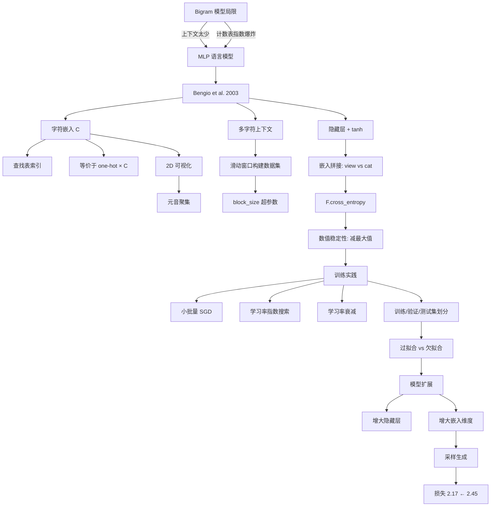

# makemore - 多层感知机与字符嵌入

## 核心概述

本笔记整理自 Andrej Karpathy 的 makemore 系列课程第二讲。在上一讲的 Bigram 模型基础上，本讲引入**多层感知机（MLP）**架构，参考 Bengio et al. 2003 论文，用字符嵌入（character embeddings）和多字符上下文大幅提升语言模型质量。

**为什么重要**：本讲引入了**嵌入（embedding）**这一深度学习核心概念——将离散符号映射到连续向量空间，使模型能够通过向量距离表达字符间的语义相似性。这是理解后续 Word2Vec、注意力机制乃至 Transformer 的基础。

**解决什么问题**：
- Bigram 模型只看 1 个字符，上下文太少，生成质量差
- 计数表格法在多字符上下文下指数爆炸（$27^n$ 行）
- 如何用神经网络替代查表，实现可扩展的多字符上下文建模
- 如何在实践中训练、调参、评估神经网络语言模型

> [!note] 核心论点
> 通过引入字符嵌入，MLP 语言模型可以用**前 N 个字符**预测下一个字符，突破 Bigram 的单字符限制。嵌入空间自动学习到字符间的相似性（如元音聚集在一起），使模型具备泛化能力。最终损失从 Bigram 的 2.45 降至约 2.17。

---

## 知识体系

### 1. 从 Bigram 到 MLP：动机与论文

#### 1.1 Bigram 模型的局限

上一讲的 Bigram 模型只看前 1 个字符预测下一个字符：

- **优点**：简单直接，计数法和梯度法等价
- **缺点**：上下文太少，生成质量差（名字"不太对劲"）

如果扩展到更多字符上下文，计数表格法**指数爆炸**：

| 上下文长度 | 计数表行数 | 问题 |
|-----------|-----------|------|
| 1 个字符 | 27 | 可行 |
| 2 个字符 | $27^2 = 729$ | 可行但稀疏 |
| 3 个字符 | $27^3 \approx 19{,}683$ | 大部分组合计数为 0 |
| 10 个字符 | $27^{10} \approx 2 \times 10^{14}$ | 完全不可行 |

> [!important] 核心瓶颈
> 计数表格法无法扩展——上下文组合数随长度指数增长，而数据量有限，导致绝大多数组合的计数为零。需要一种能**泛化**到未见组合的方法。

#### 1.2 Bengio et al. 2003 论文

课程基于 Yoshua Bengio 等人 2003 年的经典论文：

> **A Neural Probabilistic Language Model** — Bengio, Duchardt, Vincent, Jauvin (2003)
> [JMLR 链接](https://www.jmlr.org/papers/volume3/bengio03a/bengio03a.pdf)

论文核心思想：
- 为每个词（原论文用 17000 个词）分配一个**特征向量**（如 30 维）
- 初始随机嵌入，通过反向传播调整
- 语义相近的词在嵌入空间中**距离更近**
- 用多层神经网络根据前 N 个词预测下一个词

#### 1.3 嵌入的直觉：知识传递

嵌入的核心价值在于**泛化**（generalization）：

> 假设训练集中见过"the dog is running"但从未见过"the cat is running"。由于"dog"和"cat"在相似语境中出现，它们的嵌入向量会在训练中被拉近。当模型遇到"the cat is ___"时，可以借助"dog"的知识推断出"running"。

这种通过嵌入空间**传递知识**的能力，是纯计数法无法实现的。

---

### 2. MLP 架构设计

#### 2.1 论文中的网络结构

```
输入: 3 个前序词的索引 (如 [the, dog, is])
  ↓
嵌入查找表 C: 每个索引 → 30 维向量
  ↓
拼接: 3 × 30 = 90 维输入
  ↓
隐藏层: 全连接 (90 → 100), tanh 激活
  ↓
输出层: 全连接 (100 → 17000), softmax
  ↓
输出: 17000 维概率分布
```

#### 2.2 课程中的字符级改编

将论文方法从**词级**改编为**字符级**：

| 对比项 | 原论文 | 课程实现 |
|--------|--------|---------|
| 词汇表 | 17000 个词 | 27 个字符 (a-z + `.`) |
| 嵌入维度 | 30 维 | 初始 2 维，后扩展到 10 维 |
| 上下文长度 | 3 个词 | 3 个字符 (block_size=3) |
| 隐藏层 | 100 神经元 | 初始 100，后扩展到 300 |
| 输出层 | 17000 维 | 27 维 |

#### 2.3 makemore.py 中的 MLP 实现

`makemore.py` 中的 `MLP` 类完整实现了该架构：

```350:394:makemore.py
class MLP(nn.Module):
    """
    takes the previous block_size tokens, encodes them with a lookup table,
    concatenates the vectors and predicts the next token with an MLP.

    Reference:
    Bengio et al. 2003 https://www.jmlr.org/papers/volume3/bengio03a/bengio03a.pdf
    """

    def __init__(self, config):
        super().__init__()
        self.block_size = config.block_size
        self.vocab_size = config.vocab_size
        self.wte = nn.Embedding(config.vocab_size + 1, config.n_embd) # token embeddings table
        # +1 in the line above for a special <BLANK> token that gets inserted if encoding a token
        # before the beginning of the input sequence
        self.mlp = nn.Sequential(
            nn.Linear(self.block_size * config.n_embd, config.n_embd2),
            nn.Tanh(),
            nn.Linear(config.n_embd2, self.vocab_size)
        )

    def get_block_size(self):
        return self.block_size

    def forward(self, idx, targets=None):

        # gather the word embeddings of the previous 3 words
        embs = []
        for k in range(self.block_size):
            tok_emb = self.wte(idx) # token embeddings of shape (b, t, n_embd)
            idx = torch.roll(idx, 1, 1)
            idx[:, 0] = self.vocab_size # special <BLANK> token
            embs.append(tok_emb)

        # concat all of the embeddings together and pass through an MLP
        x = torch.cat(embs, -1) # (b, t, n_embd * block_size)
        logits = self.mlp(x)

        # if we are given some desired targets also calculate the loss
        loss = None
        if targets is not None:
            loss = F.cross_entropy(logits.view(-1, logits.size(-1)), targets.view(-1), ignore_index=-1)

        return logits, loss
```

> [!note] makemore.py 的实现细节
> `makemore.py` 使用 `nn.Embedding` 和 `nn.Sequential` 封装了更优雅的实现。课程视频中使用手动创建的参数张量，逐步讲解每个组件的原理。

---

### 3. 构建数据集：滑动窗口上下文

#### 3.1 数据集构建逻辑

与 Bigram 不同，MLP 使用**多个前序字符**作为上下文。以 `block_size=3` 为例：

```python
block_size = 3  # 用前3个字符预测第4个

X, Y = [], []
for w in words:
    context = [0] * block_size  # 初始化全零上下文 [., ., .]
    for ch in w + '.':
        ix = stoi[ch]
        X.append(context)        # 当前上下文作为输入
        Y.append(ix)             # 下一个字符作为标签
        context = context[1:] + [ix]  # 滑动窗口：移除最旧的，加入最新的
```

以 `emma` 为例生成的训练样本：

| 输入上下文 (X) | 标签 (Y) | 含义 |
|---------------|---------|------|
| `[., ., .]` | `e` (5) | 起始 → e |
| `[., ., e]` | `m` (13) | ...e → m |
| `[., e, m]` | `m` (13) | ..em → m |
| `[e, m, m]` | `a` (1) | .emm → a |
| `[m, m, a]` | `.` (0) | emma → 结束 |

- `block_size` 是可调超参数，可设为 4、5、10 等
- `block_size` 越大，上下文越长，但参数量和计算量也越大

> [!tip] 滑动窗口的本质
> 这本质是一个**滑动窗口**（sliding window）机制。每个字符位置都生成一个训练样本，上下文窗口逐字符滑动。一个长度为 $L$ 的单词产生 $L+1$ 个样本。

---

### 4. 字符嵌入（Character Embeddings）

#### 4.1 嵌入查找表

创建嵌入矩阵 `C`，将每个字符索引映射到低维向量：

```python
C = torch.randn((27, 2))  # 27个字符，每个嵌入到2维空间
```

- 论文中：17000 个词嵌入到 30 维空间
- 课程初始：27 个字符嵌入到 **2 维**空间（方便可视化）
- 后续扩展到 10 维

#### 4.2 嵌入的两种等价实现

**方法一：直接索引**（推荐，高效）

```python
emb = C[5]  # 取 C 的第5行，得到2维向量
```

**方法二：one-hot × C**（教学用，等价但低效）

```python
xenc = F.one_hot(torch.tensor([5]), num_classes=27).float()
emb = xenc @ C  # one-hot × C = 取 C 的第5行
```

> [!note] 嵌入等价于线性层
> one-hot × C 本质上就是一个**没有偏置的线性层**，权重矩阵就是 C。因此：
> - 嵌入查找 = 线性层的特例（输入是 one-hot）
> - 直接索引比 one-hot 乘法**更快**
> - 在实际代码中统一使用 `nn.Embedding` 或直接索引

#### 4.3 PyTorch 灵活的索引机制

PyTorch 支持用**多维张量**直接索引嵌入表：

```python
# X 的形状是 [32, 3]（32个样本，每个3个字符索引）
emb = C[X]  # 输出形状 [32, 3, 2]——每个整数都被替换为对应的2维嵌入
```

- 可以用**列表**索引：`C[[5, 6, 7]]` → `[3, 2]`
- 可以用**一维张量**索引：`C[torch.tensor([5, 6, 7])]` → `[3, 2]`
- 可以用**多维张量**索引：`C[X]`（X 形状 `[32, 3]`）→ `[32, 3, 2]`
- 支持**重复索引**：同一个索引可以被多次查询

> [!tip] PyTorch 索引是核心技能
> PyTorch 的索引机制非常强大灵活。在构建 Transformer 等复杂模型时，高效的张量索引是必备技能。务必熟练掌握。

---

### 5. 前向传播：从嵌入到概率

#### 5.1 嵌入拼接

MLP 需要将 3 个字符的嵌入**拼接**为一个向量，才能输入全连接层：

```
输入: [32, 3, 2]  （32个样本，3个字符，2维嵌入）
拼接: [32, 6]     （32个样本，6维拼接向量）
```

**方法一：`torch.cat` + `unbind`（不推荐）**

```python
# 沿维度1拆分为3个 [32, 2] 的张量，再拼接
emb_cat = torch.cat(torch.unbind(emb, 1), dim=1)  # [32, 6]
```

- `torch.unbind` 移除指定维度，返回切片列表
- `torch.cat` 在指定维度拼接
- **缺点**：每次拼接都创建新张量，分配新内存，效率低
- **缺点**：block_size 改变时代码需要修改

**方法二：`torch.view`（推荐，高效）**

```python
emb_cat = emb.view(emb.shape[0], 6)  # 或 emb.view(-1, 6)
```

> [!important] torch.view 的高效原理
> PyTorch 张量在内存中始终以**一维连续数组**存储。`view` 操作只是改变张量的**形状属性**（shape, stride），不复制或移动数据，因此极其高效。
>
> `torch.cat` 每次都创建新的存储空间；`torch.view` 是零拷贝操作。在需要重塑张量时，优先使用 `view`。

#### 5.2 隐藏层

```python
W1 = torch.randn((6, 100))   # 输入6维 → 隐藏100维
b1 = torch.randn(100)         # 偏置

h = torch.tanh(emb.view(-1, 6) @ W1 + b1)  # [32, 100]
```

- `tanh` 激活函数将输出压缩到 $[-1, 1]$ 范围
- 隐藏层大小是**超参数**，可调

> [!warning] 广播机制检查
> `[32, 100] + [100]` 会触发广播：`[100]` 被视为 `[1, 100]`，然后垂直复制 32 次。结果是偏置向量加到每一行——这正是我们想要的。但务必养成检查广播方向的习惯。

#### 5.3 输出层与 Softmax

```python
W2 = torch.randn((100, 27))  # 隐藏100维 → 输出27维（词表大小）
b2 = torch.randn(27)

logits = h @ W2 + b2         # [32, 27]
counts = logits.exp()         # 伪计数
probs = counts / counts.sum(1, keepdim=True)  # 归一化为概率
```

#### 5.4 损失计算

```python
# 手动实现（教学用）
loss = -probs[torch.arange(32), Y].log().mean()

# 推荐：使用 F.cross_entropy
loss = F.cross_entropy(logits, Y)
```

---

### 6. F.cross_entropy 的三大优势

PyTorch 的 `F.cross_entropy` 内部将 softmax + NLL 合并为一个操作，相比手动实现具有三大优势：

#### 6.1 前向传播效率

手动实现会创建多个中间张量（`counts`, `probs`），占用内存。`F.cross_entropy` 使用**融合内核**（fused kernel），在一个操作中完成所有计算。

#### 6.2 反向传播效率

手动实现需要逐项反向推导 `exp`、`sum`、`div`、`log` 等操作。`F.cross_entropy` 可以用**解析公式**直接计算梯度，数学表达式更简洁，计算更快。

> [!example] tanh 的反向传播类比
> 在 Micrograd 中，`tanh` 的前向传播是复杂表达式 $\frac{e^{2x}-1}{e^{2x}+1}$，但反向传播可以简化为 $1 - t^2$（$t$ 是前向输出）。类似地，`cross_entropy` 的反向传播也有简化的解析形式。

#### 6.3 数值稳定性

**问题**：当 logits 中有极大正值（如 100）时，`exp(100)` 会溢出为 `inf`，导致后续计算产生 `nan`。

**PyTorch 的解决方案**：

```python
# PyTorch 内部实现（简化）
logits_max = logits.max()           # 找到最大值
logits_shifted = logits - logits_max  # 减去最大值
# 此时最大值变为0，其余为负数，exp不会溢出
```

> [!important] Softmax 的平移不变性
> $\text{Softmax}(z) = \text{Softmax}(z + c)$ 对任意常数 $c$ 成立，因为：
> $$\frac{e^{z_i + c}}{\sum_j e^{z_j + c}} = \frac{e^c \cdot e^{z_i}}{e^c \sum_j e^{z_j}} = \frac{e^{z_i}}{\sum_j e^{z_j}}$$
> 
> 因此减去最大值不改变概率分布，但避免了数值溢出。负方向的 `exp` 趋近于 0，不会溢出。

| 情况 | 手动实现 | F.cross_entropy |
|------|---------|-----------------|
| logits 正常 | ✓ | ✓ |
| logits 有大负值（如 -100） | ✓ | ✓ |
| logits 有大正值（如 100） | ✗ (inf/nan) | ✓（内部减去最大值）|

---

### 7. 训练实践：小批量、学习率、数据划分

#### 7.1 小批量梯度下降（Mini-batch SGD）

全数据集（22.8 万样本）每次迭代太慢。实践标准做法：**小批量**（mini-batch）。

```python
batch_size = 32

for i in range(steps):
    # 随机采样一个小批量
    ix = torch.randint(0, X.shape[0], (batch_size,))

    # 前向传播（只用小批量数据）
    emb = C[X[ix]]               # [32, 3, 2]
    h = torch.tanh(emb.view(-1, 6) @ W1 + b1)
    logits = h @ W2 + b2
    loss = F.cross_entropy(logits, Y[ix])

    # 反向传播
    for p in parameters:
        p.grad = None
    loss.backward()

    # 参数更新
    for p in parameters:
        p.data += -lr * p.grad
```

> [!tip] 小批量的权衡
> - **优点**：每次迭代快，可以运行更多步骤
> - **缺点**：梯度是近似值（基于 32 个样本而非全部），方向有噪声
> - **实践**：32-256 是常用范围，噪声梯度"足够好"，总训练速度更快

#### 7.2 学习率搜索

如何确定合适的学习率？Karpathy 教授了一种**指数搜索法**：

```python
# 生成指数间隔的学习率范围
lre = torch.linspace(-3, 0, 1000)  # 指数从 -3 到 0
lrs = 10 ** lre                     # 实际学习率从 0.001 到 1.0

lri = []
lossi = []

for i in range(1000):
    ix = torch.randint(0, X.shape[0], (32,))
    # ... 前向传播 ...
    # 使用第 i 个学习率
    for p in parameters:
        p.data += -lrs[i] * p.grad

    lri.append(lre[i])   # 记录指数
    lossi.append(loss.item())
```

绘制**学习率指数 vs 损失**曲线：

```
损失
 ↑
 │  高                    ╱  不稳定区
 │                       ╱
 │  ↓                  ↗
 │   ↘              ↗
 │    ↘          ↗  ← 最佳区间 (≈ 10^-1 = 0.1)
 │     ↘      ↗
 │      ↘  ↗
 │       ↘  低学习率区（下降太慢）
 └──────────────────────→ 学习率指数 (log scale)
    -3   -2   -1    0
  0.001  0.01  0.1  1.0
```

- 学习率太低（< 0.001）：损失几乎不下降
- 学习率合适（≈ 0.1）：损失稳定下降
- 学习率太高（> 1.0）：损失不稳定/发散

> [!success] 确定学习率的方法
> 1. 用指数范围搜索，绘制 loss vs log(lr) 曲线
> 2. 找到曲线最低点对应的指数
> 3. 用该学习率进行正式训练

#### 7.3 学习率衰减

训练后期，固定学习率可能导致在最优解附近"震荡"。标准做法是**学习率衰减**：

```python
# 训练阶段1：高学习率
lr = 0.1
for i in range(10000):
    # ... 训练 ...

# 训练阶段2：降低学习率
lr = 0.01  # 衰减为 1/10
for i in range(10000):
    # ... 训练 ...
```

> [!note] 典型训练流程
> 1. 用学习率搜索确定初始学习率
> 2. 用该学习率训练较长时间
> 3. 当损失趋于平稳时，降低学习率（通常降 10 倍）
> 4. 重复直到损失不再下降

#### 7.4 训练/验证/测试集划分

将数据集分为三部分：

| 划分 | 占比 | 用途 | 使用频率 |
|------|------|------|---------|
| **训练集** (Train) | 80% | 优化模型参数 | 每次迭代 |
| **验证集** (Dev/Val) | 10% | 调整超参数 | 定期评估 |
| **测试集** (Test) | 10% | 最终评估 | 仅最终评估一次 |

```python
import random
random.shuffle(words)

n1 = int(0.8 * len(words))  # ~25603
n2 = int(0.9 * len(words))  # ~28803

Xtr, Ytr = build_dataset(words[:n1])      # 训练集
Xdev, Ydev = build_dataset(words[n1:n2])  # 验证集
Xte, Yte = build_dataset(words[n2:])      # 测试集
```

> [!warning] 测试集的使用原则
> 测试集只能用于**最终评估**。每次在测试集上评估损失都会泄露信息，导致在测试集上"训练"——即过拟合到测试集。因此应极少量使用。

#### 7.5 过拟合与欠拟合

| 现象 | 训练损失 | 验证损失 | 诊断 | 对策 |
|------|---------|---------|------|------|
| **欠拟合** | 高 | 高（≈训练） | 模型太小 | 增大模型/嵌入维度 |
| **过拟合** | 很低 | 高（>训练很多） | 模型太大 | 缩小模型/加正则化 |
| **理想** | 低 | 低（略>训练） | 平衡 | 保持当前配置 |

> [!tip] 诊断流程
> - 训练损失 ≈ 验证损失 且都高 → **欠拟合** → 扩大模型
> - 训练损失 << 验证损失 → **过拟合** → 缩小模型或加正则化
> - 训练损失略 < 验证损失 且都低 → **理想状态**

---

### 8. 嵌入可视化与模型扩展

#### 8.1 二维嵌入可视化

当嵌入维度为 2 时，可以直接绘制字符在二维空间中的位置：

```python
import matplotlib.pyplot as plt

plt.figure(figsize=(8, 8))
plt.scatter(C[:, 0].data, C[:, 1].data, s=200)
for i in range(C.shape[0]):
    plt.text(C[i, 0].item(), C[i, 1].item(), itos[i],
             ha="center", va="center", color="white")
plt.grid('minor')
```

**观察到的结构**：
- **元音聚集**：`a`, `e`, `i`, `o`, `u` 在嵌入空间中聚集在一起
  - 网络学到这些字符可互换（在相似上下文中出现）
- **特殊字符**：`q` 和 `.` 距离其他字符较远
  - 因为它们有独特的使用模式
- 嵌入空间**不是随机的**，反映了字符的统计关系

> [!note] 嵌入空间的意义
> 训练后的嵌入空间自动捕获了字符间的**语义相似性**。这是深度学习嵌入的核心价值——不需要人工指定哪些字符相似，模型通过数据自动学习。

#### 8.2 模型扩展实验

逐步扩大模型以突破欠拟合：

| 配置 | 参数量 | 训练损失 | 验证损失 | 诊断 |
|------|--------|---------|---------|------|
| 2D嵌入, 100隐藏 | ~3.4K | 2.30 | 2.30 | 欠拟合 |
| 2D嵌入, 300隐藏 | ~10K | 2.23 | 2.24 | 嵌入是瓶颈 |
| 10D嵌入, 200隐藏 | ~11K | 2.17 | 2.20 | 开始分离 |
| 继续调优 | — | 2.16 | 2.19 | 接近最优 |

> [!important] 瓶颈诊断
> 当增大隐藏层后损失没有显著下降时，瓶颈可能不在隐藏层，而在**嵌入维度**。2 维空间太小，无法容纳 27 个字符的丰富关系。扩展到 10 维后，模型性能显著提升。

#### 8.3 可调超参数汇总

| 超参数 | 课程值 | 说明 |
|--------|--------|------|
| `block_size` | 3 | 上下文长度（字符数） |
| 嵌入维度 | 2 → 10 | 每个字符的向量维度 |
| 隐藏层大小 | 100 → 300 | 隐藏层神经元数量 |
| `batch_size` | 32 | 小批量大小 |
| 学习率 | 0.1 → 0.01 | 初始 → 衰减 |
| 训练步数 | 10K → 200K | 总迭代次数 |

> [!tip] 超参数调优是经验性的
> 课程中的调参过程"不太靠谱"（Karpathy 原话）。在实际生产中，需要系统性地进行大量实验，逐步筛选最优配置。这是机器学习工程的核心技能。

---

### 9. 从模型中采样

训练完成后，从模型生成新名字：

```python
g = torch.Generator().manual_seed(2147483647 + 10)

for _ in range(20):
    out = []
    context = [0] * block_size  # 初始化全零上下文 [., ., .]
    while True:
        # 前向传播
        emb = C[torch.tensor([context])]   # [1, 3, 2]
        h = torch.tanh(emb.view(1, -1) @ W1 + b1)  # [1, 100]
        logits = h @ W2 + b2               # [1, 27]
        probs = F.softmax(logits, dim=1)   # [1, 27]

        # 采样
        ix = torch.multinomial(probs, num_samples=1, generator=g).item()

        # 更新上下文窗口
        context = context[1:] + [ix]

        if ix == 0:  # 遇到结束标记
            break
        out.append(itos[ix])

    print(''.join(out))
```

**生成结果对比**：

| 模型 | 损失 | 生成质量 |
|------|------|---------|
| Bigram (计数法) | 2.45 | `mor`, `axx` — 不太像名字 |
| Bigram (神经网络) | 2.46 | 同上 |
| MLP (3字符, 10D嵌入) | 2.17 | `ham`, `joe`, `lila` — 明显更像名字 |

> [!success] MLP 显著提升生成质量
> 从 Bigram 的 2.45 降至 MLP 的 2.17，生成的名字明显更像真实人名。这验证了多字符上下文和字符嵌入的价值。

---

### 10. PyTorch 张量操作要点

#### 10.1 torch.view 的高效原理

```
内存中的张量: [0, 1, 2, 3, 4, 5, 6, 7, 8, ..., 17]  (一维连续存储)

view(2, 9):       [[0,1,2,3,4,5,6,7,8],
                   [9,10,11,12,13,14,15,16,17]]

view(3, 3, 2):    [[[0,1],[2,3],[4,5]],
                   [[6,7],[8,9],[10,11]],
                   [[12,13],[14,15],[16,17]]]
```

- 底层存储始终是一维的
- `view` 只改变形状属性（shape, stride），**不复制数据**
- 只要元素总数不变，可以重塑为任意形状
- 使用 `-1` 让 PyTorch 自动推断：`emb.view(-1, 6)`

#### 10.2 torch.cat vs torch.view

| 操作 | 效率 | 原理 |
|------|------|------|
| `torch.cat` | 低 | 创建新张量，复制数据 |
| `torch.view` | 高 | 零拷贝，只改形状属性 |

> [!warning] 优先使用 view
> 当只需要重塑张量形状时（如将 `[32, 3, 2]` 变为 `[32, 6]`），使用 `view` 而非 `cat`。`cat` 用于真正需要拼接不同张量的场景。

#### 10.3 torch.unbind

```python
# emb 形状 [32, 3, 2]
slices = torch.unbind(emb, dim=1)  # 返回3个 [32, 2] 的张量
```

`unbind` 移除指定维度，返回该维度上所有切片的元组。配合 `cat` 可以实现拼接，但效率不如 `view`。

---

## 知识图谱



---

## 关键公式速查

| 概念 | 公式 | 说明 |
|------|------|------|
| 嵌入查找 | $\text{emb}(k) = C[k]$ | 取嵌入矩阵第 $k$ 行 |
| 嵌入等价 | $C[k] = \text{onehot}(k) \cdot C$ | one-hot × C = 直接索引 |
| 拼接 | $\text{cat}(\text{emb}_1, ..., \text{emb}_n)$ | $n \times d_{\text{emb}}$ 维向量 |
| 隐藏层 | $h = \tanh(x \cdot W_1 + b_1)$ | 全连接 + 激活 |
| 输出层 | $\text{logits} = h \cdot W_2 + b_2$ | 全连接 |
| Softmax 平移不变性 | $\text{softmax}(z) = \text{softmax}(z - \max(z))$ | 数值稳定 |
| Cross Entropy | $L = -\frac{1}{N}\sum \log P(y_i)$ | 等价于 NLL |
| 小批量更新 | $\theta \leftarrow \theta - \eta \nabla_\theta L_{\text{batch}}$ | 近似梯度 |

---

## 总结

> [!summary] 本讲核心要点
> 1. **MLP 语言模型**用前 N 个字符（而非 1 个）预测下一个字符，突破 Bigram 限制
> 2. **字符嵌入**将离散字符映射到连续向量空间，语义相近的字符自动聚集
> 3. **嵌入查找**等价于 `one-hot × W`，直接索引更高效
> 4. **`torch.view`** 是零拷贝重塑操作，比 `torch.cat` 高效
> 5. **`F.cross_entropy`** 比手动 softmax + NLL 更高效、更数值稳定（减最大值防溢出）
> 6. **小批量 SGD** 用 32 个样本近似梯度，训练更快
> 7. **学习率搜索**：用指数范围 $10^{-3}$ 到 $10^0$ 找最优，约 $0.1$ 较合适
> 8. **学习率衰减**：训练后期降低学习率（通常降 10 倍）
> 9. **训练/验证/测试集**：80%/10%/10%，测试集仅最终评估一次
> 10. **过拟合/欠拟合诊断**：对比训练损失和验证损失
> 11. 模型最终损失 **2.17**，显著优于 Bigram 的 **2.45**

---

## 相关链接

- **前置知识**：[[makemore - 字符级语言模型与二元语法模型]]（Bigram 模型、softmax、NLL 损失）
- **基础概念**：[[Micrograd - 从零构建自动微分引擎与神经网络]]（反向传播、梯度下降）
- **参考论文**：Bengio et al. 2003, "A Neural Probabilistic Language Model" ([JMLR](https://www.jmlr.org/papers/volume3/bengio03a/bengio03a.pdf))
- **课程仓库**：[karpathy/makemore](https://github.com/karpathy/makemore)
- **Google Colab**：课程提供在线 notebook，无需安装即可运行
