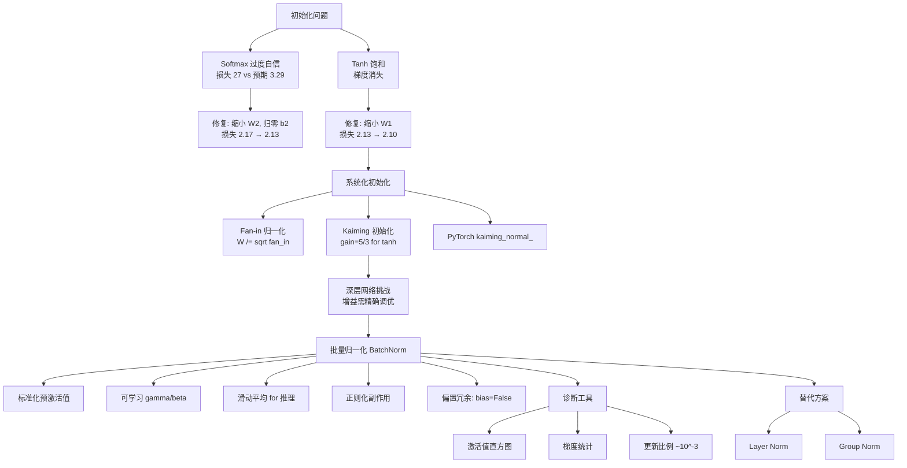

# makemore - 激活函数与梯度及批量归一化

## 核心概述

本笔记整理自 Andrej Karpathy 的 makemore 系列课程第三讲。在上一讲搭建 MLP 语言模型的基础上，本讲深入神经网络**内部机制**——系统分析激活值分布、梯度流动、权重初始化，并引入深度学习里程碑技术**批量归一化（Batch Normalization）**。

**为什么重要**：理解激活值和梯度的统计特性是训练深层网络的**核心技能**。在批量归一化出现之前，训练深度网络如同"走钢丝"——每一步都必须精确调参。本讲揭示了为何深层网络难以训练，以及 BatchNorm 如何从根本上解决了这个问题。这些概念是理解后续 RNN、Transformer 训练的必备基础。

**解决什么问题**：
- 初始化不当导致损失曲线异常（"冰球棒"曲线）
- tanh 饱和导致梯度消失
- 如何系统化地设置权重初始化（而非靠试错）
- 深层网络中激活值和梯度的分布控制
- 如何诊断神经网络训练状态

> [!note] 核心论点
> 神经网络训练的成败很大程度上取决于**激活值和梯度的分布**。初始化不当会导致 softmax 过度自信（损失 27 vs 预期 3.29）和 tanh 严重饱和（梯度消失）。通过系统化的权重初始化（Kaiming 方法）和批量归一化，可以稳定训练深层网络。验证损失从 2.17 逐步优化到 2.10。

---

## 知识体系

### 1. 初始化问题一：Softmax 过度自信

#### 1.1 冰球棒曲线

初始训练时，损失值从 **27** 急剧下降到正常范围，呈现"冰球棒"（hockey stick）形状：

```
损失
 ↑
27 │  ●
   │   ↘
   │     ↘
   │       ↘
 3 │         ────────────  ← 真正的训练从这里开始
   │
   └──────────────────────→ 迭代步数
```

**问题本质**：前几千次迭代只是在"压缩"初始 logits，浪费了训练时间。

#### 1.2 期望的初始损失

初始化时，没有任何理由认为某些字符比其他字符更可能出现，因此期望**均匀分布**：

$$P(\text{char}) = \frac{1}{27} \approx 0.037$$

对应的损失（负对数似然）：

$$\text{Loss} = -\log\left(\frac{1}{27}\right) \approx 3.29$$

> [!important] 初始化的黄金法则
> 对于分类任务，初始损失应等于**均匀分布下的 NLL**：$-\log(1/V)$，其中 $V$ 是类别数。如果初始损失远高于此值，说明初始化有问题——网络在"盲目自信地犯错"。

#### 1.3 修复方法

问题出在输出层的 logits 过大。修复方案：

```python
# 输出层权重：缩小以降低 logits
W2 = torch.randn((n_hidden, 27)) * 0.01  # 而非 *1.0

# 输出层偏置：设为零
b2 = torch.zeros(27)  # 而非随机初始化
```

> [!warning] 为什么不直接设为零？
> 将权重设为精确的零会导致**对称性问题**——所有神经元完全相同，反向传播时获得相同的梯度，永远无法学到不同的特征。用 `0.01` 等小数值可以**打破对称性**（symmetry breaking），保留少量随机性。

#### 1.4 修复效果

| 修复前 | 修复后 |
|--------|--------|
| 初始损失 ≈ 27 | 初始损失 ≈ 3.29 |
| 冰球棒曲线 | 平滑下降 |
| 验证损失 2.17 | 验证损失 **2.13** |

---

### 2. 初始化问题二：Tanh 饱和

#### 2.1 隐藏层激活值分布

查看隐藏层激活值 `h = tanh(hpreact)` 的直方图，发现大量值集中在 **-1 和 +1** 附近：

```
频率
 ↑
  │     ██                    ██
  │     ██                    ██
  │   ████                    ████
  │   ████        ...         ████
  │ ████████      ...       ████████
  │ ████████      ...       ████████
  └──────────────────────────────→ 激活值
   -1    -0.5    0    0.5    1
```

预激活值 `hpreact` 范围在 **-15 到 +15**，经 tanh 压缩后几乎全部饱和。

#### 2.2 梯度消失的数学原理

tanh 的导数为 $1 - t^2$：

| $t$（激活值） | $1 - t^2$（梯度） | 效果 |
|--------------|-------------------|------|
| 0.0 | 1.0 | 梯度完全通过 |
| 0.5 | 0.75 | 梯度略微减小 |
| 0.9 | 0.19 | 梯度大幅减小 |
| 0.99 | 0.02 | 梯度几乎消失 |
| 1.0 | 0.0 | 梯度完全消失 |

> [!danger] tanh 饱和导致梯度消失
> 当激活值接近 ±1 时，梯度趋近于零。反向传播通过 tanh 时，梯度被乘以 $(1-t^2)$，如果 $t \approx \pm 1$，梯度几乎为零，该神经元的权重**无法更新**。

> [!tip] 直觉解释
> tanh 的平坦尾部意味着输入的变化**几乎不影响输出**。既然不影响输出，自然也不影响损失——梯度为零是合理的。这就像在平地上推车，无论怎么推都不会改变高度。

#### 2.3 死神经元（Dead Neurons）

如果某个 tanh 神经元对**所有训练样本**都处于饱和区，它就是"死"的：

- 该神经元的权重永远不会被更新（梯度恒为零）
- 相当于网络中的**永久性损伤**
- 常见于初始化不当或学习率过高时

> [!warning] 死神经元不仅限于 tanh
> - **ReLU**：负半区梯度完全为零，更容易出现死神经元
> - **Sigmoid**：同样有平坦尾部，饱和时梯度消失
> - **Leaky ReLU**：负半区有微小斜率，不易死亡

检测死神经元的方法：遍历训练集，检查是否有神经元的激活值对所有样本都在饱和区。

#### 2.4 修复方法

预激活值过大导致饱和，需要**缩小隐藏层权重**：

```python
# 隐藏层权重：缩小预激活值范围
W1 = torch.randn((n_embd * block_size, n_hidden)) * 0.2  # 而非 *1.0
b1 = torch.randn(n_hidden) * 0.01                          # 小随机偏置
```

修复后预激活值范围缩小到约 ±1.5，tanh 不再严重饱和。

#### 2.5 修复效果

| 修复项 | 验证损失 |
|--------|---------|
| 原始 MLP | 2.17 |
| + 修复 softmax 过度自信 | 2.13 |
| + 修复 tanh 饱和 | **2.10** |

> [!success] 好的初始化 = 更多有效训练时间
> 修复初始化问题后，网络不再浪费前几千次迭代来"压缩"权重，而是从一开始就进行有效的参数优化。

---

### 3. 系统化权重初始化

#### 3.1 问题的数学分析

考虑矩阵乘法 $y = x \cdot W$（暂不考虑偏置和非线性）：

```python
x = torch.randn(1000, 10)     # 1000个样本，10维输入，标准正态分布
W = torch.randn(10, 200)      # 10维输入，200个神经元
y = x @ W                     # 输出形状 [1000, 200]
```

**观察**：输入标准差为 1，但输出标准差增长到约 **3**（≈ $\sqrt{\text{fan\_in}} = \sqrt{10}$）。高斯分布在"扩散"。

#### 3.2 Fan-in 归一化

数学推导表明，为了保持输出标准差为 1，权重应除以 $\sqrt{\text{fan\_in}}$：

```python
# fan_in = 输入维度（输入连接数）
W = torch.randn(fan_in, fan_out) / (fan_in ** 0.5)
```

| 缩放因子 | 输出标准差 | 效果 |
|---------|-----------|------|
| ×5 | ~15 | 过大，激活值爆炸 |
| ×1（无缩放） | ~3 | 过大 |
| ×0.2 | ~0.6 | 过小，激活值消失 |
| ×$1/\sqrt{10}$ | ~1.0 | **正好** |

#### 3.3 Kaiming 初始化

何凯明等人的论文 *"Delving Deep into Rectifiers"*（2015）系统分析了初始化问题：

- 针对 ReLU/PReLU（截断一半负值），需要额外乘以 $\sqrt{2}$ 补偿
- 标准差设为 $\sqrt{2/\text{fan\_in}}$

PyTorch 内置实现：`torch.nn.init.kaiming_normal_`

```python
# PyTorch 标准初始化方法
W = torch.nn.init.kaiming_normal_(
    tensor,
    mode='fan_in',           # 按输入维度归一化（默认）
    nonlinearity='tanh'      # 激活函数类型决定增益
)
```

#### 3.4 增益（Gain）

不同激活函数需要不同的**增益**来补偿其压缩效应：

| 激活函数 | 增益 | 原因 |
|---------|------|------|
| 线性（无激活） | 1.0 | 无压缩 |
| tanh | 5/3 ≈ 1.667 | 尾部压缩输入分布 |
| ReLU | $\sqrt{2}$ ≈ 1.414 | 截断一半负值 |

```python
# tanh 的完整初始化公式
std = (gain / fan_in ** 0.5)  # = (5/3) / sqrt(fan_in)
W = torch.randn(fan_in, fan_out) * std
```

> [!note] 为什么 tanh 需要 5/3 的增益
> tanh 会将输入分布的尾部"挤压"向中心，导致输出标准差**缩小**。如果只用 $1/\sqrt{\text{fan\_in}}$，每经过一层 tanh，标准差都会减小，深层网络中激活值会逐渐消失。增益 5/3 恰好抵消 tanh 的压缩效应。
>
> 实验验证：增益太小（如 1）→ 激活值逐层消失；增益太大（如 3）→ 激活值严重饱和；5/3 刚好。

#### 3.5 现代技术降低了初始化的敏感性

在批量归一化、残差连接（ResNet）、Adam 优化器等现代技术出现之前，精确的初始化至关重要：

- **残差连接**：提供梯度直通路径，缓解梯度消失
- **归一化层**：自动控制激活值分布
- **Adam 优化器**：自适应学习率，对初始化更宽容

> [!tip] 实践建议
> 现代实践中，用 `kaiming_normal_` 配合适当增益即可，无需过度精确调参。BatchNorm 会进一步稳定训练。

---

### 4. 批量归一化（Batch Normalization）

#### 4.1 核心思想

BatchNorm 由 Google 团队 2015 年提出，论文 *"Batch Normalization: Accelerating Deep Network Training by Reducing Internal Covariate Shift"*。

核心洞察：如果我们希望预激活值近似标准正态分布，**为什么不直接对它们进行标准化**？

```python
# 计算当前批次的均值和标准差
hpreact = emb_cat @ W1 + b1   # 预激活值 [batch, n_hidden]

mean = hpreact.mean(0, keepdim=True)    # [1, n_hidden]
std = hpreact.std(0, keepdim=True)      # [1, n_hidden]

# 标准化：均值为0，标准差为1
hpreact_norm = (hpreact - mean) / std

# 缩放平移：让网络可以自主调整分布
hpreact_out = gamma * hpreact_norm + beta  # gamma, beta 是可学习参数
```

> [!important] 标准化是可微的
> 均值、标准差的计算和标准化操作都是**完全可微**的数学公式，梯度可以正常通过反向传播计算。这是 BatchNorm 可行的数学基础。

#### 4.2 可学习的缩放与平移

仅标准化是不够的——我们不想**强制**每层都是标准正态分布，而是让网络**自主决定**理想的分布：

```python
# 可学习参数
gamma = torch.ones(n_hidden)   # 缩放（增益），初始化为1
beta = torch.zeros(n_hidden)   # 平移（偏置），初始化为0

# 初始状态：gamma=1, beta=0 → 标准正态分布
# 训练后：网络可以调整 gamma/beta 到任意分布
out = gamma * hpreact_norm + beta
```

- `gamma` 初始化为 1 → 初始时缩放不变
- `beta` 初始化为 0 → 初始时无平移
- 反向传播会调整 `gamma` 和 `beta`，让网络自主选择最优分布

#### 4.3 训练与推理的差异

**训练时**：使用当前批次的均值和标准差

**推理时**：不能依赖批次（可能只有一个样本），需要使用训练期间积累的**滑动平均**：

```python
# 训练时更新滑动平均（不需要梯度）
with torch.no_grad():
    bn_mean_running = 0.999 * bn_mean_running + 0.001 * mean
    bn_std_running = 0.999 * bn_std_running + 0.001 * std

# 推理时使用滑动平均
if self.training:
    mean = hpreact.mean(0, keepdim=True)
    std = hpreact.std(0, keepdim=True)
else:
    mean = bn_mean_running
    std = bn_std_running
```

> [!note] 动量参数
> 滑动平均更新公式：`running = (1-momentum) * running + momentum * current`
> - 默认 momentum = 0.1（PyTorch），适合大批次
> - 小批次（如 32）时建议用 0.001，因为单批次统计量波动大

#### 4.4 BatchNorm 的参数

| 参数 | 类型 | 说明 |
|------|------|------|
| `gamma`（权重） | 可学习 | 缩放系数，初始化为 1 |
| `beta`（偏置） | 可学习 | 平移系数，初始化为 0 |
| `running_mean` | 缓冲区 | 滑动平均均值，不参与反向传播 |
| `running_var` | 缓冲区 | 滑动平均方差，不参与反向传播 |
| `eps` | 超参数 | 防止除以零，默认 1e-5 |
| `momentum` | 超参数 | 滑动平均更新率，默认 0.1 |

#### 4.5 BatchNorm 的副作用：正则化

BatchNorm 有一个意外的副作用——**样本间耦合**：

- 一个样本的激活值取决于同批次其他样本
- 这种耦合引入了**噪声**（每次批次组合不同，激活值略有波动）
- 这种噪声起到**正则化**效果，类似数据增强

> [!tip] BatchNorm 的正则化效果
> BatchNorm 不仅稳定训练，还附带正则化效果。这是它难以被替代的原因之一——虽然人们不喜欢批次耦合的复杂性，但它的正则化效果确实有益。

#### 4.6 偏置冗余问题

当全连接层后面紧跟 BatchNorm 时，前层的偏置**完全无用**：

```python
# ❌ 偏置 b1 被浪费
hpreact = x @ W1 + b1       # 加上 b1
hpreact = (hpreact - mean) / std  # BatchNorm 减去均值 → b1 被抵消！

# ✅ 省略偏置，由 BatchNorm 的 beta 代替
hpreact = x @ W1             # 无偏置
hpreact = gamma * (hpreact - mean) / std + beta  # beta 起偏置作用
```

> [!warning] BatchNorm 前的层不需要偏置
> 如果 Linear/Conv 层后面紧跟 BatchNorm，应设 `bias=False`。前层的偏置会被 BatchNorm 的均值减法抵消，纯属浪费参数。

---

### 5. PyTorch 模块化设计

#### 5.1 自定义 Linear 层

Karpathy 将代码重构为 PyTorch 风格的模块：

```python
class Linear:
    def __init__(self, fan_in, fan_out, bias=True):
        # Kaiming 初始化
        self.weight = torch.randn((fan_in, fan_out)) / fan_in ** 0.5
        self.bias = torch.zeros(fan_out) if bias else None

    def __call__(self, x):
        self.out = x @ self.weight
        if self.bias is not None:
            self.out += self.bias
        return self.out

    def parameters(self):
        return [self.weight] + ([] if self.bias is None else [self.bias])
```

#### 5.2 自定义 BatchNorm1d 层

```python
class BatchNorm1d:
    def __init__(self, dim, eps=1e-5, momentum=0.1):
        self.eps = eps
        self.momentum = momentum
        self.training = True

        # 可学习参数
        self.gamma = torch.ones(dim)
        self.beta = torch.zeros(dim)

        # 缓冲区（不参与反向传播）
        self.running_mean = torch.zeros(dim)
        self.running_var = torch.ones(dim)

    def __call__(self, x):
        if self.training:
            mean = x.mean(0, keepdim=True)
            var = x.var(0, keepdim=True)  # 注意：用方差而非标准差
        else:
            mean = self.running_mean
            var = self.running_var

        xhat = (x - mean) / torch.sqrt(var + self.eps)  # 标准化
        self.out = self.gamma * xhat + self.beta          # 缩放平移

        # 更新滑动平均
        if self.training:
            with torch.no_grad():
                self.running_mean = (1 - self.momentum) * self.running_mean + self.momentum * mean
                self.running_var = (1 - self.momentum) * self.running_var + self.momentum * var

        return self.out

    def parameters(self):
        return [self.gamma, self.beta]
```

#### 5.3 自定义 Tanh 层

```python
class Tanh:
    def __call__(self, x):
        self.out = torch.tanh(x)
        return self.out

    def parameters(self):
        return []
```

> [!note] PyTorch 标准模块
> 上述自定义模块的接口与 PyTorch 内置的 `nn.Linear`、`nn.BatchNorm1d`、`nn.Tanh` **完全一致**。理解这些自定义实现，就能理解 PyTorch 内部的工作原理。

#### 5.4 makemore.py 中的模块化设计

`makemore.py` 中所有模型都使用 PyTorch 标准模块：

```350:394:makemore.py
class MLP(nn.Module):
    """
    takes the previous block_size tokens, encodes them with a lookup table,
    concatenates the vectors and predicts the next token with an MLP.

    Reference:
    Bengio et al. 2003 https://www.jmlr.org/papers/volume3/bengio03a/bengio03a.pdf
    """

    def __init__(self, config):
        super().__init__()
        self.block_size = config.block_size
        self.vocab_size = config.vocab_size
        self.wte = nn.Embedding(config.vocab_size + 1, config.n_embd) # token embeddings table
        # +1 in the line above for a special <BLANK> token that gets inserted if encoding a token
        # before the beginning of the input sequence
        self.mlp = nn.Sequential(
            nn.Linear(self.block_size * config.n_embd, config.n_embd2),
            nn.Tanh(),
            nn.Linear(config.n_embd2, self.vocab_size)
        )

    def get_block_size(self):
        return self.block_size

    def forward(self, idx, targets=None):

        # gather the word embeddings of the previous 3 words
        embs = []
        for k in range(self.block_size):
            tok_emb = self.wte(idx) # token embeddings of shape (b, t, n_embd)
            idx = torch.roll(idx, 1, 1)
            idx[:, 0] = self.vocab_size # special <BLANK> token
            embs.append(tok_emb)

        # concat all of the embeddings together and pass through an MLP
        x = torch.cat(embs, -1) # (b, t, n_embd * block_size)
        logits = self.mlp(x)

        # if we are given some desired targets also calculate the loss
        loss = None
        if targets is not None:
            loss = F.cross_entropy(logits.view(-1, logits.size(-1)), targets.view(-1), ignore_index=-1)

        return logits, loss
```

> [!note] makemore.py 的简化
> `makemore.py` 中的 `MLP` 类使用 `nn.Sequential` 封装了线性层和 tanh 激活，但没有使用 BatchNorm（因为模型很浅，不需要）。在课程中，Karpathy 手动实现了 6 层深度网络来演示 BatchNorm 的必要性。

---

### 6. 深层网络训练：增益调优实验

#### 6.1 实验设置

用 6 层 `Linear + Tanh` 堆叠的深度网络，观察不同增益下的激活值和梯度分布：

```python
layers = []
for i in range(n_layers):
    layers.append(Linear(n_in, n_out))
    layers.append(Tanh())
```

#### 6.2 增益对激活值的影响

| 增益 | 激活值表现 | 饱和率 |
|------|-----------|--------|
| 0.5（太小） | 逐层缩小，趋近于零 | ~0% |
| 1.0（无补偿） | 缓慢缩小 | ~2% |
| 5/3 ≈ 1.667（推荐） | **稳定，标准差≈0.65** | ~5% |
| 2.0（偏大） | 开始饱和 | ~10% |
| 3.0（太大） | 严重饱和 | ~30%+ |

> [!important] 增益的精确平衡
> 对于 tanh 网络，5/3 是"甜点"——太小则激活消失，太大则饱和。在没有 BatchNorm 的深层网络中，这个值必须精确设定。

#### 6.3 纯线性网络（移除 tanh）

当移除所有 tanh 非线性时，增益应为 **1.0**（无压缩需要补偿）：

- 增益 > 1：激活值逐层放大，梯度不对称
- 增益 < 1：激活值逐层缩小，梯度衰减
- 增益 = 1：前向传播和反向传播都稳定

> [!note] 线性层的理论等价性
> 纯线性网络无论堆叠多少层，数学上等价于单个线性层（$W_1 \cdot W_2 \cdots W_n = W_{\text{combined}}$）。但优化过程不同——反向传播的链式法则使得训练动态有差异。

#### 6.4 BatchNorm 的解放

加入 BatchNorm 后：
- 激活值分布**自动稳定**，无需精确调增益
- 即使增益设为 0.2 或 1.0，前向传播的激活值依然正常
- 但**参数更新量**仍受增益影响，可能需要调整学习率

---

### 7. 诊断工具：训练监控

#### 7.1 激活值直方图

绘制每层 tanh 输出的直方图，关注：
- 分布是否集中在 ±1（饱和）
- 标准差是否逐层稳定
- 饱和率（$|t| > 0.97$ 的比例）是否过高

```python
# 饱和率检测
saturation = (h.abs() > 0.97).float().mean()
# 理想值：约 5%，不应超过 10-20%
```

#### 7.2 梯度统计

监控每层梯度的均值和标准差：
- 均值应接近 0
- 标准差应在各层间**大致相等**，不应逐层增大或缩小

#### 7.3 参数更新与数据比（最关键指标）

**最重要的诊断图**：更新量与参数值的比值

```python
# 记录每个参数的更新比例
ud = []  # update-to-data ratio

for i in range(steps):
    # ... 前向传播、反向传播 ...

    # 记录更新比例
    with torch.no_grad():
        for p in parameters:
            if p.ndim == 2:  # 只看权重矩阵
                update = -lr * p.grad  # 实际更新量
                ratio = update.std() / p.data.std()  # 更新量/参数值的标准差比
                ud.append(((ratio).log10(), i, p_name))
```

**理想范围**：$\log_{10}(\text{ratio}) \approx -3$，即更新量约为参数值的 **1/1000**

```
log10(更新/参数)
  ↑
0 │  ← 太大（参数剧烈变动，训练不稳定）
  │
-1│
  │
-2│
  │
-3│  ★ 理想区间
  │
-4│  ← 太小（学习率过低，训练太慢）
  │
  └──────────────────→ 训练步数
```

| $\log_{10}$ 比值 | 含义 | 诊断 |
|-----------------|------|------|
| > -1 | 更新量 ≈ 参数值的 1/10 | 学习率太高 |
| -3 | 更新量 ≈ 参数值的 1/1000 | **理想** |
| < -4 | 更新量 ≈ 参数值的 1/10000 | 学习率太低 |

> [!tip] 用更新比例调学习率
> 如果所有参数的更新比例都偏离 -3 太远，说明学习率需要调整：
> - 比值太高（如 -1）→ 降低学习率
> - 比值太低（如 -5）→ 提高学习率

#### 7.4 诊断流程总结

```
训练问题诊断流程：

1. 查初始损失
   └→ 远高于 -log(1/V)? → 修复输出层初始化

2. 查激活值直方图
   └→ 大量值在 ±1? → tanh 饱和，缩小隐藏层权重

3. 查梯度统计
   └→ 各层标准差差异大? → 检查增益设置

4. 查更新比例
   └→ 偏离 -3? → 调整学习率

5. 查训练/验证损失
   └→ 训练 << 验证? → 过拟合，缩小模型
   └→ 训练 ≈ 验证 且都高? → 欠拟合，扩大模型
```

---

### 8. BatchNorm 在实践中的应用

#### 8.1 放置位置

通常放在**线性层/卷积层之后、激活函数之前**：

```python
# 标准模式
x = Linear(fan_in, fan_out)(x)
x = BatchNorm1d(fan_out)(x)
x = Tanh()(x)
```

也有人放在激活函数之后，效果相似。

#### 8.2 ResNet 中的模式

在 ResNet 等深度网络中，重复的 `Conv → BatchNorm → ReLU` 模式：

```python
# ResNet 瓶颈模块（简化）
x = Conv2d(bias=False)(x)   # 无偏置（后面有 BN）
x = BatchNorm2d()(x)
x = ReLU()(x)
```

> [!note] 为什么 Conv 层设 bias=False
> Conv 层后紧跟 BatchNorm 时，偏置会被 BN 的均值减法抵消，所以省略。这是 PyTorch ResNet 实现的标准做法。

#### 8.3 BatchNorm 的缺陷与替代方案

| 缺陷 | 说明 |
|------|------|
| 批次耦合 | 前向传播中样本间相互影响 |
| 推理复杂 | 需要维护滑动平均统计量 |
| 小批次问题 | 批次太小时统计量不可靠 |
| RNN 不适用 | 序列长度变化，批次维度复杂 |

**替代方案**（后续课程讲解）：
- **Layer Norm**（层归一化）：沿特征维度归一化，不依赖批次
- **Instance Norm**（实例归一化）：每个样本独立归一化
- **Group Norm**（组归一化）：将特征分组后归一化

> [!info] BatchNorm 的历史地位
> BatchNorm 是 2015 年深度学习的里程碑。它让可靠训练更深的网络成为可能。虽然人们一直在尝试替代它（因为批次耦合的复杂性），但它至今仍是表现最好的归一化方法之一，部分原因是其附带的正则化效果。

---

## 知识图谱



---

## 关键公式速查

| 概念 | 公式 | 说明 |
|------|------|------|
| 期望初始损失 | $-\log(1/V)$ | 均匀分布下的 NLL |
| Fan-in 归一化 | $W \sim \mathcal{N}(0, \text{gain}^2 / \text{fan\_in})$ | 保持激活值标准差 |
| tanh 增益 | $\text{gain} = 5/3$ | 补偿 tanh 压缩 |
| ReLU 增益 | $\text{gain} = \sqrt{2}$ | 补偿负半区截断 |
| BatchNorm 标准化 | $\hat{x} = \frac{x - \mu}{\sqrt{\sigma^2 + \epsilon}}$ | 均值0方差1 |
| BatchNorm 缩放平移 | $y = \gamma \hat{x} + \beta$ | 可学习变换 |
| 滑动平均 | $\mu_{\text{running}} \leftarrow (1-m)\mu_{\text{running}} + m\mu_{\text{batch}}$ | 推理用 |
| tanh 梯度 | $\frac{\partial}{\partial x}\tanh(x) = 1 - \tanh^2(x)$ | 饱和时→0 |
| 更新比例 | $\text{ratio} = \frac{\text{std}(\Delta\theta)}{\text{std}(\theta)}$ | 理想 ~$10^{-3}$ |

---

## 总结

> [!summary] 本讲核心要点
> 1. **初始化决定训练效率**：坏初始化浪费迭代次数压缩权重，好初始化从第一步就有效训练
> 2. **期望初始损失** = $-\log(1/V)$，偏离此值说明 softmax 过度自信
> 3. **tanh 饱和导致梯度消失**：激活值接近 ±1 时梯度趋零，神经元"死亡"
> 4. **Fan-in 归一化**：权重除以 $\sqrt{\text{fan\_in}}$ 保持激活值标准差
> 5. **Kaiming 初始化**：tanh 增益 5/3，ReLU 增益 $\sqrt{2}$，PyTorch 内置 `kaiming_normal_`
> 6. **BatchNorm** 标准化预激活值，让网络自主调整分布，自动稳定深层网络训练
> 7. **BatchNorm 副作用**：批次耦合带来正则化效果，但增加复杂性
> 8. **BatchNorm 前的层不需要偏置**：`bias=False`，由 BN 的 `beta` 代替
> 9. **诊断三件套**：激活值直方图、梯度统计、更新比例（理想 $\log_{10} \approx -3$）
> 10. **现代技术**（残差连接、Adam、归一化层）降低了初始化精度的要求
> 11. 验证损失优化路径：2.17 → 2.13（修 softmax）→ **2.10**（修 tanh）

---

## 相关链接

- **前置知识**：[[makemore - 字符级语言模型与二元语法模型]]（softmax、NLL、梯度下降基础）
- **前置知识**：[[makemore - 多层感知机与字符嵌入]]（MLP 架构、训练循环）
- **基础概念**：[[Micrograd - 从零构建自动微分引擎与神经网络]]（反向传播、链式法则）
- **参考论文**：
  - Bengio et al. 2003, "A Neural Probabilistic Language Model" ([JMLR](https://www.jmlr.org/papers/volume3/bengio03a/bengio03a.pdf))
  - He et al. 2015, "Delving Deep into Rectifiers" ([arXiv](https://arxiv.org/abs/1502.01852))
  - Ioffe & Szegedy 2015, "Batch Normalization" ([arXiv](https://arxiv.org/abs/1502.03167))
- **课程仓库**：[karpathy/makemore](https://github.com/karpathy/makemore)
