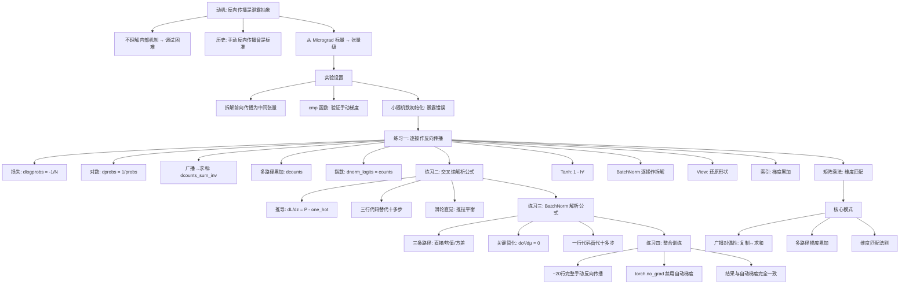
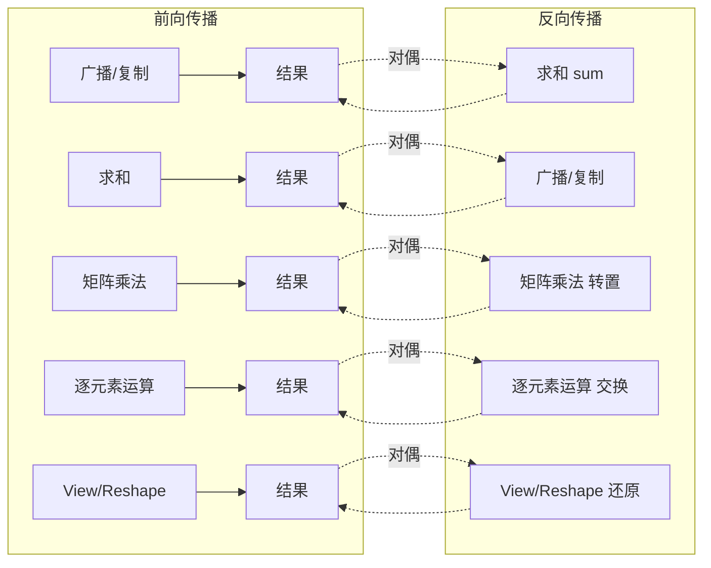

# makemore - 成为反向传播忍者

## 核心概述

本笔记整理自 Andrej Karpathy 的 makemore 系列课程第四讲。在前三讲构建了 MLP 语言模型并深入理解激活值与批量归一化之后，本讲**移除 `loss.backward()`**，在张量层面**手动编写完整的反向传播过程**。

**为什么重要**：Karpathy 将反向传播称为一个"**泄露抽象**"（leaky abstraction）——你不能仅仅组合可微模块、调用 `loss.backward()` 就指望一切正常。不理解反向传播的内部机制，就无法调试梯度消失/爆炸、死亡神经元、初始化敏感等问题。本讲从标量级的 Micrograd 跃升到**张量级**的手动反向传播，是真正理解深度学习训练的"内功"。

**解决什么问题**：
- PyTorch 自动梯度像"黑盒"，隐藏了梯度计算的细节
- 不知道广播机制如何在反向传播中"逆转"
- 不理解交叉熵损失为何梯度公式如此简洁
- 不理解 BatchNorm 层的梯度如何推导
- 实践中遇到梯度问题时不知如何定位

> [!note] 核心论点
> 反向传播并非"自动神奇地运行"。通过在张量层面手动推导并实现每一层的梯度，你将理解：广播的前向传播在反向传播中变为求和，矩阵乘法的前向传播在反向传播中仍是矩阵乘法（只是转置），以及交叉熵和 BatchNorm 各有简洁的解析梯度公式。本讲通过四个递进练习——从逐操作拆解到解析公式整合——彻底揭示反向传播的全部内部机制。

---

## 知识体系

### 1. 动机：反向传播是"泄露抽象"

#### 1.1 什么是泄露抽象

Karpathy 曾写过一篇博客文章，将反向传播称为"泄露抽象"（leaky abstraction）：

- **表面**：PyTorch 的 `loss.backward()` 让一切"自动"运行
- **现实**：你**不能**随便组合可微函数模块，然后寄希望于反向传播自动正确工作
- **后果**：不理解内部机制 → 梯度消失/爆炸、死亡神经元、初始化敏感、损失函数设计错误

> [!warning] 实际代码中的微妙错误
> Karpathy 展示了一个真实的代码片段，作者想**限制梯度的最大值**，却错误地**限制了损失的最大值**。限制损失的后果是：当异常值损失超过阈值时，其梯度被设为零，导致异常值被**完全忽略**。这种错误只有理解反向传播才能避免。

#### 1.2 历史背景：手动反向传播曾是标准

| 时期 | 方式 | 工具 |
|------|------|------|
| ~2006-2014 | 手动编写前向传播和反向传播 | MATLAB |
| ~2014 | 手动实现损失和反向传播 + 梯度检查 | NumPy/Python |
| 现在 | 自动梯度（`loss.backward()`）| PyTorch/TensorFlow |

> [!tip] 梯度检查（Gradient Checking）
> 在自动梯度普及之前，手动反向传播后必须用**梯度检查**验证：用数值差分（有限差分法）估算梯度，与解析推导的梯度比较。如今 PyTorch 的 `torch.allclose` 扮演了类似角色。

#### 1.3 从 Micrograd 到张量级

- **Micrograd**（第一讲）：在**标量**层面实现自动微分，基础元素是单个数字
- **本讲**：在**张量**层面手动编写反向传播，处理矩阵乘法、广播、批量归一化等复杂操作

> [!important] 张量级反向传播的核心挑战
> 张量运算涉及广播（broadcasting）、维度变换、批量并行计算。手动反向传播必须正确处理这些操作的梯度传播——特别是**广播的对偶性**：前向传播中的广播（复制）在反向传播中变为求和，反之亦然。

---

### 2. 实验设置：拆解前向传播

#### 2.1 网络架构

使用与第三讲相同的两层 MLP（含 BatchNorm）：

```
输入: Xb [32, 3]  (32个样本，3个字符索引)
  ↓
嵌入: C[Xb] → emb [32, 3, 10]  (10维嵌入)
  ↓
拼接: emb.view(32, 30) → embcat [32, 30]
  ↓
线性层1: embcat @ W1 + b1 → hprebn [32, 64]  (预批量归一化)
  ↓
BatchNorm: γ·bnraw + β → hpreact [32, 64]  (预激活)
  ↓
Tanh: tanh(hpreact) → h [32, 64]  (隐藏层激活)
  ↓
线性层2: h @ W2 + b2 → logits [32, 27]  (对数概率)
  ↓
Softmax + NLL → loss  (交叉熵损失)
```

#### 2.2 前向传播的显式拆解

为了手动反向传播，前向传播被拆解为更细粒度的中间张量：

```python
# 前向传播（显式拆解版本）
emb = C[Xb]                          # [32, 3, 10] 嵌入查找
embcat = emb.view(emb.shape[0], -1)  # [32, 30]   拼接
hprebn = embcat @ W1 + b1            # [32, 64]   线性层1

# BatchNorm（拆解为多步）
bnmeani = hprebn.mean(0, keepdim=True)      # [1, 64]   批次均值
bndiff = hprebn - bnmeani                    # [32, 64]  中心化
bndiff2 = bndiff ** 2                        # [32, 64]  平方
bnvar = bndiff2.sum(0, keepdim=True) / (n-1) # [1, 64]   方差（无偏估计）
bnvar_inv = (bnvar + 1e-5) ** -0.5           # [1, 64]   标准差倒数
bnraw = bndiff * bnvar_inv                   # [32, 64]  标准化
hpreact = bngain * bnraw + bnbias            # [32, 64]  缩放平移

# Tanh 激活
h = torch.tanh(hpreact)                      # [32, 64]

# 线性层2
logits = h @ W2 + b2                         # [32, 27]

# 损失（显式拆解）
logit_maxes = logits.max(1, keepdim=True).values  # [32, 1]  数值稳定
norm_logits = logits - logit_maxes                  # [32, 27] 减最大值
counts = norm_logits.exp()                          # [32, 27] 指数
counts_sum = counts.sum(1, keepdim=True)            # [32, 1]  行求和
counts_sum_inv = counts_sum ** -1                   # [32, 1]  倒数
probs = counts * counts_sum_inv                     # [32, 27] 归一化概率
logprobs = probs.log()                              # [32, 27] 对数概率
loss = -logprobs[range(n), Yb].mean()               # scalar   NLL损失
```

> [!note] 为什么拆解前向传播？
> 练习一要求逐操作手动反向传播。每个中间张量都需要计算对应的梯度（`d` 前缀），通过 `requires_grad = True` 让 PyTorch 同时计算自动梯度，然后用 `cmp()` 函数验证。

#### 2.3 梯度验证函数 cmp()

```python
def cmp(name, dt, t):
    """验证手动梯度 dt 是否与 PyTorch 自动梯度 t.grad 一致"""
    ex = torch.all(dt == t.grad).item()       # 精确相等
    app = torch.allclose(dt, t.grad)           # 近似相等
    maxdiff = (dt - t.grad).abs().max().item() # 最大差异
    print(f'{name}: exact: {ex} | approximate: {app} | maxdiff: {maxdiff}')
```

> [!tip] 验证策略
> 由于浮点数精度限制，手动推导的梯度与 PyTorch 自动计算的梯度可能存在极小差异（如 $10^{-9}$）。`torch.allclose` 允许一定误差范围，是验证梯度正确性的标准方法。

#### 2.4 初始化的小技巧

```python
# 故意使用小随机数而非零初始化偏置
b1 = torch.randn(64) * 0.1
b2 = torch.randn(27) * 0.1
```

> [!warning] 零初始化会掩盖梯度错误
> 如果所有参数初始化为零，梯度表达式会大幅简化（许多项变为零），可能**掩盖反向传播中的错误**。使用小随机数可以暴露这些潜在问题。这是调试神经网络的重要技巧。

---

### 3. 练习一：逐操作手动反向传播

从损失函数出发，沿着前向传播的**逆方向**，逐个操作推导梯度。

#### 3.1 损失对 logprobs 的梯度

**前向传播**：`loss = -logprobs[range(n), Yb].mean()`

只有被选中的 32 个元素参与损失计算（`logprobs` 形状为 $32 \times 27$，但只有 32 个被索引），其余元素梯度为零。

```python
dlogprobs = torch.zeros_like(logprobs)
dlogprobs[range(n), Yb] = -1.0 / n  # 每个选中元素的梯度为 -1/N
```

> [!note] 简单例子理解
> 损失 = $-\frac{A + B + C}{3}$（3个数的负平均值）。对 $A$ 的导数为 $-\frac{1}{3}$。推广到 32 个数：每个被选中元素的梯度都是 $-\frac{1}{N}$。

#### 3.2 损失对 probs 的梯度

**前向传播**：`logprobs = probs.log()`

$\log(x)$ 的导数为 $\frac{1}{x}$：

```python
dprobs = (1.0 / probs) * dlogprobs
```

> [!tip] 梯度放大的直觉
> 如果某个正确字符的概率非常低（如 0.01），则 $\frac{1}{0.01} = 100$，梯度被放大 100 倍。这就是**低概率事件受到更大梯度推力**的机制——网络会优先修正预测最差的样本。

#### 3.3 损失对 counts_sum_inv 的梯度

**前向传播**：`probs = counts * counts_sum_inv`（广播：`counts_sum_inv` 是 $32 \times 1$，复制到 $32 \times 27$）

```python
dcounts_sum_inv = (counts * dprobs).sum(dim=1, keepdim=True)
```

> [!important] 广播的对偶性：复制 → 求和
> 前向传播中 `counts_sum_inv` 被广播（复制）到 27 列参与乘法。反向传播中，因为它被**多次使用**（每个元素被复制到 27 列），所以梯度需要**沿复制维度求和**。
>
> **规则**：前向传播中的广播（复制）→ 反向传播中的求和；前向传播中的求和 → 反向传播中的广播（复制）。

#### 3.4 损失对 counts_sum 的梯度

**前向传播**：`counts_sum_inv = counts_sum ** -1`

$x^{-1}$ 的导数为 $-x^{-2}$：

```python
dcounts_sum = (-1.0 * counts_sum ** -2) * dcounts_sum_inv
```

#### 3.5 损失对 counts 的梯度（两条路径累加）

`counts` 在前向传播中被使用了**两次**：
1. `probs = counts * counts_sum_inv`（直接用于概率）
2. `counts_sum = counts.sum(1)`（用于归一化分母）

因此梯度需要**两条路径累加**：

```python
# 路径1：通过 probs
dcounts = counts_sum_inv * dprobs  # [32, 27]

# 路径2：通过 counts_sum → counts_sum_inv → probs
# counts_sum = counts.sum(1)，加法的反向传播是广播（复制）
dcounts += dcounts_sum * torch.ones_like(counts)  # 广播回 [32, 27]
```

> [!note] 加法是"梯度路由器"
> 加法操作的局部导数为 1，因此梯度被**均等传递**给所有参与加法的元素。行求和的反向传播就是把列向量的梯度**广播**回矩阵的每一行。

#### 3.6 损失对 norm_logits 的梯度

**前向传播**：`counts = norm_logits.exp()`

$e^x$ 的导数就是 $e^x$ 本身，而 `counts` 已经是 $e^{\text{norm\_logits}}$：

```python
dnorm_logits = counts * dcounts
```

#### 3.7 损失对 logits 和 logit_maxes 的梯度

**前向传播**：`norm_logits = logits - logit_maxes`（广播减法）

```python
# logits 的梯度：直接复制（减法的局部导数为1）
dlogits = dnorm_logits.clone()

# logit_maxes 的梯度：取负后沿广播维度求和
dlogit_maxes = (-dnorm_logits).sum(dim=1, keepdim=True)
```

> [!tip] logit_maxes 的梯度应接近零
> 减去最大值仅用于数值稳定性，不改变 softmax 输出。因此 `logit_maxes` 对损失的影响理论上为零，梯度应为极小值（如 $10^{-9}$）。这是一个很好的验证检查点。

#### 3.8 logit_maxes 到 logits 的第二条路径

`logit_maxes` 依赖于 `logits`（每行取最大值），因此 `logits` 还有一条来自 `logit_maxes` 的梯度路径：

```python
# 使用 one-hot 编码将梯度散播回最大值位置
dlogits += F.one_hot(logits.max(1).indices, num_classes=27) * dlogit_maxes
```

> [!note] max 操作的反向传播
> `max` 操作的反向传播类似"路由"——梯度只传递到取得最大值的位置，其余位置为零。可以用 one-hot 编码实现，也可以用零张量在对应位置设一。

#### 3.9 线性层反向传播：矩阵乘法

**前向传播**：`logits = h @ W2 + b2`

##### 不需要死记公式——用维度匹配推导

> [!important] 维度匹配技巧
> Karpathy 的核心技巧：**不需要死记矩阵乘法的反向传播公式，用维度匹配就能推导**。
>
> 已知 `dlogits` 的形状是 $32 \times 27$，`h` 是 $32 \times 64$，`W2` 是 $64 \times 27$：
>
> 1. **求 `dh`**：`dh` 必须与 `h` 同形（$32 \times 64$）。唯一能从 `dlogits`（$32 \times 27$）和 `W2`（$64 \times 27$）得到 $32 \times 64$ 的方法是 `dlogits @ W2.T`
>
> 2. **求 `dW2`**：`dW2` 必须与 `W2` 同形（$64 \times 27$）。唯一能从 `dlogits`（$32 \times 27$）和 `h`（$32 \times 64$）得到 $64 \times 27$ 的方法是 `h.T @ dlogits`
>
> 3. **求 `db2`**：`db2` 必须与 `b2` 同形（$27$）。`b2` 在前向传播中被广播（复制到 32 行），所以反向传播中沿行求和：`dlogits.sum(0)`

```python
dh = dlogits @ W2.T          # [32, 64] = [32, 27] @ [27, 64]
dW2 = h.T @ dlogits           # [64, 27] = [64, 32] @ [32, 27]
db2 = dlogits.sum(0)          # [27]     沿批次维度求和
```

##### 数学推导验证

对于 $D = A \cdot B + C$（矩阵乘法加偏置），通过逐元素展开可以证明：

$$\frac{\partial L}{\partial A} = \frac{\partial L}{\partial D} \cdot B^T, \quad \frac{\partial L}{\partial B} = A^T \cdot \frac{\partial L}{\partial D}, \quad \frac{\partial L}{\partial C} = \sum_{\text{rows}} \frac{\partial L}{\partial D}$$

> [!tip] 用小例子推导大公式
> Karpathy 的方法：在纸上写一个 $2 \times 2$ 的具体例子，展开所有乘法，然后逐元素求导。这样可以清晰地看到模式，再推广到一般情况。这比直接套用矩阵微积分公式更直观、更不容易出错。

#### 3.10 Tanh 反向传播

**前向传播**：`h = tanh(hpreact)`

tanh 的导数为 $1 - \tanh^2(x)$，可以用输出值表示：

$$\frac{d}{dx}\tanh(x) = 1 - \tanh^2(x) = 1 - h^2$$

```python
dhpreact = (1.0 - h ** 2) * dh
```

> [!note] 用输出值表示导数
> tanh 的导数可以用输入 $x$ 表示为 $1 - \tanh^2(x)$，也可以用输出 $h = \tanh(x)$ 表示为 $1 - h^2$。后者更方便——不需要重新计算 tanh，直接复用前向传播的输出。

#### 3.11 BatchNorm 参数反向传播

**前向传播**：`hpreact = bngain * bnraw + bnbias`

```python
# bngain 的梯度：元素乘法的局部导数是另一个操作数
dbngain = (bnraw * dhpreact).sum(0, keepdim=True)  # [1, 64] 沿批次求和

# bnraw 的梯度
dbnraw = bngain * dhpreact  # [32, 64]

# bnbias 的梯度：偏置被广播，反向传播求和
dbnbias = dhpreact.sum(0, keepdim=True)  # [1, 64]
```

> [!warning] keepdim=True 的重要性
> `bngain` 和 `bnbias` 的形状是 $1 \times 64$，如果不保持维度（`keepdim=True`），求和结果会退化为 64 维一维向量，后续运算的维度将无法正确匹配。

#### 3.12 BatchNorm 内部反向传播（逐操作拆解）

BatchNorm 内部的反向传播是最复杂的部分，需要沿多条路径传播梯度：

```python
# bnraw = bndiff * bnvar_inv
dbndiff = bnvar_inv * dbnraw                          # [32, 64]
dbnvar_inv = (bndiff * dbnraw).sum(0, keepdim=True)   # [1, 64]

# bnvar_inv = (bnvar + eps) ** -0.5
dbnvar = -0.5 * (bnvar + 1e-5) ** -1.5 * dbnvar_inv   # [1, 64]

# bnvar = bndiff2.sum(0) / (n-1)
dbndiff2 = (1.0 / (n-1)) * torch.ones_like(bndiff2) * dbnvar  # [32, 64]

# bndiff2 = bndiff ** 2
dbndiff += 2 * bndiff * dbndiff2  # 累加！第二条路径回到 bndiff

# bndiff = hprebn - bnmeani
dhprebn = dbndiff.clone()
dbnmeani = (-dbndiff).sum(0, keepdim=True)

# bnmeani = hprebn.mean(0) → hprebn 的第二条路径
dhprebn += (1.0 / n) * torch.ones_like(hprebn) * dbnmeani
```

> [!important] bndiff 的两条梯度路径
> `bndiff` 在前向传播中被使用了两次：
> 1. `bnraw = bndiff * bnvar_inv`
> 2. `bndiff2 = bndiff ** 2` → `bnvar` → `bnvar_inv` → `bnraw`
>
> 因此 `dbndiff` 需要累加两条路径的梯度。第一轮计算时只有一条路径的结果，验证会失败；补上第二条路径后才能得到正确梯度。

#### 3.13 线性层1 反向传播

与前述线性层相同的方法：

```python
dembcat = dhprebn @ W1.T     # [32, 30] = [32, 64] @ [64, 30]
dW1 = embcat.T @ dhprebn     # [30, 64] = [30, 32] @ [32, 64]
db1 = dhprebn.sum(0)         # [64]
```

#### 3.14 View 操作的反向传播

**前向传播**：`embcat = emb.view(emb.shape[0], -1)`（$32 \times 3 \times 10$ → $32 \times 30$）

View 本质是**数据的逻辑组织形式**，不复制或修改底层数据。反向传播只需**还原形状**：

```python
demb = dembcat.view(emb.shape)  # [32, 30] → [32, 3, 10]
```

> [!note] View 的反向传播是零成本
> View 只改变张量的形状属性（shape, stride），不触碰数据。反向传播同样只需改回形状，是零拷贝操作。

#### 3.15 嵌入层反向传播：索引操作

**前向传播**：`emb = C[Xb]`（用整数索引从嵌入表 C 中取行）

```python
dC = torch.zeros_like(C)  # [27, 10]
for k in range(Xb.shape[0]):
    for j in range(Xb.shape[1]):
        ix = Xb[k, j]       # 取出索引值
        dC[ix] += demb[k, j]  # 梯度累加到对应行
```

> [!important] 索引操作的反向传播：累加
> 同一行的嵌入向量可能被多个样本引用（如字符 'a' 在多个名字中出现）。反向传播时，所有引用同一行的梯度必须**累加**（`+=`），而非覆盖。
>
> 这是练习一中唯一需要 for 循环的部分。虽然不够高效，但清晰地展示了索引操作梯度的本质。

---

### 4. 练习二：交叉熵的解析反向传播

#### 4.1 动机：逐操作太冗余

练习一将损失函数拆解为 `exp → sum → inv → mul → log → neg → mean` 等十多个基本操作，逐一反向传播。但实际中，可以用纸笔从数学表达式**直接推导**出简化公式。

#### 4.2 推导过程

**单个样本的损失**：

$$L = -\log P_y = -\log \frac{e^{z_y}}{\sum_j e^{z_j}}$$

其中 $z$ 是 logits，$y$ 是正确类别索引。

对第 $i$ 个 logit 求导：

$$\frac{\partial L}{\partial z_i} = \begin{cases} P_i - 1 & \text{if } i = y \\ P_i & \text{if } i \neq y \end{cases}$$

即：**softmax 概率减去 one-hot 标签**。

#### 4.3 批量实现

```python
# 一行代码替代练习一中的十多步反向传播
dlogits = F.softmax(logits, dim=1)
dlogits[range(n), Yb] -= 1
dlogits /= n  # 因为损失是平均值
```

> [!success] 解析公式的威力
> 练习一用了十多个代码块、数百行推导，练习二用**三行代码**就完成了从 logits 到 loss 的完整反向传播。这就是解析推导的价值——数学简化让代码更简洁、计算更高效。

#### 4.4 梯度的物理直觉

```
dlogits 的每一行 = 概率向量 - one-hot(正确答案)

     a    b    c  ...  z    .
  ┌──────────────────────────┐
  │ 0.1  0.3  0.05    0.02  0.53 │  概率 P
  │  0    0    0       0     1   │  one-hot(y)
  │──────────────────────────│
  │ 0.1  0.3  0.05    0.02 -0.47 │  梯度 = P - one_hot
  └──────────────────────────┘

→ 正确答案(.): 概率 0.53 < 1 → 梯度为负 → 推高该位置的 logit
→ 错误答案(a): 概率 0.1 > 0 → 梯度为正 → 压低该位置的 logit
→ 推力和拉力恰好平衡（每行梯度之和为零）
```

> [!tip] 交叉熵梯度的滑轮直觉
> 想象一个滑轮系统：对正确字符施加向上的拉力（梯度为负→增大 logit），对错误字符施加向下的推力（梯度为正→减小 logit）。推力和拉力大小相等、方向相反，形成一个平衡系统。预测越错误，力越大；预测完全正确时，力为零。

---

### 5. 练习三：BatchNorm 的解析反向传播

#### 5.1 目标

将练习一中 BatchNorm 的十多步拆解反向传播，用一个**解析公式**替代——从 `dhpreact` 直接计算 `dhprebn`。

#### 5.2 计算图分析

```
hprebn ──→ x̂ (标准化) ──→ y = γx̂ + β ──→ hpreact
  │                                      
  ├──→ μ (均值) ──→ x̂  (通过中心化)
  │
  └──→ σ² (方差) ──→ x̂  (通过标准化)
```

每个 $x_i$ 通过三条路径影响损失：
1. 直接路径：$x_i → \hat{x}_i → y_i$
2. 通过均值：$x_i → μ → \hat{x}_j$（影响所有 $\hat{x}_j$）
3. 通过方差：$x_i → σ² → \hat{x}_j$（影响所有 $\hat{x}_j$）

#### 5.3 推导步骤

1. **$\frac{\partial L}{\partial \hat{x}_i}$**：已知（从 `dhpreact` 和 `bngain` 计算）
2. **$\frac{\partial L}{\partial \sigma^2}$**：对所有 $\hat{x}_i$ 的梯度求和，乘以局部导数
3. **$\frac{\partial L}{\partial \mu}$**：两条路径——直接到 $\hat{x}$ 和通过 $\sigma^2$。关键简化：当 $\mu$ 是 $x$ 的均值时，通过 $\sigma^2$ 到 $\mu$ 的梯度恰好为零
4. **$\frac{\partial L}{\partial x_i}$**：三条路径的链式法则之和

> [!note] 关键简化：$\frac{\partial \sigma^2}{\partial \mu} = 0$
> 在 BatchNorm 中，$\mu$ 是 $x$ 的均值。虽然 $\sigma^2$ 的表达式中包含 $\mu$，但代入 $\mu = \bar{x}$ 后，$\frac{\partial \sigma^2}{\partial \mu}$ 恰好为零。这使得 $L$ 对 $\mu$ 的导数只剩下直接路径的贡献，表达式大幅简化。

#### 5.4 最终公式

经过代数化简，BatchNorm 的反向传播公式为：

$$\frac{\partial L}{\partial x_i} = \frac{\gamma}{\sigma \cdot N} \left( N \cdot \frac{\partial L}{\partial y_i} - \sum_j \frac{\partial L}{\partial y_j} - \hat{x}_i \sum_j \frac{\partial L}{\partial y_j} \hat{x}_j \right)$$

其中 $N$ 是批次大小，$\sigma$ 是标准差，$\hat{x}_i$ 是标准化后的值。

```python
# 一行代码替代练习一中的十多步 BatchNorm 反向传播
dhprebn = (bngain * bnvar_inv / n) * (
    n * dhpreact
    - dhpreact.sum(0)
    - bnraw * (dhpreact * bnraw).sum(0)
)
```

> [!warning] 公式中的维度与广播
> 这个公式需要对 64 个神经元**并行独立**计算。所有求和操作（`sum(0)`）沿批次维度进行，结果形状为 $1 \times 64$，需要正确广播到 $32 \times 64$。理解这个公式的广播行为比推导它更困难——务必仔细检查每个操作的维度。

#### 5.5 贝塞尔校正的争议

练习一中方差计算使用了 $N-1$（无偏估计）而非 $N$（有偏估计）：

| 估计方法 | 分母 | 使用场景 |
|---------|------|---------|
| 有偏估计 | $N$ | BatchNorm 原论文训练阶段 |
| 无偏估计 | $N-1$ | 统计学标准，BatchNorm 推理阶段 |

> [!warning] PyTorch BatchNorm 的文档问题
> BatchNorm 论文中训练用有偏估计、推理用无偏估计，导致训练/测试不一致。PyTorch 的 `torch.var()` 有 `unbiased` 参数（默认 `True`），但文档未明确说明，容易产生混淆。Karpathy 倾向于训练和测试统一使用无偏估计。

---

### 6. 练习四：整合完整训练

#### 6.1 完整手动反向传播

将练习二和练习三的解析公式与其他层的反向传播整合，得到约 20 行代码的完整反向传播：

```python
# ===== 手动反向传播（替代 loss.backward()）=====

# 交叉熵（练习二的解析公式）
dlogits = F.softmax(logits, 1)
dlogits[range(n), Yb] -= 1
dlogits /= n

# 线性层2
dh = dlogits @ W2.T
dW2 = h.T @ dlogits
db2 = dlogits.sum(0)

# Tanh
dhpreact = (1 - h**2) * dh

# BatchNorm（练习三的解析公式）
dhprebn = (bngain * bnvar_inv / n) * (
    n * dhpreact
    - dhpreact.sum(0)
    - bnraw * (dhpreact * bnraw).sum(0)
)
dbngain = (bnraw * dhpreact).sum(0)
dbnbias = dhpreact.sum(0)

# 线性层1
dembcat = dhprebn @ W1.T
dW1 = embcat.T @ dhprebn
db1 = dhprebn.sum(0)

# View 还原
demb = dembcat.view(emb.shape)

# 嵌入层
dC = torch.zeros_like(C)
for k in range(Xb.shape[0]):
    for j in range(Xb.shape[1]):
        dC[Xb[k,j]] += demb[k,j]
```

#### 6.2 训练流程

```python
with torch.no_grad():  # 禁用 PyTorch 自动梯度
    # 前向传播（使用显式拆解版本）
    # ...

    # 手动反向传播（上述代码）
    # ...

    # 参数更新（使用手动计算的梯度）
    for p, grad in zip(parameters, grads):
        p.data += -lr * grad
```

> [!success] 完全摆脱自动梯度
> 使用 `torch.no_grad()` 上下文管理器禁用 PyTorch 的梯度追踪，整个训练循环不再依赖 `loss.backward()`。唯一用到 PyTorch 的是 `torch.tensor` 用于高效数值计算。训练结果与自动梯度版本**完全一致**。

#### 6.3 梯度验证

训练 100 步后验证手动梯度：

```
logits:    exact: True  | approximate: True  | maxdiff: 0.0
h:         exact: True  | approximate: True  | maxdiff: 0.0
hpreact:   exact: True  | approximate: True  | maxdiff: 0.0
hprebn:    exact: True  | approximate: True  | maxdiff: 0.0
W2:        exact: True  | approximate: True  | maxdiff: 0.0
...
```

确认梯度正确后，关闭梯度检查，进行完整训练。最终损失和生成质量与使用 `loss.backward()` 的版本完全一致。

---

### 7. 反向传播的核心模式总结

#### 7.1 广播的对偶性

| 前向传播 | 反向传播 | 直觉 |
|---------|---------|------|
| 广播（复制） | 求和（`sum`） | 变量被多次使用 → 梯度累加 |
| 求和（`sum`） | 广播（复制） | 梯度均等分配给所有参与者 |
| 矩阵乘法 | 矩阵乘法（转置） | $D = AB$ → $dA = dD \cdot B^T$ |
| 逐元素乘法 | 逐元素乘法（交换） | $C = A \odot B$ → $dA = dB \odot C$ |
| 逐元素加法 | 逐元素加法 | $C = A + B$ → $dA = dC$ |
| View | View（还原形状） | 零拷贝操作 |

> [!important] 广播对偶性是张量反向传播的核心
> 理解这一对偶关系，就能推导任何张量操作的反向传播。**前向传播中的"复制"在反向传播中变为"汇聚"，前向传播中的"汇聚"在反向传播中变为"分发"**。

#### 7.2 多路径梯度累加

当一个中间变量在前向传播中被**多次使用**时，反向传播中需要将所有路径的梯度**累加**：

```
counts ──→ probs ──→ logprobs ──→ loss
   │
   └──→ counts_sum ──→ counts_sum_inv ──→ probs
```

`counts` 有两条路径到达 `loss`，所以 `dcounts` 需要累加两条路径的贡献。

> [!tip] 检查变量是否被多次使用
> 在编写反向传播时，始终检查每个中间变量在前向传播中是否出现在多个表达式中。如果是，确保所有路径的梯度都被累加。

#### 7.3 维度匹配法则

对于矩阵乘法 $Y = X \cdot W + B$：

```
已知: dY [batch, out], X [batch, in], W [in, out], B [out]

dX = dY @ W.T         [batch, in]  = [batch, out] @ [out, in]
dW = X.T @ dY          [in, out]   = [in, batch] @ [batch, out]
dB = dY.sum(dim=0)     [out]       广播的逆操作是求和
```

> [!note] 维度匹配是推导工具，不是记忆工具
> 不需要死记这些公式。只需知道：结果的形状必须与对应参数相同，然后尝试所有可能的矩阵乘法组合，只有一种能让维度对齐。

---

### 8. makemore.py 中的自动梯度

`makemore.py` 使用 PyTorch 标准的自动梯度系统，与本讲的手动实现形成对比：

```python
# makemore.py 的标准训练循环
logits, loss = model(X, Y)       # 前向传播
model.zero_grad(set_to_none=True)
loss.backward()                   # 自动反向传播（本讲要替代的部分）
optimizer.step()                  # 参数更新
```

```680:685:makemore.py
        logits, loss = model(X, Y)

        # calculate the gradient, update the weights
        model.zero_grad(set_to_none=True)
        loss.backward()
        optimizer.step()
```

> [!note] 生产环境 vs 学习
> 在生产环境中，永远使用 `loss.backward()`——自动梯度更高效、更可靠、更易维护。手动反向传播的价值在于**理解**：一旦理解了内部机制，你就能更好地调试、设计和优化神经网络。

---

## 知识图谱



---

## 关键公式速查

| 概念 | 公式 | 说明 |
|------|------|------|
| 交叉熵梯度 | $\frac{\partial L}{\partial z_i} = \frac{1}{N}(P_i - \mathbb{1}_{i=y})$ | softmax 概率减 one-hot |
| Tanh 梯度 | $\frac{\partial L}{\partial x} = (1 - h^2) \cdot \frac{\partial L}{\partial h}$ | 用输出值表示 |
| 矩阵乘法梯度 | $\frac{\partial L}{\partial X} = \frac{\partial L}{\partial Y} W^T$ | $Y = XW + B$ |
| 矩阵乘法梯度 | $\frac{\partial L}{\partial W} = X^T \frac{\partial L}{\partial Y}$ | 转置相乘 |
| 偏置梯度 | $\frac{\partial L}{\partial B} = \sum_{\text{batch}} \frac{\partial L}{\partial Y}$ | 广播的逆是求和 |
| BatchNorm 梯度 | $\frac{\partial L}{\partial x_i} = \frac{\gamma}{\sigma N}\left(N \cdot g_i - \sum g_j - \hat{x}_i \sum g_j \hat{x}_j\right)$ | $g_i = \frac{\partial L}{\partial y_i}$ |
| 指数梯度 | $\frac{d}{dx}e^x = e^x$ | 复用前向值 |
| 对数梯度 | $\frac{d}{dx}\log x = \frac{1}{x}$ | 低概率→大梯度 |
| 幂梯度 | $\frac{d}{dx}x^n = nx^{n-1}$ | 用于 $x^{-1}$, $x^{-0.5}$ 等 |
| 广播对偶 | 前向复制 → 反向求和 | 核心模式 |
| View 对偶 | 前向 reshape → 反向 reshape | 零拷贝 |

---

## 反向传播模式速查



---

## 总结

> [!summary] 本讲核心要点
> 1. **反向传播是"泄露抽象"**：不能只依赖 `loss.backward()`，必须理解内部机制才能调试和优化
> 2. **广播的对偶性**是张量反向传播的核心——前向传播中的复制在反向传播中变为求和，反之亦然
> 3. **多路径梯度累加**：变量被多次使用时，所有路径的梯度必须累加
> 4. **维度匹配法则**：不需要死记矩阵乘法梯度公式，用维度匹配就能唯一推导
> 5. **交叉熵的解析梯度** = softmax 概率 - one-hot 标签（三行代码替代十多步）
> 6. **BatchNorm 的解析梯度**：通过三条路径的链式法则推导，关键简化在于 $\frac{\partial \sigma^2}{\partial \mu} = 0$
> 7. **索引操作的反向传播**是梯度累加——同一嵌入行被多次引用时梯度必须累加
> 8. **手动反向传播曾是标准做法**（~2014年前），现在主要作为学习练习
> 9. **约 20 行代码**即可完成整个 MLP 的手动反向传播，结果与 PyTorch 自动梯度完全一致
> 10. 生产环境中永远使用 `loss.backward()`，但理解手动实现让你成为更好的深度学习工程师

---

## 相关链接

- **前置知识**：[[makemore - 字符级语言模型与二元语法模型]]（softmax、NLL、训练循环）
- **前置知识**：[[makemore - 多层感知机与字符嵌入]]（MLP 架构、嵌入、F.cross_entropy）
- **前置知识**：[[makemore - 激活函数与梯度及批量归一化]]（BatchNorm 原理、初始化、诊断工具）
- **基础概念**：[[Micrograd - 从零构建自动微分引擎与神经网络]]（标量级反向传播、链式法则、拓扑排序）
- **Karpathy 博客**：[Yes you should understand backprop](https://karpathy.medium.com/yes-you-should-understand-backprop-e2f06eab496b)
- **课程仓库**：[karpathy/makemore](https://github.com/karpathy/makemore)
- **Google Colab**：课程提供在线 notebook，无需安装即可运行
