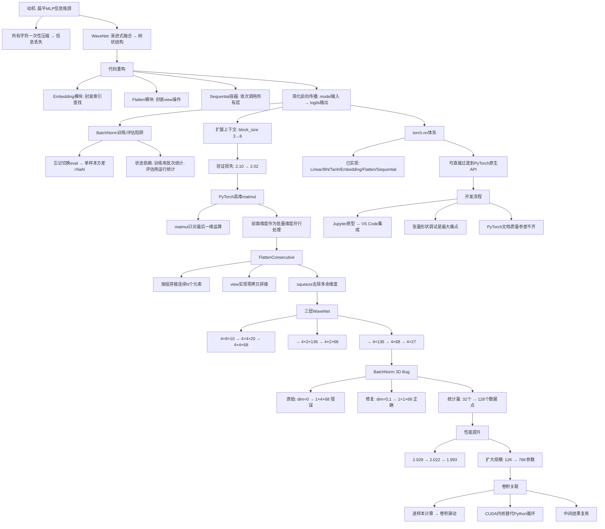
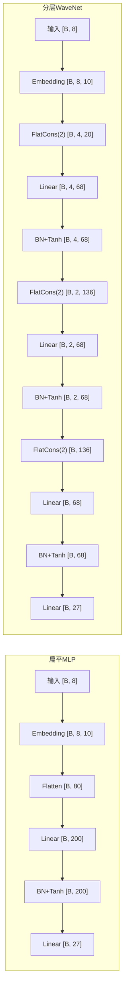

# makemore - 构建WaveNet分层网络

## 核心概述

本笔记整理自 Andrej Karpathy 的 makemore 系列课程第五讲。在前面几讲构建了 MLP 语言模型、深入理解激活值与批量归一化、并完成手动反向传播练习之后，本讲将**重构代码架构**使其更接近 PyTorch 的 `torch.nn` API，并构建一个**分层融合**的深度网络——其架构灵感来自 DeepMind 2016 年的 WaveNet 论文。

**为什么重要**：前几讲的 MLP 将所有输入字符一次性展平后压缩到单个隐藏层，信息被过快压缩。本讲引入**渐进式融合**（progressive fusion）的思想——通过树状层次结构逐步融合上下文信息，使网络更深、更高效。同时，本讲系统重构了所有模块的代码，使其 API 与 PyTorch 的 `torch.nn` 高度一致，为后续直接使用 PyTorch 打下基础。

**解决什么问题**：
- 前向传播代码混乱，嵌入查找和 view 操作散落在层列表之外
- 所有字符在单一步骤中被压缩，信息丢失过多
- BatchNorm 层在接收三维输入时行为错误（隐蔽 bug）
- 缺少对 PyTorch `torch.nn` 模块体系的整体理解
- 损失曲线因批次过小而噪声过大，难以分析

> [!note] 核心论点
> 通过将代码重构为类似 `torch.nn` 的模块化架构（Embedding、Flatten、Sequential 容器），并引入 `FlattenConsecutive` 层实现渐进式融合，我们构建了一个三层 WaveNet 风格网络。在参数量相同的情况下，分层架构配合修复后的 BatchNorm 将验证损失从 2.10 降至 1.993。本讲还揭示了卷积神经网络与该架构的本质关联——卷积只是将 Python for 循环封装为 CUDA 内核的高效实现。

---

## 知识体系

### 1. 动机：从扁平 MLP 到分层 WaveNet

#### 1.1 当前架构的局限

前几讲的 MLP 架构存在一个根本问题：

```
输入: 3个字符 → 嵌入 → 展平为一条长向量 → 单隐藏层 → 输出
```

所有字符在一开始就被**硬塞进同一个隐藏层**，即使加宽这一层、多加神经元，在单一步骤中如此快速地压缩所有信息仍然是不合理的。训练损失 2.05、验证损失 2.10，模型没有明显过拟合，但性能提升受限。

> [!warning] 信息瓶颈
> 将 8 个字符的嵌入向量（如 8×10=80 维）一次性展平并通过单个线性层压缩到 200 维，网络必须在一步之内学会所有字符间的复杂关系。这就像要求一个人瞬间读完一整页并总结——不如逐句阅读、逐步综合。

#### 1.2 WaveNet 的核心思想：渐进式融合

WaveNet（DeepMind, 2016）虽然最初用于音频序列预测，但其建模框架与字符级语言模型完全相同——都是自回归模型。其核心创新是**分层树状结构**：

```
层次0:  c1  c2    c3  c4    c5  c6    c7  c8     （8个字符）
          ↘ ↙       ↘ ↙       ↘ ↙       ↘ ↙
层次1:   二元组     二元组     二元组     二元组     （4组融合）
            ↘   ↙               ↘   ↙
层次2:       四元组               四元组           （2组融合）
                ↘       ↙
层次3:           八元组                            （最终预测）
```

每一层只融合两个连续元素：先是两个字符→二元组，然后两个二元组→四元组，以此类推。随着网络深度增加，上下文信息被**逐步**融合，而非一次性压缩。

> [!important] 渐进式融合 vs 扁平压缩
> 扁平 MLP：80 维 → 200 维（一步完成，信息瓶颈严重）
> 分层 WaveNet：20 维 → 200 维 → 400 维 → 200 维 → 27 维（逐步融合，每层只处理局部信息）
> 
> 关键区别：分层架构中，每一层只需要学习**局部模式**（两个元素如何组合），而最终的预测可以基于这些已被良好处理的中间表示。

---

### 2. 代码重构：构建 PyTorch 风格的模块体系

#### 2.1 损失曲线的修复

在开始重构之前，Karpathy 首先修复了损失曲线噪声过大的问题。由于批次仅 32 个样本，损失值波动剧烈。解决方法是将损失列表重塑为二维张量后按行平均：

```python
# 将一维损失列表重塑为 (行数, 1000) 的二维张量
# 每行包含 1000 个连续的损失值
losses_tensor = torch.tensor(lossi).view(-1, 1000)
# 按行求平均，得到平滑后的损失曲线
losses_avg = losses_tensor.mean(dim=1)
plt.plot(losses_avg)
```

> [!tip] PyTorch 张量 view 的灵活性
> 一个一维张量可以被 view 为任意形状，只要元素总数一致。`-1` 让 PyTorch 自动推断该维度的长度。这种零拷贝的 reshape 操作是 PyTorch 中最常用的操作之一。

#### 2.2 嵌入层模块（Embedding）

此前，嵌入表 `C` 作为独立变量存在于层列表之外，前向传播中需要手动执行索引操作 `C[Xb]`。重构目标是将这一操作封装为独立模块：

```python
class Embedding:
    def __init__(self, num_embeddings, embedding_dim):
        # 嵌入表作为模块内部的权重参数
        self.weight = torch.randn((num_embeddings, embedding_dim))

    def __call__(self, IX):
        # 前向传播：索引查找
        self.out = self.weight[IX]
        return self.out

    def parameters(self):
        return [self.weight]
```

这与 PyTorch 的 `nn.Embedding` 接口签名几乎完全相同：

```python
# PyTorch 版本
nn.Embedding(num_embeddings=vocab_size, embedding_dim=n_embd)
```

> [!note] 为什么封装为模块？
> 将嵌入查找封装为模块后，它成为层列表的一部分，前向传播只需将输入依次通过所有层。参数管理也更简洁——所有参数都通过模块的 `parameters()` 方法统一获取。

#### 2.3 展平层模块（Flatten）

同样，`view` 操作也需要封装：

```python
class Flatten:
    def __call__(self, x):
        # 将输入重塑为 (batch_size, -1)
        self.out = x.view(x.shape[0], -1)
        return self.out

    def parameters(self):
        return []
```

对应 PyTorch 的 `nn.Flatten`。`view` 操作在 PyTorch 中成本极低——不复制内存，只是重新定义如何"看"这个张量。

#### 2.4 Sequential 容器

PyTorch 的 `torch.nn` 提供容器模块来组织层，其中最常用的是 `nn.Sequential`——它按顺序将输入依次通过所有层：

```python
class Sequential:
    def __init__(self, layers):
        self.layers = layers

    def __call__(self, x):
        # 依次通过所有层
        for layer in self.layers:
            x = layer(x)
        self.out = x
        return self.out

    def parameters(self):
        # 收集所有子模块的参数
        params = []
        for layer in self.layers:
            params.extend(layer.parameters())
        return params
```

引入 Sequential 后，模型定义大幅简化：

```python
# 重构前：嵌入表和 view 操作在层列表之外
emb = C[Xb]
x = emb.view(emb.shape[0], -1)
for layer in layers:
    x = layer(x)
logits = x

# 重构后：一切都在模型内部
model = Sequential([
    Embedding(vocab_size, n_embd),
    Flatten(),
    Linear(n_embd * block_size, n_hidden, bias=False),
    BatchNorm1d(n_hidden),
    Tanh(),
    Linear(n_hidden, vocab_size),
])
logits = model(Xb)  # 直接调用模型
```

> [!success] 代码简化的效果
> 引入模型概念后，前向传播从多行手动操作简化为 `logits = model(Xb)`。参数获取从手动维护列表变为 `model.parameters()`。采样和评估代码也同步简化。这正是 `torch.nn` 的设计哲学——模块化、可组合、接口统一。

---

### 3. BatchNorm 的训练/评估模式陷阱

#### 3.1 一个反复出现的 Bug

在重构代码后运行采样，得到了一堆乱码。原因是一个经典错误：**忘记将 BatchNorm 切换到评估模式**。

```python
# 评估前必须切换！
for layer in model.layers:
    layer.training = False

# 采样时也必须切换！
# 如果 BatchNorm 处于训练模式且只输入一个样本：
# 单个数字的方差 = NaN（方差衡量波动，单个数字没有波动）
```

> [!warning] BatchNorm 的状态依赖性
> BatchNorm 是一个"有状态"的层：
> - **训练模式**：使用当前批次的均值和方差
> - **评估模式**：使用运行均值和运行方差
> 
> 如果在采样时（通常只输入一个样本）忘记切换到评估模式，BatchNorm 会尝试用单个样本估算方差——单个数字的方差无意义（NaN），导致后续所有计算崩溃。这是 BatchNorm "状态有害"的典型体现。

#### 3.2 BatchNorm 的"奇怪"特性总结

| 特性 | 说明 | 潜在问题 |
|------|------|---------|
| 运行统计量 | 均值和方差通过指数移动平均更新，不通过反向传播训练 | 需要等待统计量稳定 |
| 训练/评估差异 | 训练用批次统计，评估用运行统计 | 必须正确切换模式 |
| 批次元素关联 | 批次中各样本的激活值被统计量关联 | 通常批次只用于效率，这里引入了耦合 |
| 状态管理 | 层内维护运行均值和方差 | 状态通常是有害的 |

---

### 4. 扩展上下文长度：从 3 到 8

#### 4.1 修改 block_size

第一步改进是将上下文长度从 3 个字符扩展到 8 个字符：

```python
block_size = 8  # 原来是 3

# 数据集生成代码不变，只是每个样本现在有 8 个字符作为输入
# 预测第 9 个字符
```

#### 4.2 基线性能

仅扩展上下文长度（不改变架构），效果就有明显提升：

| 配置 | 验证损失 | 说明 |
|------|---------|------|
| block_size=3, 扁平 MLP | 2.10 | 原始基线 |
| block_size=8, 扁平 MLP | 2.02 | 仅扩展上下文 |

采样生成的名字质量也明显提升。但架构本身仍然是扁平的——8 个字符一次性压缩到一层，这并不理想。这个简单架构可以作为后续分层模型的**粗略基准**。

---

### 5. PyTorch 矩阵乘法的高维特性

#### 5.1 核心发现：matmul 只对最后一维运算

这是实现分层架构的关键前提。PyTorch 的矩阵乘法运算符 `@` 功能比想象中更强大：

```python
# 二维输入（标准情况）
# 输入: [4, 80] @ [80, 200] → 输出: [4, 200]

# 三维输入（令人惊讶的特性）
# 输入: [4, 5, 80] @ [80, 200] → 输出: [4, 5, 200]

# 可以在前面添加任意多个维度
# 输入: [B1, B2, B3, ..., 80] @ [80, 200] → 输出: [B1, B2, B3, ..., 200]
```

> [!important] 批量维度的概念
> 矩阵乘法**只对最后一维**进行运算，前面的所有维度都被当作**批量维度**，在所有这些维度上并行处理。这意味着我们可以有多个批量维度，然后在所有维度上同时执行矩阵乘法。
> 
> 这一特性是实现分层网络的关键——我们可以将多个"分组"作为额外的批量维度，并行处理所有分组。

#### 5.2 利用高维 matmul 实现分组处理

原始架构：`[4, 80] @ [80, 200]` — 80 维（8个字符×10维嵌入）一次性输入

目标架构：`[4, 4, 20] @ [20, 200]` — 每次只输入 20 维（2个字符×10维嵌入），4 个分组并行处理

```
原始: [batch=4, 80维] → 线性层 → [batch=4, 200维]
                           ↓ 重塑
目标: [batch=4, groups=4, 20维] → 线性层 → [batch=4, groups=4, 200维]
         ↑批次维度    ↑分组维度    ↑只融合2个字符
```

---

### 6. FlattenConsecutive：渐进式融合的核心

#### 6.1 设计思路

需要一个新的展平层，不再将所有内容展平为一条向量，而是**按组拼接连续元素**：

```python
class FlattenConsecutive:
    """将连续的 N 个元素拼接到最后一个维度上"""

    def __init__(self, n):
        # n = 要拼接的连续元素个数
        self.n = n

    def __call__(self, x):
        B, T, C = x.shape          # 如 B=4, T=8, C=10
        # 将 T 维按每组 n 个拆分
        x = x.view(B, T // self.n, C * self.n)
        # 如: [4, 8, 10] → [4, 4, 20]  (n=2)

        # 如果 T // n == 1，去除多余的维度
        if x.shape[1] == 1:
            x = x.squeeze(1)       # [B, 1, C*n] → [B, C*n]

        self.out = x
        return self.out

    def parameters(self):
        return []
```

> [!tip] 为什么不需要显式拼接？
> 在 PyTorch 中，张量在内存中的排列方式使得 `view` 操作可以直接实现"拼接"效果。例如 `[4, 8, 10]` 的张量，如果直接 view 为 `[4, 4, 20]`，PyTorch 会自动将连续的两个 10 维向量合并为 20 维——因为它们在内存中本来就是连续排列的。不需要显式的 `torch.cat`。

#### 6.2 squeeze 的作用

当分组后只剩一组（如最后一层），`T // n == 1` 会产生一个大小为 1 的多余维度：

```python
# 输入: [4, 2, 200], n=2
# view 后: [4, 1, 400]  ← 多余的维度 1
# squeeze 后: [4, 400]   ← 干净的二维张量
```

`squeeze(1)` 移除指定位置大小为 1 的维度，确保输出形状与下游层兼容。

#### 6.3 构建三层 WaveNet

```python
# 嵌入维度 = 10, 隐藏维度 = 68 (使总参数约 22K, 与之前相同)
model = Sequential([
    Embedding(vocab_size, 10),
    FlattenConsecutive(2),     # [B, 8, 10] → [B, 4, 20]
    Linear(20, 68, bias=False), BatchNorm1d(68), Tanh(),
    FlattenConsecutive(2),     # [B, 4, 68] → [B, 2, 136]
    Linear(136, 68, bias=False), BatchNorm1d(68), Tanh(),
    FlattenConsecutive(2),     # [B, 2, 68] → [B, 136]
    Linear(136, 68, bias=False), BatchNorm1d(68), Tanh(),
    Linear(68, vocab_size),    # 最终输出层
])
```

张量形状的变化流程：

```
输入:     [4, 8]           (4个样本, 8个字符索引)
Embedding:[4, 8, 10]        (每个字符→10维向量)
FlatCons(2): [4, 4, 20]     (2个字符拼接为20维)
Linear:  [4, 4, 68]         (20→68, 4组并行)
BN+Tanh: [4, 4, 68]
FlatCons(2): [4, 2, 136]    (2个68维拼接为136维)
Linear:  [4, 2, 68]         (136→68, 2组并行)
BN+Tanh: [4, 2, 68]
FlatCons(2): [4, 136]       (2个68维拼接, squeeze去掉维度1)
Linear:  [4, 68]            (136→68)
BN+Tanh: [4, 68]
Linear:  [4, 27]            (68→27, 最终logits)
```

> [!note] 对应 WaveNet 架构
> 这个三层网络对应 WaveNet 论文中树状结构的一部分。论文中使用了 4 层（16 个字符），这里用 3 层（8 个字符）。每层将两个元素融合为一个，深度为 $\log_2(\text{block\_size})$。

---

### 7. BatchNorm 三维输入的隐蔽 Bug

#### 7.1 问题发现

分层网络构建完成后，初始训练验证损失为 2.029（之前扁平网络是 2.027），几乎没改善。排查发现 BatchNorm 层存在隐蔽 bug。

原始 BatchNorm 实现假设输入是**二维**张量 `[N, D]`（N=批次大小, D=特征维度），沿 dim=0 计算均值和方差。但现在输入变成了**三维** `[32, 4, 68]`：

```python
# 原始代码（仅对 dim=0 求平均）
mean = x.mean(0, keepdim=True)  # [1, 4, 68] ← 错误！
```

这导致 BatchNorm 对 4×68 = 272 个"通道"分别维护统计量，而非预期的 68 个。实际上，4 个分组位置被当作不同特征分别归一化了。

> [!warning] 广播机制掩盖了 Bug
> 由于 PyTorch 的广播机制，`[1, 4, 68]` 的均值和 `[32, 4, 68]` 的输入可以正常运算，不会报错。但行为完全错误——本应将 4 个分组位置作为批量维度一起归一化，却变成了各自独立维护统计量。这是一个"静默错误"。

#### 7.2 修复：动态维度缩减

查看 `torch.mean` 文档发现，dim 参数可以接受**整数元组**，同时对多个维度进行规约：

```python
class BatchNorm1d:
    def __call__(self, x):
        if self.training:
            if x.ndim == 2:
                dim = 0                          # 二维: 仅沿批次维度规约
            elif x.ndim == 3:
                dim = (0, 1)                     # 三维: 沿批次和分组维度规约
            else:
                raise ValueError(f"unsupported dim: {x.ndim}")

            mean = x.mean(dim, keepdim=True)     # [1, 1, 68] (三维时)
            var = x.var(dim, keepdim=True, unbiased=True)
            # ... 标准化 ...
        else:
            # 评估模式：使用运行统计量
            pass
```

修复后，运行均值的形状从 `[1, 4, 68]` 变为 `[1, 1, 68]`，每个通道只维护 68 个均值和方差，且统计量基于 32×4 = 128 个数据点估计（之前仅 32 个）。

#### 7.3 与 PyTorch BatchNorm 的 API 差异

PyTorch 的 `nn.BatchNorm1d` 期望三维输入的形状为 `[N, C, L]`（C 在中间维度），而本实现期望 `[N, L, C]`（C 在最后维度）：

| | PyTorch BatchNorm1d | 本实现 |
|---|---|---|
| 二维输入 | `[N, C]` | `[N, C]` |
| 三维输入 | `[N, C, L]` | `[N, L, C]` |
| 归一化维度 | dim=0 和 dim=2 | dim=0 和 dim=1 |
| 通道位置 | 中间 | 最后 |

> [!note] 设计选择的理由
> 将通道放在最后维度更自然——前面的维度都是批量维度，最后一个维度是特征维度。这与后续 Transformer 中的约定一致。Karpathy 明确表示更倾向这种设计。

#### 7.4 修复后的性能

| 阶段 | 验证损失 | 说明 |
|------|---------|------|
| 扁平 MLP (block=3) | 2.10 | 原始基线 |
| 扁平 MLP (block=8) | 2.02 | 扩展上下文 |
| 分层 WaveNet (BN 有 bug) | 2.029 | BatchNorm 3D bug |
| 分层 WaveNet (BN 修复) | 2.022 | 小幅提升 |
| 分层 WaveNet (扩大规模) | **1.993** | 嵌入24维, 参数76K |

> [!tip] 为什么修复 BatchNorm 后性能提升？
> 修复后，每个通道的均值和方差基于 32×4 = 128 个数据点估计（之前仅 32 个）。更多数据支撑使统计估计更稳定，波动性更小。同时，不再为 4 个分组位置分别维护统计量，参数效率更高。

---

### 8. 扩大规模与最终性能

#### 8.1 超参数调整

在修复 BatchNorm 后，将网络规模扩大：

```python
# 嵌入维度: 10 → 24
# 隐藏单元: 68 → 更大
# 总参数: 12K → 76K
```

尽管架构保持不变，参数数量达到 76,000，训练时间明显增加，但验证损失成功突破了 2.0 大关，降至 **1.993**。

#### 8.2 性能进展总结

```
2.10 ──────── 2.02 ──── 2.029 ── 2.022 ── 1.993
  │             │         │        │        │
  │             │         │        │        └─ 扩大规模 (76K参数)
  │             │         │        └─ 修复BN 3D bug
  │             │         └─ 分层架构 (BN有bug)
  │             └─ 扩展上下文 (block=8)
  └─ 原始MLP (block=3)
```

> [!warning] 缺乏实验框架
> Karpathy 坦承这一阶段仍在"摸索"，缺少系统化的实验框架。典型的深度学习工作流程需要：同时关注训练/验证损失、脚本接受超参数、大量实验、训练/验证损失图表分析、超参数搜索。但到目前为止这些都没做，性能提升主要靠直觉和逐步调整。

---

### 9. 与卷积神经网络的关联

#### 9.1 当前实现 vs 卷积实现

当前实现是**逐样本前向计算**——对于名字 "DEANDRE"（7个字母），对应 8 个独立样本，需要对模型进行 8 次独立调用：

```python
# 8 次独立的前向计算
for i in range(8):
    logits = model(X[i:i+1])  # 每次处理一个样本
```

卷积的优势在于可以**在输入序列上滑动模型**，同时计算所有位置的输出：

```
输入序列: D E A N D R E _
           ↘ ↙   ↘ ↙   ...
            层1   层1   ...   ← 所有位置同时计算
             ↘  ↙
              层2          ← 复用中间结果
               ↘
              输出
```

#### 9.2 卷积的两大效率优势

1. **for 循环封装在 CUDA 内核中**：滑动计算不再在 Python 中执行，而是通过卷积操作在 GPU 上高效完成

2. **中间结果复用**：树状结构中，某个中间节点可能同时是上层多个节点的子节点。在逐样本计算中需要重复计算，而卷积可以直接复用

> [!important] 卷积的本质
> 卷积本质上就是在输入序列上滑动、应用小型线性滤波器的循环操作。在 WaveNet 中，前面的线性层可以看作滤波器，在输入序列上滑动。膨胀因果卷积（dilated causal convolution）只是这一思想的高效实现，并不改变模型的核心结构。
> 
> 这也是为什么 WaveNet 论文称之为"膨胀因果卷积"——"因果"意味着只看过去的信息（自回归），"膨胀"意味着跳跃式采样以扩大感受野，"卷积"则是高效实现的手段。

---

### 10. 重新实现 torch.nn 的意义

#### 10.1 已实现的模块清单

| 本实现 | PyTorch 对应 | 功能 |
|--------|-------------|------|
| `Linear` | `nn.Linear` | 矩阵乘法 + 偏置 |
| `BatchNorm1d` | `nn.BatchNorm1d` | 批量归一化（含运行统计） |
| `Tanh` | `nn.Tanh` | 双曲正切激活 |
| `Embedding` | `nn.Embedding` | 嵌入查找表 |
| `Flatten` | `nn.Flatten` | 展平操作 |
| `FlattenConsecutive` | — | 按组展平（自定义） |
| `Sequential` | `nn.Sequential` | 顺序容器 |

#### 10.2 从自实现到使用 PyTorch

```python
# makemore.py 中的标准 PyTorch 写法
# 与本讲从零实现的代码结构几乎完全一致
class MLP(nn.Module):
    def __init__(self, config):
        super().__init__()
        self.wte = nn.Embedding(config.vocab_size + 1, config.n_embd)
        self.mlp = nn.Sequential(
            nn.Linear(self.block_size * config.n_embd, config.n_embd2),
            nn.Tanh(),
            nn.Linear(config.n_embd2, self.vocab_size)
        )
```

```261:275:02_makemore - 字符级语言模型与二元语法模型\makemore.py
class RNNCell(nn.Module):
    """
    the job of a 'Cell' is to:
    take input at current time step x_{t} and the hidden state at the
    previous time step h_{t-1} and return the resulting hidden state
    h_{t} at the current timestep
    """
    def __init__(self, config):
        super().__init__()
        self.xh_to_h = nn.Linear(config.n_embd + config.n_embd2, config.n_embd2)

    def forward(self, xt, hprev):
        xh = torch.cat([xt, hprev], dim=1)
        ht = F.tanh(self.xh_to_h(xh))
        return ht
```

> [!success] 掌握 torch.nn 的关键
> 通过从零实现这些模块，我们现在知道了 `torch.nn` 里有什么、模块如何工作、如何嵌套、它们在 `torch.Tensor` 之上实现了什么。接下来可以直接过渡到使用 PyTorch 的 `torch.nn`，而不会感到困惑。

---

### 11. 神经网络开发的工作流程

#### 11.1 典型开发流程

Karpathy 分享了他的典型深度学习开发流程：

```
1. 查阅 PyTorch 文档
   ↓ (文档质量不高, 可能误导/不完整/模糊)
2. 在 Jupyter Notebook 中开发原型
   ↓ (大量时间调试张量维度)
3. 验证所有张量维度匹配
   ↓
4. 将代码粘贴到 VS Code 中
   ↓
5. 从代码仓库启动实验
```

#### 11.2 张量形状调试的挑战

> [!warning] 张量形状是最大的痛点
> 在模型中让张量形状适配需要大量尝试：
> - 输入是二维、三维还是四维？
> - 哪一层接收哪种形状？是 NCL 还是 NLC？
> - 需要不断调整维度和 view 操作
> - 事情很快就会变得一团糟
> 
> 这就是为什么 Karpathy 会在 Jupyter Notebook 中先开发原型，确认所有维度匹配后再整合到项目中。

#### 11.3 PyTorch 文档的现实

Karpathy 对 PyTorch 文档的评价颇为坦率：

- 大量精力放在了分布式基础组件等底层工程上
- 文档似乎无人维护
- 可能误导你、内容不正确、不完整、描述模糊
- "这就是现实，你也只能尽最大努力去应对现有的内容"

---

### 12. makemore.py 中的模型架构概览

`makemore.py` 包含了多种语言模型实现，对应 Karpathy makemore 系列的不同阶段：

| 模型 | 类名 | 对应课程 | 核心思想 |
|------|------|---------|---------|
| Bigram | `Bigram` | Part 1 | 查找表，给定前一个字符预测下一个 |
| MLP | `MLP` | Part 2 | 嵌入拼接 + 多层感知机 |
| RNN | `RNN` + `RNNCell` | 未来课程 | 循环神经网络，时序隐藏状态 |
| GRU | `RNN` + `GRUCell` | 未来课程 | 门控循环单元，更易优化 |
| BoW | `BoW` | 未来课程 | 因果词袋模型 |
| Transformer | `Transformer` | 未来课程 | GPT-2 架构，自注意力 |

```161:204:02_makemore - 字符级语言模型与二元语法模型\makemore.py
class CausalBoW(nn.Module):
    """
    Causal bag of words. Averages the preceding elements and looks suspiciously like
    a CausalAttention module you'd find in a transformer, for no apparent reason at all ;)
    """
    def __init__(self, config):
        super().__init__()

        # used to mask out vectors and preserve autoregressive property
        self.block_size = config.block_size
        self.register_buffer("bias", torch.tril(torch.ones(config.block_size, config.block_size))
                            .view(1, config.block_size, config.block_size))

    def forward(self, x):
        B, T, C = x.size() # batch size, sequence length, n_embd

        # do the weighted average of all preceeding token features
        att = torch.zeros((B, T, T), device=x.device)
        att = att.masked_fill(self.bias[:,:T,:T] == 0, float('-inf'))
        att = F.softmax(att, dim=-1)
        y = att @ x # (B, T, T) x (B, T, C) -> (B, T, C)

        return y
```

> [!note] CausalBoW 与 Transformer 注意力的关联
> `CausalBoW` 的实现使用了因果掩码（下三角矩阵）和 softmax——这与 Transformer 中的因果自注意力机制几乎一模一样，只是没有可学习的注意力权重。Karpathy 在注释中调侃道："看起来可疑地像一个 Transformer 中的 CausalAttention 模块 ;)"

#### 12.1 GRU 的门控机制

`makemore.py` 中的 `GRUCell` 展示了比简单 RNN 更复杂的门控机制：

```277:301:02_makemore - 字符级语言模型与二元语法模型\makemore.py
class GRUCell(nn.Module):
    """
    same job as RNN cell, but a bit more complicated recurrence formula
    that makes the GRU more expressive and easier to optimize.
    """
    def __init__(self, config):
        super().__init__()
        # input, forget, output, gate
        self.xh_to_z = nn.Linear(config.n_embd + config.n_embd2, config.n_embd2)
        self.xh_to_r = nn.Linear(config.n_embd + config.n_embd2, config.n_embd2)
        self.xh_to_hbar = nn.Linear(config.n_embd + config.n_embd2, config.n_embd2)

    def forward(self, xt, hprev):
        # first use the reset gate to wipe some channels of the hidden state to zero
        xh = torch.cat([xt, hprev], dim=1)
        r = F.sigmoid(self.xh_to_r(xh))
        hprev_reset = r * hprev
        # calculate the candidate new hidden state hbar
        xhr = torch.cat([xt, hprev_reset], dim=1)
        hbar = F.tanh(self.xh_to_hbar(xhr))
        # calculate the switch gate that determines if each channel should be updated at all
        z = F.sigmoid(self.xh_to_z(xh))
        # blend the previous hidden state and the new candidate hidden state
        ht = (1 - z) * hprev + z * hbar
        return ht
```

GRU 的三个门：
- **重置门 r**：决定遗忘多少历史信息来生成候选状态
- **更新门 z**：决定在旧状态和新候选状态之间如何混合
- **候选状态 hbar**：基于重置后的历史信息生成的新状态

> [!tip] GRU vs RNN
> 简单 RNN 的更新公式是 `h_t = tanh(W[x_t, h_{t-1}])`，所有信息必须经过 tanh 压缩。GRU 通过门控机制允许信息"绕过"非线性变换——更新门 z 接近 1 时，几乎直接传递候选状态；接近 0 时，几乎直接保留旧状态。这种"信息高速公路"使梯度更容易流动，网络更易优化。

---

## 知识图谱



---

## 关键概念速查

| 概念 | 说明 | 代码/公式 |
|------|------|----------|
| 渐进式融合 | 逐步融合上下文，而非一次性压缩 | 树状层次结构 |
| 高维 matmul | 只对最后一维运算，前面维度为批量维度 | `[B, G, in] @ [in, out] → [B, G, out]` |
| FlattenConsecutive | 将连续 N 个元素拼接到最后一维 | `x.view(B, T//n, C*n)` |
| view 零拷贝 | 内存连续排列，view 即可实现拼接 | 无需 `torch.cat` |
| squeeze | 移除大小为 1 的维度 | `x.squeeze(1)` |
| BatchNorm 3D 修复 | 三维输入时沿 dim=(0,1) 规约 | `x.mean((0,1), keepdim=True)` |
| NCL vs NLC | PyTorch 期望通道在中间，本实现在最后 | API 设计差异 |
| 膨胀因果卷积 | 卷积 = 在序列上滑动的线性滤波器 | 效率实现，不改变模型结构 |
| Sequential 容器 | 依次将输入通过所有层 | 简化前向传播代码 |

---

## 架构对比



---

## 总结

> [!summary] 本讲核心要点
> 1. **渐进式融合**是 WaveNet 的核心思想——通过树状层次结构逐步融合上下文，而非一次性压缩
> 2. **代码重构**使 API 与 PyTorch 的 `torch.nn` 高度一致：Embedding、Flatten、Sequential 容器
> 3. **PyTorch matmul 的高维特性**是实现分组处理的关键——矩阵乘法只对最后一维运算，前面维度作为批量维度
> 4. **FlattenConsecutive** 通过 `view` 实现零拷贝的连续元素拼接，配合 `squeeze` 处理多余维度
> 5. **BatchNorm 三维输入的隐蔽 bug**——必须动态选择规约维度，三维输入时沿 `(0, 1)` 规约
> 6. **修复 BatchNorm 后**统计估计从 32 个数据点提升到 128 个，结果更稳定
> 7. **验证损失从 2.10 降至 1.993**，通过扩展上下文、分层架构、修复 bug 和扩大规模逐步实现
> 8. **卷积是效率优化手段**——将 Python for 循环封装为 CUDA 内核，不改变模型核心结构
> 9. **本质上重新实现了 `torch.nn`**——掌握了模块如何工作、嵌套和组合，可直接过渡到 PyTorch 原生 API
> 10. **开发流程**：Jupyter Notebook 原型开发 → VS Code 集成 → 仓库启动实验，张量形状调试是最大痛点
> 11. **后续方向**：膨胀因果卷积的完整实现、残差/跳跃连接、RNN/LSTM/GRU、Transformer、实验框架

---

## 相关链接

- **前置知识**：[[makemore - 字符级语言模型与二元语法模型]]（softmax、NLL、训练循环）
- **前置知识**：[[makemore - 多层感知机与字符嵌入]]（MLP 架构、嵌入、F.cross_entropy）
- **前置知识**：[[makemore - 激活函数与梯度及批量归一化]]（BatchNorm 原理、初始化、诊断工具）
- **前置知识**：[[makemore - 成为反向传播忍者]]（手动反向传播、梯度推导、广播对偶性）
- **基础概念**：[[Micrograd - 从零构建自动微分引擎与神经网络]]（标量级自动微分、链式法则）
- **WaveNet 论文**：[WaveNet: A Generative Model for Raw Audio](https://arxiv.org/abs/1609.03499)（DeepMind, 2016）
- **课程仓库**：[karpathy/makemore](https://github.com/karpathy/makemore)
- **PyTorch 文档**：[torch.nn](https://pytorch.org/docs/stable/nn.html)（神经网络模块库）
