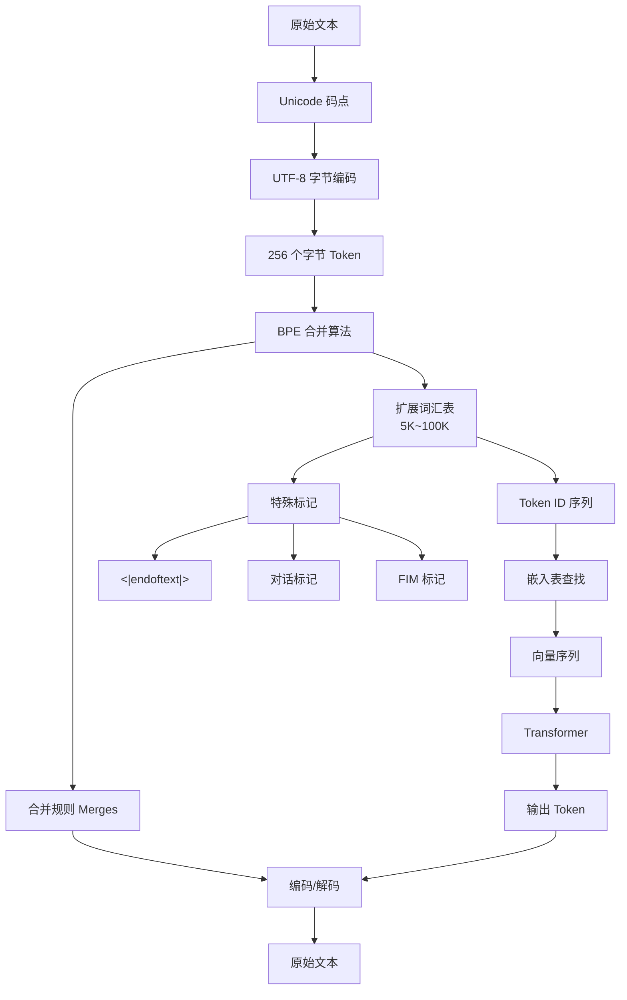

# 分词器 - 从零构建 BPE 分词器与 Tokenization 详解

## 核心概述

本笔记整理自 Andrej Karpathy 的课程 "Let's build the GPT Tokenizer"，系统地讲解了**大语言模型中分词（Tokenization）的完整工作原理**。

**为什么重要**：分词是连接原始文本与语言模型神经网络的**唯一桥梁**。词源（Token）是语言模型的基本单元——如同原子，一切皆以词源为单位运作。大语言模型看到的不是字符，而是 Token ID 序列。然而，分词也是大语言模型诸多反常表现的**根源所在**：拼写错误、非英语表现差、算术出错、Python 代码处理低效、尾部空格报错、甚至"纯金鲤鱼王"（Solid Gold Magikarp）等安全漏洞，归根结底都源于分词机制。

**解决什么问题**：
- 分词到底是什么？为什么不能直接用字符或 Unicode 码点？
- 字节对编码（BPE）算法如何从零实现？
- GPT-2、GPT-4 的分词器有何差异？
- `tiktoken` 与 `SentencePiece` 两大分词工具库各自的原理与优劣？
- 分词如何导致 LLM 的各种异常行为？如何规避？

> [!warning] 核心论点
> 分词是 LLM 中最容易被忽视却又最致命的环节。Karpathy 明确表示："分词是我用大语言模型时最不喜欢的环节。"许多看起来像是神经网络结构或模型本身的问题，其实都出在分词上。分词器与大语言模型是**完全独立**的两个训练阶段，拥有各自的训练数据集。理解分词机制，是深入理解 LLM 行为的必经之路。

---

## 知识体系

### 1. 分词的基本概念

#### 1.1 什么是分词

在 [[07_从零构建GPT - Transformer架构详解/从零构建GPT - Transformer架构详解|从零构建 GPT]] 中，我们已经做过最简单的分词：将莎士比亚文本中的 65 种字符组成词汇表，每个字符对应一个整数标记。这是**字符级分词**（Character-level Tokenization）。

但实际中，主流语言模型采用更复杂的**子词级分词**（Subword Tokenization），通过算法生成字符块作为词源。最主流的算法是**字节对编码**（Byte Pair Encoding, BPE）。

```
原始文本 ──→ [分词器] ──→ Token ID 序列 ──→ [嵌入表] ──→ 向量序列 ──→ Transformer
    ↑                                                                       │
    └──────────────────── 生成 Token ────────────────────────────────────────┘
```

#### 1.2 分词器的独立性

> [!important] 分词器与 LLM 完全独立
> 分词器的训练是一个**独立的预处理阶段**，拥有自己的训练数据集。分词器训练完成后，产出一组**合并规则**（Merges）和**词汇表**（Vocabulary）。之后，所有 LLM 训练数据通过分词器转换为 Token 序列，原始文本即可丢弃。LLM 实际读取和训练的只是磁盘上的 Token 序列。

分词器的训练集与 LLM 的训练集**可以不同**。例如，分词器训练集中可以特意增加日语、代码等数据比例，使对应语言的 Token 合并更充分，序列更短，从而在固定上下文长度内处理更多内容。

#### 1.3 分词引发的异常行为概览

以下问题**本质上都源于分词**，而非模型架构或训练问题：

| 异常现象 | 根本原因 |
|----------|----------|
| LLM 拼写能力差 | 单个 Token 可能包含多个字符，模型看不到字符边界 |
| 非英语表现差 | 分词器训练集偏英语，非英语被拆成更多 Token |
| 简单算术出错 | 数字的 Token 分割方式任意（如 677 被拆成 6 和 77） |
| GPT-2 处理 Python 差 | 每个空格都是独立 Token，浪费上下文长度 |
| 尾部空格导致报错 | 孤立的空格 Token 偏离训练分布 |
| "Solid Gold Magikarp" 安全漏洞 | 分词训练集与模型训练集不一致导致未训练嵌入 |
| 结构化数据建议用 YAML 而非 JSON | YAML 的分词密度更高，更省 Token |

---

### 2. 文本的数字表示：从 Unicode 到 UTF-8

#### 2.1 Unicode 码点

Python 字符串是 **Unicode 码点的不可变序列**。Unicode 标准定义了约 15 万个字符，涵盖 161 种文字。使用 `ord()` 函数可查询字符的码点：

```python
ord('H')        # 104
ord('😂')       # 128518
ord('中')        # 20013
```

#### 2.2 为什么不能直接用 Unicode 码点

直接使用 Unicode 码点作为 Token 有两个严重问题：

1. **词汇表过大**：约 15 万个码点，嵌入表和输出层都会极其庞大
2. **Unicode 标准不稳定**：标准仍在持续演进（最新版 15.1，2023 年 9 月），不适合作为稳定的表示形式

#### 2.3 UTF-8 编码

Unicode 联盟定义了三种编码方式将码点转为字节流：UTF-8、UTF-16、UTF-32。

| 编码 | 特点 | 问题 |
|------|------|------|
| UTF-8 | 变长编码，每个码点 1~4 字节 | 序列较长 |
| UTF-16 | 定长 2 字节（大部分） | ASCII 字符浪费空间 |
| UTF-32 | 定长 4 字节 | 极度浪费空间 |

> [!tip] UTF-8 是最佳选择
> UTF-8 是唯一兼容 ASCII 的编码，在互联网上占据主导地位（参见 "UTF-8 Everywhere Manifesto"）。但单纯使用 UTF-8 字节意味着词汇表仅 256 个 Token，序列会极长，超出 Transformer 的上下文长度限制。

```python
# UTF-8 编码示例
text = "Hello 世界 😊"
encoded = text.encode('utf-8')
bytes_list = list(encoded)
# ASCII 字符占 1 字节，中文占 3 字节，emoji 占 4 字节
```

#### 2.4 从字节到 BPE

**核心思路**：以 UTF-8 字节为基础（256 个 Token），通过 BPE 算法**合并高频字节对**，将词汇表扩展到可调大小（如 5 万~10 万），在词汇表大小和序列长度之间取得平衡。

> [!note] 无分词（Token-free）的探索
> Karpathy 提到理想方案是直接将原始字节序列输入语言模型，无需分词。已有论文提出层次化 Transformer 结构支持原始字节输入，验证了"大规模无分词自回归序列建模是可行的"。但目前尚无足够大规模的验证，注意力机制的计算成本在超长序列下仍然过高。

---

### 3. 字节对编码（BPE）算法

#### 3.1 算法原理

BPE 的核心思想极其简单：**反复找出序列中出现频率最高的相邻符号对，将其合并为一个新符号，加入词汇表**。

以符号序列 `ABCDABCDABCD` 为例（词汇表初始为 {A, B, C, D}）：

1. 统计所有相邻对，发现 `AB` 出现最多 → 创建新符号 `Z = AB`，词汇表变为 5 个
2. 替换后序列变为 `ZCDZCDZCD`（9 个符号）
3. 再次统计，发现 `ZC` 出现最多 → 创建新符号 `Y = ZC`，词汇表变为 6 个
4. 替换后序列变为 `YDYDYD`（6 个符号）
5. 以此类推...

**每次合并的效果**：
- 序列变短
- 词汇表增大
- 压缩比提高

#### 3.2 从零实现：统计函数

```python
def get_stats(ids):
    """统计序列中所有相邻对的出现次数"""
    counts = {}
    for pair in zip(ids, ids[1:]):
        counts[pair] = counts.get(pair, 0) + 1
    return counts
```

#### 3.3 从零实现：合并函数

```python
def merge(ids, pair, idx):
    """将序列中所有指定的相邻对替换为新 ID"""
    newids = []
    i = 0
    while i < len(ids):
        # 检查是否到达末尾，且当前对是否匹配
        if i < len(ids) - 1 and ids[i] == pair[0] and ids[i+1] == pair[1]:
            newids.append(idx)
            i += 2  # 跳过已合并的两个元素
        else:
            newids.append(ids[i])
            i += 1
    return newids
```

#### 3.4 训练分词器

```python
# 1. 将文本编码为 UTF-8 字节序列
text = "一段用于训练分词器的文本..."
tokens = list(text.encode('utf-8'))

# 2. 设定最终词汇表大小
vocab_size = 276  # 256 个原始字节 + 20 次合并
num_merges = vocab_size - 256

# 3. 记录合并规则
merges = {}  # (int, int) -> int
for i in range(num_merges):
    stats = get_stats(tokens)
    # 找出出现频率最高的对
    pair = max(stats, key=stats.get)
    idx = 256 + i
    # 执行合并
    tokens = merge(tokens, pair, idx)
    merges[pair] = idx

# 结果：原始 616 字节 → 合并后约 596 个 Token
# 压缩比 ≈ 1.27
```

> [!important] 合并规则构成"森林"而非"树"
> 合并操作构建的是一个**二叉结构网络**——更像一片森林而非单一树。因为新生成的 Token（如 256）可以继续参与后续合并（如 256 + 259 → 275），形成层级结构。原始的 256 个字节是叶节点。

#### 3.5 压缩比

```python
compression_ratio = len(original_text.encode('utf-8')) / len(tokens)
# 20 次合并后约 1.27
# 词汇表越大，压缩比越高
```

---

### 4. 编码与解码

#### 4.1 构建词汇表

训练完成后，需要从合并规则构建完整的词汇表（ID → 字节映射）：

```python
vocab = {idx: bytes([idx]) for idx in range(256)}
for (p0, p1), idx in merges.items():
    vocab[idx] = vocab[p0] + vocab[p1]  # 字节拼接
```

#### 4.2 解码（Token → 文本）

```python
def decode(ids):
    """将 Token ID 序列解码为字符串"""
    tokens = b"".join(vocab[idx] for idx in ids)
    text = tokens.decode('utf-8', errors='replace')
    return text
```

> [!warning] 解码的陷阱：无效 UTF-8
> 不是所有 Token 序列都是有效的 UTF-8 字节流。例如字节 `0x80`（128）的 UTF-8 解码会失败（无效起始字节）。必须使用 `errors='replace'` 而非默认的 `errors='strict'`，否则会抛出异常。当模型输出中出现 `�`（替换字符）时，说明输出了无效的 Token 序列。

#### 4.3 编码（文本 → Token）

```python
def encode(text):
    """将字符串编码为 Token ID 序列"""
    tokens = list(text.encode('utf-8'))
    while len(tokens) >= 2:
        stats = get_stats(tokens)
        # 找出在合并规则中索引最小的对（优先执行早期合并）
        pair = min(stats, key=lambda p: merges.get(p, float('inf')))
        if pair not in merges:
            break  # 没有更多可合并的对
        idx = merges[pair]
        tokens = merge(tokens, pair, idx)
    return tokens
```

> [!note] 编码的关键细节
> 编码时必须**按合并规则的顺序**执行——先执行早期合并（索引小的），再执行后期合并。这是因为后期合并依赖于前期合并产生的 Token。使用 `min()` 函数配合 `merges.get(p, float('inf'))` 来找到可合并且索引最小的对。

> [!tip] 编码与解码的不对称性
> `decode(encode(text)) == text` 对训练集和一般文本成立。但反向不成立：`encode(decode(ids)) == ids` **不一定成立**，因为并非所有 Token 序列都是有效的 UTF-8。

---

### 5. GPT-2 的分词器

#### 5.1 预分词：正则表达式分割

GPT-2 并非直接在整段文本上运行 BPE，而是先用正则表达式将文本切分为多个**片段**，每个片段独立进行 BPE 合并，最后拼接结果。这样可以防止某些不应合并的部分被合并。

GPT-2 使用的正则表达式模式（`encoder.py`）：

```python
import regex as re  # 使用 regex 库而非标准 re，支持 Unicode 属性

pattern = re.compile(
    r"""'s|'t|'re|'ve|'m|'ll|'d| ?\p{L}+| ?\p{N}+| ?[^\s\p{L}\p{N}]+|\s+(?!\S)|\s+"""
)
```

**各部分含义**：

| 模式 | 匹配内容 | 目的 |
|------|----------|------|
| `'s\|'t\|'re\|'ve\|'m\|'ll\|'d` | 英文缩写 | 防止缩写被拆分 |
| ` ?\p{L}+` | 可选空格 + 字母序列 | 字母作为整体 |
| ` ?\p{N}+` | 可选空格 + 数字序列 | 数字作为整体 |
| ` ?[^\s\p{L}\p{N}]+` | 可选空格 + 非字母数字非空白 | 标点符号作为整体 |
| `\s+(?!\S)` | 连续空格（不含最后一个） | 将多余空格分离 |
| `\s+` | 剩余空白 | 捕获尾随空格 |

> [!important] 为什么用否定预查 `\s+(?!\S)`
> 这个巧妙的模式使得空格总是出现在单词开头（如 ` world` 而非 `world `）。好处是 ` world` 成为一个常见的 Token，无论前面有没有多余空格。GPT-2 分词器偏爱在字母或数字前加空格。

#### 5.2 GPT-2 encoder.py 解析

GPT-2 的分词器代码（`encoder.py`）保存了两个文件：
- `encoder.json`：ID 到字符串的映射（即词汇表）
- `vocab.bpe`：BPE 合并规则列表（即 merges）

```python
# GPT-2 词汇表组成
# 256 个原始字节 Token
# + 50,000 次 BPE 合并
# + 1 个特殊标记 <|endoftext|>
# = 50,257 个 Token
```

> [!note] 字节编码器/解码器
> GPT-2 的代码中还有一个"字节编码器"和"字节解码器"层，在 BPE 前后各执行一次。这实际上是一个无关紧要的实现细节——GPT-2 将 256 个字节映射到了可打印 Unicode 字符范围，以方便处理。算法本质与我们实现的 BPE 完全一致。

#### 5.3 GPT-2 分词器的问题

- **Python 空格**：每个空格都是独立的 Token（ID 220），导致 Python 代码的 Token 数量暴增
- **大小写不一致**：缩写 `'s` 的处理因大小写而异（没有使用 `re.IGNORECASE`）
- **训练代码未公开**：只发布了推理代码，不清楚 OpenAI 如何训练分词器

---

### 6. tiktoken 库

#### 6.1 概述

`tiktoken` 是 OpenAI 官方推出的分词工具库，用 Rust 编写以保证效率。它**仅提供推理代码**，不包含训练功能。

```python
import tiktoken

# GPT-2 分词器
enc = tiktoken.get_encoding('gpt2')
# GPT-4 分词器（cl100k_base）
enc = tiktoken.get_encoding('cl100k_base')

tokens = enc.encode("Hello, world!")
text = enc.decode(tokens)
```

#### 6.2 GPT-4 分词器的改进

GPT-4 的分词器（`cl100k_base`）相比 GPT-2 有以下重大改进：

| 改进项 | GPT-2 | GPT-4 |
|--------|-------|-------|
| 词汇表大小 | ~50K | ~100K |
| 大小写处理 | 不一致 | 使用 `re.IGNORECASE` 统一处理 |
| 数字分割 | 任意 | 最多合并 3 位数字 |
| Python 空格 | 每个空格独立 | 多个空格合并为一个 Token |
| 特殊标记 | 仅 `<\|endoftext\|>` | 新增 FIM 标记等 |

> [!example] Python 空格优化的影响
> GPT-2 中，4 个空格是 4 个 Token（各为 ID 220）。GPT-4 中，4 个连续空格合并为 1 个 Token。这使得 Python 代码的信息密度大幅提升——从 GPT-2 到 GPT-4，Python 编程能力的提升不仅归因于模型本身，分词器的改进也功不可没。

#### 6.3 GPT-4 的正则表达式变化

```python
# GPT-4 模式（简化版）
# 主要变化：
# 1. 添加 re.IGNORECASE（I 标志）处理大小写
# 2. 数字最多匹配 1~3 位：\p{N}{1,3}
# 3. 空格处理方式调整
```

---

### 7. SentencePiece 库

#### 7.1 概述

`SentencePiece` 是 Google 开源的分词工具，被 **LLaMA、Mistral** 等模型广泛使用。与 `tiktoken` 不同，它**同时支持训练和推理**。

#### 7.2 与 tiktoken 的核心区别

| 特性 | tiktoken | SentencePiece |
|------|----------|---------------|
| BPE 执行层面 | 字节层面 | Unicode 码点层面 |
| 罕见字符处理 | 天然支持（字节覆盖一切） | 字节回退（byte fallback） |
| 训练功能 | 无 | 有 |
| 空格表示 | 保留在 Token 中 | 转换为特殊字符（▁，U+2581） |
| 特殊标记 | 灵活添加 | 必须有 UNK Token |

> [!important] BPE 层面的根本差异
> - **tiktoken**：先将文本用 UTF-8 编码为字节，然后在**字节层面**执行 BPE 合并。所有字符天然可表示，无需特殊处理。
> - **SentencePiece**：直接在 **Unicode 码点层面**执行 BPE。对于训练中未见的罕见码点（由字符覆盖率参数控制），使用**字节回退**（byte fallback）——将罕见字符用 UTF-8 编码为字节，每个字节对应一个特殊字节标记。

#### 7.3 SentencePiece 的配置

SentencePiece 有大量配置选项，Karpathy 认为其中不少是"历史包袱"：

```python
import sentencepiece as spm

spm.SentencePieceTrainer.train(
    input='toy.txt',
    model_prefix='tok400',
    vocab_size=400,
    model_type='bpe',          # 使用 BPE 算法
    normalization_rule_name='identity',  # 不做归一化（保持原始数据）
    byte_fallback=True,        # 启用字节回退（LLaMA 启用此项）
    add_dummy_prefix=True,     # 添加虚拟前缀空格
    # ... 大量其他选项
)
```

#### 7.4 关键配置项

**字节回退（byte_fallback）**：
- 启用时：罕见字符回退到 UTF-8 字节表示
- 禁用时：罕见字符映射为 UNK Token（ID 0），语言模型无法有效处理
- **LLaMA 2 启用了字节回退**（推荐做法）

**添加虚拟前缀（add_dummy_prefix）**：
- 在文本开头添加一个虚拟空格
- 使句首单词与句中单词被同等对待（都视为前面有空格）
- 解决了 `tiktoken` 中句首词和句中词 Token ID 不同的问题
- **LLaMA 2 启用了此选项**

**数字拆分（split_digits）**：
- 将所有数字逐位拆分
- LLaMA 2 启用此项，以提升算术能力

> [!warning] SentencePiece 的风险
> Karpathy 认为 SentencePiece 有不少"历史包袱"和潜在风险：
> - 引入了"句子"概念（max_sentence_length 等），在 LLM 语境中意义不大
> - UNK Token 必须存在
> - 配置参数繁多，容易设置不当
> - 文档不完善
> - 建议照搬 Meta 的 LLaMA 2 配置，或花大量时间仔细研究所有参数

---

### 8. 特殊标记（Special Tokens）

#### 8.1 文本结束标记

```python
# GPT-2
<|endoftext|>  # ID: 50256（最后一个 Token）

# 用于在训练集中分隔文档
# 告诉模型：之前的内容与之后的内容不相关
```

特殊标记**不经过 BPE 合并**，有专门的代码处理。当分词器在文本中识别到特殊标记字符串时，直接替换为对应的 Token ID。

#### 8.2 对话标记

在微调为 ChatGPT 等对话模型时，需要添加大量特殊标记来维护对话结构：

```
<|im_start|>user
用户消息<|im_end|>
<|im_start|>assistant
助手回复<|im_end|>
```

#### 8.3 GPT-4 的 FIM 标记

GPT-4 新增了 **FIM（Fill-In-the-Middle）** 标记：

```
<|fim_prefix|>
<|fim_middle|>
<|fim_suffix|>
```

FIM 允许模型在代码中间填充内容，用于代码补全场景。

#### 8.4 添加特殊标记的模型调整

添加新特殊标记时，需要调整 Transformer 的两处：

1. **嵌入表（Embedding Table）**：增加一行，用随机值初始化
2. **输出投影层（LM Head）**：增加一列，用于预测新 Token 的概率

```python
# 伪代码
model.token_embedding.weight = torch.cat([
    model.token_embedding.weight,
    torch.randn(num_new_tokens, embed_dim) * 0.01  # 随机初始化
])
model.lm_head.weight = torch.cat([
    model.lm_head.weight,
    torch.randn(num_new_tokens, embed_dim) * 0.01
])
```

> [!tip] 常见做法
> 添加新特殊标记时，通常**冻结基础模型**，只训练新 Token 的参数。这是一种参数高效的微调方式。

---

### 9. 词汇表大小的权衡

#### 9.1 词汇表大小的影响

词汇表大小是一个**经验性超参数**，目前 SOTA 模型通常在 1 万~10 万之间：

| 模型 | 词汇表大小 |
|------|-----------|
| GPT-2 | ~50K |
| GPT-4 | ~100K |
| LLaMA 2 | 32K |

**增大词汇表的好处**：
- 序列变短，上下文窗口能覆盖更多文本
- 信息密度更高

**增大词汇表的坏处**：
- 嵌入表变大（参数更多）
- 输出层 LM Head 计算量增大（Softmax over vocab）
- 每个 Token 的训练样本减少，嵌入可能训练不充分
- 过大的文本块被压缩为一个 Token，Transformer 前向传播处理不充分

#### 9.2 词汇表大小在模型架构中的位置

词汇表大小在 GPT 模型中只出现在**两个地方**：

1. **Token 嵌入表**：`nn.Embedding(vocab_size, embed_dim)` — 行数为 vocab_size
2. **LM Head**：`nn.Linear(embed_dim, vocab_size)` — 输出维度为 vocab_size

#### 9.3 摘要标记（Summary Tokens）

一种利用新 Token **压缩长提示**的技术：

> [!abstract] 摘要标记的核心思路
> 1. 在序列中插入几个新 Token
> 2. 冻结模型主体，只训练这些新 Token 的嵌入表示
> 3. 通过蒸馏训练，使模型在使用这些 Token 时的行为与使用完整长提示时一致
> 4. 测试时，用这几个 Token 替换原来的长提示
>
> 本质上是一种将长提示压缩为少量摘要 Token 的技术。

---

### 10. 分词导致的异常行为深度分析

#### 10.1 LLM 拼写能力差

**现象**：询问 GPT-4 "default style 中有多少个字母 L"，模型回答错误（说有 3 个，实际 4 个）。

**原因**：`default style` 在 GPT-4 的词汇表中是**一个单独的 Token**。模型从未"看到"其中的字符，它只看到了一个整数 ID。单个 Token 中塞入了太多字符信息。

**验证方法**：让模型先逐个列出字符（用空格分隔），再进行计数或反转——此时每个字符变成独立 Token，模型就能正确处理。

#### 10.2 非英语语言表现差

**原因**（双重）：
1. **模型训练数据**中英文远超其他语言
2. **分词器训练数据**同样偏英语

**量化影响**：
- 英文 "Hello, how are you" ≈ 5 个 Token
- 翻译成韩语后 ≈ 15 个 Token（3 倍）
- 韩语问候语 "안녕하세요" 被拆成 3 个 Token，而英文 "Hello" 只需 1 个

所有非英文文本在 Token 空间中被"拉长"，占用更多上下文长度。

#### 10.3 简单算术出错

**原因**：数字的 Token 分割方式完全**任意**：

- `127` → 1 个 Token
- `677` → 2 个 Token（`6` + `77`）
- 四位数的分割更混乱：可能是 1+3、2+2、3+1 等

**解决方案**：LLaMA 2 的 SentencePiece 分词器启用了 `split_digits`，将所有数字逐位拆分，显著提升了算术能力。

#### 10.4 GPT-2 处理 Python 代码差

**原因**：GPT-2 分词器将每个空格视为独立 Token（ID 220）。Python 大量使用空格缩进，导致 Token 数量暴增，上下文长度被迅速消耗。

**GPT-4 的修复**：将连续空格合并为单个 Token（如 4 个空格 → 1 个 Token）。

#### 10.5 尾部空格问题

**现象**：在 Playground 中使用 GPT-3.5-turbo-instruct 时，在提示末尾加一个空格会收到警告："文本以训练空格结尾，会导致性能下降"。

**原因**：

```
正常情况: "冰淇淋店的标语" → 模型可能采样到 " O"（空格O）Token
异常情况: "冰淇淋店的标语 " → 末尾空格成为孤立的 Token 220
```

空格在正常 Token 中总是作为单词的前缀出现（如 ` world`）。孤立的空格 Token 偏离了训练分布，模型不知道如何继续生成。

> [!danger] 部分标记（Partial Token）问题
> 当输入只包含某个 Token 的首字符时（如输入 `default styl` 而非完整的 `default style`），模型会"大脑宕机"——直接预测文本结束符或报错。这是因为模型从未在训练数据中见过这种部分 Token 的组合。在 `tiktoken` 的 Rust 源码中，有大量专门处理 "unstable tokens" 的代码，但没有任何文档说明。

#### 10.6 纯金鲤鱼王（Solid Gold Magikarp）

> [!danger] 严重安全漏洞
> 这是分词导致的最诡异且最危险的问题。

**现象**：在 GPT-2 的嵌入空间中聚类分析发现，某些 Token（如 `solidgoldmagikarp`、` StreamerBot`、` favorite` 等）形成一个异常聚类。当让模型处理这些 Token 时，模型会出现各种异常行为：回避问题、胡言乱语、甚至辱骂用户、违背安全对齐。

**根本原因**：

```
分词器训练数据 ≠ 模型训练数据

1. 分词器训练阶段: "SolidGoldMagikarp" 是一位活跃用户名
   → 在分词器训练集中频繁出现
   → 被合并为一个 Token，加入词汇表

2. 模型训练阶段: 该用户名在模型训练数据中几乎不存在
   → 该 Token 的嵌入向量从未被激活
   → 从未被前向/反向传播更新
   → 保持随机初始化状态

3. 推理阶段: 攻击者输入该 Token
   → 从嵌入表中抽取一行完全未训练的随机向量
   → 输入 Transformer
   → 产生不可预测的行为
```

> [!quote] Karpathy 的类比
> "这就像 C 语言程序中未分配的内存——你调用了一个从未初始化的指针，得到的是完全不确定的行为。"

**教训**：分词训练集与模型训练集的不一致，会导致词汇表中存在"幽灵 Token"——存在于词汇表中但从未被训练过的嵌入向量。这是一个严重的 AI 安全风险。

#### 10.7 结构化数据的分词效率

不同数据格式在分词效率上差异显著：

```
相同内容:
  JSON: 116 个 Token
  YAML:  99 个 Token  (节省约 15%)
```

> [!tip] 实践建议
> 在按 Token 计费的体系中，选择分词密度更高的格式可以节省成本。YAML 比 JSON 在分词效率上更优。始终关注不同格式和设置下的 Token 效率。

---

### 11. 多模态分词的前沿趋势

> [!abstract] 统一架构的共识
> 在处理图像、视频、音频等多模态输入时，业界正在达成的共识是：**不需要改变 Transformer 架构**，只需对输入内容进行分词处理，将其当作普通文本标记来处理。

**关键方法**：
- 将图像编码为整数标记（可以是离散的硬标记，也可以是连续的软标记）
- 通过类似自编码器的瓶颈层进行表征压缩
- OpenAI 的 Sora 使用视觉块（Visual Patches）作为处理单位
- 视频可以被编码为基于自身词汇表的基本单元
- 离散标记用自回归模型处理，连续标记用扩散模型处理

---

### 12. 最佳实践与建议

> [!summary] Karpathy 的最终建议
> 1. **如果可以复用 GPT-4 的词汇表**，就直接使用 `tiktoken`——它是高效的 BPE 推理库
> 2. **如果需要从头构建词表**，使用 `SentencePiece` 的 BPE 方法，但需谨慎配置：
>    - 照搬 Meta LLaMA 2 的配置
>    - 或花大量时间仔细研究所有参数
>    - 启用 `byte_fallback` 和 `add_dummy_prefix`
> 3. **关注分词密度**：投入时间研究 Tokenizer 可视化工具，评估不同格式下的 Token 效率
> 4. **理解分词的安全风险**：幽灵 Token、部分 Token 等问题不容忽视
> 5. **理想方案**：`tiktoken` 的训练代码（目前不存在），用字节级 BPE 训练自己的词汇表

#### 分词器选择决策树

```
是否可以使用 GPT-4 词汇表？
├── 是 → 使用 tiktoken (cl100k_base)
│        优点：高效、字节级 BPE、OpenAI 维护
│
└── 否 → 是否需要从头训练？
    ├── 是 → 使用 SentencePiece (BPE 模式)
    │        注意：照搬 LLaMA 2 配置
    │        启用 byte_fallback + add_dummy_prefix + split_digits
    │
    └── 否 → 使用 minbpe（Karpathy 的教学实现）
              优点：代码清晰易懂
              缺点：Python 实现，效率较低
```

---

## 知识脉络图



---

## 与其他笔记的关联

- [[07_从零构建GPT - Transformer架构详解/从零构建GPT - Transformer架构详解|从零构建 GPT]] — 本课是 "Let's build GPT" 的后续，深入讲解了 GPT 中简略带过的分词部分
- [[08_GPT的现状 - 训练流程与应用实践/GPT的现状 - 训练流程与应用实践|GPT 的现状]] — 训练流水线中预训练阶段需要将全部数据通过分词器转为 Token 序列
- [[02_makemore - 字符级语言模型与二元语法模型/makemore - 字符级语言模型与二元语法模型|makemore 字符级语言模型]] — 字符级分词是最简单的分词方式
- [[04_makemore - 激活函数与梯度及批量归一化/makemore - 激活函数与梯度及批量归一化|激活函数与梯度]] — 词汇表大小影响嵌入表参数量和梯度训练

---

## 关键术语对照表

| 英文术语 | 中文翻译 | 说明 |
|----------|----------|------|
| Tokenization | 分词 | 将文本转换为 Token 序列 |
| Token | 词源 / 标记 | 语言模型的基本单元 |
| BPE (Byte Pair Encoding) | 字节对编码 | 最主流的分词算法 |
| Vocabulary | 词汇表 | 所有 Token 的集合 |
| Merges | 合并规则 | BPE 训练产出的合并操作列表 |
| tiktoken | — | OpenAI 官方分词推理库 |
| SentencePiece | — | Google 开源分词训练/推理库 |
| Byte Fallback | 字节回退 | SentencePiece 处理罕见字符的机制 |
| Special Tokens | 特殊标记 | 不经过 BPE 的特殊 Token |
| FIM (Fill-In-the-Middle) | 中间填充 | 代码补全场景的特殊标记 |
| Compression Ratio | 压缩比 | 原始字节数 / Token 数 |
| Solid Gold Magikarp | 纯金鲤鱼王 | 未训练嵌入导致的安全漏洞 |
| Unstable Tokens | 不稳定标记 | 部分标记导致的异常行为 |
