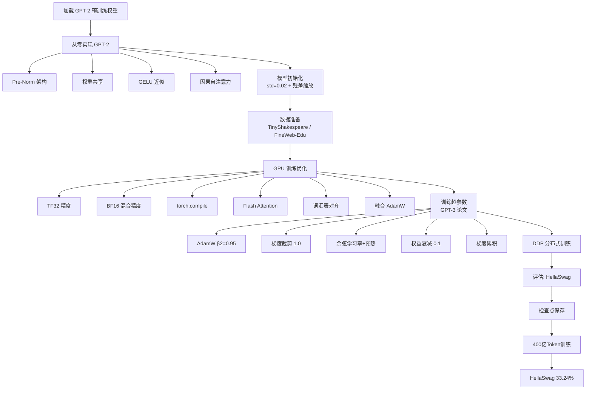

# 复现 GPT-2 - 从零训练 1.24 亿参数模型

## 核心概述

本笔记整理自 Andrej Karpathy 的课程 "Let's reproduce GPT-2 (124M)"，系统性地展示了**如何用 PyTorch 从零复现 OpenAI 的 GPT-2 124M 模型**，并进行完整的预训练。

**为什么重要**：这是从"理解 Transformer 架构"到"实际训练工业级语言模型"的关键一步。课程不仅复现了模型代码（~100 行 vs HuggingFace 的 2000 行），更深入讲解了**GPU 硬件优化**（TF32、BF16、torch.compile、Flash Attention）、**训练超参数配置**（参照 GPT-3 论文）、**分布式训练**（DDP）、以及**模型评估**（HellaSwag）的完整工程实践。如今在云服务器上花约 10 美元、等待约 1 小时，即可得到媲美 OpenAI 原版的模型。

**解决什么问题**：
- 如何用不到 100 行 PyTorch 代码实现 GPT-2？
- 如何从 HuggingFace 加载预训练权重验证实现的正确性？
- 如何充分榨干 GPU 性能（从 1000ms/step 优化到 93ms/step）？
- GPT-3 论文中的超参数如何映射到实际训练代码？
- 梯度累积、分布式数据并行（DDP）的原理与实现细节？
- 如何使用 HellaSwag 评估语言模型质量？

> [!abstract] 核心成果
> 经过约 8 小时通宵训练（8×A100 80GB GPU，FineWeb-Edu 数据集，400 亿 Token），从零训练的 GPT-2 124M 在 HellaSwag 上达到 **33.24%** 准确率，接近 GPT-3 124M（用 3000 亿 Token 训练）的水平。仅用 400 亿 Token（GPT-3 的 1/7.5）就接近了 GPT-3 的表现，这得益于 FineWeb-Edu 更高的数据质量。

---

## 知识体系

### 1. GPT-2 模型概览

#### 1.1 模型规模

GPT-2 系列包含四个不同规模的版本：

| 版本 | 参数量 | 层数 | 维度 | 头数 |
|------|--------|------|------|------|
| GPT-2 (small) | 124M | 12 | 768 | 12 |
| GPT-2 (medium) | 355M | 24 | 1024 | 16 |
| GPT-2 (large) | 774M | 36 | 1280 | 20 |
| GPT-2 (xl) | 1558M | 48 | 1600 | 25 |

> [!note] 参数量表格有误
> GPT-2 论文中的参数量表格存在错误（OpenAI 在 GitHub 页面上已确认）。124M 是正确的参数量。

#### 1.2 GPT-2 vs 原始 Transformer 的区别

GPT-2 基于 "Attention is All You Need" 的原始 Transformer，但做了以下关键修改：

1. **仅解码器架构**：去掉了编码器和交叉注意力，只保留解码器
2. **预归一化（Pre-Norm）**：LayerNorm 从子层之后移到之前
3. **最终归一化层**：在分类器前新增一层 LayerNorm
4. **可学习的位置嵌入**：不再使用固定的正弦/余弦编码，改为可训练参数

> [!important] Pre-Norm vs Post-Norm
> GPT-2 采用 **Pre-Norm** 结构：LayerNorm 在注意力/MLP 之前执行。这样残差路径是干净的——从输入到输出有一条无阻碍的梯度通路。而原始 Transformer 的 Post-Norm 将 LayerNorm 放在残差路径内部，梯度传播会受到阻碍。
>
> Pre-Norm 的残差路径形式：`x + Sublayer(LayerNorm(x))`，梯度可以沿残差路径原样传达到输入。

#### 1.3 位置嵌入的自然涌现

> [!tip] 位置嵌入学到了正弦波
> GPT-2 使用可训练的位置嵌入表（而非原始 Transformer 的固定正弦编码）。有趣的是，训练过程中位置嵌入**自然浮现出类似正弦波的模式**。查看单个通道在位置 0~1023 上的响应，可以看到不同通道对不同位置区间有不同程度的激活——这与原始 Transformer 论文中手工设计的正弦/余弦编码惊人地相似。

---

### 2. 从零实现 GPT-2

#### 2.1 模型结构

```python
class GPT(nn.Module):
    def __init__(self, config):
        super().__init__()
        self.config = config

        self.transformer = nn.ModuleDict(dict(
            wte = nn.Embedding(config.vocab_size, config.n_embd),      # 词嵌入
            wpe = nn.Embedding(config.block_size, config.n_embd),      # 位置嵌入
            h = nn.ModuleList([Block(config) for _ in range(config.n_layer)]),
            ln_f = nn.LayerNorm(config.n_embd),                        # 最终归一化
        ))
        self.lm_head = nn.Linear(config.n_embd, config.vocab_size, bias=False)  # 分类器

        # 权重共享：词嵌入与 LM Head 共用同一权重
        self.transformer.wte.weight = self.lm_head.weight
```

#### 2.2 GPT-2 124M 配置

```python
@dataclass
class GPTConfig:
    block_size: int = 1024      # 最大序列长度
    vocab_size: int = 50257     # GPT-2 词汇表（256 字节 + 50000 BPE 合并 + 1 特殊标记）
    n_layer: int = 12           # Transformer 层数
    n_head: int = 12            # 注意力头数
    n_embd: int = 768           # 嵌入维度
```

#### 2.3 Transformer Block（Pre-Norm）

```python
class Block(nn.Module):
    def __init__(self, config):
        super().__init__()
        self.ln_1 = nn.LayerNorm(config.n_embd)
        self.attn = CausalSelfAttention(config)
        self.ln_2 = nn.LayerNorm(config.n_embd)
        self.mlp = MLP(config)

    def forward(self, x):
        # Pre-Norm: LayerNorm 在子层之前
        x = x + self.attn(self.ln_1(x))   # 残差 + 注意力
        x = x + self.mlp(self.ln_2(x))     # 残差 + MLP
        return x
```

> [!important] 注意力 vs MLP 的分工
> - **注意力机制**是一种**通信/聚合操作**：所有 Token 在此交换信息，是一种加权和/池化函数
> - **MLP（前馈网络）**是**独立处理**：每个 Token 单独计算，Token 之间不交换信息
> - Transformer 本质上是这两者的交替应用：通信 → 独立处理 → 通信 → 独立处理...

#### 2.4 GELU 激活函数

GPT-2 使用 GELU 的**近似版本**（tanh 近似）：

```python
# GELU 近似公式
# 0.5 * x * (1 + tanh(sqrt(2/π) * (x + 0.044715 * x³)))

# PyTorch 中使用近似版本
nn.GELU(approximate='tanh')
```

> [!note] 为什么用近似版本
> 近似版本源于历史原因：Daniel Hendrycks 在开发 GELU 时，精确版本在 TensorFlow 中计算速度较慢，因此开发了 tanh 近似版本。BERT 和 GPT-2 采用了这个近似版本。如今两者速度差异已不大，没有充分理由使用近似版，但为了精确复现 GPT-2，仍需使用它。现代模型（如 LLaMA 3）已演进为 SwiGLU 等变体。

> [!tip] GELU vs ReLU
> GELU 类似于 ReLU，但在零点处没有完全平坦的部分，其他部分比 ReLU 稍微平滑。这解决了 ReLU 神经元"死亡"问题——ReLU 在饱和区输出为零时梯度完全消失，而 GELU 始终提供局部梯度。

#### 2.5 因果自注意力

```python
class CausalSelfAttention(nn.Module):
    def __init__(self, config):
        super().__init__()
        assert config.n_embd % config.n_head == 0
        # QKV 投影（合并为一个矩阵提高效率）
        self.c_attn = nn.Linear(config.n_embd, 3 * config.n_embd)
        # 输出投影
        self.c_proj = nn.Linear(config.n_embd, config.n_embd)
        self.n_head = config.n_head
        self.n_embd = config.n_embd
        # 因果掩码（注册为 buffer，不参与梯度计算）
        self.register_buffer("bias",
            torch.tril(torch.ones(config.block_size, config.block_size))
            .view(1, 1, config.block_size, config.block_size))

    def forward(self, x):
        B, T, C = x.size()
        q, k, v = self.c_attn(x).split(self.n_embd, dim=2)
        # 重排为 (B, n_head, T, head_dim)
        k = k.view(B, T, self.n_head, C // self.n_head).transpose(1, 2)
        q = q.view(B, T, self.n_head, C // self.n_head).transpose(1, 2)
        v = v.view(B, T, self.n_head, C // self.n_head).transpose(1, 2)
        # 注意力计算
        att = (q @ k.transpose(-2, -1)) * (1.0 / math.sqrt(k.size(-1)))
        att = att.masked_fill(self.bias[:, :, :T, :T] == 0, float('-inf'))
        att = F.softmax(att, dim=-1)
        y = att @ v
        # 重组 + 输出投影
        y = y.transpose(1, 2).contiguous().view(B, T, C)
        y = self.c_proj(y)
        return y
```

> [!note] 后续优化：Flash Attention
> 上述四行注意力代码可用 PyTorch 的 `F.scaled_dot_product_attention` 替换，自动调用 Flash Attention，无需手动构建注意力矩阵。

#### 2.6 权重共享（Weight Tying）

GPT-2 将**词嵌入矩阵**（WTE）和 **LM Head**（输出分类器）共享同一个权重矩阵：

```python
# 词嵌入: vocab_size × n_embd = 50257 × 768 ≈ 4000 万参数
# 占模型总参数（1.24 亿）的约 30%

self.transformer.wte.weight = self.lm_head.weight
```

**好处**：
1. **节省约 30% 参数**：不需要单独训练 LM Head
2. **归纳偏置**：语义相近的 Token 在嵌入空间和输出空间中应有相似表示
3. **训练效率更高**：参数更少，训练更充分

> [!quote] 权重共享的理论基础
> 来自 "Attention is All You Need" 论文及 Press & Wolf (2017) 的研究：如果两个词语义相近，它们的嵌入向量应该相近，在 Transformer 输出中得到的概率也应相近。因此输入嵌入和输出嵌入共享权重在语义上是一致的。

#### 2.7 从 HuggingFace 加载预训练权重

```python
@classmethod
def from_pretrained(cls, model_type):
    """从 HuggingFace 加载 GPT-2 预训练权重"""
    from transformers import GPT2LMHeadModel
    # 加载 HuggingFace 模型
    model_hf = GPT2LMHeadModel.from_pretrained(model_type)
    # 创建我们的 GPT 模型
    config = cls.get_default_config()
    model = GPT(config)
    # 复制权重
    sd_hf = model_hf.state_dict()
    sd = model.state_dict()
    # 忽略某些 buffer（如 attention bias，我们用自己的因果掩码）
    blacklist = ['transformer.wte.weight', 'lm_head.weight',  # 权重共享，只复制一次
                 'transformer.h.0.attn.bias']  # 因果掩码
    for k, v in sd_hf.items():
        if k not in sd or k in blacklist:
            continue
        # 某些权重需要转置（TensorFlow → PyTorch 格式差异）
        if '.c_attn.weight' in k or '.c_proj.weight' in k:
            v = v.t()  # 转置
        sd[k].copy_(v)
    return model
```

---

### 3. 模型初始化

#### 3.1 基础初始化

```python
def _init_weights(self, module):
    if isinstance(module, nn.Linear):
        torch.nn.init.normal_(module.weight, mean=0.0, std=0.02)
        if module.bias is not None:
            torch.nn.init.zeros_(module.bias)
    elif isinstance(module, nn.Embedding):
        torch.nn.init.normal_(module.weight, mean=0.0, std=0.02)
```

> [!note] 0.02 的由来
> 标准差 0.02 与 Xavier/Glorot 初始化的合理范围一致。对于 768 维隐藏层，Xavier 初始化的标准差约为 $1/\sqrt{768} \approx 0.036$；对于 1600 维则约为 0.025。0.02 处于这些值的合理范围内。GPT-2 官方源码中硬编码了此值。

#### 3.2 残差路径缩放

```python
# 按残差层数的平方根倒数缩放投影层权重
def _init_weights(self, module):
    if isinstance(module, nn.Linear):
        std = 0.02
        if hasattr(module, 'NANOGPT_SCALE_INIT'):
            std = std * (2 * self.config.n_layer) ** -0.5
        torch.nn.init.normal_(module.weight, mean=0.0, std=std)
```

> [!important] 为什么要缩放
> 残差流的形式是 `x = x + Sublayer(x)`，每个 Block 都会向残差流中添加贡献。如果不缩放，残差流中激活值的方差会随层数线性增长（N 层后标准差约为 $\sqrt{N}$）。乘以 $1/\sqrt{2N}$（2N 是因为每层有注意力+MLP 两个子层）可以将最终标准差控制在 1 附近。

#### 3.3 初始损失验证

```python
# 词汇表大小 = 50257
# 期望初始损失 ≈ -ln(1/50257) ≈ 10.82
import math
expected_loss = -math.log(1/50257)  # ≈ 10.82
```

> [!tip] 验证初始化
> 如果初始损失远高于 10.82，说明初始化有问题——模型对某些 Token 过度偏移。良好的初始化应使所有 Token 的概率大致均匀。

---

### 4. 数据准备

#### 4.1 调试数据：TinyShakespeare

```python
# TinyShakespeare: ~1MB 纯 ASCII 文本
# 约 100 万字符，GPT-2 压缩比约 3:1
# 1000 字符 ≈ 300 Token
text = open('input.txt', 'r').read()
tokens = enc.encode(text)  # GPT-2 分词器编码
```

#### 4.2 生产数据：FineWeb-Edu

FineWeb-Edu 是 HuggingFace 发布的高质量教育类数据集：

| 数据集 | Token 数 | 特点 |
|--------|----------|------|
| FineWeb | 15 万亿 | 从 CommonCrawl 筛选的高质量数据 |
| FineWeb-Edu (普通) | 1.3 万亿 | 教育类文本 |
| FineWeb-Edu (高价值) | 5.4 万亿 | 高价值教育类文本 |
| 本课使用 | 100 亿 | FineWeb-Edu 的子样本 |

**数据处理流程**：

```python
# 1. 从 HuggingFace 下载 FineWeb-Edu 数据集
# 2. 用 GPT-2 分词器对所有文档分词
# 3. 每个文档前插入 <|endoftext|> 标记（ID: 50256）
# 4. 保存为 uint16 格式的 NumPy 数组分片
# 5. 每个分片 1 亿 Token，共 100 个分片
# 6. 第一个分片为验证集，其余为训练集
```

> [!note] 为什么用 uint16
> GPT-2 的最大 Token ID 为 50256，远低于 uint16 的上限 65535。使用 uint16 而非默认的 int32/int64 可节省一半存储空间。

> [!tip] 数据质量的重要性
> GPT-2 原始训练数据为 WebText（未公开），质量可能不如现代数据集。FineWeb-Edu 使用 LLaMA-3 70B 自动筛选有教育价值的内容，每个 Token 的质量更高。这解释了为何仅用 400 亿 Token 就能接近 GPT-3 124M（3000 亿 Token）的表现。

#### 4.3 数据加载器

```python
class DataLoaderLite:
    def __init__(self, B, T, split, process_rank=0, num_processes=1):
        self.B = B  # 批次大小
        self.T = T  # 序列长度
        self.process_rank = process_rank      # DDP 进程编号
        self.num_processes = num_processes    # DDP 进程总数

    def next_batch(self):
        buf = self.tokens[self.current_pos : self.current_pos + self.B*self.T + 1]
        x = buf[:-1].view(self.B, self.T)  # 输入
        y = buf[1:].view(self.B, self.T)   # 目标（偏移一位）
        # 推进位置（多进程时需乘以进程数）
        self.current_pos += self.B * self.T * self.num_processes
        # 循环处理
        if self.current_pos + self.B * self.T * self.num_processes > len(self.tokens):
            self.current_pos = 0  # 或加载下一个分片
        return x, y
```

> [!important] X 和 Y 的构造
> 输入 `x` 和目标 `y` 是同一序列偏移一位：`x = tokens[:-1]`，`y = tokens[1:]`。位置 i 的输入预测位置 i+1 的 Token。需要加载 `B×T+1` 个 Token（多一个用于目标）。

---

### 5. GPU 训练优化

本节是课程的核心精华，展示了如何将训练速度从 **1000ms/step 优化到 93ms/step（约 11 倍提升）**。

#### 5.1 GPU 硬件基础

```
GPU 架构（以 A100 为例）:
┌─────────────────────────────────┐
│  GPU 芯片                       │
│  ┌──────┐ ┌──────┐ ┌──────┐    │
│  │ SM 0 │ │ SM 1 │ │ ...  │    │  ← 120 个流式多处理器（SM）
│  └──────┘ └──────┘ └──────┘    │     每个含张量核心（Tensor Core）
│  ┌─────────────────────────┐   │
│  │      L2 Cache (~40MB)    │   │  ← 片上内存（极快但极小）
│  └─────────────────────────┘   │
└──────────┬──────────────────────┘
           │ 高速互联
┌──────────┴──────────────────────┐
│     HBM (~80GB, ~2TB/s)         │  ← 高带宽内存（大但相对慢）
└─────────────────────────────────┘
```

> [!important] 内存带宽是瓶颈
> 深度学习训练大多**受限于内存带宽**而非计算能力。张量核心大部分时间在空转等待数据。如果能达到 60% 的利用率已经相当不错。降低精度可同时减少计算量和内存传输量。

#### 5.2 优化一：TF32 精度

```python
# 一行代码启用 TF32
torch.set_float32_matmul_precision('high')
```

**TF32 原理**：
- FP32：1 符号位 + 8 指数位 + 23 尾数位 = 32 位
- TF32：1 符号位 + 8 指数位 + 10 尾数位 = 19 位（截断 13 位尾数）
- **指数位不变**，数值范围与 FP32 相同
- 内部指令截断尾数，PyTorch 代码无需修改
- 理论 8 倍加速，实际约 3 倍（仍受内存带宽限制）

> [!note] 张量核心
> 张量核心是 GPU 中执行 4×4 矩阵乘法的专用单元。所有矩阵乘法都被拆分为这种小矩阵乘法。A100 支持多种精度配置（FP32、TF32、BF16、FP16、INT8）。

| 精度 | 理论 FLOPS | 实际加速 |
|------|-----------|----------|
| FP32 | 19.5 TFLOPS | 基准 |
| TF32 | 156 TFLOPS | ~3x |
| BF16 | 312 TFLOPS | 更高 |
| INT8 | 624 TFLOPS | 仅推理 |

#### 5.3 优化二：BF16 混合精度

```python
# 使用 torch.autocast 实现 BF16 混合精度
with torch.autocast(device_type='cuda', dtype=torch.bfloat16):
    logits, loss = model(x, y)
```

**BF16 vs FP16**：

| 格式 | 符号位 | 指数位 | 尾数位 | 特点 |
|------|--------|--------|--------|------|
| FP32 | 1 | 8 | 23 | 基准 |
| TF32 | 1 | 8 | 10 | 内部指令截断，代码无感 |
| BF16 | 1 | 8 | 7 | 指数位不变，范围相同，精度降低 |
| FP16 | 1 | 5 | 10 | 指数位减少，范围缩小，需梯度缩放 |

> [!important] 为什么用 BF16 而非 FP16
> FP16 缩小了指数范围（数值范围），需要梯度缩放器（GradScaler）来防止溢出，增加了复杂度。BF16 保持了与 FP32 相同的指数位（数值范围不变），只截断尾数（精度降低），**不需要梯度缩放器**。BF16 仅在 Ampere 及更新架构上可用。

**混合精度策略**：
- **参数保持 FP32**：`model.weight.dtype == torch.float32`
- **激活值转为 BF16**：矩阵乘法等操作在 BF16 下执行
- **敏感操作保持 FP32**：LayerNorm、Softmax、交叉熵损失等

#### 5.4 优化三：torch.compile

```python
model = torch.compile(model)
```

**效果**：300ms → 129ms（2.3 倍加速）

**原理**：
1. **移除 Python 解释器开销**：将整个神经网络编译为单一对象
2. **算子融合（Kernel Fusion）**：将多个逐元素操作合并为一个内核

> [!example] GELU 的算子融合示例
> GELU 的计算包含多个步骤：`x³` → 乘常数 → 加 x → tanh → 乘 0.5x
>
> **不使用 torch.compile**：每个操作都是一个独立内核，数据在 GPU 芯片和 HBM 之间来回传输 5 次。
>
> **使用 torch.compile**：所有操作融合为一个内核，数据加载到芯片后一次性完成所有计算，只需一次写回。

#### 5.5 优化四：Flash Attention

```python
# 替换手动注意力计算
# 原始代码（4 行）：
att = (q @ k.transpose(-2, -1)) * (1.0 / math.sqrt(k.size(-1)))
att = att.masked_fill(self.bias[:,:,:T,:T] == 0, float('-inf'))
att = F.softmax(att, dim=-1)
y = att @ v

# 替换为一行：
y = F.scaled_dot_product_attention(q, k, v, is_causal=True)
```

**效果**：130ms → 95ms（约 27% 加速）

**Flash Attention 原理**：
- **核心**：在线 Softmax 算法，逐步计算 Softmax 而不需要预存所有输入
- **关键**：注意力矩阵（T×T）**永远不会被完整存储在 HBM 中**
- 浮点运算量反而更高，但大幅减少 HBM 读写
- 速度提升可达 7.6 倍（理论最高），因为内存访问才是真正的瓶颈

> [!note] 在线 Softmax 的历史
> 在线 Softmax 优化法最早来自 NVIDIA 2018 年的论文，比 Flash Attention 早了 4 年。NVIDIA 当时就意识到可以减少内存访问来加速 Softmax，但没有进一步发展成 Flash Attention。斯坦福团队在 2022 年将其整合为统一的 Flash Attention 内核。

#### 5.6 优化五：词汇表大小对齐

```python
# GPT-2 原始词汇表：50257（非常不规整的数字）
# 调整为 50304（能被 64、128 整除）
vocab_size = 50304  # 而非 50257
```

**效果**：96.5ms → 93ms（约 4% 加速，旧版 PyTorch 可达 30%）

**原理**：
- GPU 内核以 64 或 128 为块进行计算
- 50257 不能被 64 整除，需要额外的边界内核处理剩余部分
- 50304 可被 128 整除，所有计算完美适配块大小
- 额外的 47 个 Token 嵌入向量不会被使用（分词器只支持到 50256），网络学会将其概率归零

> [!tip] 规整数字的经验法则
> - 好数字：64、128、256、512、768、1024（2 的幂或其倍数）
> - 坏数字：13、17、25、50257（奇数或非 2 的幂）
> - 经验：尽量使用 2 的幂次方倍数

#### 5.7 优化六：融合 AdamW

```python
optimizer = torch.optim.AdamW(params, fused=True)
```

**效果**：93ms → 90ms（约 3% 加速）

**原理**：将 AdamW 的多个参数更新内核融合为一个内核，避免逐参数遍历。

#### 5.8 优化总结

| 优化 | 耗时 | 累计加速 |
|------|------|----------|
| FP32 基准 | 1000ms | 1x |
| TF32 | 300ms | 3.3x |
| BF16 混合精度 | ~290ms | 3.4x |
| torch.compile | 129ms | 7.8x |
| Flash Attention | 95ms | 10.5x |
| 词汇表对齐 | 93ms | 10.8x |
| 融合 AdamW | 90ms | 11.1x |

---

### 6. 训练超参数（参照 GPT-3 论文）

#### 6.1 优化器配置

```python
optimizer = torch.optim.AdamW(
    grouped_params,
    lr=6e-4,              # 最大学习率（GPT-3 124M 对应值）
    betas=(0.9, 0.95),    # β1=0.9, β2=0.95（非默认的 0.999）
    eps=1e-8,
    weight_decay=0.1,     # GPT-3 使用 0.1（AdamW 默认 0.01）
    fused=True            # 融合内核
)
```

> [!important] β2 = 0.95 而非 0.999
> GPT-3 论文将 AdamW 的 β2 从默认的 0.999 改为 0.95。β2 控制二阶矩（梯度平方的移动平均）的衰减率。较小的 β2 意味着对近期梯度的权重更大，在语言模型训练中效果更好。

#### 6.2 梯度裁剪

```python
# 计算梯度后，裁剪总范数
torch.nn.utils.clip_grad_norm_(model.parameters(), 1.0)
```

> [!note] 梯度裁剪的作用
> 训练中偶尔会遇到异常批次导致损失激增，进而产生过大的梯度。梯度裁剪将所有参数梯度的全局范数限制在 1.0 以内，防止模型剧烈震荡。这是一种"打补丁"式的临时解决方案，但被广泛使用。

#### 6.3 学习率调度

```python
def get_lr(step, max_lr, min_lr, warmup_steps, max_steps):
    # 1. 预热阶段：线性增长
    if step < warmup_steps:
        return max_lr * (step + 1) / warmup_steps
    # 2. 衰减阶段：余弦衰减
    if step > max_steps:
        return min_lr
    decay_ratio = (step - warmup_steps) / (max_steps - warmup_steps)
    coeff = 0.5 * (1.0 + math.cos(math.pi * decay_ratio))
    return min_lr + coeff * (max_lr - min_lr)
```

```
学习率曲线（余弦衰减 + 预热）:
    max_lr ───╮
              │╲
              │ ╲
              │  ╲
              │   ╲
    min_lr ───│────╲────────
              0  warmup  max_steps
```

- **预热**：前 3.75 亿 Token（约 715 步）线性增长到最大学习率
- **衰减**：余弦衰减到最大学习率的 10%
- GPT-3 在 2600 亿 Token 处停止衰减，之后保持 10% 学习率训练

#### 6.4 权重衰减

```python
# 只对 2D 参数（权重矩阵）进行权重衰减
# 不对 1D 参数（偏置、LayerNorm 参数）衰减
decay_params = [p for n, p in param_dict.items() if p.dim() >= 2]
nodecay_params = [p for n, p in param_dict.items() if p.dim() < 2]

optim_groups = [
    {'params': decay_params, 'weight_decay': weight_decay},
    {'params': nodecay_params, 'weight_decay': 0.0}
]
```

> [!important] 为什么不对偏置和 LayerNorm 衰减
> 权重衰减是一种正则化，促使网络更均衡地利用所有权重。但偏置项和 LayerNorm 的缩放/偏移参数是一维的，对它们进行衰减在逻辑上不合理——它们不参与矩阵乘法，衰减它们没有正则化意义。

---

### 7. 梯度累积

#### 7.1 原理

当 GPU 显存不足以容纳目标批次大小时，通过**多次前向+反向传播累积梯度**来模拟大批次训练：

```python
total_batch_size = 524288  # 2^19 ≈ 50 万 Token（GPT-3 124M 的批次大小）
B = 16   # 微批次大小（GPU 显存决定）
T = 1024 # 序列长度
grad_accum_steps = total_batch_size // (B * T)  # = 32
```

#### 7.2 实现

```python
for micro_step in range(grad_accum_steps):
    x, y = loader.next_batch()
    x, y = x.to(device), y.to(device)
    with torch.autocast(device_type='cuda', dtype=torch.bfloat16):
        logits, loss = model(x, y)
    # 关键：损失必须除以累积步数
    loss = loss / grad_accum_steps
    loss.backward()

# 累积完成后，统一更新
torch.nn.utils.clip_grad_norm_(model.parameters(), 1.0)
optimizer.step()
optimizer.zero_grad()
```

> [!danger] 梯度累积的陷阱：损失归一化
> 交叉熵损失默认使用 `mean` 归约（除以 B×T）。如果直接累积 32 步的梯度，相当于对 32 个批次分别取均值再相加，**缺少了跨批次的归一化因子**。
>
> **错误做法**：直接 `loss.backward()` 32 次 → 梯度大了 32 倍
> **正确做法**：每次 `loss = loss / grad_accum_steps` 后再 `loss.backward()`
>
> 这样累积后的梯度等价于一次性处理 32 个批次的平均梯度。

---

### 8. 分布式数据并行（DDP）

#### 8.1 原理

```
8 个 GPU，8 个进程，每个进程一份模型副本

GPU 0: 模型副本 0 → 前向 → 反向 → 梯度 0 ─┐
GPU 1: 模型副本 1 → 前向 → 反向 → 梯度 1 ─┤
...                                        │  All-Reduce: 梯度平均
GPU 7: 模型副本 7 → 前向 → 反向 → 梯度 7 ─┘
                                           │
                    ← 平均梯度同步到所有 GPU ┘
                    → 各 GPU 独立执行 optimizer.step()
```

#### 8.2 启动方式

```bash
# 使用 torch.run 启动 8 个进程
torch run --standalone --nproc_per_node=8 train_gpt2.py
```

`torch.run` 会设置环境变量：
- `RANK`：全局进程编号（0~7）
- `LOCAL_RANK`：本机 GPU 编号（0~7）
- `WORLD_SIZE`：总进程数（8）

#### 8.3 DDP 初始化

```python
import torch.distributed as dist

if ddp:
    dist.init_process_group(backend='nccl')
    ddp_rank = int(os.environ['RANK'])
    ddp_local_rank = int(os.environ['LOCAL_RANK'])
    ddp_world_size = int(os.environ['WORLD_SIZE'])
    device = f'cuda:{ddp_local_rank}'
    torch.cuda.set_device(device)
    master_process = ddp_rank == 0  # 主进程负责日志/检查点
else:
    ddp_rank = 0
    ddp_world_size = 1
    master_process = True
    device = 'cuda' if torch.cuda.is_available() else 'cpu'
```

#### 8.4 模型包装

```python
model = GPT(config)
model.to(device)
if ddp:
    model = DDP(model, device_ids=[ddp_local_rank])
    raw_model = model.module  # DDP 内部的原始模型
else:
    raw_model = model
```

#### 8.5 梯度同步优化

```python
# DDP 默认在每次 loss.backward() 后同步梯度
# 但梯度累积时，我们不需要每次都同步

# 方法：在非最后一步禁用梯度同步
if ddp:
    # 只在最后一个微步启用梯度同步
    is_last_micro_step = (micro_step == grad_accum_steps - 1)
    if not is_last_micro_step:
        # 禁用同步（直接修改内部标志）
        model.require_backward_grad_sync = False
    else:
        model.require_backward_grad_sync = True
```

> [!important] DDP 的工作机制
> 1. **前向传播**：与普通模型一致
> 2. **反向传播**：每个 GPU 独立计算梯度
> 3. **梯度同步**：反向传播结束后，DDP 调用 `All-Reduce` 操作，对所有进程的梯度求平均，再同步到每个进程
> 4. **优化器更新**：每个进程用相同的平均梯度独立更新参数（结果一致）
>
> 实际实现中，DDP 会在反向传播过程中**重叠梯度通信与计算**，提升效率。

#### 8.6 损失同步

```python
# DDP 只平均梯度，不平均损失
# 如需打印所有进程的平均损失：
if ddp:
    dist.all_reduce(loss_accum, op=dist.ReduceOp.AVG)
# 只有主进程打印
if master_process:
    print(f"loss: {loss_accum.item():.4f}")
```

#### 8.7 数据加载器适配

```python
# 每个进程处理数据的不同部分
class DataLoaderLite:
    def __init__(self, B, T, process_rank, num_processes):
        self.process_rank = process_rank
        self.num_processes = num_processes

    def next_batch(self):
        # 起始位置按进程编号错位
        # 0 号进程从 0 开始，1 号从 B×T 开始，...
        # 推进步长为 B×T×num_processes
        self.current_pos += self.B * self.T * self.num_processes
```

---

### 9. 评估与检查点

#### 9.1 HellaSwag 评估

HellaSwag 是一个句子补全任务（多项选择）：

```python
# 评估方法：将每个选项作为补全，计算平均 Token 概率
# 选择平均概率最高（即平均损失最低）的选项

def evaluate_hellaswag(model, device):
    for example in hellaswag_data:
        # 构造 4 行的批次：共享上下文 + 4 个不同选项
        # tokens shape: (4, T)
        with torch.no_grad():
            logits = model(tokens)  # (4, T, vocab_size)
        # 计算每个选项的平均交叉熵损失
        losses = F.cross_entropy(logits, targets, reduction='none')
        # 只考虑选项部分的损失（忽略填充）
        mask = attention_mask  # 1 = 有效, 0 = 填充
        avg_losses = (losses * mask).sum(dim=1) / mask.sum(dim=1)
        # 选择损失最低的选项
        pred = avg_losses.argmin().item()
```

> [!note] HellaSwag 的历史
> HellaSwag 发布于 5 年前，当时最好的 AI 模型准确率仅约 48%，而人类达 95%。如今 SOTA 模型已达 96%。GPT-2 124M 仅约 29.55%（随机猜测为 25%）。GPT-3 124M 约为 29.4%。
>
> 该任务适合早期评估，因为：
> - 曲线平滑，提供早期信号
> - 小模型也能逐步提升（从 25% 开始）
> - 使用多年，可比性强

#### 9.2 验证损失

```python
# 每 100 步在验证集上评估
if step % 100 == 0:
    model.eval()
    val_loader.reset()
    with torch.no_grad():
        val_loss_accum = 0.0
        for _ in range(val_steps):
            x, y = val_loader.next_batch()
            with torch.autocast(device_type='cuda', dtype=torch.bfloat16):
                _, loss = model(x, y)
            val_loss_accum += loss.detach()
        val_loss = val_loss_accum / val_steps
    model.train()
```

#### 9.3 检查点保存

```python
# 每 5000 步保存检查点
if step % 5000 == 0 and master_process:
    checkpoint = {
        'model': raw_model.state_dict(),           # 模型权重
        'optimizer': optimizer.state_dict(),        # 优化器状态（AdamW 的 m 和 v）
        'model_args': model_args,                   # 模型配置
        'step': step,                               # 训练步数
        'val_loss': val_loss.item(),                # 验证损失
    }
    torch.save(checkpoint, f'log/checkpoint_{step:05d}.pt')
```

> [!important] 保存优化器状态
> AdamW 优化器维护一阶矩（动量 m）和二阶矩（方差 v），这些状态对于恢复训练至关重要。如果只保存模型权重而丢弃优化器状态，恢复训练时优化器会从零初始化 m 和 v，导致训练不稳定。

---

### 10. 训练结果

#### 10.1 实验配置

| 参数 | 值 |
|------|-----|
| GPU | 8× A100 80GB SXM |
| 数据集 | FineWeb-Edu（100 亿 Token） |
| 训练 Token | 400 亿（4 个 Epoch） |
| 批次大小 | 50 万 Token（2^19） |
| 序列长度 | 1024 |
| 最大学习率 | 6e-4 |
| 训练步数 | ~76,290 |
| 训练时间 | ~8 小时（通宵） |
| 吞吐量 | ~150 万 Token/秒 |

#### 10.2 评估结果

| 模型 | HellaSwag 准确率 | 训练 Token |
|------|-------------------|------------|
| 随机猜测 | 25% | - |
| GPT-2 124M（OpenAI 原版） | 29.55% | ~100 亿（WebText） |
| GPT-3 124M | ~29.4% | 3000 亿 |
| **本课训练（100 亿 Token）** | ~29% | 100 亿 |
| **本课训练（400 亿 Token）** | **33.24%** | 400 亿 |

> [!success] 关键发现
> 仅用 400 亿 Token（GPT-3 的 1/7.5）就接近了 GPT-3 124M 的 HellaSwag 表现。这证明了**数据质量远比数据量重要**——FineWeb-Edu 经过 LLaMA-3 70B 筛选的高质量教育内容，每个 Token 的信息密度更高。
>
> Karpathy 还指出最大学习率可以设得更高（实验表明可提高约 3 倍），GPT-3 的超参数设置非常保守。

#### 10.3 生成样本对比

```
1000 步（刚开始学习）:
"你好 我是一个语言模型 还做不到更有创意 我是一个语言模型 你正在学习的语言 数据是理解计算机处理语言的起点"

76,290 步（训练完成）:
"你好 我是一个语言模型 我会尽量做到准确 我是一个语言模型 不是编程语言 我知道如何交流 我使用Python"
```

---

### 11. llm.c：纯 C/CUDA 实现

Karpathy 还展示了 GPT-2 的纯 C/CUDA 实现（llm.c 项目）：

| 特性 | PyTorch (nanoGPT) | llm.c |
|------|-------------------|-------|
| 语言 | Python + PyTorch | C + CUDA |
| 启动速度 | 较慢（编译） | 快 |
| 内存占用 | 较大 | 小 |
| Token/秒 | ~18.5 万 | ~22.3 万 |
| 结果一致性 | 基准 | 完全一致 |

> [!tip] 何时选择 llm.c
> 如果只关心训练 GPT-2/GPT-3，llm.c 更快、更轻量。PyTorch 是通用神经网络框架，适用范围更广但开销也更大。两者生成的损失值和梯度范数完全一致，可作为交叉验证。

---

### 12. 已知问题与改进方向

> [!warning] 课程中未解决的问题
> 1. **torch.compile + 采样**：开启 torch.compile 时生成样本会报错
> 2. **数据顺序**：FineWeb-Edu 的 100 亿 Token 未打乱顺序，导致损失曲线出现周期性波动
> 3. **文档顺序**：每个训练周期中，文档以完全相同方式拼接，应随机打乱文档顺序
> 4. **数据采样**：应实现无放回采样，直到一个 Epoch 结束

**改进建议**：
- 每轮训练时随机打乱分片内文档顺序和分片顺序
- 尝试更高的学习率（GPT-3 的设置偏保守）
- 使用更长的序列长度（GPT-3 使用 2048，而非 1024）
- 添加 SFT（监督微调）阶段以实现对话能力

---

## 知识脉络图



---

## 与其他笔记的关联

- [[07_从零构建GPT - Transformer架构详解/从零构建GPT - Transformer架构详解|从零构建 GPT]] — 本课是"Let's build GPT"的进阶，从理解架构到实际训练
- [[09_分词器 - 从零构建BPE分词器与Tokenization详解|分词器详解]] — GPT-2 的词汇表（50257）来自 BPE 分词器
- [[08_GPT的现状 - 训练流程与应用实践/GPT的现状 - 训练流程与应用实践|GPT 的现状]] — 预训练阶段的完整实践，后续还需 SFT/RLHF
- [[04_makemore - 激活函数与梯度及批量归一化/makemore - 激活函数与梯度及批量归一化|激活函数与梯度]] — GELU、梯度裁剪、权重衰减的原理
- [[05_makemore - 成为反向传播忍者/makemore - 成为反向传播忍者|反向传播忍者]] — 梯度累积中的梯度流分析

---

## 关键术语对照表

| 英文术语 | 中文翻译 | 说明 |
|----------|----------|------|
| nanoGPT | — | Karpathy 的极简 GPT-2 实现 |
| Pre-Norm | 预归一化 | LayerNorm 在子层之前 |
| Weight Tying | 权重共享 | 词嵌入与 LM Head 共享权重 |
| GELU | 高斯误差线性单元 | GPT-2 使用的激活函数 |
| TF32 | 张量浮点 32 | 截断尾数的 FP32 格式 |
| BF16 | 脑浮点 16 | 保留指数位的 16 位浮点 |
| Flash Attention | 闪速注意力 | 基于在线 Softmax 的注意力优化 |
| Kernel Fusion | 算子融合 | 将多个操作合并为一个内核 |
| DDP | 分布式数据并行 | 多 GPU 梯度同步训练 |
| Gradient Accumulation | 梯度累积 | 多次前向反向模拟大批次 |
| HellaSwag | — | 句子补全评估基准 |
| FineWeb-Edu | — | HuggingFace 的高质量教育数据集 |
| All-Reduce | 全规约 | DDP 中的梯度平均操作 |
| Checkpoint | 检查点 | 保存模型和优化器状态 |
| Cosine Schedule | 余弦调度 | 余弦衰减的学习率策略 |
