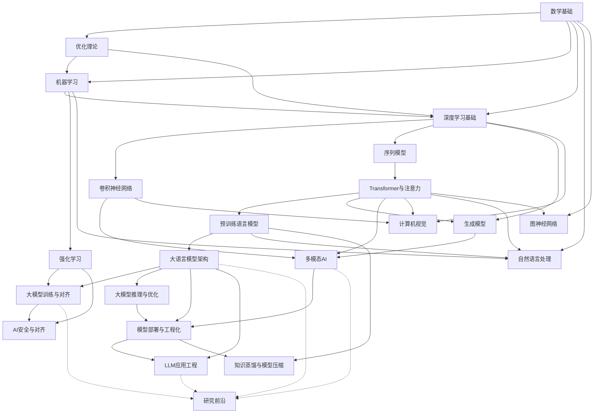

# AI学习笔记目录大纲（按技术方向·研究深度版）

## 执行摘要

本大纲以**技术方向为主轴**组织AI知识体系，每个方向内部标注**历史演进**脉络，并包含**核心公式推导**以达到深度学习研究级技术深度。共覆盖21个核心技术方向，从数学基础到前沿研究，构建完整的AI知识网络。每个方向统一采用八段式结构：定义与范围 → 历史演进 → 核心概念与方法 → 核心公式推导 → 代表论文与里程碑 → 学习资源 → 笔记要点与实践任务 → 与其他方向关系。

---

## 方向一：数学基础

### 定义与范围

AI的数学根基，涵盖线性代数、微积分、概率论与数理统计、信息论四大支柱。为机器学习模型的设计、分析和优化提供形式化语言与工具。

### 历史演进

| 年代 | 里程碑 | 意义 |
|------|--------|------|
| 1763 | Bayes定理 | 概率推理的数学基础 |
| 1809 | Gauss正态分布 | 分布建模的起点 |
| 1922 | Fisher极大似然估计 | 参数估计理论奠基 |
| 1948 | Shannon信息论 | 信息度量的数学框架 |
| 1951 | Kullback-Leibler散度 | 分布间差异度量 |
| 1960s | 矩阵微分系统化 | 深度学习反向传播的数学准备 |

### 核心概念与方法

- **线性代数**：向量空间、特征分解、SVD、矩阵伪逆、张量运算
- **微积分**：偏导数、链式法则、Taylor展开、Jacobian/Hessian矩阵
- **概率论**：条件概率、贝叶斯定理、概率分布族、蒙特卡洛方法、随机过程与马尔可夫链
- **信息论**：熵、互信息、KL散度、交叉熵、Fisher信息矩阵
- **数值计算**：浮点精度与数值稳定性、条件数

### 核心公式推导

**1. 贝叶斯定理推导**

由条件概率定义出发：

$$P(A|B) = \frac{P(A \cap B)}{P(B)}, \quad P(B|A) = \frac{P(A \cap B)}{P(A)}$$

联立消去 $P(A \cap B)$：

$$P(A|B) = \frac{P(B|A) \cdot P(A)}{P(B)}$$

用全概率公式展开分母：

$$P(A|B) = \frac{P(B|A) \cdot P(A)}{\sum_i P(B|A_i) \cdot P(A_i)}$$

**2. KL散度分解**

$$D_{KL}(P \| Q) = \sum_x P(x) \log \frac{P(x)}{Q(x)}$$

分解为交叉熵与熵之差：

$$D_{KL}(P \| Q) = \underbrace{-\sum_x P(x) \log Q(x)}_{H(P, Q)} - \underbrace{\left(-\sum_x P(x) \log P(x)\right)}_{H(P)}$$

因此 $H(P, Q) = H(P) + D_{KL}(P \| Q) \geq H(P)$，即交叉熵不小于真实熵。

**3. 矩阵求导链式法则**

对于复合函数 $z = f(g(x))$，其中 $g: \mathbb{R}^n \to \mathbb{R}^m$，$f: \mathbb{R}^m \to \mathbb{R}$：

$$\frac{\partial z}{\partial x_i} = \sum_j \frac{\partial f}{\partial g_j} \cdot \frac{\partial g_j}{\partial x_i}$$

矩阵形式：

$$\frac{\partial z}{\partial \mathbf{x}} = \left(\frac{\partial f}{\partial \mathbf{g}}\right)^T \frac{\partial \mathbf{g}}{\partial \mathbf{x}} = J_g^T \nabla_g f$$

其中 $J_g$ 为 $g$ 的 Jacobian 矩阵。这是反向传播的数学基础。

**4. 正态分布的极大似然估计**

给定样本 $\{x_1, \ldots, x_N\}$，假设 $x_i \sim \mathcal{N}(\mu, \sigma^2)$：

$$L(\mu, \sigma^2) = \prod_{i=1}^N \frac{1}{\sqrt{2\pi\sigma^2}} \exp\left(-\frac{(x_i - \mu)^2}{2\sigma^2}\right)$$

取对数：

$$\ell = -\frac{N}{2}\log(2\pi) - \frac{N}{2}\log\sigma^2 - \frac{1}{2\sigma^2}\sum_{i=1}^N (x_i - \mu)^2$$

对 $\mu$ 求偏导并令其为零：

$$\frac{\partial \ell}{\partial \mu} = \frac{1}{\sigma^2}\sum_{i=1}^N (x_i - \mu) = 0 \implies \hat{\mu} = \frac{1}{N}\sum_{i=1}^N x_i$$

对 $\sigma^2$ 求偏导并令其为零：

$$\frac{\partial \ell}{\partial \sigma^2} = -\frac{N}{2\sigma^2} + \frac{1}{2(\sigma^2)^2}\sum_{i=1}^N (x_i - \mu)^2 = 0 \implies \hat{\sigma}^2 = \frac{1}{N}\sum_{i=1}^N (x_i - \hat{\mu})^2$$

### 代表论文与里程碑

- Bayes (1763): An Essay towards solving a Problem in the Doctrine of Chances
- Shannon (1948): A Mathematical Theory of Communication
- Kullback & Leibler (1951): On Information and Sufficiency
- Bishop (2006): Pattern Recognition and Machine Learning（PRML教材）

### 学习资源

- 《深度学习》（Goodfellow等）第2-4章数学基础
- Boyd & Vandenberghe: Convex Optimization（线性代数附录）
- MIT 18.06 Linear Algebra（Gilbert Strang）
- Stanford CS229 数学复习笔记

### 笔记要点与实践任务

- 推导贝叶斯定理并用Python实现朴素贝叶斯分类器
- 实现矩阵SVD分解并与特征分解对比
- 用蒙特卡洛方法估计 $\pi$ 值，验证大数定律
- 推导并实现softmax函数的Jacobian矩阵

### 与其他方向关系

- 为「优化理论」提供梯度和Hessian的理论基础
- 为「机器学习」提供概率模型和统计推断工具
- 为「深度学习」提供反向传播的链式法则数学基础
- 信息论中的交叉熵是「深度学习」分类损失函数的核心

---

## 方向二：优化理论与方法

### 定义与范围

研究如何高效地找到目标函数的最优解（最小值或最大值），包括凸优化理论、随机优化、非凸优化及深度学习中的自适应优化方法。

### 历史演进

| 年代 | 里程碑 | 意义 |
|------|--------|------|
| 1847 | Cauchy梯度下降法 | 最早的连续优化算法 |
| 1951 | Robbins-Monro随机逼近 | SGD的理论基础 |
| 1983 | Nesterov加速梯度 | 动量方法的改进 |
| 1984 | Karmarkar内点法 | 凸优化里程碑 |
| 1986 | 反向传播算法 | 深度网络优化范式 |
| 2011 | AdaGrad | 自适应学习率开端 |
| 2012 | RMSProp | 指数移动平均自适应 |
| 2014 | Adam优化器 | 深度学习标准优化器 |
| 2017 | AMSGrad | Adam收敛性修正 |
| 2024 | Muon / Sophia等 | 新一代优化器探索 |

### 核心概念与方法

- **凸优化**：凸函数、拉格朗日对偶、KKT条件、内点法
- **梯度法**：批量梯度下降、随机梯度下降、小批量训练
- **动量方法**：Momentum、Nesterov加速梯度
- **自适应方法**：AdaGrad、RMSProp、Adam、AdamW
- **二阶方法**：牛顿法、拟牛顿法（L-BFGS）、自然梯度
- **正则化**：L1/L2正则、Dropout、权重衰减
- **分布式优化**：ZeRO-1/2/3、FSDP、梯度累积
- **混合精度训练**：AMP（FP16/BF16+FP32）、损失缩放

### 核心公式推导

**1. 梯度下降收敛性分析**

考虑凸函数 $f: \mathbb{R}^d \to \mathbb{R}$，满足 $L$-Lipschitz 连续梯度（即 $\|\nabla f(x) - \nabla f(y)\| \leq L\|x - y\|$）。梯度下降更新：

$$x_{t+1} = x_t - \eta \nabla f(x_t)$$

由Lipschitz条件：

$$f(x_{t+1}) \leq f(x_t) + \nabla f(x_t)^T(x_{t+1} - x_t) + \frac{L}{2}\|x_{t+1} - x_t\|^2$$

代入更新规则：

$$f(x_{t+1}) \leq f(x_t) - \eta\|\nabla f(x_t)\|^2 + \frac{L\eta^2}{2}\|\nabla f(x_t)\|^2 = f(x_t) - \eta\left(1 - \frac{L\eta}{2}\right)\|\nabla f(x_t)\|^2$$

当 $\eta \leq \frac{1}{L}$ 时，$1 - \frac{L\eta}{2} \geq \frac{1}{2}$，因此：

$$f(x_{t+1}) \leq f(x_t) - \frac{\eta}{2}\|\nabla f(x_t)\|^2$$

累加 $T$ 步并利用凸性 $\|\nabla f(x_t)\|^2 \geq 2(f(x_t) - f^*)$（由凸函数性质 $f^* \geq f(x_t) + \nabla f(x_t)^T(x^* - x_t)$）：

$$f(x_T) - f^* \leq \frac{\|x_0 - x^*\|^2}{2\eta T} = \mathcal{O}\left(\frac{1}{T}\right)$$

即梯度下降在凸函数上以 $\mathcal{O}(1/T)$ 速率收敛。

**2. SGD收敛速率**

随机梯度 $\tilde{g}_t = \nabla f(x_t; \xi_t)$ 满足 $\mathbb{E}[\tilde{g}_t] = \nabla f(x_t)$，$\text{Var}[\tilde{g}_t] \leq \sigma^2$。在凸函数上：

$$\mathbb{E}[f(\bar{x}_T)] - f^* \leq \frac{\|x_0 - x^*\|^2}{2\eta T} + \frac{\eta \sigma^2}{2}$$

其中 $\bar{x}_T = \frac{1}{T}\sum_{t=1}^T x_t$。取 $\eta = \frac{1}{\sqrt{T}}$：

$$\mathbb{E}[f(\bar{x}_T)] - f^* \leq \mathcal{O}\left(\frac{1}{\sqrt{T}}\right)$$

对比批量梯度下降的 $\mathcal{O}(1/T)$，SGD以更慢的速率收敛但每步计算量更小。

**3. Adam优化器推导**

Adam结合动量和自适应学习率。定义一阶矩和二阶矩估计：

$$m_t = \beta_1 m_{t-1} + (1-\beta_1)g_t$$
$$v_t = \beta_2 v_{t-1} + (1-\beta_2)g_t^2$$

偏差修正（初始时刻估计偏向零）：

$$\hat{m}_t = \frac{m_t}{1 - \beta_1^t}, \quad \hat{v}_t = \frac{v_t}{1 - \beta_2^t}$$

参数更新：

$$\theta_{t+1} = \theta_t - \frac{\eta}{\sqrt{\hat{v}_t} + \epsilon}\hat{m}_t$$

偏差修正推导：$\mathbb{E}[m_t] = (1-\beta_1)\sum_{i=1}^t \beta_1^{t-i} \nabla f$。在初始时刻 $\mathbb{E}[m_t] = (1-\beta_1^t)\nabla f$，因此除以 $1-\beta_1^t$ 进行无偏化。

**4. KKT条件推导**

考虑约束优化问题：

$$\min f(x) \quad \text{s.t.} \quad g_i(x) \leq 0, \quad h_j(x) = 0$$

构造拉格朗日函数：

$$\mathcal{L}(x, \lambda, \nu) = f(x) + \sum_i \lambda_i g_i(x) + \sum_j \nu_j h_j(x)$$

KKT条件：

1. **平稳性**：$\nabla_x \mathcal{L} = \nabla f(x) + \sum_i \lambda_i \nabla g_i(x) + \sum_j \nu_j \nabla h_j(x) = 0$
2. **原始可行性**：$g_i(x) \leq 0$，$h_j(x) = 0$
3. **对偶可行性**：$\lambda_i \geq 0$
4. **互补松弛性**：$\lambda_i g_i(x) = 0$

互补松弛性推导：对偶函数 $d(\lambda, \nu) = \inf_x \mathcal{L}(x, \lambda, \nu)$。在最优解处，强对偶性成立时 $\lambda_i g_i(x^*) = 0$，即若约束非活跃（$g_i(x^*) < 0$），则对应乘子 $\lambda_i = 0$。

### 代表论文与里程碑

- Robbins & Monro (1951): A Stochastic Approximation Method
- Nesterov (1983): A Method of Solving a Convex Programming Problem
- Duchi et al. (2011): AdaGrad
- Kingma & Ba (2014): Adam: A Method for Stochastic Optimization
- Reddi et al. (2017): On the Convergence of Adam and Beyond（AMSGrad）

### 学习资源

- Boyd & Vandenberghe: Convex Optimization（经典教材+斯坦福课程）
- Nesterov: Introductory Lectures on Convex Optimization
- 《深度学习》第4章和第8章
- Stanford CS229优化方法讲义

### 笔记要点与实践任务

- 从零实现SGD/Momentum/Adam并对比收敛曲线
- 推导SVM的拉格朗日对偶问题并实现
- 实验不同学习率调度策略（cosine、warmup、step decay）
- 分析Adam在非凸问题上的收敛行为

### 与其他方向关系

- 梯度下降和反向传播是「深度学习」训练的核心算法
- 凸优化理论是「机器学习」中SVM、逻辑回归的理论基础
- KKT条件贯穿「机器学习」的约束优化问题
- 自适应优化器是「大模型训练」的关键组件

---

## 方向三：机器学习

### 定义与范围

通过数据自动学习预测或决策规则的算法与理论，包括监督学习、无监督学习、集成学习和模型评估方法。

### 历史演进

| 年代 | 里程碑 | 意义 |
|------|--------|------|
| 1957 | 感知机（Rosenblatt） | 机器学习雏形 |
| 1959 | K均值聚类 | 无监督学习开端 |
| 1963 | 线性SVM（Vapnik） | 统计学习理论奠基 |
| 1979 | ID3决策树 | 符号化学习 |
| 1977 | EM算法（Dempster等） | 隐变量模型参数估计 |
| 1995 | 软间隔SVM（Cortes & Vapnik） | 核方法时代 |
| 1997 | AdaBoost（Freund & Schapire） | 集成学习方法论 |
| 2001 | 随机森林（Breiman） | 集成学习工业化 |
| 2003 | Latent Dirichlet Allocation | 主题模型 |
| 2014 | XGBoost思想 | 梯度提升树工业化 |

### 核心概念与方法

- **监督学习**：线性回归、逻辑回归、SVM、决策树、KNN、朴素贝叶斯
- **无监督学习**：K-means、层次聚类、PCA、t-SNE、自编码器
- **集成学习**：Bagging、Boosting（AdaBoost、GBDT、XGBoost）、Stacking
- **模型评估**：偏差-方差分解、交叉验证、学习曲线、评估指标（准确率/召回率/F1/AUC）
- **特征工程**：特征选择、特征变换、降维
- **迁移学习**：预训练-微调范式、领域适应（Domain Adaptation）

### 核心公式推导

**1. SVM对偶推导**

原问题（软间隔SVM）：

$$\min_{w,b,\xi} \frac{1}{2}\|w\|^2 + C\sum_{i=1}^N \xi_i \quad \text{s.t.} \quad y_i(w^T x_i + b) \geq 1 - \xi_i, \quad \xi_i \geq 0$$

构造拉格朗日函数：

$$\mathcal{L} = \frac{1}{2}\|w\|^2 + C\sum_i \xi_i - \sum_i \alpha_i[y_i(w^T x_i + b) - 1 + \xi_i] - \sum_i \mu_i \xi_i$$

对 $w, b, \xi_i$ 求偏导并令为零：

$$\frac{\partial \mathcal{L}}{\partial w} = w - \sum_i \alpha_i y_i x_i = 0 \implies w = \sum_i \alpha_i y_i x_i$$

$$\frac{\partial \mathcal{L}}{\partial b} = -\sum_i \alpha_i y_i = 0 \implies \sum_i \alpha_i y_i = 0$$

$$\frac{\partial \mathcal{L}}{\partial \xi_i} = C - \alpha_i - \mu_i = 0 \implies \alpha_i \leq C$$

代入拉格朗日函数消去 $w, b, \xi$，得到对偶问题：

$$\max_{\alpha} \sum_{i=1}^N \alpha_i - \frac{1}{2}\sum_{i,j} \alpha_i \alpha_j y_i y_j x_i^T x_j \quad \text{s.t.} \quad \sum_i \alpha_i y_i = 0, \quad 0 \leq \alpha_i \leq C$$

引入核函数 $K(x_i, x_j) = \phi(x_i)^T \phi(x_j)$ 实现非线性分类：

$$\max_{\alpha} \sum_i \alpha_i - \frac{1}{2}\sum_{i,j} \alpha_i \alpha_j y_i y_j K(x_i, x_j)$$

**2. EM算法完整推导**

设观测变量 $X$，隐变量 $Z$，参数 $\theta$，目标是最大化对数似然：

$$\ell(\theta) = \log P(X|\theta) = \log \sum_Z P(X, Z|\theta)$$

引入任意分布 $q(Z)$，由Jensen不等式：

$$\ell(\theta) = \log \sum_Z q(Z) \frac{P(X, Z|\theta)}{q(Z)} \geq \sum_Z q(Z) \log \frac{P(X, Z|\theta)}{q(Z)}$$

等号成立当且仅当 $q(Z) = P(Z|X, \theta)$（E步）。

**E步**：计算后验 $q(Z) = P(Z|X, \theta^{(t)})$，求期望：

$$Q(\theta|\theta^{(t)}) = \mathbb{E}_{Z|X, \theta^{(t)}}[\log P(X, Z|\theta)]$$

**M步**：最大化 $Q$：

$$\theta^{(t+1)} = \arg\max_\theta Q(\theta|\theta^{(t)})$$

以高斯混合模型（GMM）为例，$P(X, Z|\theta) = \prod_i \prod_k \pi_k \mathcal{N}(x_i|\mu_k, \Sigma_k)^{z_{ik}}$。

E步（责任度）：

$$\gamma(z_{ik}) = \frac{\pi_k \mathcal{N}(x_i|\mu_k, \Sigma_k)}{\sum_j \pi_j \mathcal{N}(x_i|\mu_j, \Sigma_j)}$$

M步：

$$\mu_k = \frac{\sum_i \gamma(z_{ik}) x_i}{\sum_i \gamma(z_{ik})}, \quad \pi_k = \frac{\sum_i \gamma(z_{ik})}{N}$$

$$\Sigma_k = \frac{\sum_i \gamma(z_{ik})(x_i - \mu_k)(x_i - \mu_k)^T}{\sum_i \gamma(z_{ik})}$$

**3. 偏差-方差分解**

对于回归问题 $y = f(x) + \epsilon$（$\epsilon \sim \mathcal{N}(0, \sigma^2)$），模型 $\hat{f}(x)$ 的期望泛化误差：

$$\mathbb{E}[(y - \hat{f}(x))^2] = \mathbb{E}[(f(x) + \epsilon - \hat{f}(x))^2]$$

展开并利用 $\mathbb{E}[\epsilon] = 0$：

$$= \underbrace{[\mathbb{E}[\hat{f}(x)] - f(x)]^2}_{\text{Bias}^2} + \underbrace{\mathbb{E}[(\hat{f}(x) - \mathbb{E}[\hat{f}(x)])^2]}_{\text{Variance}} + \underbrace{\sigma^2}_{\text{不可约误差}}$$

即：**期望误差 = 偏差² + 方差 + 噪声**。模型复杂度增加时，偏差减小但方差增大（过拟合）；反之欠拟合。

**4. 逻辑回归梯度推导**

逻辑回归模型 $P(y=1|x) = \sigma(w^T x) = \frac{1}{1 + e^{-w^T x}}$。

对数似然：

$$\ell = \sum_i [y_i \log \sigma(w^T x_i) + (1-y_i)\log(1 - \sigma(w^T x_i))]$$

利用 $\sigma'(z) = \sigma(z)(1 - \sigma(z))$，对 $w$ 求梯度：

$$\frac{\partial \ell}{\partial w} = \sum_i (y_i - \sigma(w^T x_i)) x_i$$

即梯度为预测误差乘以输入特征。梯度上升更新：$w \leftarrow w + \eta \sum_i (y_i - \hat{y}_i) x_i$。

### 代表论文与里程碑

- Rosenblatt (1958): The Perceptron
- Cortes & Vapnik (1995): Support-Vector Networks
- Freund & Schapire (1997): A Decision-Theoretic Generalization of On-Line Learning（AdaBoost）
- Breiman (2001): Random Forests
- Dempster et al. (1977): Maximum Likelihood from Incomplete Data via the EM Algorithm

### 学习资源

- 周志华《机器学习》（西瓜书）
- 李航《统计学习方法》
- Bishop: Pattern Recognition and Machine Learning (PRML)
- Stanford CS229 课程
- 李宏毅机器学习视频课程

### 笔记要点与实践任务

- 从零实现SVM（SMO算法）并在线性不可分数据上验证核函数效果
- 实现EM算法用于GMM聚类，可视化收敛过程
- 对比Bagging和Boosting在不同数据集上的偏差-方差表现
- 实现完整的交叉验证框架并绘制学习曲线

### 与其他方向关系

- 「数学基础」中的概率论和优化是其理论基础
- 深度学习是其神经网络分支的延伸（「深度学习」方向）
- SVM的对偶理论为「优化理论」提供重要应用案例
- 特征工程思想延续到「深度学习」中的表示学习

---

## 方向四：深度学习基础

### 定义与范围

基于多层神经网络的学习方法，通过反向传播算法自动学习数据的层次化特征表示。涵盖前馈网络、激活函数、正则化技术和训练稳定性方法。

### 历史演进

| 年代 | 里程碑 | 意义 |
|------|--------|------|
| 1943 | McCulloch-Pitts神经元 | 神经网络数学模型 |
| 1958 | 感知机（Rosenblatt） | 可学习神经元 |
| 1969 | Minsky感知机局限性 | 神经网络第一次寒冬 |
| 1986 | 反向传播算法（Rumelhart等） | 多层网络训练突破 |
| 1989 | 通用逼近定理（Hornik等） | 理论保证 |
| 1989 | Dropout / ReLU思想萌芽 | 正则化与激活函数 |
| 2010 | ReLU激活函数（Glorot等） | 解决梯度消失 |
| 2012 | AlexNet（Krizhevsky等） | 深度学习革命 |
| 2014 | Dropout（Hinton等） | 正则化技术 |
| 2015 | Batch Normalization（Ioffe等） | 训练稳定性突破 |
| 2016 | 残差连接（He等） | 超深网络训练 |

### 核心概念与方法

- **前馈网络**：多层感知机（MLP）、层次结构、通用逼近能力
- **激活函数**：Sigmoid、Tanh、ReLU、Leaky ReLU、GELU、SwiGLU
- **反向传播**：链式法则的递归应用、计算图
- **正则化**：L1/L2权重衰减、Dropout、Batch Normalization、Layer Normalization
- **损失函数**：MSE、交叉熵、Focal Loss、对比损失
- **初始化**：Xavier初始化、He初始化
- **归一化进阶**：Group Normalization、Instance Normalization
- **深度学习框架**：PyTorch/TensorFlow/JAX、自动微分、动态图vs静态图
- **分布式训练**：DDP、FSDP、张量并行、流水线并行

### 核心公式推导

**1. 反向传播完整推导**

考虑 $L$ 层前馈网络，第 $l$ 层：

$$z^{(l)} = W^{(l)} a^{(l-1)} + b^{(l)}, \quad a^{(l)} = \sigma(z^{(l)})$$

定义误差 $\delta^{(l)} = \frac{\partial \mathcal{L}}{\partial z^{(l)}}$。

**输出层**（以交叉熵+softmax为例）：

$$\delta^{(L)} = \frac{\partial \mathcal{L}}{\partial z^{(L)}} = a^{(L)} - y$$

**隐藏层**（反向传播核心公式）：

$$\delta^{(l)} = \left(W^{(l+1)}\right)^T \delta^{(l+1)} \odot \sigma'(z^{(l)})$$

推导：由链式法则

$$\delta^{(l)} = \frac{\partial \mathcal{L}}{\partial z^{(l)}} = \frac{\partial a^{(l)}}{\partial z^{(l)}} \cdot \frac{\partial z^{(l+1)}}{\partial a^{(l)}} \cdot \frac{\partial \mathcal{L}}{\partial z^{(l+1)}}$$

其中 $\frac{\partial a^{(l)}}{\partial z^{(l)}} = \text{diag}(\sigma'(z^{(l)}))$，$\frac{\partial z^{(l+1)}}{\partial a^{(l)}} = W^{(l+1)}$，因此：

$$\delta^{(l)} = \sigma'(z^{(l)}) \odot \left(W^{(l+1)}\right)^T \delta^{(l+1)}$$

**参数梯度**：

$$\frac{\partial \mathcal{L}}{\partial W^{(l)}} = \delta^{(l)} \left(a^{(l-1)}\right)^T, \quad \frac{\partial \mathcal{L}}{\partial b^{(l)}} = \delta^{(l)}$$

**2. ReLU梯度特性分析**

ReLU函数 $f(x) = \max(0, x)$，导数 $f'(x) = \mathbb{1}[x > 0]$。

对于深层网络 $\delta^{(1)} = \delta^{(L)} \prod_{l=2}^{L} W^{(l)} \odot \mathbb{1}[z^{(l)} > 0]$。

当使用Sigmoid时 $\sigma'(z) \leq 0.25$，连乘导致 $\delta^{(1)} \to 0$（梯度消失）。ReLU导数为0或1，避免了连乘衰减，但存在"死神经元"问题（$z < 0$时梯度恒为零）。

**3. Xavier/He初始化推导**

目标：使各层激活值方差保持一致。对于第 $l$ 层 $z^{(l)} = \sum_j w_j a^{(l-1)}_j$，假设 $w_j$ 和 $a^{(l-1)}_j$ 独立且均值零：

$$\text{Var}[z^{(l)}] = n_{in} \cdot \text{Var}[w] \cdot \text{Var}[a^{(l-1)}]$$

为使 $\text{Var}[z^{(l)}] = \text{Var}[a^{(l-1)}]$，需要 $\text{Var}[w] = \frac{1}{n_{in}}$（Xavier初始化）。

对于ReLU激活，由于一半神经元输出为零，有效方差减半，需补偿：

$$\text{Var}[w] = \frac{2}{n_{in}}$$

即He初始化。

**4. Dropout期望推导**

训练时以概率 $p$ 保留神经元，引入掩码 $m_i \sim \text{Bernoulli}(p)$。前向传播 $\tilde{a}_i = m_i \cdot a_i$。

训练时期望输出：

$$\mathbb{E}[\tilde{a}_i] = \mathbb{E}[m_i] \cdot a_i = p \cdot a_i$$

推理时不使用掩码但需缩放：$a_i^{test} = p \cdot a_i^{train}$。或等价地在训练时进行inverted dropout（除以 $p$）：

$$\tilde{a}_i = \frac{m_i \cdot a_i}{p}, \quad \mathbb{E}[\tilde{a}_i] = a_i$$

这样推理时无需修改。

**5. Batch Normalization推导**

对于mini-batch $\{x_1, \ldots, x_m\}$，计算批量均值和方差：

$$\mu_B = \frac{1}{m}\sum_{i=1}^m x_i, \quad \sigma_B^2 = \frac{1}{m}\sum_{i=1}^m (x_i - \mu_B)^2$$

归一化：$\hat{x}_i = \frac{x_i - \mu_B}{\sqrt{\sigma_B^2 + \epsilon}}$

缩放平移：$y_i = \gamma \hat{x}_i + \beta$

训练时使用批量统计量，推理时使用移动平均 $\mu_{running}$ 和 $\sigma^2_{running}$，保证推理确定性。

### 代表论文与里程碑

- Rumelhart et al. (1986): Learning representations by back-propagating errors
- Hornik et al. (1989): Multilayer feedforward networks are universal approximators
- Glorot & Bengio (2010): Understanding the difficulty of training deep feedforward neural networks
- Hinton et al. (2012): Improving neural networks by preventing co-adaptation of neurons（Dropout）
- Ioffe & Szegedy (2015): Batch Normalization
- He et al. (2016): Deep Residual Learning for Image Recognition（ResNet）

### 学习资源

- Goodfellow et al.: Deep Learning（第5-8章）
- Stanford CS231n 课程
- 李宏毅深度学习视频课程
- PyTorch官方教程

### 笔记要点与实践任务

- 用NumPy从零实现MLP的前向传播和反向传播
- 实现并对比不同激活函数（Sigmoid/ReLU/GELU/SwiGLU）的梯度行为
- 实现Batch Normalization和Layer Normalization并分析差异
- 可视化不同初始化方法对深层网络梯度分布的影响

### 与其他方向关系

- 「数学基础」中的链式法则是反向传播的理论基础
- 「优化理论」中的SGD/Adam是训练深度网络的标准方法
- CNN和RNN是其向特定数据类型的扩展（见对应方向）
- Batch Normalization思想延伸到「Transformer」中的Layer Normalization

---

## 方向五：卷积神经网络

### 定义与范围

利用卷积层提取局部特征的神经网络结构，通过权值共享和局部连接高效处理网格结构数据（图像、视频、音频等）。

### 历史演进

| 年代 | 里程碑 | 意义 |
|------|--------|------|
| 1989 | LeNet（LeCun） | 第一个实用CNN |
| 1998 | LeNet-5 | 手写数字识别商业化 |
| 2012 | AlexNet | ImageNet革命 |
| 2013 | VGG | 深层小卷积堆叠 |
| 2014 | GoogLeNet/Inception | 多尺度特征融合 |
| 2015 | ResNet | 残差连接，超深网络 |
| 2017 | DenseNet | 密集连接 |
| 2018 | SENet | 通道注意力 |
| 2020 | ViT | Transformer取代CNN |
| 2021 | ConvNeXt | CNN架构回归竞争 |

### 核心概念与方法

- **卷积运算**：局部感受野、权值共享、多通道卷积、分组卷积、深度可分离卷积
- **池化**：最大池化、平均池化、全局平均池化
- **经典架构**：LeNet → AlexNet → VGG → GoogLeNet → ResNet → DenseNet → ConvNeXt
- **目标检测**：R-CNN系列、YOLO系列、SSD、DETR
- **视觉注意力**：SE-Net、CBAM、Non-local
- **高效架构**：EfficientNet、MobileNetV3、NAS（神经架构搜索）
- **语义分割**：FCN、U-Net、DeepLab
- **空洞卷积**：扩张感受野而不增加参数

### 核心公式推导

**1. 卷积运算数学定义**

二维卷积（实际为互相关）：

$$(I * K)(i, j) = \sum_m \sum_n I(i+m, j+n) \cdot K(m, n)$$

其中 $I$ 为输入特征图，$K$ 为卷积核。

多通道卷积：输入 $I \in \mathbb{R}^{C_{in} \times H \times W}$，卷积核 $K \in \mathbb{R}^{C_{out} \times C_{in} \times k \times k}$：

$$O_c(i,j) = \sum_{c=1}^{C_{in}} \sum_m \sum_n I_c(i+m, j+n) \cdot K_{c,c'}(m, n) + b_{c'}$$

参数量：$C_{out} \times C_{in} \times k \times k + C_{out}$，远少于全连接层。

**2. 感受野计算公式**

第 $l$ 层的感受野 $R_l$：

$$R_l = R_{l-1} + (k_l - 1) \prod_{i=1}^{l-1} s_i$$

其中 $k_l$ 为第 $l$ 层卷积核大小，$s_i$ 为第 $i$ 层步幅。

推导：第 $l$ 层输出中一个像素对应输入的 $R_l$ 个像素。递推关系为当前层感受野等于上一层感受野加上卷积核覆盖的额外区域（需考虑之前所有层的步幅累积）。

**3. ResNet残差连接的梯度分析**

残差块：$y = F(x) + x$，其中 $F(x)$ 为残差映射。

反向传播梯度：

$$\frac{\partial \mathcal{L}}{\partial x} = \frac{\partial \mathcal{L}}{\partial y} \cdot \left(\frac{\partial F(x)}{\partial x} + I\right)$$

关键点：梯度中恒等项 $I$ 确保梯度可以无损地反向传播，即使 $\frac{\partial F}{\partial x}$ 很小，梯度也不会消失。这解决了超深网络（100+层）的训练难题。

对于普通网络 $\frac{\partial \mathcal{L}}{\partial x} = \frac{\partial \mathcal{L}}{\partial y} \cdot \frac{\partial F}{\partial x}$，连乘导致梯度消失或爆炸。

**4. 深度可分离卷积参数量分析**

标准卷积参数量：$C_{out} \times C_{in} \times k \times k$

深度可分离卷积 = 深度卷积（每通道独立） + 逐点卷积（$1\times1$）：

$$\text{参数量} = C_{in} \times k \times k + C_{out} \times C_{in} \times 1 \times 1$$

压缩比：

$$\frac{C_{in} k^2 + C_{out} C_{in}}{C_{out} C_{in} k^2} = \frac{1}{C_{out}} + \frac{1}{k^2}$$

当 $C_{out} \gg k$ 时，压缩比约 $\frac{1}{k^2}$，如 $3\times3$ 卷积压缩约 $\frac{1}{9}$。

### 代表论文与里程碑

- LeCun et al. (1998): Gradient-based learning applied to document recognition（LeNet-5）
- Krizhevsky et al. (2012): ImageNet Classification with Deep CNNs（AlexNet）
- He et al. (2016): Deep Residual Learning for Image Recognition（ResNet）
- Howard et al. (2017): MobileNets（深度可分离卷积）
- Dosovitskiy et al. (2020): An Image is Worth 16x16 Words（ViT）
- Liu et al. (2022): A ConvNet for the 2020s（ConvNeXt）

### 学习资源

- Stanford CS231n: Convolutional Neural Networks for Visual Recognition
- 《深度学习》第9章卷积网络
- PyTorch vision模型库
- Papers with Code: Image Classification排行榜

### 笔记要点与实践任务

- 从零实现2D卷积运算并验证与框架结果一致
- 训练ResNet-18/34/50在CIFAR-10上并对比性能
- 可视化不同层卷积核和特征图
- 实现深度可分离卷积并测量计算量节省
- 分析不同深度ResNet的梯度分布

### 与其他方向关系

- 「深度学习基础」的反向传播和正则化方法直接适用
- ViT将「Transformer」引入视觉领域，与CNN形成竞争与融合
- 目标检测算法（YOLO/DETR）是「多模态AI」视觉理解的基础
- ConvNeXt展示了CNN和Transformer架构设计的互相启发

---

## 方向六：序列模型

### 定义与范围

处理序列数据（文本、语音、时间序列）的神经网络架构，通过循环连接捕捉时间依赖性。涵盖RNN、LSTM、GRU、CTC及状态空间模型。

### 历史演进

| 年代 | 里程碑 | 意义 |
|------|--------|------|
| 1990 | Elman网络（简单RNN） | 序列建模开端 |
| 1997 | LSTM（Hochreiter & Schmidhuber） | 长序列依赖突破 |
| 1997 | CTC损失函数（Graves） | 端到端序列标注 |
| 2014 | GRU（Cho等） | LSTM简化版 |
| 2014 | Seq2Seq+Attention | 机器翻译革命 |
| 2017 | Transformer | 取代RNN成为主流 |
| 2020 | RWKV | 线性RNN复兴 |
| 2023 | Mamba（SSM） | 状态空间模型突破 |
| 2024 | Mamba-2 / Jamba | SSM与注意力混合 |

### 核心概念与方法

- **RNN基础**：时间展开、隐藏状态传递、双向RNN
- **LSTM/GRU**：门控机制、长短期记忆、遗忘门/输入门/输出门
- **序列建模**：语言模型、序列标注、序列到序列
- **CTC**：端到端语音/手写识别，无需对齐标注
- **状态空间模型**：连续时间状态空间离散化、选择性SSM
- **Seq2Seq+Attention**：Encoder-Decoder架构、Bahdanau注意力、Beam Search解码

### 核心公式推导

**1. RNN前向传播与BPTT梯度推导**

RNN前向传播：

$$h_t = \tanh(W_h h_{t-1} + W_x x_t + b)$$

$$y_t = W_y h_t + c$$

BPTT（Backpropagation Through Time）对 $W_h$ 的梯度：

$$\frac{\partial \mathcal{L}}{\partial W_h} = \sum_{t=1}^T \frac{\partial \mathcal{L}_t}{\partial W_h}$$

其中每一时刻的贡献需沿时间反向展开：

$$\frac{\partial \mathcal{L}_t}{\partial W_h} = \sum_{k=1}^{t} \frac{\partial \mathcal{L}_t}{\partial y_t} \frac{\partial y_t}{\partial h_t} \left(\prod_{i=k+1}^{t} \frac{\partial h_i}{\partial h_{i-1}}\right) \frac{\partial h_k}{\partial W_h}$$

梯度连乘项：

$$\prod_{i=k+1}^{t} \frac{\partial h_i}{\partial h_{i-1}} = \prod_{i=k+1}^{t} \text{diag}(\tanh'(z_i)) W_h$$

当 $t - k$ 较大时，若 $\|W_h\| < 1$ 则梯度消失；若 $\|W_h\| > 1$ 则梯度爆炸。这就是RNN长距离依赖困难的根源。

**2. LSTM门控公式与梯度通路**

LSTM三个门和记忆单元：

$$f_t = \sigma(W_f [h_{t-1}, x_t] + b_f) \quad \text{(遗忘门)}$$
$$i_t = \sigma(W_i [h_{t-1}, x_t] + b_i) \quad \text{(输入门)}$$
$$\tilde{C}_t = \tanh(W_C [h_{t-1}, x_t] + b_C) \quad \text{(候选记忆)}$$
$$C_t = f_t \odot C_{t-1} + i_t \odot \tilde{C}_t \quad \text{(记忆更新)}$$
$$o_t = \sigma(W_o [h_{t-1}, x_t] + b_o) \quad \text{(输出门)}$$
$$h_t = o_t \odot \tanh(C_t) \quad \text{(隐藏状态)}$$

梯度通路分析：$\frac{\partial C_t}{\partial C_{t-1}} = f_t$（加法而非乘法），当遗忘门 $f_t \approx 1$ 时，梯度可以无损传递到很远的过去，解决了RNN的梯度消失问题。

**3. CTC损失函数推导**

CTC引入空白符号 $\epsilon$，定义映射 $\pi \to z$（将含空白的路径压缩为目标序列）。

对于输入序列 $X$ 和目标序列 $Z$：

$$P(Z|X) = \sum_{\pi \in \mathcal{F}^{-1}(Z)} P(\pi|X) = \sum_{\pi \in \mathcal{F}^{-1}(Z)} \prod_{t=1}^T p_t(\pi_t)$$

其中 $p_t(\pi_t)$ 是时刻 $t$ 输出符号 $\pi_t$ 的概率。

直接计算指数级路径，用动态规划（前向-后向算法）高效计算：

$$\alpha_t(s) = \sum_{\pi_{1:t}} P(\pi_{1:t}, \pi_t = s | X)$$

前向递推（考虑空白和非空白两种情况）：

$$\alpha_t(s) = (\alpha_{t-1}(s) + \alpha_{t-1}(s-1)) \cdot p_t(s) \quad \text{(连续相同符号)}$$

$$\alpha_t(s) = (\alpha_{t-1}(s) + \alpha_{t-1}(s-1) + \alpha_{t-1}(s-2)) \cdot p_t(s) \quad \text{(非连续，含空白分隔)}$$

CTC损失：$\mathcal{L} = -\log P(Z|X) = -\log \alpha_T(|Z'|)$

**4. Mamba选择性状态空间模型推导**

连续状态空间方程：

$$h'(t) = A h(t) + B x(t), \quad y(t) = C h(t)$$

零阶保持离散化（步长 $\Delta$）：

$$\bar{A} = \exp(\Delta A), \quad \bar{B} = (\Delta A)^{-1}(\exp(\Delta A) - I) \cdot \Delta B$$

离散递推：

$$h_t = \bar{A} h_{t-1} + \bar{B} x_t, \quad y_t = C h_t$$

Mamba的创新：使 $A, B, C$ 依赖于输入 $x_t$（选择性机制），即 $A_t = f_A(x_t)$，$B_t = f_B(x_t)$，$C_t = f_C(x_t)$。这使得模型能根据输入内容选择性地记忆或遗忘信息，弥补了固定参数SSM的局限。

并行化计算：通过结构化递推（并行扫描算法），Mamba在训练时实现 $\mathcal{O}(N \log N)$ 的并行计算，推理时为 $\mathcal{O}(N)$ 线性复杂度。

### 代表论文与里程碑

- Elman (1990): Finding Structure in Time
- Hochreiter & Schmidhuber (1997): Long Short-Term Memory
- Graves et al. (2006): Connectionist Temporal Classification（CTC）
- Cho et al. (2014): Learning Phrase Representations using RNN Encoder-Decoder（GRU）
- Gu & Dao (2023): Mamba: Linear-Time Sequence Modeling with Selective State Spaces

### 学习资源

- 《深度学习》第10章序列建模
- Christopher Olah博客: Understanding LSTM Networks
- Albert Gu: The Annotated S4 / Mamba
- Hugging Face NLP Course（RNN章节）

### 笔记要点与实践任务

- 从零实现RNN并可视化梯度消失/爆炸现象
- 实现LSTM和GRU并在长序列任务上对比性能
- 推导并实现CTC前向-后向算法
- 复现Mamba的并行扫描算法并测量加速比

### 与其他方向关系

- 「深度学习基础」的梯度消失问题在序列模型中尤为突出
- Transformer（方向八）取代了RNN成为主流序列模型
- CTC是「语音处理」端到端识别的核心损失函数
- Mamba等SSM是「大语言模型」架构创新的重要方向

---

## 方向七：生成模型

### 定义与范围

学习数据分布并生成新样本的模型族，包括生成对抗网络（GAN）、变分自编码器（VAE）、归一化流和扩散模型。

### 历史演进

| 年代 | 里程碑 | 意义 |
|------|--------|------|
| 2013 | VAE（Kingma & Welling） | 变分推断与神经网络结合 |
| 2014 | GAN（Goodfellow等） | 对抗生成范式 |
| 2015 | DCGAN | 卷积GAN稳定训练 |
| 2016 | InfoGAN | 可解释隐变量 |
| 2017 | CycleGAN | 非配对图像转换 |
| 2018 | StyleGAN | 高质量人脸生成 |
| 2019 | Normalizing Flows | 精确似然生成 |
| 2020 | DDPM（Ho等） | 扩散模型实用化 |
| 2021 | CLIP-guided生成 | 语义引导生成 |
| 2022 | Stable Diffusion | 潜空间扩散，开源普及 |
| 2023 | DiT / Sora | Transformer架构扩散模型 |

### 核心概念与方法

- **GAN**：生成器与判别器博弈、minimax优化、模式崩溃、训练技巧（WGAN、谱归一化）
- **VAE**：编码器-解码器、重参数化技巧、ELBO、β-VAE
- **归一化流**：可逆变换、变量替换公式、RealNVP、GLOW
- **扩散模型**：前向加噪过程、逆向去噪过程、score matching、latent diffusion
- **条件生成**：类别条件、文本条件（CLIP/T5引导）、ControlNet
- **生成模型新范式**：Flow Matching、Consistency Models（LCM少步采样）、DiT（Transformer扩散）

### 核心公式推导

**1. GAN minimax博弈推导**

生成器 $G(z; \theta_g)$ 将噪声 $z \sim p_z$ 映射到数据空间，判别器 $D(x; \theta_d)$ 输出 $x$ 为真实数据的概率。

目标函数：

$$\min_G \max_D V(D, G) = \mathbb{E}_{x \sim p_{data}}[\log D(x)] + \mathbb{E}_{z \sim p_z}[\log(1 - D(G(z)))]$$

**最优判别器推导**：固定 $G$，对 $D$ 最大化。对任意 $x$：

$$\frac{\partial}{\partial D}\left[p_{data}(x)\log D(x) + p_g(x)\log(1 - D(x))\right] = \frac{p_{data}(x)}{D(x)} - \frac{p_g(x)}{1 - D(x)} = 0$$

解得：

$$D^*(x) = \frac{p_{data}(x)}{p_{data}(x) + p_g(x)}$$

**最优生成器**：代入 $D^*$ 到目标函数：

$$V(G, D^*) = \mathbb{E}_{x \sim p_{data}}\left[\log \frac{p_{data}(x)}{p_{data}(x) + p_g(x)}\right] + \mathbb{E}_{x \sim p_g}\left[\log \frac{p_g(x)}{p_{data}(x) + p_g(x)}\right]$$

化简为Jensen-Shannon散度：

$$V(G, D^*) = -2\log 2 + 2 \cdot JSD(p_{data} \| p_g)$$

当且仅当 $p_g = p_{data}$ 时取最小值 $-2\log 2$。

**2. VAE ELBO推导**

目标是最大化对数似然 $\log p(x)$，引入隐变量 $z$ 和近似后验 $q_\phi(z|x)$：

$$\log p(x) = \log \int p(x|z)p(z)dz$$

由Jensen不等式（引入 $q_\phi(z|x)$）：

$$\log p(x) = \log \mathbb{E}_{q_\phi(z|x)}\left[\frac{p(x|z)p(z)}{q_\phi(z|x)}\right] \geq \mathbb{E}_{q_\phi}\left[\log \frac{p(x|z)p(z)}{q_\phi(z|x)}\right]$$

展开ELBO（Evidence Lower Bound）：

$$\text{ELBO} = \mathbb{E}_{q_\phi(z|x)}[\log p(x|z)] - D_{KL}(q_\phi(z|x) \| p(z))$$

即 **重构项 - KL散度项**。

**重参数化技巧**：直接从 $q_\phi(z|x) = \mathcal{N}(\mu_\phi, \sigma_\phi^2)$ 采样不可微，改为：

$$z = \mu_\phi + \sigma_\phi \cdot \epsilon, \quad \epsilon \sim \mathcal{N}(0, I)$$

梯度可经 $\mu_\phi, \sigma_\phi$ 反向传播。

当 $q_\phi(z|x)$ 和 $p(z)$ 均为高斯时，KL散度有解析解：

$$D_{KL}(\mathcal{N}(\mu, \sigma^2) \| \mathcal{N}(0, 1)) = \frac{1}{2}\sum_i (\mu_i^2 + \sigma_i^2 - 1 - \log \sigma_i^2)$$

**3. DDPM前向与逆向过程推导**

**前向过程**（加噪，固定马尔可夫链）：

$$q(x_t | x_{t-1}) = \mathcal{N}(x_t; \sqrt{1-\beta_t} x_{t-1}, \beta_t I)$$

闭合形式采样（任意时刻 $t$ 直接从 $x_0$）：

令 $\alpha_t = 1 - \beta_t$，$\bar{\alpha}_t = \prod_{s=1}^t \alpha_s$，则：

$$q(x_t | x_0) = \mathcal{N}(x_t; \sqrt{\bar{\alpha}_t} x_0, (1 - \bar{\alpha}_t) I)$$

$$x_t = \sqrt{\bar{\alpha}_t} x_0 + \sqrt{1 - \bar{\alpha}_t} \epsilon, \quad \epsilon \sim \mathcal{N}(0, I)$$

**逆向过程**（去噪，学习参数化）：

$$p_\theta(x_{t-1} | x_t) = \mathcal{N}(x_{t-1}; \mu_\theta(x_t, t), \Sigma_\theta(x_t, t))$$

**训练目标推导**：最小化变分下界可简化为：

$$\mathcal{L}_{simple} = \mathbb{E}_{t, x_0, \epsilon}\left[\|\epsilon - \epsilon_\theta(x_t, t)\|^2\right]$$

其中 $\epsilon_\theta$ 为神经网络预测的噪声。推导关键步骤：将ELBO中的KL散度展开，利用前向后验 $q(x_{t-1}|x_t, x_0)$ 的解析形式，最终得到预测噪声的MSE损失。

前向后验：

$$q(x_{t-1}|x_t, x_0) = \mathcal{N}\left(\frac{\sqrt{\bar{\alpha}_{t-1}}\beta_t}{1-\bar{\alpha}_t}x_0 + \frac{\sqrt{\alpha_t}(1-\bar{\alpha}_{t-1})}{1-\bar{\alpha}_t}x_t, \frac{\beta_t(1-\bar{\alpha}_{t-1})}{1-\bar{\alpha}_t}\right)$$

**4. Score Matching与扩散模型的关系**

扩散模型的去噪网络 $\epsilon_\theta(x_t, t)$ 与分数函数 $\nabla_{x_t} \log q(x_t)$ 的关系：

$$\nabla_{x_t} \log q(x_t | x_0) = -\frac{\epsilon}{\sqrt{1 - \bar{\alpha}_t}}$$

因此预测噪声等价于预测分数函数（乘以缩放因子）：

$$\epsilon_\theta(x_t, t) \approx -\sqrt{1 - \bar{\alpha}_t} \cdot s_\theta(x_t, t)$$

这统一了DDPM与Score-Based Generative Models的理论框架。

### 代表论文与里程碑

- Kingma & Welling (2013): Auto-Encoding Variational Bayes（VAE）
- Goodfellow et al. (2014): Generative Adversarial Nets（GAN）
- Ho et al. (2020): Denoising Diffusion Probabilistic Models（DDPM）
- Song et al. (2021): Score-Based Generative Modeling through SDEs
- Rombach et al. (2022): High-Resolution Image Synthesis with Latent Diffusion Models（Stable Diffusion）
- Peebles & Xie (2023): Scalable Diffusion Models with Transformers（DiT）

### 学习资源

- Goodfellow et al.: Deep Learning 第20章
- Lilian Weng博客: From GAN to WGAN / What are Diffusion Models
- Hugging Face Diffusers库文档
- Calvin Luo: Understanding Diffusion Models: A Unified Perspective

### 笔记要点与实践任务

- 从零实现GAN并分析模式崩溃现象
- 实现VAE并推导高斯先验下的KL散度解析解
- 实现DDPM的前向加噪和逆向去噪过程
- 在CIFAR-10上训练简化版Latent Diffusion模型
- 推导并验证Score Matching与噪声预测的等价关系

### 与其他方向关系

- 「数学基础」中的KL散度和Jensen不等式是VAE和GAN的理论基础
- Stable Diffusion结合「多模态AI」中的CLIP实现文本引导生成
- 扩散模型的DiT架构借鉴了「Transformer」的设计
- 生成模型是「多模态AI」图像/视频生成的核心技术

---

## 方向八：Transformer与注意力机制

### 定义与范围

基于自注意力机制的深度网络架构，实现并行化序列建模。Transformer已成为自然语言处理、计算机视觉和多模态AI的主流架构。

### 历史演进

| 年代 | 里程碑 | 意义 |
|------|--------|------|
| 2014 | Bahdanau Attention | 注意力机制首次提出 |
| 2015 | Luong Attention | 注意力机制改进 |
| 2017 | Transformer（Vaswani等） | 自注意力架构革命 |
| 2018 | BERT / GPT | 预训练Transformer |
| 2020 | FlashAttention | 注意力计算IO优化 |
| 2021 | Linear Attention | 线性注意力探索 |
| 2022 | FlashAttention-2 | 进一步优化 |
| 2023 | Grouped-Query Attention | 推理效率优化 |
| 2024 | FlashAttention-3 / MLA | Hopper架构优化/DeepSeek注意力 |
| 2025 | 混合架构（Jamba等） | 注意力与SSM融合 |

### 核心概念与方法

- **注意力机制**：Query-Key-Value、缩放点积注意力、注意力权重
- **多头注意力**：并行多组注意力、子空间表示
- **位置编码**：正弦编码、学习式编码、相对位置编码、RoPE、ALiBi
- **Transformer架构**：Encoder-Decoder、Encoder-only、Decoder-only
- **效率优化**：FlashAttention、稀疏注意力、线性注意力、分组查询注意力
- **交叉注意力**：Q来自一个序列，K/V来自另一个——多模态和Encoder-Decoder的核心
- **注意力共享**：MQA（多查询）、GQA（分组查询）

### 核心公式推导

**1. Self-Attention公式推导**

输入序列 $X \in \mathbb{R}^{n \times d}$，通过三个权重矩阵映射：

$$Q = X W_Q, \quad K = X W_K, \quad V = X W_V$$

注意力计算：

$$\text{Attention}(Q, K, V) = \text{softmax}\left(\frac{Q K^T}{\sqrt{d_k}}\right) V$$

**缩放因子推导**：当 $Q, K$ 的元素为均值0、方差1的独立随机变量时，$Q K^T$ 的每个元素是 $d_k$ 个独立项之和，方差为 $d_k$。softmax对大值敏感，方差增大导致梯度不稳定。除以 $\sqrt{d_k}$ 使方差归一化为1。

逐元素展开：$A_{ij} = \frac{\exp(Q_i \cdot K_j / \sqrt{d_k})}{\sum_l \exp(Q_i \cdot K_l / \sqrt{d_k})}$

输出：$O_i = \sum_j A_{ij} V_j$

**2. Multi-Head Attention矩阵推导**

将 $d$ 维输入分成 $h$ 个头，每个头维度 $d_k = d / h$：

$$\text{head}_i = \text{Attention}(Q W_i^Q, K W_i^K, V W_i^V)$$

其中 $W_i^Q \in \mathbb{R}^{d \times d_k}$，$W_i^K \in \mathbb{R}^{d \times d_k}$，$W_i^V \in \mathbb{R}^{d \times d_v}$。

拼接后投影：

$$\text{MultiHead}(Q, K, V) = \text{Concat}(\text{head}_1, \ldots, \text{head}_h) W^O$$

其中 $W^O \in \mathbb{R}^{hd_v \times d}$。总参数量 $= h \times (d \times d_k + d \times d_k + d \times d_v) + hd_v \times d = 4d^2$，与单头注意力（$d_k = d$）参数量相同。

**3. RoPE（旋转位置编码）推导**

核心思想：通过旋转矩阵将位置信息编码到Query和Key中，使得 $Q_m^T K_n$ 仅依赖相对位置 $m - n$。

对二维向量 $[q_0, q_1]$，位置 $m$ 的旋转：

$$\begin{pmatrix} q_0' \\ q_1' \end{pmatrix} = \begin{pmatrix} \cos(m\theta) & -\sin(m\theta) \\ \sin(m\theta) & \cos(m\theta) \end{pmatrix} \begin{pmatrix} q_0 \\ q_1 \end{pmatrix}$$

对 $d$ 维向量，分组应用不同频率的旋转：

$$q_m' = R_m q_m, \quad k_n' = R_n k_n$$

其中 $R_m = \text{blockdiag}(R(m\theta_1), R(m\theta_2), \ldots, R(m\theta_{d/2}))$，$\theta_i = 10000^{-2i/d}$。

注意力点积仅依赖相对位置：

$$q_m'^T k_n' = q_m^T R_m^T R_n k_n = q_m^T R_{n-m} k_n$$

因为旋转矩阵的正交性 $R_m^T R_n = R_{n-m}$。

**4. FlashAttention计算分析**

标准注意力的时间和空间复杂度：
- 时间：$\mathcal{O}(n^2 d)$（计算 $n \times n$ 注意力矩阵）
- 空间：$\mathcal{O}(n^2)$（存储注意力矩阵）

FlashAttention通过分块计算（tiling）避免实例化完整 $n \times n$ 矩阵：

1. 将 $Q, K, V$ 分为大小为 $B_r \times B_c$ 的块
2. 逐块计算 $S_{ij} = Q_i K_j^T / \sqrt{d_k}$
3. 用在线softmax算法增量更新归一化因子
4. 累积输出 $O_i += P_{ij} V_j$

空间复杂度降至 $\mathcal{O}(n)$，HBM访问减少为 $\mathcal{O}(n^2 d / M)$（$M$ 为SRAM大小），实现2-4倍加速。

### 代表论文与里程碑

- Vaswani et al. (2017): Attention Is All You Need
- Devlin et al. (2018): BERT
- Radford et al. (2018): GPT
- Su et al. (2021): RoFormer: Enhanced Transformer with Rotary Position Embedding
- Dao et al. (2022): FlashAttention: Fast and Memory-Efficient Exact Attention
- Ainslie et al. (2023): GQA: Training Generalized Multi-Query Transformer Models

### 学习资源

- The Annotated Transformer（Harvard NLP）
- Andrej Karpathy: Let's build GPT from scratch
- Jay Alammar: The Illustrated Transformer
- FlashAttention论文及开源代码

### 笔记要点与实践任务

- 从零实现Self-Attention和Multi-Head Attention
- 实现并对比不同位置编码（正弦/RoPE/ALiBi）的外推性能
- 推导并实现FlashAttention的分块算法
- 实现Grouped-Query Attention并测量推理加速
- 分析注意力矩阵的秩与信息瓶颈

### 与其他方向关系

- 「数学基础」中的softmax和矩阵运算是其计算基础
- Transformer取代了「序列模型」中的RNN/LSTM
- 是「预训练语言模型」和「大语言模型」的核心架构
- 注意力机制被广泛应用于「计算机视觉」（ViT）和「多模态AI」

---

## 方向九：预训练语言模型

### 定义与范围

利用大规模无标注语料预训练语言模型，再通过微调适配下游任务的范式。涵盖BERT、GPT、T5等模型及其预训练目标。

### 历史演进

| 年代 | 里程碑 | 意义 |
|------|--------|------|
| 2013 | Word2Vec（Mikolov等） | 词向量表示 |
| 2014 | GloVe | 全局矩阵分解词向量 |
| 2018 | ELMo | 上下文词向量 |
| 2018 | BERT（Devlin等） | Encoder双向预训练 |
| 2018 | GPT-1（Radford等） | Decoder自回归预训练 |
| 2019 | T5（Raffel等） | Encoder-Decoder统一框架 |
| 2019 | XLNet | 排列语言建模 |
| 2020 | GPT-3（Brown等） | 规模化涌现 |
| 2021 | Codex | 代码预训练 |
| 2022 | InstructGPT / ChatGPT | 指令微调+RLHF |

### 核心概念与方法

- **词向量**：Word2Vec（CBOW/Skip-gram）、GloVe、FastText
- **预训练目标**：Masked Language Model（MLM）、Causal Language Model（CLM）、Span Corruption
- **架构范式**：Encoder-only（BERT）、Decoder-only（GPT）、Encoder-Decoder（T5）
- **微调策略**：全参数微调、线性探针、Prompt Tuning
- **Scaling Laws**：参数量、数据量、计算量的幂律关系
- **重要变体**：RoBERTa（动态Masking）、ELECTRA（RTD判别式预训练）、DeBERTa（解耦注意力）

### 核心公式推导

**1. Word2Vec Skip-gram推导**

目标：最大化中心词 $w_t$ 预测上下文词 $w_{t+j}$ 的概率：

$$\mathcal{L} = \frac{1}{T}\sum_{t=1}^T \sum_{j \in J} \log P(w_{t+j} | w_t)$$

$$P(w_O | w_I) = \frac{\exp(\mathbf{v}'_{w_O}{}^T \mathbf{v}_{w_I})}{\sum_{w=1}^V \exp(\mathbf{v}'_w{}^T \mathbf{v}_{w_I})}$$

其中 $\mathbf{v}_w$ 和 $\mathbf{v}'_w$ 分别为输入和输出向量，$V$ 为词表大小。

**负采样优化**：直接计算softmax需 $O(V)$，用负采样近似：

$$\log P(w_O | w_I) \approx \log \sigma(\mathbf{v}'_{w_O}{}^T \mathbf{v}_{w_I}) + \sum_{i=1}^k \mathbb{E}_{w_i \sim P_n(w)}[\log \sigma(-\mathbf{v}'_{w_i}{}^T \mathbf{v}_{w_I})]$$

其中 $P_n(w) \propto \text{count}(w)^{3/4}$ 为噪声分布，$k$ 为负样本数。

**2. BERT的MLM损失推导**

BERT随机Mask输入token的15%，其中80%替换为[MASK]，10%随机替换，10%保持不变。

MLM损失：对于被mask的位置集合 $\mathcal{M}$：

$$\mathcal{L}_{MLM} = -\sum_{i \in \mathcal{M}} \log P(x_i | x_{\backslash\mathcal{M}})$$

其中 $P(x_i | x_{\backslash\mathcal{M}}) = \text{softmax}(W_o h_i)_i$，$h_i$ 为Transformer encoder的输出。

**NSP（Next Sentence Prediction）损失**：

$$\mathcal{L}_{NSP} = -[y \log P(\text{IsNext}) + (1-y)\log P(\text{NotNext})]$$

RoBERTa证明NSP并非必要，去除后性能更好。

**3. GPT自回归生成公式**

GPT使用Decoder-only架构，自回归地预测下一个token：

$$P(x_{1:T}) = \prod_{t=1}^T P(x_t | x_{<t})$$

$$P(x_t | x_{<t}) = \text{softmax}(W_o h_t)$$

其中 $h_t$ 通过因果掩码的自注意力计算（只能看到位置 $\leq t$ 的token）。

训练损失：

$$\mathcal{L} = -\frac{1}{T}\sum_{t=1}^T \log P(x_t | x_{<t})$$

因果掩码实现：在注意力矩阵上加上下三角掩码 $M_{ij} = \begin{cases} 0 & i \geq j \\ -\infty & i < j \end{cases}$，softmax后上三角元素为零。

**4. Scaling Laws推导**

Kaplan等人发现Transformer语言模型的损失与计算量 $C$、参数量 $N$、数据量 $D$ 满足幂律：

$$L(N) = \left(\frac{N_c}{N}\right)^{\alpha_N}, \quad L(D) = \left(\frac{D_c}{D}\right)^{\alpha_D}, \quad L(C) = \left(\frac{C_c}{C}\right)^{\alpha_C}$$

其中 $\alpha_N \approx 0.076$，$\alpha_D \approx 0.095$，$\alpha_C \approx 0.05$。

**Chinchilla最优分配**：Hoffmann等人修正为给定计算预算 $C$ 下的最优参数-数据比。令 $C \approx 6ND$（前向+反向的计算量），最小化 $L(N, D) = \frac{A}{N^\alpha} + \frac{B}{D^\beta} + L_\infty$。

对 $N$ 和 $D$ 求拉格朗日条件：

$$\frac{\partial L}{\partial N} = -\frac{\alpha A}{N^{\alpha+1}} = \lambda \cdot 6D, \quad \frac{\partial L}{\partial D} = -\frac{\beta B}{D^{\beta+1}} = \lambda \cdot 6N$$

两式相除：

$$\frac{\alpha A D^{\beta+1}}{\beta B N^{\alpha+1}} = \frac{D}{N}$$

最优解：$D^* / N^* \approx 20$，即每个参数约需20个token的训练数据。

### 代表论文与里程碑

- Mikolov et al. (2013): Efficient Estimation of Word Representations in Vector Space
- Devlin et al. (2018): BERT: Pre-training of Deep Bidirectional Transformers
- Radford et al. (2018): Improving Language Understanding by Generative Pre-Training（GPT-1）
- Raffel et al. (2019): Exploring the Limits of Transfer Learning（T5）
- Brown et al. (2020): Language Models are Few-Shot Learners（GPT-3）
- Kaplan et al. (2020): Scaling Laws for Neural Language Models
- Hoffmann et al. (2022): Training Compute-Optimal Large Language Models（Chinchilla）

### 学习资源

- Hugging Face Transformers库与课程
- Stanford CS224N: NLP with Deep Learning
- The Annotated BERT / GPT（Harvard NLP）
- Lilian Weng博客: Generalized Language Models

### 笔记要点与实践任务

- 实现Word2Vec Skip-gram + 负采样并分析词向量聚类
- 从零实现简化版BERT并在小语料上预训练
- 实现因果掩码并验证GPT的自回归生成
- 复现Scaling Laws实验：在小模型上拟合幂律曲线
- 对比Encoder-only/Decoder-only/Encoder-Decoder在分类任务上的表现

### 与其他方向关系

- 「Transformer」是其核心架构基础
- 「大语言模型」是其规模化和能力涌现的延伸
- Scaling Laws指导「大模型训练」的计算资源分配
- 词向量技术是「自然语言处理」的基础

---

## 方向十：大语言模型核心架构

### 定义与范围

大语言模型（LLM）的架构设计，包括注意力机制变体、位置编码、分词、混合专家、长上下文处理和新型架构探索。

### 历史演进

| 年代 | 里程碑 | 意义 |
|------|--------|------|
| 2020 | GPT-3（175B） | 规模化验证 |
| 2021 | Switch Transformer | MoE大规模应用 |
| 2022 | PaLM / Chinchilla | 540B / 最优计算分配 |
| 2023 | LLaMA / Mixtral | 开源LLM民主化 |
| 2023 | Mamba | SSM架构替代 |
| 2023 | DeepSeek-MoE | 细粒度MoE |
| 2024 | DeepSeek-V2 MLA | 多头潜在注意力 |
| 2024 | Llama 3 / Qwen 2 | 开源模型逼近闭源 |
| 2024 | Jamba | SSM+注意力混合 |
| 2025 | DeepSeek-V3/R1 | MoE+推理模型 |

### 核心概念与方法

- **整体架构**：Decoder-only主流、Pre-Norm vs Post-Norm、SwiGLU激活、RMSNorm
- **注意力优化**：GQA（分组查询注意力）、MLA（多头潜在注意力）、滑动窗口注意力
- **位置编码**：RoPE、ALiBi、YaRN（外推扩展）
- **分词**：BPE、SentencePiece、Unigram
- **混合专家**：Top-K路由、共享专家、细粒度分割
- **长上下文**：NTK外推、动态NTK、StreamingLLM、Ring Attention
- **效率训练**：Multi-Token Prediction（DeepSeek-V3）

### 核心公式推导

**1. MoE路由公式推导**

MoE层将输入路由到 $N$ 个专家中的Top-K个：

$$\text{Gating}(x) = \text{softmax}(\text{TopK}(W_g x, k))$$

其中 TopK 操作保留前 $k$ 个最大值，其余置 $-\infty$。

输出：

$$y = \sum_{i \in \text{TopK}} G(x)_i \cdot E_i(x)$$

**负载均衡损失**：防止路由坍缩到少数专家。定义专家 $i$ 被选中的概率 $f_i$ 和路由权重均值 $P_i$：

$$f_i = \frac{1}{T}\sum_{t=1}^T \mathbb{1}[i \in \text{TopK}(W_g x_t)]$$

$$P_i = \frac{1}{T}\sum_{t=1}^T \text{softmax}(W_g x_t)_i$$

负载均衡损失：

$$\mathcal{L}_{balance} = \alpha \cdot N \sum_{i=1}^N f_i \cdot P_i$$

当所有专家均匀使用时 $f_i = P_i = 1/N$，$\mathcal{L}_{balance} = \alpha \cdot N \cdot N \cdot (1/N)^2 = \alpha$，达到最小值。

**2. SwiGLU激活函数推导**

标准FFN：$\text{FFN}(x) = W_2 \sigma(W_1 x + b_1) + b_2$

GLU（Gated Linear Unit）：$\text{GLU}(x) = (W_1 x) \odot \sigma(W_2 x)$

SwiGLU（Swish激活+GLU门控）：

$$\text{SwiGLU}(x, W, V) = \text{Swish}(xW) \odot (xV)$$

其中 $\text{Swish}(z) = z \cdot \sigma(\beta z)$。

最终FFN输出：

$$\text{FFN}_{SwiGLU}(x) = (\text{Swish}(xW) \odot xV) W_2$$

参数量：三个权重矩阵 $W, V, W_2$，维度 $d \to d_{ff} \to d$。为保持与标准FFN相同参数量，取 $d_{ff} = \frac{2}{3} \times 4d$。

**3. MLA（多头潜在注意力）推导**

DeepSeek-V2提出的MLA通过低秩压缩KV-Cache降低推理开销。

标准注意力需要缓存每层的 $K, V \in \mathbb{R}^{n \times d}$（$h$ 个头），KV-Cache总量 $\mathcal{O}(n \times h \times d_h \times 2)$。

MLA压缩方案：将KV投影到低维潜在空间：

$$c_K = W_{DKV} x, \quad c_V = W_{DV} x$$

其中 $c_K, c_V \in \mathbb{R}^{n \times d_c}$，$d_c \ll h \times d_h$。

推理时仅缓存 $c_K, c_V$，KV-Cache缩减为 $\mathcal{O}(n \times d_c \times 2)$。

注意力计算时恢复：

$$K = c_K W_{UK}, \quad V = c_V W_{UV}$$

利用矩阵结合律优化：$Q K^T = Q W_{UK}^T c_K^T$，可将 $W_{UK}^T$ 吸收到 $Q$ 中，避免显式恢复 $K$。

**4. RoPE上下文外推（YaRN）推导**

原始RoPE在训练长度 $L_{train}$ 外注意力分数下降。YaRN通过频率插值扩展：

原始频率 $\theta_i = 10000^{-2i/d}$，插值频率：

$$\theta_i' = \theta_i / s, \quad s = \frac{L_{new}}{L_{train}}$$

这等价于将位置索引从 $[0, L_{new})$ 压缩到 $[0, L_{train})$。

YaRN进一步引入注意力缩放因子 $t$：

$$\text{Attention} = \text{softmax}\left(\frac{Q K^T}{\sqrt{d_k}} \cdot \frac{1}{t}\right) V, \quad t = 0.1 \log(s) + 1$$

补偿外推时注意力分数的分布偏移。

### 代表论文与里程碑

- Fedus et al. (2022): Switch Transformer
- Su et al. (2021): RoFormer（RoPE）
- Ainslie et al. (2023): GQA
- DeepSeek-AI (2024): DeepSeek-V2（MLA）
- Gu & Dao (2023): Mamba
- AI21 Labs (2024): Jamba（SSM+注意力混合）
- Peng et al. (2023): RWKV

### 学习资源

- LLaMA / DeepSeek / Qwen 技术报告
- EleutherAI: Mathematical Framework for Transformer Circuits
- Lilian Weng: Large Transformer Model Inference Optimization
- The Illustrated GPT-2 / LLaMA

### 笔记要点与实践任务

- 实现MoE路由并分析负载均衡损失的效果
- 实现SwiGLU并对比标准FFN的性能
- 推导MLA的KV-Cache压缩比并实现简化版
- 实现RoPE的上下文外推（NTK/YaRN）并验证长文本性能
- 分析不同注意力变体（MHA/GQA/MLA）的推理速度-质量权衡

### 与其他方向关系

- 「Transformer」是其架构基础
- MoE和SSM是「研究前沿」的架构创新方向
- 注意力优化直接影响「大模型推理与优化」的效率
- 位置编码的外推能力是「大模型推理」长上下文处理的关键

---

## 方向十一：大模型训练与对齐

### 定义与范围

大语言模型从预训练到对齐的完整训练流程，包括预训练策略、监督微调（SFT）、偏好对齐方法（RLHF/DPO/GRPO）和参数高效微调（PEFT）。

### 历史演进

| 年代 | 里程碑 | 意义 |
|------|--------|------|
| 2017 | 预训练+微调范式 | BERT/GPT确立 |
| 2019 | T5统一框架 | text-to-text范式 |
| 2020 | GPT-3少样本学习 | In-context learning涌现 |
| 2022 | InstructGPT（Ouyang等） | RLHF对齐突破 |
| 2022 | Constitutional AI（Anthropic） | RLAIF减少人类标注 |
| 2023 | DPO（Rafailov等） | 无需奖励模型的偏好优化 |
| 2023 | LoRA/QLoRA | 参数高效微调普及 |
| 2024 | GRPO（DeepSeek） | 群体相对策略优化 |
| 2024 | DeepSeek-R1 | 纯RL训练推理能力 |

### 核心概念与方法

- **预训练**：数据配比、课程学习、训练稳定性（梯度裁剪、loss spike处理）
- **监督微调**：指令数据构造、格式统一、多轮对话
- **偏好对齐**：RLHF（PPO+奖励模型）、DPO、RLAIF、GRPO
- **参数高效微调**：LoRA、QLoRA、Adapter、Prefix Tuning
- **安全对齐**：红队测试、价值对齐、拒绝训练
- **对齐进阶**：ORPO（无需参考模型）、Iterative DPO（LLaMA3训练策略）、Rejection Sampling Fine-tuning
- **数据工程**：合成数据生成、数据质量过滤

### 核心公式推导

**1. RLHF/PPO完整推导**

RLHF分为三阶段：

**阶段一：SFT**。在指令数据上微调：

$$\mathcal{L}_{SFT} = -\mathbb{E}_{(x,y) \sim \mathcal{D}_{SFT}}[\log \pi_\theta(y|x)]$$

**阶段二：奖励模型训练**。对偏好对 $(y_w, y_l)$（$y_w \succ y_l$），使用Bradley-Terry模型：

$$P(y_w \succ y_l | x) = \frac{\exp(r_\phi(x, y_w))}{\exp(r_\phi(x, y_w)) + \exp(r_\phi(x, y_l))}$$

$$= \sigma(r_\phi(x, y_w) - r_\phi(x, y_l))$$

损失：

$$\mathcal{L}_{RM} = -\mathbb{E}_{(x, y_w, y_l)}[\log \sigma(r_\phi(x, y_w) - r_\phi(x, y_l))]$$

**阶段三：PPO优化**。目标函数：

$$\max_\theta \mathbb{E}_{x \sim \mathcal{D}, y \sim \pi_\theta(\cdot|x)}[r_\phi(x, y)] - \beta \mathbb{D}_{KL}[\pi_\theta(\cdot|x) \| \pi_{ref}(\cdot|x)]$$

KL惩罚防止策略偏离参考模型太远。

PPO的Clipped目标函数：

$$\mathcal{L}_{PPO} = \mathbb{E}\left[\min\left(r_t(\theta) \hat{A}_t, \text{clip}(r_t(\theta), 1-\epsilon, 1+\epsilon) \hat{A}_t\right)\right]$$

其中 $r_t(\theta) = \frac{\pi_\theta(y_t|x,y_{<t})}{\pi_{old}(y_t|x,y_{<t})}$ 为概率比，$\hat{A}_t$ 为优势函数估计。

**2. DPO推导**

DPO直接从偏好数据优化策略，跳过奖励模型。

**关键推导**：从RLHF目标出发，最优策略的解析解为：

$$\pi^*(y|x) = \frac{1}{Z(x)} \pi_{ref}(y|x) \exp\left(\frac{r(x,y)}{\beta}\right)$$

其中 $Z(x) = \sum_y \pi_{ref}(y|x) \exp(r(x,y)/\beta)$。

反解奖励函数：

$$r(x, y) = \beta \log \frac{\pi^*(y|x)}{\pi_{ref}(y|x)} + \beta \log Z(x)$$

代入Bradley-Terry偏好模型（$Z(x)$ 在偏好差中消去）：

$$P(y_w \succ y_l | x) = \sigma\left(\beta \log \frac{\pi^*(y_w|x)}{\pi_{ref}(y_w|x)} - \beta \log \frac{\pi^*(y_l|x)}{\pi_{ref}(y_l|x)}\right)$$

因此DPO损失为：

$$\mathcal{L}_{DPO} = -\mathbb{E}_{(x, y_w, y_l)}\left[\log \sigma\left(\beta \log \frac{\pi_\theta(y_w|x)}{\pi_{ref}(y_w|x)} - \beta \log \frac{\pi_\theta(y_l|x)}{\pi_{ref}(y_l|x)}\right)\right]$$

无需训练奖励模型，直接用偏好数据优化策略。

**3. GRPO推导**

DeepSeek提出的GRPO（Group Relative Policy Optimization）省去Critic网络。

对每个问题 $x$，采样一组 $\{y_1, \ldots, y_G\}$，计算组内相对优势：

$$\tilde{A}_i = \frac{r_i - \text{mean}(r_1, \ldots, r_G)}{\text{std}(r_1, \ldots, r_G)}$$

GRPO目标：

$$\mathcal{L}_{GRPO} = \mathbb{E}\left[\frac{1}{G}\sum_{i=1}^G \min\left(\tilde{r}_i \tilde{A}_i, \text{clip}(\tilde{r}_i, 1-\epsilon, 1+\epsilon) \tilde{A}_i\right) - \beta \mathbb{D}_{KL}[\pi_\theta \| \pi_{ref}]\right]$$

其中 $\tilde{r}_i = \frac{\pi_\theta(y_i|x)}{\pi_{old}(y_i|x)}$。与PPO的区别：用组内统计量代替Critic网络估计的baseline，减少训练开销。

**4. LoRA低秩适配推导**

LoRA假设参数更新是低秩的：$\Delta W = BA$，其中 $B \in \mathbb{R}^{d \times r}$，$A \in \mathbb{R}^{r \times k}$，$r \ll \min(d, k)$。

前向传播：$h = W x + \Delta W x = W x + B(A x)$

初始化：$A \sim \mathcal{N}(0, \sigma^2)$，$B = 0$（初始时 $\Delta W = 0$，保持预训练模型行为）。

参数量：$d \times r + r \times k = r(d + k)$，对比全参数 $d \times k$，压缩比 $\frac{r(d+k)}{dk} = r(\frac{1}{k} + \frac{1}{d})$。当 $r=8, d=k=4096$ 时，压缩比约 $0.4\%$。

**QLoRA**在LoRA基础上将原权重 $W$ 量化为4-bit：

$$W_{quant} = \text{NF4}(W), \quad h = \text{dequant}(W_{quant}) x + B(Ax)$$

训练时梯度只通过 $B(Ax)$ 反向传播，$W_{quant}$ 保持冻结。

### 代表论文与里程碑

- Ouyang et al. (2022): Training language models to follow instructions with human feedback（InstructGPT）
- Bai et al. (2022): Constitutional AI（RLAIF）
- Hu et al. (2021): LoRA: Low-Rank Adaptation
- Dettmers et al. (2023): QLoRA: Efficient Finetuning of Quantized LLMs
- Rafailov et al. (2023): Direct Preference Optimization
- DeepSeek-AI (2024): DeepSeek-R1（GRPO + RL推理）

### 学习资源

- Hugging Face TRL库文档
- OpenAI InstructGPT论文精读
- DeepSeek-R1技术报告
- Sebastian Raschka: Building LLMs from scratch

### 笔记要点与实践任务

- 实现完整的RLHF流程（RM训练+PPO）
- 从零推导DPO并实现训练循环
- 实现LoRA并分析不同秩 $r$ 对性能的影响
- 对比SFT vs DPO vs PPO在偏好对齐上的效果
- 复现DeepSeek-R1的GRPO训练流程

### 与其他方向关系

- 「预训练语言模型」是SFT的基础
- RLHF中的PPO来源于「强化学习」
- LoRA/QLoRA与「大模型推理」中的量化技术相关
- 安全对齐是「AI安全」方向的核心议题

---

## 方向十二：大模型推理与优化

### 定义与范围

大语言模型推理阶段的速度、内存和质量优化技术，包括KV-Cache、量化、剪枝、解码策略和并行推理。

### 历史演进

| 年代 | 里程碑 | 意义 |
|------|--------|------|
| 2020 | KV-Cache | 自回归推理加速 |
| 2022 | INT8量化（LLM.int8()） | 大模型量化开端 |
| 2022 | PagedAttention（vLLM） | 显存管理革命 |
| 2023 | GPTQ / AWQ | 4-bit量化 |
| 2023 | Speculative Decoding | 投机解码加速 |
| 2023 | Flash-Decoding | 并行解码优化 |
| 2024 | Continuous Batching | 动态批处理 |
| 2024 | DeepSeek-V2 MLA | KV-Cache压缩 |
| 2024 | 多模态推理优化 | 视觉+语言推理加速 |

### 核心概念与方法

- **KV-Cache**：缓存已计算的Key/Value避免重复计算
- **量化**：INT8/INT4/FP8量化、GPTQ、AWQ、SmoothQuant
- **剪枝与稀疏化**：结构化剪枝、非结构化剪枝、稀疏注意力
- **解码策略**：Greedy、Beam Search、Top-k、Top-p、Temperature、投机解码
- **推理框架**：vLLM、TensorRT-LLM、SGLang、llama.cpp
- **批处理**：Continuous Batching、动态批处理
- **投机进阶**：Medusa/EAGLE多token预测
- **模型格式**：GGUF（llama.cpp生态）

### 核心公式推导

**1. KV-Cache复杂度分析**

自回归生成中，第 $t$ 步计算注意力需所有历史位置的 $K, V$。

无Cache时：每步计算 $Q_t K_{1:t}^T$，总计算量 $\sum_{t=1}^n t \cdot d = \mathcal{O}(n^2 d)$。

有Cache时：缓存 $K_{1:t-1}, V_{1:t-1}$，第 $t$ 步只需计算 $Q_t K_{1:t}^T$，增量计算量为 $\mathcal{O}(td)$，总计 $\mathcal{O}(n^2 d)$ 计算不变但避免了重复计算。

KV-Cache显存占用（每层）：

$$M_{KV} = 2 \times n_{layer} \times n_{head} \times d_{head} \times seq\_len \times \text{dtype\_size}$$

以Llama-2-70B为例（80层, 64头, $d_{head}=128$, FP16）：

$$M_{KV} = 2 \times 80 \times 64 \times 128 \times 4096 \times 2 \approx 80 \text{ GB}$$

这超过了模型权重本身（约140GB FP16），是长序列推理的主要瓶颈。

**2. GPTQ量化推导**

GPTQ基于二阶信息（Hessian）逐列量化权重。

目标：量化 $W$ 使 $WX \approx \hat{W}X$，即最小化 $\|WX - \hat{W}X\|_F^2$。

定义误差 $\mathcal{E} = (W - \hat{W}) X X^T (W - \hat{W})^T$。令 $H = X X^T$（Hessian），逐列量化。

对第 $i$ 列权重量化：

$$\hat{w}_i = \arg\min_{q \in \mathcal{Q}} \frac{(w_i - q)^2}{[H^{-1}]_{ii}}$$

量化后更新剩余列以补偿误差：

$$W_{:,j} \leftarrow W_{:,j} - \frac{w_i - \hat{w}_i}{[H^{-1}]_{ii}} H_{ji} W_{:,j}, \quad j > i$$

利用Cholesky分解高效计算 $H^{-1}$。

**3. AWQ量化推导**

AWQ（Activation-aware Weight Quantization）发现不是所有权重同等重要，与激活值大的通道关联的权重更敏感。

量化误差加权：

$$\mathcal{E} = \sum_i \|s_i \cdot (w_i - Q(w_i)) \cdot x_i\|^2$$

其中 $s_i$ 为通道 $i$ 的缩放因子。最优 $s_i$ 平衡量化误差和激活幅度：

$$s_i^* = \arg\min_s \mathbb{E}\left[\|s \cdot Q(w_i/s) \cdot x_i - w_i \cdot x_i\|^2\right]$$

AWQ通过网格搜索高效近似最优 $s_i$，一般取 $s_i = \max(|x_i|)^\alpha / \max(|w_i|)^{1-\alpha}$，$\alpha \approx 0.5$。

**4. 投机解码（Speculative Decoding）推导**

用一个小的Draft模型 $\pi_d$ 快速生成候选序列，大模型 $\pi_t$ 并行验证。

Draft模型生成 $k$ 个token：$y_1, \ldots, y_k \sim \pi_d(\cdot | x, y_{<i})$

Target模型并行计算这 $k+1$ 个位置的概率。接受规则（保证与target模型分布一致）：

对每个token $y_i$，以概率 $\min\left(1, \frac{\pi_t(y_i | x, y_{<i})}{\pi_d(y_i | x, y_{<i})}\right)$ 接受。

若在位置 $j$ 拒绝，从调整分布 $\frac{\max(0, \pi_t(\cdot) - \pi_d(\cdot))}{\sum \max(0, \pi_t(\cdot) - \pi_d(\cdot))}$ 采样一个替代token。

期望加速比：若Draft模型接受率 $\alpha$，则期望接受长度 $\frac{1-\alpha^{k+1}}{1-\alpha}$。当 $\alpha = 0.8, k=4$ 时约为3.3倍加速。

### 代表论文与里程碑

- Dettmers et al. (2022): LLM.int8(): 8-bit Matrix Multiplication
- Frantar et al. (2023): GPTQ: Accurate Post-Training Quantization
- Lin et al. (2023): AWQ: Activation-aware Weight Quantization
- Kwon et al. (2023): Efficient Memory Management for LLM Serving（PagedAttention / vLLM）
- Leviathan et al. (2023): Fast Inference from Transformers via Speculative Decoding
- Chen et al. (2023): Flash-Decoding

### 学习资源

- vLLM / TensorRT-LLM 文档与源码
- llama.cpp 项目
- Xiao et al. (2023): SmoothQuant技术报告
- EleutherAI: LLM Inference速览

### 笔记要点与实践任务

- 计算不同模型的KV-Cache显存占用并设计压缩策略
- 实现GPTQ量化并在Llama模型上测试精度-速度权衡
- 实现投机解码并测量实际加速比
- 部署vLLM服务并分析Continuous Batching的吞吐提升
- 对比INT4/INT8/FP16推理质量差异

### 与其他方向关系

- KV-Cache优化与「大语言模型架构」中的MLA/GQA密切相关
- 量化技术与「大模型训练」中的QLoRA共享原理
- 推理框架是「模型部署与工程化」的核心组件
- 解码策略影响「LLM应用工程」中的输出质量

---

## 方向十三：强化学习

### 定义与范围

智能体通过与环境交互学习最优决策策略的范式，涵盖经典RL、深度RL、多智能体RL以及与大模型结合的RLHF/RLAIF。

### 历史演进

| 年代 | 里程碑 | 意义 |
|------|--------|------|
| 1950s | 动态规划（Bellman） | 最优控制理论 |
| 1989 | Q-Learning（Watkins） | 无模型RL |
| 1992 | TD-Gammon | RL首次实战成功 |
| 1998 | Sutton & Barto《强化学习导论》 | 理论体系化 |
| 2013 | DQN（Mnih等） | 深度RL开端 |
| 2015 | DQN Atari | 视觉RL突破 |
| 2016 | AlphaGo（Silver等） | 围棋超人类 |
| 2017 | PPO（Schulman等） | 稳定策略优化 |
| 2017 | AlphaZero | 自对弈学习 |
| 2019 | MuZero | 无模型规划 |
| 2022 | RLHF应用于LLM | 对齐训练范式 |
| 2024 | RL驱动推理模型 | o1/R1 |

### 核心概念与方法

- **MDP框架**：状态、动作、奖励、转移、折扣因子
- **值函数**：状态值 $V^\pi(s)$、动作值 $Q^\pi(s,a)$、优势函数 $A^\pi(s,a)$
- **动态规划**：值迭代、策略迭代
- **无模型方法**：Q-Learning、SARSA、蒙特卡洛、时序差分（TD）
- **策略梯度**：REINFORCE、Actor-Critic、PPO、TRPO、SAC
- **深度RL**：DQN、DDPG、A3C、Rainbow、Dreamer
- **进阶RL**：Model-based RL（World Models）、Offline RL（CQL/IQL）、Multi-Agent RL（MADDPG/QMIX）

### 核心公式推导

**1. Bellman方程推导**

状态值函数定义：

$$V^\pi(s) = \mathbb{E}_\pi\left[\sum_{t=0}^{\infty} \gamma^t r_{t+1} \Big| s_0 = s\right]$$

展开第一项：

$$V^\pi(s) = \mathbb{E}_\pi\left[r_{t+1} + \gamma \sum_{t=1}^{\infty} \gamma^{t-1} r_{t+1+1} \Big| s_0 = s\right]$$

$$= \sum_a \pi(a|s) \sum_{s'} P(s'|s,a) \left[r(s,a,s') + \gamma V^\pi(s')\right]$$

这就是Bellman期望方程。类似地，Q值的Bellman方程：

$$Q^\pi(s,a) = \sum_{s'} P(s'|s,a)\left[r(s,a,s') + \gamma \sum_{a'} \pi(a'|s') Q^\pi(s',a')\right]$$

**Bellman最优方程**（最优策略 $\pi^*$）：

$$V^*(s) = \max_a \sum_{s'} P(s'|s,a)\left[r(s,a,s') + \gamma V^*(s')\right]$$

$$Q^*(s,a) = \sum_{s'} P(s'|s,a)\left[r(s,a,s') + \gamma \max_{a'} Q^*(s',a')\right]$$

**2. Q-Learning推导**

Q-Learning是离策略（off-policy）TD算法，直接学习 $Q^*$。

更新规则：

$$Q(s_t, a_t) \leftarrow Q(s_t, a_t) + \alpha\left[r_{t+1} + \gamma \max_{a'} Q(s_{t+1}, a') - Q(s_t, a_t)\right]$$

推导：由Bellman最优方程 $Q^*(s,a) = \mathbb{E}[r + \gamma \max_{a'} Q^*(s', a')]$，TD目标 $\hat{Q} = r + \gamma \max_{a'} Q(s', a')$ 是 $Q^*$ 的无偏估计（在表格情况下），因此Q-Learning收敛到 $Q^*$。

**DQN**使用神经网络 $Q_\theta(s,a)$ 近似Q函数，引入经验回放和目标网络 $Q_{\theta^-}$ 稳定训练：

$$\mathcal{L}(\theta) = \mathbb{E}_{(s,a,r,s') \sim \mathcal{D}}\left[\left(r + \gamma \max_{a'} Q_{\theta^-}(s', a') - Q_\theta(s, a)\right)^2\right]$$

**3. 策略梯度定理推导**

目标：最大化期望回报 $J(\theta) = \mathbb{E}_{\tau \sim \pi_\theta}[R(\tau)]$。

$$J(\theta) = \sum_\tau P(\tau|\theta) R(\tau)$$

对 $\theta$ 求梯度（利用 $\nabla \log P = \nabla P / P$，即score function trick）：

$$\nabla_\theta J(\theta) = \sum_\tau \nabla_\theta P(\tau|\theta) R(\tau) = \sum_\tau P(\tau|\theta) \nabla_\theta \log P(\tau|\theta) R(\tau)$$

$$= \mathbb{E}_{\tau \sim \pi_\theta}[\nabla_\theta \log P(\tau|\theta) R(\tau)]$$

展开轨迹概率 $\log P(\tau|\theta) = \log p(s_0) + \sum_t \log \pi_\theta(a_t|s_t) + \log P(s_{t+1}|s_t,a_t)$，环境部分不含 $\theta$：

$$\nabla_\theta J(\theta) = \mathbb{E}\left[\sum_t \nabla_\theta \log \pi_\theta(a_t|s_t) R(\tau)\right]$$

这是REINFORCE算法。引入优势函数降低方差：

$$\nabla_\theta J(\theta) = \mathbb{E}\left[\sum_t \nabla_\theta \log \pi_\theta(a_t|s_t) A^{\pi_\theta}(s_t, a_t)\right]$$

**4. PPO完整推导**

PPO从TRPO的信赖域优化简化而来。TRPO目标：

$$\max_\theta \mathbb{E}\left[\frac{\pi_\theta(a|s)}{\pi_{old}(a|s)} A\right] \quad \text{s.t.} \quad \mathbb{E}[D_{KL}(\pi_{old} \| \pi_\theta)] \leq \delta$$

PPO用Clipping代替KL约束：

$$\mathcal{L}^{CLIP}(\theta) = \mathbb{E}\left[\min\left(r_t(\theta) A_t, \text{clip}(r_t(\theta), 1-\epsilon, 1+\epsilon) A_t\right)\right]$$

其中 $r_t(\theta) = \frac{\pi_\theta(a_t|s_t)}{\pi_{old}(a_t|s_t)}$。

分析：
- 当 $A_t > 0$（好动作）：$r_t$ 被上界 $1+\epsilon$ 限制，防止过度利用好动作
- 当 $A_t < 0$（坏动作）：$r_t$ 被下界 $1-\epsilon$ 限制，防止过度惩罚

完整PPO目标加入价值函数和熵正则：

$$\mathcal{L}^{PPO} = \mathcal{L}^{CLIP} - c_1 \mathcal{L}^{VF} + c_2 \mathcal{S}[\pi_\theta]$$

其中 $\mathcal{S}$ 为熵奖励鼓励探索。

### 代表论文与里程碑

- Watkins (1989): Learning from Delayed Rewards（Q-Learning）
- Sutton & Barto (1998): Reinforcement Learning: An Introduction
- Mnih et al. (2015): Human-level control through deep reinforcement learning（DQN）
- Silver et al. (2016): Mastering the game of Go with deep neural networks（AlphaGo）
- Schulman et al. (2017): Proximal Policy Optimization Algorithms（PPO）
- Silver et al. (2018): A general reinforcement learning algorithm that masters chess, shogi, and Go（AlphaZero）

### 学习资源

- Sutton & Barto: Reinforcement Learning: An Introduction（第二版）
- David Silver: UCL强化学习课程
- OpenAI Spinning Up in Deep RL
- Berkeley CS285: Deep Reinforcement Learning

### 笔记要点与实践任务

- 实现表格版Q-Learning并验证收敛到最优策略
- 实现DQN在CartPole/Atari上的训练
- 从零推导策略梯度定理并实现REINFORCE
- 实现PPO并对比与DQN的训练稳定性
- 分析AlphaZero的MCTS+神经网络结合策略

### 与其他方向关系

- PPO是「大模型训练」中RLHF的核心优化算法
- Bellman方程和MDP为「搜索与规划」提供理论基础
- 多智能体RL扩展到「多模态AI」中的Agent协作
- RL与大模型结合催生了推理模型（o1/R1），属于「研究前沿」

---

## 方向十四：多模态AI

### 定义与范围

融合多种模态（视觉、语言、音频、视频）信息的AI系统，包括视觉语言模型、图像/视频生成、语音处理和多模态Agent。

### 历史演进

| 年代 | 里程碑 | 意义 |
|------|--------|------|
| 2014 | Show and Tell | 图像描述生成 |
| 2016 | VQA | 视觉问答基准 |
| 2021 | CLIP（Radford等） | 对比学习跨模态对齐 |
| 2021 | DALL·E | 文本到图像生成 |
| 2022 | Flamingo | 少样本多模态学习 |
| 2023 | LLaVA / GPT-4V | 视觉指令微调 |
| 2023 | BLIP-2 | Q-Former桥接视觉与语言 |
| 2024 | Sora | 视频生成突破 |
| 2024 | Gemini 1.5 | 原生多模态大模型 |
| 2025 | 统一多模态模型 | Any-to-Any生成 |

### 核心概念与方法

- **跨模态对齐**：CLIP对比学习、ALBEF、BLIP
- **视觉语言模型**：LLaVA架构（视觉编码器+投影层+LLM）、Q-Former
- **图像生成**：文生图扩散模型、条件控制（ControlNet）
- **视频生成**：时空扩散模型、自回归视频生成
- **语音处理**：ASR（Whisper）、TTS、语音克隆
- **统一模型**：Any-to-Any多模态生成、统一token化
- **多模态Agent**：视觉感知+LLM推理+工具调用

### 核心公式推导

**1. CLIP对比损失推导**

CLIP通过对比学习对齐图像和文本表示。对于batch中 $N$ 个图文对，图像编码器 $f_I$ 和文本编码器 $f_T$ 输出归一化向量：

$$u_i = \frac{f_I(x_i)}{\|f_I(x_i)\|}, \quad v_i = \frac{f_T(t_i)}{\|f_T(t_i)\|}$$

计算相似度矩阵 $S_{ij} = u_i \cdot v_j$（余弦相似度）。

对称InfoNCE损失：

$$\mathcal{L}_{CLIP} = \frac{1}{2N}\sum_{i=1}^N\left[-\log \frac{\exp(S_{ii}/\tau)}{\sum_{j=1}^N \exp(S_{ij}/\tau)} - \log \frac{\exp(S_{ii}/\tau)}{\sum_{j=1}^N \exp(S_{ji}/\tau)}\right]$$

即图像到文本和文本到图像两个方向的交叉熵的平均。$\tau$ 为可学习温度参数。

**InfoNCE与互信息关系**：InfoNCE等价于最大化图像和文本表示之间互信息的下界：

$$\mathcal{L}_{NCE} \geq -\log N + I(u; v)$$

因此batch大小越大，对比学习能区分的负样本越多，互信息下界越紧。

**2. LLaVA投影层推导**

LLaVA将视觉编码器（如CLIP ViT）的输出投影到LLM的词嵌入空间：

$$H_v = \text{CLIP\_ViT}(x_{image}) \in \mathbb{R}^{N_v \times D_v}$$

$$H_p = H_v W_{project} \in \mathbb{R}^{N_v \times D_{LLM}}$$

其中 $W_{project} \in \mathbb{R}^{D_v \times D_{LLM}}$ 为可训练投影矩阵（初始版本为线性层，LLaVA-1.5使用两层MLP）。

投影后的视觉token与文本token拼接：

$$H_{input} = [\text{Embed}(x_{text}), H_p]$$

送入LLM进行自回归生成。训练时只微调投影层（和可选的LLM LoRA）。

**3. BLIP-2 Q-Former推导**

Q-Former引入可学习的Query tokens $Q \in \mathbb{R}^{N_q \times D}$ 提取视觉特征：

$$\text{Attn}(Q, K_v, V_v) = \text{softmax}\left(\frac{Q K_v^T}{\sqrt{D}}\right) V_v$$

其中 $K_v, V_v$ 来自冻结的视觉编码器。Q-Former通过交叉注意力从图像中提取 $N_q$ 个固定数量的特征（与图像分辨率无关），再投影到LLM空间。

Q-Former训练分为两阶段：
1. 视觉-语言表示学习（ITC+ITM+LM目标）
2. 视觉到语言生成学习（接上LLM微调）

**4. Stable Diffusion条件生成推导**

Latent Diffusion在VAE的潜空间中进行扩散。条件控制通过交叉注意力实现：

$$\epsilon_\theta(z_t, t, c) = \text{UNet}(z_t, t, \text{Attn}(z_t, c))$$

其中 $c$ 为条件（如CLIP文本编码）。

交叉注意力：

$$\text{CrossAttn}(z_t, c) = \text{softmax}\left(\frac{Q_z K_c^T}{\sqrt{d}}\right) V_c$$

$Q_z$ 来自噪声潜表示，$K_c, V_c$ 来自文本条件。

**Classifier-Free Guidance**（CFG）：训练时随机丢弃条件（$c \to \emptyset$ 以概率 $p_{uncond}$），推理时组合：

$$\tilde{\epsilon} = \epsilon_\theta(z_t, t, \emptyset) + w \cdot (\epsilon_\theta(z_t, t, c) - \epsilon_\theta(z_t, t, \emptyset))$$

引导强度 $w > 1$ 增强条件影响，提高生成质量与条件一致性。

### 代表论文与里程碑

- Radford et al. (2021): Learning Transferable Visual Models from Natural Language（CLIP）
- Ramesh et al. (2021): Zero-Shot Text-to-Image Generation（DALL·E）
- Li et al. (2023): BLIP-2
- Liu et al. (2023): Visual Instruction Tuning（LLaVA）
- Rombach et al. (2022): Latent Diffusion Models（Stable Diffusion）
- OpenAI (2024): Sora视频生成
- Google (2024): Gemini 1.5

### 学习资源

- Hugging Face Multimodal模型库
- LLaVA官方代码与文档
- Lilian Weng: What are Diffusion Models?
- Papers with Code: Image Captioning / VQA

### 笔记要点与实践任务

- 实现CLIP对比损失并训练小型图文对齐模型
- 构建LLaVA式架构（CLIP+投影层+LLM）进行图像问答
- 推导并实现Classifier-Free Guidance
- 实现BLIP-2 Q-Former的交叉注意力机制
- 训练条件扩散模型进行文本引导图像生成

### 与其他方向关系

- CLIP对齐「Transformer」编码器实现跨模态表示
- 图像生成依赖「生成模型」中的扩散模型
- 视觉语言模型是「LLM应用工程」中Agent的感知组件
- 多模态Agent是「研究前沿」的重要方向

---

## 方向十五：计算机视觉

### 定义与范围

让计算机理解和分析图像/视频数据的技术，包括传统计算机视觉方法、深度视觉模型、目标检测、图像分割和三维视觉。

### 历史演进

| 年代 | 里程碑 | 意义 |
|------|--------|------|
| 1966 | MIT Summer Vision Project | CV研究起点 |
| 1986 | Canny边缘检测 | 经典CV算法 |
| 1988 | Harris角点检测 | 特征检测 |
| 1999 | SIFT（Lowe） | 尺度不变特征 |
| 2001 | Viola-Jones人脸检测 | 实时检测器 |
| 2006 | HOG特征 | 行人检测 |
| 2012 | AlexNet | 深度学习CV革命 |
| 2014 | R-CNN | 深度目标检测 |
| 2015 | U-Net | 医学图像分割 |
| 2016 | YOLO | 实时目标检测 |
| 2020 | NeRF | 神经辐射场 |
| 2020 | ViT | Transformer进入CV |
| 2023 | SAM | 通用分割模型 |

### 核心概念与方法

- **传统CV**：边缘检测、角点检测、SIFT/SURF、HOG、图像滤波
- **深度CV**：CNN分类、目标检测（Two-stage/One-stage）、语义/实例分割
- **三维视觉**：多视图几何、SLAM、NeRF、3D Gaussian Splatting
- **视觉Transformer**：ViT、Swin Transformer、DETR
- **视频分析**：动作识别、目标跟踪、视频时序建模
- **自监督CV**：MAE（掩码自编码器）、DINO
- **实例分割**：Mask R-CNN、SOLO

### 核心公式推导

**1. Canny边缘检测数学推导**

Canny边缘检测包含四步：

**Step 1: 高斯平滑**

$$G(x,y) = \frac{1}{2\pi\sigma^2}\exp\left(-\frac{x^2+y^2}{2\sigma^2}\right)$$

$$I_s = I * G$$

**Step 2: 梯度计算**

$$G_x = \frac{\partial I_s}{\partial x}, \quad G_y = \frac{\partial I_s}{\partial y}$$

梯度幅值和方向：

$$|\nabla I| = \sqrt{G_x^2 + G_y^2}, \quad \theta = \arctan(G_y / G_x)$$

**Step 3: 非极大值抑制（NMS）**

沿梯度方向 $\theta$ 检查当前像素是否为局部最大值。将 $\theta$ 量化为四个方向（$0°, 45°, 90°, 135°$），比较当前像素与梯度方向上相邻两个像素的幅值。若当前像素非最大则置零。

**Step 4: 双阈值检测与滞后连接**

高阈值 $T_H$ 和低阈值 $T_L$：
- $|\nabla I| > T_H$：强边缘
- $T_L < |\nabla I| < T_H$：弱边缘（仅当与强边缘相连时保留）
- $|\nabla I| < T_L$：抑制

**2. SIFT特征数学描述**

**尺度空间极值检测**：在不同尺度 $\sigma$ 下构建高斯金字塔 $L(x,y,\sigma) = G(x,y,\sigma) * I(x,y)$。DoG（Difference of Gaussians）：

$$D(x,y,\sigma) = L(x,y,k\sigma) - L(x,y,\sigma)$$

在DoG空间中寻找3D极值（空间+尺度）。

**关键点定位**：泰勒展开DoG函数：

$$D(\mathbf{x}) = D + \frac{\partial D^T}{\partial \mathbf{x}}\mathbf{x} + \frac{1}{2}\mathbf{x}^T \frac{\partial^2 D}{\partial \mathbf{x}^2}\mathbf{x}$$

令偏导为零求精确极值位置，并去除低对比度和边缘响应点。

**方向分配**：基于局部梯度方向直方图，主峰作为关键点方向。

**描述子**：在 $4 \times 4$ 子区域内计算8方向梯度直方图，形成 $4 \times 4 \times 8 = 128$ 维描述子。

**3. YOLO检测公式推导**

YOLO将检测建模为回归问题。输入图像分为 $S \times S$ 网格，每个网格预测 $B$ 个边界框和置信度：

$$\text{Confidence} = P(\text{Object}) \times \text{IoU}_{pred}^{truth}$$

边界框编码 $(x, y, w, h)$，其中 $x, y$ 为中心点相对网格的偏移，$w, h$ 归一化到图像尺寸。

损失函数（YOLOv1）：

$$\mathcal{L} = \lambda_{coord}\sum_{i=0}^{S^2}\sum_{j=0}^B \mathbb{1}_{ij}^{obj}[(x_i - \hat{x}_i)^2 + (y_i - \hat{y}_i)^2]$$
$$+ \lambda_{coord}\sum_{i=0}^{S^2}\sum_{j=0}^B \mathbb{1}_{ij}^{obj}[(\sqrt{w_i} - \sqrt{\hat{w}_i})^2 + (\sqrt{h_i} - \sqrt{\hat{h}_i})^2]$$
$$+ \sum_{i=0}^{S^2}\sum_{j=0}^B \mathbb{1}_{ij}^{obj}(C_i - \hat{C}_i)^2 + \lambda_{noobj}\sum_{i=0}^{S^2}\sum_{j=0}^B \mathbb{1}_{ij}^{noobj}(C_i - \hat{C}_i)^2$$
$$+ \sum_{i=0}^{S^2}\mathbb{1}_{i}^{obj}\sum_{c \in classes}(p_i(c) - \hat{p}_i(c))^2$$

宽高使用平方根是为了对小目标更敏感（$w$ 和 $\sqrt{w}$ 的梯度差异使大目标和小目标的损失贡献更均衡）。

**4. NeRF渲染方程推导**

NeRF用MLP表示场景的辐射场 $F_\theta: (x,y,z,\theta,\phi) \to (RGB,\sigma)$。

**体渲染方程**：

$$C(\mathbf{r}) = \int_{t_n}^{t_f} T(t) \sigma(\mathbf{r}(t)) \mathbf{c}(\mathbf{r}(t), \mathbf{d}) dt$$

其中累积透过率：

$$T(t) = \exp\left(-\int_{t_n}^t \sigma(\mathbf{r}(s)) ds\right)$$

$\sigma$ 为体密度，$\mathbf{c}$ 为颜色，$T(t)$ 表示光线从 $t_n$ 到 $t$ 未被阻挡的概率。

**离散化近似**：

$$\hat{C}(\mathbf{r}) = \sum_{i=1}^N T_i (1 - \exp(-\sigma_i \delta_i)) \mathbf{c}_i$$

$$T_i = \exp\left(-\sum_{j=1}^{i-1} \sigma_j \delta_j\right)$$

其中 $\delta_i = t_{i+1} - t_i$ 为相邻采样点间距。

位置编码（PE）解决MLP对高频细节的表达瓶颈：

$$\gamma(\mathbf{x}) = \left[\sin(2^0 \pi \mathbf{x}), \cos(2^0 \pi \mathbf{x}), \ldots, \sin(2^{L-1} \pi \mathbf{x}), \cos(2^{L-1} \pi \mathbf{x})\right]$$

### 代表论文与里程碑

- Lowe (2004): Distinctive Image Features from Scale-Invariant Keypoints（SIFT）
- Krizhevsky et al. (2012): AlexNet
- Girshick et al. (2014): Rich Feature Hierarchies（R-CNN）
- Redmon et al. (2016): You Only Look Once（YOLO）
- Ronneberger et al. (2015): U-Net
- Mildenhall et al. (2020): NeRF: Representing Scenes as Neural Radiance Fields
- Kirillov et al. (2023): Segment Anything（SAM）

### 学习资源

- Stanford CS231n 课程
- Richard Szeliski: Computer Vision: Algorithms and Applications
- OpenCV官方教程
- Papers with Code: Object Detection / Image Segmentation

### 笔记要点与实践任务

- 实现Canny边缘检测和SIFT特征提取
- 训练YOLO模型进行目标检测并分析mAP
- 实现U-Net进行医学图像分割
- 从NeRF方程推导体渲染过程并实现简化版
- 对比CNN和ViT在ImageNet分类上的性能

### 与其他方向关系

- 「深度学习」的CNN是现代CV的核心工具
- ViT将「Transformer」引入视觉领域
- 目标检测和分割是「多模态AI」视觉理解的组件
- NeRF是3D视觉与神经网络的交叉，属于「研究前沿」

---

## 方向十六：自然语言处理

### 定义与范围

让机器理解、生成和处理人类语言的技术，从基于规则的方法到统计模型再到神经网络方法，涵盖分词、句法分析、语义理解、文本生成和机器翻译。

### 历史演进

| 年代 | 里程碑 | 意义 |
|------|--------|------|
| 1950 | Eliza聊天机器人 | 早期NLP尝试 |
| 1954 | Georgetown-IBM实验 | 机器翻译开端 |
| 1957 | Chomsky《句法结构》 | 形式语言理论 |
| 1980s | 隐马尔可夫模型 | 统计NLP兴起 |
| 1990s | IBM统计机器翻译 | 基于词对齐的MT |
| 2001 | CRF（Lafferty等） | 序列标注里程碑 |
| 2003 | 神经语言模型（Bengio等） | 神经网络NLP开端 |
| 2013 | Word2Vec | 分布式词表示 |
| 2014 | Seq2Seq+Attention | 神经机器翻译 |
| 2018 | BERT / GPT | 预训练范式革命 |
| 2020 | GPT-3 | 少样本NLP |
| 2023 | ChatGPT / GPT-4 | 通用NLP能力 |

### 核心概念与方法

- **分词**：BPE、WordPiece、SentencePiece、Unigram
- **词法分析**：词性标注、命名实体识别（NER）
- **句法分析**：依存句法、成分句法
- **语义理解**：语义角色标注、文本蕴含、情感分析
- **文本生成**：机器翻译、摘要生成、对话系统
- **信息检索**：TF-IDF、BM25、稠密检索
- **大模型时代NLP**：In-Context Learning、提示工程范式、LLM评估体系

### 核心公式推导

**1. Word2Vec Skip-gram目标函数推导**

（详细推导见方向九，此处补充负采样概率分布推导）

负采样分布 $P_n(w) \propto \text{count}(w)^{3/4}$ 的设计原理：

原始分布 $P(w) = \text{count}(w)/N$ 中高频词占比过大。调整为 $P_n(w) = \text{count}(w)^{3/4} / Z$：

- 高频词被采样的概率降低（如"the"从6%降到3%）
- 低频词被采样的概率提高（如罕见词从0.001%到0.01%）
- 指数3/4在频谱两端取得平衡

**2. CRF概率推导**

线性链CRF定义标签序列 $\mathbf{y}$ 给定观测序列 $\mathbf{x}$ 的条件概率：

$$P(\mathbf{y}|\mathbf{x}) = \frac{1}{Z(\mathbf{x})} \exp\left(\sum_{t=1}^T \left(\sum_k \lambda_k f_k(y_t, y_{t-1}, \mathbf{x}, t) + \sum_l \mu_l g_l(y_t, \mathbf{x}, t)\right)\right)$$

其中 $f_k$ 为转移特征，$g_l$ 为状态特征，$Z(\mathbf{x})$ 为配分函数：

$$Z(\mathbf{x}) = \sum_{\mathbf{y}} \exp\left(\sum_t \left(\sum_k \lambda_k f_k + \sum_l \mu_l g_l\right)\right)$$

利用前向算法高效计算 $Z(\mathbf{x})$：

$$\alpha_t(y_t) = \sum_{y_{t-1}} \alpha_{t-1}(y_{t-1}) \cdot \exp\left(\sum_k \lambda_k f_k(y_t, y_{t-1}, \mathbf{x}, t) + \sum_l \mu_l g_l(y_t, \mathbf{x}, t)\right)$$

$$Z(\mathbf{x}) = \sum_{y_T} \alpha_T(y_T)$$

**CRF与HMM对比**：HMM建模 $P(\mathbf{x}, \mathbf{y})$（生成式），CRF建模 $P(\mathbf{y}|\mathbf{x})$（判别式）。CRF不需要建模观测的生成过程，可使用丰富的重叠特征。

**3. TF-IDF推导**

词频：

$$\text{TF}(t, d) = \frac{\text{count}(t, d)}{\sum_{t'} \text{count}(t', d)}$$

逆文档频率：

$$\text{IDF}(t) = \log \frac{N}{|\{d : t \in d\}|}$$

TF-IDF：

$$\text{TF-IDF}(t, d) = \text{TF}(t, d) \times \text{IDF}(t)$$

IDF推导信息论解释：若词 $t$ 出现在所有文档中，$\text{IDF} = \log 1 = 0$（无区分度）；若仅出现在一个文档中，$\text{IDF} = \log N$（最大区分度）。

**BM25**改进：

$$\text{BM25}(t, d) = \text{IDF}(t) \cdot \frac{\text{TF}(t, d) \cdot (k_1 + 1)}{\text{TF}(t, d) + k_1 \cdot (1 - b + b \cdot |d|/avgdl)}$$

其中 $k_1 \approx 1.2$，$b \approx 0.75$，$avgdl$ 为平均文档长度。BM25对TF进行饱和处理（防止高频词过度主导），并引入文档长度归一化。

**4. BPE（Byte Pair Encoding）算法推导**

BPE从字符级开始迭代合并最高频的符号对：

1. 初始化词表为所有字符
2. 统计所有相邻符号对频率
3. 合并频率最高的符号对为新token
4. 重复直到词表达到目标大小

形式化：给定语料 $\mathcal{C}$，在第 $i$ 轮：

$$\text{merge}_i = \arg\max_{(a, b)} \text{count}(a, b) \quad \text{in } \mathcal{C}$$

将所有 $(a, b)$ 替换为 $ab$（新token），更新词表。

BPE的子词分割保证：常见词保持完整，罕见词被分解为子词，解决了OOV（Out-of-Vocabulary）问题。

### 代表论文与里程碑

- Bengio et al. (2003): A Neural Probabilistic Language Model
- Mikolov et al. (2013): Word2Vec
- Lafferty et al. (2001): Conditional Random Fields
- Sutskever et al. (2014): Sequence to Sequence Learning with Neural Networks
- Bahdanau et al. (2015): Neural Machine Translation by Jointly Learning to Align and Translate
- Devlin et al. (2018): BERT
- Brown et al. (2020): GPT-3

### 学习资源

- Jurafsky & Martin: Speech and Language Processing（第三版）
- Stanford CS224N: NLP with Deep Learning
- Hugging Face NLP Course
- NLTK / spaCy 官方文档

### 笔记要点与实践任务

- 实现BPE分词器并在中英文语料上测试
- 实现CRF进行NER任务并对比与BiLSTM-CRF
- 从TF-IDF推导BM25并在检索任务上对比
- 实现Seq2Seq+Attention进行机器翻译
- 分析BERT不同层的语义表示质量

### 与其他方向关系

- 「预训练语言模型」是现代NLP的核心技术
- 分词和编码是「大语言模型」的基础组件
- 机器翻译中的注意力机制催生了「Transformer」
- 文本检索是「LLM应用工程」中RAG系统的基础

---

## 方向十七：AI安全与对齐

### 定义与范围

确保AI系统的安全性、鲁棒性、隐私保护和价值对齐的技术，包括对抗攻防、差分隐私、算法公平、可解释性和对齐方法。

### 历史演进

| 年代 | 里程碑 | 意义 |
|------|--------|------|
| 2014 | 对抗样本发现（Szegedy等） | AI安全研究起点 |
| 2015 | FGSM（Goodfellow等） | 快速对抗攻击 |
| 2016 | DeepMind可解释性 | AI透明度研究 |
| 2017 | 对抗训练（Madry等） | 鲁棒训练方法 |
| 2018 | GDPR生效 | AI隐私法规 |
| 2020 | 差分隐私深度学习 | 隐私保护训练 |
| 2022 | RLHF对齐 | 价值对齐突破 |
| 2022 | Constitutional AI | AI自我对齐 |
| 2023 | AI安全峰会（布莱切利园） | 国际安全共识 |
| 2024 | EU AI法案通过 | AI法律监管 |
| 2025 | 超级对齐研究 | 超人类AI安全 |

### 核心概念与方法

- **对抗攻防**：白盒攻击（FGSM/PGD）、黑盒攻击、对抗训练、认证防御
- **差分隐私**：DP-SGD、隐私预算、噪声注入
- **算法公平**：统计公平、个体公平、去偏方法
- **可解释性**：LIME、SHAP、Grad-CAM、机制可解释性
- **价值对齐**：RLHF、RLAIF、DPO、Constitutional AI、红队测试
- **越狱与防御**：Prompt注入、Jailbreak、安全护栏
- **幻觉治理**：幻觉检测、事实性增强（RAG/检索校准）
- **机制可解释性**：Circuit Discovery、稀疏自编码器（SAE）

### 核心公式推导

**1. FGSM攻击推导**

FGSM（Fast Gradient Sign Method）利用模型梯度构造对抗样本。

目标：找到最小扰动 $\eta$ 使模型分类改变：

$$\min \|\eta\| \quad \text{s.t.} \quad f(x + \eta) \neq f(x)$$

线性近似：$f(x + \eta) \approx f(x) + \nabla_x f(x)^T \eta$。

最大化损失增加方向：

$$\eta = \epsilon \cdot \text{sign}(\nabla_x \mathcal{L}(f(x), y))$$

对抗样本：

$$x_{adv} = x + \epsilon \cdot \text{sign}(\nabla_x \mathcal{L}(f(x), y))$$

推导：对于线性模型 $f(x) = w^T x + b$，损失梯度为 $w$。扰动 $\eta = \epsilon \cdot \text{sign}(w)$ 使 $w^T \eta = \epsilon \|w\|_1$。在高维空间中 $\|w\|_1 \gg \|w\|_2$，因此即使每维扰动 $\epsilon$ 很小，累积效应也足以改变分类。这解释了高维模型对对抗样本的脆弱性。

**2. PGD攻击推导**

PGD（Projected Gradient Descent）是FGSM的迭代版本：

$$x^{t+1} = \Pi_{\mathcal{B}_\epsilon(x)}\left(x^t + \alpha \cdot \text{sign}(\nabla_x \mathcal{L}(f(x^t), y))\right)$$

其中 $\Pi_{\mathcal{B}_\epsilon(x)}$ 为投影到 $\ell_\infty$ 球 $\mathcal{B}_\epsilon(x) = \{x' : \|x' - x\|_\infty \leq \epsilon\}$ 的操作：

$$\Pi_{\mathcal{B}_\epsilon(x)}(x') = \text{clip}(x', x - \epsilon, x + \epsilon)$$

PGD在 $\epsilon$-ball 内多次迭代寻找最强攻击，是Madry等人提出的一阶攻击中最强的。

**对抗训练**：Minimax优化：

$$\min_\theta \mathbb{E}_{(x,y) \sim \mathcal{D}}\left[\max_{\|\delta\| \leq \epsilon} \mathcal{L}(f_\theta(x + \delta), y)\right]$$

内层最大化用PGD攻击，外层最小化更新模型参数。

**3. 差分隐私定义与DP-SGD推导**

**$(\epsilon, \delta)$-差分隐私**：对于任意两个仅差一条记录的数据集 $D, D'$ 和任意输出集合 $S$：

$$\Pr[\mathcal{M}(D) \in S] \leq e^\epsilon \Pr[\mathcal{M}(D') \in S] + \delta$$

**DP-SGD**（Abadi et al., 2016）：

1. 对每个样本计算梯度 $g_i = \nabla_\theta \mathcal{L}(f_\theta(x_i), y_i)$
2. 裁剪梯度：$\tilde{g}_i = g_i / \max(1, \|g_i\|_2 / C)$
3. 加噪平均：$\tilde{g} = \frac{1}{B}\left(\sum_i \tilde{g}_i + \mathcal{N}(0, \sigma^2 C^2 I)\right)$
4. 更新参数：$\theta \leftarrow \theta - \eta \tilde{g}$

**Moments Accountant**分析隐私预算：$T$ 步DP-SGD满足 $(\epsilon, \delta)$-DP 当：

$$\sigma \geq \frac{q\sqrt{T \log(1/\delta)}}{\epsilon}$$

其中 $q = B/N$ 为采样率。隐私成本随训练步数 $T$ 的平方根增长。

**4. LIME局部解释推导**

LIME（Local Interpretable Model-agnostic Explanations）在预测点附近用简单模型近似：

$$\xi(x) = \arg\min_{g \in \mathcal{G}} \mathcal{L}(f, g, \pi_x) + \Omega(g)$$

其中：
- $f$ 为黑盒模型
- $g$ 为可解释模型（如线性模型）
- $\pi_x$ 为局部性度量（距 $x$ 越近权重越大）
- $\Omega(g)$ 为复杂度惩罚

具体实现：在 $x$ 附近采样 $\{z_i\}$，获取 $f(z_i)$ 的预测，加权拟合线性模型：

$$\mathcal{L} = \sum_i \pi_x(z_i) (f(z_i) - g(z_i))^2$$

权重 $\pi_x(z_i) = \exp(-D(x, z_i)^2 / \sigma^2)$，$D$ 为距离函数。

线性模型的系数即特征重要性。

### 代表论文与里程碑

- Szegedy et al. (2014): Intriguing properties of neural networks（对抗样本）
- Goodfellow et al. (2015): Explaining and Harnessing Adversarial Examples（FGSM）
- Madry et al. (2017): Towards Deep Learning Models Resistant to Adversarial Attacks（PGD对抗训练）
- Abadi et al. (2016): Deep Learning with Differential Privacy（DP-SGD）
- Ribeiro et al. (2016): "Why Should I Trust You?"（LIME）
- Lundberg & Lee (2017): A Unified Approach to Interpreting Model Predictions（SHAP）
- Bai et al. (2022): Constitutional AI
- OpenAI (2023): 超级对齐团队成立

### 学习资源

- 《可解释机器学习》（周志华等）
- cleverhans / Foolbox 对抗攻击库
- Opacus（差分隐私PyTorch库）
- AI Safety Courses (DeepMind / Anthropic)

### 笔记要点与实践任务

- 实现FGSM和PGD攻击并测试模型鲁棒性
- 实现对抗训练并分析鲁棒-精度权衡
- 实现DP-SGD并分析隐私预算-模型性能权衡
- 使用LIME/SHAP解释模型预测
- 设计红队测试流程攻击LLM安全护栏

### 与其他方向关系

- 对抗训练与「深度学习」的训练方法结合
- RLHF对齐是「大模型训练」的核心环节
- 差分隐私与「模型部署」中的数据隐私保护相关
- 可解释性是「AI安全」与「模型部署」的交叉领域

---

## 方向十八：模型部署与工程化

### 定义与范围

将AI模型从实验室迁移到生产环境的工程实践，包括模型服务化、容器化部署、推理优化、监控运维和成本管理。

### 历史演进

| 年代 | 里程碑 | 意义 |
|------|--------|------|
| 2015 | TensorFlow Serving | 模型服务化开端 |
| 2016 | Kubeflow | K8s上ML工作流 |
| 2017 | ONNX格式 | 跨框架模型交换 |
| 2018 | MLflow | ML生命周期管理 |
| 2019 | TensorRT | GPU推理优化 |
| 2020 | Triton Inference Server | 统一推理服务 |
| 2022 | vLLM / TGI | LLM专用推理框架 |
| 2023 | LangChain / LlamaIndex | LLM应用工程框架 |
| 2024 | Edge AI部署 | 端侧大模型 |
| 2025 | Agent工程化 | Agent平台与运维 |

### 核心概念与方法

- **模型服务化**：REST/gRPC API、模型版本管理、A/B测试、灰度发布
- **容器化**：Docker镜像、Kubernetes编排、GPU调度
- **推理优化**：模型编译（TVM/XLA）、算子融合、量化、批处理
- **LLM服务**：vLLM/TGI、Continuous Batching、流式输出
- **监控运维**：延迟/吞吐监控、漂移检测、日志聚合、告警
- **MLOps**：CI/CD流水线、实验跟踪、模型注册表、数据版本管理
- **知识蒸馏**：教师-学生框架、自蒸馏
- **端侧部署**：TinyML、边缘推理

### 核心公式推导

**1. 推理延迟分析模型**

总延迟分解：

$$T_{total} = T_{preprocess} + T_{forward} + T_{postprocess} + T_{network}$$

前向传播延迟进一步分解：

$$T_{forward} = \frac{2 \times N_{params}}{\text{Throughput}_{compute}} + \frac{N_{bytes}}{\text{Bandwidth}_{memory}}$$

- 第一项：计算时间（乘加操作数为 $2N_{params}$，FLOPS为硬件吞吐）
- 第二项：访存时间（需读取权重的字节数除以显存带宽）

**计算密集型 vs 访存密集型判定**（Arithmetic Intensity）：

$$AI = \frac{\text{FLOPs}}{\text{Bytes}} = \frac{2N_{params}}{N_{bytes}}$$

- $AI > \text{Throughput}_{compute} / \text{Bandwidth}_{memory}$：计算密集型（如大batch推理）
- $AI < \text{Throughput}_{compute} / \text{Bandwidth}_{memory}$：访存密集型（如单token生成）

以A100 GPU为例：FP16计算吞吐312 TFLOPS，显存带宽2.0 TB/s，平衡点 $AI^* = 312/2.0 = 156$ FLOP/Byte。

LLM推理中自回归生成的Arithmetic Intensity约为 $\frac{2 \times d_{model}}{d_{model} \times 2} = 1$（每生成一个token只需读取权重一次），远小于156，因此LLM推理是访存密集型。

**2. 批处理吞吐量分析**

对于batch size $B$，推理延迟：

$$T(B) = T_{compute}(B) + T_{memory}(B)$$

$$T_{compute}(B) \approx \frac{2 N_{params} B}{\text{Throughput}}$$

$$T_{memory}(B) \approx \frac{N_{bytes}}{\text{Bandwidth}} \quad (\text{权重只读一次，与B无关})$$

吞吐量：

$$\text{Throughput}(B) = \frac{B}{T(B)} = \frac{B}{\frac{2NB}{P} + \frac{M}{BW}}$$

当 $B \to \infty$ 时，$\text{Throughput} \to \frac{P}{2N}$（计算上限）。

当 $B$ 小时，访存主导，吞吐低。增大batch size可摊薄访存开销，但受GPU显存限制。

**3. 量化误差边界推导**

对称量化：$x_q = \text{round}(x / s) \cdot s$，其中 $s = \frac{\max(|x|)}{2^{b-1}-1}$。

量化误差：$|x - x_q| \leq \frac{s}{2}$

相对误差：

$$\frac{|x - x_q|}{|x|} \leq \frac{s}{2|x|} = \frac{\max(|x|)}{2(2^{b-1}-1)|x|}$$

对于均匀分布 $x \sim U[-a, a]$，$s = \frac{a}{2^{b-1}-1}$，信噪比：

$$\text{SNR} = \frac{\text{Var}(x)}{\text{Var}(e)} = \frac{a^2/3}{s^2/12} = \frac{4(2^{b-1}-1)^2}{1} \approx (2^b)^2$$

即每增加1 bit，SNR提高约6dB。

**4. Continuous Batching吞吐量模型**

传统静态批处理：等待batch填满或超时，存在尾部延迟问题（长请求阻塞短请求）。

Continuous Batching：每个iteration step动态加入/移除请求。

设 $N$ 个并发请求，第 $i$ 个请求生成长度 $L_i$，模型前向时间 $T_{forward}$。

传统批处理总时间：$T_{static} = \max(L_i) \times T_{forward}$

Continuous Batching总时间：$T_{cont} = \frac{\sum_i L_i}{N_{max}} \times T_{forward}$

其中 $N_{max}$ 为最大并发数（受KV-Cache显存限制）。当请求长度差异大时，$T_{cont} \ll T_{static}$。

### 代表论文与里程碑

- Abadi et al. (2016): TensorFlow: A System for Large-Scale Machine Learning
- Kwon et al. (2023): Efficient Memory Management for LLM Serving（vLLM）
- ONNX Runtime (2019): Cross-platform high-performance scoring engine
- NVIDIA TensorRT文档
- LangChain / LlamaIndex文档

### 学习资源

- Google SRE Book
- 《Designing Machine Learning Systems》（Chip Huyen）
- vLLM / TensorRT-LLM 文档
- MLflow / Kubeflow 官方教程

### 笔记要点与实践任务

- 使用Docker部署模型服务并配置GPU调度
- 部署vLLM推理服务并测量吞吐-延迟曲线
- 实现Continuous Batching并对比静态批处理
- 分析LLM推理的计算-访存瓶颈
- 搭建完整的MLOps流水线（训练-部署-监控）

### 与其他方向关系

- 推理优化技术依赖「大模型推理与优化」的方法
- 量化部署与「大模型训练」中的QLoRA共享量化原理
- LLM服务化是「LLM应用工程」的基础设施
- 监控运维与「AI安全」中的模型行为审计相关

---

## 方向十九：LLM应用工程

### 定义与范围

以LLM为推理核心，通过提示工程、检索增强生成（RAG）、Agent架构、工具调用和结构化输出构建端到端智能应用系统的工程方法论。

### 历史演进

| 年代 | 里程碑 | 意义 |
|------|--------|------|
| 2020 | GPT-3 Few-Shot | 提示工程开端 |
| 2020 | RAG（Lewis等） | 检索增强生成 |
| 2022 | CoT/ReAct | 推理引导与自主行动 |
| 2023 | Function Calling | LLM原生工具调用 |
| 2023 | LangChain/AutoGPT | Agent框架生态爆发 |
| 2024 | MCP协议 | 工具调用标准化 |
| 2024 | Computer Use Agent | GUI操作Agent |
| 2025 | Agent工程化 | Agent平台与生产运维 |

### 核心概念与方法

- **提示工程**：Zero/Few-Shot、Chain-of-Thought、ReAct、Self-Consistency、DSPy自动优化
- **RAG系统**：检索器+生成器、向量数据库、HyDE查询重写、混合检索、Cross-Encoder重排
- **Agent系统**：规划→行动→观察循环、记忆机制、多Agent协作、反思与自我修正
- **工具调用**：Function Calling、MCP协议、工具注册与编排
- **结构化输出**：JSON Schema约束、Constrained Decoding、Grammar-based Decoding

### 核心公式推导

**1. RAG检索-生成范式**

给定查询$q$，从知识库$\mathcal{D}$检索相关文档$\mathcal{R} = \text{Retrieve}(q, \mathcal{D})$，生成答案：

$$P(a|q) = \sum_{d \in \mathcal{R}} P(a|q, d) \cdot \text{sim}(q, d)$$

**2. ReAct循环形式化**

$$\text{Thought}_t \to \text{Action}_t \to \text{Observation}_t \to \text{Thought}_{t+1}$$

终止条件：$\text{Action} = \text{Finish}[\text{answer}]$。

### 代表论文与里程碑

- Wei et al. (2022): Chain-of-Thought Prompting
- Yao et al. (2022): ReAct: Synergizing Reasoning and Acting
- Lewis et al. (2020): Retrieval-Augmented Generation for Knowledge-Intensive NLP Tasks
- Schick et al. (2023): Toolformer
- Anthropic (2024): Model Context Protocol（MCP）

### 学习资源

- LangChain / LlamaIndex / AutoGen 官方文档
- Hugging Face Agents Course
- DSPy: Programming Foundation Models

### 笔记要点与实践任务

- 实现CoT+Self-Consistency在数学推理上的对比
- 搭建RAG系统（向量检索+重排+生成）
- 实现ReAct Agent完成信息检索任务
- 对比不同Agent框架的架构与适用场景

### 与其他方向关系

- 「大语言模型」是其核心推理引擎
- 「RAG」「Agent」「提示工程」是其三大支柱
- Agent系统依赖「工具调用」与「MCP协议」
- 「模型部署」为LLM应用提供工程化基础设施

---

## 方向二十：图神经网络

### 定义与范围

处理图结构数据的神经网络，通过消息传递机制聚合邻居信息来学习节点、边和图级别的表示。涵盖GCN、GAT、GIN及图级别的表示学习。

### 历史演进

| 年代 | 里程碑 | 意义 |
|------|--------|------|
| 2005 | GNN概念（Gori等） | 图神经网络起源 |
| 2016 | GCN（Kipf & Welling） | 谱域图卷积实用化 |
| 2017 | GraphSAGE | 归纳式节点嵌入 |
| 2018 | GAT | 注意力机制引入图领域 |
| 2018 | GIN | 图同构网络理论 |
| 2020 | SEAL/子图方法 | 链路预测突破 |
| 2024 | 图基础模型 | 大规模图预训练 |

### 核心概念与方法

- **消息传递范式**：邻居聚合→变换→更新
- **谱域方法**：GCN（图卷积网络）、ChebNet
- **空域方法**：GraphSAGE、GAT（图注意力）、GIN
- **图级别任务**：图分类、图生成、图匹配
- **异质图**：多类型节点与边

### 核心公式推导

**1. GCN逐层传播**

$$H^{(l+1)} = \sigma\left(\tilde{D}^{-\frac{1}{2}} \tilde{A} \tilde{D}^{-\frac{1}{2}} H^{(l)} W^{(l)}\right)$$

其中$\tilde{A} = A + I$为加自环的邻接矩阵，$\tilde{D}_{ii} = \sum_j \tilde{A}_{ij}$。

**2. GAT注意力权重**

$$\alpha_{ij} = \frac{\exp(\text{LeakyReLU}(a^T [Wh_i \| Wh_j]))}{\sum_{k \in \mathcal{N}(i)} \exp(\text{LeakyReLU}(a^T [Wh_i \| Wh_k]))}$$

节点更新：$h_i' = \sigma\left(\sum_{j \in \mathcal{N}(i)} \alpha_{ij} W h_j\right)$。

### 代表论文与里程碑

- Kipf & Welling (2016): Semi-Supervised Classification with Graph Convolutional Networks
- Veličković et al. (2018): Graph Attention Networks
- Xu et al. (2018): How Powerful are Graph Neural Networks?（GIN）

### 学习资源

- Stanford CS224W: Machine Learning with Graphs
- PyTorch Geometric官方文档
- William L. Hamilton: Graph Representation Learning（教材）

### 笔记要点与实践任务

- 实现GCN和GAT并在Cora/CiteSeer上对比
- 训练GraphSAGE进行归纳式推理
- 分析GNN过平滑问题（多层后节点表示趋于相同）

### 与其他方向关系

- 「数学基础」中的图论和矩阵运算是其数学基础
- 消息传递范式可视为「Transformer」中注意力的泛化
- 知识图谱嵌入与「自然语言处理」交叉
- 分子图建模在「AI for Science」中应用

---

## 方向二十一：知识蒸馏与模型压缩

### 定义与范围

将大型教师模型的知识迁移到小型学生模型的技术，包括响应蒸馏、特征蒸馏和关系蒸馏，以及配套的结构化剪枝、低秩分解等模型压缩方法。

### 历史演进

| 年代 | 里程碑 | 意义 |
|------|--------|------|
| 2006 | Bucilua等首次提出 | 模型压缩思想萌芽 |
| 2015 | Hinton知识蒸馏 | 软标签蒸馏范式确立 |
| 2019 | TinyBERT | BERT蒸馏到小型模型 |
| 2021 | DistilBERT | 40%压缩保留97%性能 |
| 2022 | LLM蒸馏（Alpaca） | 大模型蒸馏至小模型 |
| 2023 | Orca系列 | 从ChatGPT蒸馏推理轨迹 |
| 2024 | 自蒸馏+数据蒸馏 | 高质量合成数据驱动蒸馏 |

### 核心概念与方法

- **响应蒸馏**：软标签（Temperature softened）、硬标签
- **特征蒸馏**：中间层特征对齐、注意力转移
- **关系蒸馏**：样本间关系的一致性约束
- **结构化剪枝**：移除神经元/注意力头/层
- **低秩分解**：SVD分解权重矩阵

### 核心公式推导

**1. 软标签蒸馏损失**

教师输出$z^T$经温度$\tau$软化：

$$p_i^T = \frac{\exp(z_i^T / \tau)}{\sum_j \exp(z_j^T / \tau)}$$

蒸馏损失为KL散度：

$$\mathcal{L}_{KD} = \tau^2 \cdot D_{KL}(p^T \| p^S) = \tau^2 \sum_i p_i^T \log \frac{p_i^T}{p_i^S}$$

$\tau^2$因子补偿温度对梯度的影响。总损失 = $\alpha \mathcal{L}_{KD} + (1-\alpha)\mathcal{L}_{CE}$。

### 代表论文与里程碑

- Hinton et al. (2015): Distilling the Knowledge in a Neural Network
- Sanh et al. (2019): DistilBERT
- Jiao et al. (2020): TinyBERT
- Mukherjee et al. (2023): Orca: Progressive Learning from Complex Explanation Traces

### 学习资源

- Hugging Face DistilBERT/TinyBERT模型
- 《知识蒸馏综述》（Gou et al., 2021）
- FastBERT / Model Compression Survey

### 笔记要点与实践任务

- 从零实现软标签蒸馏训练小型CNN
- 蒸馏BERT到3层学生模型并评估性能保留
- 对比响应蒸馏vs特征蒸馏的效果差异
- 实现结构化剪枝（L1-norm剪枝）

### 与其他方向关系

- 「预训练语言模型」的压缩依赖知识蒸馏
- 「大模型训练」的QLoRA使用低秩分解
- 「模型部署」中知识蒸馏是模型小型化的核心手段
- 「生成模型」中的LCM通过蒸馏实现少步采样

---

## 附录A：笔记组织策略

### 标签体系

采用**方向标签 + 阶段标签 + 类型标签**三维标注：

- **方向标签**：`#数学基础` `#优化理论` `#深度学习` `#Transformer` ...
- **阶段标签**：`#早期理论` `#符号时代` `#统计学习` `#深度复兴` `#大模型时代` `#研究前沿`
- **类型标签**：`#公式推导` `#论文精读` `#代码实践` `#理论分析` `#工程经验`

### 索引与交叉引用

- 建立全局索引文件，按概念字母排序
- 使用双向链接 `[[]]` 关联相关笔记
- 每篇笔记末尾列出「与其他方向关系」

### 版本控制

- 使用Git管理笔记版本
- 重要更新标注版本号和日期
- 论文精读后提交并标注引用

### 复习计划

- **每周**：回顾1-2个方向的公式推导
- **每月**：横向对比相关方向的演进脉络
- **每季度**：更新前沿进展，修订过时内容
- 采用间隔重复（Anki）记忆核心公式

---

## 附录B：全局公式索引

| 公式 | 方向 | 简述 |
|------|------|------|
| 贝叶斯定理 | 数学基础 | $P(A\|B) = P(B\|A)P(A)/P(B)$ |
| KL散度分解 | 数学基础 | $D_{KL} = H(P,Q) - H(P)$ |
| 矩阵链式法则 | 数学基础 | $\partial z/\partial \mathbf{x} = J_g^T \nabla_g f$ |
| 梯度下降收敛率 | 优化理论 | $\mathcal{O}(1/T)$（凸），$\mathcal{O}(1/\sqrt{T})$（SGD） |
| Adam更新 | 优化理论 | $\theta_{t+1} = \theta_t - \eta \hat{m}_t / (\sqrt{\hat{v}_t} + \epsilon)$ |
| KKT条件 | 优化理论 | 平稳性+可行性+对偶+互补松弛 |
| SVM对偶 | 机器学习 | $\max \sum \alpha_i - \frac{1}{2}\sum \alpha_i\alpha_j y_iy_j K(x_i,x_j)$ |
| EM算法 | 机器学习 | E步求后验，M步最大化Q函数 |
| 偏差-方差分解 | 机器学习 | $\text{Error} = \text{Bias}^2 + \text{Variance} + \text{Noise}$ |
| 反向传播 | 深度学习 | $\delta^{(l)} = \sigma'(z^{(l)}) \odot W^{(l+1)T} \delta^{(l+1)}$ |
| He初始化 | 深度学习 | $\text{Var}[w] = 2/n_{in}$（ReLU） |
| BatchNorm | 深度学习 | $y = \gamma \hat{x} + \beta$ |
| 感受野公式 | CNN | $R_l = R_{l-1} + (k_l-1)\prod s_i$ |
| ResNet梯度 | CNN | $\partial \mathcal{L}/\partial x = \partial \mathcal{L}/\partial y \cdot (\partial F/\partial x + I)$ |
| BPTT梯度连乘 | 序列模型 | $\prod \text{diag}(\tanh') W_h$（梯度消失根源） |
| LSTM记忆更新 | 序列模型 | $C_t = f_t \odot C_{t-1} + i_t \odot \tilde{C}_t$ |
| CTC前向递推 | 序列模型 | $\alpha_t(s) = (\alpha_{t-1}(s) + \alpha_{t-1}(s-1)) \cdot p_t(s)$ |
| Mamba离散化 | 序列模型 | $h_t = \bar{A}h_{t-1} + \bar{B}x_t$ |
| GAN minimax | 生成模型 | $\min_G \max_D \mathbb{E}[\log D] + \mathbb{E}[\log(1-D \circ G)]$ |
| VAE ELBO | 生成模型 | $\text{ELBO} = \mathbb{E}[\log p(x\|z)] - D_{KL}(q\|p)$ |
| DDPM前向 | 生成模型 | $x_t = \sqrt{\bar\alpha_t}x_0 + \sqrt{1-\bar\alpha_t}\epsilon$ |
| DDPM损失 | 生成模型 | $\mathcal{L} = \mathbb{E}[\|\epsilon - \epsilon_\theta(x_t,t)\|^2]$ |
| Self-Attention | Transformer | $\text{softmax}(QK^T/\sqrt{d_k})V$ |
| RoPE | 大模型架构 | $q'_m = R_m q_m$，$q'^T_m k'_n = q^T_m R_{n-m} k_n$ |
| MoE路由 | 大模型架构 | $y = \sum_{i \in \text{TopK}} G(x)_i E_i(x)$ |
| MLA压缩 | 大模型架构 | $c_K = W_{DKV}x$（缓存低维潜在表示） |
| RLHF/PPO | 训练对齐 | $\min(r_t \hat{A}_t, \text{clip}(r_t, 1\pm\epsilon)\hat{A}_t)$ |
| DPO | 训练对齐 | $-\log\sigma(\beta\log\frac{\pi(y_w)}{\pi_{ref}(y_w)} - \beta\log\frac{\pi(y_l)}{\pi_{ref}(y_l)})$ |
| LoRA | 训练对齐 | $\Delta W = BA$，$B=0$初始化 |
| KV-Cache显存 | 推理优化 | $M = 2 \times n_{layer} \times n_{head} \times d_{head} \times seq \times dtype$ |
| 投机解码 | 推理优化 | 接受概率 $\min(1, \pi_t/\pi_d)$ |
| Bellman方程 | 强化学习 | $V^\pi(s) = \mathbb{E}[r + \gamma V^\pi(s')]$ |
| 策略梯度定理 | 强化学习 | $\nabla J = \mathbb{E}[\nabla\log\pi \cdot A]$ |
| CLIP损失 | 多模态 | 对称InfoNCE：$\frac{1}{2N}\sum[-\log\frac{e^{S_{ii}/\tau}}{\sum_j e^{S_{ij}/\tau}}] \times 2$ |
| CFG引导 | 多模态 | $\tilde\epsilon = \epsilon_\emptyset + w(\epsilon_c - \epsilon_\emptyset)$ |
| Canny边缘 | 计算机视觉 | 高斯平滑→梯度→NMS→双阈值 |
| NeRF渲染 | 计算机视觉 | $C(\mathbf{r}) = \int T(t)\sigma\mathbf{c}\,dt$ |
| CRF概率 | NLP | $P(\mathbf{y}\|\mathbf{x}) = \frac{1}{Z(\mathbf{x})}\exp(\sum \lambda_k f_k + \mu_l g_l)$ |
| BM25 | NLP | $\text{IDF} \cdot \frac{\text{TF}(k_1+1)}{\text{TF}+k_1(1-b+b\|d\|/avgdl)}$ |
| FGSM | AI安全 | $x_{adv} = x + \epsilon\cdot\text{sign}(\nabla_x \mathcal{L})$ |
| DP-SGD | AI安全 | $\tilde{g} = \frac{1}{B}(\sum\tilde{g}_i + \mathcal{N}(0,\sigma^2C^2I))$ |
| 推理延迟 | 部署工程 | $T = 2N/P + M/BW$（计算+访存） |

---

## 附录C：技术方向依赖图

---

## 附录D：学习与实践里程碑模板

### 每周计划

| 周次 | 方向 | 核心公式 | 实践任务 |
|------|------|----------|----------|
| 第1周 | 数学基础 | 贝叶斯定理、KL散度 | 实现朴素贝叶斯分类器 |
| 第2周 | 优化理论 | 梯度下降收敛、Adam | 从零实现SGD/Adam对比 |
| 第3周 | 机器学习 | SVM对偶、EM算法 | 实现SVM和GMM |
| 第4周 | 深度学习基础 | 反向传播、He初始化 | NumPy实现MLP |
| 第5周 | CNN | 感受野、ResNet梯度 | 训练ResNet分类 |
| 第6周 | 序列模型 | BPTT、LSTM、CTC | 实现LSTM文本生成 |
| 第7周 | 生成模型 | GAN/VAE/DDPM | 训练DDPM生成图像 |
| 第8周 | Transformer | Self-Attention、RoPE | 实现Transformer |
| 第9周 | 预训练模型 | MLM/CLM、Scaling Laws | 预训练小型BERT |
| 第10周 | LLM架构 | MoE路由、MLA | 实现MoE层 |
| 第11周 | 训练对齐 | RLHF/PPO/DPO | 实现DPO训练 |
| 第12周 | 推理优化 | KV-Cache、量化 | 部署vLLM服务 |
| 第13周 | 强化学习 | Bellman、策略梯度 | 训练PPO玩Atari |
| 第14周 | 多模态 | CLIP损失、CFG | 训练LLaVA |
| 第15周 | 计算机视觉 | Canny、NeRF | 实现NeRF渲染 |
| 第16周 | NLP | CRF、BM25 | 实现NER和检索 |
| 第17周 | AI安全 | FGSM、DP-SGD | 对抗攻击实验 |
| 第18周 | 部署工程 | 延迟分析、批处理 | 完整MLOps流水线 |
| 第19周 | LLM应用工程 | ReAct循环、RAG范式 | 搭建RAG+Agent系统 |
| 第20周 | 图神经网络 | GCN传播、GAT注意力 | 实现GCN节点分类 |
| 第21周 | 知识蒸馏 | 软标签KL散度 | 蒸馏BERT到小型模型 |

### 每月计划

| 月份 | 目标 | 里程碑 |
|------|------|--------|
| 第1月 | 数学+优化+ML基础 | 完成基础数学和经典ML算法实现 |
| 第2月 | 深度学习核心 | 从零实现MLP/CNN/RNN并训练 |
| 第3月 | Transformer+生成模型 | 实现Transformer和扩散模型 |
| 第4月 | LLM训练与推理 | 完成SFT+DPO训练和推理部署 |
| 第5月 | RL+多模态+CV | 实现RL算法和多模态模型 |
| 第6月 | NLP+安全+工程化 | 完成端到端AI系统部署 |
| 第7月 | LLM应用+GNN+蒸馏 | 实现Agent系统并完成模型压缩 |

---

**引用资料**：本大纲参考了国内外AI发展权威综述、经典论文、用户已有笔记体系及以下在线资源：
- [人工智能之深度学习框架模型实践课程大纲](https://www.docin.com/p-3843308094.html)
- [深度学习课程大纲（2025年）](https://max.book118.com/html/2025/0110/5233320302012030.shtm)
- [人工智能深度学习综合实践课程大纲](https://www.doc88.com/p-27039678172385.html)
- [深度学习-机器学习从入门到深入全套资源](https://zhuanlan.zhihu.com/p/392830296)
